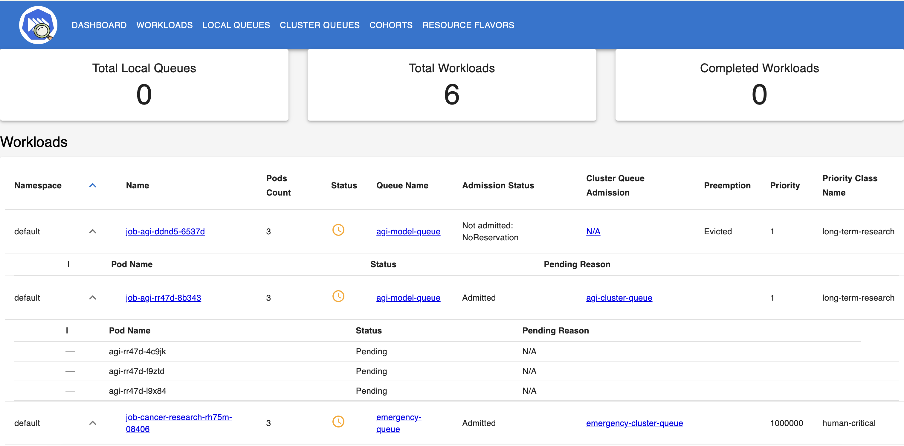

# KueueViz 

KueueViz is a visualization dashboard designed to provide real-time insights into Kueue, a Kubernetes-native job queueing system. It offers an intuitive UI to monitor workload statuses, queue utilization, resource allocation, and scheduling efficiency.

# Installation
To install KueueViz, just follow the [installation guide](INSTALL.md).

# Contribution
If you want to contribute to `KueueViz` please follow the 
[contributing guide](CONTRIBUTING.md)

