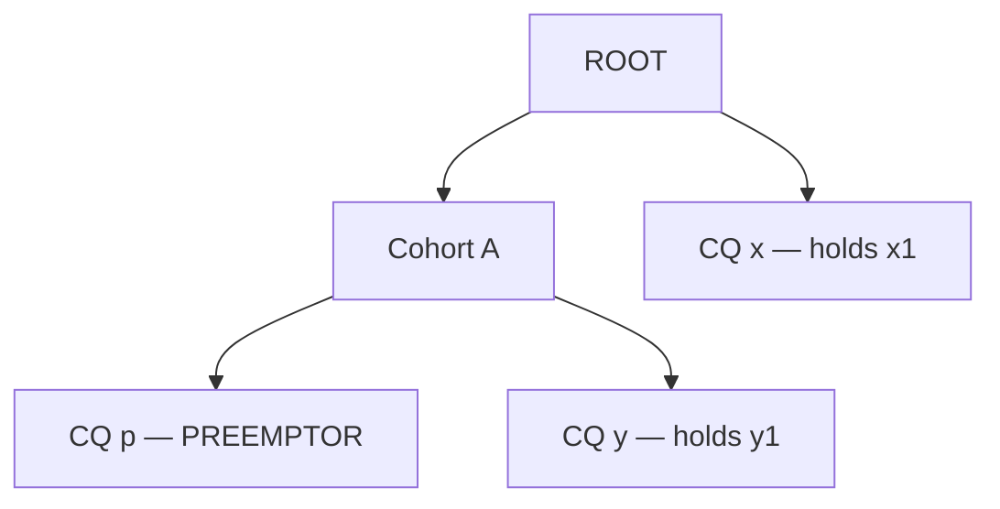

# Fair Sharing Preemption Loop Analysis (#14543)

This document diagnoses the fair sharing preemption loop in [issue #14543](https://github.com/kubernetes-sigs/kueue/issues/14543). It describes five candidate algorithms that prevent unfair cross-queue evictions and compares their trade-offs. The appendices describe the tests (Appendix A), the correctness results (Appendix B), the performance results (Appendix C), and the data sources (Appendix D).

---

## Problem Statement

### Bug Overview

In fair sharing preemption, an incoming workload can start an infinite preemption loop between two `ClusterQueue` (`CQ`) instances:

1. An incoming workload in `PREEMPTOR_CQ` evicts an **intra-CQ** workload (from the same queue). This lowers `PREEMPTOR_DRS` and unlocks a **cross-CQ** victim (from another queue).
2. The evicted intra-CQ workload returns to `PREEMPTOR_CQ`. It returns either immediately during `fillBackWorkloads`, or in the next scheduling cycle into the freed capacity.
3. `PREEMPTOR_CQ` returns to its higher **Dominant Resource Share (DRS)**. Then the evicted cross-CQ workload preempts the incoming workload back, and the cycle repeats.

#### Counter-Example (`CohortCapacity = 100 CPU`)

A cohort has `100 CPU` of total capacity and two queues (`QP` and `QT`). The cohort owns the `100 CPU`. Both queues have `nominalQuota = 0` and a fair sharing weight of 1, so all their usage is borrowed. As a result, the DRS of each queue is its usage divided by `100 CPU` (Kueue scales this value by 1000). The strategies are the default `[LessThanOrEqualToFinalShare, LessThanInitialShare]`:

| Queue | Admitted Workloads | Incoming Workload | Total Requested Usage |
| :--- | :--- | :--- | :--- |
| `QP` (Preemptor) | `P_small = 30 CPU` | `P_hero = 60 CPU` | `90 CPU` (`DRS = 0.90`) |
| `QT` (Target) | `T_hero = 70 CPU` | — | `70 CPU` (`DRS = 0.70`) |

When `P_hero` (`60 CPU`) arrives in `QP`, the preemption cycle occurs as follows:

1. **Candidate selection:** With `P_hero` included, `QP` requests `90 CPU` (`DRS = 0.90`). As a result, `QP` cannot preempt `T_hero` (`DRS = 0.70`). Instead, `QP` first evicts `P_small` (`30 CPU`), which lowers the DRS of `QP` to `0.60`. On the retry pass, `0.60 < 0.70` (`LessThanInitialShare`), so `QP` also selects `T_hero` (`70 CPU`) for eviction.
2. **Immediate cycle (current `fillBackWorkloads` behavior):** The eviction of `T_hero` freed `70 CPU`, so `fillBackWorkloads` restores `P_small` (`30 CPU`). `QP` admits `P_hero` together with `P_small` (`30 + 60 = 90 CPU`, `DRS = 0.90`). In the next cycle, `T_hero` (`0.70 < 0.90`) preempts `P_hero`.
3. **Delayed cycle (even if `fillBackWorkloads` blocks `P_small`):** Assume that a stricter `canFillBack` check prevents `fillBackWorkloads` from restoring `P_small`:
   - The scheduler evicts both `P_small` (`30 CPU`) and `T_hero` (`70 CPU`) and admits `P_hero` (`60 CPU`). The DRS of `QP` becomes `0.60`.
   - `40 CPU` of cohort capacity stay idle. `T_hero` (`70 CPU`) does not fit in `40 CPU`. It cannot preempt `P_hero` because `0.70 > 0.60`.
   - In the next scheduling cycle, the scheduler admits `P_small` (`30 CPU`) into the `40 CPU` of idle capacity. This raises `QP` back to `90 CPU` (`DRS = 0.90`).
   - `T_hero` now preempts `P_hero` (`0.70 < 0.90`), and the cycle repeats.

### Root Cause and Fair Sharing Proof Consideration

The bug starts in the two-pass candidate selection algorithm in [`pkg/scheduler/preemption/preemption.go`](https://github.com/kubernetes-sigs/kueue/blob/e0e3c3cf0727f76d95b8f31288cd8eab6cd7658a/pkg/scheduler/preemption/preemption.go#L533-L580):

1. **Pass 1 (Initial forward pass):** The preemptor cannot evict a cross-CQ candidate because `PREEMPTOR_DRS > TARGET_DRS`. Instead, the algorithm marks intra-CQ workloads for eviction. This decreases `PREEMPTOR_DRS`.
2. **Pass 2 (Re-evaluation pass):** The algorithm retries the cross-CQ candidate that it skipped before. The check `(PREEMPTOR_DRS - REMOVED_INTRA_CQ_SHARE) < TARGET_DRS` now passes.
3. **Fill-back or re-admission:** Either [`fillBackWorkloads`](https://github.com/kubernetes-sigs/kueue/blob/e0e3c3cf0727f76d95b8f31288cd8eab6cd7658a/pkg/scheduler/preemption/preemption.go#L340-L351) or the next scheduling cycle restores the evicted intra-CQ workload into the freed quota.

**Preemption-Based Fair Sharing Proof Consideration:** The [Proof That Two Workloads Will Not Preempt Each Other](https://kueue.sigs.k8s.io/docs/concepts/fair_sharing/#proof-that-two-workloads-wont-preempt-each-other) requires that the post-admission share of the preemptor queue (`DRS_A_admitted`) stays constant during the cross-CQ evaluation. Intra-CQ evictions reduce `PREEMPTOR_DRS` during the search. When those intra-CQ workloads return, `DRS_A_admitted` is different before and after preemption. This breaks the cycle-freedom invariant.

---

## Solutions at a Glance

1. **Fast Path Post-Check:** The scheduler runs the current search without changes. After `fillBackWorkloads`, it checks that each cross-CQ target is still fair in the final state. If one target fails, the scheduler refuses the preemption.
2. **Share Locking:** The scheduler freezes `PREEMPTOR_DRS` at its value before the search. Intra-CQ evictions still free capacity, but they cannot lower the share that cross-CQ checks use.
3. **Fast Path + Locking:** The scheduler runs Solution 1 first. If the post-check fails, it runs Solution 2 as a second pass.
4. **Iterative Offender Pruning:** The scheduler runs Solution 1. If a cross-CQ target fails the post-check, the scheduler removes that target from the candidates and searches again, up to a fixed number of passes.
5. **Level-Locked Search (AI-generated, not a proposal):** The scheduler tries 0, 1, 2, … evictions of its own workloads. At each level, it locks `PREEMPTOR_DRS` and searches only cross-CQ candidates. It returns the first target set that is fair in the final state.

The section [Possible Solutions](#possible-solutions) describes each solution in detail.

---

## Trade-Off Summary

The table below compares the five solutions. All numbers come from the tests in Appendix A. Appendices B and C give the full results.

| Property | 1. Fast Path Post-Check | 2. Share Locking | 3. Fast Path + Locking | 4. Iterative Offender Pruning | 5. Level-Locked Search |
| :--- | :---: | :---: | :---: | :---: | :---: |
| **Fixes #14543 without unfair loops** ¹ | Yes | Yes ² | Yes | Yes | Yes |
| **Intra-CQ preemptions allowed** | Yes | No | Yes | Yes | Yes |
| **Solved random scenarios** ³ | 98.37 % | 96.68 % | 98.58 % | 98.82 % | 98.89 % |
| **Case types that it refuses** ⁴ | Own-only, mixed, alternative set | Own-deflation, mixed, alternative set, stale victim share | Mixed, alternative set | None of the case types | None of the case types |
| **Worst case, compared with upstream** | 1.04× | 2.5× | 2.6× (#14543 trigger, refuses) | 5.1× (≥ 8 trap queues) | 14.6× (16 own candidates, no fixed limit) |

¹ No solution adds an unfair loop. Two loops do not occur in upstream: `cv1008` (Solutions 4 and 5) and `cv0123` (Solution 2). Each step in these two loops is fair (see Appendix B.3). TODO: compatibility with the `FairSharingPreemptWithinNominal` feature gate.

² Share Locking does not check the final state, so it keeps an upstream fault with stale target shares. This fault causes 8 counter-preemptions in the random tests and 10 loops in the simulator (see Appendix B).

³ The tests generate 4,576 small random scenarios, similar to fuzz tests. For each scenario, a brute-force checker tries every possible set of victims and marks the valid sets. The value is the percentage of scenarios with at least one valid set for which the solution returns a valid set. 2,892 of the 4,576 scenarios have at least one valid set. A refusal is safe: the workload stays pending and nothing is evicted. For comparison, upstream solves 98.61 %, but it also makes 49 unfair evictions. These do not count as solved.

⁴ Case types (see Appendix A.3):

- **Own-only:** The only fair answer evicts only own workloads of the preemptor.
- **Own-deflation:** Own workloads of the preemptor must stay evicted. Their eviction lowers the share of the preemptor and makes a cross-CQ eviction fair.
- **Mixed:** One own workload must stay evicted, and another own workload returns during fill-back.
- **Alternative set:** The first set that the search finds is unfair, but a different fair set exists.
- **Stale victim share:** A workload from the victim CQ returns during fill-back, so the victim share that the search used is out of date.

Solutions 4 and 5 pass all case types, but they still miss 34 and 32 random scenarios (see Appendix B.1).

---

## Possible Solutions

### 1. Fast Path Post-Check

- **Prototype diff:** TODO: add the reference to the prototype diff.

This solution keeps the current search and adds one check at the end. After `fillBackWorkloads`, the scheduler checks that each cross-CQ target is still fair in the final state.

#### Pseudo Code

```text
// Select candidates for preemption (current search)
targets <- SELECT PREEMPTION CANDIDATES

// Restore non-essential evicted workloads
targets <- fillBackWorkloads(targets)

// New step: check each cross-CQ target in the final state
if findUnfairTarget(targets) is None:
  return targets
return [] // Refuse the incoming workload
```

`findUnfairTarget` uses the final state `F`: the admitted workloads, minus the targets, plus the incoming workload. For each cross-CQ target `t`, it runs the configured strategy at the `almostLCA` with these shares:

- Preemptor share: `DRS(F)`.
- Old target share: `DRS(F + t)`.
- New target share: `DRS(F)`.

It returns the first target that fails, or `None`. Solutions 3, 4, and 5 use the same check.

#### Observations and Limitations

- **Why it works:** The check refuses each target set that is not fair after fill-back. This prevents `#14543` preemption loops.
- **All or nothing:** If the search selects one unfair cross-CQ target, the full preemption fails (`return []`). This occurs even when a fair set exists in other queues.
- **No retry:** The algorithm cannot remove the unfair target and search again.
- **Test results:** It fixes `#14543` (0 violations). It solves 98.37 % of the solvable random scenarios. It refuses all 186 own-only cases and 39 of the 40 mixed cases. In the normal case, its cost is the same as upstream.

---

### 2. Share Locking

- **Prototype diff:** TODO: add the reference to the prototype diff.

The locking approach freezes `PREEMPTOR_DRS` at its post-admission value during cross-CQ comparisons. This value is the DRS of `PREEMPTOR_CQ` with the usage of the incoming workload added. The scheduler can still evict intra-CQ candidates to free capacity, but their removal does not decrease `PREEMPTOR_DRS`. `PREEMPTOR_DRS` never decreases during the search. As a result, intra-CQ evictions cannot unlock unfair cross-CQ victims.

#### Pseudo Code

```text
// Lock preemptor DRS at its current usage plus the incoming workload
LOCKED_PREEMPTOR_DRS <- DRS(PREEMPTOR_CQ usage + INCOMING_WORKLOAD request)

targets <- []
for candidate in candidates:
  if candidate is INTRA_CQ:
    // Evict for capacity, but keep LOCKED_PREEMPTOR_DRS unchanged
    REMOVE candidate FROM SNAPSHOT
    APPEND candidate TO targets
  else if candidate passes strategy using LOCKED_PREEMPTOR_DRS:
    REMOVE candidate FROM SNAPSHOT
    APPEND candidate TO targets

  if WORKLOAD_FITS:
    targets <- fillBackWorkloads(targets)
    return targets

// Deny incoming workload admission
return []
```

#### Observations and Limitations

- **Why it works:** The share of the preemptor cannot decrease during the search. This keeps the constant-share rule of the fair sharing proof. In the counter-example (`CohortCapacity = 100`), the locked DRS of `QP` stays at `0.90 > 0.70`. This prevents `P_hero` from preempting `T_hero`.
- **Blocks valid intra-CQ deflation:** Sometimes an intra-CQ workload must stay evicted in the final state. Locking prevents that eviction from lowering `PREEMPTOR_DRS`. As a result, the scheduler misses valid cross-CQ evictions that depend on intra-CQ preemption.
- **Nested cohorts:** The share of each parent cohort is frozen too. A valid eviction from a sibling CQ cannot lower the share of the parent cohort. As a result, this eviction cannot unlock victims in other cohorts.
- **Test results:** It fixes `#14543` (0 violations). It does not check the final state, so it keeps an upstream fault with stale target shares. In the random tests, this fault causes 22 unfair evictions and 8 counter-preemptions (Appendix B.1). In the simulator, it causes 169 unfair steps and 10 loops (Appendix B.3). It refuses all 734 own-deflation cases and solves the fewest random scenarios (96.68 %). In the normal case, its cost is the same as upstream. On the `#14543` trigger, its cost is 2.5× upstream.

#### Hierarchical Cohort Extension

In a single-cohort setup, it is sufficient to lock only the DRS of the preemptor `ClusterQueue`. In a multi-cohort hierarchy, a lock at the `ClusterQueue` level alone still allows a cross-cohort preemption cycle:



If only the DRS of `CQ p` is locked, the same preemption loop can occur across cohorts:

1. `CQ p` first evicts `y1` from the sibling `CQ y` inside `Cohort A`.
2. The eviction of `y1` lowers the DRS of `Cohort A`. This unlocks `x1` in `CQ x` on the retry pass.
3. `fillBackWorkloads` (or the next scheduling cycle) restores `y1` into `CQ y`. This increases the DRS of `Cohort A` again, and `x1` preempts the workload of `CQ p` in return.

To prevent cross-cohort cycles, the algorithm records a locked initial DRS for each node on the ancestor path of the preemptor. For each target, the algorithm reads the locked DRS at the `almostLCA` of the preemptor (the child of the Least Common Ancestor):

- When `CQ p` evaluates `y1` in `CQ y`, the `almostLCA` of the preemptor is `CQ p`. The check uses the locked DRS of `CQ p`.
- When `CQ p` evaluates `x1` in `CQ x`, the `almostLCA` of the preemptor is `Cohort A`. The check uses the locked DRS of `Cohort A`, which the eviction of `y1` does not change.

---

### 3. Fast Path Post-Check with Locking Fallback

This solution runs **Solution 1 (Fast Path Post-Check)** first. If the check passes, the scheduler returns those targets. If the check fails, the scheduler runs **Solution 2 (Share Locking)** as a second search. If both searches fail, the scheduler refuses the admission.

#### Pseudo Code

```text
// Pass 1: Solution 1 (search, fill-back, final-state check)
targets <- FAST_PATH_SEARCH(candidates)
if targets is not empty:
  return targets

// Pass 2: locked-share search, then the same final-state check
targets <- fillBackWorkloads(LOCKED_SEARCH(candidates))
if targets is not empty and findUnfairTarget(targets) is None:
  return targets

return []
```

#### Observations and Limitations

- **Why it improves on Solutions 1 and 2:** It combines the strengths of both. Pass 1 (Fast Path) accepts intra-CQ evictions when the selected targets stay fair after fill-back. Pass 2 (Locking) helps when Pass 1 selects a cross-CQ target that fails the check after fill-back.
- **Fails on mixed cases:** Assume that `PREEMPTOR_CQ` has a large own workload `p1` (which stays evicted) and a small own workload `p2` (which fills back). Pass 1 fails because `p2` fills back and makes the selected cross-CQ target unfair. Pass 2 also fails because locking prevents `p1` from lowering the DRS of `PREEMPTOR_CQ`.
- **Both passes use the final-state check:** As a result, Solution 3 does not keep the stale-share fault of Solution 2.
- **Double search cost:** Each refusal runs two full searches.
- **Test results:** It fixes `#14543` (0 violations) and adds no unfair loops. It solves 98.58 % of the solvable random scenarios. It solves all own-only and own-deflation cases, but only 1 of the 40 mixed cases. Each refusal runs two searches: 1.7× to 1.9× upstream on normal refusals, and 2.6× on the `#14543` trigger.

---

### 4. Iterative Offender Pruning

This solution extends Solution 1. When the check fails, it does not stop. It removes the unfair target from the candidates for good, and searches again.

In pass 1, the algorithm runs the normal search, runs `fillBackWorkloads`, and checks the final state. This iteration is identical to **Solution 1: Fast Path Post-Check**. If all targets are valid, it returns them immediately. If a cross-CQ target fails the check after fill-back, the algorithm marks that target as the **offender**. Then it removes the offender from the candidates and searches again, up to `MAX_PASSES` times (for example, 8 passes).

#### Pseudo Code

```text
candidates <- ALL LEGAL PREEMPTION CANDIDATES

for iteration from 1 to MAX_PASSES:
  // Standard candidate selection (Pass 1: S2-a, Pass 2: S2-b retry)
  targets <- SELECT PREEMPTION CANDIDATES(candidates)

  if not WORKLOAD_FITS:
    return [] // Insufficient resources

  // Restore non-essential workloads
  targets <- fillBackWorkloads(targets)

  // Validate fairness in the post-fillback state
  offender <- findUnfairTarget(targets)

  if offender is None:
    return targets // All targets are fair in the final state

  // Permanently prune the unfair target and retry
  candidates <- REMOVE offender FROM candidates

// Deny admission if max passes exceeded
return []
```

#### Observations and Limitations

- **Why it improves on Fast Path Post-Check:** Sometimes a pass selects a cross-CQ target that becomes unfair after fill-back (an **offender**). The algorithm does not stop. It removes the offender and searches again for a different fair cross-CQ victim.
- **Why it improves on Share Locking:** When the own workloads of the preemptor stay evicted and reduce `PREEMPTOR_DRS`, the algorithm allows those intra-CQ preemptions.
- **One-by-one offender pruning (`MAX_PASSES` limit):** Each failed pass removes only one offender (`findUnfairTarget(targets)`). Temporary DRS deflation can make several cross-CQ candidates look valid during the search. After `fillBackWorkloads` restores the intra-CQ workload, each of these candidates fails the check. The algorithm must run one search pass for each offender. If the number of offenders is more than `MAX_PASSES`, admission fails.
- **Share recalculation after fill-back (low cost):** `fillBackWorkloads` and offender removal change the queue usage. As a result, the check cannot use the shares that the search saved. The check changes only one usage entry in the snapshot to recalculate the DRS of the target `almostLCA`, so the cost is small.
- **Test results:** It fixes `#14543` (0 violations) and adds no unfair loops. It solves 98.82 % of the solvable random scenarios and all 40 mixed cases. With 8 or more trap queues, it costs 5.1× upstream and then refuses.

---

### 5. Level-Locked Search with Local Pruning (`v3.1` — AI-Generated, Not a Proposal)

> **Disclaimer:** This solution is not a proposal. The author designed Solutions 1 to 4. An AI model (Claude Opus) proposed this fifth approach as a refinement of **4. Iterative Offender Pruning**. AI agents also ran all of its tests. The author did not validate its code or its test results. Treat it only as a possible direction that solves more test cases. Do not treat it as a recommended fix.
>
> **Overfitting risk:** This approach can overfit the test cases that the AI used during its design. It is not a new algorithmic model. It adds targeted patches to **4. Iterative Offender Pruning**.

Level-Locked Search steps through the number of evicted intra-CQ workloads. It does not permanently prune cross-CQ offenders across passes:

1. **Fast path:** Run the standard candidate search, run `fillBackWorkloads`, and check all targets against the exact snapshot after fill-back (`findUnfairTarget`). If each target is valid, return the targets immediately.
2. **Slow path (level search):** Divide the candidates into `own` (from `PREEMPTOR_CQ`) and `cross` (from other queues). Step through each intra-CQ eviction level `k = 0 ... len(own)`.
3. **Level run:** At level `k`, evict the prefix `own[:k]` first. Lock the DRS of `PREEMPTOR_CQ` at that snapshot, and search only `cross` candidates. `levelCross` contains no `own` candidates, so the DRS of `PREEMPTOR_CQ` cannot decrease during the search. Each target queue with `PREEMPTOR_DRS > TARGET_DRS` fails the strategy check during candidate selection. As a result, the search skips all workloads in those queues in one pass.
4. **Check after fill-back, and local pruning at level `k`:** Run `fillBackWorkloads` and check the fairness of all remaining targets (`offender <- findUnfairTarget(targets)`):
   - **If all targets are valid (`offender is None`):** Return `targets` immediately, even if `fillBackWorkloads` restored part of `own[:k]`.
   - **If the check fails (`offender is not None`) and part of `own[:k]` filled back:** A large cross-CQ target freed more capacity than necessary and let an `own[:k]` workload return. Remove the last selected cross-CQ target (`last(crossTargets)`) from `levelCross` and retry level `k`.
   - **If the check fails (`offender is not None`) and all of `own[:k]` stayed evicted:** Remove `offender` from `levelCross` and retry level `k`.
   - When the search moves to level `k + 1`, it restores the full `cross` candidate pool.

#### Pseudo Code

```text
candidates <- ALL LEGAL PREEMPTION CANDIDATES

// Fast path: standard search + exact final-state validation
targets <- SELECT PREEMPTION CANDIDATES(candidates)
if not WORKLOAD_FITS:
  return []
targets <- fillBackWorkloads(targets)
if findUnfairTarget(targets) is None:
  return targets

// Slow path: split into intra-CQ (own) and cross-CQ (cross) candidates
own, cross <- SPLIT_BY_CQ(candidates, PREEMPTOR_CQ)

for k from 0 to len(own):
  levelCross <- COPY(cross) // Restore full cross-CQ pool at each level k

  while True:
    // Evict own[:k] up front and lock PREEMPTOR_CQ share at level k
    REMOVE own[:k] FROM SNAPSHOT
    LOCK PREEMPTOR_CQ DRS AT CURRENT SNAPSHOT

    crossTargets <- SELECT PREEMPTION CANDIDATES(levelCross)
    targets <- own[:k] + crossTargets
    if not WORKLOAD_FITS:
      break // Advance to level k + 1

    targets <- fillBackWorkloads(targets)
    offender <- findUnfairTarget(targets)
    if offender is None:
      return targets // Valid target set found

    // Local pruning within level k
    if NOT ALL own[:k] KEPT IN targets:
      // Overshoot allowed an own[:k] workload to fill back -> drop last cross target
      levelCross <- REMOVE last(crossTargets) FROM levelCross
    else:
      // Prefix held, but offender failed final-state fairness -> drop offender
      levelCross <- REMOVE offender FROM levelCross

return []
```

#### Observations and Limitations

- **No permanent pruning across levels:** Exclusions in `levelCross` apply only to level `k`. At `k = 1`, `PREEMPTOR_CQ` has a lower final DRS, so a cross-CQ target that level `k = 0` rejected returns to the candidate pool.
- **No one-by-one offender pruning:** `PREEMPTOR_DRS` stays locked at level `k`. As a result, the search rejects each target queue with `PREEMPTOR_DRS > TARGET_DRS` during candidate selection. The search skips all workloads in those queues at the same time, not one by one after fill-back.
- **Known limitation — missed valid sets:** The level search evicts own workloads in a fixed order (lowest priority first). When a level frees too much capacity, it drops the last cross-CQ target. Both rules are heuristics. Two review counterexamples (`CE3` and `CE4`) have exactly one valid set, and Solution 5 refuses both. Solution 4 refuses them too.
- **Known limitation — ancestor cohort locking in hierarchies:** In the slow path, the algorithm locks shares along the ancestor path of `PREEMPTOR_CQ`. When the level-`k` pass evicts a sibling queue inside the same ancestor cohort, the DRS of the ancestor cohort stays frozen.
- **Test results (AI-run, not validated by the author):** It fixes `#14543` (0 violations) and adds no unfair loops. It solves the most random scenarios (98.89 %), and each case that it misses is also missed by Solutions 1, 3, and 4. It is not complete: it misses 32 solvable random scenarios. In the normal case, its cost is the same as upstream. Its worst case grows by approximately 4.7 ms for each own candidate (14.6× upstream with 16 own candidates), and the algorithm has no fixed limit.

---

## Appendix A: Tests

> **Disclaimer:** AI agents wrote the test code, ran all tests in Appendices A to C, and collected the numbers. The author reviewed the test design, the results, and the explanations of the failures. The author did not run the tests again and did not review the test code line by line. Use the results to compare how many cases each solution solves, not as a formal proof of correctness.

Each test calls the real `Preemptor.GetTargets` function of each solution. Each test scenario is a JSON file. It describes the cohorts, the `ClusterQueues`, the admitted workloads, and one incoming workload.

### A.1 Test Types

1. **Random tests (4,576 scenarios).** A generator makes small random scenarios, similar to fuzz tests. Each scenario has 1 to 12 workloads that the scheduler can evict. A brute-force checker tries each possible set of these workloads and finds the valid sets (see A.2).
   - **Pass:** The solution returns a valid set.
   - **Miss:** A valid set exists, but the solution returns nothing. A miss is not a bug. The workload stays pending, and nothing is evicted.
   - **Bug:** The solution returns a set that is not valid.
2. **Named test sets.** Hand-made and generated scenarios from earlier rounds of this analysis. Each set tests one case type (see A.3).
3. **Multi-cycle simulator.** The simulator replays scheduling cycles. In each cycle, it admits one workload or preempts for it. It stops when nothing changes, or after 50 cycles. The simulator runs 15,645 scenarios.

Two terms describe cycles:

- **Counter-preemption:** In the random tests, an evicted workload can evict the incoming workload back when it returns to the queue. This is one step.
- **Loop:** In the simulator, a cluster state repeats.

Each solution runs more than once on each scenario. This finds results that change with Go map order.

### A.2 Valid Set

The checker looks at the final state: the admitted workloads, minus the evicted workloads, plus the incoming workload. A set of evicted workloads is valid when all of these rules are true:

| Rule | Meaning |
| :--- | :--- |
| Fits | The incoming workload fits. |
| Minimal | The scheduler cannot put back any evicted workload. |
| Fair | Each eviction from another CQ is fair in the final state. |
| No #14543 | Each eviction from another CQ is fair when compared with the final share of the preemptor. A failure of this rule is the #14543 bug. |
| No counter-preemption | No evicted workload can evict the incoming workload back when it returns to the queue. |

### A.3 Case Types

| Case type | Scenarios | What the test checks | Expected result |
| :--- | ---: | :--- | :--- |
| Own-only | 186 | The only fair answer evicts only workloads from the preemptor's own CQ. Upstream picks an unfair workload from another CQ instead. | Admit |
| Own-deflation | 734 | Own workloads must stay evicted. This lowers the share of the preemptor, so an eviction from another CQ is fair. | Admit |
| Mixed | 40 | One own workload must stay evicted. Another own workload comes back during fill-back. | Admit |
| Cycle-only | 10 | Each possible set causes a counter-preemption. | Refuse |
| Alternative set | 10 | The first set that the search finds is unfair. A different fair set exists. | Admit |
| Stale victim share | 10 | A workload from the victim CQ comes back during fill-back. The victim share that the search used is then out of date. | Admit |
| Stale victim share, nested cohorts | 10 | Same as the row above, in nested cohorts. | Admit |
| Nested cohorts | 154 | #14543 in nested cohorts. | Refuse (4 admit) |

---

## Appendix B: Correctness Results

### B.1 Random Tests (4,576 scenarios)

| | Upstream | 1. Fast Path | 2. Locking | 3. Fast Path + Locking | 4. Pruning | 5. Level-Locked |
| :--- | ---: | ---: | ---: | ---: | ---: | ---: |
| Unfair evictions from #14543 | 22 | 0 | 0 | 0 | 0 | 0 |
| Unfair evictions in the final state | 49 | 0 | 22 | 0 | 0 | 0 |
| Counter-preemptions | 11 | 0 | 8 | 0 | 0 | 0 |
| Solved scenarios | 98.61 % | 98.37 % | 96.68 % | 98.58 % | 98.82 % | 98.89 % |
| Misses (safe refusals) | 25 | 47 | 92 | 41 | 34 | 32 |

No solution solves each scenario. Each scenario that Solution 5 misses, Solutions 1, 3, and 4 also miss. The cause is the order in which upstream picks candidates.

### B.2 Case Types (passed / total)

| Case type | Upstream | 1. Fast Path | 2. Locking | 3. Fast Path + Locking | 4. Pruning | 5. Level-Locked |
| :--- | :---: | :---: | :---: | :---: | :---: | :---: |
| Own-only (186) | 0 | 0 | 186 | 186 | 186 | 186 |
| Own-deflation (734) | 733 | 733 | 0 | 733 | 733 | 733 |
| Mixed (40) | 1 | 1 | 0 | 1 | 40 | 40 |
| Cycle-only (10, refuse) | 0 | 10 | 10 | 10 | 10 | 10 |
| Alternative set (10) | 0 | 0 | 0 | 0 | 10 | 10 |
| Stale victim share (10) | 10 | 10 | 8 | 10 | 10 | 10 |
| Stale victim share, nested cohorts (10) | 8 | 8 | 6 | 8 | 10 | 8 |
| Nested cohorts (154) | 12 | 154 | 150 | 154 | 154 | 154 |

- **Own-deflation:** The one miss is a scenario whose result changes with Go map order.
- **Stale victim share, nested cohorts:** 2 scenarios start with more usage than capacity. Their expected result is not clear.

### B.3 Remaining Loops

| | Upstream | 1. Fast Path | 2. Locking | 3. Fast Path + Locking | 4. Pruning | 5. Level-Locked |
| :--- | ---: | ---: | ---: | ---: | ---: | ---: |
| Loops (15,645 scenarios) | 29 | 17 | 25 | 17 | 18 | 19 |
| Loops from #14543 | 0 ¹ | 0 | 0 | 0 | 0 | 0 |
| Unfair eviction steps | 1,568 | 0 | 169 | 0 | 0 | 0 |

¹ Upstream makes single unfair steps from #14543 (see the next row). In these tests, the steps do not repeat into loops.

**Share Locking faults.** Share Locking does not check the final state, so it keeps an upstream fault. When it evicts two workloads from the same CQ, it judges the first eviction with the old share of that CQ. In the random tests, this fault causes 22 unfair evictions and 8 counter-preemptions. In the simulator, it causes 169 unfair steps and 10 loops. None of them comes from #14543.

**Fair loops.** Each step in the other loops of Solutions 1, 3, 4, and 5 is fair. Upstream has 16 of these loops too. Usually, a fair eviction from another CQ removes a high-priority workload. Then priority preemption inside that CQ reverses the eviction. Only two fair loops do not occur in upstream: `cv1008` (Solutions 4 and 5) and `cv0123` (Solution 2).

---

## Appendix C: Performance Results

### C.1 Complexity of One `GetTargets` Call

Symbols:

- `W`: admitted workloads.
- `N`: candidates (workloads that the scheduler can evict).
- `m`: candidates in the preemptor's own CQ.
- `T`: evicted workloads in the result.
- `Q`, `H`, `R`: CQs, cohort depth, and resources.
- `S`: one search. `S*`: one worst-case search, `O(N·Q·H·R)`.
- **Trap queue:** a CQ with an eviction that looks fair during the search but is unfair after fill-back.

| Solution | Normal case | Worst case | When the worst case occurs |
| :--- | :--- | :--- | :--- |
| Upstream | `O(W + N log N + S)` | `O(W + N log N + S*)` | The search evicts each candidate. |
| 1. Fast Path Post-Check | Upstream + `O(T·H·R)` check | Same as upstream | One search and one check. |
| 2. Share Locking | Upstream + `O(H²·R)` | Same as upstream | One search. |
| 3. Fast Path + Locking | Same as Solution 1 | `O(W + N log N + 2·S*)` | Each refusal runs two searches. |
| 4. Iterative Offender Pruning | Same as Solution 1 | `O(W + N log N + 8·(N + S*))` | 8 or more trap queues. Then it refuses. |
| 5. Level-Locked Search | Same as Solution 1 | Up to `O(W + (m+1)·N·S*)` | The first search is unfair, and the preemptor's own CQ has many candidates. |

### C.2 Measured Cost

Each cell shows the median time, compared with upstream. "–" means no significant difference (p < 0.05). Each test has 1,000 workloads, unless the row gives a different number.

| Case | Upstream | 1. Fast Path | 2. Locking | 3. Fast Path + Locking | 4. Pruning | 5. Level-Locked |
| :--- | ---: | ---: | ---: | ---: | ---: | ---: |
| Normal case, 100 workloads | 0.36 ms | – | – | – | – | – |
| Normal case, 1,000 workloads | 3.38 ms | – | – | – | – | – |
| Normal case, 5,000 workloads | 25.2 ms | – | – | – | – | – |
| 3 cohort levels, 60 CQs | 2.67 ms | – | – | – | – | – |
| Refusal (not enough capacity) | 21.1 ms | 1.04× | – | 1.85× | – | – |
| #14543 trigger | 2.59 ms (unfair) | – (refuses) | 2.53× (refuses) | 2.61× (refuses) | 2.57× (admits) | 3.93× (admits) |
| 8 trap queues | 6.83 ms (unfair) | – (refuses) | – (refuses) | 1.73× (refuses) | 5.14× (refuses) | 2.10× (admits) |
| 16 own candidates, no fair set | 6.11 ms (unfair) | – | – | 1.79× | 1.81× | 14.61× |

- **Normal case:** Time grows linearly with the number of admitted workloads, by about 5.1 µs for each workload. The added check is too small to measure at 100 or more workloads. At 10 workloads, the solutions with a check are 7 % to 9 % slower (about 20 µs).
- **Retries:** Each retry costs one full search, about 4.7 ms at 1,000 workloads. If the workload stays pending, the scheduler pays this cost again in each cycle.
- **Scale:** The scheduler snapshot costs 0.39 ms at 1,000 workloads. One upstream `GetTargets` call costs 8.7 times more.
- **Limits:** The tests ran on a virtual machine, with one CPU for each benchmark. The results use 10 rounds on an idle machine. Time noise is 2 % to 69 % per case. Allocation counts are exact.

---

## Appendix D: Data Sources

- **Results:** `~/Documents/problem-discovery/artifacts/kueue-14543-solc/final_eval/` (`test_catalogue.md`, `correctness.md`, `performance.md`, `gate_diag/gate_diag.md`).
- **Which run gives which numbers:** The random-test and multi-cycle numbers come from `gate_diag/oracle_gate_off_agg.json`. That run uses the real flavor-assigner rule to decide which resources need preemption. The case-type and performance numbers come from `correctness.md` and `performance.md`.
- **Test set IDs:** Own-only = `Q1`. Own-deflation = `Q2`. Mixed = `agent_bt`. Cycle-only = `bt_fc1`. Alternative set = `bt_fc2`. Stale victim share = `fc3`. Stale victim share, nested cohorts = `fc4` (`fc4_05` and `fc4_07` have the unclear input). Nested cohorts = `D2..DP`.
- **Solution code:** `~/kueue-variants/{base,trivial,lock,fallback,backtrack,v3.1}`.
- **Diffs:** `~/Documents/problem-discovery/artifacts/kueue-14543-solc/verification/` (`trivial_fixed.diff`, `lock_fixed.diff`, `fallback_fixed.diff`, `backtrack_v2.diff`, `v3.1.diff`).
