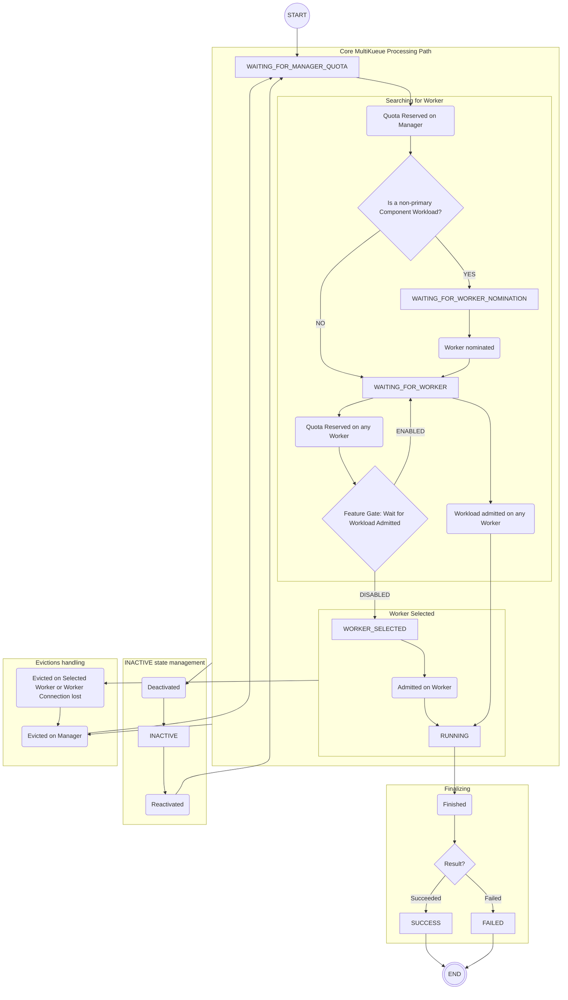

# KEP-10189: MultiKueue Global Status Condition

<!-- toc -->
- [Summary](#summary)
- [Motivation](#motivation)
  - [Goals](#goals)
  - [Non-Goals](#non-goals)
- [Proposal](#proposal)
  - [User Stories](#user-stories)
    - [Story 1](#story-1)
    - [Story 2](#story-2)
  - [Notes/Constraints/Caveats](#notesconstraintscaveats)
  - [Risks and Mitigations](#risks-and-mitigations)
- [Design Details](#design-details)
  - [MultiKueue Workload Status Condition](#multikueue-workload-status-condition)
  - [Global Status Summary](#global-status-summary)
  - [Test Plan](#test-plan)
    - [Unit tests](#unit-tests)
    - [Integration tests](#integration-tests)
    - [e2e tests](#e2e-tests)
  - [Graduation Criteria](#graduation-criteria)
- [Implementation History](#implementation-history)
- [Drawbacks](#drawbacks)
- [Alternatives](#alternatives)
  - [Visibility API](#visibility-api)
  - [Consolidated Workload State](#consolidated-workload-state)
  - [Granular Conditions](#granular-conditions)
    - [AdmittedInWorker Condition](#admittedinworker-condition)
    - [Condition per status](#condition-per-status)
    - [Disadvantages](#disadvantages)
<!-- /toc -->

## Summary

The Workload status in the MultiKueue Manager Cluster must reflect the true state of the workload derived from the Worker Clusters,
including a human-readable message explaining the state (e.g., "Waiting for quota in cluster X").

This KEP focuses on a mechanism to provide such a high-level summary in the form of a new Workload Status Condition - the **MultiKueueWorkload** condition. Later the condition will be replaced in favor of a Global Status Summary Structure: either as a new Workload Status Field or a separate resource. The decision is to be made based on implementation feedback.

The initial condition:
1. Will be populated for workloads created on the Manager Cluster.
2. Will provide a high-level, human-readable message explaining the state of the Manager Workload.
3. Will provide insights into the Workload's progress throughout its **whole lifecycle**.
4. Will aggregate information from all the Remote Workloads dispatched by MultiKueue to Worker Clusters for the subject Manager Workload.

The final Global Status Summary Structure will be populated in an analogous way. It may be extended with additional fields based on requirements and feedback.

## Motivation

Currently, the Workload status subresource is missing key information aggregating data from its remote counterparts on Worker Clusters. The users are forced to rely on:
* the conditions of the Manager Workload, which are misaligned and non-representative of the extensive logic in MultiKueue,
* manually querying and aggregating the conditions of Remote Workloads across all registered workers; this covers a lot of distributed data, and users lack core information about which workers are eligible for dispatch by virtue of being put forward by the dispatch strategy.

To address this, we need a way to present users with a clearly defined, human-readable summary of the global state, which aggregates information from all clusters in the MultiKueue environment.

### Goals

* Adding a new Workload Status Condition describing the current, actual state of the Manager Workload.
* Defining an enumeration of mutually exclusive MultiKueue Manager Workload states covering the whole lifecycle of the workload.
* Defining a set of high-level, human-readable messages to accompany the enumerated states, describing them further.
* Populating the condition for relevant workloads.

### Non-Goals

* Defining Status Summary describing data structures beyond what's necessary for implementing the new Workload Status Condition.

## Proposal

The lifecycle of the Manager Workload will be split into the following **MultiKueueGlobalStatus** enumeration:
* **SUCCESS** - workload finished successfully,
* **FAILED** - workload finished with failed state,
* **INACTIVE** - Manager Workload marked as inactive, preventing it from being scheduled; we can enter this state from any other as the workload can be deactivated both by Kueue and by the user,
* **RUNNING** - local workload is admitted (has the admitted condition); a single worker was selected; the remote is admitted (has the admitted condition); the underlying job will attempt to execute; if it finishes we transition into the SUCCESS/FAILED state, otherwise we back-off,
* **WORKER_SELECTED** - local workload is admitted (has the admitted condition); a single worker was selected; the remote has currently received quota but is not admitted yet;
this is possible if the MultiKueueWaitForWorkloadAdmitted feature is disabled,
* **WAITING_FOR_WORKER** -  quota reserved on the local workload; dispatching remotes to nominated workers and waiting for one of them to be selected - a worker will be selected once the remote achieves a state allowing it to graduate to either the WORKER_SELECTED (receiving quota reservation, MultiKueueWaitForWorkloadAdmitted feature gate disabled) or the RUNNING (workload receives the admitted condition set to true) state,
* **WAITING_FOR_WORKER_NOMINATION** - specific to a non-primary component workload in the multi-workload-resource handling scenario;  quota reserved on the component workload; the component workload is waiting for the primary to select a worker to create a remote on,
* **WAITING_FOR_MANAGER_QUOTA** - local workload is waiting to be granted a quota reservation on the Manager Cluster.



For each MultiKueueGlobalStatus a message - **MultiKueueGlobalStatusMessage** - will be defined:
* SUCCESS: `Workload has finished successfully on Worker Cluster: <worker cluster reference>.`
* FAILED: `Workload failed after admission on Worker Cluster: <worker cluster reference>.`
* INACTIVE: `Workload inactive: <reason>.`
* RUNNING: `Workload admitted on Worker Cluster: <worker cluster reference>.`
* WORKER_SELECTED: `Workload received quota reservation on Worker Cluster: <worker cluster reference>. <number of ready admission checks>/<number of all admission checks> Admission Checks Ready.`
* WAITING_FOR_WORKER:
  * Default:
  `Workload awaiting admission on one of the registered Workers. <number of remotes> Remote Workloads created.`
  * Non-primary component workload:
  `<multi-workload resource type name> Workload awaiting admission on Worker Cluster: <worker selected by the primary local workload>, selected by the <multi-workload resource type name> primary workload: <primary local workload reference>.`
* WAITING_FOR_WORKER_NOMINATION: `<multi-workload resource type name> Workload waiting for <primary local workload reference> to select a Worker Cluster.`
* WAITING_FOR_MANAGER_QUOTA: `Workload awaiting quota on the Manager Cluster.`

The **MultiKueueWorkload** condition will be defined as:
|Field|Value|
|---|---|
|Type|_MultiKueueWorkload_|
|Status|_True_|
|Reason|MultiKueueGlobalStatus|
|Message|MultiKueueGlobalStatusMessage|

The condition will be gated behind the **MultiKueueGlobalStatusCondition** feature gate.

The Global Status Summary structure at its simplest will provide the same information as the initial MultiKueueWorkload condition. It may be extended with additional fields based on requirements and feedback.

### User Stories

#### Story 1

_I want to get an idea of when my job will be admitted. Has it already received quota on the manager?
Is it being dispatched? If yes - what are the workers it has been dispatched to, so that I can check the status of some or all of them for how my job is doing there?
Or maybe it is already running on a specific worker? If yes - which one?_

Currently to do this I need to query multiple clusters and sift through a set of Conditions on each of them to get an idea on what is the actual status of my job’s execution.
The existing Conditions and AdmissionChecks provide little information at the most complex and expansive stage of the Manager Workload’s lifecycle, when MK dispatches workloads to Workers waiting for one to Admit the Remote.

#### Story 2

_My job hasn’t been admitted for a long time. I would like to verify why that is.
Are remotes being created? Have they been dispatched to all workers? What is their status there? Are they waiting for quota? Are they waiting for admission checks?_

As in [Story 1](#story-1), I have to query multiple workers to verify which one is troublesome, sifting through their WorkloadStatus and Conditions within.

### Notes/Constraints/Caveats

This proposal is limited to only providing the user with a high-level summary.
This is a minimum value proposition, lacking in a few key areas:
* In the WAITING_FOR_WORKER state we only provide a minuscule summary of what is happening on the Workers. In reality, this state is much more complex than the messages we propose can describe and could greatly benefit from being accompanied by a set of aggregations describing in greater detail what is the status of each Remote Workload.
* In an effort to keep the condition message concise, we are limited in how much data relevant to the user we can provide. Depending on the feedback we receive, this could be expanded upon in the future as part of Alpha-2.

### Risks and Mitigations

The main risk of the feature is its effect on the MultiKueue Reconciler's performance and code complexity.
Implementing the condition calculating logic efficiently will require careful consideration of where the Reconciler can reliably determine the state of the Manager Workload.
That may necessitate distributing pieces of logic across functions, complicating the already convoluted logic. Mitigating that will require careful naming and code grouping in the implementation phase.

Another issue stems from the MultiKueue's complex logic itself. It may prove difficult to reliably track the actual state due to the branching nature of the functions.
Countering that will require thorough test coverage, with a special emphasis on implementing a wide coverage in E2E tests.

## Design Details

Implementation will be split into two phases:
- Alpha-1: Implementing the condition and the logic to populate it.
- Alpha-2: Implementing the Global Status Summary structure. The final format of the structure's placement will be determined at this stage.

### MultiKueue Workload Status Condition

The new condition type will be defined alongside existing ones in the workload types file.

```go
const (
  // ...

  // MultiKueueWorkload means the workload is a MultiKueue Workload created on a Manager Cluster.
  // The possible reasons depend on the state of the MK Workload:
  // - Success,
  // - Failed,
  // - Inactive,
  // - Running,
  // - WorkerSelected,
  // - WaitingForWorker,
  // - WaitingForWorkerNomination,
  // - WaitingForManagerQuota.
  MultiKueueWorkload = "MultiKueueWorkload"

  // ...
)
```

The MultiKueueGlobalStatus enumeration will be defined in the MultiKueue types file.

```go
const (
  // Success state means the workload has finished successfully.
  Success = "Success"

  // Failed state means the workload has finished with the Failed state.
  Failed = "Failed"

  // Inactive state means the workload is inactive.
  Inactive = "Inactive"

  // Running state means the workload has the "Admitted" condition on the Manager Cluster and was admitted on a specific Worker Cluster.
  // The underlying job is being executed on said Worker Cluster.
  Running = "Running"

  // WorkerSelected state means the workload has the "Admitted" condition on the Manager Cluster but was not admitted on the Worker yet.
  // A specific Worker was selected, but the workload has only managed to reserve quota there so far.
  WorkerSelected = "WorkerSelected"

  // WaitingForWorker state means the workload has received quota on the Manager Cluster.
  // MultiKueue is currently dispatching remote workloads to eligible Workers.
  WaitingForWorker = "WaitingForWorker"

  // WaitingForWorkerNomination state is specific to a non-primary component workload in the multi-workload-resource handling scenario.
  // It means the component workload has received quota reservation on the Manager
  // and is waiting for the primary component workload to select a worker to dispatch a remote to.
  WaitingForWorkerNomination = "WaitingForWorkerNomination"

  // WaitingForManagerQuota state means the workload is currently in the "Pending" state on the Manager Cluster (does not currently hold any quota reservations).
  WaitingForManagerQuota = "WaitingForManagerQuota"
)
```

This set of states will directly translate to the reasons provided in the body of the Condition, with the adjustment of using CamelCase instead of SNAKE_CASE (e.g. WORKER_SELECTED status will translate to WorkerSelected reason).

The condition will be populated inside the Reconciler of the MultiKueue Core Controller.
This reconciler already gathers all the necessary data in the form of the Workload Group internal structure.

The logic identifying the MultiKueueGlobalStatus,
calculating necessary aggregations and generating the appropriate MultiKueueGlobalStatusMessage will be implemented in the
MultiKueue Core Controller as well, since that is where the logic will be used.

The exact MultiKueueGlobalStatus to assign can be determined using the conditions in the Manager Workload and the conditions in each of the Remote Workloads, all already gathered as part of the reconciliation process.

For the defined messages, each variable can be determined using the data present during the reconciliation process:
* _worker cluster reference_ of the selected Worker is retrieved as part of processing (when in one of {SUCCESS, FAILED, RUNNING, WORKER_SELECTED} states),
* the _reason_ for why the Manager Workload is inactive is present in an appropriate condition of the Manager Workload,
* _number of remotes_ is number of the noted remotes,
* _worker selected by the primary local workload_ and _primary local workload reference_ are already identified in the current reconciliation process,
* _multi-workload resource type name_ can be determined by verifying the type of the underlying job.

### Global Status Summary

We introduce a new structure to house the Global Summary of the MultiKueue Workload - **GlobalStatusSummary**. The structure will replace the condition and will be calculated the same way in its base format.
In its base format, it will be composed of the **GlobalStatus** and the **GlobalStatusMessage**.

The structure will be implemented either as a new (Optional) Workload Status field or as a separate resource accompanying each Manager Workload throughout its lifetime.

Aside from  these, the structure could also be extended with the following fields:
- WorkloadReference of the related Manager Workload (necessary if the structure is implemented as a separate resource rather than a new Status field),
- AdditionalMessages - additional messages describing the state; a list with contents depending on which type of state is assigned,
- Admission - a field containing the data on the selected Worker and Remote when in WORKER_SELECTED/RUNNING state. Empty in any other state,
- AdmissionHistory - a list of entries representing Workers which historically were selected for this local workload but have failed to reach the Finished state. A remote is moved here from the Admission field when a backoff occurs,
- WorkerDetails - a field containing a detailed description of the state of the workers and their remotes in the form of high-level aggregations,
- MultiWorkloadSpec - a specification of the multi-workload setup if local workload is part of one, otherwise empty.

### Test Plan

[ ] I/we understand the owners of the involved components may require updates to
existing tests to make this code solid enough prior to committing the changes necessary
to implement this enhancement.

#### Unit tests

Unit tests will be added for the methods identifying the MultiKueueGlobalStatus and calculating the condition as part of the MultiKueue Workload Controller test suite.

#### Integration tests

Integration tests for assigning the expected condition correctly for each Global Status will be added in a new file as part of the MultiKueue Integration Test Suite.

#### e2e tests

E2E Tests for assigning the expected condition correctly for each Global Status will be added in a new file as part of the MultiKueue E2E Test Suite.

### Graduation Criteria

- **Alpha-1**:
  - Condition Variant is implemented behind the **MultiKueueGlobalStatusCondition** feature gate. FG disabled by default.
  - Unit, integration and E2E tests are implemented and confirmed passing and non-flaky.
- **Alpha-2**:
  - Global Status Summary placement and extending fields are decided upon and the structure is implemented.
     - Selected placement: **TBD**
     - Additional fields: **TBD**
  - Change is implemented behind the **MultiKueueGlobalStatusCondition** feature gate. FG disabled by default.
  - Unit, integration and E2E tests are implemented and confirmed passing and non-flaky.
- **Beta**:
  - Feature Gate is enabled by default.
  - The data is confirmed (using a production-like environment) to populate correctly and reflect the actual state of the Manager Workload.
  - User feedback is gathered and taken into consideration.
- **Stable**:
  - The data is populated as expected, as confirmed by tests and users.
  - Feature gate is removed.
  - Feature is confirmed as stable.

## Implementation History

- **2026-04-01**: initial KEP draft.
- **2026-05-13**: revised, two-phase approach is introduced.

## Drawbacks

- We add a Condition that does not behave as a typical one would:
  - it is expected to either be True or not present,
  - the Condition Reason is not really a reason, but rather a Manager Workload state identifier.
- The information provided remains minimal. The users are still missing any substantial details on what is happening with the underlying architecture as the Workload enters the **WAITING_FOR_WORKER** state. This may be amended in Phase 2 by introducing extending fields to the Global Status Summary structure.

## Alternatives

### Visibility API

Instead of persisting the data in the Manager Cluster and calculating it in the MultiKueue Controller, we instead provide it on demand via the Visibility API.

This approach is ill-advised as the data is expected to be stable and using the Visibility API is not necessary.

### Consolidated Workload State

Instead of defining the proposed enumeration of MultiKueue Workload States, we instead provide a unified set of States to describe workloads regardless of context.

The proposed set of states would be as follows:

| Common state | Meaning when applied to a manager workload | Meaning for other workloads | Corresponding global state | Corresponding (generic/individual) workload state |
| :--- | :--- | :--- | :--- | :--- |
| SUCCESS | Underlying job executed successfully. Local workload has the finished condition with “Succeeded” reason. The remote is in the SUCCESS (Finished) state. | The underlying job executed successfully. Workload has the finished condition with “Succeeded” reason. | SUCCESS | Finished |
| FAILED | A worker was selected, a remote admitted and the job executed. The job failed on the selected worker. Local workload has the finished condition with “Failed” reason. The remote is in the FAILED (Finished) state. | The underlying job was executed and failed. Workload has the finished condition with “Failed” reason. | FAILED | Finished |
| INACTIVE | Local workload inactive. No remotes exist. | Workload is inactive. | INACTIVE | Inactive |
| ADMITTED | Local workload has the admitted condition. Worker selected and remote in state ADMITTED (Admitted). Worker is attempting to execute the job. | Workload has an admission and the admitted condition. The cluster is attempting to execute the underlying job. | RUNNING | Admitted |
| ADMISSION PENDING | Local workload has the admitted condition. Worker selected and remote in state ADMISSION PENDING (QuotaReserved). | Workload has an admission but does not have the admitted condition. This means the workload received a quota reservation but not all admission checks have reached the Ready state yet. | WORKER_SELECTED | QuotaReserved |
| WAITING FOR WORKER | Local has the admission but not the admitted condition. Dispatching remotes to one or more workers. All remotes are PENDING (Pending) or ADMISSION PENDING (QuotaReserved). | — | WAITING_FOR_WORKER | — |
| WAITING FOR WORKER NOMINATION | Local workload is a non-primary workload in a group of composite workloads. Local has got an admission but not the admitted condition. Primary has not selected a worker yet. | — | WAITING_FOR_WORKER_NOMINATION | — |
| PENDING | Local workload does not have an admission. No remotes exist. | Workload does not have an admission. | WAITING_FOR_MANAGER_QUOTA | Pending |

This consolidated set of statuses could then be used to populate a new, stand-alone field in the WorkloadStatus, allowing for a generic solution providing a high-level status summary for both individual and MultiKueue workloads.

The main caveat here is that this approach risks being confusing to users, as the Workload States shift meanings significantly depending on whether the Workload is a Manager Workload or an Individual (remote or non-MultiKueue) Workload.

### Granular Conditions

Instead of defining a single Condition, we could provide one or more Granular Conditions, each serving the purpose of supplying data missing from the WorkloadStatus, allowing to piece the Global Status of a MultiKueue workload by the user on their own.

#### AdmittedInWorker Condition

The table below lists how the AdmittedInWorker condition would differ from the core proposal.
Nil denotes a condition not having an equivalent. If not otherwise stated, the **Reason** and **Message** are the same as in the core proposal.
|Corresponding MultiKueueGlobalStatus|AdmittedInWorker Condition Value|
|---|---|
|SUCCESS|nil|
|FAILED|nil|
|INACTIVE|**State**: False, **Reason**: WorkloadInactive|
|RUNNING|**State**: True|
|WORKER_SELECTED|**State**: False|
|WAITING_FOR_WORKER|**State**: False|
|WAITING_FOR_WORKER_NOMINATION|**State**: False|
|WAITING_FOR_MANAGER_QUOTA|**State**: False|

This alternative reduces data duplication from listing the SUCCESS and FAILED states.
Outside of that, it closely resembles the proposed solution, especially given that both Reason and Message values can be copied directly in all cases (except the Reason being different for the INACTIVE status).

#### Condition per status

We can define multiple conditions providing users with data they lack to establish the Global Status of a MultiKueue workload.

These conditions could be one or more of:
* AdmittedInWorker - set to true when in the RUNNING status. The message would identify the worker.
* QuotaReservedInWorker - set to true when in the WORKER_SELECTED status. The message would identify the worker.
* WorkerNominated - set to False when no worker was nominated for dispatch yet. Set to True once a single worker is nominated. This can mean entering the RUNNING or WORKER_SELECTED states, as well as cover exiting the WAITING_FOR_WORKER_NOMINATION state in case of non-primary composite workloads. The reason and message would identify which of these 3 cases we encountered.
* MultiKueueManagerWorkload - present and set to True only for MultiKueue Manager Workloads, ensuring we are always aware if the workload in question is a Manager Workload or not.

#### Disadvantages

The main issue here is that, while we ensure the status covers all MultiKueue cases, reading the state of the job's execution remains complex. We still have to read and understand a multitude of conditions and status information to piece together the inner workings of MultiKueue, instead of being provided with a clear, human-readable summary. This is especially apparent when considering the latter variant, where the number of added conditions expands to 3 or 4.
