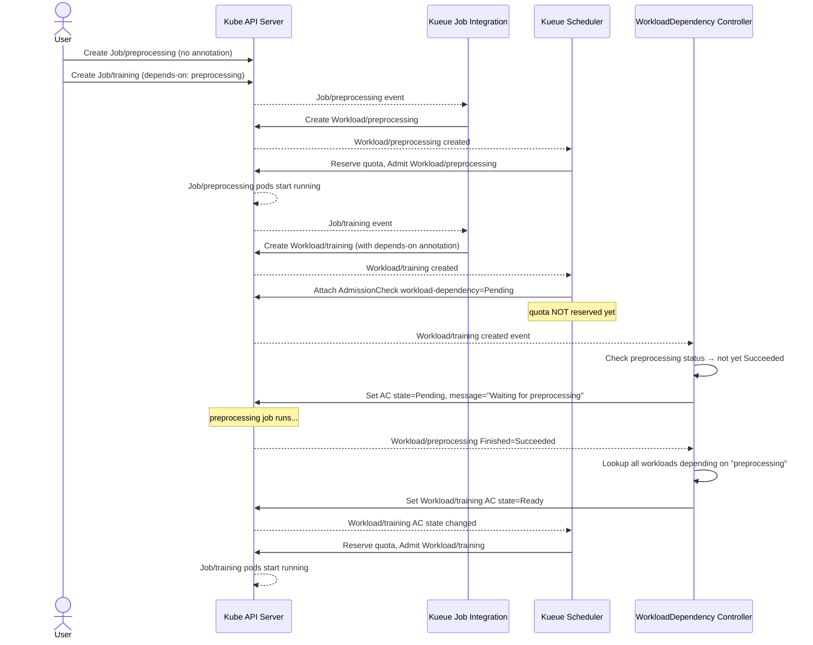

# KEP-11024: Workload Dependency Admission Check

<!-- toc -->
- [Summary](#summary)
- [Motivation](#motivation)
  - [Goals](#goals)
  - [Non-Goals](#non-goals)
- [Proposal](#proposal)
  - [User Stories](#user-stories)
    - [Story 1: Sequential ML Pipeline](#story-1-sequential-ml-pipeline)
    - [Story 2: JobSet Manager-Worker Ordering](#story-2-jobset-manager-worker-ordering)
    - [Story 3: Fan-in Aggregation Job](#story-3-fan-in-aggregation-job)
  - [Notes/Constraints/Caveats](#notesconstraintscaveats)
  - [Risks and Mitigations](#risks-and-mitigations)
- [Design Details](#design-details)
  - [Overview](#overview)
  - [End-to-End Walkthrough](#end-to-end-walkthrough)
    - [Step 1: Cluster Administrator Setup](#step-1-cluster-administrator-setup)
    - [Step 2: User Submits Jobs](#step-2-user-submits-jobs)
    - [Step 3: Kueue Creates Workloads](#step-3-kueue-creates-workloads)
    - [Step 4: Prerequisite Job Runs and Completes](#step-4-prerequisite-job-runs-and-completes)
    - [Step 5: Dependent Job Is Admitted](#step-5-dependent-job-is-admitted)
  - [Sequence Diagram](#sequence-diagram)
  - [Edge Case Walkthrough: Prerequisite Failure](#edge-case-walkthrough-prerequisite-failure)
  - [Edge Case Walkthrough: Fan-in with Partial Completion](#edge-case-walkthrough-fan-in-with-partial-completion)
  - [API Changes](#api-changes)
    - [Dependency Declaration via Annotation](#dependency-declaration-via-annotation)
    - [WorkloadDependencyConfig CRD](#workloaddependencyconfig-crd)
    - [AdmissionCheck Configuration](#admissioncheck-configuration)
  - [Controller Behavior](#controller-behavior)
    - [State Transitions](#state-transitions)
    - [Deadlock Prevention](#deadlock-prevention)
    - [Interaction with Preemption and Eviction](#interaction-with-preemption-and-eviction)
  - [Test Plan](#test-plan)
    - [Prerequisite testing updates](#prerequisite-testing-updates)
    - [Unit tests](#unit-tests)
    - [Integration tests](#integration-tests)
    - [e2e tests](#e2e-tests)
  - [Graduation Criteria](#graduation-criteria)
- [Implementation History](#implementation-history)
- [Drawbacks](#drawbacks)
- [Alternatives](#alternatives)
  - [Alternative 1: Dependency fields directly on Workload spec](#alternative-1-dependency-fields-directly-on-workload-spec)
  - [Alternative 2: External-only custom AdmissionCheck controller](#alternative-2-external-only-custom-admissioncheck-controller)
  - [Alternative 3: Integration with Argo Workflows / Tekton only](#alternative-3-integration-with-argo-workflows--tekton-only)
<!-- /toc -->

## Summary

This KEP proposes a built-in **WorkloadDependency** AdmissionCheck controller for Kueue that allows users to express ordering constraints between workloads: *"workload B must not be admitted until workload A has completed successfully."* The dependency is declared via a well-defined annotation on the user-facing Job object (BatchJob, JobSet, etc.) and evaluated as a standard Kueue AdmissionCheck. This is not a workflow engine — it covers the common "sequential admission gating" case without DAG scheduling, data flow, or retry orchestration.

## Motivation

Batch and ML pipelines frequently have strict ordering constraints: preprocessing must complete before training starts, training before evaluation, simulation before aggregation. Today, Kueue users address this in one of two ways:

1. **External workflow engines** (Argo Workflows, Tekton): operationally heavyweight for teams that only need simple sequential admission ordering and are not already running these systems.
2. **Custom AdmissionCheck controllers**: requires every organization to re-implement watch patterns, reconcile triggers, backoff, race condition handling, and consistent status reporting — non-trivial and error-prone.

Additionally, Kueue's own support for semi-independent JobSet workloads (see [#9940](https://github.com/kubernetes-sigs/kueue/issues/9940)) introduces cases where individual `ReplicatedJob` replicas each get their own `Workload` object and must be admitted in a specific order (e.g., the manager job must be admitted before worker jobs can start). This is a concrete, in-tree use case that the community is currently working around with ad-hoc solutions.

[JobSet](https://github.com/kubernetes-sigs/jobset) itself addressed an analogous problem within a single JobSet via its `DependsOn` API: a `ReplicatedJob` may declare that it should not be created until a prior `ReplicatedJob` reaches `Ready` or `Complete` status. The same need exists at the cross-Workload level, and Kueue — as the component that owns the admission lifecycle — is the natural place to implement it.

### Goals

- Provide a **built-in `WorkloadDependency` AdmissionCheck controller** that gates workload admission on prerequisite workload completion.
- Support declaring dependencies on the **user-facing Job object** (via annotation), keeping `Workload` as an internal implementation detail.
- Support the following dependency patterns:
  - Single prerequisite (1→1)
  - Multiple prerequisites with fan-in (all must complete before the dependent is admitted)
- Report clear, actionable status messages on blocked workloads.
- Handle common edge cases deterministically: missing prerequisite, failed prerequisite, prerequisite deletion.
- Avoid deadlocks through validation at Workload creation time.
- Minimize reconcile churn via event-driven watches on prerequisite workloads.

### Non-Goals

- **DAG workflow orchestration**: no data flow, no conditional branching, no retry policies across jobs.
- **Cross-namespace dependencies** (deferred to a later release; same-namespace only for alpha).
- **Fan-out dependencies** (one job spawning many dependents): supported naturally by multiple jobs annotating the same prerequisite, no special handling needed.
- **Dynamic dependency modification**: dependencies are immutable after the Job is created.
- **Replacing Argo Workflows or Tekton**: this feature targets the simple sequential ordering case; complex pipelines should continue to use full workflow engines.
- **Modifying the Workload spec** to carry dependency information: the `Workload` object remains an internal object; dependency declarations live on user-facing Job objects.

## Proposal

A new built-in AdmissionCheck controller named `kueue.x-k8s.io/workload-dependency` is introduced. Users annotate their Job objects to declare ordering constraints. The controller evaluates those constraints against the current status of prerequisite workloads and sets the corresponding `AdmissionCheckState` on the dependent workload accordingly.

### User Stories

#### Story 1: Sequential ML Pipeline

As an ML engineer, I have a three-stage pipeline: data preprocessing → model training → evaluation. Each stage is a separate `batch/v1 Job`. I want Kueue to ensure that training is not admitted until preprocessing succeeds, and evaluation is not admitted until training succeeds, without deploying Argo Workflows for this simple case.

```yaml
# Stage 1: preprocessing (no dependency)
apiVersion: batch/v1
kind: Job
metadata:
  name: preprocessing
  namespace: research
  labels:
    kueue.x-k8s.io/queue-name: ml-queue

---
# Stage 2: training (depends on preprocessing completing)
apiVersion: batch/v1
kind: Job
metadata:
  name: training
  namespace: research
  labels:
    kueue.x-k8s.io/queue-name: ml-queue
  annotations:
    kueue.x-k8s.io/depends-on: '[{"name":"preprocessing","status":"Succeeded"}]'

---
# Stage 3: evaluation (depends on training completing)
apiVersion: batch/v1
kind: Job
metadata:
  name: evaluation
  namespace: research
  labels:
    kueue.x-k8s.io/queue-name: ml-queue
  annotations:
    kueue.x-k8s.io/depends-on: '[{"name":"training","status":"Succeeded"}]'
```

#### Story 2: JobSet Manager-Worker Ordering

As a platform engineer using Kueue's semi-independent JobSet workloads (KEP #9940), I need the manager `ReplicatedJob` to be admitted and running before any worker `ReplicatedJob` is admitted. Each `ReplicatedJob` gets its own `Workload` object. Currently, this ordering requires a hacky workaround. With this feature, the worker JobSet can declare a dependency on the manager's workload being ready.

```yaml
# Manager JobSet (no dependency)
apiVersion: batch/v1
kind: Job
metadata:
  name: llm-manager
  namespace: training
  labels:
    kueue.x-k8s.io/queue-name: gpu-queue

---
# Worker JobSet (depends on manager being Ready)
apiVersion: batch/v1
kind: Job
metadata:
  name: llm-worker
  namespace: training
  labels:
    kueue.x-k8s.io/queue-name: gpu-queue
  annotations:
    kueue.x-k8s.io/depends-on: '[{"name":"llm-manager","status":"Ready"}]'
```

#### Story 3: Fan-in Aggregation Job

As a data engineer, I run multiple parallel simulation jobs and then an aggregation job that must wait for all simulations to finish.

```yaml
annotations:
  kueue.x-k8s.io/depends-on: |
    [
      {"name": "sim-shard-0", "status": "Succeeded"},
      {"name": "sim-shard-1", "status": "Succeeded"},
      {"name": "sim-shard-2", "status": "Succeeded"}
    ]
```

### Notes/Constraints/Caveats

- The `kueue.x-k8s.io/depends-on` annotation is **immutable** after the Job is created. This mirrors JobSet's `DependsOn` field immutability and avoids complex re-evaluation.
- Dependencies are resolved by **Job name within the same namespace**. The referenced job must be managed by Kueue in the same LocalQueue.
- If a prerequisite workload does not yet exist, the check remains `Pending` (not `Rejected`), to support the case where jobs are submitted out of order.
- The `status` field in the annotation supports three values for alpha:
  - `Succeeded`: all pods of the prerequisite job completed successfully (`WorkloadFinished` with reason `Succeeded`)
  - `Failed`: the prerequisite job has finished with all pods failed and no restart (`WorkloadFinished` with reason `Failed`). Useful for fallback jobs, diagnostics, or alerting that should only run when a preceding job fails.
  - `Ready`: the prerequisite workload has been admitted and its pods are running (useful for the manager-worker pattern in Story 2)
- The failure handling is **not implicit** — it is the natural consequence of a prerequisite reaching a terminal state that makes the declared `status` condition impossible to satisfy. Specifically: if `status: Succeeded` is declared and the prerequisite finishes as `Failed`, the check transitions to `Rejected` because `Succeeded` can never be reached. Conversely, if `status: Failed` is declared and the prerequisite finishes as `Succeeded`, the check also transitions to `Rejected`.

### Risks and Mitigations

**Risk**: Users create circular dependencies (A depends on B, B depends on A), causing both workloads to be permanently blocked.\
**Mitigation**: A validating webhook rejects the creation or update of a Job annotation that would introduce a cycle detectable at that time. The controller also performs cycle detection at reconcile time and sets both workloads to `Rejected` with a clear error message.

**Risk**: Long dependency chains cause unbounded queue depth growth.\
**Mitigation**: This is inherent to sequential pipelines and is not specific to this feature. The behavior is no worse than users manually submitting jobs in sequence today.

**Risk**: A prerequisite workload is preempted after the dependent is already admitted.\
**Mitigation**: For alpha, the preemption of a prerequisite does not affect already-admitted dependents. This matches the semantics of JobSet's `DependsOn` (admission gating only, not runtime coupling). Cross-workload preemption coupling is deferred.

**Risk**: High reconcile churn if many workloads depend on the same prerequisite.\
**Mitigation**: The controller uses an index on the dependency annotation and triggers reconciliation only for workloads that list the completed prerequisite, not for all workloads.

**Risk**: The `kueue.x-k8s.io/depends-on` annotation is silently ignored if the `WorkloadDependency` AdmissionCheck is not configured on the ClusterQueue.\
**Mitigation**: The Kueue integration layer emits a warning event on the Job when the annotation is present but no `WorkloadDependency` AdmissionCheck is attached to the workload's ClusterQueue.

## Design Details

### Overview

```
User Job (annotation: kueue.x-k8s.io/depends-on)
    │
    ▼
Kueue Job Integration Layer
    │  propagates dependency info to Workload annotation
    ▼
Workload (status.admissionChecks[workload-dependency] = Pending)
    │
    ▼
WorkloadDependency Controller (built-in)
    │  watches prerequisite Workloads for status changes
    │  sets AdmissionCheckState → Ready / Pending / Rejected
    ▼
Kueue Scheduler
    │  admits workload when all AdmissionChecks are Ready
    ▼
Running Job
```

### End-to-End Walkthrough

This section walks through a concrete two-stage pipeline (`preprocessing` → `training`) to illustrate exactly what each component does at each step.

#### Step 1: Cluster Administrator Setup

The administrator creates a `WorkloadDependencyConfig`, an `AdmissionCheck`, and a `ClusterQueue` that references it. This is a one-time setup per queue.

```yaml
apiVersion: kueue.x-k8s.io/v1beta1
kind: WorkloadDependencyConfig
metadata:
  name: default-dep-config
spec:
  onMissingPrerequisite: Pending   # wait if prerequisite job hasn't been submitted yet

---
apiVersion: kueue.x-k8s.io/v1beta1
kind: AdmissionCheck
metadata:
  name: workload-dependency
spec:
  controllerName: kueue.x-k8s.io/workload-dependency
  parametersRef:
    apiGroup: kueue.x-k8s.io
    kind: WorkloadDependencyConfig
    name: default-dep-config

---
apiVersion: kueue.x-k8s.io/v1beta1
kind: ClusterQueue
metadata:
  name: ml-queue
spec:
  namespaceSelector: {}
  admissionChecks:
    - workload-dependency
  resourceGroups:
    - coveredResources: ["cpu", "memory"]
      flavors:
        - name: default-flavor
          resources:
            - name: cpu
              nominalQuota: "100"
            - name: memory
              nominalQuota: 200Gi
```

#### Step 2: User Submits Jobs

A user submits both jobs at the same time. The `training` job carries the dependency annotation. The `preprocessing` job has no annotation.

```yaml
# submitted together — order does not matter
apiVersion: batch/v1
kind: Job
metadata:
  name: preprocessing
  namespace: research
  labels:
    kueue.x-k8s.io/queue-name: user-queue   # LocalQueue → ml-queue ClusterQueue
spec:
  template:
    spec:
      containers:
        - name: preprocess
          image: my-etl:v1
          resources:
            requests: {cpu: "4", memory: "8Gi"}
      restartPolicy: Never

---
apiVersion: batch/v1
kind: Job
metadata:
  name: training
  namespace: research
  labels:
    kueue.x-k8s.io/queue-name: user-queue
  annotations:
    kueue.x-k8s.io/depends-on: '[{"name":"preprocessing","status":"Succeeded"}]'
spec:
  template:
    spec:
      containers:
        - name: train
          image: my-trainer:v1
          resources:
            requests: {cpu: "16", memory: "64Gi"}
      restartPolicy: Never
```

#### Step 3: Kueue Creates Workloads

Kueue's job integration layer creates a `Workload` object for each job. For the `training` job, the annotation is propagated to the `Workload`.

**Workload for `preprocessing`** — no dependency annotation, quota is reserved and the job is admitted normally:

```yaml
apiVersion: kueue.x-k8s.io/v1beta1
kind: Workload
metadata:
  name: job-preprocessing-xxxxx
  namespace: research
spec:
  podSets:
    - name: main
      count: 1
      template:
        spec:
          containers:
            - name: preprocess
              resources:
                requests: {cpu: "4", memory: "8Gi"}
status:
  conditions:
    - type: QuotaReserved
      status: "True"
      reason: QuotaReserved
    - type: Admitted
      status: "True"
      reason: Admitted
```

**Workload for `training`** — dependency annotation present; Kueue attaches the `workload-dependency` AdmissionCheck in `Pending` state before attempting to reserve quota:

```yaml
apiVersion: kueue.x-k8s.io/v1beta1
kind: Workload
metadata:
  name: job-training-yyyyy
  namespace: research
  annotations:
    kueue.x-k8s.io/depends-on: '[{"name":"preprocessing","status":"Succeeded"}]'
spec:
  podSets:
    - name: main
      count: 1
      template:
        spec:
          containers:
            - name: train
              resources:
                requests: {cpu: "16", memory: "64Gi"}
status:
  admissionChecks:
    - name: workload-dependency
      state: Pending
      lastTransitionTime: "2026-05-07T10:00:00Z"
      message: "Waiting for job preprocessing to reach Succeeded status"
  conditions:
    - type: QuotaReserved
      status: "False"
      reason: Pending
      message: "waiting for AdmissionCheck workload-dependency"
```

The `training` workload sits in the queue. Its quota is **not** reserved — it does not consume any resources while waiting.

#### Step 4: Prerequisite Job Runs and Completes

When `preprocessing` finishes successfully, its `Workload` transitions to `WorkloadFinished`:

```yaml
# Workload for preprocessing after completion
status:
  conditions:
    - type: Admitted
      status: "False"
      reason: Finished
    - type: Finished
      status: "True"
      reason: Succeeded
      message: "Job finished successfully"
```

The `WorkloadDependency` controller is notified via a watch on this workload's `Finished` condition. It reconciles all dependent workloads that reference `preprocessing` by name, finds that the `Succeeded` condition is now met, and updates the `training` workload's AdmissionCheck state:

```yaml
# Workload for training after prerequisite completes
status:
  admissionChecks:
    - name: workload-dependency
      state: Ready
      lastTransitionTime: "2026-05-07T10:45:00Z"
      message: "All dependencies satisfied"
```

#### Step 5: Dependent Job Is Admitted

With the `workload-dependency` AdmissionCheck now `Ready`, the Kueue scheduler proceeds normally: it reserves quota for `training` and admits it.

```yaml
# Workload for training after admission
status:
  admissionChecks:
    - name: workload-dependency
      state: Ready
      lastTransitionTime: "2026-05-07T10:45:00Z"
      message: "All dependencies satisfied"
  admission:
    clusterQueue: ml-queue
    podSetAssignments:
      - name: main
        flavors: {cpu: default-flavor, memory: default-flavor}
        resourceUsage: {cpu: "16", memory: 64Gi}
  conditions:
    - type: QuotaReserved
      status: "True"
      reason: QuotaReserved
    - type: Admitted
      status: "True"
      reason: Admitted
```

The `training` Job's pods are now created and scheduled by Kubernetes.

### Sequence Diagram

The following diagram shows the full event flow for a two-stage sequential pipeline.



### Edge Case Walkthrough: Prerequisite Failure

This walkthrough assumes `training` has declared `status: Succeeded`. If `preprocessing` fails (all pods exit non-zero and `Job.spec.backoffLimit` is exhausted), its Workload transitions to `Finished` with reason `Failed`. Because `Succeeded` can never be reached, the `WorkloadDependency` controller rejects the dependent workload:

```yaml
# Workload for training after prerequisite fails
status:
  admissionChecks:
    - name: workload-dependency
      state: Rejected
      lastTransitionTime: "2026-05-07T10:30:00Z"
      message: "Prerequisite job preprocessing failed"
  conditions:
    - type: QuotaReserved
      status: "False"
      reason: Inadmissible
    - type: Finished
      status: "True"
      reason: AdmissionCheckRejected
      message: "Workload rejected by AdmissionCheck workload-dependency: Prerequisite job preprocessing failed"
```

The `training` Job is never started, and the user sees a clear event and status message explaining why.

```
$ kubectl describe job training -n research
...
Events:
  Warning  AdmissionCheckRejected  kueue-workload-dependency  Prerequisite job preprocessing failed
```

### Edge Case Walkthrough: Fan-in with Partial Completion

For a fan-in case where `aggregation` depends on `shard-0`, `shard-1`, and `shard-2`:

```yaml
annotations:
  kueue.x-k8s.io/depends-on: |
    [
      {"name": "shard-0", "status": "Succeeded"},
      {"name": "shard-1", "status": "Succeeded"},
      {"name": "shard-2", "status": "Succeeded"}
    ]
```

While only `shard-0` and `shard-1` have completed, the AdmissionCheck stays `Pending` with a message listing the remaining unsatisfied dependencies:

```yaml
status:
  admissionChecks:
    - name: workload-dependency
      state: Pending
      lastTransitionTime: "2026-05-07T11:00:00Z"
      message: "Waiting for job shard-2 to reach Succeeded status"
```

Each time another shard completes, the controller reconciles and updates the message. Once all three are `Succeeded`, the check transitions to `Ready` and the `aggregation` workload is admitted.

### API Changes

#### Dependency Declaration via Annotation

A new well-known annotation is introduced on user-facing Job objects:

```
kueue.x-k8s.io/depends-on
```

Value: a JSON array of dependency entries.

```go
// WorkloadDependency defines a single dependency entry.
type WorkloadDependency struct {
    // name is the name of the prerequisite Job in the same namespace.
    // +required
    Name string `json:"name"`

    // status defines the required terminal state of the prerequisite.
    // Valid values are Succeeded, Failed, and Ready.
    // Succeeded: WorkloadFinished condition is True with reason Succeeded.
    // Failed: WorkloadFinished condition is True with reason Failed.
    // Ready: workload is admitted and pods have reached Running state.
    // If the prerequisite reaches a terminal state that makes the declared
    // status impossible to satisfy, the AdmissionCheck transitions to Rejected.
    // +kubebuilder:validation:Enum=Succeeded;Failed;Ready
    // +kubebuilder:default=Succeeded
    Status WorkloadDependencyStatus `json:"status"`
}

type WorkloadDependencyStatus string

const (
    // WorkloadDependencyStatusSucceeded requires the prerequisite workload
    // to have finished successfully (all pods succeeded).
    WorkloadDependencyStatusSucceeded WorkloadDependencyStatus = "Succeeded"

    // WorkloadDependencyStatusFailed requires the prerequisite workload to
    // have finished with failure (all pods failed, backoffLimit exhausted).
    // Useful for fallback jobs, diagnostics, or alerting that should only
    // run when a preceding job fails.
    WorkloadDependencyStatusFailed WorkloadDependencyStatus = "Failed"

    // WorkloadDependencyStatusReady requires the prerequisite workload to
    // have been admitted and its pods to have reached Running state.
    // Useful for manager-worker patterns where the worker can start once
    // the manager pod is running.
    WorkloadDependencyStatusReady WorkloadDependencyStatus = "Ready"
)
```

Example annotation value:
```json
[{"name": "preprocessing", "status": "Succeeded"}]
```

The Kueue job integration layer propagates this annotation verbatim to a corresponding annotation on the `Workload` object so the dependency controller does not need to resolve back to the original job type.

#### WorkloadDependencyConfig CRD

A new `WorkloadDependencyConfig` CRD provides cluster-scoped configuration referenced by the `AdmissionCheck` object. For alpha, it carries minimal configuration.

```go
// WorkloadDependencyConfig is the Schema for the workloaddependencyconfigs API.
// +kubebuilder:object:root=true
type WorkloadDependencyConfig struct {
    metav1.TypeMeta   `json:",inline"`
    metav1.ObjectMeta `json:"metadata,omitempty"`

    Spec WorkloadDependencyConfigSpec `json:"spec,omitempty"`
}

type WorkloadDependencyConfigSpec struct {
    // onMissingPrerequisite controls the AdmissionCheck state when the
    // referenced prerequisite job does not exist.
    // Pending: keep the workload queued and retry when prerequisites appear.
    // Rejected: immediately reject the workload.
    // Defaults to Pending.
    // +kubebuilder:default=Pending
    // +kubebuilder:validation:Enum=Pending;Rejected
    // +optional
    OnMissingPrerequisite MissingPrerequisitePolicy `json:"onMissingPrerequisite,omitempty"`
}

type MissingPrerequisitePolicy string

const (
    MissingPrerequisitePolicyPending  MissingPrerequisitePolicy = "Pending"
    MissingPrerequisitePolicyRejected MissingPrerequisitePolicy = "Rejected"
)
```

#### AdmissionCheck Configuration

See [Step 1: Cluster Administrator Setup](#step-1-cluster-administrator-setup) in the End-to-End Walkthrough above for a complete example of the `WorkloadDependencyConfig`, `AdmissionCheck`, and `ClusterQueue` setup.

### Controller Behavior

The `WorkloadDependency` built-in controller reconciles `Workload` objects that carry the dependency annotation. For each such workload, it evaluates all declared dependencies and sets the `AdmissionCheckState` as follows.

#### State Transitions

| Condition | AdmissionCheckState | Message |
|-----------|--------------------|---------| 
| All prerequisites have reached the required status | `Ready` | `All dependencies satisfied` |
| One or more prerequisites exist but have not yet reached the required status | `Pending` | `Waiting for <name> to reach <status>` |
| A prerequisite does not exist and `onMissingPrerequisite=Pending` | `Pending` | `Waiting for prerequisite job <name> to be created` |
| A prerequisite does not exist and `onMissingPrerequisite=Rejected` | `Rejected` | `Prerequisite job <name> not found` |
| `status: Succeeded` declared and prerequisite finished with reason `Failed` | `Rejected` | `Prerequisite job <name> failed; expected Succeeded` |
| `status: Failed` declared and prerequisite finished with reason `Succeeded` | `Rejected` | `Prerequisite job <name> succeeded; expected Failed` |
| `status: Ready` declared and prerequisite finished with reason `Failed` | `Rejected` | `Prerequisite job <name> failed before reaching Ready` |
| A cycle is detected | `Rejected` | `Circular dependency detected involving <name>` |

The controller registers a **field index** on `Workload.metadata.annotations[kueue.x-k8s.io/depends-on]` and sets up **watches** so that when a prerequisite workload's `WorkloadFinished` or `Admitted` condition changes, all dependent workloads are enqueued for reconciliation. This avoids polling.

#### Deadlock Prevention

At admission check evaluation time, the controller performs a depth-first cycle check across all workloads in the same namespace that carry the dependency annotation. If a cycle is detected, all workloads in the cycle have their `AdmissionCheckState` set to `Rejected` with a descriptive message. A validating webhook also performs this check at Job creation time for direct cycles (A→B→A detectable statically).

#### Interaction with Preemption and Eviction

- **Alpha scope**: dependency gating is one-way and admission-time only. If a prerequisite workload is preempted or evicted after the dependent workload has already been admitted, the dependent workload is not affected.
- If the dependent workload itself is evicted and re-queued, the dependency check is re-evaluated from scratch on the next admission attempt.
- If a prerequisite workload is deactivated by a user (`stopPolicy: HoldAndDrain`), the dependent's check remains `Pending` until the prerequisite either resumes and completes or is deleted.

### Test Plan

[ ] I/we understand the owners of the involved components may require updates to
existing tests to make this code solid enough prior to committing the changes necessary
to implement this enhancement.

#### Prerequisite testing updates

- Verify that existing AdmissionCheck integration tests continue to pass with the new controller registered.
- Verify that the workload controller correctly propagates the dependency annotation from Job objects to Workload objects across all supported job integrations (batch/v1 Job, JobSet, MPIJob, PyTorchJob).

#### Unit tests

- `pkg/controller/admissionchecks/workloaddependency`
  - `dependencyReachedStatus`: all combinations of dependency status × workload state
  - cycle detection: linear chain, diamond, direct cycle, self-reference
  - annotation parsing: valid, empty, malformed JSON, missing `name`, invalid `status` value
  - `onMissingPrerequisite` policy: Pending and Rejected paths

#### Integration tests

- Workload is kept `Pending` (AC state) until prerequisite reaches `Succeeded` status
- Workload transitions to `Ready` AC state immediately after prerequisite completes
- Workload is `Rejected` when prerequisite fails
- Workload is `Rejected` when prerequisite is missing and `onMissingPrerequisite=Rejected`
- Workload remains `Pending` when prerequisite is missing and `onMissingPrerequisite=Pending`, then progresses when prerequisite is created later
- Fan-in: workload waits until all listed prerequisites complete
- Circular dependency: both workloads in the cycle are `Rejected` with an informative message
- Annotation absent from the ClusterQueue's AdmissionChecks: warning event emitted, workload not blocked
- Preemption of prerequisite after dependent is admitted: dependent is unaffected
- Re-queue after eviction: dependency check is re-evaluated correctly

#### e2e tests

- End-to-end sequential pipeline with `batch/v1 Job` on a real cluster
- Manager-worker pattern with semi-independent JobSet workloads (requires KEP #9940 feature gate)

### Graduation Criteria

**Alpha:**

- `WorkloadDependency` feature gate, disabled by default
- New `WorkloadDependencyConfig` CRD
- Built-in controller registered under `kueue.x-k8s.io/workload-dependency`
- Annotation propagation in `batch/v1 Job` integration; other integrations in follow-up
- Dependency statuses: `Succeeded`, `Failed`, and `Ready`
- Same-namespace dependencies only
- Unit and integration test coverage
- Documentation: concept page and task guide with examples

**Beta:**

- `WorkloadDependency` feature gate enabled by default
- Annotation propagation for all Kueue-supported job integrations (JobSet, MPIJob, PyTorchJob, etc.)
- Cross-namespace dependencies with RBAC controls
- Metrics: `kueue_workload_dependency_pending_total`, `kueue_workload_dependency_rejected_total`
- Bug fixes from alpha feedback
- Enhanced documentation and runbooks

**GA:**

- `WorkloadDependency` feature gate locked to enabled
- Full test suite including e2e on supported job types
- All reported bugs fixed

## Implementation History

- 2026-05-07: Issue [#11024](https://github.com/kubernetes-sigs/kueue/issues/11024) opened
- 2026-05-08: Initial KEP draft

## Drawbacks

- Adds a new built-in controller and CRD, increasing Kueue's operational surface.
- Immutable dependency annotations mean users cannot adjust ordering constraints without deleting and recreating jobs.

## Alternatives

### Alternative 1: Dependency fields directly on Workload spec

Add a `spec.dependsOn` field to the `Workload` API directly. Rejected because:
- `Workload` is an internal implementation detail, not a user-facing object. Users should not be required to create or modify `Workload` objects directly.
- It would complicate the Workload spec and blur the line between user-facing API and internal scheduling state.

### Alternative 2: External-only custom AdmissionCheck controller

Provide only documentation and reference implementations for users to build their own dependency AC controller. Rejected because:
- This is the status quo, and it consistently generates support requests and subtly incorrect implementations across organizations.
- The pattern is well-defined and bounded; a built-in implementation provides a single correct, tested, community-maintained solution.
- JobSet set a precedent by implementing `DependsOn` natively rather than delegating it to users.

### Alternative 3: Integration with Argo Workflows / Tekton only

Invest in Kueue integrations for Argo Workflows and Tekton (see [#74](https://github.com/kubernetes-sigs/kueue/issues/74)) instead of a built-in dependency feature. This is not mutually exclusive and both tracks can proceed in parallel. However:
- Argo/Tekton integrations require those systems to be installed and managed, adding significant operational overhead for the simple sequential ordering case.
- Many users are not running a workflow engine and should not be required to adopt one for a two-stage pipeline.
- The built-in feature and workflow engine integrations address different points on the complexity spectrum; both are valuable.
