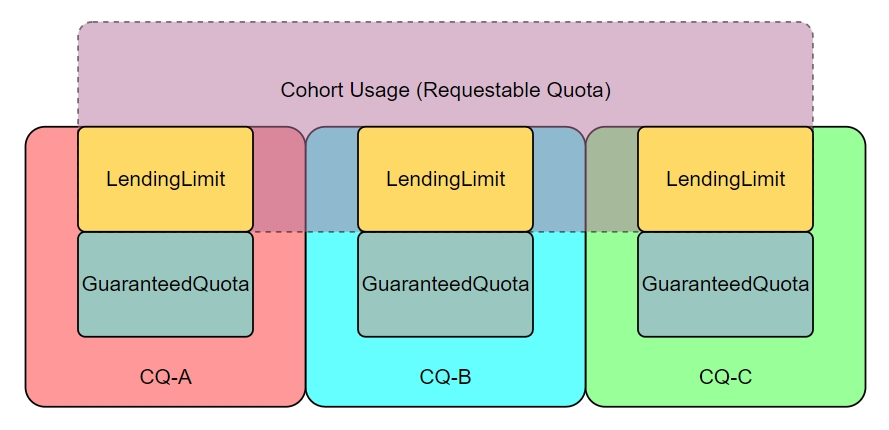

# KEP-1224: Introducing lendingLimit to help reserve guaranteed resources

<!-- toc -->
- [Summary](#summary)
- [Motivation](#motivation)
  - [Goals](#goals)
  - [Non-Goals](#non-goals)
- [Proposal](#proposal)
  - [User Stories (Optional)](#user-stories-optional)
    - [Story 1](#story-1)
  - [Notes/Constraints/Caveats (Optional)](#notesconstraintscaveats-optional)
  - [Risks and Mitigations](#risks-and-mitigations)
- [Design Details](#design-details)
  - [Kueue LendingLimit API](#kueue-lendinglimit-api)
    - [Note](#note)
  - [Test Plan](#test-plan)
      - [Prerequisite testing updates](#prerequisite-testing-updates)
    - [Unit Tests](#unit-tests)
    - [Integration tests](#integration-tests)
  - [Graduation Criteria](#graduation-criteria)
- [Implementation History](#implementation-history)
- [Drawbacks](#drawbacks)
- [Alternatives](#alternatives)
  <!-- /toc -->

## Summary

Under the current implementation, one ClusterQueue's resources could be borrowed completely by others in the same cohort, this improves the resource utilization to some extent, but sometimes, user wants to reserve some resources only for private usage. 

This proposal provides a guarantee mechanism for users to solve this problem. They can have a reservation of resource quota that will never be borrowed by other clusterqueues in the same cohort.

## Motivation

Sometimes we want to keep some resources for guaranteed usage, so that when new jobs come into queue, they can be admitted immediately.

Under the current implementation, we are using `BorrowingLimit` to define the maximum amount of quota that this ClusterQueue is allowed to borrow. But this may cause another ClusterQueue in the same cohort to run out of resources.

Even if we set the `Preemption`, it still needs some time and spends a lot of unnecessary cost.

So we need a reservation design for resource requests and security reasons: `LendingLimit`, to claim the quota allowed to lend, reserve a certain amount of resources to ensure that they will never be borrowed.

### Goals

- Implement `LendingLimit`, users can have a reservation of guaranteed resource by claiming the `LendingLimit`.

### Non-Goals

- Replace `BorrowingLimit` to some extent in the future.

## Proposal

In this proposal, `LendingLimit` is defined. The `ClusterQueue` will be limited to lend the specified quota to other ClusterQueues in the same cohort.



### User Stories (Optional)

#### Story 1

In order to ensure the full utilization of resources, we generally set `BorrowingLimit` to max, but this may cause a `ClusterQueue` to run out of its all resources, and make the new incoming job slow to response for the slow preemption. This could be worse in a competitive cluster, jobs will borrow resources and be reclaimed over and over.

So we want to reserve some resources for a `ClusterQueue`, so that any incoming jobs in the  `ClusterQueue` can get admitted immediately.

### Notes/Constraints/Caveats (Optional)

With both BorrowingLimit and LendingLimit configured, one clusterQueue may not be able to borrow up to the limit just because we reserved the lending limit quota of resource.

### Risks and Mitigations

None.

## Design Details

### Kueue LendingLimit API

Modify ResourceQuota API object:

```go
type ResourceQuota struct {
	[...]

	// lendingLimit is the maximum amount of unused quota for the [flavor, resource]
	// combination that this ClusterQueue can lend to other ClusterQueues in the same cohort.
	// In total, at a given time, ClusterQueue reserves for its exclusive use
	// a quantity of quota equals to nominalQuota - lendingLimit.
	// If null, it means that there is no lending limit.
	// If not null, it must be non-negative.
	// lendingLimit must be null if spec.cohort is empty.
	// +optional
	LendingLimit *resource.Quantity `json:"lendingLimit,omitempty"`
}
```

#### Note

We have considered adding this status field, but discarded it. Because unused resources from multiple CQs compose a single pool of shareable resources, we cannot precisely calculate this value.

So there is no concept of A is borrowing from B. A is borrowing from all the unused resource of B, C and any other CQs in the cohort.

```go
type ResourceUsage struct {
	[...]

    // Lended is a quantity of quota that is lended to other ClusterQueues in the cohort.
    Lended resource.Quantity `json:"lended,omitempty"`
}
```

### Test Plan

[x] I/we understand the owners of the involved components may require updates to
existing tests to make this code solid enough prior to committing the changes necessary
to implement this enhancement.

##### Prerequisite testing updates

None.

#### Unit Tests

- `pkg/cache`: `2023-11-15` - `86.5%`
- `pkg/controller/core/`: `2023-11-15` - `16.5%`
- `pkg/metrics/`: `2023-11-15` - `45.7%`
- `pkg/scheduler/`: `2023-11-15` - `80.6%`
- `pkg/scheduler/flavorassigner`: `2023-11-15` - `80.5%`
- `pkg/scheduler/preemption`: `2023-11-15` - `94.0%`

#### Integration tests

<!--
Describe what tests will be added to ensure proper quality of the enhancement.

After the implementation PR is merged, add the names of the tests here.
-->

- No new workloads can be admitted when the `LendingLimit` greater than `NominalQuota` or less than `0`.
- In a cohort with 2 ClusterQueues a, b and single ResourceFlavor:
  - When cq-b's LendingLimit set:
    - When cq-a's BorrowingLimit unset, cq-a can borrow as much as `cq-b's LendingLimit`.
    - When cq-a's BorrowingLimit set, cq-a can borrow as much as `min(cq-b's LendingLimit, cq-a's BorrowingLimit)`.
- In a cohort with 3 ClusterQueues a, b, c and single ResourceFlavor:
  - When cq-b's LendingLimit set, cq-c's LendingLimit unset:
    - When cq-a's BorrowingLimit unset, cq-a can borrow as much as `(cq-b's LendingLimit + cq-c's NominalQuota)`.
    - When cq-a's BorrowingLimit set, cq-a can borrow as much as `min((cq-b's LendingLimit + cq-c's NominalQuota), cq-a's BorrowingLimit)`.
  - When cq-b and cq-c's LendingLimit both set:
    - When cq-a's BorrowingLimit unset, cq-a can borrow as much as `(cq-b's LendingLimit + cq-c's LendingLimit)`.
    - When cq-a's BorrowingLimit set, cq-a can borrow as much as `min((cq-b's LendingLimit + cq-c's LendingLimit), cq-a's BorrowingLimit)`.
- In a cohort with 2 ClusterQueues cq-a, cq-b and 2 ResourceFlavors rf-a, rf-b:
  - In cq-b, when rf-a's LendingLimit set, and cq-a's FlavorFungibility set to `whenCanBorrow: Borrow`:
    - In cq-a, when rf-a's BorrowingLimit unset, cq-a can borrow as much as `rf-a's LendingLimit`.
    - In cq-a, when rf-a's BorrowingLimit set, cq-a can borrow as much as `min(rf-a's LendingLimit, rf-a's BorrowingLimit)`.

We will not consider the situation that **when cq-a's FlavorFungibility set to `whenCanBorrow: TryNextFlavor`**, since in this case, borrow will not happen.

### Graduation Criteria

## Implementation History

## Drawbacks

## Alternatives

- `GuaranteedQuota` which defines the quota for reservation is functionally similar to `LendingLimit`, but to align with `BorrowingLimit`, we chose the latter.

