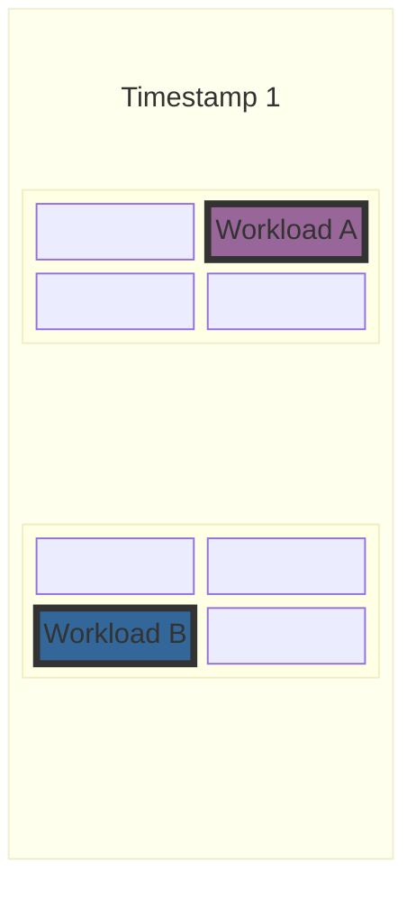
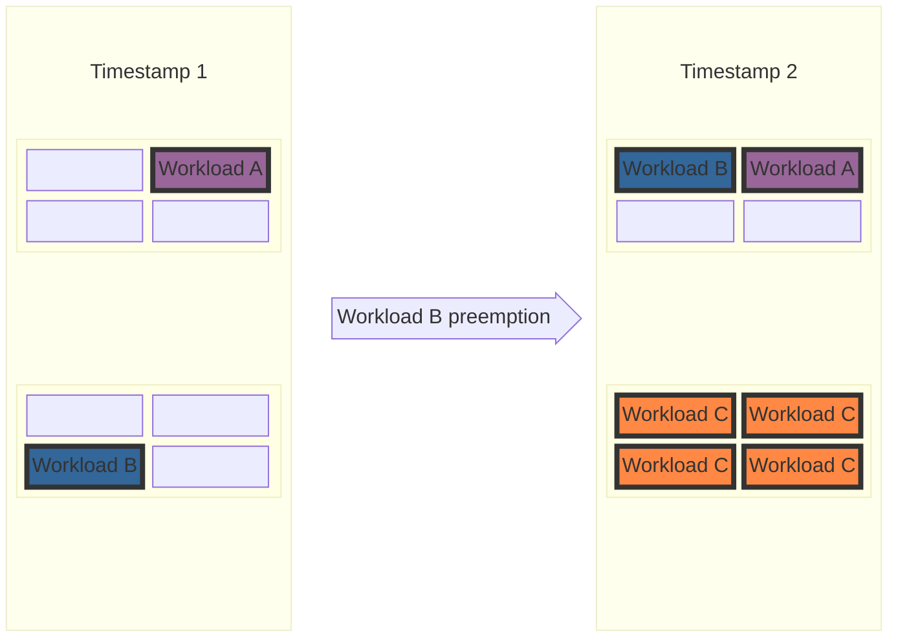

# KEP-13396: Configurable Preemptions

<!-- toc -->
- [Summary](#summary)
- [Motivation](#motivation)
  - [1. Defragmentation](#1-defragmentation)
  - [2. Hero workloads](#2-hero-workloads)
  - [3. Desired behavior of preemptions is business driven](#3-desired-behavior-of-preemptions-is-business-driven)
  - [Other related issues](#other-related-issues)
  - [Goals](#goals)
  - [Non-Goals](#non-goals)
- [Proposal](#proposal)
    - [Referencing PreemptionConfig and Current Preemption Strategies Interaction](#referencing-preemptionconfig-and-current-preemption-strategies-interaction)
  - [User Stories](#user-stories)
    - [Story 1 - Defragmentation](#story-1---defragmentation)
    - [Story 2 - Hero job](#story-2---hero-job)
    - [Story 3 - Business driven preemption rules](#story-3---business-driven-preemption-rules)
  - [Notes](#notes)
  - [Constraints](#constraints)
  - [Caveats](#caveats)
  - [Risks and Mitigations](#risks-and-mitigations)
    - [Cascading preemptions due to misconfiguration](#cascading-preemptions-due-to-misconfiguration)
    - [Performance degradation](#performance-degradation)
    - [Security considerations](#security-considerations)
- [Design Details](#design-details)
  - [Proposed API PreemptionConfig](#proposed-api-preemptionconfig)
    - [Default Candidate Ordering](#default-candidate-ordering)
  - [Integration](#integration)
  - [Observability](#observability)
  - [Test Plan](#test-plan)
    - [Unit tests](#unit-tests)
    - [Integration tests](#integration-tests)
    - [e2e tests](#e2e-tests)
  - [Graduation Criteria](#graduation-criteria)
    - [Alpha](#alpha)
    - [Beta](#beta)
    - [Stable](#stable)
- [Implementation History](#implementation-history)
- [Drawbacks](#drawbacks)
- [Alternatives](#alternatives)
- [Future Work Ideas](#future-work-ideas)
<!-- /toc -->

## Summary

<!--
This section is incredibly important for producing high-quality, user-focused
documentation such as release notes or a development roadmap. It should be
possible to collect this information before implementation begins, in order to
avoid requiring implementors to split their attention between writing release
notes and implementing the feature itself. KEP editors and SIG Docs
should help to ensure that the tone and content of the `Summary` section is
useful for a wide audience.

A good summary is probably at least a paragraph in length.

Both in this section and below, follow the guidelines of the [documentation
style guide]. In particular, wrap lines to a reasonable length, to make it
easier for reviewers to cite specific portions, and to minimize diff churn on
updates.

[documentation style guide]: https://github.com/kubernetes/community/blob/master/contributors/guide/style-guide.md
-->

This KEP introduces **Configurable Preemptions** in Kueue through the `PreemptionConfig` cluster-scoped CRD (with rate-limiting guardrails via `PreemptionLimit` deferred to future work).
This enables declarative preemption policies for scenarios unsupported by existing heuristics, including topology defragmentation, mission-critical "hero" workloads, and business SLA constraints.
With `PreemptionConfig`, administrators can configure explicit triggers (quota or topology constraints) and candidate selectors (such as priority relations, queue relations, workload label selectors, and custom numeric labels, with quota-based candidate selectors, minimal trigger duration, time-based candidate duration selectors, custom ordering, per-selector per-CQ priority queues, and `PreemptionLimit` deferred to future work). In the initial iteration, candidate evaluation reuses the default ordering rules from classical/fair sharing preemption. In Alpha, `PreemptionConfig` is referenced via an annotation on the `ClusterQueue` (`kueue.x-k8s.io/preemption-config-name`), keeping the defaulting of `spec.preemption` intact and merging the candidate outputs of both classical/fair sharing and configurable preemption strategies. For Beta+, as `PreemptionConfig` achieves full feature parity with classical/fair sharing preemption, both strategies will become mutually exclusive via a formal API field, and the annotation will be retired.

## Motivation

### 1. Defragmentation

Kueue does not support inter-ClusterQueue topology-based preemptions when workloads are within their ClusterQueue's nominal quota. Because of this, small workloads can sometimes block large topology domains.
In some clusters, this may be desired, as disruptions of critical workloads should be avoided as much as possible.

In other setups, better cluster utilization or the ability to schedule higher-priority jobs that are blocked due to cluster fragmentation is more important. Therefore, additional defragmentation mechanisms are needed to allow higher-priority workloads to move smaller workloads between topology domains. The expected behavior in this case can be seen in the following example:

Let us consider a cluster with 2 racks where each rack has 4 nodes.
For simplicity, we will equate resources with nodes, and assume there is only one resource flavor with a natural 2-level topology: rack, hostname.

And 3 ClusterQueues:

- Queue A with quota 1.
- Queue B with quota 1.
- Queue C with quota 4.

The total cluster capacity is 8 nodes, which is strictly larger than the sum of the queues' nominal quotas (6 nodes across all queues).

At **Timestamp 1**, two workloads are running:
Workload A from Queue A and Workload B from Queue B, each consuming 1 node (their respective queue's nominal quota).



Next, Workload C arrives requiring 4 nodes in a single rack. Although sufficient quota is available, neither rack can accommodate it because Workload A and Workload B occupy one node in each rack, fragmenting both topology domains.

To schedule Workload C, one of the running workloads must be preempted and relocated to the other rack. However, Kueue currently does not support this because all running workloads are within their ClusterQueues' nominal quotas.



### 2. Hero workloads

Related [issue](https://github.com/kubernetes-sigs/kueue/issues/8826).

Hero workloads are often high-priority and require the majority of the cluster quota.
Currently, Kueue does not natively support their needs as it has no notion of elevated preemption privileges to overrule standard quota and topology limitations when needed. In particular, Kueue does not allow for preemption of jobs that are within ClusterQueues' guaranteed quotas from other ClusterQueues.
Current workarounds like "temporary" overrides of
quotas assigned to all ClusterQueues are bad from the user experience perspective as they require manual handling.
Moreover, they lead to wasted resources if a hero workload fails for
some reason and quotas are not brought back to their previous state.

### 3. Desired behavior of preemptions is business driven

Many companies have specific requirements for when a workload should or should not be preempted,
depending on their business needs.
For example, [issue #9596](https://github.com/kubernetes-sigs/kueue/issues/9596) asks for adding a parameter for minimal execution time before preemption.

Yet another example comes from the ETL world. Some businesses have SLAs for the freshness of the provided information. Therefore,
failure to run a workload in time (as dictated by the SLA) can lead to significant financial penalties. On the other hand, those workloads might not be super high-priority — they should not preempt other workloads, and the fact that they will run in the next "X hours" is enough to satisfy the SLA.

Other businesses might need workloads that are not preemptible at all.

### Other related issues

- maxPriorityThreshold for withinClusterQueue preemptions [#12001](https://github.com/kubernetes-sigs/kueue/issues/12001)
- maxPriorityThreshold for reclaimWithinCohort [#12046](https://github.com/kubernetes-sigs/kueue/issues/12046)
- using Boosted priorities only for within ClusterQueue preemptions [#13414](https://github.com/kubernetes-sigs/kueue/issues/13414)

<!--
This section is for explicitly listing the motivation, goals, and non-goals of
this KEP.  Describe why the change is important and the benefits to users. The
motivation section can optionally provide links to [experience reports] to
demonstrate the interest in a KEP within the wider Kubernetes community.

[experience reports]: https://github.com/golang/go/wiki/ExperienceReports
-->

### Goals

1. Preemptions triggered by lack of sufficient topology domains to run the workload.
2. Inter-ClusterQueue preemptions.
3. Configurability of preemptions to satisfy various business requirements.
4. Definition of the most common fields that can be used to build preemption configs.
5. Definition of "golden" configs for common preemption scenarios.

### Non-Goals

1. Full defragmentation of the cluster.
2. One advanced preemption config to fulfill all preemption needs.
3. Support for preemptions using arbitrary Workload fields — this KEP aims to
   create a good baseline for configurations that can be extended in the future; it does not aim to be comprehensive for every possible scenario.
4. Complete replacement of current preemption strategies.
5. Preemptions based on fine-grained per-node DRA (Dynamic Resource Allocation) device feasibility.
   While aggregate device quotas defined via ResourceClaimTemplates are handled under `InsufficientQuota`,
   preemption driven by individual device allocation requires device identity tracking, which is deferred
   to future work.

## Proposal

Introduce a new CRD **PreemptionConfig** that will be used to define:

- triggers for when preemption should occur (e.g. insufficient topology to schedule the workload),
- rules defining which workloads should be considered for preemption.

In the initial iteration, candidate workloads are gathered from both strategies into two separate sets, merged, deduplicated, and ordered using the default ordering rules from classical preemption and fair sharing (reusing the existing preemption ordering logic in `pkg/scheduler/preemption/common/ordering.go`) to change existing logic as little as possible. Configurable candidate ordering and advanced candidate organization (such as Per-Selector, Per-ClusterQueue priority queues) are deferred to [Future Work](FUTURE_WORK.md).

The **PreemptionConfig** object is a cluster-wide resource that can be referenced by multiple ClusterQueues.

#### Referencing PreemptionConfig and Current Preemption Strategies Interaction

In Kueue, `ClusterQueue.spec.preemption` has declarative kubebuilder defaulting (`+kubebuilder:default={}`). Setting `preemption` to `null` or removing its declarative defaulting cannot be done without a breaking change for existing clients, manifests, and stored objects.

Furthermore, introducing a formal field on `ClusterQueueSpec` (e.g. `preemptionConfigName`) in Alpha that allows merging with `spec.preemption`, and subsequently changing the field in Beta to be mutually exclusive, would constitute an incompatible breaking semantic change for that field.

Therefore, the integration is designed with a two-phase evolution:

1. **Alpha: Reference via Annotation & Merged Candidate Outputs**
   - **No new field in `ClusterQueueSpec`**: To avoid introducing field-level semantics that would break when transitioning to mutual exclusivity in Beta, `PreemptionConfig` is referenced in Alpha using a dedicated ClusterQueue annotation:
     ```yaml
     metadata:
       annotations:
         kueue.x-k8s.io/preemption-config-name: "<preemption-config-name>"
     ```
     This annotation will be retired when moving to Beta.
   - **Preserve `spec.preemption` defaulting**: `ClusterQueue.spec.preemption` remains fully intact, retaining its standard kubebuilder defaulting (`+kubebuilder:default={}`) and allowing any value as currently.
   - **Merge outputs of both strategies**: During preemption evaluation in the scheduler, if the annotation is set, the candidate outputs of **both** mechanisms are merged:
     - Candidates selected by classical/fair sharing preemption rules (configured via `spec.preemption`, such as borrowing reclaim and within-ClusterQueue preemption).
     - Candidates selected by `PreemptionConfig` rules (such as topology defragmentation or custom label constraints).
   - **Maximum flexibility and backwards compatibility**: This merged approach allows existing preemption behavior to function uninterrupted while layering new capabilities (like defragmentation). Furthermore, users can fully stop candidates from either mechanism if desired:
     - To stop classical/fair sharing preemption candidates, set `spec.preemption` policies to `Never` (for example, `reclaimWithinCohort: Never` and `withinClusterQueue: Never`).
     - To stop configurable preemption candidates, omit the annotation or specify rules with empty candidate selectors.
   - Candidates from both mechanisms are gathered in two separate sets, merged, deduplicated, and ordered using the default ordering rules to satisfy preemptor quota and topology requirements with minimal changes to existing logic.

2. **Beta+: Mutual Exclusivity & Feature Parity via Formal API Field**
   - In Beta+, `PreemptionConfig` and classical/fair sharing preemption will become **mutually exclusive**, with `PreemptionConfig` providing full **feature parity** with classical/fair sharing preemption (including borrowing reclaim, within-ClusterQueue preemption, and fair sharing).
   - Because `PreemptionConfig` will have full feature parity, running or merging both strategies will no longer be necessary.
   - A formal field will be introduced on `ClusterQueueSpec` (or within a unified preemption configuration section) with validation enforcing that only one strategy is active.
   - The annotation will be deprecated and removed.

An example of attaching a `PreemptionConfig` to a `ClusterQueue` in Alpha:

```yaml
apiVersion: kueue.x-k8s.io/v1beta1
kind: ClusterQueue
metadata:
  name: "cluster-queue-a"
  annotations:
    kueue.x-k8s.io/preemption-config-name: "defrag-and-hero-preemption-config"
spec:
  # spec.preemption continues to be defaulted or explicitly configured as today.
  # If desired, classical/fair sharing preemption can be disabled by setting policies to Never.
  preemption:
    reclaimWithinCohort: Any
    withinClusterQueue: LowerPriority
  # ... other ClusterQueue fields ...
```

Rate-limiting guardrails via a separate **PreemptionLimit** cluster-scoped CRD across global, queue, and workload scopes are deferred to [Future Work](FUTURE_WORK.md#preemptionlimit-rate-limiting-guardrails) to focus the initial iteration on `PreemptionConfig`.

Success criteria:

1. Cluster administrators are able to configure preemptions in the cluster in a way that satisfies their organization's needs.
2. Workloads are preempted only if allowed by the appropriate preemption config and/or classical `preemption` field (whose candidate outputs are merged in Alpha).
3. Most popular setups are possible, tested, and covered by documentation:
   - Defragmentation
   - Hero jobs

### User Stories

Each of the user stories mentioned in the motivation section can be fulfilled by an appropriate config. Configs for each of them can be found below in the appropriate subsections.

#### Story 1 - Defragmentation

A user can define a config with a `QuotaFeasibleAndInsufficientTopology` trigger that will allow preemption of workloads blocking specific topologies when scheduling a workload from the associated ClusterQueue requires it. To avoid "flappy" preemption issues, the rules should be limited in a way that guarantees asymmetry: if A can preempt B, B shouldn't be able to preempt A. This can be done in various ways, for example:

- Only allow preemption of workloads with strictly lower priority.
- Only allow preemption of workloads that require smaller topologies (e.g. using a custom numeric label).
- Only allow preemption of workloads that should be preemptible according to FairSharing rules.

An example config based on priority and number of TPUs can look like this:

```yaml
spec:
  rules:
    - name: defrag-smaller-tpu-workloads
      activationPolicy:
        trigger: "QuotaFeasibleAndInsufficientTopology"
      candidateSelectors:
        - priority:
            mode: "Boosted"
            comparison: "LessThanOrEqual"
          scope: "AnyClusterQueue"
          numericLabels:
            - key: "example.com/tpus-count"
              comparison: "LessThan"
              fallbackValue: 0
```

As it has an `AnyClusterQueue` relation, it can preempt workloads even if they are not related in any way to the preemptor ClusterQueue.
In combination with a custom numeric label selector using strict `LessThan`, this guarantees asymmetry: a larger-topology workload can preempt smaller workloads blocking the required topology domain, but smaller or equal-sized workloads cannot preempt the larger workload in return, preventing mutual preemption loops.
Effectively, when the smaller workloads are re-admitted, they can be placed in smaller fragmented domains (where the larger workload cannot fit), thereby defragmenting the cluster.

#### Story 2 - Hero job

This example shows how a hero job's preemption config can be set up. It proposes an exemplary separate preemption config for the hero job's ClusterQueue, but in practical deployments it should be tailored to the user's needs.

Assumptions:

- The hero job has a higher priority than regular workloads in the cluster,
- The hero job should have elevated privileges to preempt other workloads,
- The hero job is a mission-critical job and should be scheduled as soon as possible,
- The hero job should not be preemptible by any other workload.

This can be achieved by a separate preemption config for the hero job. The config should be referenced by the hero job's ClusterQueue. The config will have a single rule with the `Always` trigger, allowing it to unconditionally contribute any lower-priority workloads across any ClusterQueue as preemption candidates:

```yaml
spec:
  rules:
    - name: hero-preemption
      activationPolicy:
        trigger: "Always"
      candidateSelectors:
        - priority:
            mode: "Boosted"
            comparison: "LessThan"
          scope: "AnyClusterQueue"
```

And then to make sure that the hero job is never preempted, one may:

1. Make the hero job's priority higher than any other workload's priority and do not allow preemption of workloads with higher or equal priority.
2. Define in candidate selectors subfield `ClusterQueueSelector` of other preemption configs that they cannot preempt from the hero job's CQ.
3. In future milestones, use a `PreemptionLimit` with 0 allowed preemptions from the hero job's CQ (see [Future Work](FUTURE_WORK.md#preemptionlimit-rate-limiting-guardrails)).

Thanks to the elevated preemption privileges, the hero job will be able to preempt any workload and borrow quota from other CQs in the cohort tree (this job will still be affected by lending limits — so they have to be set appropriately to allow for gathering quota). It will also effectively lock this quota, as no other workload will be able to preempt it.

#### Story 3 - Business driven preemption rules

Requested functionalities from the community can be satisfied with the following configurations (with quota-based selectors in item 3 and time-based duration selectors in items 4 & 5 deferred to [Future Work](FUTURE_WORK.md)):

1. **Resource requests/limits based preemption (filtering by resource size):**
   Protect large, long-running batch workloads from preemption by ensuring only "small" workloads (e.g. workloads requesting at most 8 GPUs or 32 CPU cores) are eligible as preemption candidates using custom numeric labels with `maxValue`:

   ```yaml
   spec:
     rules:
       - name: preempt-small-resource-workloads
         activationPolicy:
           trigger: "InsufficientQuota"
         candidateSelectors:
           - scope: "WithinClusterQueue"
             priority:
               mode: "Boosted"
               comparison: "LessThan"
             numericLabels:
               - key: "example.com/requested-gpus"
                 maxValue: 8
   ```

2. **Priority threshold for within-ClusterQueue preemptions ([Issue #12001](https://github.com/kubernetes-sigs/kueue/issues/12001)):** _(Temporary solution — proper handling deferred to [Future Work](FUTURE_WORK.md#priority-selectors))_
   Restricted preemption within the same ClusterQueue targeting only candidates matching a specific priority class using `labelSelector`:

   ```yaml
   spec:
     rules:
       - name: preempt-same-cq-low-priority
         activationPolicy:
           trigger: "InsufficientQuota"
         candidateSelectors:
           - scope: "WithinClusterQueue"
             labelSelector:
               matchLabels:
                 kueue.x-k8s.io/priority-class: "batch-low"
   ```

> [!NOTE]
> Better support for this use case is planned for the future (see [Future Work](FUTURE_WORK.md#priority-selectors)). Current usage of `labelSelector` for this purpose has several requirements and limitations:
> - The `kueue.x-k8s.io/priority-class` label must be added to the list of copied labels in the Kueue configuration.
> - Only `WorkloadPriorityClass` is supported under `kueue.x-k8s.io/priority-class`. Kueue does not populate this label for pod `PriorityClass`; to filter by pod `PriorityClass`, a custom label must be used and included in `labelKeysToCopy`, Kueue will not support Pod `PriorityClass` in `kueue.x-k8s.io/priority-class` label.
>
> `labelSelector` will be remain supported as it is enabling many other use cases, e.g. filtering of workloads by custom user labels.

3. **Priority threshold for reclaim within Cohort ([Issue #12046](https://github.com/kubernetes-sigs/kueue/issues/12046)):** _(Deferred to [Future Work](FUTURE_WORK.md#quota-based-candidate-selectors-preemptionconfigquotaconstraint))_
   Reclaim borrowed capacity within the cohort only from candidates matching a specific priority class using `priority.matchNames`:

   ```yaml
   spec:
     rules:
       - name: reclaim-cohort-quota-from-low-priority
         activationPolicy:
           trigger: "InsufficientQuota"
         candidateSelectors:
           - scope: "WithinParentCohort"
             quota: "BorrowingCapacityFromPreemptor"
             priority:
               matchNames:
                 - "batch-low"
   ```

4. **Minimal execution duration before preemption ([Issue #9596](https://github.com/kubernetes-sigs/kueue/issues/9596)):** _(Deferred to [Future Work](FUTURE_WORK.md#time-based-candidate-selectors-execution-and-creation-duration))_
   Avoid preempting workloads that just started by requiring candidates to have run for a minimum duration (e.g. at least 15 minutes):

   ```yaml
   spec:
     rules:
       - name: preempt-only-after-min-exec-time
         activationPolicy:
           trigger: "InsufficientQuota"
         candidateSelectors:
           - scope: "WithinClusterQueue"
             priority:
               mode: "Boosted"
               comparison: "LessThan"
             minExecutionDuration: "15m"
   ```

5. **SLA protection based on workload creation time:** _(Deferred to [Future Work](FUTURE_WORK.md#time-based-candidate-selectors-execution-and-creation-duration))_
   Model SLA requirements by only preempting recently created workloads (e.g., created less than 1 hour ago) to avoid preemption of older workloads nearing SLA completion deadlines:
   ```yaml
   spec:
     rules:
       - name: preempt-recent-workloads-only
         activationPolicy:
           trigger: "InsufficientQuota"
         candidateSelectors:
           - scope: "WithinClusterQueue"
             priority:
               mode: "Boosted"
               comparison: "LessThan"
             maxTimeFromCreationDuration: "1h"
   ```
6. **Use boosted priority comparison only within the same ClusterQueue** ([Issue #13414](https://github.com/kubernetes-sigs/kueue/issues/13414))
   Use a configuration with two rules: candidates within the same ClusterQueue (`WithinClusterQueue`) compare priorities using `Boosted` mode, while cross-queue candidates (`WithinParentCohort` or `WithinCohortTree`) compare priorities using `Base` mode.

   ```yaml
   spec:
     rules:
       - name: preempt-within-cq-boosted-priority
         activationPolicy:
           trigger: "Always"
         candidateSelectors:
           - scope: "WithinClusterQueue"
             priority:
               mode: "Boosted"
               comparison: "LessThan"
       - name: preempt-within-parent-cohort-base-priority
         activationPolicy:
           trigger: "Always"
         candidateSelectors:
           - scope: "WithinParentCohort"
             priority:
               mode: "Base"
               comparison: "LessThan"
   ```

> [!NOTE]
> As the same cluster queue is also considered `WithinParentCohort`, this config will allow preempting within the same cluster queue based on both boosted and base priorities. This should be enough for many boosting use cases, but if it is required to only preempt using boosted priority (disallowing selection with base priorities `WithinClusterQueue`), this would require an extension to add scopes excluding the same cluster queue.

### Notes

There are many possible extensions of the proposed selectors in the rules. For now, we propose to support only those that seem most common and natural, but the design allows for extensibility.

This KEP also introduces an alternative approach to hero job handling compared to that of the [Dynamic Quota Orchestration KEP](../12382-dynamic-quota-orchestration/README.md). As both are aimed at alpha in the same release, we will collect user feedback and decide which approach should be assumed the recommended one in the future.

### Constraints

- **Backward Compatibility & Strategy Merging (Alpha):** `ClusterQueue.spec.preemption` remains fully backward-compatible, retaining its declarative kubebuilder defaulting (`+kubebuilder:default={}`). No new field is added to `ClusterQueueSpec` in Alpha; instead, `PreemptionConfig` is referenced via the `kueue.x-k8s.io/preemption-config-name` annotation. The scheduler merges candidate outputs from both classical/fair sharing preemption and `PreemptionConfig`. For Beta+, the two strategies will become mutually exclusive via a formal API field once `PreemptionConfig` provides full feature parity with classical/fair sharing preemption.
- **Deterministic Scheduling:** Candidate selection, victim evaluation, and tie-breaking must remain strictly deterministic across scheduling cycles (guaranteed by multi-key comparison chains and Workload UID tie-breaking).
- **Non-mutating Evaluation:** Preemption evaluation operates strictly on cluster snapshot state and simulated usage without mutating workload specs or priorities during preemption simulation.
- **Resource Scope:** `PreemptionConfig` is a cluster-scoped CRD subject to standard Kubernetes RBAC and controller-runtime caching mechanisms (`PreemptionLimit` is deferred to future work).

### Caveats

Given the extensive nature of **PreemptionConfigs** defined below, the API introduces several complexities where users might inadvertently misconfigure their setup. To maximize user success, the following mitigations will be implemented:

- Deliver concrete examples demonstrating successful configurations.
- Offer detailed scenarios illustrating invalid configurations or potential flapping issues.
- Communicate explicitly that custom rule creation carries inherent risks and is intended for power users — the OSS Kueue community might not be able to support troubleshooting every custom scenario.

### Risks and Mitigations

#### Cascading preemptions due to misconfiguration

One inherent risk is users deploying ill-defined preemption configs that could lead to cluster instability (e.g. cascading preemptions). The design includes the following mitigations:

1. **Restrictive default preemption config** — By default, an empty config does not lead to any preemptions as candidate selection rules will be empty.
2. **Documentation** — Comprehensive documentation will be provided to help users understand the risks and benefits of each configuration option, including examples of common preemption scenarios and how to configure them.
3. **Rate-limiting guardrails** — Cluster administrators can define preemption limits to roll out new configs or rules gradually (deferred to future work as `PreemptionLimit`).

#### Performance degradation

Another risk is preemption performance degradation due to the generic nature of new rules and a potentially large number of selectors. This risk will be mitigated by the implementation of a performance-focused test suite for preemptions.

The test suite will be used to benchmark the new implementation against the existing one to ensure that there is no significant performance degradation for already defined "high-level" policies.
The test suite will also be used to identify performance optimization opportunities for the newly introduced code.

The documentation will also clearly indicate that the creation of a large number of complex preemption rules may have performance implications for overall scheduling, and that it is recommended to benchmark your configs before rolling out to production.

#### Security considerations

As preemption configs will be modifiable only by cluster administrators, there are no additional security risks. Administrators modifying them should be aware of the risks and consequences of misconfiguration in Kueue, which can effectively lead to no workloads being scheduled.

## Design Details

### Proposed API PreemptionConfig

```go
const (
  // PreemptionConfigNameAnnotation is the annotation key used on ClusterQueue to reference
  // a PreemptionConfig during Alpha.
  // This annotation will be removed in Beta.
  PreemptionConfigNameAnnotation = "kueue.x-k8s.io/preemption-config-name"
)

// PreemptionConfigReference is the name of the PreemptionConfig.
// In Alpha, it is specified via the PreemptionConfigNameAnnotation on ClusterQueue.
// In Beta+, it will be introduced as a formal field on ClusterQueueSpec.
//
// Validation of a PreemptionConfig name is equivalent to that of object names:
// subdomain in DNS (RFC 1123).
// +kubebuilder:validation:MaxLength=253
// +kubebuilder:validation:Pattern="^[a-z0-9]([-a-z0-9]*[a-z0-9])?(\\.[a-z0-9]([-a-z0-9]*[a-z0-9])?)*$"
type PreemptionConfigReference string

type PreemptionConfig struct {
  metav1.TypeMeta `json:",inline"`
  metav1.ObjectMeta `json:"metadata,omitempty"`
  Spec PreemptionConfigSpec `json:"spec,omitempty"`
}

type PreemptionConfigSpec struct {
  // Rules to select preemption candidates.
  //
  // +optional
  // +listType=map
  // +listMapKey=name
  // +kubebuilder:validation:MaxItems=64
  Rules []PreemptionConfigPreemptionRule `json:"rules,omitempty"`
}

// PreemptionConfigActivationTrigger specifies when preemption rule should be treated as active.
// +kubebuilder:validation:Enum=Always;InsufficientQuota;QuotaFeasibleAndInsufficientTopology
type PreemptionConfigActivationTrigger string

const (
  // Always contributes matching candidates unconditionally.
  Always PreemptionConfigActivationTrigger = "Always"

  // InsufficientQuota contributes matching candidates only if preempting baseline candidates
  // does not yield sufficient quota to admit the preemptor workload.
  InsufficientQuota PreemptionConfigActivationTrigger = "InsufficientQuota"

  // QuotaFeasibleAndInsufficientTopology contributes matching candidates only if quota
  // is feasible for the entire preemptor under at least one eligible flavor assignment
  // (after preempting baseline candidates and any candidates from InsufficientQuota rules),
  // but the workload cannot be admitted because no eligible flavor assignment satisfies
  // its topology requirements.
  QuotaFeasibleAndInsufficientTopology PreemptionConfigActivationTrigger = "QuotaFeasibleAndInsufficientTopology"
)

// PreemptionConfigPreemptionRule defines a single rule under which preemptions can be triggered
// and the candidate workloads eligible for preemption.
type PreemptionConfigPreemptionRule struct {
  // Name is the identifier of the preemption rule.
  //
  // +kubebuilder:validation:Required
  // +kubebuilder:validation:MinLength=1
  // +kubebuilder:validation:MaxLength=63
  // +kubebuilder:validation:Pattern="^[a-z0-9]([-a-z0-9]*[a-z0-9])?$"
  Name string `json:"name"`

  // PreemptorSelector is a label selector indicating which workloads can trigger preemptions
  // using this rule. Accepts all workloads if not set.
  //
  // +optional
  PreemptorSelector *metav1.LabelSelector `json:"preemptorSelector,omitempty"`


  // activationPolicy determines when this rule contributes matching
  // candidates to preemption evaluation.
  //
  // +kubebuilder:validation:Required
  ActivationPolicy PreemptionConfigActivationPolicy `json:"activationPolicy"`


  // candidateSelectors specifies the selection rules for workloads that are candidates for preemption.
  // Candidates resulting from multiple selectors are summed into one set.
  // No selectors result in an empty candidate set, thereby disallowing any preemptions with this rule.
  //
  // +optional
  CandidateSelectors []PreemptionConfigPreemptionCandidateSelector `json:"candidateSelectors,omitempty"`
}


// PreemptionConfigActivationPolicy defines when a preemption rule contributes candidates.
type PreemptionConfigActivationPolicy struct {
  // trigger specifies the prerequisite for contributing candidates.
  //
  // Possible values are:
  // - Always: contributes matching candidates unconditionally.
  // - InsufficientQuota: contributes matching candidates only if preempting baseline candidates
  //   does not yield sufficient quota to admit the preemptor workload.
  // - QuotaFeasibleAndInsufficientTopology: contributes matching candidates only if quota
  //   is feasible for the entire preemptor under at least one eligible flavor assignment
  //   (after preempting baseline candidates and any candidates from InsufficientQuota rules),
  //   but the workload cannot be admitted because no eligible flavor assignment satisfies
  //   its topology requirements.
  //
  // Baseline candidates are the deduplicated union of:
  // - candidates selected by the preemptor's ClusterQueue.spec.preemption policy;
  // - candidates selected by applicable rules in the referenced PreemptionConfig
  //   whose activationPolicy.trigger is Always.
  //
  // +kubebuilder:validation:Required
  Trigger PreemptionConfigActivationTrigger `json:"trigger"`
}

```
Rules extend the pool of preemption candidates incrementally in tiers based on their trigger value, evaluated in the following order:

1. **Baseline**: rules with the `Always` trigger and classical/fair sharing preemption candidates.
2. **`InsufficientQuota`**: rules evaluated only if baseline candidates cannot free sufficient quota to admit the preemptor.
3. **`QuotaFeasibleAndInsufficientTopology`**: rules evaluated only if quota is feasible after the previous tiers, but the workload cannot be placed due to unsatisfied topology requirements.

After evaluating each tier, the scheduler simulates whether the preemptor workload can be scheduled with the accumulated candidate pool. If scheduling succeeds, evaluation stops and preemption proceeds using the minimal candidate set. Otherwise, the pool is expanded with candidates from the next trigger tier.

> [!NOTE]
> **Relationship with Dynamic Resource Allocation (DRA)**:
> Workloads requesting devices via `ResourceClaimTemplate` objects mapped to Kueue resource flavors and quotas are evaluated under `InsufficientQuota`. Preempting candidates holding such quota frees device capacity deterministically.
>
> In contrast, per-node DRA device feasibility (evaluating whether a single node has devices matching claim constraints) is explicitly **not** folded into `QuotaFeasibleAndInsufficientTopology`. `QuotaFeasibleAndInsufficientTopology` is strictly reserved for Topology-Aware Scheduling (TAS) domains (blocks, racks, nodes) where Kueue directly manages placement. Swiping DRA device feasibility into `QuotaFeasibleAndInsufficientTopology` would cause non-deterministic preemptions because Kueue does not track which specific device instances are allocated to running workloads. Dedicated per-node DRA preemption is deferred to future work.

```go

// PreemptionConfigPreemptionQueueScope specifies the relational boundary between
// the preempting workload's queue and candidate workloads' queues.
// Possible values are:
// - "WithinLocalQueue": restricts preemption candidates to workloads submitted to the exact same LocalQueue (matching name and namespace).
// - "WithinClusterQueue": restricts preemption candidates to workloads submitted to the same ClusterQueue as the preemptor.
// - "WithinParentCohort": restricts preemption candidates to workloads in ClusterQueues that share the exact same immediate direct Cohort, as well as workloads in the preemptor's own ClusterQueue (even if standalone).
// - "WithinCohortTree": restricts preemption candidates to workloads in ClusterQueues that belong to the same Cohort Tree (sharing the same root ancestor Cohort), as well as workloads in the preemptor's own ClusterQueue (even if standalone).
// - "AnyClusterQueue": places no relationship restrictions on preemption candidates.
//
// +kubebuilder:validation:Enum=WithinLocalQueue;WithinClusterQueue;WithinParentCohort;WithinCohortTree;AnyClusterQueue
type PreemptionConfigPreemptionQueueScope string

const (
  // WithinLocalQueue restricts preemption candidates to workloads submitted
  // to the exact same LocalQueue (matching name and namespace).
  WithinLocalQueue PreemptionConfigPreemptionQueueScope = "WithinLocalQueue"

  // WithinClusterQueue restricts preemption candidates to workloads submitted
  // to the same ClusterQueue as the preemptor.
  WithinClusterQueue PreemptionConfigPreemptionQueueScope = "WithinClusterQueue"

  // WithinParentCohort restricts preemption candidates to workloads in ClusterQueues
  // that share the exact same immediate direct Cohort, as well as workloads in the
  // preemptor's own ClusterQueue (even if standalone and lacking a parent cohort).
  WithinParentCohort PreemptionConfigPreemptionQueueScope = "WithinParentCohort"

  // WithinCohortTree restricts preemption candidates to workloads in ClusterQueues
  // that belong to the same Cohort Tree (sharing the same root ancestor Cohort),
  // as well as workloads in the preemptor's own ClusterQueue (even if standalone and lacking a parent cohort).
  WithinCohortTree PreemptionConfigPreemptionQueueScope = "WithinCohortTree"

  // AnyClusterQueue places no relationship restrictions on preemption candidates.
  AnyClusterQueue PreemptionConfigPreemptionQueueScope = "AnyClusterQueue"
)


// PreemptionConfigPreemptionCandidateSelector defines the selection criteria for workloads that are candidates for preemption.
type PreemptionConfigPreemptionCandidateSelector struct {
  // scope specifies the queue or cohort relation boundary of candidates to the preemptor workload.
  //
  // +kubebuilder:validation:Required
  Scope PreemptionConfigPreemptionQueueScope `json:"scope"`

  // numericLabels defines rules for filtering candidates using custom numeric labels on the Workload resource.
  // Multiple numeric labels are joined using AND-rule (all have to be satisfied).
  // Accepts all if not set.
  //
  // +optional
  // +listType=atomic
  NumericLabels []PreemptionConfigNumericLabelConstraint `json:"numericLabels,omitempty"`

  // ClusterQueueSelector defines label selector constraints on candidate ClusterQueues.
  // Accepts all if not set.
  //
  // +optional
  ClusterQueueSelector *metav1.LabelSelector `json:"clusterQueueSelector,omitempty"`

  // labelSelector defines label selector constraints on candidate Workloads.
  // Accepts all if not set.
  //
  // +optional
  LabelSelector *metav1.LabelSelector `json:"labelSelector,omitempty"`

  // priority defines the requirements for the priority of candidates.
  // Workloads not matching those requirements will not be considered as preemption candidates.
  // If nil, no priority requirements are enforced.
  //
  // +optional
  Priority *PreemptionConfigPriorityConstraint `json:"priority,omitempty"`
}


// PreemptionConfigNumericLabelConstraint describes the rule for filtering a custom numerical label.
// For example, this can be used to filter candidates based on the label describing the
// required topology domain size, such as the "number of TPUs".
// If a user has a label "number-of-tpus" that describes the number of TPUs required in a single cube,
// it can be used to create a rule that selects only workloads requiring smaller cube slices
// by defining comparison: "LessThan". Such a configuration would allow preemption of "smaller" workloads,
// to achieve better cluster utilization and decrease fragmentation.
// Please note that those labels are not copied out of the box from job-like objects.
// You should remember to append the designated labels to the list of labels
// copied to the workload via the Kueue main configuration
// if you wish to use a custom label.
// As Kubernetes label values cannot start with '-', integer labels are always non-negative.
// A negative fallbackValue can thus ensure workloads without the label compare smaller than any labeled workload if this is desired.
type PreemptionConfigNumericLabelConstraint struct {
  // key is the label key that stores the integer value in the workload that will
  // be used for candidate selection.
  //
  // +kubebuilder:validation:Required
  // +kubebuilder:validation:MaxLength=316
  Key string `json:"key"`

  // fallbackValue is used when a workload does not have the label key
  // or the value under the key cannot be parsed as an integer.
  // If not specified, workloads without the label or
  // with a label value not parsable as int are treated as incomparable,
  // and therefore excluded from preemption candidates.
  // +optional
  FallbackValue *int32 `json:"fallbackValue,omitempty"`

  // comparison defines how the candidate's label value compares to the preemptor's.
  // +optional
  Comparison *NumericComparison `json:"comparison,omitempty"`

  // minValue specifies the lowest label value a candidate workload can have to be considered for preemption.
  // +optional
  MinValue *int32 `json:"minValue,omitempty"`

  // maxValue specifies the highest label value a candidate workload can have to be considered for preemption.
  // +optional
  MaxValue *int32 `json:"maxValue,omitempty"`
}

// NumericComparison defines how a specified numeric property (e.g., priority or custom numeric label value) of the candidate compares to the same property of the preemptor.
// Possible values are:
// - "LessThan": permits preemption if candidate field value < preemptor field value
// - "GreaterThan": permits preemption if candidate field value > preemptor field value
// - "LessThanOrEqual": permits preemption if candidate field value <= preemptor field value
// - "GreaterThanOrEqual": permits preemption if candidate field value >= preemptor field value
// +kubebuilder:validation:Enum=LessThan;GreaterThan;LessThanOrEqual;GreaterThanOrEqual
type NumericComparison string

const (
  // LessThan permits preemption if candidate field value < preemptor field value
  LessThan NumericComparison = "LessThan"
  // GreaterThan permits preemption if candidate field value > preemptor field value
  GreaterThan NumericComparison = "GreaterThan"
  // LessThanOrEqual permits preemption if candidate field value <= preemptor field value
  LessThanOrEqual NumericComparison = "LessThanOrEqual"
  // GreaterThanOrEqual permits preemption if candidate field value >= preemptor field value
  GreaterThanOrEqual NumericComparison = "GreaterThanOrEqual"
)

// Kueue uses full, descriptive identifiers ("LessThan", "GreaterThan", "LessThanOrEqual", "GreaterThanOrEqual").
// This maintains consistency with equality comparisons, enhances YAML readability, and provides
// clear, intuitive semantics for cluster administrators.

// PreemptionConfigPriorityConstraint defines the requirements for the priority of preemption candidates.
type PreemptionConfigPriorityConstraint struct {
  // mode specifies whether priority comparison uses base or boosted (effective) priority.
  //
  // +kubebuilder:validation:Required
  Mode PreemptionConfigPriorityMode `json:"mode"`

  // comparison defines how the candidate's priority compares to the preemptor's priority.
  // For example, "LessThan" means that only workloads with lower
  // priority will be allowed as preemption candidates.
  //
  // +kubebuilder:validation:Required
  Comparison NumericComparison `json:"comparison"`
}

// PreemptionConfigPriorityMode defines whether base or boosted (effective) priority is used when comparing candidates against the preemptor.
// Possible values are:
// - "Base": uses the raw priority value as assigned in the Workload resource (`spec.priority`) for both the candidate and preemptor, ignoring any priority boost.
// - "Boosted": uses the effective priority value, adjusted by the priority boost mechanism (if enabled), for both the candidate and preemptor.
//
// +kubebuilder:validation:Enum=Base;Boosted
type PreemptionConfigPriorityMode string

const (
  // Base uses the raw priority value as assigned in the Workload resource (`spec.priority`) for both the candidate and preemptor, ignoring any priority boost.
  Base PreemptionConfigPriorityMode = "Base"
  // Boosted uses the effective priority value, adjusted by the priority boost mechanism (if enabled), for both the candidate and preemptor.
  Boosted PreemptionConfigPriorityMode = "Boosted"
)


```

#### Default Candidate Ordering

In the initial iteration, candidate workloads are evaluated and ordered using the default ordering rules for classical preemption and fair sharing (reusing the logic from [`pkg/scheduler/preemption/common/ordering.go`](https://github.com/kubernetes-sigs/kueue/blob/24f6f99135979076a8d56ca7fc407990b98c66af/pkg/scheduler/preemption/common/ordering.go#L34-L41)):

Configurable candidate ordering via an `Ordering` field is deferred to [Future Work](FUTURE_WORK.md#configurable-candidate-ordering).

### Integration

To minimize modifications to existing scheduling and preemption logic in the initial iteration, candidates from configurable preemptions will be added to the existing candidate selection process as a separate source of candidates. Then candidates will be deduplicated by UID and ordered using existing logic.

This approach changes the existing preemption and scheduling codebase as little as possible during Alpha. More advanced candidate data structures—specifically organizing candidates into **Per-Selector, Per-ClusterQueue Priority Queues**—are deferred to [Future Work](FUTURE_WORK.md#optimized-dynamically-adjusted-candidate-generation).

### Observability

As new preemptions may be far more complex than the existing classical model, it may be non-trivial to judge why a workload was preempted just by looking at the ClusterQueue resource. Therefore, we need to add more visibility into preemption reasons. To satisfy this need, details about the eviction will be written to the `WorkloadSchedulingStatsEviction` structure in the `Workload` status.
Reason will be set to `ConfigurablePreemption` to indicate that the new mechanism was used for preemption. The `UnderlyingCause` will be filled with the following information up to the maximum characters:

- preemptor workload reference,
- preemption config name, rule name, and selector indices which resulted in choosing this workload as a candidate.

Example message:
`Preempted by <preemptor> because of preemption config <preemptionConfig> rule <ruleName>/<selectorIndex>`

In case of multiple selectors which are triggered within one rule, they will be concatenated with ",".

Example message:
`Preempted by <preemptor> because of preemption config <preemptionConfig> rule <ruleName_1>/<selectorIndex_1>,<selectorIndex_2>,...,<selectorIndex_n>; <ruleName_2>/<selectorIndex_1>,<selectorIndex_2>,...,<selectorIndex_n>; ...`

New preemptions will overwrite the previous underlying cause but increase the eviction count for this reason.

### Test Plan

<!--
**Note:** *Not required until targeted at a release.*
The goal is to ensure that we don't accept enhancements with inadequate testing.

All code is expected to have adequate tests (eventually with coverage
expectations). Please adhere to the [Kubernetes testing guidelines][testing-guidelines]
when drafting this test plan.

[testing-guidelines]: https://git.k8s.io/community/contributors/devel/sig-testing/testing.md
-->

[x] I/we understand the owners of the involved components may require updates to
existing tests to make this code solid enough prior to committing the changes necessary
to implement this enhancement.

The test plan is focused on `PreemptionConfig` (`PreemptionLimit` is deferred to future work).

#### Unit tests

1. Preemption Evaluator:
   - Uses only rules that are applicable according to the trigger.
   - Collects candidates from multiple rules and deduplicates.
   - Tests for each candidate selector.
2. New preemptions are only considered when the feature gate is enabled.
3. New preemption candidates are merged with candidates from pre-existing preemption mechanisms and finally ordered using the default preemption ordering rules (reusing classical preemption and fair sharing ordering logic).
4. Triggers are extended incrementally in tiers until workload is schedulable, first `Always` then `InsufficientQuota`, and finally `QuotaFeasibleAndInsufficientTopology`.

The majority of the code will be in the `pkg/scheduler/preemption` package; a new subpackage with configurable preemptions will be created there.

Small parts of the implementation like integration with the scheduler itself will be done in other packages and accompanied with appropriate unit tests.

#### Integration tests

1. New configurable preemptions are used when the `ConfigurablePreemptions` feature gate is enabled and a preemption config is specified for a ClusterQueue (old preemptions are covered by existing tests).
2. Pre-made config tests satisfying the main user stories — defrag and hero jobs.
3. Dedicated preemption performance test suite — to compare the performance of the new implementation with the existing implementation for identical configurations.

#### e2e tests

1. Cluster admin can create a preemption config and use it to preempt workloads.
2. Batch users cannot modify the preemption config, but their workloads follow rules defined in configs attached to the CQ.
3. Different CQs can use different preemption configs.
4. Preexisting classical/fair sharing preemptions can be mixed with new preemption configs.

### Graduation Criteria

#### Alpha

- `PreemptionConfig` CRD is implemented with preemption rules.
- `ClusterQueue` references `PreemptionConfig` via the `kueue.x-k8s.io/preemption-config-name` annotation, without introducing a new field to `ClusterQueueSpec`.
- `ClusterQueue.spec.preemption` declarative defaulting (`+kubebuilder:default={}`) is preserved intact.
- Preemption evaluator merges candidate outputs from classical/fair sharing preemption (`spec.preemption`) and configurable preemption (`PreemptionConfig`), allowing users to combine or selectively stop candidates from either mechanism.
- Workloads can be preempted according to rules defined in the preemption config.
- Workloads that are preempted have the rule that triggered the preemption added in the eviction condition.
- Lazy defragmentation use case is covered by available configuration rules.

#### Beta

- Feature parity: `PreemptionConfig` covers all existing classical and fair sharing preemption use cases (reclaim within cohort, within ClusterQueue, borrowing preemption, fair sharing), alongside defragmentation and hero jobs.
- Mutual exclusivity: `PreemptionConfig` and classical `preemption` become mutually exclusive; candidate merging is removed in favor of exclusive strategy execution.
- API promotion: `PreemptionConfig` reference is promoted to a formal field in `ClusterQueueSpec`, and the Alpha annotation is deprecated and designated for removal.
- No significant performance regression for existing preemptions translated to new preemption configs.
- All of the [Open Challenges](FUTURE_WORK.md#open-challenges) regarding dynamic DRS state re-evaluation and backfilling fairness are addressed.
- Public documentation explains configurable preemptions and documents the rules and triggers. Examples of recommended preemption configs are available for users. Common pitfalls are documented, and the documentation includes suitable warnings that this is an advanced topic and can lead to continuous preemptions if used inappropriately.

#### Stable

TBD

<!--

Clearly define what it means for the feature to be implemented and
considered stable.

If the feature you are introducing has high complexity, consider adding graduation
milestones with these graduation criteria:
- [Maturity levels (`alpha`, `beta`, `stable`)][maturity-levels]
- [Feature gate][feature gate] lifecycle
- [Deprecation policy][deprecation-policy]

[feature gate]: https://git.k8s.io/community/contributors/devel/sig-architecture/feature-gates.md
[maturity-levels]: https://git.k8s.io/community/contributors/devel/sig-architecture/api_changes.md#alpha-beta-and-stable-versions
[deprecation-policy]: https://kubernetes.io/docs/reference/using-api/deprecation-policy/
-->

## Implementation History

Proposed implementation approach:

**Step 1.** `PreemptionConfig` foundations and Defrag use case:

Implementation of the foundations of PreemptionConfig:

- candidate ordering reusing classical/fair sharing preemption ordering logic
- triggers
- candidate gathering from both strategies into two separate sets, merging, deduplication, and ordering
- ClusterQueue integration via `kueue.x-k8s.io/preemption-config-name` annotation
- preemption evaluator support for merging candidate outputs from classical/fair sharing preemption (`spec.preemption`) and `PreemptionConfig`

Implementation of the following candidate selector fields and constraints to have an MVP of defrag:

- `NumericLabels` (`PreemptionConfigNumericLabelConstraint`)
- `Priority` (`PreemptionConfigPriorityConstraint`)
- `Scope` (`PreemptionConfigPreemptionQueueScope`)

Expose the implementation under feature gate "ConfigurablePreemptions", integration should not change in any way the existing preemption logic.

**Step 2.** Implement fair sharing, borrowing based rules, and custom candidate ordering.

Create performance test suite for preemptions to validate current implementation.

**Step 3.** Reimplement existing classical and fair sharing rules using the new API to achieve full feature parity, enforce mutual exclusivity between strategies, introduce a formal API field on `ClusterQueueSpec` for Beta, and retire the Alpha annotation.

**Step 4.** Implement additional candidate selectors (time-based execution and creation duration selectors) and minimum trigger duration (`minTriggerRequiredDuration`).

**Step 5.** Future design and implementation of preemption rate limiting (`PreemptionLimit`).

<!--
Major milestones in the lifecycle of a KEP should be tracked in this section.
Major milestones might include:
- the `Summary` and `Motivation` sections being merged, signaling SIG acceptance
- the `Proposal` section being merged, signaling agreement on a proposed design
- the date implementation started
- the first Kubernetes release where an initial version of the KEP was available
- the version of Kubernetes where the KEP graduated to general availability
- when the KEP was retired or superseded
-->

## Drawbacks

**Complexity of the solution.**

As proposed configurations are targeting various use cases, the API and the implementation will be much more complex than just adding simple fields targeting specific use cases, e.g. "canPreemptAll". However, providing a single centrally designed and consistent API will make the implementation and configuration more flexible, composable, and easier to maintain than creating multiple specialized solutions.

<!--
Why should this KEP _not_ be implemented?
-->

## Alternatives

1. Periodic defragmentation process that moves workloads to make larger topological domains available.
   Ruled out because:
   - It will not satisfy other user needs like hero jobs and SLA-aware preemptions.
   - It can lead to unnecessary preemptions and therefore wasted cluster resources if the defragmentation process "moves" the workload to a more suitable spot, but a workload in need of the freed topology domain does not arrive before the workload finishes.

2. Uber ClusterQueues as a separate CRD with elevated permissions to preempt any workload and without quota limits.
   Ruled out because:
   - It would bring excessive complexity to the system and would not fulfill other user needs.
   - It would be harder to maintain as it would require "dual" handling of Kueue preemption and quota computation logic.
   - Depending on the exact API, it can be harder for users to migrate to, as they probably already have some form of "uber" ClusterQueues if they really need them.

3. Additional preemption related fields in **ClusterQueueSpec** like selector of queues from which it can preempt, preempted workload execution duration, etc.
   Ruled out because:
   - It will lead to inconsistencies between ClusterQueues.
   - It will make preemption rules maintenance harder.
   - It will not allow defining fine-grained global preemption limits.

4. Consolidation of **PreemptionConfig** and **PreemptionLimit** into a single CRD.
   Ruled out because:
   - It will not allow limiting preemptions globally across ClusterQueues.
   - It will make configurations like "this ClusterQueue should never be preempted" unintuitive.
   - It will make limits across different configs harder to maintain or infeasible at all.

5. Adding a `preemptionConfigName` field to `ClusterQueueSpec` in Alpha and requiring `spec.preemption: null` (or merged semantics).
   Ruled out because:
   - `ClusterQueue.spec.preemption` has declarative defaulting (`+kubebuilder:default={}`). Setting it to `null` or altering declarative defaulting in a mutating webhook is a breaking change for existing clients and manifests.
   - If a formal field `spec.preemptionConfigName` were added in Alpha with merged behavior alongside `spec.preemption`, changing it to mutually exclusive in Beta would be a breaking change to the field's semantics.
   - Using an annotation (`kueue.x-k8s.io/preemption-config-name`) avoids creating a premature field contract while allowing the outputs of both strategies to be merged cleanly for Alpha. When `PreemptionConfig` reaches full feature parity in Beta, both strategies can be made mutually exclusive via a formal API field without breaking backward compatibility.

## Future Work Ideas

Future work ideas are described in distinct [Future Work](FUTURE_WORK.md) document.