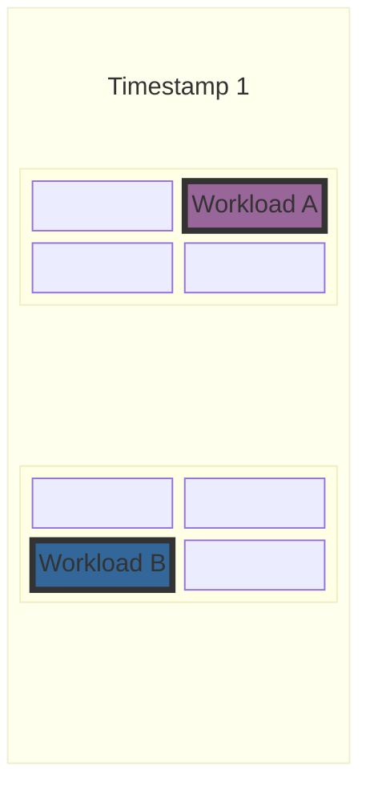
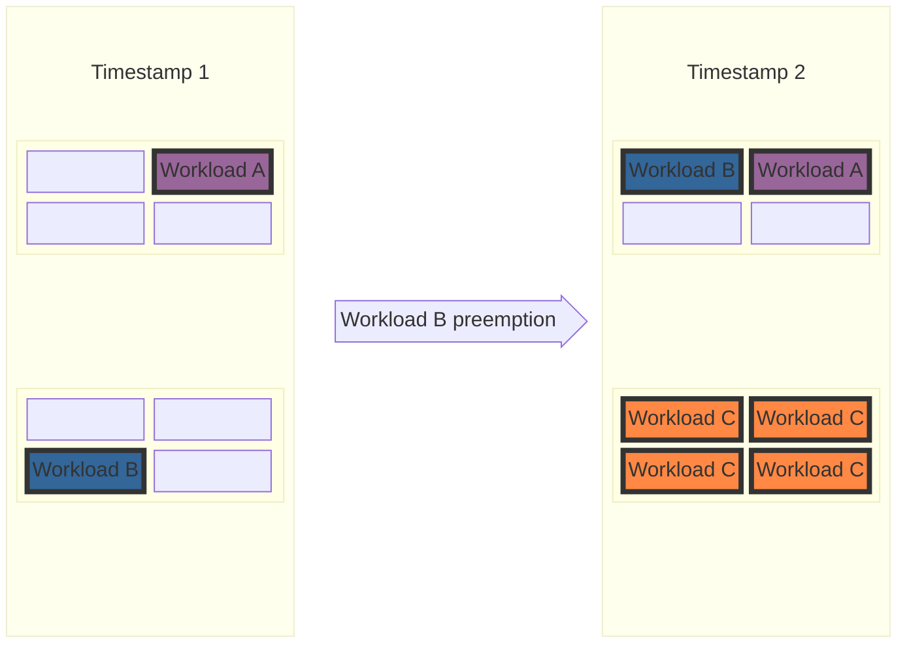

# KEP-13396: Configurable Preemptions

<!-- toc -->
- [Summary](#summary)
- [Motivation](#motivation)
  - [1. Defragmentation](#1-defragmentation)
  - [2. Hero workloads](#2-hero-workloads)
  - [3. Desired behavior of preemptions is business driven](#3-desired-behavior-of-preemptions-is-business-driven)
  - [Other related issues](#other-related-issues)
  - [Goals](#goals)
  - [Non-Goals](#non-goals)
- [Proposal](#proposal)
  - [User Stories](#user-stories)
    - [Story 1 - Defragmentation](#story-1---defragmentation)
    - [Story 2 - Hero job](#story-2---hero-job)
    - [Story 3 - Business driven preemption rules](#story-3---business-driven-preemption-rules)
  - [Notes](#notes)
  - [Constraints](#constraints)
  - [Caveats](#caveats)
  - [Risks and Mitigations](#risks-and-mitigations)
    - [Cascading preemptions due to misconfiguration](#cascading-preemptions-due-to-misconfiguration)
    - [Performance degradation](#performance-degradation)
    - [Security considerations](#security-considerations)
- [Design Details](#design-details)
  - [Proposed API PreemptionConfig](#proposed-api-preemptionconfig)
  - [Proposed API for PreemptionLimit](#proposed-api-for-preemptionlimit)
  - [Preemption evaluation flow in scheduler](#preemption-evaluation-flow-in-scheduler)
    - [Step-by-Step Breakdown](#step-by-step-breakdown)
  - [Efficient iteration through candidates in configured order](#efficient-iteration-through-candidates-in-configured-order)
    - [Problem Statement](#problem-statement)
    - [Naive Solutions and Complexity Bottlenecks](#naive-solutions-and-complexity-bottlenecks)
    - [Proposed Approach: Per-Selector, Per-CQ Priority Queues](#proposed-approach-per-selector-per-cq-priority-queues)
    - [Implementation Caveats and Selector Isolation](#implementation-caveats-and-selector-isolation)
    - [Open Challenges](#open-challenges)
  - [Observability](#observability)
  - [Test Plan](#test-plan)
    - [Unit tests](#unit-tests)
    - [Integration tests](#integration-tests)
    - [e2e tests](#e2e-tests)
  - [Graduation Criteria](#graduation-criteria)
    - [Alpha](#alpha)
    - [Beta](#beta)
    - [Stable](#stable)
- [Implementation History](#implementation-history)
- [Drawbacks](#drawbacks)
- [Alternatives](#alternatives)
<!-- /toc -->

## Summary

<!--
This section is incredibly important for producing high-quality, user-focused
documentation such as release notes or a development roadmap. It should be
possible to collect this information before implementation begins, in order to
avoid requiring implementors to split their attention between writing release
notes and implementing the feature itself. KEP editors and SIG Docs
should help to ensure that the tone and content of the `Summary` section is
useful for a wide audience.

A good summary is probably at least a paragraph in length.

Both in this section and below, follow the guidelines of the [documentation
style guide]. In particular, wrap lines to a reasonable length, to make it
easier for reviewers to cite specific portions, and to minimize diff churn on
updates.

[documentation style guide]: https://github.com/kubernetes/community/blob/master/contributors/guide/style-guide.md
-->

This KEP introduces **Configurable Preemptions** in Kueue through two cluster-scoped CRDs: `PreemptionConfig` and `PreemptionLimit`.
This enables declarative preemption policies for scenarios unsupported by existing heuristics, including topology defragmentation, mission-critical "hero" workloads, and business SLA constraints.
With `PreemptionConfig`, administrators can configure explicit triggers (quota or topology constraints), candidate selectors (such as priority relations, execution age, and custom numeric labels), and deterministic ordering. `PreemptionLimit` provides rate-limiting guardrails across global, queue, and workload scopes to prevent cascading preemptions and maintain cluster stability.

## Motivation

### 1. Defragmentation

Kueue does not support inter-ClusterQueue topology-based preemptions when workloads are within their cluster queue's nominal quota. Because of this, small workloads can sometimes block large topology domains.
In some clusters, this may be desired, as disruptions of critical workloads should be avoided as much as possible.

In other setups, better cluster utilization or the ability to schedule higher-priority jobs that are blocked due to cluster fragmentation is more important. Therefore, additional defragmentation mechanisms are needed to allow higher-priority workloads to move smaller workloads between topology domains. The expected behavior in this case can be seen in the following example:

Let us consider a cluster with 2 racks where each rack has 4 nodes.
For simplicity, we will equate resources with nodes, and assume there is only one resource flavor with a natural 2-level topology: rack, hostname.

And 3 cluster queues:
* Queue A with quota 1.
* Queue B with quota 1.
* Queue C with quota 4.

The total cluster capacity is 8 nodes, which is strictly larger than the sum of the queues' nominal quotas (6 nodes across all queues).

At **Timestamp 1**, two workloads are running:
Workload A from Queue A and Workload B from Queue B, each consuming 1 node (their respective queue's nominal quota).



Next, Workload C arrives requiring 4 nodes in a single rack. Although sufficient quota is available, neither rack can accommodate it because Workload A and Workload B occupy one node in each rack, fragmenting both topology domains.


To schedule Workload C, one of the running workloads must be preempted and relocated to the other rack. However, Kueue currently does not support this because all running workloads are within their cluster queues' nominal quotas.



### 2. Hero workloads

Related [issue](https://github.com/kubernetes-sigs/kueue/issues/8826).

Hero workloads are often high-priority and require the majority of the cluster quota.
Currently, Kueue does not natively support their needs as it has no notion of elevated preemption privileges to overrule standard quota and topology limitations when needed. In particular, Kueue does not allow for preemption of jobs that are within cluster queues' guaranteed quotas from other cluster queues.
Current workarounds like "temporary" overrides of
quotas assigned to all cluster queues are bad from the user experience perspective as they require manual handling.
Moreover, they lead to wasted resources if a hero workload fails for
some reason and quotas are not brought back to their previous state.

### 3. Desired behavior of preemptions is business driven

Many companies have specific requirements for when a workload should or should not be preempted,
depending on their business needs.
For example, [issue #9596](https://github.com/kubernetes-sigs/kueue/issues/9596) asks for adding a parameter for minimal execution time before preemption.

Yet another example comes from the ETL world. Some businesses have SLAs for the freshness of the provided information. Therefore,
failure to run a workload in time (as dictated by the SLA) can lead to significant financial penalties. On the other hand, those workloads might not be super high-priority — they should not preempt other workloads, and the fact that they will run in the next "X hours" is enough to satisfy the SLA.

Other businesses might need workloads that are not preemptible at all.


### Other related issues
* maxPriorityThreshold for withinClusterQueue preemptions [#12001](https://github.com/kubernetes-sigs/kueue/issues/12001)
* maxPriorityThreshold for reclaimWithinCohort [#12046](https://github.com/kubernetes-sigs/kueue/issues/12046)

<!--
This section is for explicitly listing the motivation, goals, and non-goals of
this KEP.  Describe why the change is important and the benefits to users. The
motivation section can optionally provide links to [experience reports] to
demonstrate the interest in a KEP within the wider Kubernetes community.

[experience reports]: https://github.com/golang/go/wiki/ExperienceReports
-->

### Goals
1. Preemptions triggered by lack of sufficient topology domains to run the workload.
2. Inter-ClusterQueue preemptions.
3. Configurability of preemptions to satisfy various business requirements.
4. Definition of the most common fields that can be used to build preemption configurations.
5. Definition of "golden" configurations for common preemption scenarios.


### Non-Goals
1. Full defragmentation of the cluster.
2. One advanced preemption config to fulfill all preemption needs.
3. Support for preemptions using arbitrary Workload fields — this KEP aims to
create a good baseline for configurations that can be extended in the future; it does not aim to be comprehensive for every possible scenario.
4. Complete replacement of current preemption strategies.


## Proposal

Introduce a new CRD **PreemptionConfig** that will be used to define:
- triggers for when preemption should occur (e.g. insufficient topology to schedule the workload),
- rules defining which workloads should be considered for preemption,
- order in which workloads should be preempted (until the considered workload can be scheduled).

The **PreemptionConfig** object is a cluster-wide resource that can be referenced by multiple cluster queues.

The new **PreemptionConfig** object will be referenceable in the **ClusterQueueSpec** in the following way:

```go
  // preemption defines the preemption policies. Must be null if PreemptionConfigName is specified.
  // +kubebuilder:default={}
  // +optional
  Preemption *ClusterQueuePreemption `json:"preemption,omitempty"`

  // Reference to the PreemptionConfig to be used. If specified, Preemption
  // must be null. Settings in PreemptionConfig overwrite any preemption
  // defaults that may be in the system. Indicated config defines which workloads
  // will be considered for preemption if a workload from this cluster queue cannot be
  // scheduled due to resource or topology constraints.
  // +optional
  PreemptionConfigName *string `json:"preemptionConfigName,omitempty"`

```


In parallel, introduce the **PreemptionLimit** cluster-scoped CRD. This CRD will allow cluster administrators to define the overall number of preemptions for a specific "scope" in a particular time window. This will give administrators fine-grained settings to control the number of preemptions that can occur in the cluster, thereby giving them more control over cluster stability.
Workloads will only be preempted if doing so respects all defined limits. The following scopes will be supported:

- Global — total number of preemptions that can occur in the cluster.
- PreemptingClusterQueue — total number of preemptions triggered by workloads from a particular cluster queue.
- PreemptedClusterQueue — total number of preemptions of workloads that belong to a specific cluster queue.
- PreemptedWorkload — total number of times a particular workload can be preempted.

Details about the API can be seen in the [Design Details](#design-details) section.

Success criteria:

1. Cluster administrators are able to configure preemptions in the cluster in a way that satisfies their organization's needs.
2. Workloads are preempted only if allowed by the appropriate preemption config (or classical `preemption` field) and preemption limits.
3. Most popular setups are possible, tested, and covered by documentation:
    - Defragmentation
    - Hero jobs

### User Stories

Each of the user stories mentioned in the motivation section can be fulfilled by an appropriate config and/or preemption limits. Configs and limits for each of them can be found below in the appropriate subsections.

#### Story 1 - Defragmentation

A user can define a config with an `InsufficientTopology` trigger that will allow preemption of workloads blocking specific topologies when scheduling a workload from the associated cluster queue requires it. To avoid "flappy" preemption issues, the rules should be limited in a way that guarantees asymmetry: if A can preempt B, B shouldn't be able to preempt A. This can be done in various ways, for example:
* Only allow preemption of workloads with strictly lower priority.
* Only allow preemption of workloads that require smaller topologies (e.g. using a custom numeric label).
* Only allow preemption of workloads that should be preemptible according to FairSharing rules.

An example config based on priority and number of TPUs can look like this:
```yaml
spec:
  rules:
    - trigger: "InsufficientTopology"
      minTriggerRequiredDuration: "30s"
      candidates:
        - relativeWorkloadPriority: "LowerOrEqual"
          relationRequirement: "AnyClusterQueue"
          numericLabels:
            - key: "tpus-count"
              relation: "Lower"
              default: 0
  ordering:
    - orderingField: "Priority"
```

As it has an `AnyClusterQueue` relation, it can preempt workloads even if they are not related in any way to the preemptor cluster queue. In combination with a custom numeric label selector using strict `Lower`, this guarantees asymmetry: a larger-topology workload can preempt smaller workloads blocking the required topology domain, but smaller or equal-sized workloads cannot preempt the larger workload in return, preventing mutual preemption loops. Effectively, when the smaller workloads are re-admitted, they can be placed in smaller fragmented domains (where the larger workload cannot fit), thereby defragmenting the cluster.

#### Story 2 - Hero job

This example shows how a hero job's preemption configuration can be set up. It proposes an exemplary separate preemption configuration for the hero job's cluster queue, but in practical deployments it should be tailored to the user's needs.

Assumptions:
 - The hero job has a higher priority than regular workloads in the cluster,
 - The hero job should have elevated privileges to preempt other workloads,
 - The hero job is a mission-critical job and should be scheduled as soon as possible,
 - The hero job should not be preemptible by any other workload.

This can be achieved by a separate preemption config for the hero job. The config should be referenced by the hero job's cluster queue. The config will have two rules, allowing it to preempt any lower-priority workload across any ClusterQueue for either quota or topology reasons:

```yaml
spec:
  rules:
    - trigger: "InsufficientTopology"
      candidates:
        - relativeWorkloadPriority: "Lower"
          relationRequirement: "AnyClusterQueue"
    - trigger: "InsufficientQuota"
      candidates:
        - relativeWorkloadPriority: "Lower"
          relationRequirement: "AnyClusterQueue"
  ordering:
    - orderingField: "Priority"
```

And then to make sure that the hero job is never preempted, one may:
1. Make the hero job's priority higher than any other workload's priority and do not allow preemption of workloads with higher or equal priority.
2. Have preemption limits with 0 allowed preemptions from the hero job's CQ. (Doable after milestone 5)
3. Define in candidate selectors subfield `ClusterQueueSelector` of other configurations that they cannot preempt from the hero job's CQ.

Thanks to the elevated preemption privileges, the hero job will be able to preempt any workload and borrow quota from other CQs in the cohort tree (this job will still be affected by lending limits — so they have to be set appropriately to allow for gathering quota). It will also effectively lock this quota, as no other workload will be able to preempt it.

#### Story 3 - Business driven preemption rules

Requested functionalities from the community can be satisfied with the following rules:
 1. [Issue #9596](https://github.com/kubernetes-sigs/kueue/issues/9596) can be satisfied by using `MinExecutionDuration` in the defined configuration rules.
 2. [Issue #12001](https://github.com/kubernetes-sigs/kueue/issues/12001) can be satisfied by using `CandidateWorkloadPrioritySelector` and "SameClusterQueue" `PreemptionRelationConstraint` in appropriate rules.
 3. [Issue #12046](https://github.com/kubernetes-sigs/kueue/issues/12046) can also be satisfied by using `CandidateWorkloadPrioritySelector` in rules with a combination of "SameCohort" `PreemptionRelationConstraint` and "BorrowingCapacityFromPreemptor" `QuotaConstraint`.
 4. Defined SLA requirements can be modeled with `MaxTimeFromCreationDuration` — to avoid preempting workloads that are older than X and are from a specific cluster queue or that have a specific label.

### Notes

There are many possible extensions of the proposed selectors in the rules. For now, we propose to support only those that seem most common and natural, but the design allows for extensibility. Examples of possible extensions include:
- advanced topology comparison selectors extending custom numeric label based selector — e.g. "require same podset required levels for considered workloads",
- resource requests/limits based selectors — "only preempt workloads that request less than X amount of resources",
- detection of misconfigurations causing preemption cycles.

As the scope of the design is already broad, we leave them as a separate implementation effort and not part of the initial KEP proposal.


### Constraints

- **Mutual Exclusivity & Backward Compatibility:** `ClusterQueue.spec.preemption` and `ClusterQueue.spec.preemptionConfigName` are mutually exclusive. Existing preemption behavior and configurations remain completely backward-compatible when `ClusterQueue.spec.preemptionConfigName` is not set.
- **Deterministic Scheduling:** Candidate selection, victim evaluation, and tie-breaking must remain strictly deterministic across scheduling cycles (guaranteed by multi-key comparison chains and Workload UID tie-breaking).
- **Non-mutating Evaluation:** Preemption evaluation operates strictly on cluster snapshot state and simulated usage without mutating workload specs or priorities during preemption simulation.
- **Resource Scope:** `PreemptionConfig` and `PreemptionLimit` are cluster-scoped CRDs subject to standard Kubernetes RBAC and controller-runtime caching mechanisms.


### Caveats

Given the extensive nature of **PreemptionConfigs** defined below, the API introduces several complexities where users might inadvertently misconfigure their setup. To maximize user success, the following mitigations will be implemented:

* Deliver concrete examples demonstrating successful configurations.
* Offer detailed scenarios illustrating invalid configurations or potential flapping issues.
* Communicate explicitly that custom rule creation carries inherent risks and is intended for power users — the OSS Kueue community might not be able to support troubleshooting every custom scenario.


### Risks and Mitigations

#### Cascading preemptions due to misconfiguration
One inherent risk is users deploying ill-defined preemption configs that could lead to cluster instability (e.g. cascading preemptions). The design includes the following mitigations:
1. **Global limits** — cluster administrators have an additional safety measure that can be used to roll out new configs or rules gradually, by limiting the number of preemptions permitted by a particular config or rule.
2. **Restrictive default preemption configuration** — By default, an empty config does not lead to any preemptions as candidate selection rules will be empty.
3. **Documentation** — Comprehensive documentation will be provided to help users understand the risks and benefits of each configuration option, including examples of common preemption scenarios and how to configure them.

#### Performance degradation
Another risk is preemption performance degradation due to the generic nature of new rules and a potentially large number of selectors. This risk will be mitigated by the implementation of a performance-focused test suite for preemptions.

The test suite will be used to benchmark the new implementation against the existing one to ensure that there is no significant performance degradation for already defined "high-level" policies.
The test suite will also be used to identify performance optimization opportunities for the newly introduced code.

The documentation will also clearly indicate that the creation of a large number of complex preemption rules may have performance implications for overall scheduling, and that it is recommended to benchmark your configs before rolling out to production.

#### Security considerations

As preemption configurations will be modifiable only by cluster administrators, there are no additional security risks. Administrators modifying them should be aware of the risks and consequences of misconfiguration in Kueue, which can effectively lead to no workloads being scheduled.

## Design Details

### Proposed API PreemptionConfig

```go
type PreemptionConfig struct {
  metav1.TypeMeta `json:",inline"`
  metav1.ObjectMeta `json:"metadata,omitempty"`
  Spec PreemptionConfigSpec `json:"spec,omitempty"`
}

type PreemptionConfigSpec struct {
  // Rules to select preemption candidates.
  Rules []PreemptionRule

  // Ordering of preemption candidates evaluated sequentially as a multi-key comparator chain.
  // The order is always deterministic, as the Workload UID is used as the final tie-breaker.
  // If not set, candidates will be ordered by default like this:
  // 1. Priority (Ascending: lowest priority first)
  // 2. AdmissionTimestamp (Descending: most recently admitted first, protecting long-running workloads)
  // 3. UID (Ascending: deterministic tie-breaker)
  Ordering []Order
}

// +kubebuilder:validation:Enum=InsufficientQuota;QuotaReclaimRequired;InsufficientTopology
type PreemptionRuleTrigger string

const (
  // InsufficientQuota means that there was an attempt to admit the workload,
  // but there was not enough unused quota in the ClusterQueue or its Cohort to accommodate the Workload.
  InsufficientQuota PreemptionRuleTrigger = "InsufficientQuota"

  // QuotaReclaimRequired means that there was an attempt to admit the workload
  // and workload should be admissible according to nominal quota of the ClusterQueue,
  // but it cannot as quota was borrowed. Thereby, quota will have to be reclaimed before this workload is scheduled.
  QuotaReclaimRequired PreemptionRuleTrigger = "QuotaReclaimRequired"

  // InsufficientTopology means that there was an attempt to admit the workload,
  // quota was available, but no topology domain satisfied its requirements.
  // Unlike quota-related conditions, this condition is only reset on admission, as it is checked only after quota is available for the workload. 
  InsufficientTopology PreemptionRuleTrigger = "InsufficientTopology"
)

type PreemptionRule struct {
  Name string

  // Label Selector indicating which workloads can trigger preemptions
  // using this rule.
  MatchingPreemptorWorkloads metav1.LabelSelector

  Trigger PreemptionRuleTrigger

  // How long the trigger has to occur to start preempting workloads specified by candidates. 0s indicates that preemptions can be started immediately. Default is 0s.
  MinTriggerRequiredDuration metav1.Duration

  // Selection rules for workloads that are candidates for preemption.
  // Candidates resulting from multiple selectors are summed into one set. No selectors result in an empty candidate set, thereby disallowing any preemptions with this rule.
  Candidates []PreemptionCandidateSelector
}
```

The first observation timestamp when a specific trigger occurred is recorded in the workload conditions. The conditions are cleared upon successful admission of the workload or if they are no longer true in the case of quota-related conditions.

This will result in the following new condition types:
`InsufficientQuota`, `InsufficientTopology`, `QuotaReclaimRequired`.

For quota-related conditions, the `reason` field will be set to `QuotaFreed` if the condition was reset due to enough quota becoming available to schedule the workload.


```go

// PreemptionRelationConstraint specifies the relational boundary between
// the preempting workload's queue and candidate workloads' queues.
// Possible values are:
// - "SameLocalQueue": restricts preemption candidates to workloads submitted to the exact same LocalQueue (matching name and namespace).
// - "SameClusterQueue": restricts preemption candidates to workloads submitted to the same ClusterQueue as the preemptor.
// - "SameCohort": restricts preemption candidates to workloads in ClusterQueues that share the exact same immediate direct Cohort, as well as workloads in the preemptor's own ClusterQueue (even if standalone).
// - "SameCohortTree": restricts preemption candidates to workloads in ClusterQueues that belong to the same Cohort Tree (sharing the same root ancestor Cohort), as well as workloads in the preemptor's own ClusterQueue (even if standalone).
// - "AnyClusterQueue": places no relationship restrictions on preemption candidates.
//
// +kubebuilder:validation:Enum=SameLocalQueue;SameClusterQueue;SameCohort;SameCohortTree;AnyClusterQueue
type PreemptionRelationConstraint string

const (
  // SameLocalQueue restricts preemption candidates to workloads submitted
  // to the exact same LocalQueue (matching name and namespace).
  SameLocalQueue PreemptionRelationConstraint = "SameLocalQueue"

  // SameClusterQueue restricts preemption candidates to workloads submitted
  // to the same ClusterQueue as the preemptor.
  SameClusterQueue PreemptionRelationConstraint = "SameClusterQueue"

  // SameCohort restricts preemption candidates to workloads in ClusterQueues
  // that share the exact same immediate direct Cohort, as well as workloads in the
  // preemptor's own ClusterQueue (even if standalone and lacking a parent cohort).
  SameCohort PreemptionRelationConstraint = "SameCohort"

  // SameCohortTree restricts preemption candidates to workloads in ClusterQueues
  // that belong to the same Cohort Tree (sharing the same root ancestor Cohort),
  // as well as workloads in the preemptor's own ClusterQueue (even if standalone and lacking a parent cohort).
  SameCohortTree PreemptionRelationConstraint = "SameCohortTree"

  // AnyClusterQueue places no relationship restrictions on preemption candidates.
  AnyClusterQueue PreemptionRelationConstraint = "AnyClusterQueue"
)


// +kubebuilder:validation:Enum=BorrowingCapacityFromPreemptor;DRSLessThanOrEqualToFinalShare;DRSLessThanInitialShare;DRSAllStrategies
type QuotaConstraint string

const (
  BorrowingCapacityFromPreemptor QuotaConstraint = "BorrowingCapacityFromPreemptor"
  DRSLessThanOrEqualToFinalShare QuotaConstraint = "DRSLessThanOrEqualToFinalShare"
  DRSLessThanInitialShare QuotaConstraint = "DRSLessThanInitialShare"
  DRSAllStrategies QuotaConstraint = "DRSAllStrategies"
)


// PreemptionCandidateSelector defines the selection criteria for workloads that are candidates for preemption.
type PreemptionCandidateSelector struct {

  // RelationRequirement specifies the queue or cohort relation boundary to the preemptor workload.
  // Required. 
  RelationRequirement PreemptionRelationConstraint

  // Accepts all if not set. 
  // Cannot be set if RelationRequirement is SameLocalQueue or SameClusterQueue.
  Quota QuotaConstraint

  // Accepts all if not set
  // NumericLabels defines rules for filtering candidates using custom numeric labels on the Workload resource.
  // Multiple numeric labels are joined using AND-rule (all have to be satisfied).
  NumericLabels []NumericLabelConstraint

  // Accepts all if not set.
  ClusterQueueSelector metav1.LabelSelector

  // Accepts all if not set
  WorkloadSelector metav1.LabelSelector

  // Accepts all if not set
  HostNodeSelector metav1.LabelSelector

  // Matches all workload priority classes if not set.
  PreemptingWorkloadPrioritySelector metav1.LabelSelector

  // Matches all workload priority classes if not set.
  CandidateWorkloadPrioritySelector metav1.LabelSelector

  // RelativeWorkloadPriority defines how the preemptor's priority compares to the candidate's priority.
  // For example "Lower" means that only workloads with lower
  // priority will be allowed as preemption candidates.
  // The comparison is made using effective priority (accounting for priority boost if enabled).
  // If nil, no relative priority check is enforced.
  RelativeWorkloadPriority *RelativeConstraint

  // Accepts any execution times if not set
  MinExecutionDuration *metav1.Duration
  MaxExecutionDuration *metav1.Duration
  ExecutionTimeRelation *RelativeConstraint

  // Accepts any time from creation if not set
  MinTimeFromCreationDuration *metav1.Duration
  MaxTimeFromCreationDuration *metav1.Duration
  TimeFromCreationRelation *RelativeConstraint
}


// NumericLabelConstraint describes the rule for filtering a custom numerical label.
// For example, this can be used to filter candidates based on the label describing the
// required topology domain size, such as the "number of TPUs". 
// If a user has a label "number-of-tpus" that describes the number of TPUs required in a single cube,
// it can be used to create a rule that selects only workloads requiring smaller cube slices 
// by defining relation: "Lower". Such a configuration would allow preemption of "smaller" workloads,
// to achieve better cluster utilization and decrease fragmentation.
// Please note that those labels are not copied out of the box from job-like objects.
// You should remember to append the designated labels to the list of labels
// copied to the workload via the Kueue main configuration
// if you wish to use a custom label.
type NumericLabelConstraint struct {
  // Key is the label key that stores the integer value in the workload that will
  // be used for candidate selection.
  Key string `json:"key"`

  // DefaultValue is used when a workload does not have the label key
  // or the value under the key cannot be parsed as an integer.
  // If not specified, workloads without the label or 
  // with a label value not parsable as int are treated as incomparable, 
  // and therefore excluded from preemption candidates.
  // +optional
  DefaultValue *int32 `json:"defaultValue,omitempty"`

  // Relation defines how the preemptor compares to the candidate.
  // +optional
  Relation *RelativeConstraint `json:"relation,omitempty"`

  // MinValue specifies the lowest label value a candidate workload can have to be considered for preemption.
  // +optional
  MinValue *int32 `json:"minValue,omitempty"`

  // MaxValue specifies the highest label value a candidate workload can have to be considered for preemption.
  // +optional
  MaxValue *int32 `json:"maxValue,omitempty"`
}

// RelativeConstraint defines how a specified numeric property (e.g., effective priority) of the candidate compares to the same property of the preemptor.
// Possible values are:
// - "Lower": permits preemption if candidate field value < preemptor field value
// - "Greater": permits preemption if candidate field value > preemptor field value
// - "LowerOrEqual": permits preemption if candidate field value <= preemptor field value
// - "GreaterOrEqual": permits preemption if candidate field value >= preemptor field value
// +kubebuilder:validation:Enum=Lower;Greater;LowerOrEqual;GreaterOrEqual
type RelativeConstraint string

const (
  // Lower permits preemption if candidate field value < preemptor field value
  Lower RelativeConstraint = "Lower"
  // Greater permits preemption if candidate field value > preemptor field value
  Greater RelativeConstraint = "Greater"
  // LowerOrEqual permits preemption if candidate field value <= preemptor field value
  LowerOrEqual RelativeConstraint = "LowerOrEqual"
  // GreaterOrEqual permits preemption if candidate field value >= preemptor field value
  GreaterOrEqual RelativeConstraint = "GreaterOrEqual"
)

// Kueue uses full, descriptive identifiers ("Lower", "Greater", "LowerOrEqual", "GreaterOrEqual").
// This maintains consistency with equality comparisons, enhances YAML readability, and provides
// clear, intuitive semantics for cluster administrators.

// OrderingField specifies the criterion used to sort candidate workloads during preemption evaluation.
// Note: OrderingField is a predefined enum of sorting keys, not arbitrary fields of the Workload struct.
// Supported values are:
// - "Priority": orders workloads by effective priority (accounting for priority boost if enabled).
//   - Ascending (default): lowest priority first.
//   - Descending: highest priority first.
//
// - "AdmissionTimestamp": orders workloads by the timestamp when quota was reserved (admitted).
//   - Ascending (default): oldest admitted workloads first (FIFO preemption).
//   - Descending: most recently admitted workloads first (LIFO preemption, protecting long-running workloads, matching classical Kueue).
//
// - "ClusterQueueDRS": orders workloads based on their ClusterQueue's Dominant Resource Share.
//   - Ascending (default): workloads from ClusterQueues with lower Dominant Resource Share first.
//   - Descending: workloads from ClusterQueues with higher Dominant Resource Share first (preempting heavy borrowers first).
//
// - "IsOtherCQ": orders workloads based on whether they belong to a different ClusterQueue than the preemptor.
//   - Ascending (default): workloads from the same ClusterQueue first, followed by other ClusterQueues.
//   - Descending: workloads from other ClusterQueues first, followed by the same ClusterQueue.
//
// - "IsOtherCohort": orders workloads based on whether they belong to a different Cohort than the preemptor.
//   - Ascending (default): workloads from the same direct Cohort first, followed by other Cohorts.
//   - Descending: workloads from other Cohorts first, followed by the same Cohort.
//
// - "IsDRSLessThanInitialShare": orders workloads based on whether preemption of the workload is fair according to the DRSLessThanInitialShare strategy.
//   - Ascending (default): workloads from ClusterQueues exceeding their initial share first (prioritizing preemption of borrowing workloads).
//   - Descending: workloads from ClusterQueues within their initial share first.
//
// - "IsDRSLessThanOrEqualToFinalShare": orders workloads based on whether preemption of the workload is fair according to the DRSLessThanOrEqualToFinalShare strategy.
//   - Ascending (default): workloads from ClusterQueues exceeding their final share first (protecting workloads within fair share).
//   - Descending: workloads from ClusterQueues within or equal to their final share first.
//
// +kubebuilder:validation:Enum=Priority;AdmissionTimestamp;ClusterQueueDRS;IsOtherCQ;IsOtherCohort;IsDRSLessThanInitialShare;IsDRSLessThanOrEqualToFinalShare
type OrderingField string

const (
  // Priority orders candidates by effective priority (accounting for priority boost if enabled).
  // Ascending order places lowest priority candidates first.
  Priority OrderingField = "Priority"

  // AdmissionTimestamp orders candidates by the time quota was reserved.
  // Ascending order places oldest admitted candidates first and most recently admitted last.
  AdmissionTimestamp OrderingField = "AdmissionTimestamp"

  // ClusterQueueDRS orders candidates based on their ClusterQueue's Dominant Resource Share.
  // Ascending order places candidates from ClusterQueues with lower Dominant Resource Share first.
  ClusterQueueDRS OrderingField = "ClusterQueueDRS"

  // IsOtherCQ orders candidates based on whether their ClusterQueue differs from the preemptor.
  // Ascending order places workloads from the same ClusterQueue first.
  IsOtherCQ OrderingField = "IsOtherCQ"

  // IsOtherCohort orders candidates based on whether their direct Cohort differs from the preemptor.
  // Ascending order places workloads from the same Cohort first.
  IsOtherCohort OrderingField = "IsOtherCohort"

  // IsDRSLessThanInitialShare orders candidates based on whether preemption is fair according to DRSLessThanInitialShare.
  // Ascending order places workloads whose ClusterQueue exceeds initial share first.
  IsDRSLessThanInitialShare OrderingField = "IsDRSLessThanInitialShare"

  // IsDRSLessThanOrEqualToFinalShare orders candidates based on whether preemption is fair according to DRSLessThanOrEqualToFinalShare.
  // Ascending order places workloads whose ClusterQueue exceeds final share first.
  IsDRSLessThanOrEqualToFinalShare OrderingField = "IsDRSLessThanOrEqualToFinalShare"
)

// OrderingDirection specifies the sort direction for a candidate ordering criterion.
// Possible values are:
// - "Ascending": sort in natural ascending order (default).
// - "Descending": sort in reverse/descending order.
//
// +kubebuilder:validation:Enum=Ascending;Descending
type OrderingDirection string

const (
  // Ascending sorts candidate workloads in natural order (e.g., lowest priority first, oldest admission first, or same CQ/Cohort first).
  Ascending OrderingDirection = "Ascending"

  // Descending sorts candidate workloads in reverse order (e.g., highest priority first, newest admission first, or other CQ/Cohort first).
  Descending OrderingDirection = "Descending"
)

// Order specifies a single sorting criterion and direction for ordering preemption candidates.
// Multiple Order criteria are evaluated sequentially as a multi-key comparator chain,
// with ties broken by Workload UID for deterministic ordering.
type Order struct {
  // OrderingField specifies the field to sort preemption candidates by.
  //
  // +kubebuilder:validation:Required
  OrderingField OrderingField `json:"orderingField"`

  // Direction specifies whether to sort preemption candidates in ascending or descending order.
  // Defaults to "Ascending" if not specified.
  //
  // +kubebuilder:default=Ascending
  // +optional
  Direction OrderingDirection `json:"direction,omitempty"`
}

```


As defined by [current ordering](https://github.com/kubernetes-sigs/kueue/blob/24f6f99135979076a8d56ca7fc407990b98c66af/pkg/scheduler/preemption/common/ordering.go#L34-L41),
the order is currently based on:

0. Workloads already marked for preemption first.
1. Workloads from other ClusterQueues in the cohort before the ones in the same ClusterQueue as the preemptor.
2. (AdmissionFairSharing only) Workloads with lower LocalQueue's usage first
3. Workloads with lower priority first.
4. Workloads admitted more recently first.

Therefore, the new ordering fields should cover this well. 


### Proposed API for PreemptionLimit

```go
type PreemptionLimit struct {
  metav1.TypeMeta 
  metav1.ObjectMeta 
  Spec PreemptionLimitSpec
  Status PreemptionLimitStatus
}

// +kubebuilder:validation:Enum=Global;PreemptingClusterQueue;PreemptedClusterQueue;PreemptedWorkload
type PreemptionLimitScope string
const (
  GlobalPreemptionLimitScope PreemptionLimitScope = "Global"
  PreemptingCQLimitScope PreemptionLimitScope = "PreemptingClusterQueue"
  PreemptedCQLimitScope PreemptionLimitScope = "PreemptedClusterQueue"
  PreemptedWorkloadLimitScope PreemptionLimitScope = "PreemptedWorkload"
)

type PreemptionLimitSpec struct {
  // Required
  Scope PreemptionLimitScope

  // If empty, it applies to all PreemptionConfigs
  ConfigSelector metav1.LabelSelector
  
  // If empty, it applies to all CQs that may want to preempt.
  ClusterQueueSelector metav1.LabelSelector

  // If empty, it applies to all rules.
  RuleNames []string

  // Limit defines how many preemption events can occur within the given time window.
  // An event is defined as a confirmed (preemptor, preemptee) eviction pair.
  // Setting Limit to 0 blocks all preemptions under this limit's scope.
  // +kubebuilder:validation:Minimum=0
  Limit int

  // LimitWindowDuration specifies the sliding time window duration.
  // Must be greater than or equal to 1s to prevent sub-second thrashing.
  // +kubebuilder:validation:XValidation:rule="self >= duration('1s')",message="must be at least 1s"
  LimitWindowDuration metav1.Duration
}

type PreemptionLimitStatus struct {
  Conditions []metav1.Condition

  // Periodically updated, for reference only.
  // Map key depends on the scope. For Global it is just Global.
  // For CQ it is cluster queue name.
  // For Workload it is namespace + "/" + workload name.
  // Restricted to the top 1000 counts to fit within CRD size limits.
  Count map[string]int
}
```

PreemptionLimit limits the number of preemptions that happen for the specified set of rules. The preemption evaluator evaluates proposed preemptions against defined limit objects, allowing them to proceed only if adequate preemption quota remains. If a preemption is in the scope of multiple limits, quota must exist in all of them.
To track this, a list of preemption rule names responsible for selecting each candidate must be maintained.

To manage this data, Kueue stores a comprehensive preemption map in memory, which is isolated per PreemptionLimit. This map tracks all preemption event timestamps under a specific CQ/workload key, capturing events that occurred within the designated `LimitWindowDuration`. Moreover, it tracks only events that are in the scope of the specific limit; if a preemption does not match the defined config or rules selector, it will not be tracked in that particular instance of the preemption map.
This list is dynamically trimmed upon each retrieval to filter out expired timestamps.

Furthermore, the status of the PreemptionLimit is refreshed periodically — approximately every minute — to write the aggregated totals into the count map (restricted to the top 1000 counts to fit within CRD size limits).

#### Observability When Reaching Preemption Limits

When preemption is throttled or blocked due to an exhausted `PreemptionLimit`:
1. **Workload Condition**: A condition with type `PreemptionBlockedByLimit` (reason `PreemptionLimitExceeded`) is assigned to the preemptor Workload, with an informative message indicating which limit blocked admission (e.g. `"Preemption was blocked by PreemptionLimit <limit-name>"`).
2. **Kubernetes Events**: A Kubernetes `Event` with reason `PreemptionThrottled` is emitted on both the preemptor Workload and its ClusterQueue.
3. **Structured Audit Logging**: Informational/debug log entries are recorded specifying the limit name, scope, and affected entities for operator troubleshooting.


### Preemption evaluation flow in scheduler

The preemption evaluation flow integrates trigger condition tracking, upper-bound feasibility checks, ordered candidate evaluation (until quota and topology conditions are satisfied), and reverse-order victim backfilling across scheduling cycles:

```mermaid
flowchart TD
    subgraph Cycle1 ["1. Initial Cycle: Nomination & Trigger Condition Tracking"]
        A["Queue Heads Retrieved<br/>(queues.Heads)"] --> B["Nominate Workloads<br/>(nominate)"]
        B --> C["Order Entries into Iterator"]
        C --> D["Process Entry<br/>(processEntry)"]
        D --> E{"Workload Fits Directly?"}
        E -->|Yes| F["Admit Workload<br/>(admit)"]
        E -->|No| G["Assign / Update Trigger Conditions<br/>with Observation Timestamp in Workload Status<br/>(InsufficientQuota / QuotaReclaimRequired / InsufficientTopology)"]
        G --> H["Requeue Workload<br/>(Wait for trigger duration / quota)"]
    end

    subgraph CycleN ["2. Subsequent Cycles: Preemption Evaluation in getInitialAssignments"]
        H -.->|Next Scheduling Cycle| I["Consider Workload in Subsequent Cycle<br/>(nominate -> getInitialAssignments)"]
        I --> J["Evaluate Trigger Durations & Limits<br/>(PreemptionEvaluator)"]
        J --> K{"Is Any Trigger Duration Satisfied?<br/>(now - observed >= minDuration)"}
        K -->|No| L["Preemption Not Eligible Yet<br/>(Keep waiting / update condition)"]
        K -->|Yes| M["Upper-Bound Feasibility Check<br/>(CandidatesQuotaAndTopologyUpperLimit)"]
        M --> N{"Preemptor Fits if ALL<br/>Candidates Preempted?"}
        N -->|No| O["Preemption Infeasible<br/>(Preemptor cannot fit even with all candidates)"]
        N -->|Yes| P["Order Candidates<br/>(Sort per PreemptionConfig.Spec.Ordering)"]
        
        P --> Q["Candidate Selection Loop"]
        Q --> R["Take Next Candidate in Order"]
        R --> S["Add Candidate to Preemption Targets<br/>& Update Simulated Resources"]
        S --> T{"Preemptor Quota &<br/>Topology Needs Satisfied?"}
        T -->|No| U{"More Candidates?"}
        U -->|Yes| R
        U -->|No| V["Preemption Incomplete<br/>(Cannot satisfy requirements)"]
        
        T -->|Yes| W["Victim Backfilling<br/>(Test selected targets in REVERSED order)"]
        W --> X["For each victim in reverse order:<br/>Can preemptor fit WITHOUT preempting this victim?"]
        X --> Y{"Preemptor Still Fits?"}
        Y -->|Yes| Z["Remove victim from preemption targets<br/>(Backfill / preserve workload)"]
        Y -->|No| AA["Retain victim in preemption targets"]
        Z --> AB{"More victims to test?"}
        AA --> AB
        AB -->|Yes| X
        AB -->|No| AC["Final Preemption Targets Determined"]
    end

    subgraph Execution ["3. Preemption Execution in processEntry"]
        AC --> AD["Process Entry<br/>(processEntry in Preempt mode)"]
        AD --> AE{"Targets Overlapping or<br/>Workload No Longer Fits?"}
        AE -->|Yes| AF["Mark Skipped / Requeue"]
        AE -->|No| AG["Issue Preemptions<br/>(issuePreemptions)"]
        AG --> AH["Requeue Preemptor<br/>(Wait for victims to terminate)"]
    end

    subgraph Admission ["4. Admitting Cycle: Workload Admission in Subsequent Cycle"]
        AH -.->|Victims terminate & capacity freed| AI["Re-evaluate Preemptor in Next Cycle<br/>(nominate -> processEntry)"]
        AI --> AJ{"Preemptor Fits Directly?"}
        AJ -->|Yes| AK["Admit Preemptor Workload<br/>(admit)"]
        AJ -->|No| AL["Requeue / Re-evaluate Preemption"]
    end

    style Cycle1 fill:#f8f9fa,stroke:#6c757d,stroke-width:2px
    style CycleN fill:#eef6fc,stroke:#0d6efd,stroke-width:2px
    style Execution fill:#fff3cd,stroke:#ffc107,stroke-width:2px
    style Admission fill:#e8f5e9,stroke:#198754,stroke-width:2px
    style E fill:#fff3cd,stroke:#ffc107
    style K fill:#fff3cd,stroke:#ffc107
    style N fill:#fff3cd,stroke:#ffc107
    style T fill:#fff3cd,stroke:#ffc107
    style U fill:#fff3cd,stroke:#ffc107
    style Y fill:#fff3cd,stroke:#ffc107
    style AB fill:#fff3cd,stroke:#ffc107
    style AE fill:#fff3cd,stroke:#ffc107
    style AJ fill:#fff3cd,stroke:#ffc107
    style AK fill:#d1e7dd,stroke:#0f5132,stroke-width:2px
    style F fill:#d1e7dd,stroke:#0f5132,stroke-width:2px
```



#### Step-by-Step Breakdown

1. **Nomination & Condition Tracking (Cycle 1)**:
   - In `nominate()`, initial resource flavor requirements are calculated for all active queue heads.
   - In `processEntry()`, each entry is processed:
     - If the workload fits directly, it proceeds to admission (`admit()`).
     - If the workload cannot fit directly (e.g. requires preemption or lacks resources/topology), `processEntry()` assigns or updates the trigger condition (`InsufficientQuota`, `QuotaReclaimRequired`, or `InsufficientTopology`) along with an initial observation timestamp in `Workload.Status.Conditions` and requeues the workload.

2. **Trigger Duration & Preemption Evaluation (`PreemptionEvaluator`)**:
   - In subsequent scheduling cycles, `getInitialAssignments()` queries `PreemptionEvaluator` to check whether the elapsed time since the first observation timestamp satisfies `MinTriggerRequiredDuration` for any applicable preemption rule and evaluates preemption limits.
   - If no trigger duration is satisfied, preemption is bypassed for this cycle, allowing the workload to continue waiting.

3. **Upper-Bound Feasibility Check (`CandidatesQuotaAndTopologyUpperLimit`)**:
   - If a trigger duration is met, the scheduler performs an upper-bound check using `CandidatesQuotaAndTopologyUpperLimit` by simulating the removal of all matching candidate workloads.
   - If the preemptor cannot fit even when all candidates are preempted, the evaluation terminates early.

4. **Ordered Candidate Iteration (Quota & Topology Satisfaction)**:
   - Candidates are sorted based on `PreemptionConfig.Spec.Ordering`.
   - The scheduler iterates through candidate workloads in order, adding victims until the preemptor's resource quota and topology domain requirements are fully satisfied.

5. **Reverse-Order Victim Backfilling**:
   - Once a viable candidate set `[V_1, V_2, ..., V_k]` is assembled, the scheduler attempts backfilling by checking victims in reverse order, from `V_k` down to `V_1`.
   - For each victim, the scheduler evaluates whether the preemptor can still fit without evicting that victim. If the preemptor still fits, the victim is removed from the preemption target list, minimizing unnecessary workload disruptions.

6. **Execution (`issuePreemptions`)**:
   - In `processEntry()`, after checking for target overlap with earlier cycle decisions, `issuePreemptions()` issues evictions for the final victim set and requeues the preemptor workload, setting status conditions indicating preemption is pending.

7. **Admission in Follow-up Cycle (`admit`)**:
   - Preemption is asynchronous: the preemptor cannot be admitted immediately while victim pods are terminating.
   - Once all evicted victim workloads complete termination and release their quota and topology allocations, the preemptor is evaluated in a subsequent scheduling cycle. In this cycle, the preemptor fits directly within available capacity and proceeds to admission (`admit()`).


Preemption limits are evaluated in two complementary phases within `PreemptionEvaluator`:
- **Static Rule Qualification (Step 2)**: Before evaluating individual candidates, the evaluator checks whether remaining preemption quota exists for applicable rules under defined `PreemptionLimit` objects. If any mandatory limit is completely exhausted, the rule is bypassed.
- **Dynamic Limit Decrement (Step 4)**: During forward candidate iteration, as candidate workloads are simulated for preemption, local copies of scoped preemption limits (especially `PreemptedClusterQueue` and `PreemptedWorkload` limits) are decremented alongside simulated quota and DRS changes. If a candidate's eviction would exceed an active preemption limit, that candidate is skipped.


`CandidatesQuotaAndTopologyUpperLimit` by design is just an approximation to allow for short-circuiting when the preemptor obviously will not be admitted anyway. It will just use the initial state of the `PreemptionEvaluator` and does not attempt to simulate changes in DRS, borrowing, or preemption limits during iteration over candidates. However, the returned values should always be greater than or equal to what can be preempted at this moment, so it is reasonable to avoid heavy simulation if the result is smaller than the requested amount.

### Efficient iteration through candidates in configured order

#### Problem Statement
Certain preemption candidate rules—such as those based on `BorrowingCapacityFromPreemptor` or Dominant Resource Share (DRS) fair-sharing strategies—depend on dynamic cluster state that changes as candidate workloads are simulated for preemption during evaluation.

For example, consider cluster queues A and B, each with a nominal quota of 5. Suppose CQ B is currently borrowing 1 unit of quota from CQ A. If a workload in CQ A triggers preemption under a rule targeting only borrowing workloads, and each candidate workload in CQ B consumes 1 unit of quota, the evaluator should only preempt a single workload from CQ B. Once that first workload is selected, CQ B is no longer borrowing quota from CQ A, so remaining workloads in CQ B must immediately become ineligible for that borrowing rule.

Furthermore, dynamic cluster metrics (such as DRS in fair-sharing cohorts) mean that preemption eligibility and relative candidate ordering across cluster queues can shift after every candidate selection step.

#### Naive Solutions and Complexity Bottlenecks
Let:
- $n$: total number of candidate workloads across all cluster queues in the cohort.
- $c$: number of cluster queues in the cohort, with $c \ll n$.
- $s$: number of candidate selectors configured in `PreemptionConfig` rules, with $s \le 5$.
- $m$: number of victim workloads required to satisfy the preemptor, with $m \le n$.

Under dynamic state changes:
- **Naive Linear Filtering per Selection** (`O(m · n)` to `O(n²)`): Dynamically filtering the candidate set and linearly scanning for the minimum at each of the $m$ preemption steps requires $O(n)$ work per step, yielding $O(m \cdot n)$ time (up to $O(n^2)$ in the worst case where $m \approx n$).
- **Naive Dynamic Re-sorting** (`O(m · n log n)` to `O(n² log n)`): Naively re-sorting the candidate array whenever CQ borrowing or DRS metrics change introduces an $O(n \log n)$ sorting step per eviction, leading to $O(m \cdot n \log n)$ time and severe scheduler throughput degradation.

#### Proposed Approach: Per-Selector, Per-CQ Priority Queues
To achieve optimal scheduling performance without repetitive full-array scans or re-sorting, the evaluator maintains **separate priority queues partitioned by `(CandidateSelector, ClusterQueue)`**:

1. **Static Intra-Queue Ordering (Sort Once):**
   Within any given cluster queue, relative candidate ordering (e.g., by Priority, `AdmissionTimestamp`, Workload UID) is static and unaffected by dynamic quota borrowing or DRS changes. Therefore, candidate workloads within each `(Selector, CQ)` queue need to be sorted only once at the start of evaluation.

2. **CQ-Level State Tracking & Fast Pruning:**
   Dynamic state—such as current borrowed quota and cluster queue DRS—is tracked via lightweight counters attached to each CQ queue. When a CQ property no longer satisfies the selector's criteria (e.g., borrowed quota reaches zero for borrowing selectors), the entire priority queue for that CQ under that selector is pruned from consideration.

3. **Handling Workload-Specific Constraints (`DRSLessThanOrEqualToFinalShare`):**
   For selectors requiring workload-level evaluation (such as `DRSLessThanOrEqualToFinalShare`), the entire queue cannot simply be dropped at the CQ level because eligibility depends on the individual workload's DRS value. For these selectors, candidates are evaluated at extraction time when inspected at the queue head. If a candidate violates the fair-sharing constraint under current simulated state, it is popped and discarded for that selector.

4. **Multi-Queue Head Selection:**
   At each preemption step, the evaluator inspects the heads of all active priority queues and selects the globally minimal candidate according to the configured `PreemptionConfig.Spec.Ordering`.

5. **Deduplication & Multi-Queue Popping:**
   A single workload can match multiple candidate selectors (across one or more preemption rules) and thus reside in multiple priority queues. Because the ordering comparator is consistent across queues, the selected minimal workload will always be at the head of all its corresponding queues. When chosen, it is popped from all matching queue heads simultaneously. Workloads are stored as shared pointers/references across queues to eliminate data duplication.

6. **Visibility and Preemption Justification:**
   The set of priority queues from which a workload was popped directly identifies all matching candidate selectors and rules, providing immediate justification and audit metadata for the preemption decision (see [Observability](#observability)).

7. **Simulated State Updates:**
   After popping a candidate, the evaluator updates simulated state (reclaimed quota, updated DRS counters) and drops any newly ineligible CQ priority queues before the next selection step.

#### Example Walkthrough

Consider three cluster queues (CQ A, CQ B, and CQ C) in a flat cohort, each with 2 admitted workloads:
- **Workloads & Priorities**:
  - Preemptor: Workload A3 in ClusterQueue A, Priority = 40.
  - Candidates in CQ A: A1 (Priority = 20), A2 (Priority = 50).
  - Candidates in CQ B: B1 (Priority = 5), B2 (Priority = 10).
  - Candidates in CQ C: C1 (Priority = 30), C2 (Priority = 60).
- **Configured Rules & Ordering**:
  - `Ordering` is configured by `Priority` (Ascending, meaning lower priority workloads are preempted first).
  - *Rule 1 (Priority-based, intra-CQ)*: Preempt workloads within the same CQ (CQ A) with strictly lower priority than the preemptor (priority < 40). Candidate matching: Workload A1 (Priority 20).
  - *Rule 2 (Fair Sharing, inter-CQ)*: Preempt workloads from any ClusterQueue whose DRS exceeds its fair share.

Now, workload A3 arrives in ClusterQueue A and requires preemption to be admitted:

1. **Queue Initialization (2 selectors × 3 ClusterQueues = 6 priority queues)**:
   - For the priority selector (Rule 1), DRS is ignored; these queues only contain workloads passing the static priority filter and intra-CQ constraint (Workload A1).
   - For the fair sharing selector (Rule 2), cohort DRS is evaluated dynamically for each CQ:
     - ClusterQueue B is borrowing and heavily exceeds fair share $\implies$ Workloads B1 and B2 are eligible.
     - ClusterQueue C is currently within its fair share $\implies$ Workloads C1 and C2 are **ineligible** under Rule 2, and do not match Rule 1 (different CQ). Thus, queues for CQ C are initially inactive/empty.

2. **Candidate Selection (Workloads B1, B2, A1)**:
   - The evaluator inspects the heads of all active priority queues and selects the candidate with the lowest priority.
   - First, it selects candidate **B1** (Priority 5), then candidate **B2** (Priority 10). As the cohort structure is flat, evicting B1 and B2 does not alter CQ C's fair-share status.
   - Next, the evaluator selects candidate **A1** (Priority 20). Because preemption within the same ClusterQueue is also considered fair under fair-sharing rules, A1 matches both Rule 1 and Rule 2, and is popped simultaneously from both queues representing ClusterQueue A.

3. **Dynamic State Recomputation & Selection of Workload C1**:
   - Simulating the preemption of A1 reduces ClusterQueue A's resource usage, which shifts the cohort fair-share baseline. Under the updated DRS values, ClusterQueue C now exceeds its fair share!
   - Consequently, the priority queue for ClusterQueue C under Rule 2 becomes active, making C1 (Priority 30) eligible for preemption.
   - The evaluator inspects active queue heads (C1 at 30 vs A2 at 50, C2 at 60) and selects candidate **C1** (Priority 30) as the lowest-priority eligible candidate.
   - *(Note: Without dynamic state recomputation, C1 would have been prematurely excluded or would have required a full scan of all cluster workloads.)*

4. **Termination**:
   - Workload A3 resource requirements can now be satisfied after selecting {B1, B2, A1, C1}. Candidate iteration terminates, and the scheduler proceeds to reverse-order backfilling.

#### Implementation Caveats and Selector Isolation
Maintaining separate priority queues per candidate selector is essential. If queues were pooled across selectors (either within a rule or across rules), dropping an ineligible CQ queue due to exhausted borrowing or DRS thresholds would inadvertently discard candidates that matched other non-borrowing, static selectors (such as priority-only preemption within the same CQ). Distinct per-selector queues permit aggressive filtering using static constraints up front while isolating dynamic state invalidation.

#### Complexity of the Proposed Solution

To evaluate algorithmic efficiency under realistic cluster conditions:
- $n$: total number of candidate workloads across all cluster queues in the cohort.
- $c$: number of cluster queues in the cohort, with $c \ll n$.
- $s$: number of candidate selectors configured in the `PreemptionConfig`, with $s \le 5$.
- $m$: number of victim workloads required to admit the preemptor, with $m \le n$.

Assuming workloads are roughly evenly distributed across cluster queues (approximately $n/c$ workloads per queue):

1. **Queue Initialization & Sorting**:
   - The algorithm instantiates at most $s \times c$ priority queues.
   - Sorting each queue of size $n/c$ takes $O(\frac{n}{c} \log \frac{n}{c})$. Across all $s \times c$ queues:

     $$\sum_{i=1}^{s \times c} O\left(\frac{n}{c} \log \frac{n}{c}\right) = s \cdot c \cdot O\left(\frac{n}{c} \log \frac{n}{c}\right) = O\left(s \cdot n \log\left(\frac{n}{c}\right)\right)$$

   - Since $\log(n/c) \le \log n$, this is bounded by standard $O(s \cdot n \log n)$.

2. **Victim Selection & Dynamic Updates**:
   - At each selection step, finding the globally minimal candidate takes $O(c \cdot s)$ time to inspect the heads of all active queues.
   - Popping $m$ victim workloads requires $O(m \cdot c \cdot s)$ comparisons.
   - Updating simulated resource allocations and DRS values per victim takes $O(1)$ on a flat cohort structure.

3. **Overall Time Complexity**:

   $$T = O(s \cdot n \log n + m \cdot c \cdot s)$$

   Treating the number of selectors $s$ as a small constant, with $s = O(1)$, the overall complexity simplifies to:

   $$O(n \log n + m \cdot c)$$

#### Complexity Comparison

| Algorithm | Per-Step Selection Time | Total Selection Time (for $m$ victims) | Overall Algorithm Time | Scalability Bottleneck |
|---|---|---|---|---|
| **Naive Linear Filtering** | $O(n)$ | $O(m \cdot n)$ | $O(m \cdot n)$ | High per-step scan overhead when $n$ is large. |
| **Naive Dynamic Re-sorting** | $O(n \log n)$ | $O(m \cdot n \log n)$ | $O(m \cdot n \log n)$ | Severe throughput degradation on frequent evictions. |
| **Proposed Per-(Selector, CQ) Queues** | $O(c \cdot s) \approx O(c)$ | $O(m \cdot c)$ | **`O(n log n + m · c)`** | Scales with number of ClusterQueues $c$, independent of $n$ during selection. |

Because in real clusters the number of ClusterQueues is much smaller than the total number of workloads (where $c \ll n$, e.g. dozens of queues vs. thousands of workloads), where $m \cdot c \ll m \cdot n$. The proposed multi-queue approach eliminates repetitive scans and re-sorting, ensuring scalable preemption evaluation.

#### Open Challenges

**Challenge 1** — how to handle the situation where workloads are preempted from the preemptor CQ, which makes previously removed workloads viable again — [issue #14122](https://github.com/kubernetes-sigs/kueue/issues/14122). 

**Vague implementation idea** — keep track of workloads that are dropped because of DRS in the appropriate order and re-evaluate them (when a whole CQ is dropped because of DRS, save all of the workloads from it).

**Challenge 2** — how to make sure that preemptions are fair even if we backfill some workloads. The algorithm described above is fair if no backfilling is happening, but if we preempt and then backfill it can lead to issues as described in [issue #14543](https://github.com/kubernetes-sigs/kueue/issues/14543). 

**Vague implementation idea** — when backfilling, hold the required values (attached to the CQs or in a cohort-tree-like struct) to make preemption of suffix workloads still fair according to the DRS rules. If backfilling changes the DRS in a way that makes the "fairness" rule no longer true for suffix workloads, then do not reintroduce them.
As stricter backfilling can lead to lower cluster utilization (a trade-off with fairness), this should probably be introduced as an additional preemption config parameter (boolean flag).
There are some additional caveats that should be addressed — for example, what if suffix candidate preemption is still possible because other non-DRS rules allow it? Then we should probably allow backfilling of the workloads, but this may lead to a change in the ordering of the candidates. For simplicity, it may be worth documenting as a known limitation that candidates are only ordered once according to the original plan and not reordered during backfilling.

### Observability

As new preemptions may be far more complex than the existing classical model, it may be non-trivial to judge why a workload was preempted just by looking at the cluster queue resource. Therefore, we need to add more visibility into preemption reasons. To satisfy this need, details about the eviction will be written to the `WorkloadSchedulingStatsEviction` structure in the `Workload` status.
Reason will be set to `ConfigurablePreemption` to indicate that the new mechanism was used for preemption. The `UnderlyingCause` will be filled with the following information up to the maximum characters:
- preemptor workload reference,
- preemption config name, rule name, and selector indices which resulted in choosing this workload as a candidate.

Example message:
`Preempted by <preemptor> because of preemption config <preemptionConfig> rule <ruleName>/<selectorIndex>`


In case of multiple selectors which are triggered within one rule, they will be concatenated with ",".

Example message:
`Preempted by <preemptor> because of preemption config <preemptionConfig> rule <ruleName_1>/<selectorIndex_1>,<selectorIndex_2>,...,<selectorIndex_n>; <ruleName_2>/<selectorIndex_1>,<selectorIndex_2>,...,<selectorIndex_n>; ...`

New preemptions will overwrite the previous underlying cause but increase the eviction count for this reason.

### Test Plan

<!--
**Note:** *Not required until targeted at a release.*
The goal is to ensure that we don't accept enhancements with inadequate testing.

All code is expected to have adequate tests (eventually with coverage
expectations). Please adhere to the [Kubernetes testing guidelines][testing-guidelines]
when drafting this test plan.

[testing-guidelines]: https://git.k8s.io/community/contributors/devel/sig-testing/testing.md
-->

[x] I/we understand the owners of the involved components may require updates to
existing tests to make this code solid enough prior to committing the changes necessary
to implement this enhancement.

For now, the test plan is focused on Preemption Configuration. PreemptionLimits-related tests will be added later.

#### Unit tests
1. Trigger conditions — new conditions are added to the workload when it cannot be admitted for a particular reason, and cleared upon admission.
2. Preemption Evaluator:
    * Uses only rules that are applicable according to the trigger and minimal trigger duration.
    * Orders candidates according to selected ordering.
    * Collects candidates from multiple rules and deduplicates.
    * Updates DRS and borrowing information dynamically — filtering out candidates that
    should no longer be selected according to DRS/Borrowing selectors.
    * Tests for each candidate selector.
3. New preemptions are only considered when the feature gate is enabled.

The majority of the code will be in the `scheduler/preemption` package; a new subpackage with configurable preemptions will be created there.

Small parts of the implementation like conditions or integration with the scheduler itself will be done in other packages and accompanied with appropriate unit tests.

#### Integration tests
1. New configurable preemptions are used when the `ConfigurablePreemptions` feature gate is enabled and a preemption configuration is specified for a cluster queue (old preemptions are covered by existing tests).
2. Pre-made configuration tests satisfying the main user stories — defrag and hero jobs.
3. Dedicated preemption performance test suite — to compare the performance of the new implementation with the existing implementation for identical configurations.

#### e2e tests

1. Cluster admin can create a preemption config and use it to preempt workloads.
2. Batch users cannot modify the preemption config, but their workloads follow rules defined in configs attached to the CQ.
3. Different CQs can use different preemption configurations.
4. Preexisting classical/fair sharing preemptions can be mixed with new preemption configs.


### Graduation Criteria

#### Alpha

* `PreemptionConfig` CRD is implemented with preemption rules.
* Workloads can be preempted according to rules defined in the preemption config.
* Workloads that are preempted have the rule that triggered the preemption added in the eviction condition.
* Lazy defragmentation use case is covered by available configuration rules.

#### Beta
* Configurable preemptions cover:
  * existing classical and fair sharing preemptions use cases
  * defragmentation
  * hero jobs.
* No significant performance regression for existing preemptions translated to new configurations.
* All of the **Open Challenges** are addressed.
* Public documentation explains configurable preemptions and documents the rules and triggers. Examples of recommended configurations are available for users. Common pitfalls are documented, and the documentation includes suitable warnings that this is an advanced topic and can lead to continuous preemptions if used inappropriately.


#### Stable
TBD
<!--

Clearly define what it means for the feature to be implemented and
considered stable.

If the feature you are introducing has high complexity, consider adding graduation
milestones with these graduation criteria:
- [Maturity levels (`alpha`, `beta`, `stable`)][maturity-levels]
- [Feature gate][feature gate] lifecycle
- [Deprecation policy][deprecation-policy]

[feature gate]: https://git.k8s.io/community/contributors/devel/sig-architecture/feature-gates.md
[maturity-levels]: https://git.k8s.io/community/contributors/devel/sig-architecture/api_changes.md#alpha-beta-and-stable-versions
[deprecation-policy]: https://kubernetes.io/docs/reference/using-api/deprecation-policy/
-->

## Implementation History

Proposed implementation approach:

**Step 1.** `PreemptionConfig` foundations and Defrag use case: 

 Implementation of the foundations of PreemptionConfig:
 - initial version of ordering
 - triggers
 - iteration through candidates

Implementation of the following candidate selector fields and constraints to have an MVP of defrag:
- `NumericLabels` (`NumericLabelConstraint`)
- `RelativeWorkloadPriority` (`RelativeConstraint`)
- `RelationRequirement` (`PreemptionRelationConstraint`)

Expose the implementation under feature gate "ConfigurablePreemptions", integration should not change in any way the existing preemption logic.

**Step 2.** Implement fair sharing and borrowing based rules and ordering.

Create performance test suite for preemptions to validate current implementation.


**Step 3.** Reimplement existing rules using the new API.

**Step 4.** Design update with PreemptionLimits test scenarios and details.

**Step 5.** Implement PreemptionLimits.

**Step 6.** Implement the remaining selectors/constraints in preemption rules.


<!--
Major milestones in the lifecycle of a KEP should be tracked in this section.
Major milestones might include:
- the `Summary` and `Motivation` sections being merged, signaling SIG acceptance
- the `Proposal` section being merged, signaling agreement on a proposed design
- the date implementation started
- the first Kubernetes release where an initial version of the KEP was available
- the version of Kubernetes where the KEP graduated to general availability
- when the KEP was retired or superseded
-->

## Drawbacks

**Complexity of the solution.**

As proposed configurations are targeting various use cases, the API and the implementation will be much more complex than just adding simple fields targeting specific use cases, e.g. "canPreemptAll". However, providing a single centrally designed and consistent API will make the implementation and configuration more flexible, composable, and easier to maintain than creating multiple specialized solutions.


<!--
Why should this KEP _not_ be implemented?
-->

## Alternatives

1. Periodic defragmentation process that moves workloads to make larger topological domains available.
   Ruled out because:
   - It will not satisfy other user needs like hero jobs and SLA-aware preemptions.
   - It can lead to unnecessary preemptions and therefore wasted cluster resources if the defragmentation process "moves" the workload to a more suitable spot, but a workload in need of the freed topology domain does not arrive before the workload finishes.

2. Uber cluster queues as a separate CRD with elevated permissions to preempt any workload and without quota limits.
   Ruled out because:
   - It would bring excessive complexity to the system and would not fulfill other user needs.
   - It would be harder to maintain as it would require "dual" handling of Kueue preemption and quota computation logic.
   - Depending on the exact API, it can be harder for users to migrate to, as they probably already have some form of "uber" cluster queues if they really need them.

3. Additional preemption related fields in **ClusterQueueSpec** like selector of queues from which it can preempt, preempted workload execution duration, etc.
   Ruled out because:
   - It will lead to inconsistencies between cluster queues.
   - It will make preemption rules maintenance harder.
   - It will not allow defining fine-grained global preemption limits.

4. Consolidation of **PreemptionConfig** and **PreemptionLimit** into a single CRD.
   Ruled out because:
   - It will not allow limiting preemptions globally across cluster queues.
   - It will make configurations like "this cluster queue should never be preempted" unintuitive.
   - It will make limits across different configs harder to maintain or infeasible at all.