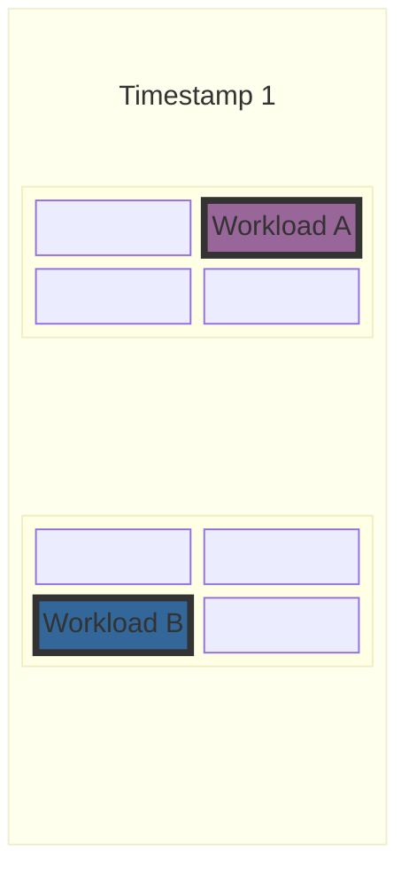
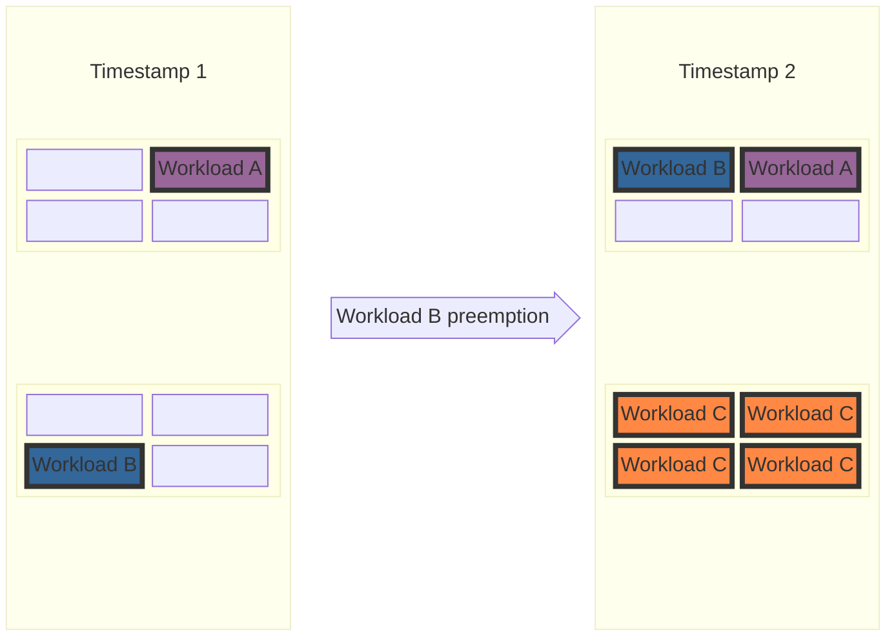

# KEP-13396: Configurable Preemptions

<!-- toc -->
- [Summary](#summary)
- [Motivation](#motivation)
  - [1. Defragmentation](#1-defragmentation)
  - [2. Hero workloads.](#2-hero-workloads)
  - [3. Desired behavior of preemptions is business driven.](#3-desired-behavior-of-preemptions-is-business-driven)
  - [Goals](#goals)
  - [Non-Goals](#non-goals)
- [Proposal](#proposal)
  - [User Stories (Optional)](#user-stories-optional)
    - [Story 1 (Optional)](#story-1-optional)
    - [Story 2 (Optional)](#story-2-optional)
  - [Notes](#notes)
  - [Constraints](#constraints)
  - [Caveats](#caveats)
  - [Risks and Mitigations](#risks-and-mitigations)
    - [Cascading preemptions due to misconfiguration](#cascading-preemptions-due-to-misconfiguration)
    - [Performance degradation](#performance-degradation)
- [Design Details](#design-details)
  - [Preemption evaluation flow in scheduler](#preemption-evaluation-flow-in-scheduler)
  - [Test Plan](#test-plan)
    - [Prerequisite testing updates](#prerequisite-testing-updates)
    - [Unit tests](#unit-tests)
    - [Integration tests](#integration-tests)
    - [e2e tests](#e2e-tests)
  - [Graduation Criteria](#graduation-criteria)
- [Implementation History](#implementation-history)
- [Drawbacks](#drawbacks)
- [Alternatives](#alternatives)
<!-- /toc -->

## Summary

<!--
This section is incredibly important for producing high-quality, user-focused
documentation such as release notes or a development roadmap. It should be
possible to collect this information before implementation begins, in order to
avoid requiring implementors to split their attention between writing release
notes and implementing the feature itself. KEP editors and SIG Docs
should help to ensure that the tone and content of the `Summary` section is
useful for a wide audience.

A good summary is probably at least a paragraph in length.

Both in this section and below, follow the guidelines of the [documentation
style guide]. In particular, wrap lines to a reasonable length, to make it
easier for reviewers to cite specific portions, and to minimize diff churn on
updates.

[documentation style guide]: https://github.com/kubernetes/community/blob/master/contributors/guide/style-guide.md
-->

## Motivation

### 1. Defragmentation

Kueue does not support inter cluster queue topology based preemptions when workloads are within their cluster queue's nominal quota. Because of this small workloads can sometimes block large topology domains.
In some clusters this may be desired - as disruptions of critical workloads should be avoided as much as possible.

In other setups, better cluster utilization or ability to schedule higher priority jobs that are blocked due to cluster fragmentation is more important. Thereby, additional defragmentation mechanism are needed to allow higher priorirty workloads to move smaller workloads between topology domains. The expected behavior in this case can be seen in the following example:

Let us consider cluster with 2 racks where each rack has 4 nodes.
For simplicity we will identify resources with nodes. And there is only one resource flavor with natural 2 level topology: rack, hostname.

And 3 cluster queues:
Queue A with quota 1.
Queue B with quota 1.
Queue C with quota 4.

Then quota of the entire cluster is 8, which is strictly larger than
sum of queues requirements.

Then at **Timestamp 1**  , 2 workloads are running:
Workload A from Queue A, and Workload B from Queue B, each consuming queues quota.



Then Workload C comes, which requires 4 nodes. The quota is available, but becasue of placement of Workload A and B in separate racks, each topology domain is blocked.


To allow Workload C to be scheduled, we need to preempt one of the workloads and move it to other rack. This functionality is currently not supported by Kueue as all of the scheduled workloads are within nominal quota.



### 2. Hero workloads

Related [issue](https://github.com/kubernetes-sigs/kueue/issues/8826).

Hero workloads often are high priority and require majority of the cluster quota.
Currently Kueue does not natively support their needs as it has no notion of elevated preemption privileges to overrule standard quota and topology limitations when needed. In particular Kueue does not allow for preemption of jobs that are within guaranted quotas.
Current workarounds like "temporary" overrides of
quotas assigned to all cluster queue are bad from the user expierience perspective as they require manual handling.
Moreover they lead to wasted resources if hero workload failed for
some reason, and quotas are not brought back to previous status.

### 3. Desired behavior of preemptions is business driven

Many companies have speicific requirements when workload should be preempted or not,
depending on their business needs.
For example [issue](https://github.com/kubernetes-sigs/kueue/issues/9596) asks for adding param for minimal execution time before preemption.
Some businesses have SLAs for freshness of the provided information. Therefore,
failure to run a workload in time (dictated by SLA) can lead to significant financial penalties. On the other hand those workloads might not be super high priority - they should not preempt other workloads, just the fact that they will run in next "X hours" is enough to satisfy SLA.
Other business might need workloads that are not preemptible at all.


### Other related issues:
* maxPriorityThreshold for withinClusterQueue preemptions [#12001](https://github.com/kubernetes-sigs/kueue/issues/12001)
* maxPriorityThreshold for reclaimWithinCohort [#12046](https://github.com/kubernetes-sigs/kueue/issues/12046)

<!--
This section is for explicitly listing the motivation, goals, and non-goals of
this KEP.  Describe why the change is important and the benefits to users. The
motivation section can optionally provide links to [experience reports] to
demonstrate the interest in a KEP within the wider Kubernetes community.

[experience reports]: https://github.com/golang/go/wiki/ExperienceReports
-->

### Goals
1. Preemptions triggered by lack of sufficient topology domains to run the workload.
2. Inter cluster queue premptions.
3. Configurability of preemptions to satisfy various business requirements.
4. Definition of most common fields that can be used to build preemption configurations.
5. Definition of "golden" configurations for common preemption scenarios.


### Non-Goals
1. Full defragmentation of the cluster.
2. One advanced preemption config to fullfil all premption needs.
3. Support for preemptions using arbitrary Workload fields - this KEP aims to
create a good baseline for configurations that can be extended in the future. it does not aim to be comprehensive for any possible scenario.
4. Complete replacement of current preemption strategies.


## Proposal

Introduce a new CRD **PreemptionConfig** that will be used to define:
- triggers when preemption should occur (e.g. insufficient topology to schedule the workload),
- rules defining which workloads should be considered for preemption,
- order in which workloads should be preempted (until considered workload cane be scheduled).

The **PreemptionConfig** object is cluster-wide resource that can be referenced by multiple ClusterQueues.

The new **PreemptionConfig** object will be referencable in the **ClusterQueueSpec** in the following way:

```go
  // preemption defines the preemption policies. Must be null if PreemptionConfigName is specified.
  // +kubebuilder:default={}
  // +optional
  Preemption *ClusterQueuePreemption `json:"preemption,omitempty"`

  // Reference to the PreemptionConfig to be used. If specified, Preemption
  // must be null. Settings in PreemptionConfig overwrite any preemption
  // defaults that may be in the system. Indicated config defines which workloads
  // will be considered for preemption if workload from this cluster queue cannot be
  // scheduled due to resource or topology constraints.
  PreemptionConfigName string

```


In paralel introduce **PreemptionLimit** cluster scope CRD. This CRD will allow cluster administrators to define overal number of preemptions for specific "scope" in a particular time window. This will give administrators fine-grained settings to control the number of preemptions that can occur in the cluster, thereby giving them more control over cluster stability.
Workloads will only be preempted if doing so respects all defined limits. The following scopes will be supported:

- Global - total number of preemptions that can occur in the cluster,
- PreemptingClusterQueue - total number of preemptions triggered by a specific workload from a particular ClusterQueue,
- PreemptedClusterQueue - total number of preemptions of workloads that belong to a specific ClusterQueue,
- Workload - total number of times particular workload can be preempted.

Details about the API can be seen in the [Design Details](#design-details) section.

Success criteria:

1. Cluster administrator is able to configure preemptions in the cluster in a way that satisfies their organization needs.
2. Workloads are preempted only if allowed by appropriate preemption config (or classical `preemption` field) and preemption limits.
3. Most popular setups are possible, tested and covered by documentation:
    - Defragmentation
    - Hero jobs

### User Stories

Each of the user stories mentioned in motivations can be fullfilled by appropriate config and/or preemption limits. Configs and limits for each of them  can be found below in appropriate subsections.

#### Story 1 - Defragmentation

User can define a config with InsufficientTopology trigger that will allow preemption of workloads blocking specific topologies when scheduling of workload from connected cluster queue requires it. To avoid "flappy" preemption issues, the rules should be limited in a way that guarantees asymmetry, if A can preempt B, B shouldn't be able to preempt A. This can be done in various ways, for example:
* Only allow preemption of workloads with strictly smaller priority.
* Only allow preemption of workloads that require smaller topologies (e.g. using custom numeric label).
* Only allow preemption of workloads that should be preemptible according to FairSharing rules.

Example config based on priority and slice size can look like this:
```
spec:
  rules:
    - trigger: "InsufficientTopology"
      MinTriggerRequiredDuration: "30s"
      candidates:
        - relativeWorkloadPriority: "LowerOrEqual"
          relationRequirement: "AnyClusterQueue"
          numericLabels:
            - key: "tpus-count"
              relation: "LessOrEqual"
              default: 0
  ordering:
    - orderingField: "Priority"
```

As it has "AnyClusterQueue" relation it can preempt workloads even if they are not related in any way to the preemptor cluster queue. In combination with custom numeric label selector this should result in eviction of smaller less important workloads blocking larger topologies, even if they are within the guaranted quota. Effectively if they are re-admitted again they should be placed in smaller domains(where the considered workload cannot be scheduled), thereby defragmenting the cluster.

#### Story 2 - Hero job

This example shows how hero job's preemption configuraiton can be set up. It proposes a examplary separate preemption configuration for the hero job's cluster queue, but in practical deployments it should be tailored to the user needs.

Assumptions:
 - hero job we would like to have elevated privilages to preempt other workloads,
 - hero job is a mission critical job and should be scheduled as soon as possible,
 - hero job should not be preemptable by any other workload.

 This can be achieved by a separate preemption config for the hero job. The config should be referenced by the hero job's cluster queue. The config will have 2 rules, allowing it to preempt any workload either because of quota or topology reasons:

```
spec:
  rules:
    - trigger: "InsufficientTopology"
      candidates:
        - relativeWorkloadPriority: "Lower"
          relationRequirement: "AnyClusterQueue"
    - trigger: "InsufficientQuota"
      candidates:
        - relativeWorkloadPriority: "Lower"
          relationRequirement: "AnyClusterQueue"
  ordering:
    - orderingField: "Priority"
```

And then to make sure that the hero job is never preempted one may:
1. Make hero job's priority higher than any other workload's priority and do not allow for preemption of workloads with higher or equal priority.
2. Have preemption limits with 0 allowed preemptions from hero job's CQ. (Doable after milestone 5)
3. Define in cadidate selectors subfield `ClusterQueueSelector` of other configurations that they cannot preempt from the hero job's CQ.

Thanks to the elevated preemption privilages the hero job will be able to preempt any workloads and borrow the quota from other CQs in the cohort tree (this job will still be affected by lending limits - so they have to be set appropriately to allow for the quota gathering). It will also effectively lock this quota, as no other workload will be able to preempt it.

### Story 3 - Business driven preemption rules

Requested functionalities from the community can be satisfied with the following rules:
 1.[Issue #9596](https://github.com/kubernetes-sigs/kueue/issues/9596)  can be satisfied by using `MinExecutionDuration` in the defined configuration rules.
 2 [Issue #12001](https://github.com/kubernetes-sigs/kueue/issues/12001) can be satisfied by using `CandidateWorkloadPrioritySelector` and "SameClusterQueue" `PreemptionRelationConstraint` in appropriate rules.
 3. [Issue #12046](https://github.com/kubernetes-sigs/kueue/issues/12046) can be also satisfied by using `CandidateWorkloadPrioritySelector` in rules with combination of "SameCohort" `PreemptionRelationConstraint` and  "BorrowingCapacityFromPreemptor" `QuotaConstraint.
 4. Netbuibed SLA can be modeled with `MaxTimeFromCreationDuration` - to avoid preempting workloads that are older than X and are from a specific cluster queue or that have specific label.

### Notes

There are many possible extensions of the proposed selectors in the rules. For now we propose to support only those that for us seemed most common and natural, but the design allows for extensibility. Examples of possible extensions are:
- advanced topology comparison selectors extending custom numeric label based selector - e.g. "require same podset required levels for considered workloads",
- resource requests/limits based selectors - "only preempt workloads that request less than X amount of resources",
- detection of misconfigurations causing preemption cycles.

As the scope of the design is already broad we leave them as separate implemetation effort and not part of initial KEP proposal.


### Constraints


### Caveats

Given extensive nature of **PreemptionConfigs** defined below, the API introduces several complexities where users might inadvertently misconfigure their setup. To maximize user success, the following mitigations will be implemented:

* Deliver concrete examples demonstrating successful configurations.
* Offer detailed scenarios illustrating invalid configurations or potential flapping issues.
* Communicate explicitly that custom rule creation carries inherent risks and is intended for power users - the OSS Kueue community might not be able to support troubleshooting every custom scenario.


### Risks and Mitigations

#### Cascading preemptions due to misconfiguration
One inherent risk is users deploying ill-defined preemption configs that could lead to cluster instability (e.g. cascading preemptions). The design includes the following mitigations:
1. **Global limits** - cluster administrators have additonal safety measure that can be used to rollout new configs or rules gradually, by limiting number of preemptions they permitted by particular config or rule.
2. **Restrictive default preemption configuration** - By default empty config does not lead to any preemptions as candidate selection rules will be empty.
3. **Documentation** - Comprehensive documentation will be provided to help users understand the risks and benefits of each configuration option, including examples of common preemption scenarios and how to configure them.

#### Performance degradation
Other risk is preemption performance degradation due to generic nature of new rules and potentially large number of selectors. This risk will be mitigated by implementation of performance focused test suite for preemptions.

The test suite will be used to benchmark new implementation vs existing one to ensure that there is no significant performance degradation for already defined "high level" policies.
The test suite will be also used to indetify performance optimization opportunities for the newly introduced code.

The documation will also clearly indicate that creation of large number of complex preemption rules may have performance implications for the overall scheduling and that it is recommended to benchmark your configs before rolling out to production.

#### Security considerations


## Design Details

### Proposed API PreemptionConfig

```go
type PreemptionConfig struct {
  metav1.TypeMeta `json:",inline"`
  metav1.ObjectMeta `json:"metadata,omitempty"`
  Spec PreemptionConfigSpec `json:"spec,omitempty"`
}

type PreemptionConfigSpec {
  // Rules to select preemption candidates.
  Rules []PreemptionRule
  // Ordering of the preemption candidates.
  // The order will be always deterministic, as UID
  // of the workloads is used to break the ties
  // If not set workloads will be ordered by Priority -> AdmissionTimestamp->  UID.
  Ordering []Order
}

type PreemptionRuleTrigger string

const (
  // InsufficientQuota means that there was an attempt to admit the workload,
  // but there was not enough unused quota in the ClusterQueue or its Cohort to accommodate the Workload.
  InsufficientQuota PreemptionRuleTrigger = "InsufficientQuota"

  // QuotaReclaimRequired means that there was an attempt to admit the workload
  // and workload should be admittable according to nominal quota of the ClusterQueue,
  // but it cannot as quota was borrowed. Thereby, quota will have to be reclaimed before this workload is scheduled.
  QuotaReclaimRequired PreemptionRuleTrigger = "QuotaReclaimRequired"

  // InsufficientTopology means that there was an attempt to admit the workload,
  // quota was available, but no topology domain satisfied its requirements.
  // Unlike quota-related conditions, this condition is only reset on admission, as it is checked only after quota is available for the workload. 
  InsufficientTopology PreemptionRuleTrigger = "InsufficientTopology"
)

type PreemptionRule struct {
  Name string

  // Label Selector indicating which workloads can trigger preemptions
  // using this rule.
  MatchingPreemptorWorkloads metav1.LabelSelector

  Trigger PreemptionRuleTrigger

  // How long the trigger has to occur to start preempting workloads specified by candidates. 0s indicates that preemptions can be started immediately. Default is 0s.
  MinTriggerRequiredDuration metav1.Duration

  // Selection rules for workloads that are candidates for preemption.
  // Candidates resulting from multiple selectors are summed into one set. No selectors result in empty candidate set, thereby disalowing any preemptions with this rule.
  Candidates  []PreemptionCandidateSelector
}
```

The first observation timestamp that sepecific trigger occurred is put into workload conditions.  The conditions are cleared upon succesful addmition of the workload or if they are no longer true in case of quota related conditions.

This will result in the following new condition types:
`InsufficientQuota`, `InsufficientTopology`, `QuotaReclaimRequired`.

For quota related conditions the `reason` field will be set to `QuotaFreed` if the condition was reset due to the fact:
- in case of InsufficientQuota: enough quota become available to schedule the workload.
- in case of QuotaReclaimRequired: quota became available for the workload or borrowed and free quota is no longer enough to schedule the workload.


```go

// PreemptionRelationConstraint specifies the relational boundary between
// the preempting workload's queue and candidate workloads' queues.
// Possible values are:
// - "SameLocalQueue": restricts preemption candidates to workloads submitted to the exact same LocalQueue (matching name and namespace).
// - "SameClusterQueue": restricts preemption candidates to workloads submitted to the same ClusterQueue as the preemptor.
// - "SameCohort": restricts preemption candidates to workloads in ClusterQueues that share the exact same immediate direct Cohort, as well as workloads in the preemptor's own ClusterQueue (even if standalone).
// - "SameCohortTree": restricts preemption candidates to workloads in ClusterQueues that belong to the same Cohort Tree (sharing the same root ancestor Cohort), as well as workloads in the preemptor's own ClusterQueue (even if standalone).
// - "AnyClusterQueue": places no relationship restrictions on preemption candidates.
//
// +kubebuilder:validation:Enum=SameLocalQueue;SameClusterQueue;SameCohort;SameCohortTree;AnyClusterQueue
type PreemptionRelationConstraint string

const (
  // SameLocalQueue restricts preemption candidates to workloads submitted
  // to the exact same LocalQueue (matching name and namespace).
  SameLocalQueue PreemptionRelationConstraint = "SameLocalQueue"

  // SameClusterQueue restricts preemption candidates to workloads submitted
  // to the same ClusterQueue as the preemptor.
  SameClusterQueue PreemptionRelationConstraint = "SameClusterQueue"

  // SameCohort restricts preemption candidates to workloads in ClusterQueues
  // that share the exact same immediate direct Cohort, as well as workloads in the
  // preemptor's own ClusterQueue (even if standalone and lacking a parent cohort).
  SameCohort PreemptionRelationConstraint = "SameCohort"

  // SameCohortTree restricts preemption candidates to workloads in ClusterQueues
  // that belong to the same Cohort Tree (sharing the same root ancestor Cohort),
  // as well as workloads in the preemptor's own ClusterQueue (even if standalone and lacking a parent cohort).
  SameCohortTree PreemptionRelationConstraint = "SameCohortTree"

  // AnyClusterQueue places no relationship restrictions on preemption candidates.
  AnyClusterQueue PreemptionRelationConstraint = "AnyClusterQueue"
)


type QuotaConstraint string

const (
  BorrowingCapacityFromPreemptor QuotaConstraint = "BorrowingCapacityFromPreemptor"
  DRSLessThanOrEqualToFinalShare QuotaConstraint = "DRSLessThanOrEqualToFinalShare"
  DRSLessThanInitialShare QuotaConstraint = "DRSLessThanInitialShare"
  DRSAllStrategies QuotaConstraint = "DRSAllStrategies"
)


// PreemptionCandidateSelector defines the selection criteria for workloads that are candidates for preemption.
type PreemptionCandidateSelector struct{

  // RelationRequirement specifies the queue or cohort relation boundary to the preemptor workload.
  // Required. 
  RelationRequirement PreemptionRelationConstraint

  // Accepts all if not set. 
  // Cannot be set if RelationRequirement is SameLocalQueue or SamleClustrQueue.
  Quota QuotaConstraint

  // Accepts all if not set
  // NumericLabels defines rules for filtering candidates using custom numeric labels on the Workload resource.
  // Multiple numeric labels are joined using AND-rule (all have to be satisfied).
  NumericLabels []NumericLabelConstraint

  // Accepts all if not set.
  ClusterQueueSelector metav1.LabelSelector

  // Accepts all if not set
  WorkloadSelector metav1.LabelSelector

  // Accepts all if not set
  HostNodeSelector metav1.LabelSelector

  // Matches all workload priority classes if not set.
  PreemptingWorkloadPrioritySelector metav1.LabelSelector

  // Matches all workload priority classes if not set.
  CandidateWorkloadPrioritySelector metav1.LabelSelector

  // RelativeWorkloadPriority defines how the preemptor's priority compares to the candidate's priority.
  // For example "Lower" means that only workloads with lower
  // priority will be allowed as preemption candidates.
  // The comparison is made using effective priority (accounting for priority boost if enabled).
  // If nil, no relative priority check is enforced.
  RelativeWorkloadPrioirty *RelativeConstraint

  // Accepts any execution times if not set
  MinExecutionDuration *metav1.Duration
  MaxExecutionDuration *metav1.Duration
  ExecutionTimeRelation *RelativeConstraint

  // Accepts any time from creation if not set
  MinTimeFromCreationDuration *metav1.Duration
  MaxTimeFromCreationDuration *metav1.Duration
  TimeFromCreationRelation *RelativeConstraint
}


// NumericLabelConstraint describes the rule for filtering a custom numerical label.
// For example, this can be used to filter candidates based on the label somehow describing
// required topology domain size, such as the "number of TPUs". 
// If user has a label "number-of-tpus" that desribes number of tpus required in a single cube
// it can be used to create a rule that selects only workloads requiring smaller cube slices 
// by defining the relation="Lower". Such configuration would allow to preempt "smaller" workloads,
// to achieve better cluster utilization and decrease fragmentation.
// Please note that those labels are not out of the box copied from job-like objects.
// You should remember to append the designated labels to the list of labels
// copied to the workload via the Kueue main configuration
// if you wish to use a custom label.
type NumericLabelConstraint struct {
  // Key is the label key that stores the integer value in the workload that will
  // be used for candidate selection.
  Key string `json:"key"`

  // DefaultValue is used when a workload does not have the label key
  // or value under the key cannot be parsed as an integer.
  // If not specified workloads without the label or 
  // with label value not parsable as int are treated as incomparable, 
  // and therefore excluded from preemption candidates.
  // +optional
  DefaultValue *int32 `json:"defaultValue,omitempty"`

  // Relation defines how the preemptor compares to the candidate.
  // +optional
  Relation *RelativeConstraint `json:"relation,omitempty"`

  // MinValue specifies the lowest label value a candidate workload can have to be considered for preemption.
  // +optional
  MinValue *int32 `json:"minValue,omitempty"`

  // MaxValue specifies the highest label value a candidate workload can have to be considered for preemption.
  // +optional
  MaxValue *int32 `json:"maxValue,omitempty"`
}

// RelativeConstraint defines how a specified numeric property (e.g., effective priority) of the candidate compares to the same property of the preemptor.
// Possible values are:
// - "Lower": permits preemption if candidate field value < preemptor field value
// - "Greater": permits preemption if candidate field value > preemptor field value
// - "LowerOrEqual": permits preemption if candidate field value <= preemptor field value
// - "GreaterOrEqual": permits preemption if candidate field value >= preemptor field value
type RelativeConstraint string

const (
  // Lower permits preemption if candidate field value < preemptor field value
  Lower RelativeConstraint = "Lower"
  // Greater permits preemption if candidate field value > preemptor field value
  Greater RelativeConstraint = "Greater"
  // LowerOrEqual permits preemption if candidate field value <= preemptor field value
  LowerOrEqual RelativeConstraint = "LowerOrEqual"
  // GreaterOrEqual permits preemption if candidate field value >= preemptor field value
  GreaterOrEqual RelativeConstraint = "GreaterOrEqual"
)

type OrderingField string
const (
  Priority OrderingField = "Priority"
  AdmissionTimestamp OrderingField = "AdmissionTimestamp"
  ClusterQueueDRS OrderingField = "ClusterQueueDRS"
  IsOtherCQ OrderingField = "IsOtherCQ"
  IsOtherCohort OrderingField = "IsOtherCohort"

  // IsDRSLessThanInitialShare is a boolean value that indicates if preemption of the workload would be considered fair according to DRSLessThanInitialShare fair sharing strategy.
  IsDRSLessThanInitialShare OrderingField = "IsDRSLessThanInitialShare"

  // IsDRSLessThanOrEqualToFinalShare is a boolean value that indicates if preemption of the workload would be considered fair according to DRSLessThanOrEqualToFinalShare fair sharing strategy.
  IsDRSLessThanOrEqualToFinalShare OrderingField = "IsDRSLessThanOrEqualToFinalShare"
)


type OrderingDirection string
const (
  Ascending OrderingDirection = "Ascending"
  Descending OrderingDirection = "Descending"
)

type Order struct {
  OrderingField OrderingField
  Direction OrderingDirection = Ascending
}

```


As defined by [current ordering](https://github.com/kubernetes-sigs/kueue/blob/24f6f99135979076a8d56ca7fc407990b98c66af/pkg/scheduler/preemption/common/ordering.go#L34-L41)
The order is right now based on:

0. Workloads already marked for preemption first.
1. Workloads from other ClusterQueues in the cohort before the ones in the same ClusterQueue as the preemptor.
2. (AdmissionFairSharing only) Workloads with lower LocalQueue's usage first
3. Workloads with lower priority first.
4. Workloads admitted more recently first.

Thereby, the new ordering fields should cover it well. 


   
### Proposed API for PreemptionLimit

```go
type PreemptionLimit struct {
  metav1.TypeMeta 
  metav1.ObjectMeta 
  Spec PreemptionLimitSpec
Status PreemptionLimitStatus
}

type PreemptionLimitScope string
const (
  GlobalPreemptionLimitScope PreemptionLimitScope = "Global"
  PreemptingCQLimitScope PreemptionLimitScope = "PreemptingClusterQueue"
  PreemptedCQLimitScope PreemptionLimitScope = "PreemptedClusterQueue"
  PerPreemptedWorkloadLimitScope PreemptionLimitScope = "Workload"
)

type PreemptionLimitSpec struct {
  // Required
  Scope PreemptionLimitScope

  // If empty, it applies to all PreemptionConfigs
  ConfigSelector metav1.LabelSelector
  
  // If empty, it applies to all CQ that may want to preempt.
  ClusterQueueSelector metav1.LabelSelector

  // If Empty, it applies to all rules.
  RuleNames []string

  // How many preemption events can there be in the givent time window.
  Limit  int
  LimitWindowDuration metav1.Duration
}

type PreemptionLimitStatus struct {
Conditions []metav1.Condition


  // Periodically updated, for reference only.
  // Map key depends on the scope. For Global it is just Global.
  // For CQ it is Cluster Queue name
  // For Workload it is namespace +/"+ workload name
  // If all of the counts cannot be writted to the resource due to CRD size limit,
  // then only top K counts are stored to fit in the limit.
  Count map[string]int
}
```

PreemptionLimit limits the number of preemptions that happen for the specified set of rules. The PreemptionCode evaluates proposed preemptions against defined limit objects, allowing them to proceed only if adequate preemption quota remains. If preemption is in scope of multiple limits, quota must exist in all of them.
To track this, a list of preemption rule names responsible for selecting each candidate must be maintained.

To manage this data, Kueue stores a comprehensive preemption map in memory, which is isolated per PreemptionLimit. This map tracks all preemption event timestamps under a specific cq/workload key, capturing events that occurred within the designated LimitWindowDuration. Moreover, it tracks only events that are in scope of the specific limit, if preemption does not match the defined config or rules selector it will be not tracked in particular instance of the preemption map.
This list is dynamically trimmed upon each retrieval to filter out expired timestamps.

Furthermore, the status of the PreemptionLimit is refreshed periodically—approximately every minute—to write the aggregated totals into the count map.


### Preemption evaluation flow in scheduler

The preemption evaluation flow integrates trigger condition tracking, upper-bound feasibility checks, ordered candidate evaluation (until quota and topology conditions are  satisfied), and reverse-order victim backfilling across scheduling cycles:

```mermaid
flowchart TD
    subgraph Cycle1 ["1. Initial Cycle: Nomination & Trigger Condition Tracking"]
        A["Queue Heads Retrieved<br/>(queues.Heads)"] --> B["Nominate Workloads<br/>(nominate)"]
        B --> C["Order Entries into Iterator"]
        C --> D["Process Entry<br/>(processEntry)"]
        D --> E{"Workload Fits Directly?"}
        E -->|Yes| F["Admit Workload<br/>(admit)"]
        E -->|No| G["Assign / Update Trigger Conditions<br/>with Observation Timestamp in Workload Status<br/>(InsufficientQuota / QuotaReclaimRequired / InsufficientTopology)"]
        G --> H["Requeue Workload<br/>(Wait for trigger duration / quota)"]
    end

    subgraph CycleN ["2. Subsequent Cycles: Preemption Evaluation in getInitialAssignments"]
        H -.->|Next Scheduling Cycle| I["Consider Workload in Subsequent Cycle<br/>(nominate -> getInitialAssignments)"]
        I --> J["Evaluate Trigger Durations & Limits<br/>(PreemptionEvaluator)"]
        J --> K{"Is Any Trigger Duration Satisfied?<br/>(now - observed >= minDuration)"}
        K -->|No| L["Preemption Not Eligible Yet<br/>(Keep waiting / update condition)"]
        K -->|Yes| M["Upper-Bound Feasibility Check<br/>(CandidatesQuotaAndTopologyUpperLimit)"]
        M --> N{"Preemptor Fits if ALL<br/>Candidates Preempted?"}
        N -->|No| O["Preemption Infeasible<br/>(Preemptor cannot fit even with all candidates)"]
        N -->|Yes| P["Order Candidates<br/>(Sort per PreemptionConfig.Spec.Ordering)"]
        
        P --> Q["Candidate Selection Loop"]
        Q --> R["Take Next Candidate in Order"]
        R --> S["Add Candidate to Preemption Targets<br/>& Update Simulated Resources"]
        S --> T{"Preemptor Quota &<br/>Topology Needs Satisfied?"}
        T -->|No| U{"More Candidates?"}
        U -->|Yes| R
        U -->|No| V["Preemption Incomplete<br/>(Cannot satisfy requirements)"]
        
        T -->|Yes| W["Victim Backfilling<br/>(Test selected targets in REVERSED order)"]
        W --> X["For each victim in reverse order:<br/>Can preemptor fit WITHOUT preempting this victim?"]
        X --> Y{"Preemptor Still Fits?"}
        Y -->|Yes| Z["Remove victim from preemption targets<br/>(Backfill / preserve workload)"]
        Y -->|No| AA["Retain victim in preemption targets"]
        Z --> AB{"More victims to test?"}
        AA --> AB
        AB -->|Yes| X
        AB -->|No| AC["Final Preemption Targets Determined"]
    end

    subgraph Execution ["3. Execution & Admission in processEntry"]
        AC --> AD["Process Entry<br/>(processEntry in Preempt mode)"]
        AD --> AE{"Targets Overlapping or<br/>Workload No Longer Fits?"}
        AE -->|Yes| AF["Mark Skipped / Requeue"]
        AE -->|No| AG["Issue Preemptions<br/>(issuePreemptions)"]
        AG --> AH["Admit Preemptor Workload<br/>(admit)"]
    end

    style Cycle1 fill:#f8f9fa,stroke:#6c757d,stroke-width:2px
    style CycleN fill:#eef6fc,stroke:#0d6efd,stroke-width:2px
    style Execution fill:#e8f5e9,stroke:#198754,stroke-width:2px
    style E fill:#fff3cd,stroke:#ffc107
    style K fill:#fff3cd,stroke:#ffc107
    style N fill:#fff3cd,stroke:#ffc107
    style T fill:#fff3cd,stroke:#ffc107
    style U fill:#fff3cd,stroke:#ffc107
    style Y fill:#fff3cd,stroke:#ffc107
    style AB fill:#fff3cd,stroke:#ffc107
    style AE fill:#fff3cd,stroke:#ffc107
    style AH fill:#d1e7dd,stroke:#0f5132,stroke-width:2px
    style F fill:#d1e7dd,stroke:#0f5132,stroke-width:2px
```



#### Step-by-Step Breakdown

1. **Nomination & Condition Tracking (Cycle 1)**:
   - In `nominate()`, initial resource flavor requirements are calculated for all active queue heads.
   - In `processEntry()`, each entry is processed:
     - If the workload fits directly, it proceeds to admission (`admit()`).
     - If the workload cannot fit directly (e.g. requires preemption or lacks resources/topology), `processEntry()` assigns or updates the trigger condition (`InsufficientQuota`, `QuotaReclaimRequired`, or `InsufficientTopology`) along with an initial observation timestamp in `Workload.Status.Conditions` and requeues the workload.

2. **Trigger Duration & Preemption Evaluation (`PreemptionEvaluator`)**:
   - In subsequent scheduling cycles, `getInitialAssignments()` queries `PreemptionEvaluator` to check whether the elapsed time since the first observation timestamp satisfies `MinTriggerRequiredDuration` for any applicable preemption rule and evaluates preemption limits.
   - If no trigger duration is satisfied, preemption is bypassed for this cycle, allowing the workload to continue waiting.

3. **Upper-Bound Feasibility Check (`CandidatesQuotaAndTopologyUpperLimit`)**:
   - If a trigger duration is met, the scheduler performs an upper-bound check using `CandidatesQuotaAndTopologyUpperLimit` by simulating the removal of all matching candidate workloads.
   - If the preemptor cannot fit even when all candidates are preempted, the evaluation terminates early.

4. **Ordered Candidate Iteration (Quota & Topology Satisfaction)**:
   - Candidates are sorted based on `PreemptionConfig.Spec.Ordering`.
   - The scheduler iterates through candidate workloads in order, adding victims until the preemptor's resource quota and topology domain requirements are fully satisfied.

5. **Reverse-Order Victim Backfilling**:
   - Once a viable candidate set $[V_1, V_2, \dots, V_k]$ is assembled, the scheduler attempts backfilling by checking victims in reverse order ($V_k, V_{k-1}, \dots, V_1$).
   - For each victim, the scheduler evaluates whether the preemptor can still fit without evicting that victim. If the preemptor still fits, the victim is removed from the preemption target list, minimizing unnecessary workload disruptions.

6. **Execution & Admission**:
   - In `processEntry()`, after checking for target overlap with earlier cycle decisions, `issuePreemptions()` evicts the final victim set and admits the preemptor workload.


The preemption limits will be evaluated inside `PreemptionEvaluator` to limit the set of candidates returned during the iteration. Evaluator will assume that every object will returned from the iteration will be preempted updating local copy of the relevant preemption limits and dynamically changing snapshot resources like DRS and borrowing information.


`CandidatesQuotaAndTopologyUpperLimit` by design is just an approximation to allow for short circuit when preemptor obviously will not be admitted anyway. It will just use the initial state of the `PreemptionEvalutor` and doesn't attent to simulate changes in DRS, borrowing or preemption limits during iteration over candidates. However the returned values shoudl always be greater or equal to what can be preempted at this moment, so it is reasonable to avoid preemption at all if the result is smaller than requested amount.

### Efficient iteration through candidates in configured order

#### Problem Statement
Certain preemption candidate rules—such as those based on `BorrowingCapacityFromPreemptor` or Dominant Resource Share (DRS) fair-sharing strategies—depend on dynamic cluster state that changes as candidate workloads are simulated for preemption during evaluation.

For example, consider ClusterQueues $A$ and $B$, each with a nominal quota of 5. Suppose CQ $B$ is currently borrowing 1 unit of quota from CQ $A$. If a workload in CQ $A$ triggers preemption under a rule targeting only borrowing workloads, and each candidate workload in CQ $B$ consumes 1 unit of quota, the evaluator should only preempt a single workload from CQ $B$. Once that first workload is selected, CQ $B$ is no longer borrowing quota from CQ $A$, so remaining workloads in CQ $B$ must immediately become ineligible for that borrowing rule.

#### Naive Solutions and Complexity Bottlenecks
- **Linear Filtering per Selection ($O(n \cdot m)$ to $O(n^2)$ ):** Dynamically filtering the candidate set and scanning for the minimum for each of the $m$ preemption targets requires $O(n)$ work per step, yielding $O(n \cdot m)$ time (up to $O(n^2)$ in the worst case where $m \approx n$).
- **Dynamic Re-sorting ($O(m \cdot n \log n)$ to $O(n^2 \log n)$ ):** Naively re-sorting the candidate array whenever CQ borrowing or DRS metrics change introduces an $O(n \log n)$ sorting step per eviction, leading to $O(n^2 \log n)$ time and severe scheduler throughput degradation.

#### Proposed Approach: Per-Selector, Per-CQ Priority Queues
To achieve optimal scheduling performance without repetitive full-array scans or re-sorting, the evaluator maintains **separate priority queues partitioned by `(CandidateSelector, ClusterQueue)`**:

1. **Static Intra-Queue Ordering (Sort Once):**
   Within any given ClusterQueue, relative candidate ordering (e.g., by Priority, `AdmissionTimestamp`, Workload UID) is static and unaffected by dynamic quota borrowing or DRS changes. Therefore, candidate workloads within each `(Selector, CQ)` queue need to be sorted only once at the start of evaluation.

2. **CQ-Level State Tracking & Fast Pruning ($O(1)$ Drop):**
   Dynamic state—such as current borrowed quota and ClusterQueue DRS—is tracked via lightweight counters attached to each CQ queue. When a CQ property no longer satisfies the selector's criteria (e.g., borrowed quota reaches zero for borrowing selectors), the entire priority queue for that CQ under that selector is pruned from consideration in $O(1)$.

3. **Handling Workload-Specific Constraints (`DRSLessThanOrEqualToFinalShare`):**
   For selectors requiring workload-level evaluation (such as `DRSLessThanOrEqualToFinalShare`), the entire queue cannot simply be dropped at the CQ level because eligibility depends on the individual workload's DRS value. For these selectors, candidates are evaluated at extraction time when inspected at the queue head. If a candidate violates the fair-sharing constraint under current simulated state, it is popped and discarded for that selector.

4. **Multi-Queue Head Selection:**
   At each preemption step, the evaluator inspects the heads of all active priority queues and selects the globally minimal candidate according to the configured `PreemptionConfig.Spec.Ordering`.

5. **Deduplication & Multi-Queue Popping:**
   A single workload can match multiple candidate selectors (across one or more preemption rules) and thus reside in multiple priority queues. Because the ordering comparator is consistent across queues, the selected minimal workload will always be at the head of all its corresponding queues. When chosen, it is popped from all matching queue heads simultaneously. Workloads are stored as shared pointers/references across queues to eliminate data duplication.

6. **Visibility and Preemption Justification:**
   The set of priority queues from which a workload was popped directly identifies all matching candidate selectors and rules, providing immediate justification and audit metadata for the preemption decision (see [Observability](#observability)).

7. **Simulated State Updates:**
   After popping a candidate, the evaluator updates simulated state (reclaimed quota, updated DRS counters) and drops any newly ineligible CQ priority queues before the next selection step.

#### Implementation Caveats and Selector Isolation
Maintaining separate priority queues per candidate selector is essential. If queues were pooled across selectors (either within a rule or across rules), dropping an ineligible CQ queue due to exhausted borrowing or DRS thresholds would inadvertently discard candidates that matched other non-borrowing, static selectors (such as priority-only preemption within the same CQ). Distinct per-selector queues permit aggressive filtering using static constraints up front while isolating dynamic state invalidation.

#### Open Challenges

**Challange 1** - how to handle the situation that workloads are preemted from the preemptor CQ, which makes "previously" removed workloads again viable - [issue #14122](https://github.com/kubernetes-sigs/kueue/issues/14122). 

**Vague implementation idea** - keep track of those workloads that are dropped becasue of DRS in appropriate order and reevaluate them (when whole CQ is dropped becasue of DRS, save all of the workloads from it).

**Challange 2** - how to make sure that preemptions are fair even if we backfil some workloads. The algorithm described above is fair if no backfilling is happening, but if we preempt and then backfill it can lead to issues like desribed in [issue #14543](https://github.com/kubernetes-sigs/kueue/issues/14543). 

**Vagueue implementation idea** - when backfilling hold the cohort tree with DRS values of minimal workloads that were preempted, if backfill will no change the DRS in a way that makes "fairness" rule no longer true for the minimal workloads, then don't reintroduce them.

### Observability

As new preemptions may be far more complex than existing classicial model it may be non trivial to judge why some workload was preempted just by looking at the ClusterQueue resource. Therefore we need to add more visibility into the preemption reasons. To satisy this needs details about the evction will be written in the `WorkloadSchedulingStatsEviction` structure in the Workload status.
Reason will be set to a `ConfigurablePreemption` to indicate that the new mechanism was used for preemption. The `UnderlyingCause` will be filled with the following information up to the max characters:
- preemtor workload reference,
- preemption config name, rules and selectors index which resulted in chosing this workload as a candidate.

Example message:
`Preempted by <preemptor> because of preemption config <preemptionConfig> rule <ruleName>/<selectorIndex>`


In case of multiple selectors which are triggered within one rule they will be concatenated with ",".

Example message:
`Preempted by <preemptor> because of preemption config <preemptionConfig> rule <ruleName_1>/<selectorIndex_1>,<selectorIndex_2>,...,<selectorIndex_n>; <ruleName_2>/<selectorIndex_1>,<selectorIndex_2>,...,<selectorIndex_n>; ...`

New preemptions will overwrite previous underlying cause but increase the eviction count for this reason.

### Test Plan

<!--
**Note:** *Not required until targeted at a release.*
The goal is to ensure that we don't accept enhancements with inadequate testing.

All code is expected to have adequate tests (eventually with coverage
expectations). Please adhere to the [Kubernetes testing guidelines][testing-guidelines]
when drafting this test plan.

[testing-guidelines]: https://git.k8s.io/community/contributors/devel/sig-testing/testing.md
-->

[x] I/we understand the owners of the involved components may require updates to
existing tests to make this code solid enough prior to committing the changes necessary
to implement this enhancement.

For now the test plan is focues on Preemption Configuration. Preemption Limits related tests will be added later.

#### Unit tests
1. Trigger conditions - new conditions are added to the workload when it cannnot be admitted because of particular reason and cleared on admission.
2. Preemptions Evaluator:
    * Uses only rules that are applicable according to trigger and minimal trigger duration.
    * Orders candidates according to selected ordering
    * Collects candidates from multiple rules and deduplicates.
    * Updates DRS and borrowing information dynamically - filtering out candidates that
    should be no longer selected according to DRS/Borrowing selectors
    * Tests for each candidate selector
3. New preemptions are only considered when Feature Gate is enabled.

Majorty of the code will by in the `scheduler/preemption` package, a new subpackage with configurable preemptions will be created there.

Small parts of the implementation like conditions or integration with the scheduler itself will be done in other packages and accompanied with appropriate unit tests.

#### Integration tests
1. New configurable preemptions are used when ConfigurablePreemptions feature gate is enabled and preemption configuration specified for a cluster queue. (old preemptions are covered by existing tests)
2. Preemade configuration tests satisfying the main user stories - defrag and hero jobs.
3. Dedicated preemption performance test suite - to compare performance of new implementation with existing implementation for identical configurations.

#### e2e tests

1. Cluster admin can create preemption config and use it to preempt workloads.
2. Batch users cannot modify the preemption config, but their workloads follow rules defined in configs attached to CQ.
3. Different CQs can use different preemption configurations.
4. Preexisting classical/fair sharing preemptions can be mixed with new preemption configs.


### Graduation Criteria

#### Alpha

* PreemptionConfiguration and PreemptionRule CRDs are implemented.
* Workloads can be preempted according to rules defined in preemption configuration.
* Workloads that are preempted have the rule that triggered the preemption added in the eviction condition.
* Lazy defragmentation use case is covered by available configuration rules.

#### Beta
* Configurable preemptions covers:
  * existing classical and fair sharing preemptions use cases
  * defragmentation
  * hero jobs.
* No significant performance regression for existing preemptions translated to new configurations.
* All of the **Open Challanges** are addressed.
* Public documentation explains configurable preemptions, documents the rules and triggers. Examples of the recommended configurations are available for the users. Common pitfalls are documented and documentation has suitable warning that this is an advanced topic and can lead to continous preemptions if used inappropriately.


#### Stable
TBD
<!--

Clearly define what it means for the feature to be implemented and
considered stable.

If the feature you are introducing has high complexity, consider adding graduation
milestones with these graduation criteria:
- [Maturity levels (`alpha`, `beta`, `stable`)][maturity-levels]
- [Feature gate][feature gate] lifecycle
- [Deprecation policy][deprecation-policy]

[feature gate]: https://git.k8s.io/community/contributors/devel/sig-architecture/feature-gates.md
[maturity-levels]: https://git.k8s.io/community/contributors/devel/sig-architecture/api_changes.md#alpha-beta-and-stable-versions
[deprecation-policy]: https://kubernetes.io/docs/reference/using-api/deprecation-policy/
-->

## Implementation History

Proposed implementation approach:

**Step 1.** `PreemptionConfig` foundations and Defrag use case: 

 Implementation of the foundations of PreemptionConfig:
 - initial version of ordering
 - triggers
 - iteration through candidates

Implementation of the following selector to have MVP of defrag:
- NumericLabelConstraint
- PriorityConstraint
- PreemptionRelationConstraint

Expose the implementation under feature gate "ConfigurablePreemptions", integration should not check in any way the existing preemption logic.

**Step 2.** Implement fair sharing and borrowing based rules and ordering.

Create performance test suite for preemptions to validate current implementation.


**Step 3.** Reimplement existing rules using the new API.

**Step 4.** Design update with PreemptionLimits test scenarios and details.

**Step 5.** Implement PreemptionLimits.

**Step 6.** Implement the remaining "selectors" in preemption rules.


<!--
Major milestones in the lifecycle of a KEP should be tracked in this section.
Major milestones might include:
- the `Summary` and `Motivation` sections being merged, signaling SIG acceptance
- the `Proposal` section being merged, signaling agreement on a proposed design
- the date implementation started
- the first Kubernetes release where an initial version of the KEP was available
- the version of Kubernetes where the KEP graduated to general availability
- when the KEP was retired or superseded
-->

## Drawbacks
1. Complexity of the solution.

As proposed configurations are targetting various use-cases, the API and the implementation will be much more complex than just adding simple fields targetting specific use cases, e.g. "canPreemptAll". However providing a single centrally designed and consistent API will make the implementation and configuration more flexible, composable and easier to maintain than creating multiple specialized solutions.


<!--
Why should this KEP _not_ be implemented?
-->

## Alternatives

1. Periodic defragmentation process that moves workloads to make larger topological domain available.
- will not satisfy other user needs like hero jobs and SLA aware preemptions
- can lead to unnecessary preemptions and therefore wasted cluster resources if defragmentation process "moves" the workload to more suitable spot, but a workload in need of freed topology domain will not come before workload finish

2. Uber cluster Queues as separate CRD with elevated permissions to preempt any workload and without quota limits.
- would bring much complexity to the system and would not fulfill other user needs
- would be harder to maintain as it would require "dual" handling of Kueue preemption and quota computation logic
- depending on the exact API, can be harder for users to migrate to, as they probably already have some form of "uber" cluster queues if they really need them.

3. Additional preemption related fields in **ClusterQueueSpec** like selector of queues from which it can preempt, preempted workload execution duration, etc.
Ruled out because:
- it will lead to inconsistencies between cluster queues
- will make preemptions rules mainatanance harder
- will not allow for defining fine-grained global preemption limits


4. Consolidation of **PreemptionConfig** and **PreemptionLimit** to single CRD.
Ruled out because:
- it will not allow to limit preemptions globally
- it will make configurations like "this cluster queue should be never preempted" unintuitive
- it will make limits across different configs harder to maintain or infeasible at all