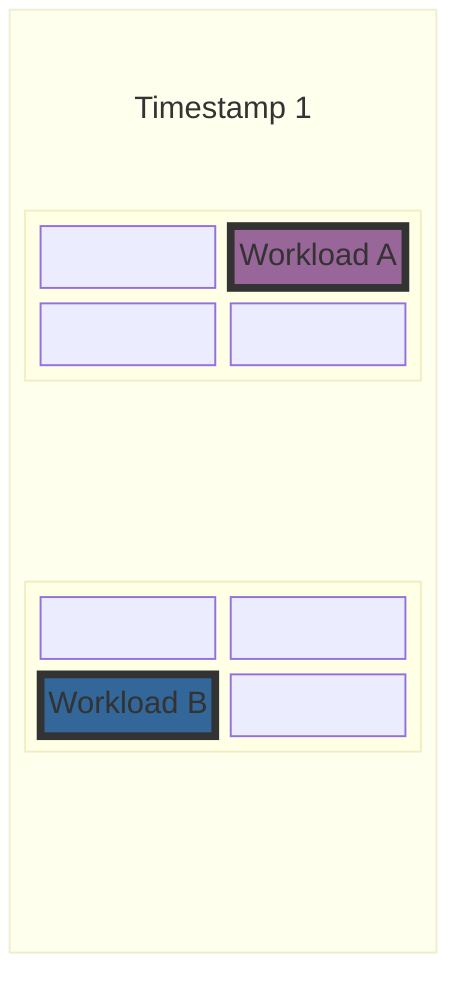
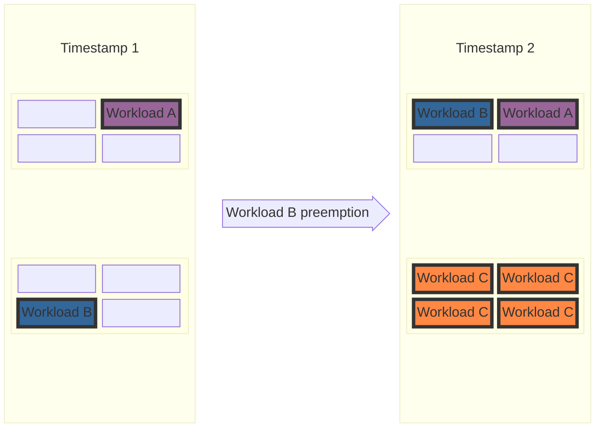

# KEP-13396: Configurable Preemptions

<!-- toc -->
- [Summary](#summary)
- [Motivation](#motivation)
  - [1. Defragmentation](#1-defragmentation)
  - [2. Hero workloads.](#2-hero-workloads)
  - [3. Desired behavior of preemptions is buisness driven.](#3-desired-behavior-of-preemptions-is-buisness-driven)
  - [Goals](#goals)
  - [Non-Goals](#non-goals)
- [Proposal](#proposal)
  - [User Stories (Optional)](#user-stories-optional)
    - [Story 1 (Optional)](#story-1-optional)
    - [Story 2 (Optional)](#story-2-optional)
  - [Notes](#notes)
  - [Constraints](#constraints)
  - [Caveats](#caveats)
  - [Risks and Mitigations](#risks-and-mitigations)
    - [Cascading preemptions due to misconfiguration](#cascading-preemptions-due-to-misconfiguration)
    - [Performance degradation](#performance-degradation)
- [Design Details](#design-details)
  - [Test Plan](#test-plan)
    - [Prerequisite testing updates](#prerequisite-testing-updates)
    - [Unit tests](#unit-tests)
    - [Integration tests](#integration-tests)
    - [e2e tests](#e2e-tests)
  - [Graduation Criteria](#graduation-criteria)
- [Implementation History](#implementation-history)
- [Drawbacks](#drawbacks)
- [Alternatives](#alternatives)
<!-- /toc -->

## Summary

<!--
This section is incredibly important for producing high-quality, user-focused
documentation such as release notes or a development roadmap. It should be
possible to collect this information before implementation begins, in order to
avoid requiring implementors to split their attention between writing release
notes and implementing the feature itself. KEP editors and SIG Docs
should help to ensure that the tone and content of the `Summary` section is
useful for a wide audience.

A good summary is probably at least a paragraph in length.

Both in this section and below, follow the guidelines of the [documentation
style guide]. In particular, wrap lines to a reasonable length, to make it
easier for reviewers to cite specific portions, and to minimize diff churn on
updates.

[documentation style guide]: https://github.com/kubernetes/community/blob/master/contributors/guide/style-guide.md
-->

## Motivation

### 1. Defragmentation

Kueue does not support topology based preemptions.
Right now Kueue takes into account only workload priorities and quota limits when
deciding if preemption is needed.
In many situations workloads that have quota satisfied but require specific toplogy cannot be scheduled due to cluster fragmentation. Currently Kueue does not support in any way preemption due to lack of topology or other way of defragmentation of the cluster.

The "desired" behavior can be seen in the example:

Let us consider cluster with 2 racks where each rack has 4 nodes.
For simplicity we will identify resources with nodes. And there is only one resource flavor with natural 2 level topology: rack, hostname.

And 3 cluster queues:
Queue A with quota 1.
Queue B with quota 1.
Queue C with quota 4.

Then quota of the entire cluster is 8, which is strictly larger than
sum of queues requirements.

Then at **Timestamp 1**  , 2 workloads are running:
Workload A from Queue A, and Workload B from Queue B, each consuming queues quota.



Then Workload C comes, which requires 4 nodes. The quota is available, but becasue of placement of Workload A and B in separate racks, each topology domain is blocked.


To allow Workload C to be scheduled, we need to preempt one of the workloads and move it to other rack. This functionality is currently not supported by Kueue.



### 2. Hero workloads.

Related [issue](https://github.com/kubernetes-sigs/kueue/issues/8826).

Hero workloads often are high priority and require majority of the cluster quota.
Currently Kueue does not natively support their needs as it has no notion of elevated preemption privileges to overrule standard quota and topology limitations when needed. In particular Kueue does not allow for preemption of jobs that are within guaranted quotas.
Current workarounds like "temporary" overrides of
quotas assigned to all cluster queue are bad from the user expierience perspective as they require manual handling.
Moreover they lead to wasted resources if hero workload failed for
some reason, and quotas are not brought back to previous status.

### 3. Desired behavior of preemptions is buisness driven.

Many companies have speicific requirements when workload should be preempted or not,
depending on their buisness needs.
For example [issue](https://github.com/kubernetes-sigs/kueue/issues/9596) asks for minimal specifying minimal time before preemption can happen for a workload.
Some buinsesses have SLAs for freshness of the provided information. Therefore,
failure to run a workload in time (dictated by SLA) can lead to significant finacial penalties. On the other hand those workloads might not be super high priority - they should not preempt other workloads, just the fact that they will run in next "X hours" is enough to satisfy SLA.
Other buisness might need workloads that are not preemptible at all.


### Other related issues:
* maxPriorityThreshold for withinClusterQueue preemptions [#12001](https://github.com/kubernetes-sigs/kueue/issues/12001)
* maxPriorityThreshold for reclaimWithinCohort [#12046](https://github.com/kubernetes-sigs/kueue/issues/12046)

<!--
This section is for explicitly listing the motivation, goals, and non-goals of
this KEP.  Describe why the change is important and the benefits to users. The
motivation section can optionally provide links to [experience reports] to
demonstrate the interest in a KEP within the wider Kubernetes community.

[experience reports]: https://github.com/golang/go/wiki/ExperienceReports
-->

### Goals
1. Preemptions triggered by lack of sufficient topology domains to run the workload.
2. Inter cluster queue premptions.
3. Configurability of preemptions to satisfy various buisness requirements.
4. Definition of most common fields that can be used to build preemption configurations.
5. Definition of "golden" configurations for common preemption scenarios.


### Non-Goals
1. Full defragmentation of the cluster.
2. One advanced preemption config to fullfil all premption needs.
3. Support for preemptions using arbitrary Workload fields - this KEP aims to
create a good baseline for configurations that can be extended in the future. it does not aim to be comprehensive for any possible scenario.
4. Complete replacement of current preemption strategies.


## Proposal

Introduce a new CRD **PreemptionConfig** that will be used to define:
- triggers when preemption should occur (e.g. insufficient topology to schedule the workload)
- rules defining which workloads should be considered for preemption
- order in which workloads should be preempted (until considered workload cane be scheduled)

The **PreemptionConfig** object is cluster-wide resource that can be referenced by multiple ClusterQueues.

The new **PreemptionConfig** object will be referencable in the **ClusterQueueSpec** in the following way:

```go
	// preemption defines the preemption policies. Must be null if PreemptionConfigName is specified.
	// +kubebuilder:default={}
	// +optional
	Preemption *ClusterQueuePreemption `json:"preemption,omitempty"`

	// Reference to the PreemptionConfig to be used. If specified, Preemption
	// must be null. Settings in PreemptionConfig overwrite any preemption
  // defaults that may be in the system. Indicated config defines which workloads
  // will be considered for preemption if workload from this cluster queue cannot be
  // scheduled due to resource or topology constraints.
	PreemptionConfigName string

```


In paralel introduce **PreemptionLimit** cluster scope CRD. This CRD will allow cluster administrators to define overal number of preemptions for specific "scope" in a particular time window. This will give administrators fine-grained settings to control the number of preemptions that can occur in the cluster, thereby giving them more control over cluster stability.
The preemptions of workloads will be performed only if they would not violate any of the defined limits. The following scopes will be supported:

- Global - total number of preemptions that can occur in the cluster,
- PreemptingClusterQueue - total number of preemptions triggered by a specific workload from a particular ClusterQueue,
- PreemptedClusterQueue - total number of preemptions of workloads that belong to a specific ClusterQueue,
- Workload - total number of times particular workload can be preempted.

Details about the API can be seen in the [Design Details](#design-details) section.

Success criteria:

1. TODO


<!--
This is where we get down to the specifics of what the proposal actually is.
This should have enough detail that reviewers can understand exactly what
you're proposing, but should not include things like API designs or
implementation. What is the desired outcome and how do we measure success?.
The "Design Details" section below is for the real
nitty-gritty.
-->

### User Stories

Each of the user stories mentioned in motivations can be fullfilled by appropriate config and/or preemption limits. Configs and limits for each of them  can be found below in appropriate subsections.

#### Story 1 - Defragmentation

User can define a config with InsufficientTopology trigger that will allow preemption of workloads blocking specific topologies when scheduling of workload from connected cluster queue requires it. To avoid "flappy" preemption issues, the rules should be limited in a way that guarantes asymetry, if A can preempt B, B shouldn't be able to preempt A. This can be done in various ways, for example:
* Only allow preemption of workloads with strictly smaller priority
* Only allow preemption of workloads that require smaller topologies (e.g. using custom numeric label)
* Only allow preemption of workloads that should be preemptible according to FairSharing rules.

Example config based on priority and slice size can look like this:
```
spec:
  rules:
    - trigger: "InsufficientTopology"
      minTriggerRequiredDurationSeconds: 30
			candidates:
			- relativeWorkloadPriority: "LowerOrEqual"
				relationRequirement: "AnyClusterQueue"
				TODO numeric label selector

			order:
				- orderingField: "Priority"
      
```

As it has "AnyClusterQueue" relation it can preempt workloads even if they are not related in any way to the preemptor cluster queue. In combination with custom numeric label selector this should result in eviction of smaller less important workloads blocking larger topologies, even if they are within the guaranted quota. Effectively if they are re-admitted again they should be placed in smaller domains(where  considered workload cannot be scheduled), thereby defragmenting the cluster.

#### Story 2 (Optional)

### Notes

There are many possible extensions of the proposed selectors in the rules. For now we propose to support only those that for us seemed most common and natural, but the design allows for extensibility. Examples of possible extensions are:
-  advanced topology comparison selectors extending custom numeric label based selector - e.g. "require same podset required levels for considered workloads"
- resource requests/limits based selectors - "only preempt workloads that request less than X amount of resources"

As the scope of the design is already broad we leave them as separate implemetation effort and not part of initial KEP proposal.


### Constraints


### Caveats

Given extensive nature of **PreemptionConfigs** defined below, the API introduces several complexities where users might inadvertently misconfigure their setup. To maximize user success, the following mitigations will be implemented:

* Deliver concrete examples demonstrating successful configurations.
* Offer detailed scenarios illustrating invalid configurations or potential flapping issues.
* Communicate explicitly that custom rule creation carries inherent risks and is intended for power users - the OSS Kueue community might not be able to support troubleshooting every custom scenario.


### Risks and Mitigations

#### Cascading preemptions due to misconfiguration
One inherent risk is users deploying ill-defined preemption configs that could lead to cluster instability (e.g. cascading preemptions). The design includes the following mitigations:
1. **Global limits** - cluster administrators have additonal safety measure that can be used to rollout new configs or rules gradually, by limiting number of preemptions they permitted by particular config or rule.
2. **Restrictive default preemption configuration** - By default empty config does not lead to any preemptions as candidate selection rules will be empty.
3. **Documentation** - Comprehensive documentation will be provided to help users understand the risks and benefits of each configuration option, including examples of common preemption scenarios and how to configure them.

#### Performance degradation
Other risk is preemption performance degradation due to generic nature of new rules and potentially large number of selectors. This risk will be mitigated by implementation of performance focused test suite for preemptions.

The test suite will be used to benchmark new implementation vs existing one to ensure that there is no significant performance degradation for already defined "high level" policies.
The test suite will be also used to indetify performance optimization opportunities for the newly introduced code.

The documation will also clearly indicate that creation of large number of complex preemption rules may have performance implications for the overall scheduling and that it is recommended to benchmark your configs before rolling out to production.

#### Security considerations


## Design Details

### Proposed API PreemptionConfig

```go
type PreemptionConfig struct {
	metav1.TypeMeta `json:",inline"`
	metav1.ObjectMeta `json:"metadata,omitempty"`
	Spec PreemptionConfigSpec `json:"spec,omitempty"`
}

type PreemptionConfigSpec {
	// Rules to select preemption candidates.
	Rules []PreemptionRule
	// Ordering of the preemption candidates.
	// The order will be always deterministic, as UID
	// of the workloads is used to break the ties
	// If not set workloads will be just ordered by UID.
	Ordering []Order
}


type PreemptionRuleTrigger string
const (
	InsufficientQuota PreemptionRuleTrigger = "InsufficientQuota"
	QuotaReclaimRequired PreemptionRuleTrigger = "QuotaReclaimRequired"
	InsufficientTopology PreemptionRuleTrigger = "InsufficientTopology"
}


type PreemptionRule struct {
	Name string

	// Label Selector indicating which workloads can trigger preemptions
	// using this rule.
	MatchingPreemptorWorkloads metav1.LabelSelector

	Trigger PreemptionRuleTrigger
	// How long the trigger has to occur to start preempting workloads specified by candidates. 0 indicates that preemptions can be started immediately.
	minTriggerRequiredDurationSeconds int

	// Selection rules for workloads that are candidates for preemption.
	// Candidates resulting from multiple selectors are summed into one set. No selectors result in empty candidate set, thereby disalowing any preemptions with this rule.
	Candidates  []PreemptionCandidateSelector
}
```

The first observation timestamp that sepecific trigger occurred is put into workload conditions.  The conditions are cleared upon succesful addmition of the workload or if they are no longer true.
This will result in the following new condition types:
`InsufficientQuota`, `InsufficientTopology`, `QuotaReclaimRequired`.


```go
type PreemptionRelationConstraint string

const (
	SameLocalQueue PreemptionRelationConstraint = "SameLocalQueue"
	SameClusterQueue PreemptionRelationConstraint = "SameClusterQueue"
	SameCohort PreemptionRelationConstraint = "SameCohort"
	SameCohortTree PreemptionRelationConstraint = "SameCohortTree"
	AnyClusterQueue PreemptionRelationConstraint = "AnyClusterQueue"
)


type QuotaConstraint string

const (
	BorrowingCapacityFromPreemptor QuotaConstraint = "BorrowingCapacityFromPreemptor"
	DRSLessThanOrEqualToFinalShare QuotaConstraint = "DRSLessThanOrEqualToFinalShare"
	DRSLessThanInitialShare QuotaConstraint = "DRSLessThanInitialShare"
	DRSAllStrategies QuotaConstraint = "DRSAllStrategies"
)


type PreemptionCandidateSelector struct{
	// Required. 
	RelationRequirement PreemptionRelationConstraint

	// Accepts all if not set. 
	// Cannot be set if RelationRequirement is SameLocalQueue or SamleClustrQueue.
	Quota QuotaConstraint

	// Accepts all if not set
	// Filter candidate workloads using custom numeric labels from the workload
	// resource. If you wish to propagate specific labels from the source job-like
	// resour
	// Multiple numeric labels are joined using AND-rule (all have to be satisfied).
	NumericLabels []NumericLabelConstraint

	// Accepts all if not set.
	ClusterQueueSelector metav1.LabelSelector

	// Accepts all if not set
	WorkloadSelector metav1.LabelSelector

	// Accepts all if not set
	HostNodeSelector metav1.LabelSelector

	// Matches all workload priority classes if not set.
	PreemptingWorkloadPrioritySelector metav1.LabelSelector

	// Matches all workload priority classes if not set.
	CandidateWorkloadPrioritySelector metav1.LabelSelector

	// The comparison is made against the preempting workload.
	// Lower means that the candidate
	// has lower priority than the preemptor and so on. No check is made
	// if the field is nil.
	RelativeWorkloadPrioirty *RelativeConstraint

	// Accepts any execution times if not set
	MinExecutionTimeSeconds *int64
	MaxExecutionTimeSeconds *int64
	ExecutionTimeRelation *RelativeConstraint

	// Accepts any time from creation if not set
	MinTimeFromCreationSeconds *int64
	MaxTimeFromCreationSeconds *int64
	TimeFromCreationRelation *RelativeConstraint
}


// NumericLabelConstraint describes the rule for filtering a custom numerical label.
// For example, this can be used to filter candidates based on the label somehow describing
// required topology domain size, such as the "number of TPUs". 
// If user has a label "number-of-tpus" that desribes number of tpus required in a single cube
// it can be used to create a rule that selects only workloads requiring smaller cube slices 
// by defining the relation="Lower". Such configuration would allow to preempt "smaller" workloads,
// to achieve better cluster utilization and decrease fragmentation.
// Please note that those labels are not out of the box copied from job-like objects.
// You should remember to append the designated labels to the list of labels
// copied to the workload via the Kueue main configuration
// if you wish to use a custom label.
type NumericLabelConstraint struct {
	// Key is the label key that stores the integer value in the workload that will
	// be used for candidate selection.
	Key string `json:"key"`

	// DefaultValue is used when a workload does not have the label key
	// or value under the key cannot be parsed as an integer.
	// If not specified workloads without the label or 
	// with label value not parsable as int are treated as incomparable, 
	// and therefore excluded from preemption candidates.
	// +optional
	DefaultValue *int32 `json:"defaultValue,omitempty"`

	// Relation defines how the preemptor compares to the candidate.
	// +optional
	Relation *RelativeConstraint `json:"relation,omitempty"`

	// MinValue specifies the lowest label value a candidate workload can have to be considered for preemption.
	// +optional
	MinValue *int32 `json:"minValue,omitempty"`

	// MaxValue specifies the highest label value a candidate workload can have to be considered for preemption.
	// +optional
	MaxValue *int32 `json:"maxValue,omitempty"`
}

type RelativeConstraint string

const (
	// Lower permits preemption if candidate field value < preemptor field value
	Lower RelativeConstraint = "Lower"
	// Greater permits preemption if candidate field value > preemptor field value
	Greater RelativeConstraint = "Greater"
	// LowerOrEqual permits preemption if candidate field value <= preemptor field value
	LowerOrEqual RelativeConstraint = "LowerOrEqual"
	// GreaterOrEquals permits preemption if candidate field value >= preemptor field value
	GreaterOrEquals RelativeConstraint = "GreaterOrEqual"
)

type OrderingField string
const (
	Priority OrderingField = "Priority"
	AdmissionTimestamp OrderingField = "AdmissionTimestamp"
	ClusterQueueDRS OrderingField = "ClusterQueueDRS"
	IsOtherCQ OrderingField = "IsOtherCQ"
	IsOtherCohort OrderingField = "IsOtherCohort"
	IsDRSLessThanInitialShare OrderingField = "IsDRSLessThanInitialShare"
	IsDRSLessThanOrEqualToFinalShare OrderingField = "IsDRSLessThanOrEqualToFinalShare"
)
```


As defined by [current ordering](https://github.com/kubernetes-sigs/kueue/blob/24f6f99135979076a8d56ca7fc407990b98c66af/pkg/scheduler/preemption/common/ordering.go#L34-L41)
The order is right now based on:

0. Workloads already marked for preemption first.
1. Workloads from other ClusterQueues in the cohort before the ones in the same ClusterQueue as the preemptor.
2. (AdmissionFairSharing only) Workloads with lower LocalQueue's usage first
3. Workloads with lower priority first.
4. Workloads admitted more recently first.

```go

type OrderingDirection string
const (
	Ascending OrderingDirection = "Ascending"
	Descending OrderingDirection = "Descending"
)

type Order struct {
	OrderingField OrderingField
	Direction OrderingDirection = Ascending
}
```


   
### Proposed API for PreemptionLimit

```go
type PreemptionLimit struct {
	metav1.TypeMeta 
	metav1.ObjectMeta 
	Spec PreemptionLimitSpec
Status PreemptionLimitStatus
}

type PreemptionLimitScope string
const (
	GlobalPreemptionLimitScope PreemptionLimitScope = "Global"
	PreemptingCQLimitScope PreemptionLimitScope = "PreemptingClusterQueue"
	PreemptedCQLimitScope PreemptionLimitScope = "PreemptedClusterQueue"
	PerPreemptedWorkloadLimitScope PreemptionLimitScope = "Workload"
)

type PreemptionLimitSpec struct {
	// Required
	Scope PreemptionLimitScope

	// If empty, it applies to all PreemptionConfigs
	ConfigSelector metav1.LabelSelector
	
	// If empty, it applies to all CQ that may want to preempt.
	ClusterQueueSelector metav1.LabelSelector

	// If Empty, it applies to all rules.
	RuleNames []string
	
	// How many preemption events can there be in the givent time window. 
	Limit  int
	LimitWindowSeconds int
}

type PreemptionLimitStatus struct {
Conditions []metav1.Condition


	// Periodically updated, for reference only.
	// Map key depends on the scope. For Global it is just Global.
	// For CQ it is Cluster Queue name
	// For Workload it is namespace +/"+ workload name
	Count map[string]int
}
```

PreemptionLimit limits the number of preemptions that happen for the specified set of rules. The PreemptionCode evaluates proposed preemptions against defined limit objects, allowing them to proceed only if adequate preemption quota remains. If preemption is in scope of multiple limits, quota must exist in all of them.
To track this, a list of preemption rule names responsible for selecting each candidate must be maintained.

To manage this data, Kueue stores a comprehensive preemption map in memory, which is isolated per PreemptionLimit. This map tracks all preemption event timestamps under a specific cq/workload key, capturing events that occurred within the designated LimitWindowSeconds. Moreover, it tracks only events that are in scope of the specific limit, if preemption does not match the defined config or rules selector it will be not tracked in particular instance of the preemption map.
This list is dynamically trimmed upon each retrieval to filter out expired timestamps.

Furthermore, the status of the PreemptionLimit is refreshed periodically—approximately every minute—to write the aggregated totals into the count map.


### Test Plan

<!--
**Note:** *Not required until targeted at a release.*
The goal is to ensure that we don't accept enhancements with inadequate testing.

All code is expected to have adequate tests (eventually with coverage
expectations). Please adhere to the [Kubernetes testing guidelines][testing-guidelines]
when drafting this test plan.

[testing-guidelines]: https://git.k8s.io/community/contributors/devel/sig-testing/testing.md
-->

[ ] I/we understand the owners of the involved components may require updates to
existing tests to make this code solid enough prior to committing the changes necessary
to implement this enhancement.

#### Prerequisite testing updates

<!--
Based on reviewers feedback describe what additional tests need to be added prior
implementing this enhancement to ensure the enhancements have also solid foundations.
-->

#### Unit tests

<!--
In principle every added code should have complete unit test coverage, so providing
the exact set of tests will not bring additional value.
However, if complete unit test coverage is not possible, explain the reason of it
together with explanation why this is acceptable.
-->

<!--
Additionally, try to enumerate the core package you will be touching
to implement this enhancement and provide the current unit coverage for those
in the form of:
- <package>: <date> - <current test coverage>

This can inform certain test coverage improvements that we want to do before
extending the production code to implement this enhancement.
-->

- `<package>`: `<date>` - `<test coverage>`

#### Integration tests

<!--
Describe what tests will be added to ensure proper quality of the enhancement.

After the implementation PR is merged, add the names of the tests here.
-->

#### e2e tests

<!--
This question should be filled when targeting a release.
For Alpha, describe what tests will be added to ensure proper quality of the enhancement.

For Beta and GA, document that tests have been written,
have been executed regularly, and have been stable.
This can be done with:
- permalinks to the GitHub source code
- links to the periodic job (typically a job owned by the SIG responsible for the feature), filtered by the test name

If e2e tests are not necessary or useful, explain why.
-->

### Graduation Criteria

<!--

Clearly define what it means for the feature to be implemented and
considered stable.

If the feature you are introducing has high complexity, consider adding graduation
milestones with these graduation criteria:
- [Maturity levels (`alpha`, `beta`, `stable`)][maturity-levels]
- [Feature gate][feature gate] lifecycle
- [Deprecation policy][deprecation-policy]

[feature gate]: https://git.k8s.io/community/contributors/devel/sig-architecture/feature-gates.md
[maturity-levels]: https://git.k8s.io/community/contributors/devel/sig-architecture/api_changes.md#alpha-beta-and-stable-versions
[deprecation-policy]: https://kubernetes.io/docs/reference/using-api/deprecation-policy/
-->

## Implementation History

Proposed implementation approach:

**Step 0.** Identify minimal subfields needed to migrate existing preemption rules to the new API. (To be done during KEP review process)

**Step 1.** Implement rules identified in **Step 0**, define the API internally in Kueue and migrate existing rules to it.

**Step 2.** Expose the API externally to the users, with limited fields and selectors.

**Step 3.** Implement PreemptionLimits.

**Step 4.** Implement the remaining "selectors" in preemption rules.


<!--
Major milestones in the lifecycle of a KEP should be tracked in this section.
Major milestones might include:
- the `Summary` and `Motivation` sections being merged, signaling SIG acceptance
- the `Proposal` section being merged, signaling agreement on a proposed design
- the date implementation started
- the first Kubernetes release where an initial version of the KEP was available
- the version of Kubernetes where the KEP graduated to general availability
- when the KEP was retired or superseded
-->

## Drawbacks
1. Complexity of the solution.

As proposed configurations are targetting various use-cases, the API and the implementation will be much more complex than just adding simple fields targetting specific use cases, e.g. "canPreemptAll". However providing a single centrally designed and consistent API will make the implementation and configuration more flexible, composable and easier to maintain than creating multiple specialized solutions.


<!--
Why should this KEP _not_ be implemented?
-->

## Alternatives

1. Periodic defragmentation process that moves workloads to make larger topological domain available.
- will not satisfy other user needs like hero jobs and SLA aware preemptions
- can lead to unnecessary preemptions and therefore wasted cluster resources if defragmentation process "moves" the workload to more suitable spot, but a workload in need of freed topology domain will not come before workload finish

2. Uber cluster Queues as separate CRD with elevated permissions to preempt any workload and without quota limits.
- would bring much complexity to the system and would not fulfill other user needs
- would be harder to maintain as it would require "dual" handling of Kueue preemption and quota computation logic
- depending on the exact API, can be harder for users to migrate to, as they probably already have some form of "uber" cluster queues if they really need them.

3. Additional preemption related fields in **ClusterQueueSpec** like selector of queues from which it can preempt, preempted workload execution duration, etc.
Ruled out because:
- it will lead to inconsistencies between cluster queues
- will make preemptions rules mainatanance harder
- will not allow for defining fine-grained global preemption limits


4. Consolidation of **PreemptionConfig** and **PreemptionLimit** to single CRD.
Ruled out because:
- it will not allow to limit preemptions globally
- it will make configurations like "this cluster queue should be never preempted" unintuitive
- it will make limits across different configs harder to maintain or infeasible at all