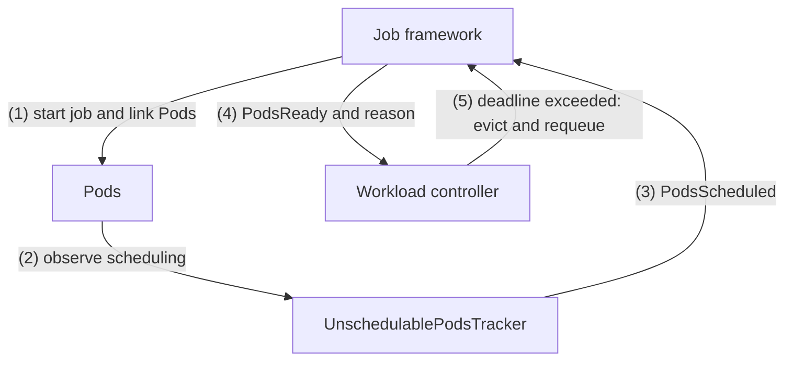
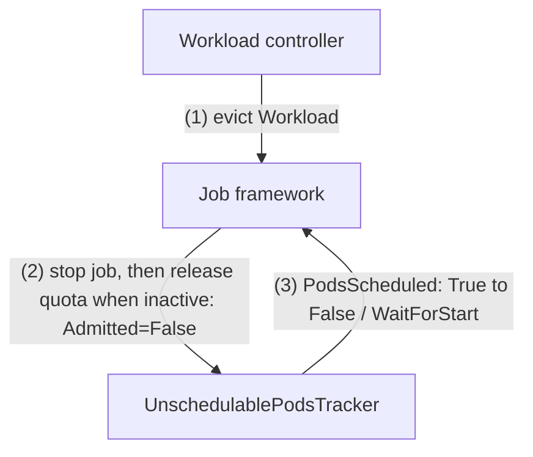

# KEP-13502: Unscheduled Pods Timeout

<!-- toc -->
- [Summary](#summary)
- [Motivation](#motivation)
  - [Goals](#goals)
  - [Non-Goals](#non-goals)
- [Proposal](#proposal)
  - [User Stories (Optional)](#user-stories-optional)
    - [Story 1](#story-1)
    - [Story 2](#story-2)
  - [Notes/Constraints/Caveats (Optional)](#notesconstraintscaveats-optional)
  - [Risks and Mitigations](#risks-and-mitigations)
- [Design Details](#design-details)
  - [Overview](#overview)
  - [Feature gate](#feature-gate)
  - [Kueue Configuration API](#kueue-configuration-api)
  - [Linking Pods to Workloads](#linking-pods-to-workloads)
  - [UnschedulablePodsTracker controller](#unschedulablepodstracker-controller)
  - [Workload PodsScheduled condition](#workload-podsscheduled-condition)
  - [Workload PodsReady condition](#workload-podsready-condition)
  - [Admission cycle and reset](#admission-cycle-and-reset)
  - [Timeout interaction](#timeout-interaction)
  - [Eviction and requeue](#eviction-and-requeue)
  - [Concurrent Admission](#concurrent-admission)
  - [Elastic Jobs via WorkloadSlices](#elastic-jobs-via-workloadslices)
  - [Version skew and rolling upgrade](#version-skew-and-rolling-upgrade)
  - [Test Plan](#test-plan)
    - [Prerequisite testing updates](#prerequisite-testing-updates)
    - [Unit tests](#unit-tests)
    - [Integration tests](#integration-tests)
    - [e2e tests](#e2e-tests)
  - [Graduation Criteria](#graduation-criteria)
    - [Alpha](#alpha)
    - [Beta](#beta)
    - [Stable](#stable)
- [Implementation History](#implementation-history)
- [Drawbacks](#drawbacks)
- [Alternatives](#alternatives)
  - [Per-integration <code>PodsScheduled</code> on <code>GenericJob</code>](#per-integration-podsscheduled-on-genericjob)
  - [Restarting <code>timeout</code> once all required Pods are scheduled](#restarting-timeout-once-all-required-pods-are-scheduled)
  - [Workload controller reading <code>PodsScheduled</code> directly](#workload-controller-reading-podsscheduled-directly)
  - [A <code>SchedulingObserved</code> condition](#a-schedulingobserved-condition)
<!-- /toc -->

## Summary

Extend WaitForPodsReady with a dedicated timeout to evict Workloads whose required Pods
remain unschedulable long enough to exceed it.

This allows admins to evict Workloads with unschedulable Pods earlier than with the catch-all
readiness timeout, which also covers image pulling, init containers and readiness probes.

## Motivation

On some clusters, pods may take a long time to become Ready after scheduling because of
image pulling or initialization. Operators often set `waitForPodsReady.timeout` to 30
minutes to accommodate that.

However, some phases of the scheduling are often expected to elapse earlier. For example,
admins may assume that the scheduling phase takes no more than 5 minutes. If that is exceeded
(e.g., due to timing or transient state inconsistencies between Kueue and the scheduler),
they want to evict the Workload and save the remaining 25 minutes for other Workloads.

### Goals

- Introduce a configurable timeout which, when exceeded, evicts and requeues the Workloads
  whose Pods remain unschedulable.

### Non-Goals

- Replacing or modifying kube-scheduler scheduling queue timeouts.
- Reporting Workloads whose Pods cannot be observed in the initial version.

## Proposal

Introduce an optional `waitForPodsReady.unschedulableTimeout`. A shared Pod-tracking
controller detects scheduling progress across job integrations, while the job framework
distinguishes scheduling waits from startup and recovery. Existing eviction and requeue
mechanisms enforce the deadline.

### User Stories (Optional)

#### Story 1

As a cluster operator I want to ensure high cluster utilization. To achieve that I configure
`waitForPodsReady` with a 30-minute `timeout` to evict any Workloads that are not making
progress and make room for runnable Jobs. I would like to further increase the utilization by
evicting Workloads whose Pods cannot be scheduled within another, shorter, predefined timeout:

```yaml
apiVersion: config.kueue.x-k8s.io/v1beta2
kind: Configuration
waitForPodsReady:
  timeout: 30m
  unschedulableTimeout: 5m
```

#### Story 2

In high-churn clusters, Kueue and the scheduler may frequently observe different cluster
snapshots, making Kueue's scheduling decisions stale.

As a cluster operator, I want to evict and requeue affected Workloads before the full readiness
`timeout`, allowing scheduling to be reevaluated and releasing capacity for runnable Workloads
to maximize cluster utilization.

### Notes/Constraints/Caveats (Optional)

- Central Pod observation provides per-PodSet accounting and consistent scheduling semantics
  across job frameworks, including in-house integrations.
- It also enables future failure messages identifying individual Pods that failed to start.
  A shared readiness detector could extend these benefits to WaitForPodsReady
  (see [Graduation Criteria](#graduation-criteria)).
- Once `PodsScheduled=True`, it remains `True` for the current admission even if some Pods
  fail or are recreated. Replacement Pods are not subject to `unschedulableTimeout`.
  Existing readiness and recovery timeouts continue to apply. For unfinished Workloads,
  scheduling history can reset only after loss of admission, such as after quota release
  (see [Admission cycle and reset](#admission-cycle-and-reset)).

### Risks and Mitigations

A timeout tuned for small jobs may evict autoscaler-dependent jobs or occasional
large jobs prematurely. Increasing it for everyone reduces utilization. Temporarily retuning
it adds operational work. Per-Workload WaitForPodsReady
([kubernetes-sigs/kueue#4803](https://github.com/kubernetes-sigs/kueue/issues/4803)) could allow
tailored timeouts. kube-scheduler
[KEP-5598: Opportunistic batching](https://github.com/kubernetes/enhancements/blob/master/keps/sig-scheduling/5598-opportunistic-batching/README.md)
may reduce large-job delays but cannot eliminate this risk.

## Design Details

### Overview

After admission, the job framework links Pods to their Workload. The tracker reports scheduling
progress, while the job framework remains responsible for readiness. The workload controller
uses that readiness reason to select a deadline and reuse the existing eviction and requeue flow.





### Feature gate

Each row shows a combination of feature-gate settings and timeout configuration.

| `WaitForPodsReadyUnschedulableTimeout` | `DisableWaitForPodsReady` | `unschedulableTimeout` | Behavior |
|-------------------------------------|--------------------------|-----------------------|----------|
| `false` | `false` | Unset | Scheduling tracking disabled. Ordinary readiness behavior is unchanged. |
| `false` | `true` | Unset | WaitForPodsReady disabled, including scheduling tracking. |
| `false` | `false` | Set, including `0s` | Invalid: `unschedulableTimeout` requires `WaitForPodsReadyUnschedulableTimeout=true`. |
| `false` | `true` | Set, including `0s` | Invalid: `unschedulableTimeout` requires `WaitForPodsReadyUnschedulableTimeout=true`. |
| `true` | `true` | Unset or set | Invalid gate combination, even without configuration. |
| `true` | `false` | Positive | Tracking, annotations/index, readiness propagation, timeouts and scheduling-history reset enabled. |
| `true` | `false` | Unset or `0s` | No new behavior, including scheduling-history reset. Retained scheduling conditions are ignored. Ordinary readiness behavior is unchanged. |

### Kueue Configuration API

```go
type WaitForPodsReady struct {
    // ...
    // UnschedulableTimeout limits how long required Pods may remain unscheduled
    // from the current Admitted=True condition's lastTransitionTime. Scheduled
    // or succeeded Pods satisfy the requirement. While a current-admission
    // observation shows incomplete scheduling, exceeding this deadline evicts
    // and requeues the Workload with reason PodsReadyTimeout.
    // The overall timeout starts at the same admission timestamp and never restarts.
    // Once scheduled, normal readiness and recovery timeouts apply.
    // Must be non-negative and no greater than timeout after defaulting.
    // Unset or 0s disables the entire feature, including scheduling-history reset.
    // Requires the WaitForPodsReadyUnschedulableTimeout feature gate.
    // +optional
    UnschedulableTimeout *metav1.Duration `json:"unschedulableTimeout,omitempty"`
}
```

**Validation:**

- The value must be non-negative and no greater than `timeout` after defaulting.
  Omission or `0s` disables all feature behavior. Equality with `timeout` is accepted.
- Field presence and gate combinations follow the [feature-gate table](#feature-gate),
  independently of the timeout value or readiness configuration.

### Linking Pods to Workloads

Pods are associated by Workload name through `kueue.x-k8s.io/workload`, or by slice chain
through `kueue.x-k8s.io/workload-slice-name` for elastic jobs. This reuses the existing Pod
index without job-specific discovery or a new Workload-incarnation identifier.

With tracking enabled, integrations add the annotations to Pod templates at job start and
remove them at stop. Pod-based integrations add them to gated Pods at start.
Only annotated Pods are observed. Without observations, the regular `timeout` applies.

### UnschedulablePodsTracker controller

A new controller, `UnschedulablePodsTracker`, is driven by batched Pod events.

**Responsibilities:**

- Observe admitted, quota-holding Workloads until finish or eviction, excluding
  ConcurrentAdmission Variants. Elastic jobs use the active slice and its whole Pod chain.
- Determine whether every admitted PodSet's grant is satisfied:

  $$
  \mathrm{scheduled}_p = \min\left(\mathrm{granted}_p,
  \mathrm{activeScheduled}_p + \max\left(\mathrm{succeededRetained}_p, \mathrm{reclaimable}_p\right)\right)
  $$

  $$
  \mathrm{allScheduled} \iff \forall p \in \mathrm{PodSets},\quad
  \mathrm{scheduled}_p = \mathrm{granted}_p
  $$

  `granted` is the admission assignment count, without capping it at the current spec count
  after scale-down. Only a missing assignment count falls back to the spec count, as defined
  by the Workload API. `activeScheduled` counts scheduled Pods,
  excluding terminal and deleting Pods. `succeededRetained` includes deleting succeeded Pods.
  `reclaimable` is the PodSet's `reclaimablePods` count when `ReclaimablePods` is enabled. The maximum avoids
  double-counting completed Pods, and the cap prevents surplus Pods satisfying another PodSet.
- Start observation only with a live linked Pod or retained succeeded Pods filling the
  admission. No Pods, zero-count PodSets, or terminal/terminating Pods alone do not open a
  scheduling window. After observation starts, the formula determines completion.

**Required-pod semantics:**

| Case | Behavior |
|------|----------|
| Pod bound to a node (`spec.nodeName` set or `PodScheduled=True`) | Scheduled. |
| Pod not yet created (count below granted) | Not all scheduled. `PodsScheduled=False` / `WaitForScheduling` once a live Pod is observed. |
| Pod held by a Kueue scheduling gate | Unscheduled. |
| Pod being deleted (not `Succeeded`) or `Failed` | Does not satisfy a slot. A replacement Pod is required. Alone it never opens the scheduling window. |
| Pod `Succeeded` (retained or reflected in `reclaimablePods`) | Counts as scheduled. No replacement required. |
| Pod deleted or preempted while the Workload was running | `PodsScheduled` stays `True`. `PodsReady=False` / `WaitForRecovery` and `recoveryTimeout` govern the eviction. |
| Optional PodSets with zero count | No Pods required. |

Lifecycle transitions follow [Admission cycle and reset](#admission-cycle-and-reset).

### Workload PodsScheduled condition

`PodsScheduled` records scheduling progress for one admission, independently of readiness.

| Status / Reason | Meaning |
|-----------------|---------|
| `False` / `WaitForScheduling` | Required Pods are not all scheduled. The admission-based scheduling deadline applies. |
| `True` / `AllRequiredPodsScheduled` | All required Pods were scheduled or succeeded. This history remains valid despite later failure, deletion or scale-down. |

Only these status/reason pairs with `lastTransitionTime > Admitted.lastTransitionTime` are
current-admission observations. The tracker stamps the first observation of each admission,
even when its status is unchanged, at least one second after admission to preserve ordering
at API timestamp precision. The timestamp remains unchanged while Pods stay unscheduled.
`observedGeneration` may lag after an observation and does not identify an admission.

### Workload PodsReady condition

The JobFramework controllers continue to compute readiness from job status. Before first readiness,
a current `PodsScheduled=False` observation adds `WaitForScheduling` as a
`PodsReady=False` reason. Otherwise the reason remains `WaitForStart`.

### Admission cycle and reset

Scheduling observations are valid only for their admission. Setting `Evicted=True` does not
itself clear admission. After the job is stopped and inactive, the JobFramework controller
releases quota and sets `Admitted=False`. This Workload update triggers the tracker. With
tracking enabled, when the tracker observes the non-admitted, unfinished Workload with
`PodsScheduled=True`, it resets that condition to `False` / `WaitForStart`.
The JobFramework controller continues to update readiness independently.

| Transition | Existing `PodsScheduled` | Existing `PodsReady` |
|------------|--------------------------|----------------------|
| Finish | Retained | Retained because finished Workloads skip readiness updates |
| Eviction requested (`Evicted=True`) | Turn it to False via Quota release | No eviction-specific reset |
| Quota release (`Admitted=False`) | Turn it to False via UnAdmission | Retained in the quota-release update |
| Tracker observes non-admission | Retained `True` becomes `False` / `WaitForStart` when tracking is enabled | Unchanged |
| Job reconcile observes non-admission | Unchanged | `False` / `WaitForStart` |
| Re-admission | Previous observation ignored. A fresh observation is required | Not reset by admission. Recomputed by the JobFramework controller |

The tracker watches both Pod and Workload events, so a reset does not require remaining Pods
or a later Pod event.

When the JobFramework controller observes non-admission, it resets `PodsReady` to
`False` / `WaitForStart`. After re-admission, the initial timeout uses the new admission timestamp.
If re-admission occurs before the JobFramework controller observes non-admission, previous
readiness or recovery state can remain. A retained `PodsReady=True` skips timeout evaluation
until readiness is updated. Retained recovery state selects `recoveryTimeout` instead of
`unschedulableTimeout`, even with a current unscheduled observation.

### Timeout interaction

The workload controller selects the deadline from `PodsReady`. `PodsScheduled` confirms a
current-admission scheduling observation. Let `A` be `Admitted=True.lastTransitionTime` and
`R` the `PodsReady` transition time. Here, `unschedulableTimeout: 0s` is treated as unset.

| `PodsReady` | Deadline | Underlying cause |
|-------------|----------|------------------|
| `True` | None | — |
| Absent or `WaitForStart` | `A + timeout` | `WaitForStart` |
| `WaitForScheduling`, `unschedulableTimeout` is specified and current unscheduled observation | `A + unschedulableTimeout` | `WaitForScheduling` |
| `WaitForScheduling`, timeout is specified but no current unscheduled observation | `A + timeout` | `WaitForScheduling` |
| Retained `WaitForScheduling`, timeout unset/`0s` | `A + timeout` | `WaitForStart` |
| `WaitForRecovery`, positive `recoveryTimeout` | `R + recoveryTimeout` | `WaitForRecovery` |
| `WaitForRecovery`, `recoveryTimeout: 0s` | None | — |

Both initial deadlines start at admission. Neither Pod creation nor observation restarts
them. A late observation of incomplete scheduling does not grant another scheduling window:
if the admission-based deadline has passed, eviction is due at the next timeout evaluation.
For example, four minutes spent scheduling with `timeout: 30m` leaves 26 minutes for readiness.

### Eviction and requeue

Scheduling timeouts reuse `PodsReadyTimeout` eviction and the existing `requeuingStrategy`,
including backoff and deactivation. `WaitForScheduling` distinguishes the underlying cause
in scheduling statistics, eviction metrics and Events. Start and recovery behavior is unchanged.

### Concurrent Admission

Only the Parent is tracked, even when Variants share its slice-chain annotation.
Variants inherit no status at creation and mirror the Parent's readiness after admission
or migration. Quota release does not reset their readiness.

### Elastic Jobs via WorkloadSlices

On scale-up, both `unschedulableTimeout` and `timeout` start when the new slice is
admitted, not when scaling is requested. Existing scheduled Pods count toward the
expanded requirement. Scheduling completion does not restart `timeout`.

`unschedulableTimeout` applies only when incomplete scheduling is observed before the
new slice first reaches readiness. If the job remains ready during scale-up, it does not
apply. Once the new slice has reached readiness, subsequent readiness loss follows the
existing recovery policy instead.

Scheduling observation uses the active admitted slice and Pods from the whole chain,
including events referring to a finished or deleted origin. Finishing an old slice does not
reset the active slice.

### Version skew and rolling upgrade

- Pre-upgrade Pods with linking annotations can be observed by name. When all Pods lack
  annotations and no observation exists, the regular admission-based `timeout` applies.
  Jobs started after enabling the feature receive annotations.
- Admission timestamps distinguish retained observations from a previous admission, including
  after quota release without eviction. Older controllers need not reset them for the new
  tracker to start a fresh observation.
- Both old and new controllers reset readiness only when Job reconcile observes non-admission.
  Fast re-admission can retain the previous readiness state.

### Test Plan

[x] I/we understand the owners of the involved components may require updates to
existing tests to make this code solid enough prior to committing the changes necessary
to implement this enhancement.

#### Prerequisite testing updates

Extend existing `waitForPodsReady` coverage in the job and workload controllers, preserving
existing readiness expectations.

#### Unit tests

- Configuration: test timeout boundaries/defaulting, missing effective timeout, gate conflicts
  with/without readiness configuration, older API conversion.
- Lifecycle: [reset semantics](#admission-cycle-and-reset), generation/timestamps,
  no-ops and disabled gates.
- Pod accounting: cover per-PodSet binding, `PodScheduled=True`, succeeded/reclaimable,
  failed/deleting, replacement, surplus and gated Pods.
- Job framework: propagate only current-admission initial observations and preserve recovery.
  Verify fresh `Started` transitions/metrics and annotation gates.
- Workload controller: cover the [deadline table](#timeout-interaction), cap, extreme durations,
  stale/missing observations, eviction causes and disabled behavior.
- Tracker: retain admission counts through scale-down before `True`, sticky history afterward,
  and fresh re-admission timestamps. Cover empty/terminal-only Pods, success/reclaimable
  accounting, exclusions, elastic redirection, name association, event predicates, list errors,
  status-update errors and repeated reconciliation.
- Admission boundaries: reject unknown reasons and timestamps at/before admission regardless
  of generation and test the one-second boundary. Failed/reclaimable-only Pods cannot open
  observation, but retained succeeded Pods filling the admission can.

#### Integration tests

Use batch Jobs for timeout/lifecycle coverage in existing readiness suites.

- Verify annotations, scheduling/readiness conditions, `PodsReadyTimeout` eviction and
  `WaitForScheduling` causes in conditions/statistics/metrics.
- Cover scheduled/unobserved Pods, deletion and unchanged recovery.
- Test unset/zero/equal timeouts, disabling and restart after configuration removal while
  preserving legacy behavior.
- Verify [lifecycle condition preservation and tracker resets](#admission-cycle-and-reset),
  including absent Pods, unchanged unscheduled history and preservation
  of fresh observations across readiness updates.
- Re-admit before/after Job reconcile observes non-admission, preserving existing readiness
  behavior.
- ConcurrentAdmission/elastic: mirror Parent readiness across migrations. Redirect
  finished/deleted-origin events to the active Parent, excluding Variants.
- Regress integration/job/scheduler/TAS/elastic annotation and PodSet-label propagation,
  including MPIJob discovery.

#### e2e tests

1. Enable tracking. Create a Job with an unsatisfiable node selector.
2. Verify `PodsScheduled`, `PodsReady`: `False` / `WaitForScheduling`.
3. Verify `WaitForScheduling` eviction at `A+unschedulableTimeout ≤ now < A+timeout`
   and its counter increment.
4. After non-admission: `PodsReady=False` / `WaitForStart`, unchanged `PodsScheduled`.

### Graduation Criteria

#### Alpha

- The feature gate `WaitForPodsReadyUnschedulableTimeout` is disabled by default.
- The feature is implemented and all its code paths are isolated by the feature gate.
- Unit and integration tests are added.

#### Beta

- The feature gate is enabled by default.
- All known bugs are fixed and the user feedback is addressed.
- Re-evaluate configuring `unschedulableTimeout` per Workload.
- Consider applying `unschedulableTimeout` to partial Pod replacements after
  `Admitted=True` and `PodsScheduled=True`.

#### Stable

- The feature gate is locked.
- All known bugs are fixed and the user feedback is addressed.
- Re-evaluate shared readiness tracking for per-PodSet accuracy, richer diagnostics and
  consistent timeouts across integrations, potentially unifying quota-release policies.
  The key constraint is knowing the expected active Pod count after Pods succeed or
  disappear. A shared detector may need additional Workload status to retain that information.

## Implementation History

- 2026-09-07: Initial KEP

## Drawbacks

No additional drawbacks beyond [Risks and Mitigations](#risks-and-mitigations).

## Alternatives

### Per-integration `PodsScheduled` on `GenericJob`

Each integration could implement a scheduling probe on `GenericJob`. Rejected as the primary
approach because it duplicates Pod discovery, increases maintenance for every integration,
and requires changes to in-house integrations.

### Restarting `timeout` once all required Pods are scheduled

Starting the readiness budget after scheduling would allow an admission to consume
`unschedulableTimeout + timeout`. Rejected because it changes the existing timeout contract
and makes the deadline depend on potentially missing observations.

### Workload controller reading `PodsScheduled` directly

Combining both conditions in the workload controller would duplicate the job framework's
readiness-history decisions. Keep `PodsReady` as the timer selector and use `PodsScheduled`
only to validate the current admission's scheduling observation.

### A `SchedulingObserved` condition

A separate freshness condition could distinguish a failed Pod list from a current observation.
Rejected per maintainer feedback: stale observations within an admission are accepted, while
admission timestamps prevent reuse across admissions.
