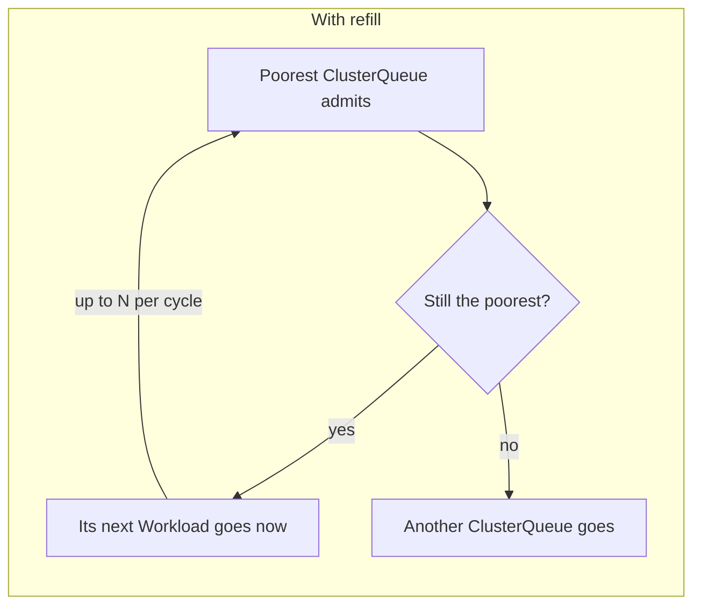

# KEP-14596: Scheduling Cycle Refill

<!-- toc -->
- [Summary](#summary)
- [Motivation](#motivation)
  - [Goals](#goals)
  - [Non-Goals](#non-goals)
- [Proposal](#proposal)
  - [User Stories](#user-stories)
    - [Story 1: a deep backlog drains one Workload per cycle](#story-1-a-deep-backlog-drains-one-workload-per-cycle)
    - [Story 2: available capacity goes to a ClusterQueue with a higher share](#story-2-available-capacity-goes-to-a-clusterqueue-with-a-higher-share)
  - [Terminology](#terminology)
  - [How refill works](#how-refill-works)
  - [Refill budget](#refill-budget)
  - [Interaction with other scheduling features](#interaction-with-other-scheduling-features)
  - [Observability](#observability)
  - [Notes, Constraints, and Caveats](#notes-constraints-and-caveats)
  - [Risks and Mitigations](#risks-and-mitigations)
    - [Longer cycles act on an older snapshot](#longer-cycles-act-on-an-older-snapshot)
    - [Latency for Workloads arriving mid-cycle](#latency-for-workloads-arriving-mid-cycle)
    - [Fairness residue when the refill budget binds](#fairness-residue-when-the-refill-budget-binds)
- [Test Plan](#test-plan)
  - [Unit tests](#unit-tests)
  - [Integration tests](#integration-tests)
  - [Benchmark](#benchmark)
- [Graduation Criteria](#graduation-criteria)
  - [Alpha (v0.20)](#alpha-v020)
  - [Beta](#beta)
    - [Budget allocation](#budget-allocation)
    - [Scope beyond Fair Sharing](#scope-beyond-fair-sharing)
- [Implementation History](#implementation-history)
- [Drawbacks](#drawbacks)
- [Alternatives](#alternatives)
  - [Look-ahead](#look-ahead)
  - [Scanning past a blocked ClusterQueue head](#scanning-past-a-blocked-clusterqueue-head)
  - [An unbounded refill](#an-unbounded-refill)
  - [Charging the budget only for successful admissions](#charging-the-budget-only-for-successful-admissions)
<!-- /toc -->

## Summary

Today the scheduler considers at most one Workload per ClusterQueue per scheduling cycle.
A ClusterQueue that admits a Workload cannot admit again until the next cycle, even if it is still the furthest below its fair share.
Capacity left in the cycle can therefore go to siblings with a higher share first.

Scheduling Cycle Refill removes that wait: after each successful admission, the ClusterQueue's next Workload joins the current cycle and competes under the freshly recomputed ordering.
A fixed per-cycle budget bounds the extra scheduling work.
Alpha implements this for Fair Sharing only, behind the `FairSharingRefill` gate.
Extending it to classic preemption is Beta work and would ship behind a gate of its own.

## Motivation

The concrete example from [#9345](https://github.com/kubernetes-sigs/kueue/issues/9345):

```text
- Root Cohort (4 GPU)
  - CQ-A (0 GPU)
  - CQ-B (0 GPU)
```

Each workload requests 1 GPU.

|  | Without refill (as reported in #9345) | With refill |
|---|---|---|
| t0 | `create a0, a1` | `create a0, a1` |
| t1 | `a0, a1 schedule; DRS(CQ-A): 500` | `a0, a1 schedule; DRS(CQ-A): 500` |
| t2 | `create a2, b0, b1` | `create a2, b0, b1` |
| t3 | `a2, b0 schedule; DRS(CQ-A): 750, DRS(CQ-B): 250` | `b0 schedules; ordering recomputed: DRS(CQ-B): 250 < DRS(CQ-A): 500, refill pops b1` |
| t3 (cont.) | | `b1 schedules; DRS(CQ-A): 500, DRS(CQ-B): 500` |

The fair-sharing ordering was never wrong here. CQ-B loses the second GPU because the cycle sees only one workload per ClusterQueue, so b1 never competes in that cycle even though CQ-B is still furthest below its fair share. Refill lets the ordering keep deciding within the cycle until capacity or the budget runs out, converging to 500/500 instead of locking in 750/250.

Whether anything corrects the 750/250 split afterwards depends on configuration.
`reclaimWithinCohort` defaults to `Never`, and under that default nothing does: CQ-A keeps the third GPU until one of its own Workloads finishes.
With `reclaimWithinCohort: Any`, fair-sharing preemption does correct it, but only by evicting a Workload that has already been admitted.
Refill reaches the same distribution inside the cycle that produced the imbalance, without that admit-then-evict churn.

### Goals

- Define a bounded mechanism for exposing a ClusterQueue's next candidate to the same scheduling cycle after a successful admission, with Alpha scoped to Fair Sharing.
- Preserve scheduler correctness when the candidate set grows during a cycle.
- Bound the additional work, and record when that bound is reached.

### Non-Goals

- Letting a refilled Workload preempt, or reserve capacity that another Workload in the same cycle is waiting for.

## Proposal

### User Stories

#### Story 1: a deep backlog drains one Workload per cycle

A ClusterQueue has 100 pending Workloads and the lowest fair share in its cohort.
It admits one Workload per cycle, and each cycle re-snapshots the cache and re-evaluates every ClusterQueue's head for that single admission.
At 30s per scheduling cycle, 100 one-admission cycles would amount to roughly 50 minutes, even while capacity is available.

With refill, the queue's next Workload competes in the same cycle after each admission.
Each extra admission costs one evaluation instead of a whole cycle.
The gain is stated as measured wall time rather than derived from the cycle count, for the reason given under [Notes, Constraints, and Caveats](#notes-constraints-and-caveats).

#### Story 2: available capacity goes to a ClusterQueue with a higher share

A large Workload finishes and frees capacity.
The poorest ClusterQueue admits its head.
That was its only candidate in the cycle, so richer siblings absorb the rest of the capacity while the poorest queue still has pending Workloads.
The cycle saw all of the capacity but only one of the poorest queue's Workloads.

With refill, the queue's next Workload enters the cycle after each admission.
The fair-sharing ordering decides who receives the freed capacity, not who happened to have a candidate present.

### Terminology

- **Poorer / richer ClusterQueue**: informal shorthand for the existing fair-sharing comparison between candidates in the same cohort, which uses the share each ClusterQueue would have if its candidate were admitted.
  Refill introduces no new ordering rule; it reuses that one after the cycle state has changed.
- **Successor**: the next Workload in a ClusterQueue's active queue.
- **Refill pop**: taking a successor out of the queue and into the running cycle.
- **Refill budget**: the number of refill pops a cycle may make.
  It bounds scheduling work only, and grants a ClusterQueue no additional quota.
  [KEP-1714](../1714-fair-sharing/README.md) uses "budget" for a ClusterQueue's quota allowance, so this document always qualifies the term as *refill budget* to keep the two apart.

### How refill works

The mechanism is simple: after each admission, the winner's successor joins the cycle's ordering and is picked next if its ClusterQueue is still the poorest, at most N times per cycle.



Alpha scopes refill to Fair Sharing because only there does an ordering already exist that compares the remaining candidates again after each admission.
[Scope beyond Fair Sharing](#scope-beyond-fair-sharing) covers what generalizing would take.

Refill stops for a ClusterQueue when any of these holds:

| Stop reason | Meaning |
|---|---|
| No free capacity | The ClusterQueue and its cohort are full. |
| Refill budget exhausted | The cycle already spent its allowance. |
| Queue empty | The ClusterQueue has nothing left to admit. |
| Next Workload is not nominated | Either it does not fit, or the cycle is already accounting for it. In both cases it goes back to the queue and is evaluated again in the next cycle. |

Some features stop it as well, as described under [Interaction with other scheduling features](#interaction-with-other-scheduling-features).

A refilled Workload is admitted only if it fits.
It never preempts and never reserves capacity: a shortfall seen mid-cycle may be nothing more than the result of admissions made moments earlier in the same cycle, and evicting a running Workload over it would be premature.
If it does not fit, the Workload returns to the queue and is evaluated again in the next cycle.

If the cluster changes while a refilled Workload is being evaluated, that Workload is still retried next cycle rather than parked as inadmissible to wait for another change.

### Refill budget

The refill budget is a single per-cycle allowance shared by every cohort, so the extra work refill adds has an upper bound no matter how many cohorts exist.
Alpha fixes that allowance at 8 refill pops per cycle.
Every Workload that refill pulls into the cycle costs one unit, whether or not it ends up admitted.
This is deliberate: the budget bounds how many additional Workloads refill brings into a cycle, not how many extra admissions it makes.
It does not bound in-cycle assignment recomputations, such as those for TAS or overlapping preemption targets; refill can make those more frequent by bringing more Workloads into the cycle.
Once the budget is spent, refill stops pulling in Workloads, and the ones already in the cycle finish normally.

The allowance is shared rather than reserved per ClusterQueue or cohort, and refill spends it in the order the existing fair-sharing ordering produces.
Within a cohort, refill simply follows the normal fair-sharing ordering.
Between independent cohorts, and for ClusterQueues that belong to none, nothing orders one group against another, so a cluster with more of them than allowance gets no guarantee about how the allowance is divided.
What that trades away is discussed under [Budget allocation](#budget-allocation) and [Fairness residue when the refill budget binds](#fairness-residue-when-the-refill-budget-binds).

The Alpha allowance is not yet user-configurable, and 8 is a starting point.
The benchmark shows the useful budget depends on how many ClusterQueues are actively admitting, so no single number is best for every cluster.
See the drain benchmark in [#13730](https://github.com/kubernetes-sigs/kueue/pull/13730).

### Interaction with other scheduling features

| Feature | With refill | Why |
|---|---|---|
| `ConcurrentAdmission` | The ClusterQueue that admitted a Variant does not refill. Other ClusterQueues in the cycle are unaffected. | `ConcurrentAdmission` clones a Workload into several Variants, one per candidate set of ResourceFlavors, and only one may win. The scheduler admits at most one Variant per cycle so it can cancel the siblings before the next; refilling could admit a sibling of the same job in the same cycle. |
| Preemption | A refilled Workload never preempts. It waits for the next cycle. | See [How refill works](#how-refill-works). |
| `WaitForPodsReady` with `blockAdmission` | Refill is off. | The cycle is already limited to one admission, so a second candidate could not make progress. |
| In-cycle assignment recomputation | Refill uses the latest assignment available in the cycle. TAS recomputation remains compatible with refill, while a refilled Workload that still needs overlapping-preemption handling is deferred to a later cycle. | This keeps refill focused on Workloads that can make progress immediately, without introducing a second preemption decision in the same cycle. |
| Topology Aware Scheduling | Unchanged. A refilled Workload is placed like any other candidate in the cycle. A Workload that already holds quota and is only finishing placement does not start a refill. | That Workload uses no new quota, so its admission leaves no room for a successor. Correctness is covered at Alpha. Scheduler cost on topology-heavy workloads is a Beta item. |
| Admission Fair Sharing | Unchanged accounting. Each refilled admission records its entry penalty as usual, and the next candidate already reflects that penalty. | Settled usage is read once at cycle start, so several admissions in one cycle all see the same settled usage. |
| `SchedulingEquivalenceHashing` | Alpha does not use equivalence information to decide whether a successor should spend a refill pop, so a successor can spend one and still fail to fit. | Using equivalence information to avoid provably futile refill pops is a Beta optimization. |
| Sticky ClusterQueue Head Policy | Compatible. Refill takes Workloads in the same queue order, so a sticky Workload still comes first. | It decides which Workload a `BestEffortFIFO` ClusterQueue offers first across cycles; refill lets a ClusterQueue offer another one within a cycle. A future generalization of either should account for the other. |

### Observability

The signal an operator cares about is "budget exhausted" while Workloads are still queued: it means the budget held back a Workload that could have been tried.
At Alpha the scheduler logs the reason refill stopped, exhaustion among them.
A metric for it is Beta work, and its surface follows the in-cycle recompute metrics discussed in [#14205](https://github.com/kubernetes-sigs/kueue/issues/14205).

Queue diagnostics also report which Workloads the scheduler currently holds, so leaked ownership stays visible now that a ClusterQueue can have more than one Workload in flight within a cycle.

### Notes, Constraints, and Caveats

**Fewer cycles is not proportionally less time.**
The scheduler starts the next cycle as soon as one admits something, so a cycle is not a fixed unit of time.
What refill saves is the fixed cost of each cycle: taking the snapshot and re-evaluating every ClusterQueue's head.
In the benchmark, cutting a drain from 32 cycles to 4 saved about 24% of wall time, not 8x.

**The right budget depends on how many ClusterQueues are admitting at once.**
Each admitting ClusterQueue draws from the same budget, so a budget that lets 2 ClusterQueues drain in half the cycles buys nothing for 32 ClusterQueues admitting together.
Backlog depth in one ClusterQueue matters much less than how many are active.

**Where capacity is scarce, refill buys little.**
When a cohort frees little capacity per cycle, refill usually finds the cohort full and stops before evaluating a successor.
On the benchmark's contended fixture, the drain goes from 13 cycles to 12 and takes about the same time, while some individual cycles get longer.

The drain benchmark in [#13730](https://github.com/kubernetes-sigs/kueue/pull/13730) measures all three; results are discussed on [#13729](https://github.com/kubernetes-sigs/kueue/pull/13729).

### Risks and Mitigations

#### Longer cycles act on an older snapshot

A cycle works from one snapshot, so a longer cycle acts on a staler one.
Refill increases cycle duration as the budget grows, because more candidates are evaluated against a single snapshot.
An unbounded refill can collapse a drain into one substantially longer cycle.

The refill budget exists to bound this, and the benchmark reports per-cycle quantiles for every configuration so the cost is visible when a default is chosen.

#### Latency for Workloads arriving mid-cycle

Refill can reduce latency for a new Workload that enters a ClusterQueue which continues admitting in the same cycle.
It can increase latency for an unrelated new Workload by lengthening the cycle that Workload must wait for.

Refill does not necessarily add a cycle of waiting, but it can make the cycle a new Workload is already waiting for longer.

#### Fairness residue when the refill budget binds

When the budget is exhausted, a poorer ClusterQueue may have a successor that never enters the remaining fair-sharing ordering.
On the benchmark's `contested-wide` fixture the budget ran out 31 times, and 19 of the admissions that followed went to a ClusterQueue with a larger share, although the benchmark cannot show that the hidden successor would have been admitted.

Alpha accepts that residue rather than ending the cycle at exhaustion.
Ending the cycle there would bound the cycle's length by the refill budget.
For example, with a budget of 8, a cycle in which 32 ClusterQueues each admit their head would be cut short, even though those admissions need no refill.

## Test Plan

### Unit tests

Scheduler coverage includes the #9345 scenario with the gate on and off, budget boundaries, failed and dropped evaluations, re-ranking against the ordering recomputed after an admission, mid-cycle requeue signals, deferral of non-`Fit` outcomes, `ConcurrentAdmission`, topology-aware contention within one cycle, and the queue-layer bookkeeping for more than one in-flight Workload.
The shared scheduler test body asserts after every case that any in-flight claim left standing belongs to a Workload that was admitted.

### Integration tests

The #9345 shape is exercised end to end with the gate enabled.

No e2e test is added.
Refill changes which candidates a scheduling cycle considers, which the integration tests observe directly; an e2e run would add cluster setup without adding coverage of that decision.

### Benchmark

A drain-to-empty benchmark measures repeated cycles until a fixture's Workloads are all admitted, across the gate being disabled and a range of bounded and unbounded refill budgets.
The fixtures vary backlog concentration, cohort width, how much capacity is available per cycle, contested shares, two independent cohorts sharing one allowance, and assignment cost.
It reports drain wall-clock time, cycles, per-cycle quantiles, allocations, CPU time, and the wait a Workload arriving mid-cycle experiences.

Preemption-heavy and topology-aware benchmark shapes are not yet covered.
Preemption benchmarking in particular requires simulating the workload controller so that evictions take effect.

## Graduation Criteria

### Alpha (v0.20)

- Feature gate disabled by default.
- Fair Sharing only, and a refilled Workload acts only on `Fit`.
- Global per-cycle refill budget with a constant default, and no user-facing configuration.
- Drain benchmark covering cycle duration, arrival latency, and a budget sweep.

### Beta

- Select and document the refill-budget allocation model, including whether it should also bound in-cycle assignment recomputations.
- Validate the Alpha budget-exhaustion tradeoff with production data.
- Decide whether refill remains Fair-Sharing-only.
- Re-evaluate the direct-`Fit`-only restriction, by measuring how often refill reaches a successor while capacity remains but that successor would need preemption or another non-direct admission path.
- Introduce the user-facing configuration surface and default, if required by the selected budget model, following the scheduler configuration work in [#14190](https://github.com/kubernetes-sigs/kueue/issues/14190).
- Cover the Admission Fair Sharing interaction in refill's own tests, including the pending entry penalty seen by a mid-cycle successor.
- Validate scheduler cost on preemption-heavy and topology-aware workloads.
- Add metrics for refill termination and exhaustion, sufficient to evaluate the chosen policy in production.
- Demonstrate no known correctness regressions with the gate enabled by default.

Two of these are open policy choices:

#### Budget allocation

A global allowance does not guarantee how refill work is divided between independent cohorts.
Alternatives include a per-cohort allowance, or a global cap combined with per-cohort limits.
A per-cohort allowance would let the additional work grow with the number of cohorts, which is why Alpha starts from the stronger bound.
The Beta decision should balance per-cycle work bounds against cross-cohort predictability, and the default of 8 is revisited together with it and with the configuration surface.

#### Scope beyond Fair Sharing

The mechanism is not inherently fair-sharing-specific, but Alpha relies on an ordering property Fair Sharing already provides: after each pop, the remaining candidates are compared again against the updated cycle state.

Classic scheduling establishes its candidate order at the start of the cycle.
Some of the inputs to that order, such as whether an assignment borrows or whether a Workload is an active preemptor, can change once admissions happen, so a successor exposed mid-cycle has no defined insertion point relative to candidates already ranked.

Generalizing refill therefore needs an explicit insertion rule.
Restricting a classic refill to successors that do not borrow is one candidate.
Choosing that rule is Beta work; a classic variant would use its own `ClassicPreemptionRefill` feature gate.

## Implementation History

- 2026-02-18: The [motivating issue](https://github.com/kubernetes-sigs/kueue/issues/9345) is raised in Kueue.
- 2026-08-02: Prototype behind the `FairSharingRefill` gate, with a drain benchmark in a companion PR.
  - [#13729: Prototype](https://github.com/kubernetes-sigs/kueue/pull/13729)
  - [#13730: Drain benchmark](https://github.com/kubernetes-sigs/kueue/pull/13730)
- 2026-08-17: First draft of the KEP.

## Drawbacks

Refill makes the amount of work in a scheduling cycle depend on what the cycle admits, which is harder to reason about than a fixed candidate set.
It lengthens cycles, and a longer cycle acts on an older snapshot.
Where capacity is scarce it can add work that is thrown away.
Each of these is bounded by the refill budget, but the bound is a value that has to be chosen, and this KEP does not claim the Alpha default is the right one.

## Alternatives

### Look-ahead

Look-ahead nominates several Workloads per ClusterQueue at cycle start, before any of them is admitted.
Both approaches address the same limitation, which is how many candidates a cycle can see, from opposite ends.
Look-ahead brings candidates in early, and refill brings the next candidate in after progress has been made.
Look-ahead needs a stopping rule decided before any outcome is known, and it evaluates candidates that may never be reached, while refill spends additional work only after the ClusterQueue has made progress through an admission.

The two are not mutually exclusive.
Look-ahead may suit shapes where the first candidate of a ClusterQueue is frequently inadmissible, which refill cannot help with at all, since it never provides a second candidate for a ClusterQueue that has not admitted.

### Scanning past a blocked ClusterQueue head

Scanning past a blocked head searches for another Workload when the current head cannot progress.
Refill does not do this: a successor becomes eligible only after the current candidate is admitted.

This distinction keeps the refill trigger tied to demonstrated progress, and leaves blocked-head semantics unchanged.

### An unbounded refill

On a concentrated backlog, removing the bound can collapse the drain into a single cycle, at the cost of a cycle that is substantially longer than any the scheduler would otherwise run.
Everything the scheduler learns during a cycle is learned from one snapshot, which is the argument for having a bound at all.

### Charging the budget only for successful admissions

This would make the budget a promise about admissions rather than about work.
A pop that is evaluated and returned would then cost nothing against the budget, leaving the failed evaluations unbounded, which is the case the bound exists for.
