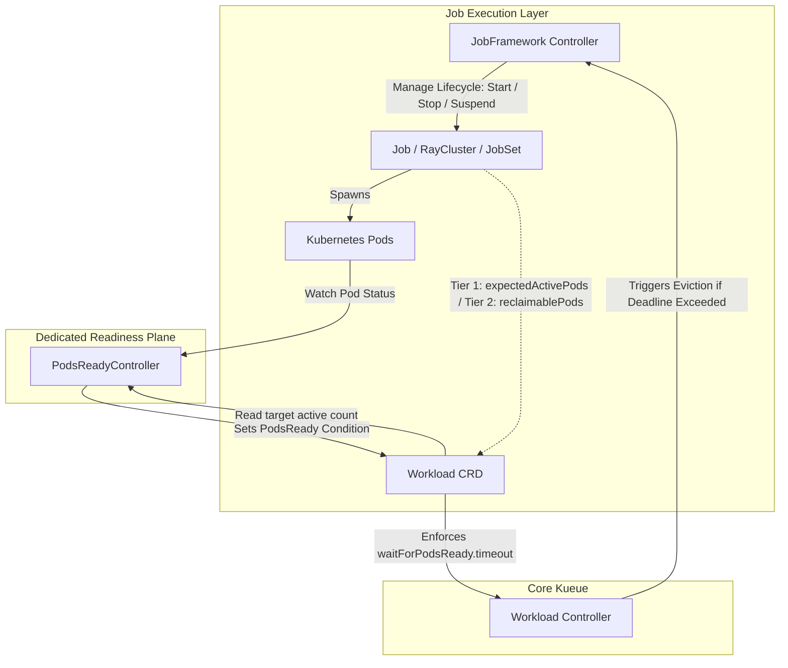

# KEP-15404: Decouple WaitForPodsReady from JobFramework to a Dedicated Controller

<!-- toc -->
- [Summary](#summary)
- [Motivation](#motivation)
  - [Goals](#goals)
  - [Non-Goals](#non-goals)
- [Proposal](#proposal)
  - [User Stories](#user-stories)
    - [Story 1: Third-Party Framework Integration](#story-1-third-party-framework-integration)
    - [Story 2: Custom / Third-Party Frameworks with Early Pod Completion](#story-2-custom--third-party-frameworks-with-early-pod-completion)
    - [Story 3: Reduction of API Write Conflicts](#story-3-reduction-of-api-write-conflicts)
    - [Story 4: Unlocking Partial Readiness Thresholds for Resilient Large-Scale Training](#story-4-unlocking-partial-readiness-thresholds-for-resilient-large-scale-training)
  - [Risks and Mitigations](#risks-and-mitigations)
- [Design Details](#design-details)
  - [Dedicated Controller Architecture](#dedicated-controller-architecture)
    - [Informer-Level Label Selector Scoping (Watch Scale Protection)](#informer-level-label-selector-scoping-watch-scale-protection)
  - [Pod Observation, Indexing, and Labeling Matrix](#pod-observation-indexing-and-labeling-matrix)
    - [Pod Labeling Compatibility Matrix Across Integrations](#pod-labeling-compatibility-matrix-across-integrations)
  - [The API Contract: <code>workload.status.expectedActivePods</code>](#the-api-contract-workloadstatusexpectedactivepods)
    - [API Validation &amp; Webhook Rules](#api-validation--webhook-rules)
    - [Trust Boundary and Asymmetric Failure Analysis](#trust-boundary-and-asymmetric-failure-analysis)
    - [Lifecycle, Staleness, and Elastic Scaling Semantics](#lifecycle-staleness-and-elastic-scaling-semantics)
  - [Universal Pod Readiness Accounting Algorithm](#universal-pod-readiness-accounting-algorithm)
    - [Evaluation Flow per PodSet](#evaluation-flow-per-podset)
    - [Go-Style Accounting Logic](#go-style-accounting-logic)
    - [Handling Workload Archetypes](#handling-workload-archetypes)
  - [Readiness State Machine and Condition Transitions](#readiness-state-machine-and-condition-transitions)
    - [State Machine Parity &amp; Transition Triggers](#state-machine-parity--transition-triggers)
  - [Handling Event Ordering Races: Pod Deletion vs. Status Latency](#handling-event-ordering-races-pod-deletion-vs-status-latency)
    - [Explicit Recovery Debounce Configuration (<code>recoveryDebounce</code>)](#explicit-recovery-debounce-configuration-recoverydebounce)
    - [Operator Semantics &amp; Invariants:](#operator-semantics--invariants)
  - [Honest Kubernetes Condition Semantics (<code>LastTransitionTime</code>)](#honest-kubernetes-condition-semantics-lasttransitiontime)
    - [The Oscillation Loophole (Disclosed Alpha Limitation)](#the-oscillation-loophole-disclosed-alpha-limitation)
  - [Kubernetes Event Emission for Operators](#kubernetes-event-emission-for-operators)
    - [Event Hygiene and Noise Suppression:](#event-hygiene-and-noise-suppression)
    - [Operational Auditability for Reduced-Target Starts:](#operational-auditability-for-reduced-target-starts)
  - [Scope Phasing: Alpha Increment vs. Beta Refinement](#scope-phasing-alpha-increment-vs-beta-refinement)
  - [Refactoring and Decoupling JobFramework](#refactoring-and-decoupling-jobframework)
  - [Metric Emissions and Clean Single-Owner Model](#metric-emissions-and-clean-single-owner-model)
    - [Transition and Metric Integrity Guarantee:](#transition-and-metric-integrity-guarantee)
    - [Metric Continuity and In-Flight Observation Survival Across Failover:](#metric-continuity-and-in-flight-observation-survival-across-failover)
    - [Flapping Recovery Metric Skew Prevention (Internal-Only Dwell Check)](#flapping-recovery-metric-skew-prevention-internal-only-dwell-check)
  - [API Changes and Feature Gate](#api-changes-and-feature-gate)
    - [Target API Surfaces: <code>v1beta1</code> and <code>v1beta2</code>](#target-api-surfaces-v1beta1-and-v1beta2)
    - [Configuration API Changes (<code>apis/config/v1beta2</code>)](#configuration-api-changes-apisconfigv1beta2)
    - [Feature Gate Enforcement &amp; Field Handling on Gate-Disabled](#feature-gate-enforcement--field-handling-on-gate-disabled)
- [Security Considerations](#security-considerations)
  - [RBAC and Blast Radius Analysis](#rbac-and-blast-radius-analysis)
- [Upgrade / Downgrade &amp; Backwards Compatibility Strategy](#upgrade--downgrade--backwards-compatibility-strategy)
  - [Upgrade Path (Feature Gate: false -&gt; true)](#upgrade-path-feature-gate-false---true)
  - [Downgrade Path (Feature Gate: true -&gt; false)](#downgrade-path-feature-gate-true---false)
- [Test Plan](#test-plan)
  - [Unit Tests](#unit-tests)
  - [Integration Tests](#integration-tests)
- [Graduation Criteria](#graduation-criteria)
    - [Alpha](#alpha)
    - [Beta](#beta)
    - [GA](#ga)
- [Implementation History](#implementation-history)
- [Drawbacks](#drawbacks)
- [Alternatives Considered](#alternatives-considered)
  - [Alternative 1: In-Memory / Stateful Controller Tracking of Terminated Pods](#alternative-1-in-memory--stateful-controller-tracking-of-terminated-pods)
  - [Alternative 2: Exclusively Relying on reclaimablePods Without an Active Count Contract](#alternative-2-exclusively-relying-on-reclaimablepods-without-an-active-count-contract)
  - [Alternative 3: Cumulative Deficit Status Accounting (Phase 2 Consideration)](#alternative-3-cumulative-deficit-status-accounting-phase-2-consideration)
  - [Alternative 4: In-Controller Pod Corroboration Safeguards (Phase 2 Consideration)](#alternative-4-in-controller-pod-corroboration-safeguards-phase-2-consideration)
<!-- /toc -->

## Summary

Decouple the `WaitForPodsReady` observation, condition evaluation, and metric generation
logic from the `JobFramework` reconciler into a dedicated controller (`PodsReadyController`).

Currently, the `JobFramework` reconciler handles both job lifecycle management
(suspend, unsuspend, stop on eviction) and pod readiness tracking (calling `job.PodsReady()`).
By extracting pod readiness observation into a dedicated controller that watches
core Kubernetes `Pod` objects directly, we achieve strict Separation of Concerns (SoC)
and dramatically simplify the implementation requirements for third-party and
external framework integrations.

To address the challenge where completed pods are garbage-collected mid-execution
across diverse frameworks, this proposal introduces an explicit `workload.status.expectedActivePods`
contract alongside existing `workload.status.reclaimablePods` accounting. This ensures that
workloads with partial or non-gang completion semantics do not suffer from false missing-pod
regressions when monitored by a pure pod-watching controller.

## Motivation

Kueue's `JobFramework` reconciler has grown into an all-in-one controller managing
both job-level admission lifecycle and pod-level readiness checks. This architecture
has several drawbacks:

1. **Tight Coupling & Architectural Complexity**: `JobFramework` must reconcile
   both high-level Job CRDs and coordinate pod readiness condition updates,
   increasing reconcile complexity and potential for lock contention.
2. **High Barrier for Third-Party Frameworks**: Any custom or external job framework
   integrating with Kueue is forced to implement `PodsReady()` and understand
   Kueue's internal readiness state machine.
3. **Unbounded Status Lag & Divergent Semantics**: Custom CRD status fields often lag behind
   physical pod readiness by unpredictable intervals (hundreds of milliseconds to multiple minutes
   depending on each external operator's reconcile loop), leading to timing discrepancies,
   inconsistent timeout behaviors, and premature evictions across frameworks. Replacing this
   opaque, framework-dependent lag with direct pod observation and a bounded, uniform,
   Kueue-controlled hysteresis provides deterministic readiness evaluation.
4. **Architectural Precedents**: Kueue has already successfully decoupled specialized
   concerns into dedicated controllers such as `TopologyUngater`, `ElasticJobUngater`,
   and `UnscheduledPodsTracker` (KEP-13502). Decoupling `WaitForPodsReady` brings
   readiness tracking into alignment with this modern controller architecture.
5. **The Garbage-Collection Dilemma**: When pods complete and are garbage-collected by
   Kubernetes (`PodGC`), a controller watching only live `Pod` objects cannot determine
   whether fewer live pods means the workload is failing or if pods simply succeeded and
   exited. A formal contract on `Workload.status` is required to decouple readiness
   tracking from framework-specific status polling.

### Goals

- Decouple `WaitForPodsReady` condition generation and metric reporting from
  `JobFramework` into a dedicated controller.
- Watch Kubernetes `Pod` objects directly to determine workload readiness.
- Eliminate the requirement for custom framework adapters to implement `PodsReady()`.
- Introduce an explicit `workload.status.expectedActivePods` field allowing any
  framework to communicate its expected active pod count without implementing quota reclamation.
- Maintain seamless backward compatibility for workloads utilizing `reclaimablePods`
  or running static gang-scheduled pods.
- Provide a safe transition path via a feature gate (`DecoupledWaitForPodsReady`).

### Non-Goals

- Modifying the core countdown mechanics or duration parameters of `waitForPodsReady.timeout` or `recoveryTimeout`. While debounced readiness loss introduces a bounded hysteresis window before entering `WaitForRecovery` (to absorb asynchronous pod deletion vs. status update races), the countdown clocks themselves run unmodified once activated.
- In-controller pod corroboration against live or persisted completion state: `PodsReadyController` does not verify whether `expectedActivePods < ps.count` corresponds to genuine pod completions during Alpha; verifying completed pods and caller authorization is deferred to Phase 2 (see [Alternative 4](#alternative-4-in-controller-pod-corroboration-safeguards-phase-2-consideration)).
- Replacing `reclaimablePods` for quota management (this KEP only uses it as a readiness fallback).
- Changing kube-scheduler behavior.

## Proposal

We propose creating a dedicated controller (tentatively named `PodsReadyController`)
that directly observes `Pod` events and updates the `Workload` status condition
`PodsReady` accordingly.

The `JobFramework` reconciler will be relieved of its responsibility to evaluate
`PodsReady()` and update the `WorkloadPodsReady` condition.



### User Stories

#### Story 1: Third-Party Framework Integration
As a developer integrating an external or proprietary batch/AI orchestrator with Kueue,
I want to only implement basic lifecycle controls (suspend/unsuspend/stop) without
writing custom pod status polling or readiness calculations. With this enhancement,
labeling our pods with `kueue.x-k8s.io/workload: <name>` automatically grants full
`WaitForPodsReady` capabilities out of the box.

#### Story 2: Custom / Third-Party Frameworks with Early Pod Completion
As an engineer maintaining a custom batch engine where pods complete sequentially and
get cleaned up by `PodGC`, I want my operator to tell Kueue how many active pods are
expected without forcing me to implement Kueue's quota reclamation system (`reclaimablePods`).
By writing `workload.status.expectedActivePods`, my job avoids premature evictions when
pods succeed and exit early.

#### Story 3: Reduction of API Write Conflicts
In large-scale clusters, multiple controllers frequently update the same `Workload`
resource simultaneously. By separating job admission status updates (owned by
`JobFramework`) from pod readiness conditions (owned by `PodsReadyController`),
we eliminate optimistic locking conflicts (`409 Conflict`) during workload startup.

#### Story 4: Unlocking Partial Readiness Thresholds for Resilient Large-Scale Training
As a platform administrator running large distributed AI training workloads spanning hundreds of GPU nodes, I want Kueue to tolerate a small number of transient node failures or delayed replacement pods without evicting the entire job (as requested in [#15423](https://github.com/kubernetes-sigs/kueue/issues/15423)).
Because third-party CRDs rarely expose granular ready pod counts in their status, decoupling pod observation into `PodsReadyController` provides the foundational controller architecture required to observe live ready pods and unlock per-workload threshold controls (such as `spec.podSets[].minRunningCount`) across all framework integrations.

### Risks and Mitigations

| Risk | Mitigation |
| :--- | :--- |
| **API Server Watch Overhead on Large Clusters**: Watching all `Pod` objects cluster-wide could increase controller memory and CPU usage on clusters with tens of thousands of non-Kueue pods. | Solved via **Informer-Level Label Selector Scoping**: The controller manager configures the `corev1.Pod` cache using `cache.ByObject` with a label selector requirement checking for the existence of `kueue.x-k8s.io/workload` (`selection.Exists`). Non-Kueue pods (daemonsets, control-plane pods, unmanaged user workloads) are completely excluded from the informer cache, bounding memory footprint strictly to Kueue-managed pods without requiring an additional synthetic management label. Early synthetic benchmarks measuring informer cache delta under heavy churn (5k–50k pods) are required as part of **Alpha exit criteria**. |
| **Garbage-Collected Pods Causing Regressions**: Frameworks with early pod completion could appear to have missing pods if they do not implement `reclaimablePods`. | Solved via `workload.status.expectedActivePods`. If unset, the controller falls back to `TotalExpectedPods - reclaimablePods`. Frameworks with custom early-exit semantics set this field to declare their active target. |
| **Trust Boundary: Buggy or Under-Reported `expectedActivePods`**: An external framework could write a count lower than its true gang requirement, falsely triggering early readiness and tying up GPU quota without timeout protection. | **Accepted Alpha Trust Boundary with Audit Logging**: Guarded by RBAC subresource isolation and admission bounds validation ($0 \le \text{count} \le ps.\text{count}$). Alpha accepts this trust gap without runtime corroboration, emitting a `Normal WorkloadStartedWithReducedTarget` event for operator visibility (see [Operational Auditability](#operational-auditability-for-reduced-target-starts) and [Alternative 4](#alternative-4-in-controller-pod-corroboration-safeguards-phase-2-consideration)). |
| **Race Condition: Pod Deletion vs. Status Update Latency**: A pod may be deleted by `PodGC`/TTL controller before the job controller updates `reclaimablePods` or `expectedActivePods`, causing a momentary under-count. | Mitigated via an explicit, operator-configurable **Recovery Debounce** (`recoveryDebounce: 5s`), defensively bounded relative to `recoveryTimeout` ($\min(\text{configured}, \text{recoveryTimeout}/2)$) and strictly validated at manager startup (`recoveryDebounce < recoveryTimeout`). Readiness loss waits out this bounded hysteresis delay before transitioning to `WaitForRecovery`. Furthermore, `PodsReadyController` watches `Workload` status updates, resolving the count immediately once the job controller syncs. |
| **Eviction Evasion via Oscillation Loophole (Accepted Alpha Limitation)**: Workloads undergoing periodic crashlooping can blink healthy for brief intervals, resetting `condition.LastTransitionTime` on every recovery. Because `WorkloadController` evaluates eviction strictly as `clock.Since(LastTransitionTime) > recoveryTimeout` within the single current `WaitForRecovery` episode, non-contiguous deficit time does not accumulate. Consequently, an oscillating workload can evade `recoveryTimeout` indefinitely while holding onto scarce accelerator quota. | **Accepted Alpha Limitation**: Workloads whose readiness flips with an interval just under `recoveryTimeout`—whether from container crashloops or non-container causes (node pressure, probe toggling) unbounded by Kubelet backoff—reset the recovery clock and evade eviction during Alpha. Mitigated by maintaining honest `LastTransitionTime`; typed cumulative-deficit accounting is deferred to Beta (see [The Oscillation Loophole](#the-oscillation-loophole-disclosed-alpha-limitation) and [Alternative 3](#alternative-3-cumulative-deficit-status-accounting-phase-2-consideration)). |
| **Worst-Case Compounding of Accepted Alpha Limitations**: An authorized-but-buggy integration controller could both under-report startup counts (bypassing startup timeout) and have its surviving pods periodically flap (evading recovery timeout via the oscillation loophole), indefinitely tying up quota. | **Acknowledged Worst-Case Boundary**: This pathological scenario requires the same integration controller to suffer from two independent failure modes simultaneously (buggy startup target reporting and failure to reconcile flapping pods). Acknowledging this compound failure mode reinforces the motivation for Phase 2's joint evaluation of cumulative deficit tracking and in-controller corroboration safeguards once real-world Alpha telemetry is gathered. |
| **Condition-Write Amplification During Rapid Flapping**: Unstable workloads oscillating between ready and unready could generate excessive status write churn to etcd. | Mitigated via **Explicit Debounce Hysteresis and Physical Transition Bounds**: Debounce suppresses condition writes for transient failures lasting less than `recoveryDebounce`. Condition transitions in both directions write honest `LastTransitionTime = clock.Now()` values immediately, bounded by physical pod transition frequency (~2 writes/sec worst-case). Kubelet exponential CrashLoopBackOff (10s–300s) quickly damps physical flapping after 1–2 cycles. Scale benchmarks with 50 concurrently oscillating workloads are required for Alpha. |
| **Metric Skew During Flapping Recoveries**: Workloads rapidly toggling between `WaitForRecovery` and `Recovered` could emit multiple `kueue_workload_recovery_wait_time_seconds` observations per incident, distorting recovery latency histograms toward artificial sub-second durations. | Solved via **Internal-Only Metric Stabilization Dwell in `PodsReadyController`**: While the `Recovered` condition is published to etcd immediately (guaranteeing zero false evictions), `PodsReadyController` holds histogram emission for an in-memory dwell period (`effectiveRecoveryDebounce`). If the workload drops back into unreadiness before stabilizing, the metric emission is withheld, coalescing the entire flapping episode into a single authentic recovery wait-time observation upon sustained recovery. |
| **Regression in Existing Integrations**: Disabling `PodsReady()` in `JobFramework` could break existing behavioral nuances. | The feature will be introduced behind the `DecoupledWaitForPodsReady` feature gate (Alpha, disabled by default) with comprehensive integration test coverage across all existing integrations. |

## Design Details

### Dedicated Controller Architecture

The dedicated `PodsReadyController` will:
1. Run as a managed controller inside the Kueue manager.
2. Watch `Pod` resources across all namespaces where Kueue manages workloads.
3. Watch `Workload` resources to react to admission changes, `expectedActivePods` updates, and quota reclamation events.
4. Emit standard Kubernetes Events on `Workload` resources to provide operators with transparent audit logs in `kubectl describe workload`.

```go
type PodsReadyController struct {
    client.Client
    recorder record.EventRecorder
    clock    clock.Clock
    // shared workload-to-pod indexer
}
```

#### Informer-Level Label Selector Scoping (Watch Scale Protection)
Watching all `Pod` resources cluster-wide without filtering would introduce substantial memory and CPU overhead on large multi-tenant clusters where Kueue only manages a fraction of the total cluster pods.

To strictly bound cache memory:
* `PodsReadyController` configures its `controller-runtime` cache with an informer-level label selector using `cache.ByObject` scoped to the existence of the `kueue.x-k8s.io/workload` label:
  ```go
  workloadReq, err := labels.NewRequirement(
      "kueue.x-k8s.io/workload",
      selection.Exists,
      nil,
  )
  if err != nil {
      return err
  }

  mgrOptions := ctrl.Options{
      Cache: cache.Options{
          ByObject: map[client.Object]cache.ByObject{
              &corev1.Pod{}: {
                  LabelSelector: labels.NewSelector().Add(*workloadReq),
              },
          },
      },
  }
  ```
* **Seamless Compatibility**: Because `kueue.x-k8s.io/workload` is already injected across all built-in integrations in the Pod Labeling Compatibility Matrix (and required for third-party integrations), filtering by its existence ensures 100% coverage of managed workload pods without requiring an extra, redundant `managed` label.
* Pods lacking the `kueue.x-k8s.io/workload` label (e.g. system daemons, ingress controllers, unmanaged user pods) are filtered out at the API server watch layer and never deserialized or cached in controller-runtime memory.

### Pod Observation, Indexing, and Labeling Matrix

To avoid full cluster scans on every reconcile:
* The controller registers a field indexer on `Pod` objects for `spec.workloadName`
  (derived from the `kueue.x-k8s.io/workload` label).
* When a Pod changes status (e.g. `PodConditionReady` transitions to `True` or `False`),
  the controller enqueues a reconcile request for the parent `Workload`.

#### Pod Labeling Compatibility Matrix Across Integrations
To enable direct pod indexing and multi-PodSet grouping, managed pods require two standard labels:
1. `kueue.x-k8s.io/workload: <workload-name>`: Identifies the parent workload.
2. `kueue.x-k8s.io/podset: <podset-name>` (`constants.PodSetLabel`): Identifies the specific PodSet.

The following matrix documents how existing and future integrations establish these labels:

| Framework Integration | Injected Labels | Injection Mechanism | Pre-Upgrade / Migration Handling |
| :--- | :--- | :--- | :--- |
| **`batch/v1.Job`** | `kueue.x-k8s.io/workload`<br>`kueue.x-k8s.io/podset` | Injected into Job `spec.template.metadata.labels` upon admission / unsuspend in `jobframework.Reconciler`. | Workloads running prior to upgrade continue under legacy `JobFramework.PodsReady()` or fallback until completed; newly started jobs receive labels. |
| **`jobset.x-k8s.io/JobSet`** | `kueue.x-k8s.io/workload`<br>`kueue.x-k8s.io/podset` | Injected into each ReplicatedJob `template.spec.template.metadata.labels`. | Existing running JobSets run to completion; newly admitted JobSets receive both labels on start. |
| **`ray.io/RayCluster`** | `kueue.x-k8s.io/workload`<br>`kueue.x-k8s.io/podset` | Injected into `headGroupSpec` (`head`) and `workerGroupSpecs` (`workers`). | Running clusters continue under existing admission cycle; new admissions receive labels. |
| **`kubeflow.org` (TFJob, PyTorchJob)** | `kueue.x-k8s.io/workload`<br>`kueue.x-k8s.io/podset` | Injected into replica specifications on admission. | Same as Job/JobSet. |
| **Plain `Pod` Group** | `kueue.x-k8s.io/workload`<br>`kueue.x-k8s.io/podset` | Managed directly by Kueue's existing `pod_controller`. | Already stamped by existing pod controller logic. |
| **Third-Party / Custom Frameworks** | `kueue.x-k8s.io/workload`<br>`kueue.x-k8s.io/podset` | Applied by framework operator to pod templates before launching. | Out-of-the-box readiness tracking without writing custom Go adapters. |

### The API Contract: `workload.status.expectedActivePods`

To establish a clear contract between job frameworks and the dedicated readiness controller,
we introduce an optional field to `WorkloadStatus`:

```go
type WorkloadStatus struct {
    // ... existing fields (Conditions, Admission, ReclaimablePods) ...

    // ExpectedActivePods indicates the number of pods within each podset that
    // are currently expected to be active.
    //
    // If not set, the readiness controller computes the expected active count
    // as: (podSet.count - reclaimablePods.count).
    //
    // +optional
    // +listType=map
    // +listMapKey=name
    ExpectedActivePods []ExpectedActivePod `json:"expectedActivePods,omitempty"`
}

type ExpectedActivePod struct {
    // Name is the name of the PodSet.
    Name kueue.PodSetReference `json:"name"`

    // Count is the number of pods expected to be active in this PodSet.
    // Must be greater than or equal to 0.
    // +kubebuilder:validation:Minimum=0
    Count int32 `json:"count"`
}
```

#### API Validation & Webhook Rules

To maintain schema and invariant integrity, `workload.status.expectedActivePods` is guarded by both CRD validation rules and the Kueue admission webhook (`pkg/webhooks/workload_webhook.go`):

1. **Non-Negativity (CEL)**: `count` must be $\ge 0$ (enforced via OpenAPI / CEL `+kubebuilder:validation:Minimum=0`).
2. **PodSet Existence**: Every `name` in `expectedActivePods` must correspond to a declared `PodSet` in `workload.spec.podSets`.
3. **Upper Bound Constraint**: For each PodSet $ps$, `expectedActivePods[ps.name].count` must not exceed `ps.count` (`count <= ps.count`). An attempt to report an expected count higher than the workload's admitted size is rejected by the webhook.
4. **Key Uniqueness**: `expectedActivePods` is a map-list keyed on `name`; duplicate entries for the same `PodSetReference` are rejected.

#### Trust Boundary and Asymmetric Failure Analysis

`workload.status.expectedActivePods` represents a framework-writable trust boundary. In Kubernetes architecture, `Workload.status` is a protected subresource restricted via RBAC to Kueue and cluster-authorized integration controllers. Standard tenant users submitting jobs or workloads only have write permissions to `workloads` (spec) and cannot set or mutate status fields.

The two failure directions carry distinct operational consequences:

* **Over-Reporting (`count` set too high or left stale after scale-down)**:
  If a framework fails to scale down `count` or sets it too high, `LiveReady >= TargetActive` will not be satisfied. The workload remains in `WaitForStart` and eventually trips `waitForPodsReady.timeout`. This failure mode **fails closed/safe**: it behaves identically to an unresponsive or stalled workload, triggering standard Kueue eviction rather than leaving broken state running.
* **Under-Reporting (`count` set lower than true application gang requirement)**:
  If an authorized framework reports `count: 1` on startup for an 8-pod distributed training gang job, `PodsReadyController` evaluates `1 >= 1` as soon as the first pod initializes and transitions the workload to `WorkloadStarted = True`.
  * **Blast Radius & Practical Exposure**:
    Unlike `reclaimablePods` (which strictly affects quota release), prematurely marking a gang workload as `Started` halts Kueue's startup timeout countdown. If remaining gang pods fail to schedule or start, the partial gang could occupy expensive GPU nodes indefinitely without startup timeout enforcement.
    
    Crucially, in real-world Kubernetes deployments, RBAC permissions for `workloads/status` are typically granted broadly to all installed integration controllers (e.g. training operators, workflow engines) rather than scoped to individual workloads. An authorized-but-buggy third-party integration controller could therefore trivially force `Started = True` on a partial gang with an under-reported status write, completely disabling Kueue's gang startup protection across workloads.
  * **Alpha Trust Boundary Alignment and Audit Visibility**:
    For Alpha, `expectedActivePods` applies the same enforcement baseline as `reclaimablePods`—RBAC subresource isolation and admission bounds validation ($0 \le \text{count} \le ps.\text{count}$)—to a field with this larger blast radius, representing an explicitly accepted Alpha trade-off to maintain scope discipline.
    
    To address this practical trust gap without introducing premature runtime corroboration complexity:
    1. **RBAC Subresource Isolation**: Tenants cannot write to `status`. Only cluster-trusted framework controllers possessing RBAC status permissions can report expected active counts.
    2. **Webhook & CEL Bounds Validation**: The webhook strictly enforces $0 \le \text{count} \le ps.\text{count}$ and validates PodSet existence.
    3. **Operational Audit Event (`WorkloadStartedWithReducedTarget`)**: Emits a `Normal WorkloadStartedWithReducedTarget` audit event whenever a workload starts with $\text{TargetActivePods}(ps) < ps.\text{count}$, giving operators immediate visibility in event logs (see [Operational Auditability for Reduced-Target Starts](#operational-auditability-for-reduced-target-starts)).
    4. **Deferred In-Controller Corroboration**: Complex in-controller pod corroboration formulas ($\max(\text{ObservedCompleted}, \text{ReclaimablePods})$) and privileged capability bypass annotations (`kueue.x-k8s.io/allow-partial-gang-start`) are **deferred to Phase 2 (Beta follow-up)** alongside cumulative-deficit accounting. This maintains scope discipline for Alpha, ensuring the core GC race fix ships cleanly without introducing speculative cross-cutting authorization machinery ahead of production telemetry.

#### Lifecycle, Staleness, and Elastic Scaling Semantics

`workload.status.expectedActivePods` follows strict lifecycle and staleness mitigation rules across admission cycles and dynamic scaling:

1. **Ownership & Refresh Triggers**:
   `expectedActivePods` is owned exclusively by the managing framework adapter. It is updated whenever the framework reconciles changes in desired pod counts (e.g., initial launch, pod completion, or elastic re-configuration).
2. **Workload Re-Admission (Preemption $\rightarrow$ Re-Admission Cycle)**:
   When a workload is evicted or preempted (`Admitted = False`), all in-flight pods are terminated. Upon subsequent re-admission (`Admitted = True`), the workload starts a new scheduling cycle from scratch.
   * **Stale Count Invalidation via Admission Boundary Reset**: To prevent stale values from a prior partial run (e.g., `count: 2` left over after 6 pods had finished prior to preemption) from corrupting the new run, Kueue's core admission controller (`WorkloadController`) explicitly clears `workload.status.expectedActivePods = nil` whenever a workload transitions to un-admitted (`Admitted = False`). Upon subsequent re-admission (`Admitted = True`), the field is physically empty in etcd. Consequently, `PodsReadyController` observes an uninitialized `expectedActivePods` state and naturally evaluates the remaining fallback chain:
     1. If `reclaimablePods` is present (Level 2), the target active count resolves to $\max(ps.\text{count} - \text{reclaimablePods}[ps], 0)$, accurately accounting for pods that previously finished and released quota (e.g., in standard `batch/v1.Job`).
     2. If `reclaimablePods` is absent (Level 3, standard for all-or-nothing and gang ML workloads), the target active count defaults to the full declared size ($ps.\text{count}$), ensuring complete gang readiness is required until the managing framework explicitly publishes fresh active targets for the new execution.
   * **In-Memory Debounce & Deficit State Reset**: Any internal debounce tracking state (including `firstDeficitTime` and pending grace deadlines) is strictly scoped to the workload's current admission cycle (keyed by admission transition timestamp). On preemption or re-admission, all internal deficit timers are cleared, preventing deadlines computed against a prior run's pods from leaking into the new cycle.
3. **Elastic Scaling & Defensive Clamping**:
   When elastic scaling occurs (e.g., via `ElasticJobUngater` or Workload Slicing) and `spec.podSets[i].count` decreases (e.g., from 10 to 6), a framework could theoretically update the spec but omit or delay updating `expectedActivePods`.
   * **Defensive Clamping (Mirroring `LimitReclaimablePodsToPodSetSizes`)**: The accounting logic defensively clamps the target active count:
     $$\text{TargetActivePods}(ps) = \min(\text{expectedActivePods}[ps], ps.\text{count})$$
   * If `spec.podSets` shrinks to 6 while `expectedActivePods` remains at 10, the controller immediately clamps the target to 6. This guarantees that an elastic scale-down will **never cause false timeouts or deadlock** due to a stale target.

### Universal Pod Readiness Accounting Algorithm

In Kueue's data model, workloads frequently define multiple distinct `PodSets` (e.g., a `RayCluster` with a `head` podSet and a `workers` podSet, or a `JobSet` with a `driver` and multiple replicated jobs). Pods are explicitly indexed by their `kueue.x-k8s.io/podset` label (`constants.PodSetLabel`).

Evaluating readiness as an aggregate scalar sum would introduce an **ordering/composition hazard**: for instance, if a RayCluster's head pod failed (0 ready out of 1) but an autoscaler surge created 9 worker pods (out of 8), a global scalar sum ($0 + 9 \ge 9$) would falsely declare the cluster ready even though the head coordinator is completely unstarted.

Therefore, workload readiness is formally evaluated as a **conjunction ($\forall$) across all PodSets**:

$$\text{WorkloadReady} \iff \forall ps \in \text{workload.spec.podSets}, \quad \text{LiveReadyPods}(ps.\text{name}) \ge \text{TargetActivePods}(ps.\text{name})$$

Where for each individual PodSet $ps$:

$$\text{TargetActivePods}(ps.\text{name}) = \begin{cases} 
\min(\text{expectedActivePods}[ps.\text{name}], ps.\text{count}), & \text{if } \text{status.expectedActivePods}[ps.\text{name}] \text{ is set} \\
\max(ps.\text{count} - \text{reclaimablePods}[ps.\text{name}], 0), & \text{else if } \text{status.reclaimablePods}[ps.\text{name}] \text{ is set} \\
ps.\text{count}, & \text{otherwise}
\end{cases}$$

#### Evaluation Flow per PodSet

```
                                 For each PodSet ps:
                                         |
               +----------------------------------------------------+
               | Is status.expectedActivePods[ps.name] specified?   |
               +----------------------------------------------------+
                                 /            \
                              Yes              No
                              /                  \
         Target = expectedActivePods[ps.name]  +----------------------------------------------------+
                                               | Is status.reclaimablePods[ps.name] specified?      |
                                               +----------------------------------------------------+
                                                             /         \
                                                          Yes           No
                                                          /               \
                                    Target = ps.count - Reclaimable    Target = ps.count
```

#### Go-Style Accounting Logic

```go
func (r *PodsReadyController) isWorkloadReady(wl *kueue.Workload, pods []*corev1.Pod) bool {
    // Group live ready pods by their kueue.x-k8s.io/podset label
    liveReadyByPodSet := countLiveReadyPodsByPodSet(pods)

    for _, ps := range wl.Spec.PodSets {
        target := getTargetActiveCountForPodSet(wl, ps)
        liveReady := liveReadyByPodSet[ps.Name]

        // If even ONE podset fails to reach its target, the workload is not ready
        if liveReady < target {
            return false
        }
    }
    return true
}

func getTargetActiveCountForPodSet(wl *kueue.Workload, ps kueue.PodSet) int32 {
    // 1. If expectedActivePods is provided, clamp defensively to ps.Count
    if exp, found := findExpectedActivePod(wl.Status.ExpectedActivePods, ps.Name); found {
        return min(exp.Count, ps.Count)
    }
    // 2. Fallback to reclaimablePods
    if rec, found := findReclaimablePod(wl.Status.ReclaimablePods, ps.Name); found {
        return max(ps.Count - rec.Count, 0)
    }
    // 3. Fallback to full spec podSet count
    return ps.Count
}
```

#### Handling Workload Archetypes

1. **All-or-Nothing / Gang ML Jobs (Ray, PyTorch, JobSet, Kubeflow)**:
   All podSets must satisfy their respective counts simultaneously throughout execution.
   * `expectedActivePods`: Not set.
   * `reclaimablePods`: Not set ($0$).
   * For every PodSet: $\text{Target}(ps) = ps.\text{count}$.
   * **Result**: Prevents false readiness (e.g. surplus workers masking an unready head pod).
2. **Standard Kubernetes Batch Jobs (`batch/v1.Job`)**:
   Single `main` PodSet. When pods finish and release quota, `batch/v1` populates `workload.status.reclaimablePods[main]`.
   * `expectedActivePods`: Not set.
   * `reclaimablePods`: Populated dynamically (e.g. $1$).
   * $\text{Target}(\text{main}) = ps.\text{count} - 1$.
   * **Result**: Fully backward compatible with KEP-78.
3. **Custom Third-Party Frameworks with Early Pod Completion**:
   A custom framework whose pods finish early without releasing quota.
   * `expectedActivePods`: Set directly per PodSet by the framework (e.g. `workers`: $8$).
   * $\text{Target}(ps) = \text{expectedActivePods}[ps]$.
   * **Result**: Fine-grained per-podSet accounting without false evictions.

### Readiness State Machine and Condition Transitions

The controller maintains the existing condition state machine for `WorkloadPodsReady`:

```
                     +---------------------------------------+
                     | Admitted = False                      |
                     | (Reason: WaitForStart, False)         |
                     +---------------------------------------+
                                 |
                    Workload Admitted = True
                                 v
                     +---------------------------------------+
                     | Pods booting                          |
                     | (Reason: WaitForStart, False)         |
                     +---------------------------------------+
                                 |
                    LiveReady >= TargetActive
                                 v
                     +---------------------------------------+ <--------------------+
                     | All Pods Ready                        |                      |
                     | (Reason: Started | Recovered, True)   |                      |
                     +---------------------------------------+                      |
                                 |                                                  |
              Deficit detected & debounce expires                                   |
                                 v                                                  |
                     +---------------------------------------+                      |
                     | Pod recovering                        |                      |
                     | (Reason: WaitForRecovery, False)      |                      |
                     +---------------------------------------+                      |
                                 |                                                  |
                                 +--- LiveReady >= TargetActive --------------------+
                                      (Reason: WorkloadRecovered, Status: True)
```

#### State Machine Parity & Transition Triggers
All condition reasons depicted above are **existing API constants** defined in `apis/kueue/v1beta1/workload_types.go` (and `v1beta2`):
* `kueue.WorkloadWaitForStart` (`"WaitForStart"`): Initial state upon admission prior to achieving full readiness.
* `kueue.WorkloadStarted` (`"Started"`): All expected pods across all podSets have successfully reached readiness for the first time.
* `kueue.WorkloadWaitForRecovery` (`"WaitForRecovery"`): An admitted workload in `Started` or `Recovered` lost readiness, and the deficit persisted past the operator-configured `recoveryDebounce` window. This condition activates Kueue's `recoveryTimeout` clock.
* `kueue.WorkloadRecovered` (`"Recovered"`): An admitted workload currently in `WaitForRecovery` has restored live ready pods to $\ge \text{TargetActivePods}$ across all podSets.

The dedicated controller introduces zero new condition reason strings, preserving complete semantic and behavioral parity with legacy `JobFramework`.

### Handling Event Ordering Races: Pod Deletion vs. Status Latency

Because `Pod` deletion (driven asynchronously by the Kubernetes TTL or PodGC controller)
and `Workload` status updates (driven by the job controller updating `reclaimablePods` or
`expectedActivePods`) operate on separate watch event streams, an event ordering hazard exists:

1. A pod completes successfully and is deleted by the API server.
2. `PodsReadyController` receives the pod `DeleteEvent` immediately via the Pod informer.
3. The job controller has not yet completed its reconcile loop to increment
   `reclaimablePods` or decrement `expectedActivePods`.
4. In this brief transient window (typically sub-second to a few seconds), the live ready
   pod count is momentarily less than the target active count.

#### Explicit Recovery Debounce Configuration (`recoveryDebounce`)

To prevent condition flapping and premature eviction races during this transient window, the controller introduces an explicit, operator-configurable **Recovery Debounce** in `KueueConfiguration` (`WaitForPodsReady.RecoveryDebounce`):

```go
type WaitForPodsReady struct {
    // ... existing fields (Timeout, BlockAdmission, RecoveryTimeout) ...

    // RecoveryDebounce is the duration that pod readiness must remain missing
    // before transitioning an admitted workload from Started/Recovered to WaitForRecovery,
    // preventing transient container restarts or PodGC races from triggering premature recovery timeouts.
    //
    // Defaults to 5s. Defensively clamped at runtime to min(configured, recoveryTimeout/2).
    // An omitted recoveryTimeout defaults to Timeout. If recoveryTimeout is explicitly set to 0 (disabled), recoveryDebounce is also disabled (0s).
    // Must be strictly less than recoveryTimeout if recoveryTimeout is greater than 0.
    // +optional
    RecoveryDebounce *metav1.Duration `json:"recoveryDebounce,omitempty"`
}
```

#### Operator Semantics & Invariants:
1. **Configurable & Transparent with Defensive Bounding**: While `recoveryDebounce` is an explicit, independently tunable configuration knob (default `5s`), the runtime controller defensively bounds the effective debounce window relative to `recoveryTimeout`:
   $$\text{EffectiveRecoveryDebounce} = \begin{cases}
   0, & \text{if } \text{recoveryTimeout} = 0 \\
   \min(\text{configuredDebounce}, \frac{\text{recoveryTimeout}}{2}), & \text{if } \text{recoveryTimeout} > 0
   \end{cases}$$
   This guarantees that on clusters with aggressive recovery requirements (e.g. `recoveryTimeout: 2s`), a default 5s debounce can never dominate or dwarf the operator's recovery window; the effective debounce is automatically clamped to 1s.
2. **Configuration Validation (`pkg/config/validation.go`)**:
   Kueue configuration validation explicitly validates the relationship between durations:
   - `recoveryDebounce` must be non-negative ($\ge 0$).
   - When `recoveryTimeout > 0`, configuring `recoveryDebounce >= recoveryTimeout` is rejected at manager startup with `field.Invalid("must be less than waitForPodsReady.recoveryTimeout")`, surfacing the interaction cleanly to operators rather than silently absorbing it.
3. **Defaulting and Disabled on `recoveryTimeout = 0`**: In Kueue configuration defaulting (`defaults.go`), an omitted `recoveryTimeout` automatically defaults to `waitForPodsReady.timeout`, keeping recovery tracking and debounce active. `recoveryDebounce` is treated as `0` (disabled) only when an operator explicitly disables recovery tracking by setting `recoveryTimeout: 0` (or if `waitForPodsReady` is disabled entirely). Pod readiness losses do not transition to `WaitForRecovery` or trigger eviction countdowns when disabled.
4. **Strictly Asymmetric**: Startup readiness (`WaitForStart` $\rightarrow$ `Started`) has **zero delay**; readiness is asserted immediately the moment live pods reach target. The debounce delay applies *exclusively* to readiness loss (`Started`/`Recovered` $\rightarrow$ `WaitForRecovery`).
5. **Early Termination on Framework Status Sync**: The debounce timer is an upper bound. The moment a `Workload` status update arrives with reconciled `expectedActivePods` or `reclaimablePods`, the controller reconciles immediately, preserving `Started = True` without waiting out the remainder of the debounce duration.
6. **Workload-Level Deficit Deadline**: In multi-podSet workloads, deficit is evaluated as a conjunction. The moment any podSet drops below target, an internal timer begins. If pods across all podSets recover and maintain continuous readiness before the debounce window elapses, the deficit clears without any condition flip.

### Honest Kubernetes Condition Semantics (`LastTransitionTime`)

In strict compliance with Kubernetes API conventions for `metav1.Condition`, `condition.LastTransitionTime` is **always set to `metav1.Now()` (`clock.Now()`)** at the authentic wall-clock moment the condition transitions.

* **Zero Synthetic Timestamps**: The controller does not alter or manipulate `LastTransitionTime` with synthetic math. Downstream consumers (`kubectl describe`, monitoring dashboards, alert queries, and external controllers) always observe the genuine wall-clock time of the transition without distortion.
* **Unmodified `WorkloadController` Eviction Countdown**:
  `WorkloadController` (`pkg/controller/core/workload_controller.go`) continues to evaluate eviction using its standard level-triggered check:
  ```go
  case podsReadyCond.Reason == kueue.WorkloadWaitForRecovery && r.waitForPodsReady.recoveryTimeout != nil:
      elapsedTime := r.clock.Since(podsReadyCond.LastTransitionTime.Time)
      return kueue.WorkloadWaitForRecovery, max(*r.waitForPodsReady.recoveryTimeout-elapsedTime, 0)
  ```
* **Immediate Recovery Publication (Zero False Evictions)**:
  The moment live ready pods reach target readiness, `PodsReadyController` immediately publishes `Status = True, Reason = WorkloadRecovered` to `Workload.status` in etcd with `LastTransitionTime = metav1.Now()`. `WorkloadController` observes `Status = ConditionTrue` and instantly halts eviction, guaranteeing that healthy workloads are **never falsely evicted**.
#### The Oscillation Loophole (Disclosed Alpha Limitation)

Publishing `Recovered` immediately with authentic `LastTransitionTime = metav1.Now()` guarantees zero false evictions for recovering jobs. However, it reopens the eviction evasion loophole for crash-looping workloads: each transition to `Recovered` resets the eviction clock. If a failing workload repeatedly blinks ready for brief intervals before failing again, `clock.Since(LastTransitionTime)` in `WorkloadController` resets on every recovery, preventing non-contiguous deficit time from accumulating toward `recoveryTimeout`.

* **Mitigation Limits and Flapping Drivers**: Kubelet exponential `CrashLoopBackOff` (10s–300s) mitigates fast flapping driven by container crashes by rapidly widening crash intervals beyond typical short recovery timeouts ($< 300\text{s}$). Crucially, however, Kubelet backoff strictly governs container restarts; it provides **zero protection against flapping driven by other mechanisms** (e.g. node pressure evictions, external readiness/liveness probe manipulation, or operator rescheduling). Any workload whose readiness flips with an interval just under `recoveryTimeout`—regardless of whether that interval is 10s, 200s, or 10 minutes—can evade eviction indefinitely during Alpha.
* **Alpha Scope Rationale**: This is an explicitly accepted Alpha limitation chosen to maintain authentic Kubernetes API conventions rather than fabricating synthetic timestamps or altering `WorkloadController` prematurely. Real-world telemetry in Alpha will determine whether Beta requires an explicit status accumulator field (`workload.status.accumulatedDeficitSeconds`).

### Kubernetes Event Emission for Operators

To provide clear operational visibility in `kubectl describe workload` without requiring users to parse conditions or query Prometheus metrics, `PodsReadyController` emits standard Kubernetes Events.

#### Event Hygiene and Noise Suppression:
A critical design principle is that **transient, self-clearing dips do not emit Warning events**. For example, in a large `batch/v1.Job` with hundreds of sequentially completing pods, each pod deletion briefly creates a sub-second deficit while `reclaimablePods` syncs. Emitting a `Warning` event at the initial dip would flood `kubectl describe` with hundreds of spurious warnings for completely healthy execution, causing warning fatigue.

Therefore:
* The debounce window is **completely silent**: transient dips that self-resolve within `recoveryDebounce` emit zero events.
* A `Warning` event is emitted **only when the debounce window actually expires with an unrecovered deficit**, coinciding precisely with the transition to `Status: False, Reason: WaitForRecovery`.

| Event Reason | Event Type | Trigger Condition | Message Template |
| :--- | :--- | :--- | :--- |
| `WorkloadPodsReady` | `Normal` | All podSets reach target active readiness. | `"All %d expected pods across %d podsets are ready"` |
| `WorkloadStartedWithReducedTarget` | `Normal` | Transition to `Started` when $\text{TargetActivePods}(ps) < ps.\text{count}$ for at least one podSet. Fires once per affected podSet on the transition, citing each reduced podSet individually. | `"Workload marked Started with expectedActivePods (%d) < declared count (%d) for podset %s; gang startup timeout halted without live pod corroboration"` |
| `WorkloadWaitForRecovery`| `Warning` | Debounce window elapsed with unrecovered deficit; entering recovery timeout. | `"Workload failed to recover pod readiness within %s debounce window (%d/%d ready in podset %s); entered WaitForRecovery (recoveryTimeout %s)"` |
| `WorkloadRecovered` | `Normal` | Live pods restored target readiness after failure. | `"Workload recovered pod readiness (%d/%d ready)"` |

#### Operational Auditability for Reduced-Target Starts:
To provide immediate operational transparency into the uncorroborated Alpha trust boundary without adding complex webhook caller allowlists or in-controller corroboration formulas, `PodsReadyController` emits `WorkloadStartedWithReducedTarget` whenever a workload transitions to `Started = True` based on a reduced `expectedActivePods` target:
* **Per-Affected-PodSet Granularity**: If multiple podSets have reduced targets simultaneously upon achieving `Started` (e.g. both `head` and `workers`), `PodsReadyController` iterates through all affected podSets and emits one dedicated `Normal WorkloadStartedWithReducedTarget` event for each, citing that specific podSet's name and counts rather than stopping at the first offender or emitting an ambiguous aggregate.
* **Transition-Only Gating (Zero Reconcile Churn)**: The event fires strictly on the one-time state machine transition from `WaitForStart` to `Started = True`. It does **not** re-fire on subsequent reconciles while the workload remains in `Started`, adhering to Kueue's event hygiene standards.
* **Telemetry for Phase 2**: Cluster operators can immediately detect misconfigured or buggy integration controllers in event logs, and production telemetry gathered during Alpha directly quantifies how frequently reduced targets are utilized in real-world clusters, directly feeding the data-driven evaluation of whether Phase 2 corroboration is needed.

### Scope Phasing: Alpha Increment vs. Beta Refinement

To ensure that KEP-15404 delivers a focused, maintainable, and reviewable Alpha implementation:
* **Phase 1 (Alpha - This KEP)**:
  1. Decouple readiness evaluation from `JobFramework` into dedicated `PodsReadyController`.
  2. Implement the `workload.status.expectedActivePods` contract with CEL and webhook bounds validation ($0 \le \text{count} \le ps.\text{count}$).
  3. Scope the pod informer with a label selector (`kueue.x-k8s.io/workload` exists) to protect memory at scale.
  4. Enforce honest `LastTransitionTime = metav1.Now()`.
  5. Implement operator-configurable `recoveryDebounce` with sane defaults.
  6. Prevent metric skew during flapping recovery via internal stabilization dwell in `PodsReadyController`.
  7. Emit standard Kubernetes Events and single-owner metrics.
  8. **Disclose Known Alpha Limitations**: Eviction evasion for periodically oscillating crashloops and framework under-reporting trust boundary are explicitly documented as accepted Alpha trade-offs.
* **Phase 2 (Beta Follow-up)**:
  Real-world telemetry and multi-tenant operational experience will be collected during Alpha to evaluate:
  1. **Cumulative Deficit Status Accounting**: Introducing an explicit status accumulator field (`workload.status.accumulatedDeficitSeconds`) to close the eviction evasion loophole for crashlooping workloads.
  2. **Pod Corroboration Safeguards**: Evaluating whether external framework adapters warrant in-controller pod corroboration checks ($\max(\text{ObservedCompleted}, \text{ReclaimablePods})$) and privileged capability bypass annotations (`kueue.x-k8s.io/allow-partial-gang-start`) beyond standard RBAC and webhook bounds validation.

### Refactoring and Decoupling JobFramework

1. **Step 5 Bypass in `JobFramework`**:
   In `pkg/controller/jobframework/reconciler.go`, Step 5 (`generatePodsReadyCondition`)
   will be bypassed when `features.Enabled(features.DecoupledWaitForPodsReady)` is `true`.
2. **Interface Deprecation**:
   `PodsReady(ctx context.Context, c client.Client) bool` in `pkg/controller/jobframework/interface.go`
   will be marked as deprecated adhering to the Kubernetes Deprecation Policy:
   ```go
   // Deprecated: PodsReady will be removed when DecoupledWaitForPodsReady reaches
   // GA (targeted for v0.23+). Integrations should report
   // workload.status.expectedActivePods or rely on the dedicated PodsReadyController.
   PodsReady(ctx context.Context, c client.Client) bool
   ```
   The method remains functional throughout Alpha (v0.21) and Beta (v0.22) as the fallback mechanism when the feature gate is disabled, and is scheduled for strict code removal at GA (v0.23+).

### Metric Emissions and Clean Single-Owner Model

The dedicated controller will take over emission of the following pre-existing readiness metrics from `pkg/metrics`:
* **ClusterQueue Metrics**:
  * `kueue_ready_wait_time_seconds` (Histogram, exported via `metrics.QueuedUntilReadyWaitTime`: duration between workload creation or requeue until ready).
  * `kueue_admitted_until_ready_wait_time_seconds` (Histogram, exported via `metrics.AdmittedUntilReadyWaitTime`: duration between workload admission until ready).
  * `kueue_workload_recovery_wait_time_seconds` (Histogram, exported via `metrics.WorkloadRecoveryWaitTime`: duration between entering recovery until ready).
* **LocalQueue Metrics**:
  * `kueue_local_queue_ready_wait_time_seconds` (Histogram, exported via `metrics.LocalQueueQueuedUntilReadyWaitTime`).
  * `kueue_local_queue_admitted_until_ready_wait_time_seconds` (Histogram, exported via `metrics.LocalQueueAdmittedUntilReadyWaitTime`).
  * `kueue_local_queue_workload_recovery_wait_time_seconds` (Histogram, exported via `metrics.LocalQueueWorkloadRecoveryWaitTime`).

> [!NOTE]
> **Metric Naming & Pre-Existing Status**:
> All six metrics above already exist in Kueue today (`pkg/metrics/metrics.go`). Note that in Prometheus output, the queued-until-ready metric is named `kueue_ready_wait_time_seconds` (and `kueue_local_queue_ready_wait_time_seconds`), while its Go struct field in `pkg/metrics` is `QueuedUntilReadyWaitTime`. Similarly, `kueue_workload_recovery_wait_time_seconds` and `kueue_local_queue_workload_recovery_wait_time_seconds` are existing Kueue metrics emitted by `jobframework` when transitioning `WaitForRecovery` $\rightarrow$ `Recovered`. `PodsReadyController` introduces **zero new metrics**, maintaining exact metric names, label dimensions (`cluster_queue`, `local_queue`, `priority_class`, `replica_role`), and histogram buckets.

#### Transition and Metric Integrity Guarantee:
`DecoupledWaitForPodsReady` is a **binary, process-level controller-manager flag**, not a per-workload or per-queue toggle. Furthermore, Kueue runs in an active-passive configuration where only the elected leader executes reconciler loops and emits metrics:
* **When `DecoupledWaitForPodsReady=false`**: The legacy `JobFramework` emits the readiness metrics. `PodsReadyController` is not registered in the manager.
* **When `DecoupledWaitForPodsReady=true`**: `PodsReadyController` emits the readiness metrics. `JobFramework` Step 5 is completely bypassed and emits zero readiness metrics.
* **Rolling Deployments**: Since leader election guarantees at most one active reconciler process across the cluster, metrics are never double-counted, partitioned, or scraped simultaneously from two competing controllers during rollout.

#### Metric Continuity and In-Flight Observation Survival Across Failover:
A critical requirement for metrics parity (Beta graduation criterion) is ensuring that in-flight wait times are neither dropped nor re-started if Kueue fails over or rolls out while a workload is waiting for readiness.
* **Persisted Sources of Truth & Failover Scoping**:
  * `admittedUntilReadyWaitTime` and `queuedUntilReadyWaitTime`: Derived directly from permanent etcd timestamps (`wl.Status.Conditions[WorkloadAdmitted].LastTransitionTime`, `wl.CreationTimestamp`, or `WorkloadRequeued`) with **zero in-memory accumulator state in controller memory**, guaranteeing identical derivation across leader failover.
  * `recoveryWaitTime`: Measured from the authentic timestamp when the workload entered `WaitForRecovery` (`podsReadyCond.LastTransitionTime`) until sustained `Recovered` readiness is achieved. Because `LastTransitionTime` is persisted in etcd as an authentic `metav1.Time`, an incoming leader after failover reads the exact transition timestamp directly from etcd, ensuring uninterrupted continuity across leader elections.
* **Best-Effort Metric Continuity Across Failover (Startup Metrics)**: If a workload was admitted under the legacy controller and readiness is subsequently reached after failover to `PodsReadyController`, the incoming leader reads the persisted admission timestamp from etcd and computes the elapsed duration upon the `WorkloadStarted` state transition. Because etcd status updates and Prometheus observations are not transactional, failover during the precise instant of transition represents a standard best-effort metric handoff (at-most-once if the status write committed before failover, or at-least-once if re-reconciled), avoiding heavy transactional state in controller memory while providing continuous observation across leader elections.

#### Flapping Recovery Metric Skew Prevention (Internal-Only Dwell Check)

When an unstable workload crashloops or flaps rapidly (e.g., repeatedly failing and briefly recovering within seconds), publishing `Recovered` immediately to etcd prevents false evictions, but introduces a metric-skew risk: if `kueue_workload_recovery_wait_time_seconds` (and `kueue_local_queue_workload_recovery_wait_time_seconds`) were emitted on every brief blink to ready, a single flapping incident would record dozens of artificial sub-second observations, skewing the Prometheus histogram and inflating recovery event counts.

To eliminate metric skew cleanly without touching `WorkloadController` or delaying etcd condition publication:
1. **Immediate Condition Publication to etcd**:
   The moment live pods achieve target readiness, `PodsReadyController` publishes `WorkloadPodsReady = True, Reason = WorkloadRecovered` to `Workload.status` in etcd with `LastTransitionTime = clock.Now()`. `WorkloadController` observes this and halts eviction countdowns immediately, guaranteeing zero false evictions.
2. **Internal Stabilization Dwell for Metric Emission**:
   Metric emission is decoupled from the etcd status write and held in an internal-only in-memory dwell window:
   - When transitioning from `WaitForRecovery` to `Recovered`, `PodsReadyController` records the provisional recovery timestamp in memory and schedules a requeue after `metricStabilizationDwell` (configured to equal `effectiveRecoveryDebounce`, e.g. 5s).
   - **Sustained Recovery**: If the workload maintains continuous readiness across all podSets throughout the dwell window, `PodsReadyController` calls `metrics.ReportWorkloadRecoveryWaitTime` exactly once for the episode, measuring duration from the original entry into `WaitForRecovery` to the provisional recovery timestamp, and clears its in-memory tracking.
   - **Flapping Re-Deficit**: If the workload drops back into unreadiness *before* the dwell window elapses, the provisional recovery was an unstable blip:
     - No metric observation is emitted for the sub-second blip.
     - The original recovery start timestamp is retained in memory for the ongoing recovery episode.
     - Once the workload finally achieves sustained readiness, a single metric observation is emitted representing the true end-to-end recovery time.
3. **Resilience and Isolation**:
   - **Zero API Surface or Core Controller Impact**: This dwell mechanism lives 100% inside `PodsReadyController` solely for Prometheus reporting. It introduces zero new CRD fields, does not alter `LastTransitionTime`, and requires zero modifications to `WorkloadController`.
   - **Failover Tolerant**: If the Kueue leader manager restarts or fails over during an in-flight 5s dwell, in-memory state is cleared. At worst, a single recovery histogram observation for an oscillating workload is omitted—standard and harmless for Prometheus histograms.

### API Changes and Feature Gate

A new feature gate will be added to `pkg/features/kube_features.go`:
```go
DecoupledWaitForPodsReady featuregate.Feature = "DecoupledWaitForPodsReady"
```
* **Default**: `false` (Alpha in v0.21).

#### Target API Surfaces: `v1beta1` and `v1beta2`
In Kueue's CRD definition, `v1beta2` is the current storage version (`storage: true`), while `v1beta1` is deprecated and served for backwards compatibility. Both `apis/kueue/v1beta1/workload_types.go` and `apis/kueue/v1beta2/workload_types.go` (conversion Hub) add the new field to `WorkloadStatus`:

```go
type WorkloadStatus struct {
    // ...
    // +optional
    // +listType=map
    // +listMapKey=name
    ExpectedActivePods []ExpectedActivePod `json:"expectedActivePods,omitempty"`
}
```
* **Conversion Mechanics**: Because the struct definition, field names, and JSON tags are strictly identical between `v1beta1` and `v1beta2`, `k8s.io/code-generator`'s `conversion-gen` automatically produces lossless, bidirectional conversion functions in `zz_generated.conversion.go` (`Convert_v1beta1_WorkloadStatus_To_v1beta2_WorkloadStatus` and `Convert_v1beta2_WorkloadStatus_To_v1beta1_WorkloadStatus`). No custom conversion code is required.

#### Configuration API Changes (`apis/config/v1beta2`)

1. **Recovery Debounce (`WaitForPodsReady.RecoveryDebounce`)**:
   `KueueConfiguration` adds the explicit `RecoveryDebounce` knob to `WaitForPodsReady`:
   ```go
   type WaitForPodsReady struct {
       // RecoveryDebounce is the duration that pod readiness must remain missing
       // before transitioning from Started/Recovered to WaitForRecovery.
       // Defaults to 5s. Defensively clamped at runtime to min(configured, recoveryTimeout/2).
       // If recoveryTimeout is 0 or omitted, debounce is disabled (0s).
       // Must be strictly less than recoveryTimeout if recoveryTimeout > 0.
       // +optional
       RecoveryDebounce *metav1.Duration `json:"recoveryDebounce,omitempty"`
   }
   ```

* **Authoritative Defaulting Mechanism & Location**:
  `recoveryDebounce` is a pointer field (`*metav1.Duration`) whose default is applied in memory via Kubernetes Scheme-level ComponentConfig defaulting (`apis/config/v1beta2/defaults.go` via `SetDefaults_Configuration(cfg *Configuration)`), strictly adhering to the prior art established for `cfg.WaitForPodsReady.RecoveryTimeout`:
  ```go
  const DefaultWaitForPodsReadyRecoveryDebounce = 5 * time.Second

  if cfg.WaitForPodsReady != nil {
      cfg.WaitForPodsReady.RecoveryDebounce = cmp.Or(
          cfg.WaitForPodsReady.RecoveryDebounce,
          &metav1.Duration{Duration: DefaultWaitForPodsReadyRecoveryDebounce},
      )
  }
  ```
  - **Controller Runtime Nil-Fallback**: In `pkg/controller/core/podsready/podsready_controller.go`, if `RecoveryDebounce` is nil (e.g. when configurations are constructed programmatically in test suites without passing through Scheme defaulting), the controller applies a defensive fallback to `DefaultWaitForPodsReadyRecoveryDebounce` (5s).
  - **Downgrade & Persistence Implications**:
    `KueueConfiguration` is loaded from a ConfigMap mounted into the container at manager startup and decoded into memory; it is **never written back or mutated in etcd by an admission webhook**.
    Consequently, if an operator omits `recoveryDebounce` from their ConfigMap YAML, the manifest remains untouched (`kubectl get configmap` never shows synthetic values injected). On rollback or downgrade to an older Kueue release that lacks this field in its Go struct, the older manager decodes the ConfigMap cleanly without encountering unknown fields or schema conflicts.
* **Configuration Validation (`pkg/config/validation.go`)**:
  - `recoveryDebounce` must be non-negative ($\ge 0$).
  - If `recoveryTimeout > 0`, configuring `recoveryDebounce >= recoveryTimeout` is rejected with `field.Invalid`.

#### Feature Gate Enforcement & Field Handling on Gate-Disabled
Per Kubernetes API conventions for feature-gated status fields and ratcheting validation (KEP-1904):
1. **Gate Disabled (`DecoupledWaitForPodsReady=false`)**:
   - **Ratcheting Admission Webhook (`ValidateWorkloadUpdate`)**:
     To support downgrade and avoid breaking framework reconcilers that perform read-modify-write loops on `Workload.status`, the webhook applies **ratcheting validation**:
     - **Unchanged Stale Values Permitted**: If `newObj.Status.ExpectedActivePods` is semantically equal to `oldObj.Status.ExpectedActivePods`, the update is accepted. A downgraded cluster will not fail status updates for pre-existing workloads that carry previously written `expectedActivePods`.
     - **Mutation or New Introduction Rejected**: If the feature gate is disabled and a client attempts to mutate `expectedActivePods` (e.g. modifying counts or introducing entries on a workload where the field was previously empty), the webhook rejects the update with `field.Forbidden`.
     - **Field Clearing Permitted**: An update that clears `expectedActivePods` (`len(newObj.Status.ExpectedActivePods) == 0`) is permitted.
   - **Downgrade Persistence & Inert Data**: When the gate is disabled, legacy reconcilers ignore `expectedActivePods`, falling back entirely to `job.PodsReady()`. The persisted field remains inert until cleared or overwritten.
2. **Gate Enabled (`DecoupledWaitForPodsReady=true`)**:
   - The webhook permits mutations and new introductions conforming to standard bounds rules ($0 \le \text{count} \le ps.\text{count}$).

No new condition types or condition reasons are introduced. The dedicated controller emits the standard `WorkloadPodsReady` condition using existing API reasons (`kueue.WorkloadWaitForStart`, `kueue.WorkloadStarted`, `kueue.WorkloadWaitForRecovery`, `kueue.WorkloadRecovered`), guaranteeing zero breaking changes or schema drift for metrics and monitoring tools.

## Security Considerations

### RBAC and Blast Radius Analysis
`workload.status.expectedActivePods` is a sub-field of `Workload.status`. In Kubernetes RBAC, permissions are scoped to subresources (`workloads/status`) rather than individual struct fields.

* **Blast Radius Analysis**:
  Unlike `reclaimablePods` (which strictly affects quota reclamation), `expectedActivePods` directly gates the transition to `WorkloadStarted = True`. A compromised or buggy external framework writer that maliciously or accidentally under-reports expected active counts could cause Kueue to mark an incomplete gang workload as `Started = True`. This would halt startup timeout protection, leaving unstarted pods occupying cluster quota indefinitely.
* **Defense-in-Depth Protections for Alpha**:
  1. **RBAC Subresource Isolation**: Write access to `workloads/status` is strictly limited by Kubernetes RBAC to Kueue's own manager and authorized integration controller service accounts. Standard tenant users submitting workloads or jobs have access only to `workloads` (spec) and cannot mutate status fields directly.
  2. **Webhook & CEL Bounds Invariants**: The admission webhook rejects negative counts or counts greater than `ps.count`.
  3. **Alignment with Existing Kueue Protection Mechanisms**: This applies the same enforcement mechanism as `workload.status.reclaimablePods` (RBAC subresource isolation and admission bounds validation) to a field with a larger blast radius, representing an explicitly accepted Alpha trade-off that avoids speculative complexity.
  4. **Phase 2 In-Controller Safeguards**: Additional in-controller corroboration safeguards ($\max(\text{ObservedCompleted}, \text{ReclaimablePods})$) and framework capability opt-in annotations are deferred to Phase 2 alongside cumulative deficit accounting, ensuring Alpha remains lean and reviewable.

## Upgrade / Downgrade & Backwards Compatibility Strategy

### Upgrade Path (Feature Gate: false -> true)

1. **High Availability & Split-Brain Prevention**:
   Kueue operates with active-passive leader election. Only the elected leader manager executes reconciliation loops. During a rolling deployment, the newly elected leader running with `DecoupledWaitForPodsReady=true` takes over:
   - `JobFramework` Step 5 (`generatePodsReadyCondition`) is bypassed entirely.
   - `PodsReadyController` starts and claims sole responsibility for updating the `WorkloadPodsReady` condition.
   Because a single leader executes the reconcilers, there is no split-brain scenario where both controllers race to set the condition.
2. **In-Flight Workload Adoption**:
   For workloads admitted prior to the upgrade:
   - `PodsReadyController` reconstructs current readiness from live pods and `workload.status.expectedActivePods` / `reclaimablePods`.
   - Condition updates use `workload.SetConditionAndUpdate`, which checks semantic equality before writing. If an in-flight workload is already `PodsReady = True` (`WorkloadStarted`), the condition remains untouched and `LastTransitionTime` is preserved.
   - In-flight workloads experience zero condition flapping or false timeout evaluations.

### Downgrade Path (Feature Gate: true -> false)

1. **Reverting Controller Ownership**:
   If an operator disables the feature gate and restarts Kueue:
   - `PodsReadyController` is shut down and unregistered from the controller manager.
   - `JobFramework` re-enables Step 5 and resumes calling `job.PodsReady()`.
2. **Handling In-Flight Workloads on Rollback**:
   - `JobFramework` evaluates `job.PodsReady(ctx, client)` on its next reconcile. For all standard workloads, both paths evaluate to the same readiness state, resulting in a no-op update that preserves condition timestamps.
   - Any `workload.status.expectedActivePods` values stored in `Workload.status` remain inert and harmlessly ignored by the legacy controller.
   - Because both controllers share the exact same condition type (`WorkloadPodsReady`) and reason strings, the core `WorkloadController` timeout and eviction timers continue without interruption or false evictions.

## Test Plan

### Unit Tests

- **Pod Deletion vs. Status Update Debounce Test**:
  Simulate a drop in live ready pods while the workload is in `WorkloadStarted = True`. Verify that:
  1. The condition remains `True` immediately following pod deletion, entering the `recoveryDebounce` window.
  2. Arrival of an updated `workload.status.expectedActivePods` or `workload.status.reclaimablePods` during the window settles the target count and maintains `WorkloadStarted = True` without condition flapping.
  3. Verify that zero `Warning` events are emitted during the transient dip, confirming event noise suppression.
- **Debounce Expiration to WaitForRecovery Test**:
  Simulate a true pod failure where no status update arrives:
  1. Verify the condition remains `True` for the effective debounce duration.
  2. Upon debounce expiration, verify `PodsReadyController` updates `WorkloadPodsReady` to `Status = False, Reason = WaitForRecovery` with authentic `LastTransitionTime = metav1.Now()`.
  3. Verify a `Warning WorkloadWaitForRecovery` event is emitted on the Workload.
- **RecoveryDebounce Configuration Validation Test**:
  Verify validation in `pkg/config/validation.go`:
  1. Setting `recoveryDebounce >= recoveryTimeout` (e.g. `recoveryDebounce: 5s` with `recoveryTimeout: 5s` or `2s`) is rejected with `field.Invalid`.
  2. Negative `recoveryDebounce` is rejected.
  3. Configuring `recoveryDebounce < recoveryTimeout` passes validation.
- **Debounce Bounding Relative to RecoveryTimeout Test**:
  Simulate a cluster configured with `recoveryTimeout: 2s` and default `recoveryDebounce: 5s`:
  1. Verify that `PodsReadyController` defensively clamps effective debounce to $\min(5\text{s}, 2\text{s}/2) = 1\text{s}$.
  2. Verify that sustained pod readiness deficit transitions to `WaitForRecovery` after exactly 1s (not 5s), preserving operator recovery eviction semantics.
- **Debounce Disabled on recoveryTimeout = 0 Test**:
  Simulate a cluster configured with `recoveryTimeout: 0` (or omitted):
  1. Verify that `recoveryDebounce` is automatically treated as 0 (disabled).
  2. Verify that pod readiness loss does not transition to `WaitForRecovery` or trigger eviction countdowns.
- **Immediate Recovery Publication Test**:
  Simulate a workload in `WaitForRecovery`:
  1. When replacement pods achieve target readiness, verify `PodsReadyController` immediately publishes `Status = True, Reason = WorkloadRecovered` to `Workload.status` in etcd with `LastTransitionTime = metav1.Now()`.
  2. Verify that `WorkloadController` observes `ConditionTrue` and instantly halts eviction.
  3. Verify a `Normal WorkloadRecovered` event is emitted.
- **Universal Readiness Accounting Priority Fallback**:
  1. Verify `expectedActivePods` takes precedence when both `expectedActivePods` and `reclaimablePods` are populated.
  2. Verify fallback to `ps.count - reclaimablePods` when `expectedActivePods` is empty.
  3. Verify fallback to `ps.count` when neither is set.
- **Defensive Clamping on Elastic Scale-Down**:
  Simulate an elastic scale-down where `spec.podSets[0].count` decreases from 10 to 6 while `status.expectedActivePods` remains at 10. Verify target active pods is defensively clamped to $\min(10, 6) = 6$, preventing false timeouts.
- **Multi-PodSet Conjunction Test**:
  Evaluate a workload with multiple PodSets (`head` count=1, `workers` count=8):
  1. `workers` ready (8/8) but `head` not ready (0/1) $\rightarrow$ evaluates to `False` (`WaitForStart`).
  2. Both `head` (1/1) and `workers` (8/8) ready $\rightarrow$ evaluates to `True` (`WorkloadStarted`).
- **Workload Preemption and Re-Admission State Reset**:
  Simulate a workload admitted with a reduced target (`expectedActivePods = 4` of 8), which is preempted (`Admitted = False`) and subsequently re-admitted (`Admitted = True`):
  1. Verify that `WorkloadController` clears `status.expectedActivePods = nil` on un-admission (`Admitted = False`).
  2. For a gang workload without `reclaimablePods`, verify target active count falls back to Level 3 (`ps.count = 8`).
  3. For a workload with `reclaimablePods = 2`, verify target active count falls back to Level 2 ($\max(8 - 2, 0) = 6$).
  4. Verify all internal debounce timers reset cleanly across admission cycles.
- **ExpectedActivePods Webhook & CEL Validation Test**:
  Verify admission webhook enforcement in `ValidateWorkloadUpdate`:
  1. Rejects negative counts (`count < 0`).
  2. Rejects counts exceeding declared podSet size (`count > ps.count`).
  3. Rejects entries referencing non-existent podSet names or duplicate entries.
  4. Accepts valid updates where `0 <= count <= ps.count`.
- **Conversion Webhook Parity Test (v1beta1 <-> v1beta2)**:
  Verify lossless bidirectional conversion of `ExpectedActivePods` between `v1beta1` and `v1beta2` Workloads.
- **Ratcheting Webhook Validation on Downgrade Test**:
  Verify that when `DecoupledWaitForPodsReady=false`:
  1. Resubmitting an unchanged `status.expectedActivePods` payload passes validation (compatibility with read-modify-write loops).
  2. Mutating `expectedActivePods` or introducing it on a new workload returns `field.Forbidden`.
  3. Clearing `expectedActivePods` is permitted.
- **Informer Scoping by Label Selector Test**:
  Verify that `PodsReadyController`'s pod informer filters out pods lacking the `kueue.x-k8s.io/workload` label (via `selection.Exists`), ensuring unmanaged cluster pods are not cached in memory.
- **Metric Emission Single-Owner Test**:
  Verify that readiness metrics are emitted exclusively by `PodsReadyController` when the feature gate is enabled, and exclusively by `JobFramework` when disabled.
- **Metric Stabilization Dwell Test during Flapping Recovery**:
  Simulate a workload in `WaitForRecovery` that flaps between ready and unready:
  1. Live pods reach target: verify `PodsReadyController` immediately publishes `WorkloadPodsReady = True, Reason = WorkloadRecovered` to `Workload.status` in etcd.
  2. Before the metric dwell window (5s) elapses, pods drop unready again: verify that `metrics.ReportWorkloadRecoveryWaitTime` was NOT called (suppressing metric skew for the blip).
  3. Workload enters `WaitForRecovery`, then pods recover and remain continuously ready for > 5s: verify `metrics.ReportWorkloadRecoveryWaitTime` is called exactly once with the total duration measured from the initial `WaitForRecovery` start.
- **Accepted Limitation: Oscillation Eviction Evasion Test**:
  Simulate a workload configured with `recoveryTimeout: 10s`. Simulate an oscillating failure pattern where pods drop unready for 8s (entering `WaitForRecovery`), then restore readiness for 1s (transitioning to `WorkloadRecovered` with updated `LastTransitionTime`), repeating this cycle for 10 iterations (80 cumulative seconds of deficit):
  1. Verify that `condition.LastTransitionTime` updates honestly to `metav1.Now()` on every recovery.
  2. Verify that `WorkloadController` evaluates eviction strictly against the single current `WaitForRecovery` interval ($\text{elapsed} = 8\text{s} < 10\text{s}$), confirming the workload is **not evicted** despite 80 cumulative seconds of unreadiness.
  3. Pinning this accepted limitation in an automated unit test establishes an unambiguous regression baseline for Beta's cumulative-deficit accumulator evaluation. *(Code comment convention: `// TODO(Phase2): Invert assertion to expect eviction once accumulatedDeficitSeconds is implemented.`)*
- **Accepted Limitation: Uncorroborated Partial Gang Start with Audit Event Test**:
  Simulate an admitted distributed gang workload declaring `count: 8` for a single PodSet with zero completed pods:
  1. An external integration controller writes `workload.status.expectedActivePods = [{"name": "main", "count": 1}]`.
  2. Exactly 1 pod reaches readiness (while 7 pods remain unscheduled or pending).
  3. Verify that `PodsReadyController` asserts `WorkloadPodsReady = True, Reason = WorkloadStarted` without requiring live pod corroboration, verifying the unmitigated Alpha trust model.
  4. Verify that `PodsReadyController` emits the `Normal WorkloadStartedWithReducedTarget` audit event, validating operator visibility. *(Code comment convention: `// TODO(Phase2): Update test to assert rejected start or required corroboration once in-controller safeguards ship.`)*

### Integration Tests

- **Asynchronous PodGC / TTL Controller Race (`batch/v1.Job`)**:
  Deploy a `batch/v1.Job` where a pod succeeds and is deleted by the PodGC/TTL controller before the job controller writes `reclaimablePods`. Verify that the debounce mechanism prevents transient condition flapping to `WaitForRecovery` and prevents premature eviction.
- **JobSet Multi-PodSet Readiness and Eviction (`JobSet`)**:
  Verify end-to-end admission, readiness tracking, pod failure, debounce delay, and recovery across heterogeneous replicated jobs.
- **Custom Third-Party Framework with Early Pod Completion**:
  Deploy a custom framework workload reporting dynamic `workload.status.expectedActivePods`. Verify that pods completing sequentially do not trigger false missing-pod evictions.
- **Accepted Limitation Integration Test: Oscillation Eviction Evasion**:
  Deploy a live workload with `recoveryTimeout: 5s` and `recoveryDebounce: 1s`. Flap a worker pod between ready (2s) and unready (3s) repeatedly over a 30s period. Verify that the workload continuously resets its recovery clock and is **not evicted** by Kueue, verifying the accepted Alpha limitation end-to-end. *(Code comment convention: `// TODO(Phase2): Invert assertion to expect eviction once cumulative deficit accounting ships.`)*
- **Feature Gate Rollout and Downgrade Continuity**:
  Deploy in-flight workloads with `DecoupledWaitForPodsReady=false`. Enable the feature gate and restart the leader:
  1. Verify `LastTransitionTime` on running workloads is preserved (no condition flapping).
  2. Verify newly admitted workloads use `PodsReadyController`.
  3. Downgrade the feature gate back to `false` and verify `JobFramework` resumes reconciliation without contradicting existing conditions.
- **Scale and Watch Overhead Benchmark Validation**:
  Execute synthetic pod churn benchmarks (5,000 to 50,000 churning pods) to measure API server watch latency, memory consumption (shared informer cache delta with label selector scoping), and reconcile queue depth with `DecoupledWaitForPodsReady=true` vs. `false`.
- **Concurrent Flapping Workload QPS Benchmark**:
  Simulate 50 concurrently admitted workloads where pods undergo rapid, oscillating failure/recovery cycles (simulating container crashlooping). Measure etcd status write QPS, API server request latency, and controller reconcile queue depth under `DecoupledWaitForPodsReady=true`. Verify that physical kubelet backoff (10s–300s) and debounce keep write throughput bounded (~2 writes/sec per workload peak, < 100 aggregate writes/sec across 50 oscillating workloads), confirming that the un-dampened write rate does not saturate the API server or controller manager during Alpha.

## Graduation Criteria

#### Alpha
- Dedicated `PodsReadyController` implemented behind `DecoupledWaitForPodsReady` feature gate.
- `workload.status.expectedActivePods` field added to `v1beta1` and `v1beta2` (storage version).
- Explicit `recoveryDebounce` configuration added to `WaitForPodsReady` config in `apis/config/v1beta2`.
- Informer-level label selector scoping configured for `corev1.Pod`.
- Honest `condition.LastTransitionTime = metav1.Now()` maintained for all condition updates.
- Metric stabilization dwell implemented in `PodsReadyController` to suppress histogram skew during rapid flapping recoveries.
- Documented accepted-risk rationale and operational boundaries for eviction evasion during periodic crashlooping and framework under-reporting trust boundary.
- Integration tests pass for `Job`, `JobSet`, and custom framework adapters.
- Synthetic pod churn scale benchmark confirms negligible memory/CPU impact on the API server.
- Concurrent flapping scale benchmark with 50 oscillating workloads validates that etcd status write churn and API server latency remain well within acceptable operational limits.
- Interface method `PodsReady()` deprecated in `pkg/controller/jobframework/interface.go`.
- Documentation: Framework maintainer guide published explaining how to report `workload.status.expectedActivePods`.

#### Beta
- Feature gate enabled by default.
- Metrics parity verified against legacy `JobFramework` implementation.
- Scale and load tests on simulated large clusters (500+ nodes, 10k workloads) confirm negligible API server impact.
- Evaluate telemetry on rapid pod oscillation and framework adoption to determine whether Phase 2 KEPs for cumulative deficit status accounting or in-controller pod corroboration safeguards are warranted.
- Documentation: User-facing documentation updated on the Kueue website reflecting the decoupled readiness plane enabled by default.

#### GA
- Feature gate locked to `true`.
- Legacy `job.PodsReady()` logic and Step 5 in `JobFramework` completely removed.
- Deprecated `PodsReady()` method permanently removed from `pkg/controller/jobframework/interface.go`.

## Implementation History

- 2026-09-20: Initial provisional KEP proposal submitted targeting v0.21 Alpha.

## Drawbacks

- **Temporary Maintenance of Dual Code Paths**: Maintaining both the legacy `JobFramework` readiness logic and the new `PodsReadyController` behind the feature gate during the Alpha and Beta lifecycle stages.
- **Minor Addition to Status API Surface**: Introducing `workload.status.expectedActivePods` to `v1beta1` and `v1beta2`.
- **Eviction Evasion for Oscillating Workloads (Accepted Alpha Limitation)**:
  Because `condition.LastTransitionTime` is honestly updated on every transition to `Recovered`, workloads whose readiness flips with an interval just under `recoveryTimeout` reset the recovery countdown on each recovery and evade eviction during Alpha. While Kubelet backoff mitigates container crashes, non-container flapping (node pressure, probe flips) is unbounded. Resolving this without compromising condition honesty requires a typed accumulator field (`workload.status.accumulatedDeficitSeconds`) deferred to Beta evaluation (see [The Oscillation Loophole](#the-oscillation-loophole-disclosed-alpha-limitation) and [Alternative 3](#alternative-3-cumulative-deficit-status-accounting-phase-2-consideration)).
- **Worst-Case Compounding of Accepted Limitations**:
  In a pathological scenario where an authorized third-party integration controller is both buggy in startup count reporting (under-reporting `expectedActivePods` without corroboration, bypassing startup timeout) and the resulting incomplete gang exhibits periodic crashlooping (evading `recoveryTimeout` via the oscillation loophole), the workload could occupy quota indefinitely. This compound risk requires two independent failure modes in the same integration controller, reinforcing the roadmap for Phase 2's joint evaluation of cumulative deficit tracking and in-controller corroboration safeguards.

## Alternatives Considered

### Alternative 1: In-Memory / Stateful Controller Tracking of Terminated Pods
The dedicated controller could remember terminated pods in an internal cache.
* **Why rejected**: Kubernetes controllers are level-triggered. If Kueue restarts or is upgraded while pods are terminated and deleted by PodGC, the controller misses the events and cannot reconstruct the vanished pods, leading to erroneous evictions. Furthermore, writing updates for every terminated pod causes API write amplification.

### Alternative 2: Exclusively Relying on reclaimablePods Without an Active Count Contract
Only check `TotalSpecPods - reclaimablePods`.
* **Why rejected**: `reclaimablePods` was designed specifically for quota release back to the ClusterQueue. Forcing every framework to adopt quota reclamation just to report pod readiness is overly burdensome. Furthermore, custom frameworks with early pod completion that do not implement `reclaimablePods` would suffer from false timeouts and regressions. Adding `expectedActivePods` provides a decoupled, lightweight contract.

### Alternative 3: Cumulative Deficit Status Accounting (Phase 2 Consideration)
Introduce an explicit accumulator field to `WorkloadStatus` (e.g. `workload.status.accumulatedDeficitSeconds *int64`) and modify `WorkloadController`'s eviction check to evaluate cumulative deficit across rapid oscillation episodes.
* **Why deferred to Beta follow-up**:
  1. **Alpha Scope Discipline**: The primary goal of KEP-15404 is to decouple `WaitForPodsReady` from `JobFramework` and introduce the `expectedActivePods` contract to unblock third-party frameworks. Adding speculative cumulative deficit accounting expands the API surface ahead of real production data.
  2. **Honest `LastTransitionTime` Maintained**: Rather than fabricating synthetic timestamps in `LastTransitionTime` or relying on untyped annotations to bypass schema additions, this proposal keeps `LastTransitionTime` 100% compliant with Kubernetes API conventions.
  3. **Data-Driven Evolution**: If Alpha cluster telemetry demonstrates that oscillating workloads abusing recovery blips are a genuine issue in production, a dedicated follow-up KEP will introduce typed cumulative deficit accounting with full maintainer consensus.

### Alternative 4: In-Controller Pod Corroboration Safeguards (Phase 2 Consideration)
Require `PodsReadyController` to corroborate any startup reduction in `expectedActivePods` against live `PodSucceeded` pods or persisted `reclaimablePods` before asserting `WorkloadStarted = True`, accompanied by a privileged bypass annotation (`kueue.x-k8s.io/allow-partial-gang-start`) gated by caller ServiceAccount allowlists in `KueueConfiguration`.
* **Why deferred to Beta follow-up**:
  1. **Cohesive Alpha Scope Discipline**: Introducing an in-controller corroboration formula ($\max(\text{ObservedCompleted}, \text{ReclaimablePods})$) paired with a new cross-cutting ServiceAccount allowlist in `KueueConfiguration` introduces significant architectural and RBAC-adjacent complexity for Alpha, comparable to the complexity deferred in Alternative 3.
  2. **Consistency with Existing Kueue Trust Boundaries**: Kueue's quota reclamation model (`workload.status.reclaimablePods`) has always trusted framework controllers authorized by Kubernetes RBAC to write to `workloads/status`, guarded by structural webhook bounds validation ($0 \le \text{count} \le ps.\text{count}$). `expectedActivePods` adopts this identical, battle-tested trust model for Alpha.
  3. **Data-Driven Need**: The corroboration safeguard solves a narrow edge case (an authorized framework adapter reporting buggy counts on startup) rather than the universal problem motivating this KEP (garbage-collected early pods breaking readiness across all frameworks). If real-world multi-tenant production experience indicates that framework adapters frequently misreport startup counts, in-controller corroboration will be designed and introduced with community consensus in Phase 2.
  4. **Granularity Mismatch Resolution in Future Design**: A workload-level annotation (`kueue.x-k8s.io/allow-partial-gang-start: "true"`) introduces an architectural granularity mismatch: in heterogeneous multi-podSet workloads (e.g. a RayCluster with `head` count=1 and `workers` count=8), an external framework might legitimately need partial-start semantics only for `workers`, but a workload-level boolean would silently bypass gang protection for `head` as well (where all-or-nothing gang startup should strictly remain enforced). If evaluated in Phase 2, any corroboration bypass capability must be scoped per PodSet (e.g. a comma-separated list of PodSet names or structured per PodSet, mirroring `workload.status.expectedActivePods`). Deferring corroboration avoids enshrining an un-migratable workload-level annotation in Alpha.
