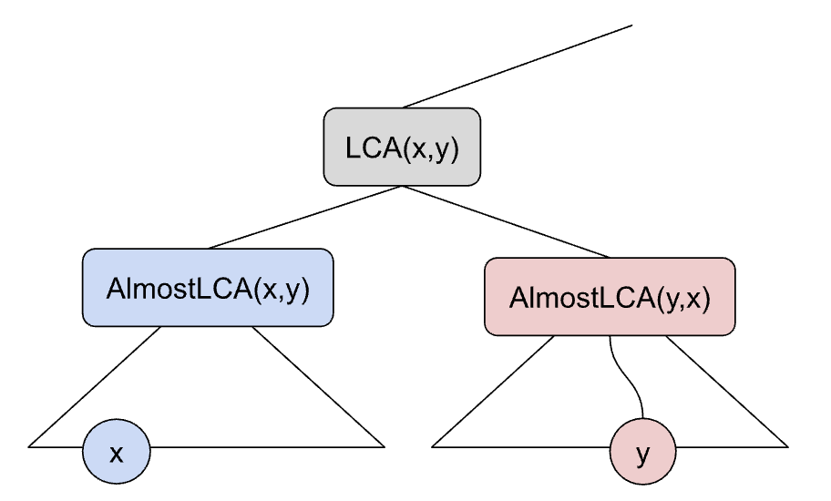

# KEP-1714: Fair Sharing
<!-- toc -->
- [Summary](#summary)
- [Motivation](#motivation)
  - [Goals](#goals)
  - [Non-Goals](#non-goals)
- [Proposal](#proposal)
  - [User Stories (Optional)](#user-stories-optional)
    - [Story 1](#story-1)
    - [Story 2](#story-2)
    - [Story 3](#story-3)
  - [Risks and Mitigations](#risks-and-mitigations)
- [Design Details](#design-details)
  - [Share value function and weights](#share-value-function-and-weights)
  - [Preemption algorithm](#preemption-algorithm)
    - [Choosing ClusterQueues to preempt from](#choosing-clusterqueues-to-preempt-from)
    - [Choosing workloads from ClusterQueues for preemption](#choosing-workloads-from-clusterqueues-for-preemption)
    - [Algorithmic Optimization](#algorithmic-optimization)
    - [Minimum number of preemptions](#minimum-number-of-preemptions)
  - [Test Plan](#test-plan)
  - [Graduation Criteria](#graduation-criteria)
    - [Alpha](#alpha)
    - [Beta](#beta)
- [Implementation History](#implementation-history)
- [Drawbacks](#drawbacks)
- [Alternatives](#alternatives)
<!-- /toc -->

## Summary
This KEP introduces weight-based fair sharing of unused resources across 
needing ClusterQueues, respecting borrowing and lending limits, multi-level
hierarchy and preferences of cohorts to distribute unused resources 
internally.

## Motivation
Currently unused resources are allocated on the "first come first served" basis
(assuming the same priorities of the upcoming workloads).
This approach is not optimal in large deployments where some users (ClusterQueues)
could get preferential treatment based solely on the timing of workload submission.
KEP [#1337](https://github.com/kubernetes-sigs/kueue/tree/main/keps/1337-preempt-within-cohort-while-borrowing) helps a bit in this situation, by introducing priority based preemptions
to borrowing, however in organizations with no strict budget enforcing, priorities
could be overused (if priorities could guarantee more resources, then everyone would
use the highest one, breaking the whole idea altogether). Thus a more comprehensive
solution of distributing unused resources is needed.

### Goals
* Create a mechanism to enforce fair sharing of resources. Two equally important
sub-organizations (Cohorts or ClusterQueues), placed in the similar spots in the
whole organization (hierarchy of Cohorts), actively competing for the same
resources (having workloads needing more than nominal quota), should 
be given a similar amount of resources. And any pre existing imbalances should
be timely resolved by preemption.

* Allow system admin to indicate that a sub-organization is more important than
their siblings, and should get proportionally more resources than others located
under the same parent. 

* When distributing resources, prioritize needs of CQ within the same
sub-organization and only after they have been fulfilled, proceed with distribution
outside of the suborganization.

* When enforcing fair sharing, ignore workload priorities unless:

   * The workload's priority is above admin-defined high priority. Super high
priority workloads overrule fair sharing and are treated according to KEP [#1337](https://github.com/kubernetes-sigs/kueue/tree/main/keps/1337-preempt-within-cohort-while-borrowing).

   * There is a need to preempt some non top priority workload from a ClusterQueue.
Then the lowest priority workloads from a CQ that is over its fair share should
be selected for preemption.

* The mechanism should be compatible with all existing or proposed Kueue features,
in particular:

   * Borrowing limits 
   * Lending limits
   * Guaranteed/nominal quota
   * Hierarchical cohorts

* Fair sharing should not limit Kueue scalability. Kueue, with fair sharing enabled,
should be able to handle >1k ClusterQueues, >100 Cohorts and >10k workloads (that
are either running or queued) within a single hierarchical organization.

* The proposed system should be hard to game, for example by creating big workloads
that consume all capacity.

* Fair sharing enforcement should not significantly decrease overall utilization,
however, pathological situations (like a single workload consuming all otherwise
unused capacity) should be resolved in favor of fair sharing than maximizing the
utilization (the big greedy workload should be preempted to admit smaller
workloads from other CQ that consume only their fair share).

### Non-Goals
* Use historical data (for example CQ A used a lot of shared capacity for the last
week, so now it should get less because others, who didn't need anything then, have
pending workloads). Fair sharing should be based on point-in-time situation, although,
ideally it should be expandable to support history-based fair sharing(for example with #26)
without major redesign.

* Enable fair sharing only for some part of the resources or Cohort hierarchy.
Fair sharing will be a global switch (at least initially).

* Maximize utilization at the cost of fair sharing.

## Proposal

Introduce a concept of fair share as the amount of resources lent to a CQ, 
on top of the given nominal quota, that doesn't justify "complains" against
any other similar CQ about excessive extra resources that CQ was given. Basically
the sharing of unused resources is fair, if no CQ can say it is grossly unfair.

Introduce a global fair sharing mechanism that is based on preemptions. As long
as there are some free and accessible resources in the cohort hierarchy, Kueue
will admit workloads without any limits. However, once the capacity is gone,
new workloads from Cohorts/CQ that have not received their fair share yet will
be permitted to preempt workloads from Chorots/CQ that received more than their
fair share would otherwise be (or more than the Cohort/CQ that is in need).

Additionally, we will introduce a reclaim mechanism at the Cohort level. Cohorts
that are in need, but whose consumption didn’t reach their total aggregated
nominal quota will be able to preempt workloads from Cohorts/CQ that are over
their budget and are borrowing from the Cohort/CQ that tries to admit a workload
within its own nominal quota (very similar to what we currently have for CQ
within the single level Cohort structure).

We will add an optional weight field to both Cohorts and CQ. The weight will
indicate how to fair share resources between sub-organizations (CQs or Cohorts)
under the same Cohort.

Fair sharing will be configured for the whole cluster, using the configuration
file. In Alpha it will be just a feature gate.

### User Stories (Optional)

#### Story 1
I have 2 teams in my department in some US-based company, one on the east coast
(TeamE), one on the west coast (TeamW). Both come to work at 9 am their local time.
And immediately after that they start submitting their research jobs for execution
in their assigned CQs. Each of them have a bit of guaranteed resources, however they
both rely on a company-wide pool or resources that should be fairly shared. 

TeamE can submit as many workloads and consume as many resources as they can while
TeamW is not at work and doesn’t need resources. However, once they arrive, some of
the already submitted workloads from TeamE may be preempted (preferably the least
important) to ensure equal extra space (regardless of their given quota) for both teams. 


#### Story 2
I have two departments in my company D1 and D2 (modeled as Cohorts, under one
top-level Cohort). Each of the departments has 3 teams: A, B, C. Each of the teams
submits their workloads to the appropriate CQ: 1A, 1B, 1C, 2A, 2B, 2C. Each of the
teams/CQs is given some guaranteed resources within the big ML cluster. Each team
is also allowed to borrow as many resources from other teams as they want, as long
as they are not needed by the owner. However, due to internal accounting, company
internal politics, etc, free resources should first be distributed within the
department. For example:

* if CQ 1A has free resources, and both 1B and 1C are in need of extra resources 
to run their workloads, then 2A, 2B and 2C should not be given a share of 1A,
that would block any workload from 1B or 1C from running. 

* If CQ 1A has free resources and 1B and 1C do not need any of those to start
a workload (there are no pending workloads or they are too big anyway) then 2A, 2B,
2C should be given an equal share of the resources that correspond to their needs.

#### Story 3
I have 3 cohorts inside my organization (top cohort): CS, C1 and C2. CS contains
a single CQ that is given 300 GPU nominal quota. C1 contains 3 CQ: 1A, 1B and 1C,
among which 1C is considered to be 3 times more important than others. C2 contains
only one CQ: 2A.  Each of the queues 1A, 1B, 1C and 2A has a long backlog of jobs
to execute. I want to distribute the resources from CS in the following way:

* Both C1 and C2 get 150 GPUs each, because they are considered equally important.
* Inside C1, out of these 150 GPUs, 1A gets 30, 1B gets 30 and 1C gets 90 GPUs. 
1A and 1B are equally important but 1C is 3x more important than 1A and 1B.
* Inside C2 there is just a single CQ, so it gets all 150 GPUS.

### Risks and Mitigations

* Fair sharing may increase the number of preemptions in the system vs current
state where the first workload to acquire unused resources keeps them until it
finishes. Mitigations include:
    * Introduce minimum execution time before workloads can be preempted for fair sharing.
    * Introduce delayed fair share enforcement - new workloads have to wait a bit before preempting others to get their share.

* Fair sharing may decrease utilization of the unused resources while attempting to
distribute them fairly, vs provide the tighties bin-packing. To avoid these scenarios,
users should prefer to run massive workloads under nominal quotas.


## Design Details

The enforcement of fair-share revolves around the idea of a share value per CQ or
Cohort and mechanisms to keep the share values among siblings in the hierarchy to
be as equal as possible. This is achieved via two mechanisms:

* During admission, prioritize admitting workload from the ClusterQueues and cohorts that have the lowest share value.
* Preempt workloads from ClusterQueues and cohorts that have the highest share value.

The algorithms take a decision from root-to-leaves. This favors admission from 
suborganizations that, as a whole, still have unused resources, or favors preemptions 
from suborganizations that, as a whole, are borrowing too much.

### Share value function and weights

The value function is a variation of DRF (see
[1](https://amplab.cs.berkeley.edu/wp-content/uploads/2011/06/Dominant-Resource-Fairness-Fair-Allocation-of-Multiple-Resource-Types.pdf),
[2](https://dash.harvard.edu/bitstream/handle/1/11956916/Parkes_BeyondDominant.pdf;jsessionid=AC0D06C2CC07C693BD42008D7AE25D99?sequence=1)):

For a given resource _r_ provided by a ClusterQueue or cohort _c_, we calculate $T_r$ as the
total requests consumed by the Workloads for resource _r_ in that CQ or cohort,
that are above the nominal quota, added up for all flavors.
The value for a resource is the ratio of $T_r$ and the total nominal quotas
(or lendingLimits, if defined) for the resource _r_, added up for all flavors,
in the hierarchy of the parent of _c_.

Note that the share value for a suborganization (a node in the tree) is independent of the 
share value for its children. In other words, the calculation of the share value only 
depends on the sum of usages and sum of nominal quotas in the suborganization.

The value for the CQ or cohort is the maximum among the values for each resource, divided by the weight, if defined.

Weights will be added to ClusterQueueSpec and CohortSpec in the following optional struct:

```go
type struct FairSharing {
     Weight 	*Quantity  // Default is 1. 
}
```

### Preemption algorithm

The algorithm could be summarized as follows:

```
AdmitWorkload(x CQ, w Workload)
 While w does not fit and there are workloads that can still be preempted:
   Find CQs that are borrowing resources in the hierarchy
   For each CQ y:
	  Find workloads z that could be preempted while satisfying fairness
   Choose a workload from the biggest offender for preemption
 Possibly undo some preemption, while w still fits
```

#### Choosing ClusterQueues to preempt from

When a CQ x fails to admit a workload w, one of the following scenarios may occur:

* [S1] A sub-organization to which CQ x belongs (its cohort, parent cohort, or CQ itself)
 still has enough resources to admit the workload within its nominal quota, as the total
 amount of its workload consumption is lower than the quota. However, as there are not
 enough resources in the system, someone must be borrowing resources. Thus, if we find
 a potential borrower, we can consider preempting some of its workloads, up to the point
 when it stops borrowing. This is equivalent to “reclaimWithinCohort” in ClusterQueues.


* [S2] A sub-organization to which CQ x belongs is borrowing, however it seems that it is
borrowing too little compared to other sub-organizations that are also borrowing, so some
action is needed to enforce fair sharing. We should compare how much the sub-orgs are
borrowing compared to each other, and preempt some workloads up to the point when its fair
share would be smaller than the sub-org for which preemptions are executed.

Let’s formalize the above description.

By LCA(x,y) we define the lowest common ancestor of two ClusterQueues x and y in the cohort
hierarchy. AlmostLCA(x,y) is the last but one element on the path from x to LCA(x,y) in the cohort hierarchy.

When trying to preempt some workloads to admit workload w to CQ x we consider all other
CQs that are in the same hierarchy. For each of such CQ y we check whether scenario S1
or S2 occur. To do that we compare sub-organizations that are rooted in AlmostLCA(x,y) and AlmostLCA(y,x).



First of all we validate if y is not using its local nominal quota, somewhere on the path.
If y was using some local nominal quota that lies entirely under AlmostLCA(y,x) then x should
not be allowed to preempt any of its workload. So we check whether both y and all cohorts on
the way up to AlmostLCA(y,x) are borrowing. If that happens then y may have something to
do with x being unable to admit the workload. 

We trigger scenario S1 if AlmostLCA(x,y) is not borrowing but x still has too little
resources. We put all y’s workloads on a list of potential preemptions, out of which
we will later (once we check all other CQs) select one that is most reasonable. 


We trigger scenario S2 if AlmostLCA(x,y) is borrowing. We check whether AlmostLCA(x,y)
and AlmostLCA(y,x) are borrowing roughly the same amount. To do this we use a value 
function that returns a value of the borrowed capacity.

#### Choosing workloads from ClusterQueues for preemption

For each workload z in y we check whether if:

[S2-a] value of AlmostLCA(y,x) **without z** is still higher (or equal) than value of AlmostLCA(x,y)
with admitted workload w. Y’s sub-orgs will still be better than X’s sub-org after we
preempt z and admit w, thus z is a reasonable candidate to re-balance fair sharing.


[S2-b] value of AlmostLCA(y,x) (with z) is strictly higher than AlmostLCA(x,y) with admitted workload w.
Here the case is that Y’s sub-org is greedy, and doesn’t allow smaller requests on the
x’s size. If no other preemption option is possible inside any other CQ, z should be
considered for preemption. Maybe y has a smaller workload that could be admitted, and
then both x and y will be ”happy”. In practice this rule prevents huge workloads from
taking the whole unused capacity, blocking everyone else and claiming that this is fair-sharing. 

After we gathered all possible preemption candidates form all relevant CQs we sort them
by the following criteria:

* [C1] Values of cohorts/cq on the way from root cohort to y. In descending order, so the
biggest “offenders” are first.
* [C2] Priority of the workload inside of CQ - least important ones are favored.
* [C3] Size of the workload inside of CQ - smallest workloads (based on the dominant resource) are favored.

We pick the best candidate from that ranking and provisionally preempt it. If the
workload w can be admitted to x then we are done (almost), if not, we search for the
next candidate starting back from ClusterQueue selection.

#### Algorithmic Optimization

Implemented naively, the proposed algorithm is O(n^2) on the number of workloads.

In practice, we don’t create one list of candidates and sort it every time. It can be noticed that after this provisional preemption.

* Order based on [C3] is not changed - no workload is resized.
* Order based on [C2] is not changed - no priority is changed. 
* Order based on [C1] may change a bit, but it applies to the whole groups that could be reshuffled. 

Thus finding the best candidate can be done via:

Finding the CQ with the highest value according to [C1] - this can be done by
sorting cq’s instead of workloads, their number is much smaller (some of them can be
dropped as not borrowing).
 
Picking the already (on the first iteration) sorted list of workloads and checking which of
them matches [S1], [S2-a] or maybe [S2-b]. If all of them match [S2-b] only, second-best
(or following) CQ should be selected.


#### Minimum number of preemptions

After we have determined a set of provisionally preempted workloads, we should
double-check if some of them could be simply put back as they either:

* In fact don’t provide resources to w, their preemption is wasted by some
lending/borrowing limits on the way.

* Are providing capacity that is also provided in much bigger quantity by other workloads
### Test Plan

[x] I/we understand the owners of the involved components may require updates to
existing tests to make this code solid enough prior to committing the changes necessary
to implement this enhancement.

This is a very complex feature so there will be lots of unit, integration and e2e test covering various scenarios.

### Graduation Criteria
#### Alpha

The alpha will be split among two releases.
Release v0.7 will only implement fair sharing in the existing flat structure (cohorts don’t have parents).
Release v0.8 will incorporate fair sharing with arbitrary hierarchies (KEP #79)

The following metrics will be added:
* ClusterQueue fairness value
* Preemptions per ClusterQueue, per reason (fair share, priority, reclamation)
* ClusterQueue pending demand per resource

Both releases will be accompanied with unit and integration tests.

#### Beta

A Beta release will incorporate feedback from users, and introduce improvements in areas such as:
* preemption control (relaxing preemption criteria, minimum execution time, etc.)
* visibility API (state of value function)
metrics
* Scalability scenarios

## Implementation History

## Drawbacks

The main drawback is that Fair Sharing (together with Hierarchical Cohorts) significantly increases
the complexity of scheduling in Kueue.

## Alternatives

* Stay with the current first come first served mechanism of distributing unused resources.

