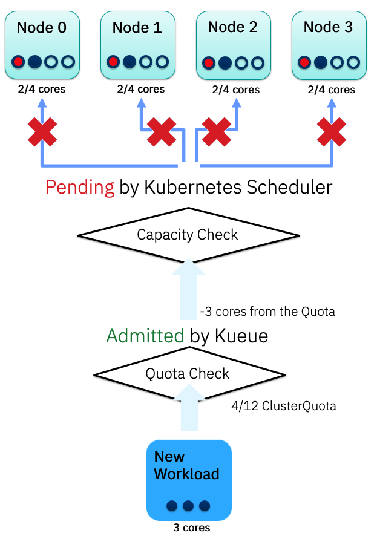

# KEP-3211: Check node capacity before workload admission

<!--
This is the title of your KEP. Keep it short, simple, and descriptive. A good
title can help communicate what the KEP is and should be considered as part of
any review.
-->

<!--
A table of contents is helpful for quickly jumping to sections of a KEP and for
highlighting any additional information provided beyond the standard KEP
template.

Ensure the TOC is wrapped with
  <code>&lt;!-- toc --&rt;&lt;!-- /toc --&rt;</code>
tags, and then generate with `hack/update-toc.sh`.
-->

<!-- toc -->
- [Summary](#summary)
- [Motivation](#motivation)
  - [Goals](#goals)
  - [Non-Goals](#non-goals)
- [Proposal](#proposal)
  - [User Stories (Optional)](#user-stories-optional)
    - [Story 1](#story-1)
  - [Notes/Constraints/Caveats (Optional)](#notesconstraintscaveats-optional)
  - [Risks and Mitigations](#risks-and-mitigations)
- [Design Details](#design-details)
  - [Test Plan](#test-plan)
      - [Prerequisite testing updates](#prerequisite-testing-updates)
    - [Unit Tests](#unit-tests)
    - [Integration tests](#integration-tests)
  - [Graduation Criteria](#graduation-criteria)
- [Implementation History](#implementation-history)
- [Drawbacks](#drawbacks)
- [Alternatives](#alternatives)
<!-- /toc -->

## Summary

<!--
This section is incredibly important for producing high-quality, user-focused
documentation such as release notes or a development roadmap. It should be
possible to collect this information before implementation begins, in order to
avoid requiring implementors to split their attention between writing release
notes and implementing the feature itself. KEP editors and SIG Docs
should help to ensure that the tone and content of the `Summary` section is
useful for a wide audience.

A good summary is probably at least a paragraph in length.

Both in this section and below, follow the guidelines of the [documentation
style guide]. In particular, wrap lines to a reasonable length, to make it
easier for reviewers to cite specific portions, and to minimize diff churn on
updates.

[documentation style guide]: https://github.com/kubernetes/community/blob/master/contributors/guide/style-guide.md
-->

Introduce a new experimental AdmissionCheck called ReduceFalseAdmissions, and related Controller. Its goal is to decrease the chances for Kueue to admit a Guaranteed Workload when it is known that at the time of admission there is no existing Node in the cluster with enough resources to satisfy the workload request.

For the sake of simplicity, the proposed AdmissionCheckController will only apply this logic to pods with Guaranteed Quality of Service (QoS) class. It will always admit any workload that does not match the Guaranteed QoS.
It considers pods whose resource request is identical to their resource limit as pods matching the Guaranteed QoS class.


## Motivation

<!--
This section is for explicitly listing the motivation, goals, and non-goals of
this KEP.  Describe why the change is important and the benefits to users. The
motivation section can optionally provide links to [experience reports] to
demonstrate the interest in a KEP within the wider Kubernetes community.

[experience reports]: https://github.com/golang/go/wiki/ExperienceReports
-->

By default Kueue decides to admit or not a workload based on the ClusterQuota availability. However, the ClusterQuota does not accurately reflect the available capacity of nodes.
This can lead to wrongful admissions if the resources are spread across Nodes in a way that there are is no collection of Nodes which can satisfy the resource requests of the pods in a Workload.

In these cases Kueue reserves the Workload's resource from the ClusterQuota, admits the workload to the Kubernetes scheduler but Kubernetes cannot actually schedule the Workload.
This may lead to loss of opportunity for future Workloads because Kueue may refuse incoming Workloads even though there are nodes in the cluster which have enough available resources for the pods of the Workloads.

### Goals

<!--
List the specific goals of the KEP. What is it trying to achieve? How will we
know that this has succeeded?
-->
* Allow Kueue to know how available resources are spread across Nodes in the Cluster.
* Consider as available resources the ones not reserved for Guaranteed Workloads.
* Consider as unavailable all the resources reserved for Guaranteed Workloads.
* Calculate if there is at least one subset of Nodes on the Cluster that can host incoming Guaranteed Workloads.
* Provide an Admission Check based on such knowledge for incoming Guaranteed Workloads.

### Non-Goals

<!--
What is out of scope for this KEP? Listing non-goals helps to focus discussion
and make progress.
-->
* Decide on which Nodes the Pods will be actually scheduled on. This is a decision that the Kubernetes scheduler should actually make.
* Enforce optimized scheduling policies. We want to focus on a binary response: can or cannot be scheduled. The best way to schedule is out of scope.
* Treat the resources that not-Guaranteed QoS Jobs running on the Cluster currently use as reserved.
* Apply the decision logic of this AdmissionCheckController to Workloads that do not satisfy the Guaranteed QoS.

## Proposal

<!--
This is where we get down to the specifics of what the proposal actually is.
This should have enough detail that reviewers can understand exactly what
you're proposing, but should not include things like API designs or
implementation. What is the desired outcome and how do we measure success?.
The "Design Details" section below is for the real
nitty-gritty.
-->

Introduce ReduceFalseAdmission (RFA) AdmissionCheck and controller.

After a Guaranteed Workload passes the preadmission phase, where Kueue checks if there are enough available resources in the ClusterQuota that can be consumed, RFA will perform an additional control.

RFA will check if there is at least one combination of one or more Nodes that can host the incoming Workload: to do so, the incoming Workload's resource limits will be compared with the available resources on suitable Nodes. Suitable Nodes are those whose labels and Taints are compatible with the incoming Workload.

Since we want to evaluate only Workloads with a Guaranteed QoS against similar Workloads, RFA will consider as unavailable only the resources already allocated for running Guaranteed Workloads on the Cluster. For the same reason, if an incoming Workload does not have a Guaranteed QoS, it won't be checked by RFA AdmissionCheck (leading to an auto-admission).

If a Workload is accepted by RFA, then the Kube Scheduler will take care of the actual scheduling; if RFA rejects it, for now, the Workload will be requeued for an AdmissionCheck later.

The proposed AdmissionCheck reduces the chances for Kueue to falsely admit a Workload.


### User Stories (Optional)

<!--
Detail the things that people will be able to do if this KEP is implemented.
Include as much detail as possible so that people can understand the "how" of
the system. The goal here is to make this feel real for users without getting
bogged down.
-->

#### Story 1

As a Kueue user, I have experienced cases where a Workload is admitted by Kueue but then is not actually running on the Cluster. This happens in a scenario like the following: we have 4 Nodes, each with 4 CPU cores (for a total of 16), and have defined a ClusterQueue with a Cluster Quota of 12 CPU cores. Kueue has already admitted a few Workloads, leading each Node to currently have a Job occupying 2 cores, so that the current state is:
* Cluster Quota with 4/12 cores available.
* Node 0, Node 1, Node 2, Node 3 each with 2/4 cores available.

Then a new Kueue Guaranteed Workload is created, made by a single Pod with resource limit of 3 CPU cores, and faces admission. It passes the ClusterQuota Check, resulting in the updated ClusterQuota to have 1/12 cores available, however the new Workload cannot land on any Node because no one among Node 0, Node 1, Node 2 and Node 3 has actually 3 core available to host the new single Pod.

So the new state is:
* Cluster Quota with 1/12 cores available.
* Node 0, Node 1, Node 2, Node 3 each with 2/4 cores available.

If I wanted to create a Workload with a single Pod requiring 2 cores, Kueue would reject it even though it could actually be scheduled.




### Notes/Constraints/Caveats (Optional)

<!--
What are the caveats to the proposal?
What are some important details that didn't come across above?
Go in to as much detail as necessary here.
This might be a good place to talk about core concepts and how they relate.
-->

### Risks and Mitigations

<!--
What are the risks of this proposal, and how do we mitigate? Think broadly.
For example, consider both security and how this will impact the larger
Kubernetes ecosystem.

How will security be reviewed, and by whom?

How will UX be reviewed, and by whom?

Consider including folks who also work outside the SIG or subproject.
-->

* Performance wise, the periodic check of the Cluster's state could lead to a heavy usage of resources in case of large Clusters
 
* ACC requires permission to view all Nodes and Pods a cross the Cluster


## Design Details

<!--
This section should contain enough information that the specifics of your
change are understandable. This may include API specs (though not always
required) or even code snippets. If there's any ambiguity about HOW your
proposal will be implemented, this is the place to discuss them.
-->
RFA is made by two sub components: Resource Monitor and Evaluator.

By interacting with Kubernetes API, Resource Monitor will periodically watch the resource usage of the Nodes across a Cluster. This usage will consider all Pods belonging to a Guaranteed QoS Job (regardless if it was scheduled through Kueue or any other method). It will ignore resources allocated for other QoS Jobs. Resource Monitor will update a structure called Snapshot everytime it fetches new information from the Cluster. Such Snapshot will contain Nodes' information like Name, metadata (Taints, labels, etc), the Node's remaining resources and info on Pods running on the Node; Pods information will be its uuid, name, namespace and resource limits.

```go
// PodInfo holds information about each pod running on a node
type PodInfo struct {
  Name      string              `json:"name"`
  UUID      string              `json:"uuid"`
  Namespace string              `json:"namespace"`
  Resources corev1.ResourceList `json:"resources"` // Tracks resource usage by this pod
}

// NodeUsage holds the resource usage data for a single node
type NodeUsage struct {
  NodeName  string              `json:"node_name"`
  UUID      string              `json:"uuid"` // Unique identifier for the node
  Taints    []corev1.Taint      `json:"taints"`
  Labels    map[string]string   `json:"labels"`    // Node labels for scheduling decisions
  Remaining corev1.ResourceList `json:"remaining"` // corev1.ResourceList tracking the currently remaining resources for incoming workloads
  Pods      []PodInfo           `json:"pods"`      // List of pods running on the node
}

// Snapshot holds resource data for all nodes and the last check timestamp
type Snapshot struct {
  LastCheck time.Time   `json:"last_check"` // Timestamp of the last resource check
  Nodes     []NodeUsage `json:"nodes"`
}
```

When a new Guaranteed Workload is created and has a Quota Reservation by Kueue, Evaluator will compare its resource limits with the last Snapshot captured by Resource Monitor. Such comparison will take into consideration Nodes' Taints, labels and Workload's Toleration and NodeSelector. In addition, it will check if a suitable subset of Nodes has enough available resource to host each Pod's resource limits.

If Evaluator returns true, then RFA AdmissionCheck state is Ready, otherwise the Workload will be re-queued and another attempt will be made after 60 seconds.


### Test Plan

<!--
**Note:** *Not required until targeted at a release.*
The goal is to ensure that we don't accept enhancements with inadequate testing.

All code is expected to have adequate tests (eventually with coverage
expectations). Please adhere to the [Kubernetes testing guidelines][testing-guidelines]
when drafting this test plan.

[testing-guidelines]: https://git.k8s.io/community/contributors/devel/sig-testing/testing.md
-->

[x] I/we understand the owners of the involved components may require updates to
existing tests to make this code solid enough prior to committing the changes necessary
to implement this enhancement.

##### Prerequisite testing updates

<!--
Based on reviewers feedback describe what additional tests need to be added prior
implementing this enhancement to ensure the enhancements have also solid foundations.
-->

#### Unit Tests

<!--
In principle every added code should have complete unit test coverage, so providing
the exact set of tests will not bring additional value.
However, if complete unit test coverage is not possible, explain the reason of it
together with explanation why this is acceptable.
-->

<!--
Additionally, try to enumerate the core package you will be touching
to implement this enhancement and provide the current unit coverage for those
in the form of:
- <package>: <date> - <current test coverage>

This can inform certain test coverage improvements that we want to do before
extending the production code to implement this enhancement.
-->

- `<package>`: `<date>` - `<test coverage>`

#### Integration tests

<!--
Describe what tests will be added to ensure proper quality of the enhancement.

After the implementation PR is merged, add the names of the tests here.
-->

### Graduation Criteria

<!--

Clearly define what it means for the feature to be implemented and
considered stable.

If the feature you are introducing has high complexity, consider adding graduation
milestones with these graduation criteria:
- [Maturity levels (`alpha`, `beta`, `stable`)][maturity-levels]
- [Feature gate][feature gate] lifecycle
- [Deprecation policy][deprecation-policy]

[feature gate]: https://git.k8s.io/community/contributors/devel/sig-architecture/feature-gates.md
[maturity-levels]: https://git.k8s.io/community/contributors/devel/sig-architecture/api_changes.md#alpha-beta-and-stable-versions
[deprecation-policy]: https://kubernetes.io/docs/reference/using-api/deprecation-policy/
-->

The feature starts at the alpha level, under the `experimental` directory.

In Alpha version RFA will support:

- Subcomponents as described above.

Graduation to beta criteria:

- Positive feedback from users.
- Most of the integrations supported.
- Major bugs and deficiencies are not found/fixed.
- Roadmap for missing features is defined.

## Implementation History

<!--
Major milestones in the lifecycle of a KEP should be tracked in this section.
Major milestones might include:
- the `Summary` and `Motivation` sections being merged, signaling SIG acceptance
- the `Proposal` section being merged, signaling agreement on a proposed design
- the date implementation started
- the first Kubernetes release where an initial version of the KEP was available
- the version of Kubernetes where the KEP graduated to general availability
- when the KEP was retired or superseded
-->

* 2024-10-10 Created issue [#3211](https://github.com/kubernetes-sigs/kueue/issues/3211)
* 2025-01-13 Initial prototype in external git [repository](https://github.com/CarloGem/ACC-POConcept)
* 2025-04-18 Initial KEP


## Drawbacks

<!--
Why should this KEP _not_ be implemented?
-->
* Doesn't completely negate false admissions
* Other ACCs like Topology Aware Scheduling could provide similar functionalities

## Alternatives

<!--
What other approaches did you consider, and why did you rule them out? These do
not need to be as detailed as the proposal, but should include enough
information to express the idea and why it was not acceptable.
-->


* Using the Topology Aware Scheduling. However, TAS may also be overkill when the "topology" is totally flat (just nodes) and all that is desired is to prevent the churn/waste of useless admission of workloads that contain individual pods that can't possibly be scheduled because no node has the requested capacity.
* Using Cluster Autoscaler. The CA feature that is needed (the check-capacity.autoscaling.x-k8s.io provisioningClassName) requires Kubernetes 1.30.1 or better. OpenShift 4.16 is based on Kubernetes 1.29 and will be supported through mid 2026. So CA is not an option for it.
