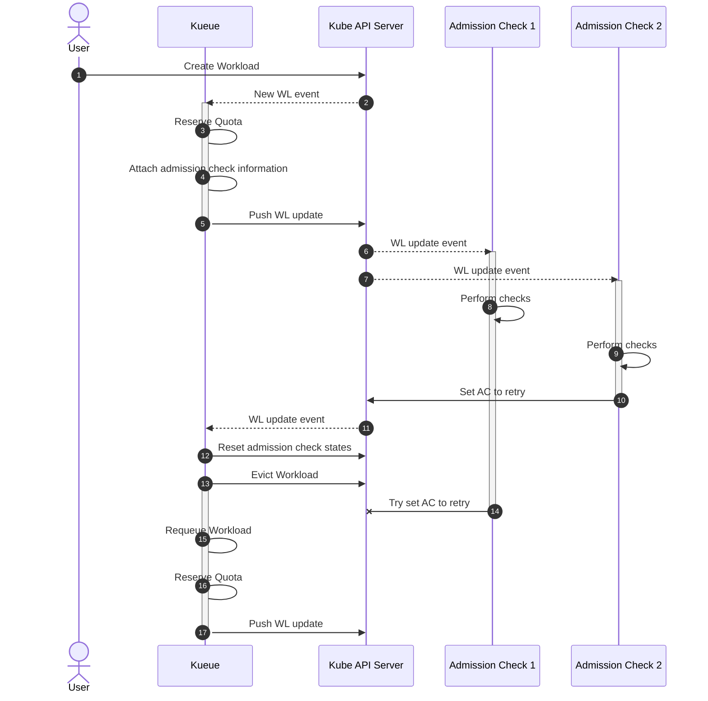
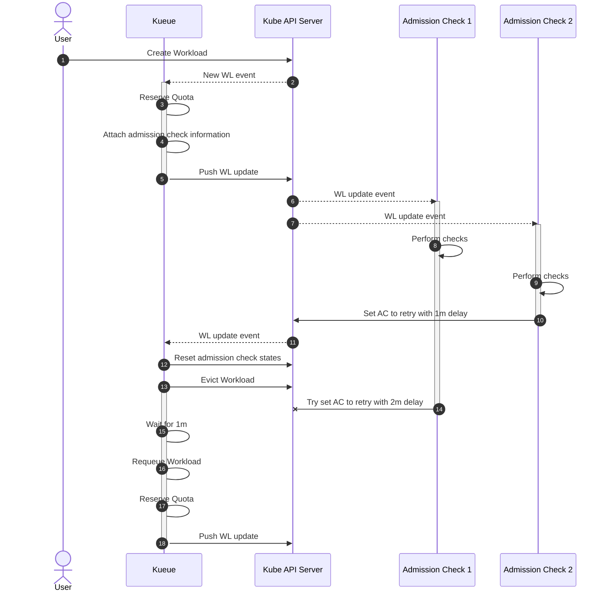
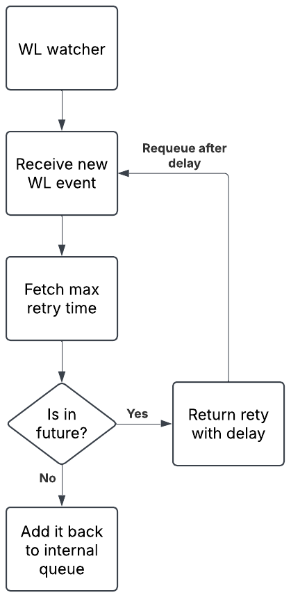
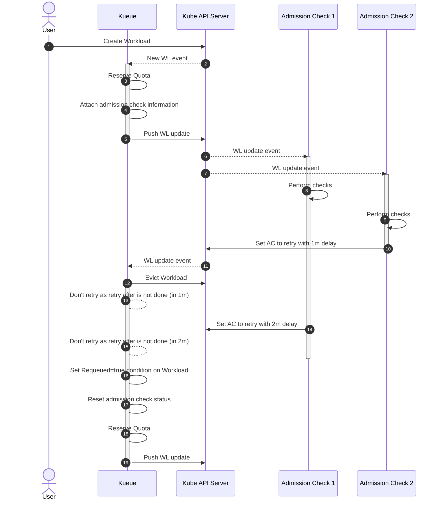
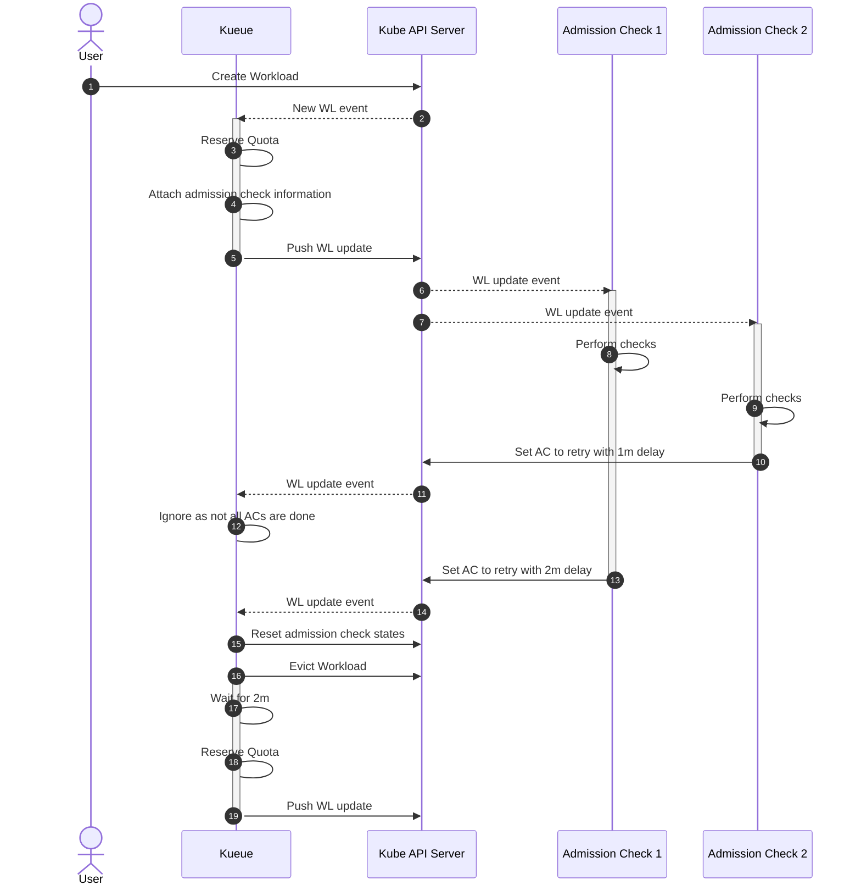

# KEP-3258: Delayed Admission Check Retries

<!-- toc -->
- [Summary](#summary)
- [Motivation](#motivation)
  - [Goals](#goals)
  - [Non-Goals](#non-goals)
- [Proposal](#proposal)
  - [User Stories](#user-stories)
    - [Story 1: External Admission Check with Backoff](#story-1-external-admission-check-with-backoff)
    - [Story 2: Control Plane Load Management](#story-2-control-plane-load-management)
    - [Story 3: Multi-tenancy with Different Retry Strategies](#story-3-multi-tenancy-with-different-retry-strategies)
  - [Notes/Constraints/Caveats](#notesconstraintscaveats)
    - [Race Condition Between Admission Check Updates and Workload Eviction](#race-condition-between-admission-check-updates-and-workload-eviction)
  - [Risks and Mitigations](#risks-and-mitigations)
- [Design Details](#design-details)
  - [API Changes](#api-changes)
    - [Delayed Processing and State Reconciliation](#delayed-processing-and-state-reconciliation)
      - [Caveats](#caveats)
  - [Documentation Requirements](#documentation-requirements)
  - [Test Plan](#test-plan)
    - [Unit Tests](#unit-tests)
    - [Integration tests](#integration-tests)
  - [Graduation Criteria](#graduation-criteria)
- [Implementation History](#implementation-history)
- [Drawbacks](#drawbacks)
- [Future outlook](#future-outlook)
- [Alternatives](#alternatives)
  - [Alternative to sync AC results: Wait for All Admission Checks](#alternative-to-sync-ac-results-wait-for-all-admission-checks)
<!-- /toc -->

## Summary

This KEP proposes a mechanism to allow external admission check controllers to specify retry delays when marking a workload's admission check state as `Retry`. Currently, when an admission check is set to `Retry`, Kueue immediately evicts the workload and requeues it with minimal delay, which can cause excessive load on external controllers and the control plane.

## Motivation

Kueue supports custom admission checks that allow external controllers to influence workload admission decisions. When an external controller sets an admission check state to `Retry`, Kueue currently:

1. Evicts the workload
2. Releases the quota reservation
3. Immediately requeues the workload with minimal delay

This immediate retry behavior can cause several issues:

- Excessive load on external admission check controllers
- Unnecessary churn in the control plane
- Inefficient resource utilization when the retry condition is expected to persist for a known duration
- Artificial reduction of available quotas

Currently, there's a shared `.status.requeueState` field used by both the [provisioning request admission check](https://kueue.sigs.k8s.io/docs/admission-check-controllers/provisioning/#provisioningrequestconfig) and the [WaitForPodsReady](https://kueue.sigs.k8s.io/docs/tasks/manage/setup_wait_for_pods_ready/) feature. It already serves these purposes well but will need some adjustments to support the new use case.

### Goals

- Provide a mechanism for external admission check controllers to specify retry delays
- Allow each admission check to independently manage its retry timing
- Support proper coordination of multiple admission checks with different retry delays

### Non-Goals

- Change the behavior of other admission check states (`Ready`, `Rejected`, `Pending`)
- Reactivate the deprecated `AdmissionCheck.Spec.RetryDelayMinutes` field
- Modify the FIFO ordering guarantees for workloads without retry delays
- Change the retry behavior for admission checks that don't specify a delay

## Proposal

Add new fields to the `AdmissionCheckState` status to support per-admission-check retry delays:

- `requeueAfterSeconds`: A duration, based on eviction time, indicating when this admission check should be retried
- `retryCount`: A counter tracking how many times this admission check has been retried so far

When multiple admission checks are in the `Retry` state with different delays, Kueue will use the maximum delay across all checks and save it into `requeueState.requeueAt`.
Besides that, the old behavior remains unchanged. When all admission checks are in the `Ready` state, the workload will be admitted; if any of them are in the `Rejected` state, the workload will be rejected.

### User Stories

#### Story 1: External Admission Check with Backoff

As a developer of an external admission check controller that validates cloud resource availability, I want to implement exponential backoff when resources are temporarily unavailable, so that I don't overwhelm the cloud API with requests.

When my controller detects that required cloud resources are not available, it can:

1. Set the admission check state to `Retry`
2. Calculate an appropriate backoff delay (e.g., 30s, 1m, 2m, 4m)
3. Set `requeueAfterSeconds` to the calculated future timestamp
4. Track retry attempts using `retryCount`

#### Story 2: Control Plane Load Management

As a cluster administrator, I have an admission check that validates whether the Kubernetes control plane is healthy before admitting large workloads. When the control plane is under stress, I want workloads to be delayed with longer intervals to allow recovery.

The admission check controller can:

1. Detect control plane stress (high API server latency, etcd performance issues)
2. Set workloads to `Retry` with delays proportional to the stress level
3. Prevent thundering herd effects by spreading retry times

#### Story 3: Multi-tenancy with Different Retry Strategies

As a platform engineer supporting multiple teams, I want different admission checks to have independent retry strategies based on their specific requirements without interfering with each other.

For example:

- Security scanning admission check: retry after 5 minutes if scanner is busy
- Resource provisioning check: retry after 1 minute if capacity is being added
- Compliance validation check: retry after 10 minutes if external audit service is down

### Notes/Constraints/Caveats

- The retry delay is advisory; the actual delay might be slightly longer due to reconciliation timing
- Workloads with very long retry delays might appear to be "stuck" to users
- When multiple admission checks specify different retry delays, the workload will not be retried until all delays have expired
- The retry mechanism does not guarantee strict FIFO ordering when delays are involved
- There is a potential race condition where Kueue might reset admission check states before all controllers have set their retry delays
- The `requeueState.requeueAt` field is used not only by admission checks but also by features like [WaitForPodsReady](https://kueue.sigs.k8s.io/docs/tasks/manage/setup_wait_for_pods_ready/#requeuing-strategy)

#### Race Condition Between Admission Check Updates and Workload Eviction

The current implementation has critical issues with how admission checks are processed. The system uses a small state machine that reacts immediately to changes in the admission check state. When one admission check sets the status to `Retry`, Kueue evicts the workload (and resets the AC state) right away. This immediate action prevents other admission checks from updating their status afterward. If another check sets the status to `Retry` after eviction, it can break Kueue’s internal state. Therefore, the order of events must be strictly followed. The challenge here is that to wait for the maximum time, we need to know all potential delays in advance.



The diagram above shows the current flow of a workload with two admission checks:

- Both admission checks will set the state to `Retry`
- Kueue will take actions after the first one applies its result (steps 10-13)
- The second admission check should not update its status after the workload got evicted (step 14)
  - Otherwise, it will cause issues in Kueue's internal state machine

This is a fundamental problem for delayed retries as we can never know the maximum delay if Kueue reacts to the first response.



This updated version of the diagram includes potential delays:

- Admission check 1 sets the status to retry with a delay of one minute (step 10)
- Kueue will immediately take action and evict the workload (step 12 + 13)
- Shortly after, admission check 2 wants to set its state to retry too, but can't as the workload was evicted already (step 14)
  - However, it would have set a higher retry delay than admission check one
  - This means that we'll always only use the delay of the fastest responding check

**What happens if the second AC updates it's state at the wrong time?**

When the admission check controller is too fast and doesn't implement proper safeguards, it can lead to invalid states where a workload won't be reconsidered by Kueue anymore.
The following sequence of events illustrates how this issue can eventually break a workload:

1. User creates a workload.
2. Kueue reserves quota and applies changes in two steps:
   2.1 Applies a patch to set resource flavour information and sets `QuotaReserved=true`.
   2.2 Applies an update to `add admission checks to the status in a pending state`.
3. The admission check controller runs because `QuotaReserved=true` and `AdmissionCheckState=Pending`:
   3.1 It applies a patch to `set the admission check state to retry`.
4. Kueue `resets the admission check state to Pending` and sets `Evicted=true` in a single patch.
5. The admission check controller runs again under the same conditions:
   5.1 It `sets the admission check state back to retry`.
6. Kueue does not notice the change and sets `QuotaReserved=false` and `Requeue=false` in a single patch
   6.1 Evicted remains true, and QuotaReserved is false.
   6.2 The admission check state stays in Retry.
7. Kueue sets `Requeued=true`.
8. Kueue can't reserve quota again due to the invalid state. It tries to schedule the workload but always sees the admission check in a Retry state.
   8.1 The message on the QuotaReserved status: The workload has failed admission checks.

At this point, the workload should theoretically be picked up by the scheduler again. However, it's ignored because the admission check remains in a Retry state that is never cleared.
We mitigated this issue by being more cautious with updates in our custom admission checks. Specifically, by avoiding state changes at the wrong time. However, this behavior was not immediately obvious.

### Risks and Mitigations

**Risk**: Breaking backward compatibility with existing admission check controllers\
**Mitigation**: All fields are optional; controllers that don't set them will maintain current behavior

**Risk**: Workloads appearing stuck due to long retry delays \
**Mitigation**: Add clear status messages that indicate the retry time, expose metrics to monitor retry delays, and document the recommended maximum delay values.

**Risk**: Resource leakage if workloads are forgotten during long delays \
**Mitigation**: Ensure proper cleanup mechanisms and consider maximum delay limits

**Risk**: Race conditions when multiple admission checks set delays \
**Mitigation**: Allow and support admission checks to update the state after a workload has been evicted.

## Design Details

### API Changes

Add new fields to `AdmissionCheckState` in `workload_types.go`:

```go
type AdmissionCheckState struct {
    // lastTransitionTime is the last time the condition transitioned from one status to another.
    // This should be when the underlying condition changed.  If that is not known, then using the time when the API field changed is acceptable.
    // +required
    LastTransitionTime metav1.Time `json:"lastTransitionTime"`

    // Existing fields remain unchanged...

    // RequeueAfterSeconds indicates how long to wait at least before
    // retrying to admit the workload.
    // When State=Retry, admission check controllers should set this
    // to implement delays between retry attempts.
    //
    // If nil when State=Retry, Kueue will retry immediately.
    // If set, Kueue will add the workload back to the queue after
    //   lastTransitionTime + RequeueAfterSeconds
    //
    // +optional
    RequeueAfterSeconds *metav1.Duration `json:"requeueAfterSeconds,omitempty"`

    // RetryCount tracks retry attempts for this admission check.
    // Kueue automatically increments this when transitioning from
    // Retry→Pending. Reset to 0 when check succeeds or workload
    // is admitted.
    //
    // +optional
    RetryCount *int32 `json:"retryCount,omitempty"`
}
```

To get the final timestamp, Kueue adds the relative RequeueAfterSeconds duration to the LastTransitionTime field from the spec.

**Resetting admission check requeue state**

When the delay expires, all fields will be automatically reset before the workload is requeued.
This includes both the `requeueState` and the new `AdmissionCheckState.RequeueAfterSeconds` field.

Additionally, the system will automatically reset requeueAfterSeconds and retryCount when a workload is deactivated.
This allows the cluster administrator to manually re-enable the workload, and it will start with a fresh configuration automatically.

**Example: Workload Status with Multiple Admission Checks**

```yaml
apiVersion: kueue.x-k8s.io/v1beta1
kind: Workload
metadata:
  name: ml-training-job
  namespace: research
status:
  requeueState:
    requeueAt: "2024-02-07T00:10:00Z"

  admissionChecks:
    # Check 1: Budget check with daily reset
    - name: budget-check
      state: Retry
      lastTransitionTime: "2024-02-06T10:10:00Z"
      message: "Daily budget exhausted. Will retry at midnight."
      requeueAfterSeconds: 50400 // in 14h, which is approx midnight
      retryCount: 1

    # Check 2: GPU availability with exponential backoff
    - name: gpu-availability
      state: Retry
      lastTransitionTime: "2024-02-06T10:11:00Z"
      message: "No A100 GPUs available. Retrying in 8m (attempt 4)"
      requeueAfterSeconds: 480 # 8 minutes from now
      retryCount: 4

    # Check 3: License server check - immediate retry
    - name: license-check
      state: Retry
      lastTransitionTime: "2024-02-06T10:20:00Z"
      message: "License server temporarily unavailable"
      # No requeueAfterSeconds set - will retry immediately
# In this example, Kueue will wait until 00:10:00Z (the longest delay)
# before re-evaluating all admission checks
```

#### Delayed Processing and State Reconciliation

To address the issues mentioned in [Race Condition Between Admission Check Updates and Workload Eviction](#race-condition-between-admission-check-updates-and-workload-eviction), the implementation will be changed to allow admission check updates until all available delays have expired. The workload should still be evicted immediately to release all reserved quota. However, Kueue will no longer reset the admission check states right away. Instead, it will wait until `max(AdmissionCheckState.lastTransitionTime + AdmissionCheckState.RequeueAfterSeconds)` is reached. Only then will the admission checks be reset to pending, and the workload marked as `Requeued=true`.

Furthermore, instead of scheduling a timer in `pkg/controller/core/workload_controller.go:807` that sets the requeuing in the future, the controller should rely on the Reconcile function for managing delays. Whenever the workload gets re-submitted to be reconciled, it should search for the latest delay across all admission checks. If the calculated retry time is in the future, the reconciler should reprocess the workload with a delay. If it's in the past, the reconciler should add the workload back into the scheduling rotation, by setting the `Requeued=true` condition.



This diagram shows the updated approach where admission check one sets the state to Retry with a delay of one minute (step 10), and Kueue evicts the workload (step 12). Crucially, admission check two is able to push its update even after the workload has been evicted, and Kueue will take this new delay into account. Only after all available retry delays have expired Kueue will set the `Requeued=true` condition, which then triggers the actual requeuing of the workload. This approach ensures that all admission checks have the opportunity to set their retry delays, and Kueue will respect the maximum delay across all checks.



##### Caveats

In the new case, there's still a race condition if one admission check is fast and doesn't set any delay, which means that the workload will be retries immediately.
However, this shouldn't be a problem, since the update can be posted at any time. This means the second admission check will eventually set the retry with a delay, ensuring it's not reworked immediately again.
That said, it still means we go through a couple of unnecessary cycles, which should be okay.

### Documentation Requirements

To ensure proper implementation of admission check controllers, the following documentation should be added:

- **Admission Check Flow Guide**: Detailed documentation on the expected flow and behavior of admission checks, including:
  - Proper handling of state transitions
  - Best practices for setting retry delays
  - Guidelines on when and how to update admission check states
  - Examples of correct implementation patterns

- **Migration Guide**: Step-by-step instructions for migrating from the old `requeueState` mechanism to the new per-admission-check retry system

### Test Plan

#### Unit Tests

- Test retry delay calculation with single and multiple admission checks
- Test backward compatibility with existing retry behavior

#### Integration tests

- End-to-end test with external admission check setting retry delays
- Test interaction between multiple admission checks with different delays
- Test workload flow through retry cycles with delays
- Test that the workload state remains consistent when admission checks post updates after workload eviction
- Verify that late admission check updates are properly handled without corrupting the state machine

### Graduation Criteria

**Alpha:**

- `ACRequeueAfter` feature gate (disabled by default in alpha)
- rework delaying mechanism to support multiple updates to `requeueState.requeueAt`
- add new fields (`RequeueAfterSeconds` and `RetryCount`) to admission check state
- update kueue logic to take new admission check state filed into account
- first iteration of admission check documentation

**Beta:**

- `ACRequeueAfter` feature gate in beta (enabled by default)
- fix all reported bugs
- enhance admission check documentation based on community feedback
- re-evaluate the migration of the `ProvisioningRequest` to the new API
- add metrics to track retry behavior

**GA:**

- `ACRequeueAfter` feature gate in stable (locked and enabled by default)
- fix all reported bugs

## Implementation History

- 2025-07-21: Initial KEP proposal

## Drawbacks

- Adds complexity to the admission check state machine
- Potential for workloads to be delayed for extended periods
- Will break strict FIFO ordering guarantees in some scenarios

## Future outlook

With this KEP, each admission check controller must implement its own delay logic, leading to redundant effort and inconsistent behavior.

To reduce this friction, a future extension could add automatic retry delay handling directly in Kueue. This would involve enhancing the `AdmissionCheck` CRD with a configurable retry delay, such as:

```
type AdmissionCheckSpec struct {
  Retry *AdmissionCheckRetry
}

type AdmissionCheckRetryStrategy string

const (
  AdmissionCheckRetryStrategyStatic  AdmissionCheckRetryStrategy = "static"
  AdmissionCheckRetryStrategyBackoff AdmissionCheckRetryStrategy = "backoff"
)

type AdmissionCheckRetry struct {
  Strategy  AdmissionCheckRetryStrategy
  BaseDelay time.Duration
  Faktor    *float64
  Jitter    *float64
}
```

When an admission check includes this configuration and sets its state to Retry, Kueue would compute the delay and populate the `requeueAfterSeconds`` field defined in this KEP.

## Alternatives

1. **Global retry configuration per AdmissionCheck**: Reactivate and enhance the deprecated `retryDelayMinutes` field in the AdmissionCheck spec. This was rejected because:
   - It doesn't allow for dynamic retry strategies
   - All workloads would use the same fixed delay

2. **Shared retry configuration**: Continue using the existing `requeueState` mechanism. This was rejected because:
   - It creates race conditions between multiple admission checks
   - Only one admission check can effectively control the retry delay

3. **Separate AdmissionCheckRetryState status field**: Add a new top-level status field to the Workload that contains all retry-related information for admission checks:

   ```go
   type WorkloadStatus struct {
       // Existing fields...

       // New field for retry state
       AdmissionCheckRetryState *AdmissionCheckRetryState `json:"admissionCheckRetryState,omitempty"`
   }

   type AdmissionCheckRetryState struct {
       // Map of admission check name to retry information
       RetryInfo map[string]RetryInfo `json:"retryInfo"`
   }

   type RetryInfo struct {
       RequeueAfter *metav1.Time `json:"requeueAfter,omitempty"`
       RetryCount *int32 `json:"retryCount,omitempty"`
   }
   ```

   This approach would provide centralized retry information that cannot be accidentally erased when updating individual admission check states. It would create a clear separation between admission check state and retry metadata, and could potentially make it easier to query and monitor retry states across workloads.

   **This was rejected because:**
   - Creates confusion about where retry information should be set and read
   - Adds another top-level status field that admission check controllers need to update
   - Increases API complexity with multiple locations for related information
   - Requires admission check controllers to update two different parts of the workload status
   - Makes it harder to understand the complete state of an admission check at a glance

### Alternative to sync AC results: Wait for All Admission Checks

One alternative approach would be to have Kueue wait for all admission checks to complete before taking any eviction action. This would ensure that all admission checks have the opportunity to set their retry delays, and Kueue could then use the maximum delay across all checks.



This diagram shows the alternative flow where admission check one sets the state to retry with delay, and Kueue ignores it initially. Only after admission check two returns a result does Kueue take action and start to evict the workload. However, this approach has significant disadvantages:

**Breaking Backwards Compatibility**: The behavior fundamentally changes from the current implementation. Where Kueue would evict or reject a workload immediately upon the first admission check failure, it would now wait for all admission checks to respond. This could affect existing workload behaviors and expectations.

**Risk of Stuck Workloads**: If one of the admission check controllers becomes unresponsive or is unable to set the status, a workload would be stuck indefinitely in the admission phase. This also means that the quota reservation would be held forever, potentially starving other workloads in the queue. This creates a new failure mode that doesn't exist in the current implementation.

Due to these significant drawbacks, this alternative was rejected in favor of the solution described before.
