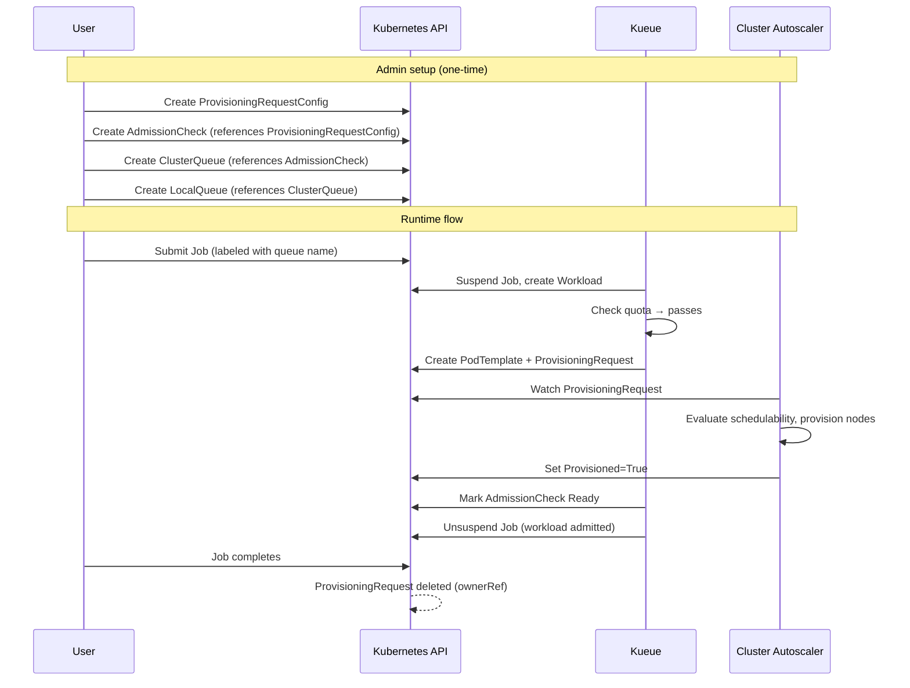
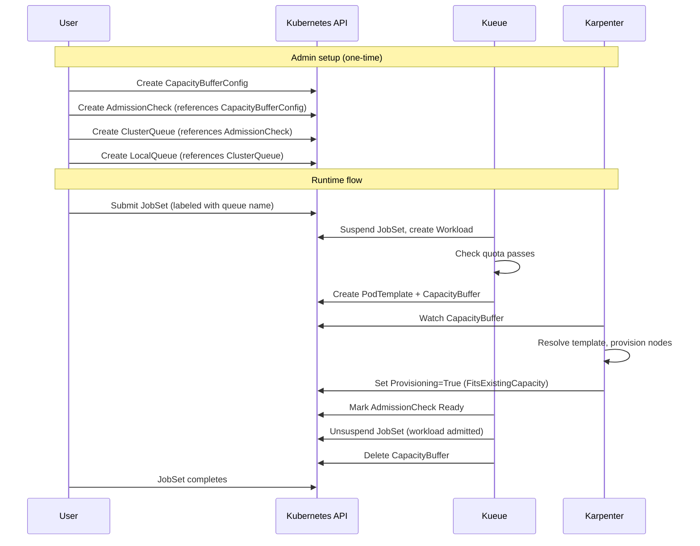

# KEP-5133: CapacityBuffer support

<!-- toc -->
- [Summary](#summary)
- [Motivation](#motivation)
  - [Goals](#goals)
  - [Non-Goals](#non-goals)
  - [User Experience Goals](#user-experience-goals)
- [Background: How Kueue Works with ProvisioningRequest Today](#background-how-kueue-works-with-provisioningrequest-today)
  - [Flow](#flow)
  - [Admin setup](#admin-setup)
  - [Runtime behavior](#runtime-behavior)
  - [Status signals](#status-signals)
  - [BookingExpired](#bookingexpired)
  - [Failure and retry](#failure-and-retry)
  - [Why this does not work for Karpenter](#why-this-does-not-work-for-karpenter)
- [Proposal](#proposal)
  - [Milestone 1 - Basic integration](#milestone-1---basic-integration)
  - [Milestone 2 - Infeasibility detection](#milestone-2---infeasibility-detection)
  - [Risks and Mitigations](#risks-and-mitigations)
    - [Overprovisioning](#overprovisioning)
    - [Wrong pod consumption race](#wrong-pod-consumption-race)
    - [No infeasibility detection](#no-infeasibility-detection)
    - [Prolonged unavailability holding quota](#prolonged-unavailability-holding-quota)
    - [CapacityBuffer API is not yet GA](#capacitybuffer-api-is-not-yet-ga)
- [Design Details](#design-details)
  - [CapacityBuffer status conditions](#capacitybuffer-status-conditions)
  - [CapacityBuffer lifecycle](#capacitybuffer-lifecycle)
  - [CapacityBufferConfig](#capacitybufferconfig)
  - [Worked example: heterogeneous JobSet](#worked-example-heterogeneous-jobset)
    - [Admin setup](#admin-setup-1)
    - [User workload](#user-workload)
  - [Test Plan](#test-plan)
    - [Unit tests](#unit-tests)
    - [Integration tests](#integration-tests)
  - [Graduation Criteria](#graduation-criteria)
- [Appendix: Sniping prevention](#appendix-sniping-prevention)
<!-- /toc -->

## Summary

Introduce an [AdmissionCheck](https://github.com/kubernetes-sigs/kueue/tree/main/keps/993-two-phase-admission) that uses [`CapacityBuffer`](https://github.com/kubernetes/autoscaler/blob/master/cluster-autoscaler/proposals/buffers.md) to ensure that there is enough capacity in the cluster before admitting a workload. This enables integration with autoscalers like Karpenter that implement the CapacityBuffer API to provision and verify capacity ahead of workload admission.

## Motivation

Kueue currently supports ensuring there is enough capacity in the cluster before admitting workloads via [ProvisioningRequest](https://github.com/kubernetes-sigs/kueue/tree/main/keps/1136-provisioning-request-support) with Cluster Autoscaler. However, autoscalers like Karpenter do not implement ProvisioningRequest and instead use `CapacityBuffer` as their capacity reservation mechanism. To enable Kueue integration with Karpenter and other autoscalers implementing the CapacityBuffer API, we need an AdmissionCheck backed by CapacityBuffer.

### Goals

* Provide Kueue integration with `CapacityBuffer` as an AdmissionCheck.
* Define a configuration CRD (`CapacityBufferConfig`) that controls how Kueue creates CapacityBuffers from workloads.
* Manage the CapacityBuffer lifecycle to prevent unnecessary capacity overprovisioning after workload admission.

### Non-Goals

* Define underlying cloud-specific behavior.
* Implement capped buffers (upstream SIG-Autoscaling API evolution).

### User Experience Goals

* **Workloads are not admitted unless capacity can be provisioned.** Kueue waits for the autoscaler to confirm capacity before admitting. (Milestone 1)
* **Workloads waiting for prolonged unavailability should eventually release quota.** `timeoutSeconds` in CapacityBufferConfig. (Milestone 1)
* **Structurally infeasible workloads are eventually rejected.** Quota is released for other workloads rather than held forever. (Milestone 2 - requires infeasibility signal from autoscaler)

Future:
* **The autoscaler does not overscale for admitted workloads.** Requires capped buffers upstream so the autoscaler knows consumption is intentional and does not refill.
* **Admitted workloads are guaranteed to be bound without being sniped.** See Appendix.


## Background: How Kueue Works with ProvisioningRequest Today

Kueue's existing mechanism for ensuring capacity before admitting workloads is the ProvisioningRequest AdmissionCheck, which integrates with Cluster Autoscaler (CAS).

### Flow



### Admin setup

The integration requires four objects configured by the cluster admin:

- **ProvisioningRequestConfig**: Configures how Kueue creates ProvisioningRequests - the provisioning class (check-only vs provision), managed resources, retry strategy, and pod targeting. See [ProvisioningRequestConfig types](https://github.com/kubernetes-sigs/kueue/blob/main/apis/kueue/v1beta2/provisioningrequestconfig_types.go) for the full spec.
- **AdmissionCheck**: References the ProvisioningRequestConfig and registers itself with controller name `kueue.x-k8s.io/provisioning-request`.
- **ClusterQueue**: Lists the AdmissionCheck, so any workload admitted through this queue must pass the capacity check.
- **LocalQueue**: Namespace-scoped entry point that references the ClusterQueue.

### Runtime behavior

When a user submits a Job labeled with a LocalQueue name:

1. Kueue suspends the Job and creates a Workload object.
2. Kueue checks quota against the ClusterQueue. If quota is available, it reserves it.
3. Kueue sees the AdmissionCheck requirement, creates a PodTemplate (shaped from the workload's PodSets) and a ProvisioningRequest referencing it.
4. CAS picks up the ProvisioningRequest, evaluates whether existing capacity satisfies it, and provisions nodes if needed.
5. CAS sets status conditions on the ProvisioningRequest to signal the outcome.

Once CAS sets `Provisioned=True`, it does not revisit the request. Workloads consuming the provisioned nodes do not trigger additional provisioning - there is no ongoing "maintain spare capacity" semantic. The provisioned nodes become regular cluster nodes subject to normal scale-down rules.

### Status signals

| Condition | Meaning | Kueue response |
|-----------|---------|----------------|
| `Provisioned=True` | Capacity is available | Mark AdmissionCheck Ready, admit workload |
| `Provisioned=False` (no terminal condition) | CAS is still working on it (e.g., ICE, waiting for nodes) | Keep waiting |
| `Failed=True` | Structurally infeasible (no node group can satisfy the request) | Retry or reject |
| `BookingExpired=True` | Provisioned capacity was not consumed within the reservation period | Retry or reject |

### BookingExpired

After CAS sets `Provisioned=True`, it starts a 10-minute reservation period. If no pods land on the provisioned nodes within that window (e.g., due to image pull errors, configuration bugs, or delays in workload admission), CAS sets `BookingExpired=True` and releases scale-down protection on the nodes. Empty nodes are then deleted to avoid paying for unused capacity. This is a cost-protection mechanism against ghost provisioning where capacity is successfully created but never utilized.

### Failure and retry

ProvisioningRequest is imperative and one-shot. If CAS sets `Failed=True` or `BookingExpired=True`, the ProvisioningRequest is terminal and cannot be reused. Kueue handles retries by:

1. Deleting the failed ProvisioningRequest.
2. Waiting for a backoff interval (default: exponential starting at 1 minute, up to 30 minutes).
3. Creating a new ProvisioningRequest (suffixed `-2`, `-3`, etc.).
4. After exhausting retries (default: 3 attempts), marking the AdmissionCheck as `Rejected` and releasing quota for other workloads.

Additionally, the `best-effort-atomic-scale-up` provisioning class supports a `ValidUntilSeconds` parameter. This is a timeout measured from the ProvisioningRequest's creation time. If CAS cannot provision capacity within that window, it sets `Failed=True`, triggering the retry/rejection flow above. This prevents a ProvisioningRequest from waiting indefinitely when capacity is persistently unavailable (e.g., prolonged ICE). The timeout is configured in `ProvisioningRequestConfig.parameters` and passed through to the ProvisioningRequest by Kueue.

### Why this does not work for Karpenter

ProvisioningRequest is an imperative, one-shot API. The caller creates it, the autoscaler processes it once, and the result is terminal. This model does not align with Karpenter's architecture:

- **Karpenter is declarative.** It continuously reconciles desired state rather than processing one-shot requests. CapacityBuffer fits this model: the autoscaler watches the buffer and continuously works toward satisfying it.
- **Karpenter does not implement ProvisioningRequest.** The API is CAS-specific and there are no plans to implement it in Karpenter.
- **Retry semantics differ.** With a declarative API, the "temporarily unavailable" case (ICE, quota limits) requires no retry configuration from the Kueue side. The autoscaler keeps reconciling automatically. Only the "structurally infeasible" case requires an explicit signal from the autoscaler so that Kueue can stop waiting (see Milestone 2).

## Proposal

* Introduce a new controller in Kueue that will act as an AdmissionCheck based on the status of created `CapacityBuffer` objects.

* Introduce a new cluster-scoped CRD (`CapacityBufferConfig`) to configure how `CapacityBuffer` objects should be created from workloads.

### Milestone 1 - Basic integration

* On quota reservation, the controller creates a `CapacityBuffer` shaped from the workload's PodSets. The autoscaler provisions capacity and reports readiness, which indicates to Kueue that it can go ahead and admit the workload.

* Because CapacityBuffers today do not support being filled by workloads, admitted workloads consuming the buffered capacity causes the autoscaler to refill the buffer, leading to overprovisioning. To prevent this, Kueue deletes the CapacityBuffer on admission.

* If `timeoutSeconds` is configured and the buffer does not reach `FitsExistingCapacity` within that duration, Kueue sets the AdmissionCheck to `Retry`. This evicts the workload and releases quota. The workload re-enters the queue and on re-admission, a new CapacityBuffer is created.

### Milestone 2 - Infeasibility detection

* The autoscaler signals through the CapacityBuffer status when a request is infeasible, allowing Kueue to reject the AdmissionCheck and release quota for other workloads. Tracked in [kubernetes-sigs/karpenter#3223](https://github.com/kubernetes-sigs/karpenter/issues/3223).


### Risks and Mitigations

#### Overprovisioning

CapacityBuffers are designed to maintain a fixed amount of spare capacity in the cluster. When any pod consumes that capacity, the autoscaler refills the buffer, this is working as intended. However, in the Kueue integration, the workload consuming the buffer is the *intended* consumer, and refilling is unnecessary. Because CapacityBuffers today do not support the concept of being "filled" by a matching workload (capped buffers, an upstream proposal, would address this but has not landed), the autoscaler cannot distinguish between intended consumption and unrelated consumption.

Mitigation: Kueue deletes the CapacityBuffer on admission to stop the refill cycle. Between the buffer signaling readiness and Kueue deleting it, there is a small window where the autoscaler could start refilling if something else consumes the capacity. In practice this window is negligible (single reconcile loop). Capped buffers upstream would eliminate this race entirely by letting the autoscaler recognize intended consumption.

#### Wrong pod consumption race

Between the buffer capacity being provisioned and the workload pods being scheduled, an unrelated pod could consume the buffered capacity. This is the same class of race that exists with ProvisioningRequest today. See Appendix for prevention approaches.

#### No infeasibility detection

Without a clear infeasibility signal from the autoscaler, Kueue cannot distinguish between "still provisioning" and "infeasible." This means a workload with an infeasible request will hold its quota reservation indefinitely while waiting for a check that will never pass.

Mitigation: This is being tracked in [kubernetes-sigs/karpenter#3223](https://github.com/kubernetes-sigs/karpenter/issues/3223). Once resolved, Kueue can detect infeasibility and reject the AdmissionCheck (see Milestone 2).

#### Prolonged unavailability holding quota

Even when a request is not structurally infeasible, capacity may remain unavailable for an extended period (e.g., prolonged ICE across an entire region). During this time, the workload holds its quota reservation, potentially blocking other workloads that could use different capacity. This is the same behavior as ProvisioningRequest when CAS has not yet set `Failed=True` - quota is held until the autoscaler succeeds or signals failure.

Mitigation: `timeoutSeconds` in CapacityBufferConfig. Kueue tracks the buffer's creation time and sets the AdmissionCheck to `Retry` if the configured duration is exceeded. Unlike ProvisioningRequest's `ValidUntilSeconds` which is enforced by CAS, this timeout is enforced by Kueue directly, no autoscaler changes needed. If unset, Kueue waits indefinitely (same as ProvisioningRequest without `ValidUntilSeconds`).

#### CapacityBuffer API is not yet GA

The CapacityBuffer API has not yet graduated to GA and remains behind a feature gate in autoscaler implementations. The API may change before GA.

Mitigation: This feature is gated behind `CapacityBufferACC` and tied to alpha stage. API changes will be tracked and adapted as the upstream API evolves.

## Design Details

This section describes how Kueue integrates with the CapacityBuffer API to pre-provision capacity for workloads before admission. The integration follows the same pattern as ProvisioningRequest: create a capacity request, wait for readiness, admit the workload, and clean up.

### CapacityBuffer status conditions

The CapacityBuffer API exposes two status conditions that Kueue reacts to:

| Condition | Status | Reason | Meaning |
|-----------|--------|--------|--------|
| `ReadyForProvisioning` | `True` | - | Pod template resolved, replicas computed. Buffer is ready for the provisioner. |
| `ReadyForProvisioning` | `False` | `InvalidPodTemplate` | Resolution failed (e.g., missing PodTemplate reference, invalid scalableRef target). |
| `Provisioning` | `True` | `FitsExistingCapacity` | All virtual pods fit on existing nodes. Capacity is ready. |
| `Provisioning` | `False` | `RequiresNewCapacity` | Virtual pods need new nodes. Autoscaler is working on provisioning. |
| `Provisioning` | `False` | `NotReadyForProvisioning` | Buffer has not been resolved yet. |
| `Provisioning` | `False` | `BufferEmpty` | Replicas are zero (buffer has been scaled down). |

Kueue maps these to AdmissionCheck states:

* `Provisioning=True` + `FitsExistingCapacity` - AdmissionCheck `Ready`
* `Provisioning=False` + `RequiresNewCapacity` - AdmissionCheck `Pending`
* `Provisioning=False` + `NotReadyForProvisioning` - AdmissionCheck `Pending`
* `Provisioning=False` + `BufferEmpty` - AdmissionCheck `Pending`
* `ReadyForProvisioning=False` - AdmissionCheck `Pending`
* Timeout expires (`timeoutSeconds` exceeded) - AdmissionCheck `Retry` (workload evicted and re-enters queue)
* Infeasibility signal from autoscaler (Milestone 2, exact condition TBD per [#3223](https://github.com/kubernetes-sigs/karpenter/issues/3223)) - AdmissionCheck `Rejected` (workload deactivated, admin must fix)

Note: Since Kueue creates the PodTemplate itself, `ReadyForProvisioning=False` should not occur in normal operation. It is treated as `Pending` (not `Rejected`) because it likely reflects a transient race condition that resolves on its own. If it does not resolve, `timeoutSeconds` handles it via `Retry`.

### CapacityBuffer lifecycle



**How it works:**

1. The user submits a JobSet labeled with a queue name. Kueue suspends it and creates a Workload object.
2. Kueue checks quota against the ClusterQueue. If quota is available, it reserves it.
3. Kueue sees the AdmissionCheck requirement, creates a PodTemplate (shaped from the workload's PodSets) and a CapacityBuffer referencing it.
4. Karpenter picks up the CapacityBuffer, resolves the pod template, and provisions nodes to satisfy the buffer's replicas.
5. Once all virtual pods fit on existing capacity, Karpenter sets `Provisioning=True` with reason `FitsExistingCapacity`.
6. Kueue sees the condition, marks the AdmissionCheck as `Ready`, unsuspends the JobSet, and deletes the CapacityBuffer. Workload pods schedule onto the provisioned capacity via normal scheduling.

Kueue evicts the workload if any of the following occur. Eviction is Kueue's internal action of revoking admission, it removes the quota reservation, re-suspends the underlying Job, and deletes all associated resources (CapacityBuffers, PodTemplates):

* `timeoutSeconds` elapses before step 5 (buffer does not reach `FitsExistingCapacity` in time)
* A higher-priority workload needs the quota (preemption)
* The ClusterQueue is deactivated by an admin
* The workload is deactivated by the user (`.spec.active` set to `false`)
* An AdmissionCheck is rejected (Milestone 2: infeasibility detected)

On eviction, the workload re-enters the queue. If later re-admitted, new CapacityBuffers are created.

**Why delete on admission?** The CapacityBuffer's purpose is to pre-provision capacity and signal readiness. Once capacity is confirmed and the workload is admitted, the buffer is no longer needed. This matches ProvisioningRequest's behavior where the request becomes terminal after success. Karpenter's `consolidateAfter` setting controls how long nodes are protected from consolidation after becoming ready. Customers should tune this value to ensure workload pods have time to schedule before nodes become consolidation candidates. If set to zero, it is possible for nodes to be consolidated before workload pods land.

### CapacityBufferConfig

The `CapacityBufferConfig` CRD configures how the controller creates `CapacityBuffer` objects from workloads. It is intentionally minimal compared to `ProvisioningRequestConfig`:

| ProvisioningRequestConfig field | CapacityBufferConfig | Rationale |
|---------------------------------|---------------------|------------|
| `provisioningClassName` | Hardcoded | CapacityBuffer has an analogous `provisioningStrategy` field. The only strategy today is `buffer.x-k8s.io/active-capacity`, which actively scales up the cluster by creating placeholder (virtual) pods that trigger the autoscaler to provision nodes. Kueue hardcodes this value when creating CapacityBuffers. If new strategies are introduced upstream, this can be exposed in the config. |
| `parameters` | `timeoutSeconds` | CapacityBuffer does not accept arbitrary key-value parameters. Instead, a dedicated `timeoutSeconds` field is added to CapacityBufferConfig. Unlike ProvisioningRequest where `ValidUntilSeconds` is passed to CAS for autoscaler-side enforcement, this timeout is enforced by Kueue directly. If the buffer does not reach `FitsExistingCapacity` within the configured duration, Kueue sets the AdmissionCheck to `Retry` and releases quota. |
| `managedResources` | **Kept** | Same purpose: only create buffers for PodSets requesting these resources (e.g., only GPUs). |
| `retryStrategy` | Dropped | CapacityBuffer is declarative - the autoscaler continuously reconciles. There is no failure-and-recreate cycle requiring retry logic. |
| `podSetUpdates` | Future | Toleration injection needed when taints are implemented for sniping prevention (see Appendix). |
| `podSetMergePolicy` | Dropped | Always one buffer per PodSet. The autoscaler handles cross-buffer binpacking. |

This leaves `managedResources` and `timeoutSeconds` as the configuration fields. Without `managedResources`, every PodSet would get a CapacityBuffer regardless of whether its resources need pre-provisioning (e.g., a CPU-only dataloader PodSet alongside a GPU trainer). The config lets admins scope the check to expensive or scarce resources. Without `timeoutSeconds`, workloads wait indefinitely for capacity.

The CRD follows the same pattern as ProvisioningRequestConfig: it is referenced by an AdmissionCheck and applies to all workloads admitted through the associated ClusterQueue. It is introduced as part of the alpha release, gated behind the `CapacityBufferACC` feature gate.

```go
// CapacityBufferConfig is the Schema for the capacitybufferconfig API
// +kubebuilder:resource:scope=Cluster,shortName={cbc}
type CapacityBufferConfig struct {
	metav1.TypeMeta   `json:",inline"`
	metav1.ObjectMeta `json:"metadata,omitempty"`

	Spec CapacityBufferConfigSpec `json:"spec"`
}

type CapacityBufferConfigSpec struct {
	// managedResources contains the list of resources managed by this check.
	//
	// If empty, all resources are considered managed.
	//
	// If not empty, the CapacityBuffer will contain only the podsets that are
	// requesting at least one of them.
	//
	// If none of the workload's podsets is requesting at least a managed resource,
	// the workload is considered ready.
	//
	// +optional
	// +listType=set
	// +kubebuilder:validation:MaxItems=100
	ManagedResources []corev1.ResourceName `json:"managedResources,omitempty"`

	// timeoutSeconds is how long Kueue waits for the CapacityBuffer to reach
	// FitsExistingCapacity before setting the AdmissionCheck to Retry and releasing quota.
	// If unset, Kueue waits indefinitely.
	//
	// +optional
	// +kubebuilder:validation:Minimum=1
	TimeoutSeconds *int32 `json:"timeoutSeconds,omitempty"`
}
```

### Worked example: heterogeneous JobSet

#### Admin setup

```yaml
apiVersion: kueue.x-k8s.io/v1beta1
kind: CapacityBufferConfig
metadata:
  name: gpu-buffer-config
spec:
  managedResources:
  - nvidia.com/gpu
---
apiVersion: kueue.x-k8s.io/v1beta1
kind: AdmissionCheck
metadata:
  name: capacity-buffer-check
spec:
  controllerName: kueue.x-k8s.io/capacity-buffer
  parameters:
    apiGroup: kueue.x-k8s.io
    kind: CapacityBufferConfig
    name: gpu-buffer-config
---
apiVersion: kueue.x-k8s.io/v1beta1
kind: ClusterQueue
metadata:
  name: gpu-cluster-queue
spec:
  admissionChecks:
  - name: capacity-buffer-check
  resourceGroups:
  - coveredResources: ["cpu", "memory", "nvidia.com/gpu"]
    # Flavors represent different pools of the same resource (e.g., on-demand vs spot,
    # or different GPU types). A single "default" flavor is the simplest configuration.
    flavors:
    - name: default
      resources:
      - name: "cpu"
        nominalQuota: 100
      - name: "memory"
        nominalQuota: 1000Gi
      - name: "nvidia.com/gpu"
        nominalQuota: 64
---
apiVersion: kueue.x-k8s.io/v1beta1
kind: LocalQueue
metadata:
  name: user-queue
  namespace: training
spec:
  clusterQueue: gpu-cluster-queue
```

#### User workload

Consider a training JobSet with two PodSets requesting different resource shapes:

```yaml
apiVersion: jobset.x-k8s.io/v1alpha2
kind: JobSet
metadata:
  name: training-job
  labels:
    kueue.x-k8s.io/queue-name: user-queue
spec:
  replicatedJobs:
  - name: trainer
    replicas: 4
    template:
      spec:
        template:
          spec:
            containers:
            - name: trainer
              resources:
                requests:
                  nvidia.com/gpu: 8
                  memory: 128Gi
  - name: dataloader
    replicas: 2
    template:
      spec:
        template:
          spec:
            containers:
            - name: loader
              resources:
                requests:
                  cpu: "16"
                  memory: 64Gi
```

When this workload passes quota, Kueue evaluates each PodSet against `managedResources: [nvidia.com/gpu]`:

1. `trainer` requests `nvidia.com/gpu` - **matches**. Kueue creates a CapacityBuffer with a PodTemplate requesting `nvidia.com/gpu: 8, memory: 128Gi`, replicas: 4.
2. `dataloader` requests only `cpu` and `memory` - **does not match**. No CapacityBuffer created for this PodSet.

The AdmissionCheck is marked `Ready` when the trainer buffer reaches `Provisioning=True`. The dataloader pods rely on normal scheduling.

If the admin wanted both PodSets buffered (e.g., in a capacity-constrained cluster), they would add `cpu` to `managedResources`. In that case, Kueue creates one buffer per matching PodSet, and the check is `Ready` only when **all** buffers reach `Provisioning=True`. Each CapacityBuffer references a single PodTemplate, so heterogeneous PodSets require one buffer per shape. The autoscaler handles cross-buffer binpacking when scheduling virtual pods.


### Test Plan

#### Unit tests

* Controller logic for creating CapacityBuffers from workload PodSets.
* Status condition handling (mapping buffer conditions to admission check states).
* Buffer lifecycle transitions (deletion on admission, deletion on eviction).
* ManagedResources filtering (skipping podsets that don't request managed resources).

#### Integration tests

* End-to-end flow: workload submitted, buffer created, check Ready, workload admitted, buffer deleted.
* Workload eviction: buffer cleaned up, re-created on re-admission.
* Timeout: buffer pending beyond `timeoutSeconds` leads to check Retry and re-queue.
* ManagedResources: workload with no managed resources passes check immediately.

### Graduation Criteria

This feature will follow the standard Kueue graduation process:

* Alpha: behind `CapacityBufferACC` feature gate, basic integration (Milestone 1).
* Beta: infeasibility detection available (Milestone 2).
* Stable: once capped buffers land upstream, the overprovisioning race during the window between capacity confirmation and buffer deletion is eliminated, since the autoscaler can recognize intended consumption and will not refill.

## Appendix: Sniping prevention

Between the buffer capacity being provisioned and the workload pods being scheduled, an unrelated pod could consume the buffered capacity (sniping). Today, sniping is recovered from but not prevented:

- If sniping occurs **after** admission (buffer deleted): workload pods are pending, Karpenter sees pending pods and provisions new nodes via normal autoscaling.
- If sniping occurs **before** admission (buffer alive): the buffer controller may detect that virtual pods no longer fit and flip the condition back to `RequiresNewCapacity`, keeping the AdmissionCheck in `Pending` state. However, if Kueue reads a stale `FitsExistingCapacity` before the buffer controller re-evaluates, it admits on stale data and the workload falls back to normal autoscaling recovery.

Preventing sniping entirely requires node-level exclusion. One approach is using a dedicated NodePool with static taints. The admin creates a NodePool with a taint (e.g., `dedicated=ml-buffer:NoSchedule`), and the buffer's PodTemplate includes a matching toleration and nodeSelector targeting that NodePool. Kueue would inject the same toleration into workload pods via `podSetUpdates`. This works with existing Karpenter machinery but has trade-offs:

* Higher orchestration cost (admin must create and manage dedicated NodePools for buffer workloads)
* Not per-buffer isolation (all buffers on the same NodePool share the same taint, so cross-buffer sniping is still possible)
* Node underutilization: tainted nodes only accept pods with the matching toleration. Spare capacity on those nodes (CPU, memory not consumed by the workload) cannot be used by other pods, leading to wasted resources for the lifetime of the node.

This is not part of the current proposal but may be explored in a future iteration.

