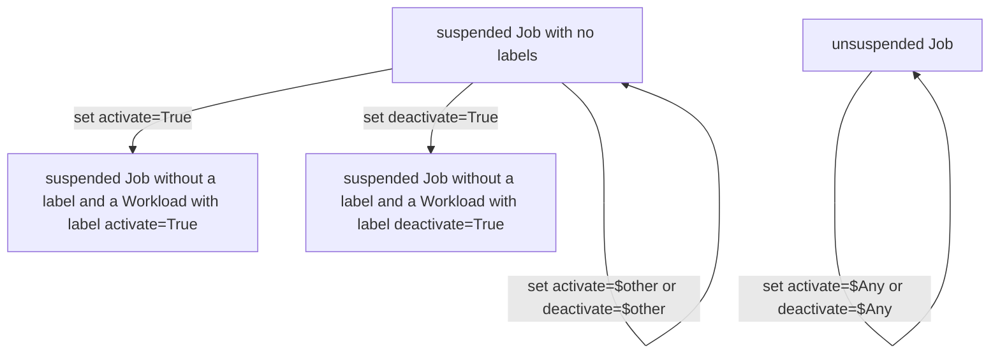
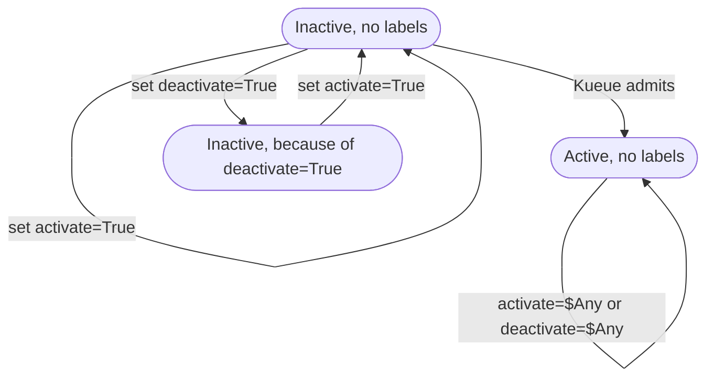

# KEP-6915: SchedulingGatedBy annotation to control Workload creation

<!--
This is the title of your KEP. Keep it short, simple, and descriptive. A good
title can help communicate what the KEP is and should be considered as part of
any review.
-->

<!--
A table of contents is helpful for quickly jumping to sections of a KEP and for
highlighting any additional information provided beyond the standard KEP
template.

Ensure the TOC is wrapped with
  <code>&lt;!-- toc --&rt;&lt;!-- /toc --&rt;</code>
tags, and then generate with `hack/update-toc.sh`.
-->

<!-- toc -->
- [Summary](#summary)
- [Motivation](#motivation)
  - [Goals](#goals)
  - [Non-Goals](#non-goals)
- [Proposal](#proposal)
  - [Behavior](#behavior)
  - [User Stories](#user-stories)
    - [Story 1](#story-1)
  - [Notes/Constraints/Caveats](#notesconstraintscaveats)
  - [Risks and Mitigations](#risks-and-mitigations)
- [Design Details](#design-details)
  - [Implementation](#implementation)
  - [Test Plan](#test-plan)
      - [Prerequisite testing updates](#prerequisite-testing-updates)
    - [Unit Tests](#unit-tests)
    - [Integration tests](#integration-tests)
      - [Toggle Workload Creation via Annotation Removal](#toggle-workload-creation-via-annotation-removal)
      - [Forbid adding SchedulingGatedBy post creation](#forbid-adding-schedulinggatedby-post-creation)
      - [Forbid using a SchedulingGatedBy that is not domain-like](#forbid-using-a-schedulinggatedby-that-is-not-domain-like)
  - [Graduation Criteria](#graduation-criteria)
- [Implementation History](#implementation-history)
- [Drawbacks](#drawbacks)
- [Alternatives](#alternatives)
  - [Label-based Activation/Deactivation Approach](#label-based-activationdeactivation-approach)
    - [Job Controller State Transitions](#job-controller-state-transitions)
    - [Workload Controller State Transitions](#workload-controller-state-transitions)
    - [Usage Pattern](#usage-pattern)
    - [Why This Approach is Deferred](#why-this-approach-is-deferred)
    - [What are the benefit of this approach over SchedulingGatedBy](#what-are-the-benefit-of-this-approach-over-schedulinggatedby)
  - [Admission policy-based activation or queue-level configuration](#admission-policy-based-activation-or-queue-level-configuration)
  - [Direct Workload Interaction](#direct-workload-interaction)
<!-- /toc -->

## Summary

<!--
This section is incredibly important for producing high-quality, user-focused
documentation such as release notes or a development roadmap. It should be
possible to collect this information before implementation begins, in order to
avoid requiring implementors to split their attention between writing release
notes and implementing the feature itself. KEP editors and SIG Docs
should help to ensure that the tone and content of the `Summary` section is
useful for a wide audience.

A good summary is probably at least a paragraph in length.

Both in this section and below, follow the guidelines of the [documentation
style guide]. In particular, wrap lines to a reasonable length, to make it
easier for reviewers to cite specific portions, and to minimize diff churn on
updates.

[documentation style guide]: https://github.com/kubernetes/community/blob/master/contributors/guide/style-guide.md
-->

Introduce annotation `kueue.x-k8s.io/scheduling-gated-by` on supported Job-like objects to defer Workload creation. The annotation value must specify a controller name in domain-like format (e.g., `example.com/mygate`), similar to the `spec.managedBy` field in Jobs. When present, Kueue does not create a Workload object for the Job, consistent with the existing `JobWithSkip` interface behavior. Removing the annotation enables Kueue to create the Workload and proceed with normal admission and scheduling flow. For the alpha release, the annotation can only be set at Job creation time and cannot be added later; it can only be removed.

## Motivation

<!--
This section is for explicitly listing the motivation, goals, and non-goals of
this KEP.  Describe why the change is important and the benefits to users. The
motivation section can optionally provide links to [experience reports] to
demonstrate the interest in a KEP within the wider Kubernetes community.

[experience reports]: https://github.com/golang/go/wiki/ExperienceReports
-->

Provide explicit user control over activation by interacting directly with the Job objects.

### Goals

<!--
List the specific goals of the KEP. What is it trying to achieve? How will we
know that this has succeeded?
-->

- Respect annotation at Job creation time
- Prevent adding annotation after Job creation (validation for alpha)
- Enforce domain-like format for annotation value (e.g., `example.com/mygate`)
- Ensure consistent behavior without breaking queue semantics

### Non-Goals

<!--
What is out of scope for this KEP? Listing non-goals helps to focus discussion
and make progress.
-->

- New CRDs or scheduler policy changes
- Supporting multiple SchedulingGatedBy annotations for 1 Job

## Proposal

<!--
This is where we get down to the specifics of what the proposal actually is.
This should have enough detail that reviewers can understand exactly what
you're proposing, but should not include things like API designs or
implementation. What is the desired outcome and how do we measure success?.
The "Design Details" section below is for the real
nitty-gritty.
-->

### Behavior

- Kueue managed Jobs can have an annotation `kueue.x-k8s.io/scheduling-gated-by` at creation time
- The annotation value must conform to a domain-like format (e.g., `example.com/mygate`), similar to the `spec.managedBy` field in Kubernetes Jobs
- **Validation rules (alpha):**
  - The annotation can only be set at Job creation time
  - Adding the annotation after Job creation is prevented by validation
  - The annotation can only be removed, not modified
- **When annotation is present:** Kueue does not create a Workload object for the Job, consistent with the existing `JobWithSkip` interface behavior when `Skip(ctx)` returns true
- **When annotation is removed:** Jobs follow the standard Kueue workflow (Workload created immediately)
- Jobs without the annotation follow the standard Kueue workflow (Workload created immediately)

### User Stories

<!--
Detail the things that people will be able to do if this KEP is implemented.
Include as much detail as possible so that people can understand the "how" of
the system. The goal here is to make this feel real for users without getting
bogged down.
-->

#### Story 1

A user is preparing a Job but does not want Kueue to admit it yet. They create the Job
with the annotation `kueue.x-k8s.io/scheduling-gated-by: "example.com/mygate"`.

Kueue detects the annotation and does not create a Workload object for this Job. The Job
remains in a gated state, not subject to Kueue's admission checks or scheduling decisions.

Later, when the user is ready for Kueue to manage the Job, they remove the annotation.

Kueue detects the annotation removal, creates the Workload object, and proceeds with
normal admission checks and scheduling. The Job now flows through the standard Kueue
workflow.

### Notes/Constraints/Caveats

<!--
What are the caveats to the proposal?
What are some important details that didn't come across above?
Go in to as much detail as necessary here.
This might be a good place to talk about core concepts and how they relate.
-->

This feature enables users to defer Workload creation for their Jobs by using an annotation at Job creation time. The annotation acts as a scheduling gate, preventing Kueue from creating the associated Workload object until the annotation is removed. This is consistent with the existing `JobWithSkip` interface pattern in Kueue.

### Risks and Mitigations

<!--
What are the risks of this proposal, and how do we mitigate? Think broadly.
For example, consider both security and how this will impact the larger
Kubernetes ecosystem.

How will security be reviewed, and by whom?

How will UX be reviewed, and by whom?

Consider including folks who also work outside the SIG or subproject.
-->

- Risk: Uncontrolled accumulation of SchedulingGatedBy Jobs.
  - Mitigation: Document best practices and warn in status conditions (future).
- Risk: Users may not understand the implications of using the annotation.
  - Mitigation: Document the feature and provide examples.

## Design Details

<!--
This section should contain enough information that the specifics of your
change are understandable. This may include API specs (though not always
required) or even code snippets. If there's any ambiguity about HOW your
proposal will be implemented, this is the place to discuss them.
-->

- No new API fields required
- Annotation contract: `kueue.x-k8s.io/scheduling-gated-by` with domain-like format value (e.g., `example.com/mygate`)
- Validation enforces:
  - Annotation can only be set at Job creation time
  - Annotation cannot be added after creation (only removed)
  - Value must conform to domain-like format (similar to `spec.managedBy`)
- Feature gate: `SchedulingGatedBy` (Alpha, default off)

### Implementation

When the `kueue.x-k8s.io/scheduling-gated-by` annotation is present on a Job, the reconciler
skips creating the Workload object for that Job. This behavior is consistent with Jobs that
implement the `JobWithSkip` interface, where the `Skip(ctx)` method returns `true`.

The Kueue reconciler already continuously monitors Jobs for annotation changes. Therefore, when the annotation is removed:
1. The reconciler detects the change
2. The Workload enters the standard Kueue admission and scheduling flow because the SchedulingByGate annotation is no longer present

This approach leverages the existing Kueue patterns for conditional Workload creation.

### Test Plan

<!--
**Note:** *Not required until targeted at a release.*
The goal is to ensure that we don't accept enhancements with inadequate testing.

All code is expected to have adequate tests (eventually with coverage
expectations). Please adhere to the [Kubernetes testing guidelines][testing-guidelines]
when drafting this test plan.

[testing-guidelines]: https://git.k8s.io/community/contributors/devel/sig-testing/testing.md
-->

[x] I/we understand the owners of the involved components may require updates to
existing tests to make this code solid enough prior to committing the changes necessary
to implement this enhancement.

##### Prerequisite testing updates

<!--
Based on reviewers feedback describe what additional tests need to be added prior
implementing this enhancement to ensure the enhancements have also solid foundations.
-->

#### Unit Tests

<!--
In principle every added code should have complete unit test coverage, so providing
the exact set of tests will not bring additional value.
However, if complete unit test coverage is not possible, explain the reason of it
together with explanation why this is acceptable.
-->

<!--
Additionally, try to enumerate the core package you will be touching
to implement this enhancement and provide the current unit coverage for those
in the form of:
- <package>: <date> - <current test coverage>

This can inform certain test coverage improvements that we want to do before
extending the production code to implement this enhancement.
-->

- `<package>`: `<date>` - `<test coverage>`

#### Integration tests

<!--
Describe what tests will be added to ensure proper quality of the enhancement.

After the implementation PR is merged, add the names of the tests here.
-->

##### Toggle Workload Creation via Annotation Removal

1. Create Job with scheduling gate annotation requesting 0.1 CPU cores
   - Create a `batch/v1 Job` manifest with annotation `kueue.x-k8s.io/scheduling-gated-by: "example.com/mygate"`
2. Verify no Workload is created
   - Confirm that no corresponding `Workload` resource exists
   - Job remains in gated state
3. Patch the Job
   - Change its resource requirements to request 0.2 CPU cores
   - Remove the `kueue.x-k8s.io/scheduling-gated-by` annotation from the Job object
4. Observe Workload creation and activation
   - Wait for corresponding `Workload` resource to be created
   - Verify the Workload reflects the updated resource requirements
   - Verify the Workload enters the normal Kueue admission flow

##### Forbid adding SchedulingGatedBy post creation

1. Create Job without annotation
   - Create a `batch/v1 Job` manifest without the SchedulingGatedBy annotation
2. Attempt to add annotation after creation
   - Try to add `kueue.x-k8s.io/scheduling-gated-by` annotation to the existing Job
3. Verify validation prevents addition
   - Confirm the annotation addition is rejected by validation
   - Verify appropriate error message is returned

##### Forbid using a SchedulingGatedBy that is not domain-like

1. Create Job with non domain-like annotation value
   - Try to create a `batch/v1 Job` manifest with the annotation ``kueue.x-k8s.io/scheduling-gated-by="not a domain"`
2. Verify validation prevents creation
   - Confirm the object creation is rejected by validation
   - Verify appropriate error message is returned

### Graduation Criteria

<!--

Clearly define what it means for the feature to be implemented and
considered stable.

If the feature you are introducing has high complexity, consider adding graduation
milestones with these graduation criteria:
- [Maturity levels (`alpha`, `beta`, `stable`)][maturity-levels]
- [Feature gate][feature gate] lifecycle
- [Deprecation policy][deprecation-policy]

[feature gate]: https://git.k8s.io/community/contributors/devel/sig-architecture/feature-gates.md
[maturity-levels]: https://git.k8s.io/community/contributors/devel/sig-architecture/api_changes.md#alpha-beta-and-stable-versions
[deprecation-policy]: https://kubernetes.io/docs/reference/using-api/deprecation-policy/
-->

- Re-evaluate the activation-based approach (label-based design described in Alternatives)
- Re-evaluate adding the annotation later in the lifetime of a Job

## Implementation History

<!--
Major milestones in the lifecycle of a KEP should be tracked in this section.
Major milestones might include:
- the `Summary` and `Motivation` sections being merged, signaling SIG acceptance
- the `Proposal` section being merged, signaling agreement on a proposed design
- the date implementation started
- the first Kubernetes release where an initial version of the KEP was available
- the version of Kubernetes where the KEP graduated to general availability
- when the KEP was retired or superseded
-->

## Drawbacks

<!--
Why should this KEP _not_ be implemented?
-->

- Adds another control surface that can be misused  

## Alternatives

<!--
What other approaches did you consider, and why did you rule them out? These do
not need to be as detailed as the proposal, but should include enough
information to express the idea and why it was not acceptable.
-->

### Label-based Activation/Deactivation Approach

An alternative design allows users to interact directly with a managed Job object (where Job is a CR that Kueue manages like Job, PyTorchJob, Deployment, etc.) to declare their intent that Kueue should "deactivate" or "activate" it. They do this by using two labels:

- `kueue.x-k8s.io/activate=true`: Instructs Kueue to track this Job. The Job will flow through the normal Kueue path for admission checks and scheduling decisions.
- `kueue.x-k8s.io/deactivate=true`: Instructs Kueue to ignore this Job. Kueue will not consider this Job eligible for admission.

To keep things simple, a user can only manually activate/deactivate a suspended Job.

#### Job Controller State Transitions

The GenericJob controller in Kueue propagates the `activate=true` and `deactivate=true` labels to the Workload. If the labels have a value other than truth-y, it disregards them. Regardless of the value of the label, it removes the label from the Job object.

Here's the state-transition diagram for the Job object and the changes it makes to the associated Workload:

#### Workload Controller State Transitions

Below is how the Workload controller uses the labels to:

- Mark an already Inactive Workload as unschedulable: Place the inactive Workload in a state which guides Kueue to ignore it during admission checks.
- Mark an unschedulable Workload as "schedulable": Leave the inactive Workload in its inactive state, but allow Kueue to move it into the Active state using its regular admission checks.

#### Usage Pattern

The idea is to:

- Use `deactivate=true` to place a suspended Job into an inactive state and stop Kueue from ever scheduling this Job.
- Use `activate=true` to place a suspended and "ignored" Job back into an "inactive" state and allow Kueue to eventually unsuspend it whenever it chooses to do so.

#### Why This Approach is Deferred

This design is more complex than the proposed `SchedulingGatedBy` approach, as it requires:
- Managing two separate labels with specific semantics
- Handling state transitions between Active, Inactive, and InactiveManual states
- Propagating labels from Job to Workload and removing them from the Job
- More complex validation and reconciliation logic

Toggling on the ScheduleGatedBy annotation post creation of a Job may be reconsidered in future releases based on user feedback and requirements.

#### What are the benefit of this approach over SchedulingGatedBy

- It offers more flexibility for end-users. They could ScheduleGate a Job after it was created, patch it, and then restore it. For example, this is useful for dealing with Jobs that are queued for too long because they request too many resources. A controller could auto-patch such jobs with less resources to help them schedule faster.

### Admission policy-based activation or queue-level configuration

These methods do not allow per-job granularity and requires cluster admin intervention. In turn, they reduce flexibility for regular users.

### Direct Workload Interaction

Users could patch the Workload object directly and toggle spec.active between true and false. This requires RBAC permissions for users to enable modifying Kueue CRs.
Also, this would break abstraction as users will interact with internal Kueue objects instead of their own Jobs.