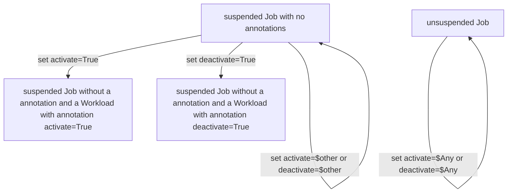
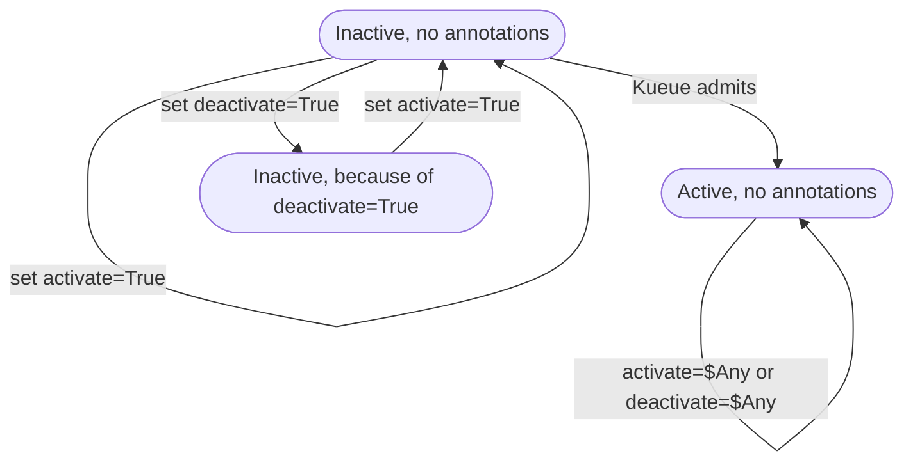

# KEP-6915: AdmissionGatedBy annotation to prevent admission immediately after creation

<!--
This is the title of your KEP. Keep it short, simple, and descriptive. A good
title can help communicate what the KEP is and should be considered as part of
any review.
-->

<!--
A table of contents is helpful for quickly jumping to sections of a KEP and for
highlighting any additional information provided beyond the standard KEP
template.

Ensure the TOC is wrapped with
  <code>&lt;!-- toc --&rt;&lt;!-- /toc --&rt;</code>
tags, and then generate with `hack/update-toc.sh`.
-->

<!-- toc -->
- [Summary](#summary)
- [Motivation](#motivation)
  - [Goals](#goals)
  - [Non-Goals](#non-goals)
- [Proposal](#proposal)
  - [Behavior](#behavior)
  - [User Stories](#user-stories)
    - [Story 1](#story-1)
  - [Notes/Constraints/Caveats](#notesconstraintscaveats)
    - [batch/v1 Job readinessGates discussion](#batchv1-job-readinessgates-discussion)
  - [Risks and Mitigations](#risks-and-mitigations)
- [Design Details](#design-details)
  - [Implementation Overview](#implementation-overview)
  - [Test Plan](#test-plan)
      - [Prerequisite testing updates](#prerequisite-testing-updates)
    - [Unit Tests](#unit-tests)
    - [Integration tests](#integration-tests)
  - [Graduation Criteria](#graduation-criteria)
    - [Alpha](#alpha)
    - [Beta](#beta)
- [Implementation History](#implementation-history)
- [Drawbacks](#drawbacks)
- [Alternatives](#alternatives)
  - [JSON values for AdmissionGatedBy annotation](#json-values-for-admissiongatedby-annotation)
  - [Gating the admission of Jobs past their creation time](#gating-the-admission-of-jobs-past-their-creation-time)
    - [Example Implementation: Annotation-based Activation](#example-implementation-annotation-based-activation)
      - [Job Controller State Transitions](#job-controller-state-transitions)
      - [Workload Controller State Transitions](#workload-controller-state-transitions)
      - [Usage Pattern](#usage-pattern)
    - [Why This Approach is Deferred](#why-this-approach-is-deferred)
    - [Benefits of This Approach over AdmissionGatedBy](#benefits-of-this-approach-over-admissiongatedby)
    - [Complexity of the Mechanism](#complexity-of-the-mechanism)
    - [Recommendation for Beta](#recommendation-for-beta)
  - [Admission policy-based activation or queue-level configuration](#admission-policy-based-activation-or-queue-level-configuration)
  - [Direct Workload Interaction](#direct-workload-interaction)
  - [Mutating Webhook to Patch Jobs at Creation Time](#mutating-webhook-to-patch-jobs-at-creation-time)
<!-- /toc -->

## Summary

<!--
This section is incredibly important for producing high-quality, user-focused
documentation such as release notes or a development roadmap. It should be
possible to collect this information before implementation begins, in order to
avoid requiring implementors to split their attention between writing release
notes and implementing the feature itself. KEP editors and SIG Docs
should help to ensure that the tone and content of the `Summary` section is
useful for a wide audience.

A good summary is probably at least a paragraph in length.

Both in this section and below, follow the guidelines of the [documentation
style guide]. In particular, wrap lines to a reasonable length, to make it
easier for reviewers to cite specific portions, and to minimize diff churn on
updates.

[documentation style guide]: https://github.com/kubernetes/community/blob/master/contributors/guide/style-guide.md
-->

Introduce the `kueue.x-k8s.io/admission-gated-by` annotation for supported Job-like 
objects to let users delay when Kueue starts admission. While the annotation is 
present, the Job remains "gated" and won't enter Kueue's normal admission flow. 
Removing the annotation releases the Job to proceed through standard Kueue admission.


## Motivation

<!--
This section is for explicitly listing the motivation, goals, and non-goals of
this KEP.  Describe why the change is important and the benefits to users. The
motivation section can optionally provide links to [experience reports] to
demonstrate the interest in a KEP within the wider Kubernetes community.

[experience reports]: https://github.com/golang/go/wiki/ExperienceReports
-->

Currently, once Kueue observes the creation of a managed Job, it creates the 
corresponding Workload and immediately starts considering it for admission.

This is problematic for workflows where an external controller needs to adjust the Job 
(for example, patch resource requests) before it should be eligible for admission.

### Goals

<!--
List the specific goals of the KEP. What is it trying to achieve? How will we
know that this has succeeded?
-->

- When a managed Job has `kueue.x-k8s.io/admission-gated-by` set, Kueue must not start 
  admission; once the annotation is removed, admission proceeds normally.


### Non-Goals

<!--
What is out of scope for this KEP? Listing non-goals helps to focus discussion
and make progress.
-->

- New CRDs or scheduler policy changes
- Support for adding the `kueue.x-k8s.io/admission-gated-by` annotation after the Job creation

## Proposal

<!--
This is where we get down to the specifics of what the proposal actually is.
This should have enough detail that reviewers can understand exactly what
you're proposing, but should not include things like API designs or
implementation. What is the desired outcome and how do we measure success?.
The "Design Details" section below is for the real
nitty-gritty.
-->

### Behavior

Kueue managed Jobs can have an annotation `kueue.x-k8s.io/admission-gated-by`
at creation time

- **When annotation is present:** Kueue does not consider the Job for admission.
- **When annotation is not present:** Jobs follow the standard Kueue workflow 

### User Stories

<!--
Detail the things that people will be able to do if this KEP is implemented.
Include as much detail as possible so that people can understand the "how" of
the system. The goal here is to make this feel real for users without getting
bogged down.
-->

#### Story 1

As a cluster administrator, I want to deploy a system that adjusts a Job’s resource requirements
using a prediction mechanism. Jobs are created by ML researchers, who may omit resource requests
or specify them inaccurately.

Because prediction takes time (e.g., ~1s per Job), I run it as a controller rather than a
creation-time webhook. While the controller is computing and patching requests, I need to ensure
Kueue does not begin admission prematurely.

The `kueue.x-k8s.io/admission-gated-by` annotation fills this gap: Jobs can be created in a gated
state, and the prediction controller removes the gate once resource requests are set,
allowing normal admission to proceed.

### Notes/Constraints/Caveats

<!--
What are the caveats to the proposal?
What are some important details that didn't come across above?
Go in to as much detail as necessary here.
This might be a good place to talk about core concepts and how they relate.
-->

#### batch/v1 Job readinessGates discussion

In Kubernetes, we are discussing about Job level `schedulingGate` field in 
<https://github.com/kubernetes/kubernetes/issues/121681>. But it is still 
under discussion, and it will take lots of time to release the feature to the
production cluster (enabled by default).

So, we decided to introduce `AdmissionGatedBy` annotations as a Kueue level.
We will revisit this annotation support if job-level readiness gates are accepted.

### Risks and Mitigations

<!--
What are the risks of this proposal, and how do we mitigate? Think broadly.
For example, consider both security and how this will impact the larger
Kubernetes ecosystem.

How will security be reviewed, and by whom?

How will UX be reviewed, and by whom?

Consider including folks who also work outside the SIG or subproject.
-->

- Risk: Uncontrolled accumulation of `AdmissionGatedBy` Jobs.
  - Mitigation: Document best practices and warn in status conditions (future).
- Risk: Users may not understand the implications of using the annotation.
  - Mitigation: Document the feature and provide examples.


## Design Details

<!--
This section should contain enough information that the specifics of your
change are understandable. This may include API specs (though not always
required) or even code snippets. If there's any ambiguity about HOW your
proposal will be implemented, this is the place to discuss them.
-->

Kueue managed Jobs can have an annotation `kueue.x-k8s.io/admission-gated-by`
at creation time.

- **When annotation is present:** Kueue does not admit the job.
- **When annotation is removed:** Jobs follow the standard Kueue admission workflow.
- Jobs without the annotation follow the standard Kueue admission workflow.

Validation enforces:

- Annotation contract: `kueue.x-k8s.io/admission-gated-by` is a comma separated string of 
  controller names (e.g., `example.com/mygate,example.com/mygate2`)
- Adding the annotation after Job creation is prevented by validation
- After creation, the annotation can only be completely removed, or modified
  to remove one or more controller names
- For each controller name, the characters before the first "/" must be a
  valid subdomain as defined by RFC 1123 and all characters trailing the
  first "/" must follow RFC 3986.
- Feature gate: `AdmissionGatedBy` (Alpha, default off)

### Implementation Overview

The Job reconciler copies the `kueue.x-k8s.io/admission-gated-by` annotation to the 
corresponding Workload object. As long as this annotation is present on the Workload, 
its `IsAdmissible()` method will return `false`.

For improved observability, Kueue emits events to the Workload object of such a Job:

- `AdmissionGated` when the workload is created with a non-empty `AdmissionGatedBy` annotation.
- `AdmissionGateCleared` when the workload is updated to remove the `AdmissionGatedBy` annotation.

Additionally, while the admission gate is active, the Workload will have a condition:

```yaml
type: QuotaReserved
status: False
reason: AdmissionGated
```

### Test Plan

<!--
**Note:** *Not required until targeted at a release.*
The goal is to ensure that we don't accept enhancements with inadequate testing.

All code is expected to have adequate tests (eventually with coverage
expectations). Please adhere to the [Kubernetes testing guidelines][testing-guidelines]
when drafting this test plan.

[testing-guidelines]: https://git.k8s.io/community/contributors/devel/sig-testing/testing.md
-->

[x] I/we understand the owners of the involved components may require updates to
existing tests to make this code solid enough prior to committing the changes necessary
to implement this enhancement.

##### Prerequisite testing updates

<!--
Based on reviewers feedback describe what additional tests need to be added prior
implementing this enhancement to ensure the enhancements have also solid foundations.
-->

#### Unit Tests

<!--
In principle every added code should have complete unit test coverage, so providing
the exact set of tests will not bring additional value.
However, if complete unit test coverage is not possible, explain the reason of it
together with explanation why this is acceptable.
-->

<!--
Additionally, try to enumerate the core package you will be touching
to implement this enhancement and provide the current unit coverage for those
in the form of:
- <package>: <date> - <current test coverage>

This can inform certain test coverage improvements that we want to do before
extending the production code to implement this enhancement.
-->

- `<package>`: `<date>` - `<test coverage>`

#### Integration tests

<!--
Describe what tests will be added to ensure proper quality of the enhancement.

After the implementation PR is merged, add the names of the tests here.
-->

The `AdmissionGatedBy` mechanism configures Kueue to not consider a Job it manages as
admissible for as long as there is at least one admission gate. It should work for any kind
of Job that Kueue supports.

Therefore, we should repeat the tests for all the supported Job types (including Job, JobSet, Pod, etc).

1. Verify the Job/Workload is not admitted while the annotation is present
2. Verify the Job/Workload gets admitted as soon as the annotation is released

### Graduation Criteria

<!--

Clearly define what it means for the feature to be implemented and
considered stable.

If the feature you are introducing has high complexity, consider adding graduation
milestones with these graduation criteria:
- [Maturity levels (`alpha`, `beta`, `stable`)][maturity-levels]
- [Feature gate][feature gate] lifecycle
- [Deprecation policy][deprecation-policy]

[feature gate]: https://git.k8s.io/community/contributors/devel/sig-architecture/feature-gates.md
[maturity-levels]: https://git.k8s.io/community/contributors/devel/sig-architecture/api_changes.md#alpha-beta-and-stable-versions
[deprecation-policy]: https://kubernetes.io/docs/reference/using-api/deprecation-policy/
-->

#### Alpha

- support the `AdmissionGatedBy` feature gate, disabled by default

#### Beta

- `AdmissionGatedBy` enabled by default
- Re-evaluate deferring workload scheduling instead of creation
- Re-evaluate the activation-based approach (label-based design described in Alternatives)
- Re-evaluate adding the annotation later in the lifetime of a Job
- Re-evaluate support for JSON-style annotation

## Implementation History

<!--
Major milestones in the lifecycle of a KEP should be tracked in this section.
Major milestones might include:
- the `Summary` and `Motivation` sections being merged, signaling SIG acceptance
- the `Proposal` section being merged, signaling agreement on a proposed design
- the date implementation started
- the first Kubernetes release where an initial version of the KEP was available
- the version of Kubernetes where the KEP graduated to general availability
- when the KEP was retired or superseded
-->

## Drawbacks

<!--
Why should this KEP _not_ be implemented?
-->

- Adds another control surface that can be misused  

## Alternatives

<!--
What other approaches did you consider, and why did you rule them out? These do
not need to be as detailed as the proposal, but should include enough
information to express the idea and why it was not acceptable.
-->

### JSON values for AdmissionGatedBy annotation

Instead of using a comma‑separated list of controller names, we considered a JSON array encoded as
a string. This would allow each gate to include the controller name along with optional additional
metadata.

For example, declaring two admission gates could look like this:

```yaml
metadata:
  annotations:
    # A JSON array encoded as a string
    kueue.x-k8s.io/admission-gated-by: |
      [
        {"name": "example.com/alpha"},
        {"name": "example.com/beta"}
      ]
```

We ultimately decided against this approach because:

- A simple comma‑separated list of controller names is easier to implement.
- We may eventually use [batch/v1 Job readinessGates](#batchv1-job-readinessgates-discussion),
  which reduces the need for adding structured metadata directly into this annotation.

### Gating the admission of Jobs past their creation time

Implementing this alternative requires new mechanisms to manage Workload
activation/deactivation, which would need careful design to ensure they do not
conflict with Kueue's existing admission control logic.

#### Example Implementation: Annotation-based Activation

One possible implementation would allow users to interact directly with a managed
Job object (where Job is a CR that Kueue manages like `batch/v1.Job`, `PyTorchJob`,
`Deployment`, etc.) to declare their intent that Kueue should "deactivate" or
"activate" the associated Workload.

Users would do this by setting annotations on the Job:

- `kueue.x-k8s.io/activate=true`: Instructs Kueue to make the Workload eligible
   for admission. The Workload will flow through the normal Kueue admission checks
   and scheduling decisions.
- `kueue.x-k8s.io/deactivate=true`: Instructs Kueue to mark the Workload as
   ineligible for admission. Kueue will not consider this Workload for admission
   until it is activated.

To keep things simple, users would only be able to manually activate/deactivate
Workloads for suspended Jobs (i.e., Jobs where `spec.suspend=true`).

##### Job Controller State Transitions

The GenericJob controller in Kueue would propagate the `activate=true` and
`deactivate=true` annotations from the Job to the Workload. If the annotations
have a value other than a truthy value (e.g., "true", "True", "1"), the controller
would disregard them. Regardless of the annotation value, the controller would
remove the annotation from the Job object after processing it, ensuring that the
Job object doesn't accumulate stale annotations.

Here's the state-transition diagram for the Job object and the changes it makes to the associated Workload:


```mermaid
flowchart TD;
    Start[suspended Job with no annotations];
    DeadEnd[unsuspended Job];
    UpdateActivate[suspended Job without a annotation and a Workload with annotation activate=True];
    UpdateDeactivate[suspended Job without a annotation and a Workload with annotation deactivate=True];
    Start --> |set activate=True| UpdateActivate;
    Start --> |set deactivate=True| UpdateDeactivate;
    Start --> |set activate=$other or deactivate=$other| Start;
    DeadEnd --> |set activate=$Any or deactivate=$Any| DeadEnd
```

##### Workload Controller State Transitions

Below is how the Workload controller uses the annotations to:

- Mark an already Inactive Workload as unschedulable: Place the inactive Workload in
  a state which guides Kueue to ignore it during admission checks.
- Mark an unschedulable Workload as "schedulable": Leave the inactive Workload
  in its inactive state, but allow Kueue to move it into the Active state using its 
  regular admission checks.


```mermaid
flowchart TD;
    Active(["Active, no annotations"]);
    Inactive(["Inactive, no annotations"])
    InactiveManual(["Inactive, because of deactivate=True"]);
    
    Inactive --> |set activate=True| Inactive;

    Active --> |activate=$Any or deactivate=$Any| Active;

    InactiveManual --> |set activate=True| Inactive;

    Inactive --> |set deactivate=True| InactiveManual;

    Inactive --> |Kueue admits| Active;
```

##### Usage Pattern

The idea is to:

- Set `kueue.x-k8s.io/deactivate=true` on a suspended Job to mark its Workload
  as ineligible for admission.
- Set `kueue.x-k8s.io/activate=true` on a previously deactivated Job to mark
  its Workload as eligible for admission again.

#### Why This Approach is Deferred

This design is more complex than the proposed `AdmissionGatedBy` approach, as it requires:
- Managing two separate annotations with specific semantics
- Handling state transitions between Active, Inactive, and InactiveManual states
- Propagating annotations from Job to Workload and removing them from the Job
- More complex validation and reconciliation logic

Toggling on the `AdmissionGatedBy` annotation post creation of a Job may be 
reconsidered in future releases based on user feedback and requirements.


#### Benefits of This Approach over AdmissionGatedBy

This approach offers advantages:

- **Post-creation Gating**: Users can gate admission after Job creation,
  enabling dynamic resource optimization for already-queued Jobs
- **Workload Visibility**: The Workload exists shortly after creation
  which is consistent with the current behavior of Kueue
- **Flexible Control**: Controllers can dynamically activate/deactivate
  Workloads based on cluster conditions or policies

#### Complexity of the Mechanism

This alternate mechanism must handle scenarios like:

- What happens if a Workload is deactivated while Active?
- How to prevent race conditions between admission and deactivation?
- How to handle Workloads that transition between states rapidly?
- How to resolve conflicts between activation/deactivation decisions that
  Kueue makes and those that the user wants to make?

#### Recommendation for Beta

The proposed `AdmissionGatedBy` approach addresses the primary use case of gating
admission at Job creation time without introducing significant complexity.

Prior to promoting the feature to beta, we should re-evaluate whether to support
decoupling Workload creation from admission gating. For example, this would be
desirable for scenarios where Kueue requires the Workload object to exist for
certain operations, like modifying the nodeAffinity of Jobs.

### Admission policy-based activation or queue-level configuration

These methods do not allow per-job granularity and requires cluster admin
intervention. In turn, they reduce flexibility for regular users.

### Direct Workload Interaction

Users could patch the Workload object directly and toggle `spec.active` 
between true and false. This requires RBAC permissions for users to enable
modifying Kueue CRs. 

Also, this would break abstraction as users will interact with internal
Kueue objects instead of their own Jobs.

### Mutating Webhook to Patch Jobs at Creation Time

An alternative to implementing this KEP altogether would be to patch Jobs via
Kubernetes mutating webhooks instead of controllers. These webhooks would
effectively update the Jobs at creation time which is guaranteed to take place
before the Kueue admission checks. 

However, if the webhook performs time-consuming operations like calling external
APIs for resource optimization, it can cause API server timeouts, causing Job
creation to fail. Moreover, slow or misbehaving webhooks can cause cluster-wide
performance degradation and instability that affects all cluster operations. 

In contrast, the `AdmissionGatedBy` annotation approach allows Jobs to be 
created immediately and processed asynchronously, avoiding these cluster stability risks.