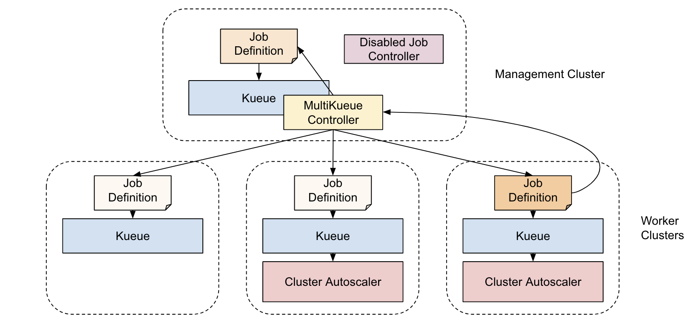

# KEP-693: MultiKueue

<!-- toc -->
- [Summary](#summary)
- [Motivation](#motivation)
  - [Goals](#goals)
  - [Non-Goals](#non-goals)
- [Proposal](#proposal)
  - [User Stories (Optional)](#user-stories-optional)
    - [Story 1](#story-1)
    - [Story 2](#story-2)
    - [Story 3](#story-3)
  - [Risks and Mitigations](#risks-and-mitigations)
- [Design Details](#design-details)
  - [Subcomponents](#subcomponents)
    - [MultiKueueCluster Controller](#multikueuecluster-controller)
    - [AdmissionCheck Controller](#admissioncheck-controller)
    - [Workload Controller](#workload-controller)
    - [Garbage Collector](#garbage-collector)
  - [Jobs abstraction](#jobs-abstraction)
    - [MultiKueueAdapter](#multikueueadapter)
    - [MultiKueueWatcher](#multikueuewatcher)
  - [Configuration](#configuration)
  - [MultiKueue Dispatcher API](#multikueue-dispatcher-api)
    - [Workload Synchronization](#workload-synchronization)
  - [Follow ups ideas](#follow-ups-ideas)
  - [Test Plan](#test-plan)
    - [Unit Tests](#unit-tests)
    - [Integration tests](#integration-tests)
    - [E2E tests](#e2e-tests)
  - [Graduation Criteria](#graduation-criteria)
- [Implementation History](#implementation-history)
- [Drawbacks](#drawbacks)
- [Alternatives](#alternatives)
<!-- /toc -->

## Summary
Introduce an new AdmissionCheck (called MultiKueue) with dedicated API
and controller that will provide multi-cluster capabilities to Kueue.

## Motivation
Many of Kueue's users are running multiple clusters and would like to
have a way to easily distribute batch jobs across them to keep all of
them utilized. Without a global distribution point, some clusters may
get less jobs they are able to process, while the others get more, leading
to underutilization and higher costs. 

### Goals
* Allow Kueue to distribute batch jobs across multiple clusters,
while maintaining the specified quota limits.
* Provide users with a single entry point through which the jobs
can be submitted and monitored, just like they were running in
a single cluster.
* Be compatible with all Kueue's features (priorities, borrowing, preemptions, etc)
and most of integrations.
* Allow to upgrade single cluster Kueue deployments to multicluster without
much hassle.

### Non-Goals
* Solve storage problem. It is assumed that the distributed jobs are
either location-flexible (for a subset of clusters) or are copying the 
data as a part of the startup process.
* Automatically detect and configure new clusters.
* Synchronize configuration across the clusters. It is expected that the 
user will create the appropriate objects, roles and permissions
in the clusters (manually, using gitops or some 3rd-party tooling).
* Set up authentication between clusters.
* Support very high job throughput (>1M jobs/day).
* Support K8S Jobs on management clusters that don't have either 
kubernetes/enhancements#4370 implemented or Job controller disabled.
* Support for cluster role sharing (worker & manager inside one cluster)
is out of scope for this KEP. We will get back to the topic once 
kubernetes/enhancements#4370 is merged and becomes a wider standard.
* distribute running Jobs across multiple clusters, and reconcile partial
results in the Job objects on the management cluster (each Job will run on
a single worker cluster).

## Proposal

Introduce MultiKueue AdmissionCheck, controller and configuration API. 

Establish the need for a designated management cluster.



For each workload coming to a ClusterQueue (with the MultiKueue AdmissionCheck enabled)
in the management cluster, and getting past the preadmission phase in the 
two-phase admission process (meaning that the global quota - total amount resources
that can be consumed across all clusters - is ok), 
MultiKueue controller will clone it in the defined worker clusters and wait 
until some Kueue running there admits the workload.
If a remote workload is admitted first, the job will be created 
in the remote cluster with a `kueue.x-k8s.io/prebuilt-workload-name` label pointing to that clone.
Then it will remove the workloads from the remaining worker clusters and allow the
single instance of the job to proceed. The workload will be also admitted in 
the management cluster.

There will be no job controllers running in the management clusters or they will be
disabled for the workloads coming to MultiKueue-enabled cluster queues via annotation
or some other, yet to be decided, mechanism. By disabling we mean that the controller
will do no action on the selected objects, no pods (or other objects created and 
allowing other controllers to update their status as they see fit.

There will be just CRD/job definitions deployed. MultiKueue controller will copy the status
of the job from the worker clusters, so that it will appear that the job
is running inside the management clusters. However, as there is no job controller,
no pods will be created in the management cluster. No controller will also overwrite
the status that will be copied by the MultiKueue controller. 

If the job, for whatever reason, is suspended or deleted in the management cluster,
it will be deleted from the worker cluster. Deletion/suspension of the job 
only in worker cluster will trigger the global job requeuing.
Once the job finishes in the worker cluster, the job will also 
finish in the management cluster.

### User Stories (Optional)

#### Story 1
As a Kueue user I have clusters on different cloud providers and on-prem. 
I would like to run computation-heavy jobs across all of them, wherever 
I have free resources.
 
#### Story 2
As a Kueue user I have clusters in multiple regions of the same cloud 
provider. I would like to run workloads that require the newest GPUs,
whose on-demand availability is very volatile. The GPUs are available
at random times at random regions. I want to use ProvisioningRequest
to try to catch them.

#### Story 3
As a user of MultiKueue I would like to have a control over the dispatching
of workloads to the worker clusters. In particular:
* I would like to be able to use my custom dispatching algorithm which can prioritize
the order of clusters according to some in-house information
* I would like to use a built-in dispatching algorithm which adds clusters incrementally,
rather than trying all of them at once. 
This is important to avoid preemptions happening in all clusters at the same time during the admission.

### Risks and Mitigations
* Disabling the Job controller for all (or selected objects) may be problematic
on environments where access to the master configuration is limited (like GKE).
We are working on kubernetes/enhancements#4370
to establish an acceptable way of using a non default controller (or none at all).

* etcd may not provide enough performance (writes/s) to handle very large 
deployments with very high job throughput (above 1M jobs per day).

* Management cluster could be a single point of failure. The mitigations include:
  * Running multiple management clusters with infinite global quotas and 
    correct, limiting worker cluster local quotas.
  * Running multiple management clusters, with one leader and back-up clusters
    learning the state of the world from the worker clusters (not covered
    by this KEP).

## Design Details
MultiKueue will be enabled on a cluster queue using the admission check fields.
Just like ProvisioningRequest, MultiKueue will have its own configuration, 
MultiKueueConfig with the following definition. To allow reusing the same clusters
across many Kueues, additional object, MultiKueueWorkerCluster, is added.

```go
type MultiKueueConfig struct {
    metav1.TypeMeta   `json:",inline"`
    metav1.ObjectMeta `json:"metadata,omitempty"`
    Spec MultiKueueConfigSpec `json:"spec,omitempty"`
}

type MultiKueueConfigSpec struct {
     // List of MultiKueueWorkerClusters names where the 
     // workloads from the ClusterQueue should be distributed.
     Clusters []string `json:"clusters,omitempty"`
}

type MultiKueueCluster struct {
    metav1.TypeMeta   `json:",inline"`
    metav1.ObjectMeta `json:"metadata,omitempty"`
    Spec MultiKueueClusterSpec `json:"spec,omitempty"`
    Status MultiKueueClusterStatus `json:"status,omitempty"`
}

type LocationType string

const (
    // Location is the path on the disk of kueue-controller-manager.
    PathLocationType LocationType = "Path"
    
    // Location is the name of the secret inside the namespace in which the kueue controller
    // manager is running. The config should be stored in the "kubeconfig" key.
    SecretLocationType LocationType = "Secret"
)

type MultiKueueClusterSpec {
    // Information how to connect to the cluster.
    KubeConfig KubeConfig `json:"kubeConfig"`
}

type KubeConfig struct {
    // Location of the KubeConfig.
    Location string `json:"location"`
    
    // Type of the KubeConfig location.
    //
    // +kubebuilder:default=Secret
    // +kubebuilder:validation:Enum=Secret;Path
    LocationType LocationType `json:"locationType"`
}

type MultiKueueClusterStatus {
   Conditions []metav1.Condition `json:"conditions,omitempty" patchStrategy:"merge" patchMergeKey:"type"`
}
```

MultiKueue controller, when pushing workloads to the worker clusters, will use the same 
namespace and local queue names as were used in the management cluster. It is user's 
responsibility to set up the appropriate namespaces and local queues.
Worker ClusterQueue definitions may be different than in the management cluster. For example,
quota settings may be specific to the given location. And/or cluster queue may have different
admission checks, use ProvisioningRequest, etc.

### Subcomponents

#### MultiKueueCluster Controller

Will monitor all cluster definitions and maintain 
the Kube clients for all of them. Any connectivity problems will be reported both in
MultiKueueCluster status and Events. MultiKueue controller 
will make sure that whenever the kubeconfig is refreshed, the appropriate 
clients will also be recreated and attempt to reconnect when the connection to the
target cluster is lost.

Creation of kubeconfig files is outside of the MultiKueue scope, and is cloud
provider/environment dependant.

#### AdmissionCheck Controller

Will monitor the AdmissionChecks associated with MultiKueue (by ControllerName) and maintain
their `Active` status condition based on the validity of their MultiKueueConfig and `Active`
state of the MultiKueueClusters in use. An AdmissionCheck being considered `Active` when it 
has a valid configuration and at least one of its MultiKueueClusters is `Active`.

#### Workload Controller

Will monitor the workloads in the management cluster and manage their MultiKueue specific
AdmissionCheckStates.

When distributing the workloads across clusters MultiKueue Workloads controller will first create
the Kueue's internal Workload object. Only after the workload is admitted and other clusters
are cleaned-up the real job will be created, to match the Workload. That gives the guarantee
that the workload will not start in more than one cluster. The workload will
get the annotation stating where it is actually running.

When the job is running MultiKueue controller will copy its status from worker cluster
to the management cluster, to keep the impression that the job is running in the management 
cluster. This is needed to allow pipelines and workflow engines to execute against 
the management cluster with MultiKueue without any extra changes. 

If the connection between management cluster and worker cluster is lost, the management 
cluster assumes the total loss of all running/admitted workloads and moves them back to 
non-admitted/queued state. Once the cluster is reconnected, the workloads are reconciled.
If there is enough of global quota, the unknown admitted workloads would be re-admitted in 
the management cluster. If not, some workloads will be preempted to meet the global quota.
In case of duplicates, all but one of them will be removed.

#### Garbage Collector

Will monitor the Workloads in the remote clusters to detect and remove
those that were created by MultiKueue but were not deleted by the Workload Controller 
in the normal flow, due to a temporary connectivity outage to the remote cluster.

The garbage collector will run periodically with a configurable time interval.

### Jobs abstraction

In order to work with different types of jobs the MultiKueue Controller will use two abstraction
interfaces:

#### MultiKueueAdapter

```go
type MultiKueueAdapter interface {
	SyncJob(ctx context.Context, localClient client.Client, remoteClient client.Client, key types.NamespacedName, workloadName, origin string) error
	DeleteRemoteObject(ctx context.Context, remoteClient client.Client, key types.NamespacedName) error
	IsJobManagedByKueue(ctx context.Context, localClient client.Client, key types.NamespacedName) (bool, string, error)
    ...
}
```
Used by the [Workload Controller](#workload-controller) to interact with the owner of the reconciled workloads.

`SyncJob` will:
- Create the Job object in the worker cluster, if not already created.
- If the remote job exists, get its status and update the status of the local job accordingly.

`DeleteRemoteObject` - will delete the job from a remote cluster.

`IsJobManagedByKueue` - will check if a specific job is managed by kueue making it a candidate for remote execution.

#### MultiKueueWatcher

```
type MultiKueueWatcher interface {
	GetEmptyList() client.ObjectList
	WorkloadKeyFor(runtime.Object) (types.NamespacedName, error)
}
```

Used by the [MultiKueueCluster Controller](#multikueuecluster-controller) to start watching job updates in the remote clusters and convert their
remote events into local workload reconcile events. It is an optional interface, if not implemented, MultiKueue will work based in workload events
only and remote jobs events that don't have an impact on its workload will not be observed in the management cluster.

### Configuration

The MultiKueue ACC will be configured by a new section in the Kueue's configuration API `MultiKueue` with the following content:

```go
type MultiKueue struct {
	GCInterval *metav1.Duration `json:"gcInterval"`
	Origin *string `json:"origin,omitempty"`
	WorkerLostTimeout *metav1.Duration `json:"workerLostTimeout,omitempty"`
}
```

Where:

- `GCInterval` - defines the time interval between two consecutive [garbage collector](#garbage-collector) runs.
- `Origin` - defines a label value used to track the creator of workloads in the worker clusters.
This is used by multikueue in components like its [garbage collector](#garbage-collector) to identify remote objects 
that ware created by this multikueue manager cluster and delete them if their local counterpart no longer exists.
- `WorkerLostTimeout` - defines the time a local workload's multikueue admission check state is kept Ready
if the connection with its reserving worker cluster is lost.


### MultiKueue Dispatcher API

Since Kueue 0.13, in order to meet the requirements of [Story 3](#story-3), we introduce an API for custom dispatching algorithms.
When a custom Dispatcher API is used, instead of creating the copy of the Workload on all clusters the
the MultiKueue Workload Controller only creates the copy of the Workload on the subset of worker clusters
specified in the Workload's .status.nominatedClusterNames field.

Additionally, we implement a built-in incremental dispatcher as a reference implementation.
Including the pre-existing dispatching algorithm until 0.12, we distinguish the following dispatchers:

* **AllAtOnce**:  
The workload is copied to all available worker clusters at once. This is the default dispatching algorithm.

* **Incremental**:  
Clusters are nominated incrementally in rounds of fixed duration (5 minutes per round). 
The process begins by nominating an initial set of 3 clusters, which are set in the `.status.nominatedClusterNames` field in the Workload.
If none of the clusters admit the workload within the current round's duration, the next round begins, 
and 3 additional clusters are nominated, until the workload is admitted or all eligible clusters have been considered.
This strategy allows for a controlled and gradual expansion of candidate clusters, rather than dispatching the workload to all clusters at once.

* **External**:  
The selection of worker clusters is delegated to an external controller. 
The external controller is responsible for setting the `.status.nominatedClusterNames` field to the names of the selected clusters.
If the nominated clusters field is changed by the external controller, workloads are removed from any clusters that are no longer nominated.
While the workload `.status.clusterName` is assigned, the `nominatedClusterNames` field is immutable.

#### Workload Synchronization

While the Workload is pending, the dispatcher can add or remove clusters from the list, and the Workload
Controller synchronizes the value of the field with the subset of worker clusters with the Workload copy.

Changes to Workload type:
```go
type WorkloadStatus struct {
  // nominatedClusterNames specifies the list of cluster names that have been nominated for scheduling.
  // This field is mutually exclusive with the `.status.clusterName` field, and is reset when 
  // `status.clusterName` is set.
  // This field is optional.
  // 
  // +listType=set
  // +kubebuilder:validation:MaxItems=10
  // +optional
  NominatedClusterNames []string `json:"nominatedClusterNames,omitempty"`

  // clusterName is the name of the cluster where the workload is actually assigned.
  // This field is reset after the Workload is evicted.
  // +optional
  ClusterName *string `json:"clusterName,omitempty"`
}
```

Extension of MultiKueue AdmissionCheck Controller configuration:
```go
type MultiKueue struct {
  ...
  // dispatcherName specifies the name of the dispatcher responsible for selecting worker clusters
  // to handle the workload. 
  //
  // The value must be a valid domain-prefixed path (e.g. acme.io/foo) -
  // all characters before the first "/" must be a valid subdomain as defined
  // by RFC 1123. All characters trailing the first "/" must be valid HTTP Path
  // characters as defined by RFC 3986. The value cannot exceed 63 characters.
  // 
  // There are two built-in values supported:
  // - kueue.x-k8s.io/multikueue-dispatcher-all-at-once (AllAtOnce)
  // - kueue.x-k8s.io/multikueue-dispatcher-incremental (Incremental)
  // If not set, the default dispatcher (AllAtOnce) is used.
  //
  // +optional
  DispatcherName *string `json:"dispatcherName,omitempty"`
}
```


### Follow ups ideas

* Handle large number of clusters via selectors.
* Provide plugin mechanism to control how the workloads are distributed across worker clusters.

### Test Plan
[x] I/we understand the owners of the involved components may require updates to
existing tests to make this code solid enough prior to committing the changes necessary
to implement this enhancement.

#### Unit Tests
The code will adhere to regular best practices for unit tests and coverage. 

#### Integration tests
Integration tests will be executed against a mocked clients for the worker clusters 
that will provide predefined responses and allow to test various error scenarios, 
including situations like:

* Job is created across multiple clusters and admitted in one.
* Job is admitted at the same time by two clusters.
* Job is rejected by a cluster.
* Worker cluster doesn't have the corresponding namespace.
* Worker cluster doesn't have the corresponding local/cluster queue.
* Worker cluster is unresponsive.
* Worker cluster deletes the job.
* Job is correctly finished.
* Job finishes with an error.
* Job status changes frequently.

#### E2E tests
Should be created and cover similar use cases as integration tests. For start
it should focus on JobSet.

### Graduation Criteria
The feature starts at the alpha level, with a feature gate.

In Alpha version, in the 0.6 release, MultiKueue will support:

* APIs as described above.
* Basic workload distribution across clusters.
* JobSet integration, with full status relay.

Other integrations may come in 0.6 (if lucky) or in following releases 
of Kueue.

Graduation to beta criteria:
* Positive feedback from users.
* Most of the integrations supported.
* Major bugs and deficiencies are not found/fixed.
* Roadmap for missing features is defined.

## Implementation History
* 2023-11-28 Initial KEP.

## Drawbacks
MultiKueue has some drawbacks.
* Doesn't solve storage problems.
* Requires some manual works to sync configuration and authentication between clusters.
* Requires management cluster.
* Requires some external work to disable job controller(s) in management clusters.
* Scalability and throughput depends on etcd.

## Alternatives
* Use Armada or Multi Cluster App Dispatcher.
* Use multicluster-specific Job APIs.

