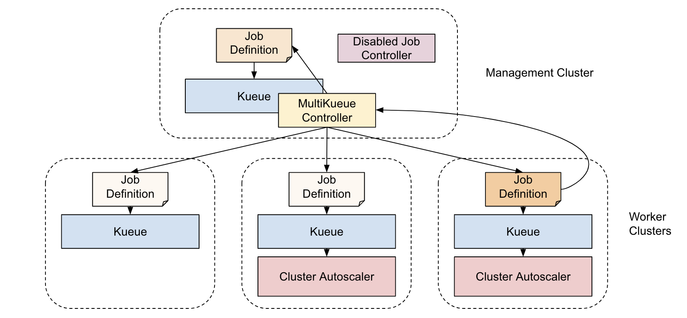

# KEP-693: MultiKueue

<!-- toc -->
- [Summary](#summary)
- [Motivation](#motivation)
  - [Goals](#goals)
  - [Non-Goals](#non-goals)
- [Proposal](#proposal)
  - [User Stories (Optional)](#user-stories-optional)
    - [Story 1](#story-1)
    - [Story 2](#story-2)
    - [Story 3](#story-3)
    - [Story 4](#story-4)
  - [Risks and Mitigations](#risks-and-mitigations)
- [Design Details](#design-details)
  - [Subcomponents](#subcomponents)
    - [MultiKueueCluster Controller](#multikueuecluster-controller)
    - [AdmissionCheck Controller](#admissioncheck-controller)
    - [MultiKueue Workload Controller](#multikueue-workload-controller)
    - [Garbage Collector](#garbage-collector)
  - [Jobs abstraction](#jobs-abstraction)
    - [MultiKueueAdapter](#multikueueadapter)
    - [MultiKueueWatcher](#multikueuewatcher)
  - [Configuration](#configuration)
    - [Completed remote object retention](#completed-remote-object-retention)
      - [Lifecycle](#lifecycle)
      - [Same-name reuse](#same-name-reuse)
      - [Feature gate and version skew](#feature-gate-and-version-skew)
  - [MultiKueue Dispatcher API](#multikueue-dispatcher-api)
    - [Workload Synchronization](#workload-synchronization)
  - [Cluster Role sharing](#cluster-role-sharing)
  - [Follow ups ideas](#follow-ups-ideas)
  - [Test Plan](#test-plan)
    - [Unit Tests](#unit-tests)
    - [Integration tests](#integration-tests)
    - [E2E tests](#e2e-tests)
  - [Graduation Criteria](#graduation-criteria)
    - [Remote object retention](#remote-object-retention)
- [Implementation History](#implementation-history)
- [Drawbacks](#drawbacks)
- [Alternatives](#alternatives)
<!-- /toc -->

## Summary
Introduce an new AdmissionCheck (called MultiKueue) with dedicated API
and controller that will provide multi-cluster capabilities to Kueue.

## Motivation
Many of Kueue's users are running multiple clusters and would like to
have a way to easily distribute batch jobs across them to keep all of
them utilized. Without a global distribution point, some clusters may
get less jobs they are able to process, while the others get more, leading
to underutilization and higher costs. 

### Goals
* Allow Kueue to distribute batch jobs across multiple clusters,
while maintaining the specified quota limits.
* Provide users with a single entry point through which the jobs
can be submitted and monitored, just like they were running in
a single cluster.
* Be compatible with all Kueue's features (priorities, borrowing, preemptions, etc)
and most of integrations.
* Allow to upgrade single cluster Kueue deployments to multicluster without
much hassle.

### Non-Goals
* Solve storage problem. It is assumed that the distributed jobs are
either location-flexible (for a subset of clusters) or are copying the 
data as a part of the startup process.
* Automatically detect and configure new clusters.
* Synchronize configuration across the clusters. It is expected that the 
user will create the appropriate objects, roles and permissions
in the clusters (manually, using gitops or some 3rd-party tooling).
* Set up authentication between clusters.
* Support very high job throughput (>1M jobs/day).
* Support K8S Jobs on management clusters that don't have either 
kubernetes/enhancements#4370 implemented or Job controller disabled.
* Support for cluster role sharing (worker & manager inside one cluster)
although proved to be possible after kubernetes/enhancements#4370 was merged.
* Distribute and run a single Job across multiple clusters, and reconcile partial
results in the Job objects on the management cluster (each Job will run on
a single worker cluster).

## Proposal

Introduce MultiKueue AdmissionCheck, controller and configuration API. 

Establish the need for a designated management cluster.



For each workload coming to a ClusterQueue (with the MultiKueue AdmissionCheck enabled)
in the management cluster, and getting past the preadmission phase in the 
two-phase admission process (meaning that the global quota - total amount resources
that can be consumed across all clusters - is ok), 
MultiKueue controller will clone it in the defined worker clusters and wait 
until some Kueue running there admits the workload.
If a remote workload is admitted first, the job will be created 
in the remote cluster with a `kueue.x-k8s.io/prebuilt-workload-name` label pointing to that clone.
Then it will remove the workloads from the remaining worker clusters and allow the
single instance of the job to proceed. The workload will be also admitted in 
the management cluster.

There will be no job controllers running in the management clusters or they will be
disabled for the workloads coming to MultiKueue-enabled cluster queues via annotation
or some other, yet to be decided, mechanism. By disabling we mean that the controller
will do no action on the selected objects, no pods (or other objects created and 
allowing other controllers to update their status as they see fit.

There will be just CRD/job definitions deployed. MultiKueue controller will copy the status
of the job from the worker clusters, so that it will appear that the job
is running inside the management clusters. However, as there is no job controller,
no pods will be created in the management cluster. No controller will also overwrite
the status that will be copied by the MultiKueue controller. 

If the job, for whatever reason, is suspended or deleted in the management cluster,
it will be deleted from the worker cluster. Deletion/suspension of the job 
only in worker cluster will trigger the global job requeuing.
Once the job finishes in the worker cluster, the job will also 
finish in the management cluster.

### User Stories (Optional)

#### Story 1
As a Kueue user I have clusters on different cloud providers and on-prem. 
I would like to run computation-heavy jobs across all of them, wherever 
I have free resources.
 
#### Story 2
As a Kueue user I have clusters in multiple regions of the same cloud 
provider. I would like to run workloads that require the newest GPUs,
whose on-demand availability is very volatile. The GPUs are available
at random times at random regions. I want to use ProvisioningRequest
to try to catch them.

#### Story 3
As a user of MultiKueue I would like to have a control over the dispatching
of workloads to the worker clusters. In particular:
* I would like to be able to use my custom dispatching algorithm which can prioritize
the order of clusters according to some in-house information
* I would like to use a built-in dispatching algorithm which adds clusters incrementally,
rather than trying all of them at once. 
This is important to avoid preemptions happening in all clusters at the same time during the admission.

#### Story 4
As a user who inspects jobs directly on a worker cluster, I want completed remote
Workloads and their mirrored jobs to remain visible for a configurable duration,
so that I can inspect the completed run after its status reaches the management
cluster. Today, MultiKueue deletes these objects immediately after completion.

### Risks and Mitigations
* Disabling the Job controller for all (or selected objects) may be problematic
on environments where access to the master configuration is limited (like GKE).
We are working on kubernetes/enhancements#4370
to establish an acceptable way of using a non default controller (or none at all).

* etcd may not provide enough performance (writes/s) to handle very large 
deployments with very high job throughput (above 1M jobs per day).

* Management cluster could be a single point of failure. The mitigations include:
  * Running multiple management clusters with infinite global quotas and 
    correct, limiting worker cluster local quotas.
  * Running multiple management clusters, with one leader and back-up clusters
    learning the state of the world from the worker clusters (not covered
    by this KEP).

* **Arbitrary file read via `locationType=Path`**: When `KubeConfig.LocationType`
  is set to `Path`, the controller reads the file at the user-supplied location
  using `os.ReadFile`. Without path restrictions, any principal with
  `create`/`update` access to `MultiKueueCluster` resources could read arbitrary
  files from the controller pod's filesystem (e.g. the projected service account
  token). This is mitigated by:
  * Gating safe path validation behind the `MultiKueueKubeConfigPathValidation` feature
    gate (Beta, default enabled). When the gate is on, only
    paths under the hardcoded prefix `/etc/multikueue/kubeconfigs/` are
    accepted. When disabled, the controller falls back to the legacy
    behavior of allowing any path.
  * Canonicalizing and validating the path: the controller cleans the path,
    rejects `..` segments, resolves symlinks, and requires the resolved absolute
    path to reside under the prefix directory.
  * Recommended deployment practice is to use `locationType=Secret` or
    `ClusterProfile` instead of `Path` in production environments.

* Retaining completed remote objects increases worker API storage and controller
  memory usage. Retention is opt-in and bounded by a configured duration; operators
  should size it for their completion rate. Worker-side TTL policies and manual
  deletion can remove objects, including Pods and their logs, sooner. This feature
  postpones MultiKueue-initiated cleanup; it does not guarantee log availability.

## Design Details
MultiKueue will be enabled on a cluster queue using the admission check fields.
Just like ProvisioningRequest, MultiKueue will have its own configuration, 
MultiKueueConfig with the following definition. To allow reusing the same clusters
across many Kueues, additional object, MultiKueueWorkerCluster, is added.

```go
type MultiKueueConfig struct {
    metav1.TypeMeta   `json:",inline"`
    metav1.ObjectMeta `json:"metadata,omitempty"`
    Spec MultiKueueConfigSpec `json:"spec,omitempty"`
}

type MultiKueueConfigSpec struct {
     // List of MultiKueueWorkerClusters names where the 
     // workloads from the ClusterQueue should be distributed.
     Clusters []string `json:"clusters,omitempty"`
}

type MultiKueueCluster struct {
    metav1.TypeMeta   `json:",inline"`
    metav1.ObjectMeta `json:"metadata,omitempty"`
    Spec MultiKueueClusterSpec `json:"spec,omitempty"`
    Status MultiKueueClusterStatus `json:"status,omitempty"`
}

type LocationType string

const (
    // Location is the path on the disk of kueue-controller-manager.
    PathLocationType LocationType = "Path"
    
    // Location is the name of the secret inside the namespace in which the kueue controller
    // manager is running. The config should be stored in the "kubeconfig" key.
    SecretLocationType LocationType = "Secret"
)

type MultiKueueClusterSpec struct {
  // Information about the cluster.
  // +required
  ClusterSource ClusterSource `json:"clusterSource,omitempty"`
}

// +kubebuilder:validation:ExactlyOneOf=kubeConfig;clusterProfile
type ClusterSource struct {

    // KubeConfig is the direct specification of the kubeconfig for the remote cluster.
    // This field can only be configured when ClusterProfile is not specified.
    // +optional
    KubeConfig *KubeConfig `json:"kubeConfig,omitempty"`

    // ClusterProfile is a reference to a ClusterProfile object.
    // The controller will use the information from the ClusterProfile to connect to the remote cluster.
    // This field can only be configured when KubeConfig is not specified.
    // +optional
    ClusterProfileRef *ClusterProfileReference `json:"clusterProfile,omitempty"`
}

type KubeConfig struct {
    // Location of the KubeConfig.
    Location string `json:"location"`
    
    // Type of the KubeConfig location.
    //
    // +kubebuilder:default=Secret
    // +kubebuilder:validation:Enum=Secret;Path
    LocationType LocationType `json:"locationType,omitempty"`
}

type ClusterProfileReference struct {
  // Name of the ClusterProfile.
  Name string `json:"name"`
}

type MultiKueueClusterStatus struct {
   Conditions []metav1.Condition `json:"conditions,omitempty" patchStrategy:"merge" patchMergeKey:"type"`
}
```

MultiKueue controller, when pushing workloads to the worker clusters, will use the same 
namespace and local queue names as were used in the management cluster. It is user's 
responsibility to set up the appropriate namespaces and local queues.
Worker ClusterQueue definitions may be different than in the management cluster. For example,
quota settings may be specific to the given location. And/or cluster queue may have different
admission checks, use ProvisioningRequest, etc.

### Subcomponents

#### MultiKueueCluster Controller

Will monitor all `MultiKueueCluster` definitions and maintain 
the Kube clients for all of them. Any connectivity problems will be reported both in
the `MultiKueueCluster`'s status and via Events.

The controller obtains cluster credentials based on the `MultiKueueCluster` spec:

- When `kubeConfig` is provided, the controller uses it directly. It ensures that
  whenever the underlying kubeconfig (e.g., in a Secret) is refreshed, the client
  is recreated.

- When `clusterProfile` is provided, the controller relies on the
  [client-go credential plugin mechanism](https://kubernetes.io/docs/reference/access-authn-authz/authentication/#client-go-credential-plugins) to obtain and refresh credentials for the remote cluster as described in [KEP-5339](https://github.com/kubernetes/enhancements/blob/master/keps/sig-multicluster/5339-clusterprofile-plugin-credentials/README.md).
  This requires installation of the ClusterProfile CRD (`clusterprofiles.multicluster.x-k8s.io`). If your Kueue deployment is already running, you must restart it after installing the CRD for the changes to take effect.

  The authentication flow is as follows:
  1. The controller reads the `ClusterProfile` object referenced by the `MultiKueueCluster`. The `ClusterProfile` contains a list of access providers.
  2. The controller uses this configuration to match the cluster access provider with a configured access provider and invoke the credential plugin binary. The list of access providers is configured in the `accessProviders` section under `clusterProfile` in the `MultiKueue` Configuration API.

```go
type MultiKueue struct {
  ...
	// ClusterProfile defines configuration for using the ClusterProfile API.
	// +optional
	ClusterProfile *ClusterProfile `json:"clusterProfile,omitempty"`
}

// ClusterProfile defines configuration for using the ClusterProfile API in MultiKueue.
type ClusterProfile struct {
	// AccessProviders defines a list of providers to obtain access to worker clusters
	// using the ClusterProfile API.
	AccessProviders []ClusterProfileAccessProvider `json:"accessProviders,omitempty"`

	// CredentialsProviders defines a list of providers to obtain credentials of worker clusters
	// using the ClusterProfile API.
	// Deprecated: Use AccessProviders instead. AccessProviders and CredentialsProviders
	// are mutually exclusive.
	CredentialsProviders []ClusterProfileCredentialsProvider `json:"credentialsProviders,omitempty"`
}

// ClusterProfileAccessProvider defines an access provider in the ClusterProfile API.
type ClusterProfileAccessProvider struct {
	// Name is the name of the provider.
	Name string `json:"name"`
	// ExecConfig is the exec configuration to obtain credentials.
	ExecConfig clientcmdapi.ExecConfig `json:"execConfig"`
}

// ClusterProfileCredentialsProvider defines a credentials provider in the ClusterProfile API.
// Deprecated: Use ClusterProfileAccessProvider instead.
type ClusterProfileCredentialsProvider = ClusterProfileAccessProvider
```

  The `credentialsProviders` field remains accepted for backwards compatibility when `accessProviders` is not configured. The `accessProviders` and `credentialsProviders` fields are mutually exclusive, so users should migrate existing `credentialsProviders` entries to `accessProviders`. The deprecated `credentialsProviders` field and `ClusterProfileCredentialsProvider` alias will be removed in the `v1beta3` Configuration API.

  On the ClusterProfile API side, Kueue uses `status.accessProviders` as the preferred source of cluster access information. The deprecated `status.credentialProviders` field remains supported by the ClusterProfile API compatibility layer.

  3. The plugin is responsible for the actual authentication process. This might involve calling an external HTTP endpoint (e.g., a cloud provider's metadata service or an OIDC provider) to generate a short-lived authentication token. The details of this process are specific to the plugin and are opaque to Kueue. It returns the credentials, including the token, to the controller.
  4. The controller uses these credentials to configure a Kubernetes client for the worker cluster.

  Token refreshing is also managed automatically by the client-go library. When a token is expired or about to expire, client-go re-invokes the plugin to fetch a new one.

Creation of kubeconfig files or ClusterProfile objects is outside of the MultiKueue scope, and is cloud
provider/environment dependent.

#### AdmissionCheck Controller

Will monitor the AdmissionChecks associated with MultiKueue (by ControllerName) and maintain
their `Active` status condition based on the validity of their MultiKueueConfig and `Active`
state of the MultiKueueClusters in use. An AdmissionCheck will be set as `Active` when it
has a valid configuration and at least one of its MultiKueueClusters is `Active`.

#### MultiKueue Workload Controller

Will monitor the workloads in the management cluster and manage their MultiKueue specific
AdmissionCheckStates.

When distributing a workload across clusters, the MultiKueue Workload Controller will first create
a Kueue-internal workload object in each of the currently "nominated" worker clusters
(see [MultiKueue Dispatcher API](#multikueue-dispatcher-api) for details).
Only after the workload is admitted on one cluster and cleaned
up on the other clusters, the real job will be created, to match the workload. That gives the guarantee
that the workload will not start in more than one cluster. The workload will
get the annotation stating where it is actually running.

When the job is running, MultiKueue Workload Controller will copy its status from worker cluster
to the management cluster, to keep the impression that the job is running in the management 
cluster. This is needed to allow pipelines and workflow engines to execute against 
the management cluster with MultiKueue without any extra changes. 

If the connection between management cluster and worker cluster is lost, the management 
cluster assumes the total loss of all running/admitted workloads and moves them back to 
non-admitted/queued state. Once the cluster is reconnected, the workloads are reconciled.
If there is enough of global quota, the unknown admitted workloads would be re-admitted in 
the management cluster. If not, some workloads will be preempted to meet the global quota.
In case of duplicates, all but one of them will be removed.

#### Garbage Collector

Will monitor the workloads in the remote clusters to detect and remove
those that were created by MultiKueue but were not deleted by the MultiKueue Workload Controller
in the normal flow, due to a temporary connectivity outage to the remote cluster.

The garbage collector will run periodically with a configurable time interval.

### Jobs abstraction

In order to work with different types of jobs the MultiKueue Controller will use two abstraction
interfaces:

#### MultiKueueAdapter

```go
type MultiKueueAdapter interface {
	SyncJob(ctx context.Context, localClient client.Client, remoteClient client.Client, key types.NamespacedName, workloadName, origin string) error
	DeleteRemoteObject(ctx context.Context, remoteClient client.Client, key types.NamespacedName) error
	IsJobManagedByKueue(ctx context.Context, localClient client.Client, key types.NamespacedName) (bool, string, error)
    ...
}
```
Used by the [MultiKueue Workload Controller](#multikueue-workload-controller) to interact with the owner of the reconciled workloads.

`SyncJob` will:
- Create the Job object in the worker cluster, if not already created.
- If the remote job exists, get its status and update the status of the local job accordingly.

`DeleteRemoteObject` - will delete the job from a remote cluster.

`IsJobManagedByKueue` - will check if a specific job is managed by kueue making it a candidate for remote execution.

#### MultiKueueWatcher

```
type MultiKueueWatcher interface {
	GetEmptyList() client.ObjectList
	WorkloadKeyFor(runtime.Object) (types.NamespacedName, error)
}
```

Used by the [MultiKueueCluster Controller](#multikueuecluster-controller) to start watching job updates in the remote clusters and convert their
remote events into local workload reconcile events. It is an optional interface, if not implemented, MultiKueue will work based in workload events
only and remote jobs events that don't have an impact on its workload will not be observed in the management cluster.

### Configuration

The MultiKueue ACC will be configured by a new section in the Kueue's configuration API `MultiKueue` with the following content:

```go
type MultiKueue struct {
	GCInterval *metav1.Duration `json:"gcInterval"`
	Origin *string `json:"origin,omitempty"`
	WorkerLostTimeout *metav1.Duration `json:"workerLostTimeout,omitempty"`
	ClusterProfileConfig *ClusterProfileConfig `json:"clusterProfileConfig,omitempty"`
}
```

Where:

- `GCInterval` - defines the time interval between two consecutive [garbage collector](#garbage-collector) runs.
- `Origin` - defines a label value used to track the creator of workloads in the worker clusters.
This is used by multikueue in components like its [garbage collector](#garbage-collector) to identify remote objects 
that ware created by this multikueue manager cluster and delete them if their local counterpart no longer exists.
- `WorkerLostTimeout` - defines the time a local workload's multikueue admission check state is kept Ready
if the connection with its reserving worker cluster is lost.
- `ClusterProfileConfig` - defines the configuration for the ClusterProfile API.


#### Completed remote object retention

For v0.21, extend the global MultiKueue section of the v1beta2 `Configuration` with
`multiKueue.objectRetentionPolicies.remoteObjects.afterFinished`, as requested in
[issue #13847](https://github.com/kubernetes-sigs/kueue/issues/13847). It keeps the
remote Workload and mirrored job on the worker for a while after the run completes,
so that users can inspect them there. The optional fields are:

```go
type MultiKueue struct {
    // ...
    // ObjectRetentionPolicies configures cleanup of objects on worker clusters.
    // +optional
    ObjectRetentionPolicies *MultiKueueObjectRetentionPolicies `json:"objectRetentionPolicies,omitempty"`
}

type MultiKueueObjectRetentionPolicies struct {
    // RemoteObjects configures retention of the remote Workload and mirrored job.
    // +optional
    RemoteObjects *RemoteObjectRetentionPolicy `json:"remoteObjects,omitempty"`
}

type RemoteObjectRetentionPolicy struct {
    // AfterFinished is the duration to retain remote objects after the manager
    // Workload succeeds or fails. Nil or zero preserves immediate cleanup.
    // +optional
    AfterFinished *metav1.Duration `json:"afterFinished,omitempty"`
}
```

For example, with the `MultiKueueRemoteObjectRetention` feature gate enabled on the
manager, this configuration requests one hour of retention:

```yaml
multiKueue:
  objectRetentionPolicies:
    remoteObjects:
      afterFinished: "1h"
```

The `MultiKueueRemoteObjectRetention` feature gate starts at Alpha, disabled by
default, in v0.21. The duration must be non-negative. An omitted policy or
duration, `0s`, or a disabled gate keeps today's immediate cleanup. The setting is
global, static for the manager process, and applies to all MultiKueue adapters. It
has no per-`MultiKueueConfig`, per-queue, or per-job override.

##### Lifecycle

When the manager Workload finishes with reason `Succeeded` or `Failed`, the
MultiKueue Workload Controller keeps the remote Workload and mirrored job on the
worker where the Workload ran until `Finished.LastTransitionTime + afterFinished`,
and requeues the Workload for the remaining time. Completion reporting and quota
release are not delayed. Because the deadline comes from the persisted condition, a
manager restart neither extends retention nor recreates objects that are already
gone. If that worker is unreachable, the controller retries every
`workerLostTimeout` without resetting the deadline.

Cleanup stays immediate when:

* the Workload finishes for any other reason, such as `OutOfSync` or `OwnerNotFound`;
* the manager Workload is evicted, deactivated, or loses its quota reservation, even
  if it has also finished;
* the manager Job or Workload is deleted;
* the objects are on a worker other than the one the Workload ran on;
* the retained remote Workload is out of sync with the manager Workload, is evicted
  on the worker, or is confirmed missing. An unreachable worker does not count as
  missing.

Elastic Workload handling is unchanged: replaced slices keep their existing
shared-object lifecycle and never start retention.

The orphan garbage collector finds remote objects only through remote Workloads
that carry this manager's origin label. A mirrored job whose remote Workload is gone
could therefore never be collected if a later manager-side cleanup were missed, so
the controller deletes the job once it confirms that the remote Workload is missing.
As a consequence, deleting the remote Workload on the worker, for example through
the worker's own `objectRetentionPolicies.workloads`, also ends retention of its job.

The manager-side `objectRetentionPolicies.workloads` policy from
[KEP-1618](../1618-optional-gc-of-workloads/README.md) stays a separate field: there
`nil` means never delete, while for remote objects `nil` must keep today's immediate
cleanup. Deleting the manager Workload, including by that policy, ends remote
retention, so that policy caps how long remote objects can be kept. The orphan
garbage collector (`gcInterval`) is unchanged and still deletes remote objects only
when their manager Workload no longer exists.

Expiry cleanup uses the current `MultiKueueConfig` worker list, so the worker, its
`MultiKueueCluster`, and its credentials must stay configured until cleanup
finishes. Otherwise, retained objects need manual cleanup; this feature does not
discover objects on workers outside the current configuration.

##### Same-name reuse

Deleting the manager Job ends retention, so a new run with the same namespace and
name normally finds nothing left on the worker. A leftover remains only if the old
cleanup was missed: for example, the worker was unreachable when the manager Job was
deleted, the manager restarted before processing that deletion, the old Workload was
still being deleted when the new run was dispatched, or the garbage collector is
disabled. A new run must not wait for such a leftover to expire, so before creating
remote objects the controller:

1. Checks that the manager Job still has the UID recorded on the Workload.
   Otherwise, a newer run owns the name and this Workload creates nothing.
2. Reads the remote object with the same name. If it carries this manager's origin
   but names a different prebuilt Workload, the controller deletes it with UID and
   resourceVersion preconditions, then retries the MultiKueue reconcile shortly.
   This is not a ClusterQueue requeue.

Objects with another origin, or without a prebuilt Workload name, are left alone.
Shared objects, such as those of elastic slices, Pod groups, and multi-Workload
adapters, are excluded.

Cleanup is guarded the same way: on expiry, manager deletion, or orphan garbage
collection, the controller deletes a dedicated remote object only if it still names
the Workload being cleaned up, and binds the adapter's deletion to the UID and
resourceVersion it checked. An old run therefore cannot delete a newer same-name
object, or one whose ownership changed after the check.

##### Feature gate and version skew

Retention, same-name replacement, and the ownership checks on deletion only apply
with the gate enabled; with the gate disabled, dispatch and cleanup behave as
before, so upgrading without opting in changes nothing. Disabling the gate or
removing the duration and restarting the manager deletes previously retained
objects on the next reconcile. Changing a positive duration recomputes deadlines
from the original finish time. Before downgrading to a version that does not know
the field or gate, remove them from the configuration; that version cleans up
immediately.

### MultiKueue Dispatcher API

Since Kueue 0.13, in order to meet the requirements of [Story 3](#story-3), we introduce an API for custom dispatching algorithms.
When a custom Dispatcher API is used, instead of creating the copy of the workload on all clusters the
the MultiKueue Workload Controller only creates the copy of the workload on the subset of worker clusters
specified in the workload's `.status.nominatedClusterNames` field.

Additionally, we implement a built-in incremental dispatcher as a reference implementation.
Including the pre-existing dispatching algorithm until 0.12, we distinguish the following dispatchers:

* **AllAtOnce**:  
The workload is copied to all available worker clusters at once. This is the default dispatching algorithm.

* **Incremental**:  
Clusters are nominated incrementally in rounds of fixed duration (5 minutes per round). 
The process begins by nominating an initial set of 3 clusters, which are set in the `.status.nominatedClusterNames` field in the workload.
If none of the clusters admit the workload within the current round's duration, the next round begins, 
and 3 additional clusters are nominated, until the workload is admitted or all eligible clusters have been considered.
This strategy allows for a controlled and gradual expansion of candidate clusters, rather than dispatching the workload to all clusters at once.

* **External**:  
The selection of worker clusters is delegated to an external controller. 
The external controller is responsible for setting the `.status.nominatedClusterNames` field to the names of the selected clusters.
If the nominated clusters field is changed by the external controller, workloads are removed from any clusters that are no longer nominated.
While the workload `.status.clusterName` is assigned, the `nominatedClusterNames` field is immutable.

#### Workload Synchronization

While the workload is pending, the dispatcher can add or remove clusters from the list, and the MultiKueue Workload
Controller synchronizes the value of the field with the subset of worker clusters with the workload copy.

Changes to `WorkloadStatus` type:
```go
type WorkloadStatus struct {
  ...
  // nominatedClusterNames specifies the list of cluster names that have been nominated for scheduling.
  // This field is mutually exclusive with the `.status.clusterName` field, and is reset when 
  // `status.clusterName` is set.
  // This field is optional.
  // 
  // +listType=atomic
  // +kubebuilder:validation:MaxItems=10
  // +optional
  NominatedClusterNames []string `json:"nominatedClusterNames,omitempty"`

  // clusterName is the name of the cluster where the workload is actually assigned.
  // This field is reset after the workload is evicted.
  // +optional
  ClusterName *string `json:"clusterName,omitempty"`
}
```

Extension of MultiKueue AdmissionCheck Controller configuration:
```go
type MultiKueue struct {
  ...
  // dispatcherName specifies the name of the dispatcher responsible for selecting worker clusters
  // to handle the workload. 
  //
  // The value must be a valid domain-prefixed path (e.g. acme.io/foo) -
  // all characters before the first "/" must be a valid subdomain as defined
  // by RFC 1123. All characters trailing the first "/" must be valid HTTP Path
  // characters as defined by RFC 3986. The value cannot exceed 63 characters.
  // 
  // There are two built-in values supported:
  // - kueue.x-k8s.io/multikueue-dispatcher-all-at-once (AllAtOnce)
  // - kueue.x-k8s.io/multikueue-dispatcher-incremental (Incremental)
  // If not set, the default dispatcher (AllAtOnce) is used.
  //
  // +optional
  DispatcherName *string `json:"dispatcherName,omitempty"`
}
```

### Cluster Role sharing

MultiKueue Cluster Role Sharing enables Kueue cluster to simultaneously run both MultiKueue managed workloads and regular Kueue workloads, depending on the ClusterQueue configuration
targeted by the workloads.

### Follow ups ideas

* Handle large number of clusters via selectors.
* Provide plugin mechanism to control how the workloads are distributed across worker clusters.

### Test Plan
[x] I/we understand the owners of the involved components may require updates to
existing tests to make this code solid enough prior to committing the changes necessary
to implement this enhancement.

#### Unit Tests
The code will adhere to regular best practices for unit tests and coverage. 

Remote retention unit tests will use a fake clock to cover nil or zero configuration,
negative-duration rejection, successful and failed completion, expiry and
recomputation after restart, other finish reasons, each immediate-cleanup condition,
missing versus unreachable workers, and same-name replacement. Ownership races,
including old-run expiry or garbage collection after a new run reuses the name, must
preserve foreign, changed, and shared objects. With the gate disabled, dispatch and
deletion must follow the existing paths.

#### Integration tests
Integration tests will be executed against a mocked clients for the worker clusters 
that will provide predefined responses and allow to test various error scenarios, 
including situations like:

* Job is created across multiple clusters and admitted in one.
* Job is admitted at the same time by two clusters.
* Job is rejected by a cluster.
* Worker cluster doesn't have the corresponding namespace.
* Worker cluster doesn't have the corresponding local/cluster queue.
* Worker cluster is unresponsive.
* Worker cluster deletes the job.
* Job is correctly finished.
* Job finishes with an error.
* Job status changes frequently.

For remote retention, integration tests will exercise Job and JobSet completion,
final status sync, retention before expiry and cleanup afterwards, manager-side
deletion, same-name resubmission, and completion racing with eviction or deactivation.
They will also verify that disabling retention preserves immediate cleanup,
that retained objects survive reconciliation after a manager restart, and that
completed retained objects do not prevent another workload from using the released
quota.

#### E2E tests
Should be created and cover similar use cases as integration tests. For start
it should focus on JobSet.

### Graduation Criteria
The feature starts at the alpha level, with a feature gate.

In Alpha version, in the 0.6 release, MultiKueue will support:

* APIs as described above.
* Basic workload distribution across clusters.
* JobSet integration, with full status relay.

Other integrations may come in 0.6 (if lucky) or in following releases 
of Kueue.

Graduation to beta criteria:
* Positive feedback from users.
* Most of the integrations supported.
* Major bugs and deficiencies are not found/fixed.
* Roadmap for missing features is defined.

#### Remote object retention

The v0.21 Alpha requires the configuration, lifecycle behavior, unit and integration
tests described above, and user documentation of early-deletion conditions. Beta
requires user feedback and end-to-end coverage on real worker clusters for retention,
expiry, restart, and recovery after a worker outage. The Alpha gate can be disabled
independently of MultiKueue; this does not change MultiKueue's existing milestones.

## Implementation History
* 2026-09-25 Propose completed remote object retention for v0.21 (issue #13847).
* 2026-06-09 Add ClusterProfile accessProviders configuration and deprecate credentialsProviders.
* 2023-11-28 Initial KEP.

## Drawbacks
MultiKueue has some drawbacks.
* Doesn't solve storage problems.
* Requires some manual works to sync configuration and authentication between clusters.
* Requires management cluster.
* Requires some external work to disable job controller(s) in management clusters.
* Scalability and throughput depends on etcd.

## Alternatives
* Use Armada or Multi Cluster App Dispatcher.
* Use multicluster-specific Job APIs.

For completed remote object retention, alternatives considered are:
* Reuse the top-level Workload retention policy. This gives one field conflicting
  nil semantics and changes remote cleanup for users who already retain local
  Workloads, so a separate field preserves compatibility.
* Configure retention per `MultiKueueConfig`. Unlike component configuration, it
  can change or be reassigned while jobs run, requiring additional policy-change
  semantics. A global setting keeps the initial feature small.
* Reuse a same-name leftover for the new run instead of deleting it. A finished
  `batch/Job` cannot be restarted and much of its spec is immutable, so the object
  has to be recreated anyway.
* Block the new run until the leftover expires. Retention exists for inspection
  and should not delay new work.
