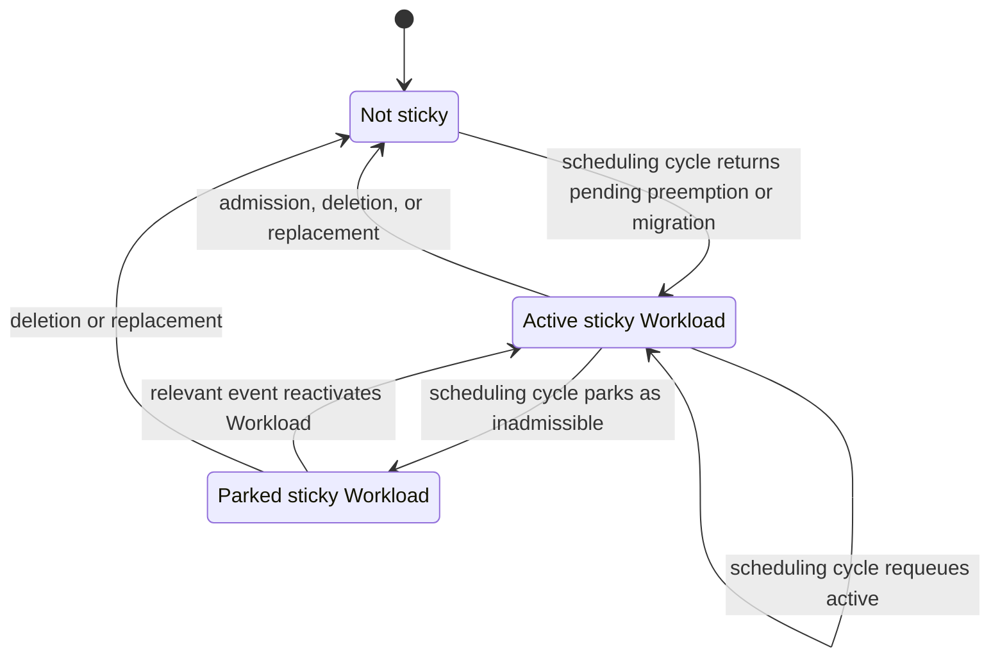

# KEP-7157: Sticky ClusterQueue Head Policy

<!-- toc -->
- [Summary](#summary)
- [Motivation](#motivation)
  - [Goals](#goals)
  - [Non-Goals](#non-goals)
- [Proposal](#proposal)
  - [Terminology](#terminology)
  - [User Stories](#user-stories)
    - [Story 1: Preserve progress past an inadmissible predecessor](#story-1-preserve-progress-past-an-inadmissible-predecessor)
    - [Story 2: Preserve progress with Preemption FairSharing](#story-2-preserve-progress-with-preemption-fairsharing)
    - [Story 3: Understand higher-priority arrivals](#story-3-understand-higher-priority-arrivals)
  - [Notes, Constraints, and Caveats](#notes-constraints-and-caveats)
    - [Inadmissible Workloads](#inadmissible-workloads)
  - [Risks and Mitigations](#risks-and-mitigations)
    - [Priority inversion](#priority-inversion)
    - [Extended blocking during slow eviction](#extended-blocking-during-slow-eviction)
    - [Cohort-wide preemption thrashing](#cohort-wide-preemption-thrashing)
- [Design Details](#design-details)
  - [Eligibility](#eligibility)
  - [Ordering](#ordering)
  - [Lifecycle](#lifecycle)
  - [Failed preemption](#failed-preemption)
  - [Synchronization and snapshot consistency](#synchronization-and-snapshot-consistency)
  - [Interaction with scheduling features](#interaction-with-scheduling-features)
    - [ConcurrentAdmission](#concurrentadmission)
  - [Behavior by version](#behavior-by-version)
  - [Test Plan](#test-plan)
    - [Prerequisite testing updates](#prerequisite-testing-updates)
    - [Unit tests](#unit-tests)
    - [Integration tests](#integration-tests)
    - [End-to-end tests](#end-to-end-tests)
  - [Graduation Criteria](#graduation-criteria)
- [Implementation History](#implementation-history)
- [Alternatives](#alternatives)
  - [Defer re-admission of preempted Workloads](#defer-re-admission-of-preempted-workloads)
  - [Scan beyond the ClusterQueue head](#scan-beyond-the-clusterqueue-head)
  - [Reuse the inflight Workload slot](#reuse-the-inflight-workload-slot)
  - [Place priority before sticky status](#place-priority-before-sticky-status)
<!-- /toc -->

## Summary

This KEP describes the Sticky ClusterQueue Head Policy used by
`BestEffortFIFO` ClusterQueues. The policy stores one in-memory Workload
identity per ClusterQueue and gives the referenced Workload temporary
precedence in the base order while it is in the active pending set. The
implementation historically calls this identity `sticky workload`.

## Motivation

`BestEffortFIFO` intentionally allows Kueue to skip a Workload that cannot be
admitted so that a later Workload in the same ClusterQueue can make progress.
This improves utilization, but creates a gap when admission depends on
preemption:

1. A Workload is selected and initiates preemption.
2. The Workload is returned to its ClusterQueue while the targets terminate.
3. A previously skipped Workload becomes the ClusterQueue head in a later
   cycle.
4. A preempted Workload is admitted again before the original preemptor can use
   the released quota.
5. The original preemptor selects the same target again.

[#6929](https://github.com/kubernetes-sigs/kueue/issues/6929) demonstrated
this with an inadmissible Workload ahead of a Workload that needed to reclaim
borrowed quota. [#7101](https://github.com/kubernetes-sigs/kueue/issues/7101)
demonstrated the same class of failure when FairSharing and Dominant Resource
Share (DRS) affected selection. Both cases could repeatedly evict and re-admit
Workloads without admitting the Workload that initiated preemption.

The kueue-scheduler needs continuity across the interval between initiating
preemption and observing the released quota. This continuity must be narrow
enough not to turn every unsuccessful Workload into a permanent head-of-line
blocker.

### Goals

- Preserve an active Workload's position in the `BestEffortFIFO` ClusterQueue
  base order while at least one target preemption is pending.
- Prevent skipped inadmissible Workloads from taking precedence over that
  preemptor within the same `BestEffortFIFO` ClusterQueue.
- Prevent preempted Workloads from repeatedly reclaiming quota solely because
  a different Workload temporarily became the ClusterQueue head.
- Keep queue ordering deterministic and safe when queue snapshots are produced
  concurrently with scheduler updates.

### Non-Goals

- Eliminating intentional head-of-line blocking in `StrictFIFO`.
- Providing an atomic quota reservation for a preemptor across scheduling
  cycles.
- Guaranteeing that a sticky Workload wins selection against every other
  ClusterQueue in its Cohort.
- Changing preemption candidate selection, flavor assignment, or DRS
  calculations.
- Adding a user-facing status field, event, or metric specifically for sticky
  state.

## Proposal

### Terminology

The following terms are used in this document:

- **Pending preemption**: the scheduler requeue outcome used when at least one
  target preemption was issued or is already in progress and the preemptor must
  wait for quota to be released.
- **Sticky Workload**: the single Workload identity stored in memory by a
  ClusterQueue after a pending-preemption or pending-migration requeue. It
  receives temporary base-order precedence while it is in the active pending
  set.
- **Active pending set**: Workloads that participate in selecting the next
  ClusterQueue head.
- **Inadmissible set**: Workloads parked until a relevant change may make them
  schedulable again.

### User Stories

#### Story 1: Preserve progress past an inadmissible predecessor

An administrator has two ClusterQueues in a Cohort. One ClusterQueue is using
borrowed quota. A second ClusterQueue contains an older Workload that cannot fit
and a later Workload that can fit after reclaiming the borrowed quota.

The later Workload should remain ahead of the older Workload in the
ClusterQueue base order after its target preemption becomes pending. The older
Workload must not repeatedly replace it and create an opportunity for the
target to be admitted again.

#### Story 2: Preserve progress with Preemption FairSharing

An administrator uses Preemption FairSharing. A Workload wins selection
according to the current DRS and initiates preemption. Other pending Workloads
in the same ClusterQueue currently have less favorable Preemption FairSharing
outcomes.

When LocalQueue usage does not decide the order, the selected preemptor should
retain its ClusterQueue position while its targets release quota. Re-evaluating
another head from that ClusterQueue must not allow the targets to alternate
between eviction and admission.

#### Story 3: Understand higher-priority arrivals

A low-priority Workload initiates preemption and becomes sticky. A
higher-priority Workload then enters the same ClusterQueue.

When both Workloads are active and LocalQueue usage does not decide the order,
the sticky Workload remains ahead of the higher-priority Workload. When the
sticky Workload leaves the active pending set, the higher-priority Workload can
again compete under normal ordering and preemption rules. If the sticky
Workload was admitted, this can cause an additional eviction, but avoids
restoring the infinite retry behavior that the policy was introduced to
prevent.

### Notes, Constraints, and Caveats

#### Inadmissible Workloads

A Workload can become impossible to admit while waiting. When it is parked as
inadmissible, its stored sticky identity has no effect on the active pending
set. Parking does not clear the identity, so the Workload receives sticky
precedence again if it is reactivated before the identity is cleared or
replaced.

### Risks and Mitigations

| Risk | Worst case | Mitigation | Status |
|---|---|---|---|
| Priority inversion | A lower-priority sticky Workload delays a higher-priority Workload | Limit sticky precedence to the active pending set | Known tradeoff |
| Slow eviction | Later Workloads wait while a target releases quota | Promptly retry pending preemption after any independent backoff | Mitigated |
| Cohort-wide preemption thrashing | A target is re-admitted before all required quota is released | Requires a stronger Cohort-wide mechanism | Out of scope ([#13662](https://github.com/kubernetes-sigs/kueue/issues/13662)) |

#### Priority inversion

- **Triggering scenario:** A lower-priority sticky Workload and a
  higher-priority Workload are both active, and LocalQueue usage does not decide
  their order.
- **User impact:** The higher-priority Workload is delayed. If the sticky
  Workload is admitted first, normal preemption can cause an additional
  eviction.
- **Mitigation:** Sticky identity is created only by pending-preemption or
  pending-migration requeues and affects ordering only while the Workload is
  active. After that interval, the higher-priority Workload competes under
  normal ordering and preemption rules.
- **Residual risk:** Admission latency and preemption churn can increase.
  Placing priority before sticky status would reintroduce the original
  starvation and repeated-preemption failures.

#### Extended blocking during slow eviction

- **Triggering scenario:** A preemption target takes a long time to terminate.
- **User impact:** Later Workloads in the same ordering domain are delayed.
- **Mitigation:** Pending preemption is an immediate requeue reason after any
  independent backoff has expired, so the active sticky Workload can be retried
  as quota is released.
- **Residual risk:** The delay remains until enough quota is released or the
  sticky Workload leaves the active pending set.

#### Cohort-wide preemption thrashing

- **Triggering scenario:** A preemptor needs quota from several targets in
  another ClusterQueue, and those targets finish eviction at different times.
- **User impact:** Cohort-wide selection can re-admit an early target before the
  preemptor obtains all required quota.
- **Mitigation:** A stronger Cohort-wide mechanism could order pending
  preemptors before other heads or reserve released quota across cycles.
- **Residual risk:** This case remains unresolved in
  [#13662](https://github.com/kubernetes-sigs/kueue/issues/13662). It is outside
  this KEP because a solution changes both queueing strategies and can
  temporarily deny a ClusterQueue its nominal quota.

## Design Details

### Eligibility

A Workload is designated sticky when both of the following criteria are
satisfied:

- Its ClusterQueue uses `BestEffortFIFO`.
- It is requeued with the pending-preemption outcome, or with the
  pending-migration outcome when `ConcurrentAdmission` is enabled.

The scheduler uses the pending-preemption outcome when at least one target was
newly marked for eviction, was already marked as evicted, or has an outstanding
preemption request.

At most one Workload identity is stored per ClusterQueue. A later qualifying
requeue replaces the stored identity.

### Ordering

The ordering dimensions, from strongest to weakest, are:

1. lower LocalQueue usage when Admission FairSharing is enabled
2. whether exactly one candidate is sticky, with the sticky Workload first
3. higher effective Workload priority
4. the earlier timestamp selected by the configured queue-order policy
5. the lexicographically smaller Workload UID

Sticky status is used only when the LocalQueue usage comparison does not
decide the order, so the sticky policy does not bypass Admission FairSharing
isolation between LocalQueues.

A newly arrived higher-priority Workload therefore does not take precedence
over an active sticky Workload in the base order.

Sticky precedence affects only the ClusterQueue-local base order. It does not
force that ClusterQueue to win the Cohort-wide scheduling tournament.

### Lifecycle

The sticky identity is set when a Workload is requeued with a pending-preemption
or pending-migration outcome. A later qualifying requeue for another Workload
replaces it. Other requeue outcomes do not clear the stored identity.

The designation has no scheduling effect while the Workload is parked outside
the active pending set. If a relevant event later reactivates that Workload,
the queue continues using the designation unless another qualifying requeue
has replaced it.

Admission and deletion remove the Workload from the pending queue and clear a
matching sticky identity. Removing a LocalQueue deletes its Workloads from the
ClusterQueue, and removing the ClusterQueue discards the state with it.

The following diagram tracks one Workload's sticky designation across
scheduling cycles:

### Failed preemption

When every target preemption request fails and none is already in progress, the
scheduler requeues the Workload promptly with the failed-preemption outcome.
This outcome does not create a new sticky identity and does not clear an
existing one.

If at least one target preemption is issued or already in progress, the
pending-preemption outcome takes precedence over errors from other targets and
the requeue sets the sticky identity.

### Synchronization and snapshot consistency

The live pending heap and the pending Workload snapshot used by
`VisibilityOnDemand` have different synchronization needs:

- Live heap updates occur under the ClusterQueue lock. Sticky updates that can
  affect heap order use the same lock, so the heap cannot observe a mid-update
  ordering rule.
- `VisibilityOnDemand` snapshots copy the pending collection under the
  ClusterQueue lock and sort the copy after releasing the lock. Each sort
  captures one sticky identity and never changes that identity during the sort.
- Individual identity reads and writes remain memory-safe even when snapshot
  creation and scheduling overlap.

The pending collection and sticky identity can be captured at different
moments. The guarantee is limited to using one consistent sticky identity for
all comparisons within an individual sort.

### Interaction with scheduling features

#### ConcurrentAdmission

The `ConcurrentAdmission` migration path requeues the preferred Workload with a
pending-migration outcome. In a `BestEffortFIFO` ClusterQueue, that outcome sets
the sticky identity and uses the same base ordering as pending preemption.

### Behavior by version

| Version | Change | Backports |
|---|---|---|
| v0.18 | Pending-migration requeues from the `ConcurrentAdmission` migration path began setting the sticky identity in `BestEffortFIFO` ClusterQueues | None |
| v0.19 | Live heap operations began synchronizing sticky changes under the ClusterQueue lock, while each subsequent snapshot sort captures one fixed sticky identity | Race-free individual access was backported to v0.17.7 and v0.18.3 |

### Test Plan

[x] I/we understand the owners of the involved components may require updates
to existing tests to make this code solid enough before committing changes
necessary to implement this enhancement.

#### Prerequisite testing updates

No prerequisite framework changes are required.

#### Unit tests

Existing unit coverage verifies:

- a pending-preemption requeue sets sticky state in a `BestEffortFIFO`
  ClusterQueue, while a failed-preemption requeue does not create sticky state
  when none exists
- pending preemption takes precedence when some target preemptions are in
  progress and others fail, while an all-failed attempt uses the
  failed-preemption outcome
- concurrent sticky updates and snapshot reads are race-free
- each snapshot sort remains valid while sticky state changes concurrently.

#### Integration tests

Existing integration coverage verifies:

- the [#6929](https://github.com/kubernetes-sigs/kueue/issues/6929) scenario
  completes without repeatedly re-admitting the preemption target
- the [#7101](https://github.com/kubernetes-sigs/kueue/issues/7101)
  Preemption FairSharing scenario completes admission
- several preceding inadmissible Workloads do not prevent the preemptor from
  making progress
- making a sticky Workload inadmissible or deleting it allows another active
  Workload to be admitted
- an all-failed preemption attempt is retried.

#### End-to-end tests

None.

### Graduation Criteria

The pending-preemption policy is an always-enabled part of `BestEffortFIFO` and
has been stable since its introduction. The pending-migration extension is
available only when `ConcurrentAdmission` is enabled.

## Implementation History

- 2025-10: The policy was introduced and backported to v0.13 and v0.14.
  - [#7157](https://github.com/kubernetes-sigs/kueue/pull/7157)
  - [#7197](https://github.com/kubernetes-sigs/kueue/pull/7197)
  - [#7202](https://github.com/kubernetes-sigs/kueue/pull/7202)
- 2025-11: Failed preemption became a distinct prompt-retry outcome that does
  not independently create sticky state.
  - [#7665](https://github.com/kubernetes-sigs/kueue/pull/7665)
  - [#7817](https://github.com/kubernetes-sigs/kueue/pull/7817)
  - [#7818](https://github.com/kubernetes-sigs/kueue/pull/7818)
- 2026-02: Sticky self-comparison was corrected to preserve strict ordering.
  - [#9172](https://github.com/kubernetes-sigs/kueue/pull/9172)
- 2026-04: Pending Concurrent Admission migrations began setting the sticky
  identity.
  - [#10610](https://github.com/kubernetes-sigs/kueue/pull/10610)
- 2026-07: Sticky identity access became race-free, and live heap and snapshot
  sorts adopted a consistent sticky identity.
  - [#12736](https://github.com/kubernetes-sigs/kueue/pull/12736)
  - [#12754](https://github.com/kubernetes-sigs/kueue/pull/12754)
  - [#12796](https://github.com/kubernetes-sigs/kueue/pull/12796)
  - [#12797](https://github.com/kubernetes-sigs/kueue/pull/12797)

## Alternatives

### Defer re-admission of preempted Workloads

[#6929](https://github.com/kubernetes-sigs/kueue/issues/6929#issuecomment-3316191042)
proposed preventing a preempted Workload from re-entering scheduling while its
preemptor remained pending.

This was not selected because the discussion identified a new blocking risk:
smaller Workloads could remain suppressed for as long as the preemptor stayed
pending, producing behavior similar to `StrictFIFO`.
[#6929](https://github.com/kubernetes-sigs/kueue/issues/6929#issuecomment-3323910742)
records this concern.

### Scan beyond the ClusterQueue head

[#6929](https://github.com/kubernetes-sigs/kueue/issues/6929#issuecomment-3316170804)
proposed repeatedly popping Workloads until an admissible head was found,
stopping when the priority changed.

This was not selected because nomination operated only on ClusterQueue heads,
and a correct stopping condition would need to account for DRS in addition to
priority. The resulting scheduler changes were considered substantial and
error-prone, as recorded in the
[follow-up discussion](https://github.com/kubernetes-sigs/kueue/issues/6929#issuecomment-3359577919).

### Reuse the inflight Workload slot

During review of [#7157](https://github.com/kubernetes-sigs/kueue/pull/7157#discussion_r2405168680),
the existing `inflight` Workload slot was proposed as the place to retain and
serve the sticky Workload instead of changing heap ordering.

This implementation was deferred because the prototype conflicted with
existing scheduler unit-test assumptions and exposed subtle bugs. Given the
urgency of the correctness fix, the discussion chose to revisit it separately.
The decision is recorded in the
[PR follow-up](https://github.com/kubernetes-sigs/kueue/pull/7157#discussion_r2410756907).

### Place priority before sticky status

[#8450](https://github.com/kubernetes-sigs/kueue/pull/8450) and
[#10082](https://github.com/kubernetes-sigs/kueue/pull/10082) proposed placing
Workload priority before sticky status.

This was not adopted because an inadmissible higher-priority Workload was part
of the original failure: allowing it to take the head again can let the
preempted target be admitted before the preemptor. The concern was raised in
[#10082](https://github.com/kubernetes-sigs/kueue/pull/10082#issuecomment-4141356164),
and [the regression was confirmed](https://github.com/kubernetes-sigs/kueue/pull/10082#issuecomment-4141878704).
