# KEP-74: Support Generic Workflows

<!-- toc -->
- [Summary](#summary)
- [Motivation](#motivation)
  - [Goals](#goals)
  - [Non-Goals](#non-goals)
- [Proposal](#proposal)
  - [User Stories](#user-stories)
    - [Story 1](#story-1)
    - [Story 2](#story-2)
    - [Story 3](#story-3)
    - [Story 4](#story-4)
- [Design Details](#design-details)
  - [Workflow as An Unit](#workflow-as-an-unit)
    - [How to suspend the whole workflow](#how-to-suspend-the-whole-workflow)
    - [Drawback and Limitations](#drawback-and-limitations)
    - [Advantages](#advantages)
  - [Stage as An Unit](#stage-as-an-unit)
    - [Workflow Framework in Kueue](#workflow-framework-in-kueue)
    - [How to suspend by stages](#how-to-suspend-by-stages)
    - [Advantages](#advantages-1)
    - [Drawback and Limitations](#drawback-and-limitations-1)
  - [Task as An Unit](#task-as-an-unit)
    - [Advantages](#advantages-2)
    - [Drawback and Limitations](#drawback-and-limitations-2)
- [Additional Details](#additional-details)
  - [Test Plan](#test-plan)
    - [Unit Tests](#unit-tests)
    - [Integration tests](#integration-tests)
  - [Graduation Criteria](#graduation-criteria)
<!-- /toc -->

## Summary

This KEP outlines the proposal to integrate Generic Workflows within Kueue, discussing the advantages 
and disadvantages of queuing workflows at varying granularity levels, alongside detailing 
the integration methodologies. Workflow managers like Argo Workflow and Tekton can follow the convention 
to queue the workflows.

## Motivation

Workflows are pivotal components in domains like Scientific Computing and Simulations, where 
administrators often enforce resource usage quotas for different users or departments. Currently, 
Workflows lacks native support within Kueue.

### Goals

- Enable support for Generic Workflows within Kueue, allowing users to simply add a label 
`kueue.x-k8s.io/queue-name` to their workflows and submit them initially in a suspended state.
- Should be easily extended to support verious workflow managers.

### Non-Goals

- KEP should not only work for Argo Workflow.
- Support resource reuse across multiple stages (potentially discussed in another KEP). 

## Proposal

### User Stories

#### Story 1

As a machine learning engineer, I need to preprocess data before executing a training job. My 
workflow includes two steps: data preprocessing (which doesn't require a GPU) followed by a 
PyTorchJob. I desire that the data preprocessing stage proceeds independently of GPU quota 
availability.

#### Story 2

As an ML engineer, my workflow consists of several GPU-dependent stages with uniform resource 
requirements. I aim to recycle resources allocated to earlier workflow stages to boost efficiency 
and resource utilization.

#### Story 3

I am a Argo Workflow user. Templates are the basic unit to build the workflows.
Every templates can be a leaf template, step definition or DAG definition.
Example of a workflow looks like:

```
# kubectl create -f - << EOF
apiVersion: argoproj.io/v1alpha1
kind: Workflow
metadata:
  generateName: loops-
  namespace: argo
spec:
  entrypoint: loop-example-depth-1
  templates:
  - name: loop-example-depth-2
    steps:
    - - name: print-message-loop
        template: print-message
        arguments:
          parameters:
          - name: message
            value: "{{item}}"
        withItems:              # invoke print-message once for each item in parallel
        - hello world           # item 1
        - goodbye world         # item 2
  - name: loop-example-depth-1
    steps:
    - - name: loop-example-depth-2
        template: loop-example-depth-2
        withItems:
        - depth-1-1
        - depth-1-2
  - name: print-message
    inputs:
      parameters:
      - name: message
    container:
      image: busybox
      command: [echo]
      args: ["{{inputs.parameters.message}}"]
EOF
      
# argo get loops-mlr6m
...

STEP                                            TEMPLATE              PODNAME                               DURATION  MESSAGE
 ✔ loops-mlr6m                                  loop-example-depth-1
 └─┬─✔ loop-example-depth-2(0:depth-1-1)        loop-example-depth-2
   │ └─┬─✔ print-message-loop(0:hello world)    print-message         loops-mlr6m-print-message-2545579066  6s
   │   └─✔ print-message-loop(1:goodbye world)  print-message         loops-mlr6m-print-message-323962978   5s
   └─✔ loop-example-depth-2(1:depth-1-2)        loop-example-depth-2
     └─┬─✔ print-message-loop(0:hello world)    print-message         loops-mlr6m-print-message-520674448   4s
       └─✔ print-message-loop(1:goodbye world)  print-message         loops-mlr6m-print-message-2893948292  6s
```

The template `print-message` is a leaf template, while the template `loop-example-depth-1` and `loop-example-depth-2` is a step definition.

Besides, step definition can also be a mix of leaf templates and other step definitions like the following example.

```
apiVersion: argoproj.io/v1alpha1
kind: Workflow
metadata:
  generateName: loops-
  namespace: argo
spec:
  entrypoint: loop-example-depth-1
  templates:
  - name: loop-example-depth-2
    steps:
    - - name: print-message-loop
        template: print-message
        arguments:
          parameters:
          - name: message
            value: "{{item}}"
        withItems:              # invoke print-message once for each item in parallel
        - depth-2-1           # item 1
        - depth-2-2         # item 2
  - name: loop-example-depth-1
    steps:
    - - name: print-message
        template: print-message
        arguments:
          parameters:
          - name: message
            value: "{{item}}"
        withItems:
        - depth-1-1
        - depth-1-2
      - name: loop-example-depth-2-2
        template: loop-example-depth-2
  - name: print-message
    inputs:
      parameters:
      - name: message
    container:
      image: busybox
      command: [echo]
      args: ["{{inputs.parameters.message}}"]

# argo get loops-644ch
...
STEP                                        TEMPLATE              PODNAME                               DURATION  MESSAGE
 ✔ loops-644ch                              loop-example-depth-1
 └─┬─✔ loop-example-depth-2-2               loop-example-depth-2
   │ └─┬─✔ print-message-loop(0:depth-2-1)  print-message         loops-644ch-print-message-1796012204  4s
   │   └─✔ print-message-loop(1:depth-2-2)  print-message         loops-644ch-print-message-1116167650  6s
   ├─✔ print-message(0:depth-1-1)           print-message         loops-644ch-print-message-413467513   5s
   └─✔ print-message(1:depth-1-2)           print-message         loops-644ch-print-message-3356863351  5s
```

The template `loop-example-depth-1` contains a step definition `loop-example-depth-2-2`  and a leaf template `print-message`.

DAG definition is similar to the step definition.

#### Story 4

I amd a Tekton user. Pipelines are used to define the workflows. Pipelines contains multiple Tasks. These tasks are executed in parallel unless you set the runAfter field or finally field.Tasks contains multiple Steps. To add Steps to a Task you define a steps field (required) containing a list of desired Steps. The order in which the Steps appear in this list is the order in which they will execute. PipelineRun is the execution instance of a pipeline and TaskRun is the execution instance of a task.

Apart from taskRef and taskSpec, pipelineRef and pipelineSpec allows you to specify a pipeline in pipelineTask. This allows you to generate a child pipelineRun which is inherited by the parent pipelineRun.

An example of a pipeline looks like:

```
---
apiVersion: tekton.dev/v1
kind: Task
metadata:
  name: print-result
spec:
  description: >-
    Prints a result from another task
  params:
    - name: TO_PRINT
      type: string
  steps:
    - name: print-result
      image: mirror.gcr.io/bash
      env:
        - name: PARAM_TO_PRINT
          value: $(params.TO_PRINT)
      script: |
        #!/usr/bin/env bash
        set -e
        echo $PARAM_TO_PRINT
---
apiVersion: tekton.dev/v1
kind: Task
metadata:
  name: generate-result
spec:
  description: >-
    Creates strings of length based on parameters and puts them into results fields
  params:
    - name: STRING_LENGTH
      description: Length of the string to create
    - name: STRING_CHAR
      description: Char to use when creating string
      type: string
      default: '.'
  results:
    - name: RESULT_STRING
      description: A result string
  steps:
    - name: gen-result
      image: mirror.gcr.io/bash
      env:
        - name: PARAM_STRING_LENGTH
          value: $(params.STRING_LENGTH)
        - name: PARAM_STRING_CHAR
          value: $(params.STRING_CHAR)
      script: |
        #!/usr/bin/env bash
        set -e
        len=$PARAM_STRING_LENGTH
        ch=$PARAM_STRING_CHAR
        printf '%*s' "$len" | tr ' ' "$ch" >>  $(results.RESULT_STRING.path)
---
apiVersion: tekton.dev/v1
kind: Pipeline
metadata:
  name: result-test
spec:
  description: >-
    Generate a result of a certain length in a task and print the result in another task
  params:
  - name: RESULT_STRING_LENGTH
    description: Length of string to generate for generate-result task
  - name: RESULT_STRING_CHAR
    description: Char to repeat in result string
    default: '.'
  tasks:
  - name: generate-result
    params:
    - name: STRING_LENGTH
      value: $(params.RESULT_STRING_LENGTH)
    - name: STRING_CHAR
      value: $(params.RESULT_STRING_CHAR)
    taskRef:
      kind: Task
      name: generate-result
  - name: print-result
    params:
    - name: TO_PRINT
      value: $(tasks.generate-result.results.RESULT_STRING)
    taskRef:
      kind: Task
      name: print-result
---
apiVersion: tekton.dev/v1
kind: PipelineRun
metadata:
  name: result-test-run
spec:
  pipelineRef:
    name: result-test
  params:
  - name: RESULT_STRING_LENGTH
    value: "3000"
```

## Design Details

A generic workflow can be abstracted into a DAG like the following, where each node represents a step that requires containers invocation and executing operations. Each node may contains multiple pods, and pods executed in parallel can belong to different nodes.



In this section, we will discuss the advantages and disadvantages of queuing Workflows, Stages, and Tasks individually. Additionally, we will explore how each of these can be implemented within Kueue.

### What are the Stages for Argo Workflows?

We start by disscussing what are the stages in argo workflows for example.
Argo workflow is composed of multiple templates, each template can be a step 
definition, a DAG defninition or a leaf template, which will lead to the 
container invocation.

Steps templates in argo workflow contain a list of steps which should be 
executed in order. And each step contains a list of ParallelSteps executed in 
parallel. Each ParallelStep is a template, so they can also be steps or DAGs.

In a DAG, stages are collection of tasks that conceptually belong together or 
have similar characteristics. And subsequent stages can not run until the 
previous stage completes. So each parallelStep with a leaf template should be a 
stage in DAG. We do not consider single step as a stage because parallelSteps can
also refer to another step template. For example, the following example contains 
two stages(loops-644ch and loop-example-depth-2-2):

``` bash
STEP                                        TEMPLATE              PODNAME                               DURATION  MESSAGE
 ✔ loops-644ch                              loop-example-depth-1
 └─┬─✔ loop-example-depth-2-2               loop-example-depth-2
   │ └─┬─✔ print-message-loop(0:depth-2-1)  print-message         loops-644ch-print-message-1796012204  4s
   │   └─✔ print-message-loop(1:depth-2-2)  print-message         loops-644ch-print-message-1116167650  6s
   ├─✔ print-message(0:depth-1-1)           print-message         loops-644ch-print-message-413467513   5s
   └─✔ print-message(1:depth-1-2)           print-message         loops-644ch-print-message-3356863351  5s
```

As for DAGs templates in argo workflow, DAGs contains multiple tasks with 
dependencies. Tasks can not run until the dependencies are completed. So a task 
with a leaf template can also be a stage. For example, the following example contains 
four stages(A, B, C, D):

``` yaml
#     A
#    / \
#   B   C
#    \ /
#     D
apiVersion: argoproj.io/v1alpha1
kind: Workflow
metadata:
  generateName: dag-diamond-
spec:
  entrypoint: diamond
  templates:
  - name: echo
    inputs:
      parameters:
      - name: message
    container:
      image: alpine:3.7
      command: [echo, "{{inputs.parameters.message}}"]
  - name: diamond
    dag:
      tasks:
      - name: A
        template: echo
        arguments:
          parameters: [{name: message, value: A}]
      - name: B
        dependencies: [A]
        template: echo
        arguments:
          parameters: [{name: message, value: B}]
      - name: C
        dependencies: [A]
        template: echo
        arguments:
          parameters: [{name: message, value: C}]
      - name: D
        dependencies: [B, C]
        template: echo
        arguments:
          parameters: [{name: message, value: D}]
```

### Workflow as An Unit

#### How to suspend the whole workflow

Given the diverse resource, node affinity, and toleration requirements among workflow pods, 
determining the necessary resources for each flavor becomes challenging for the controller. 
Users must specify workflow resources via annotations like kueue.k8s.io/max-resources, tolerations 
with kueue.k8s.io/toleration, and node selectors with kueue.k8s.io/node-selector.

In this way, only one workload will be create for one workflow, so workflows can be integrated into 
Kueue with current job framework. Only need to implement for the specific workflow types.

#### Drawback and Limitations

- Inability to set distinct nodeSelectors and tolerations for multiple pod sets within a workflow.
- Hard to inject any node selectors that Kueue could calculate from flavor assignment.

#### Advantages

- Simplified architecture facilitating straightforward implementation. Workload managers can 
follow the same api to queue their workflows.

### Stage as An Unit

#### Workflow Framework in Kueue

When we regard stage as an unit, multiple workloads will be created for one workflow. So the current
job framework is not suitable for this case. We need to create a new `workflow framework` for the 
workflows. The generic workflow framework reconcile workflows in following way:

``` go
type GenericWorkflow interface {
  GetActiveStages() []GenericJob
}


func (r *workflowReconciler)ReconcileGenericWorkflow(ctx context.Context, req ctrl.Request, wf GenericWorkflow) {
  dropFinalizers := GetWorkflowInstance()
  if dropFinalizers {
    DropFinalizers()
    return 
  }

  // currently we do not support parent-workload for workflow
  // stage should be implemented as GenericJob
  stages := wf.GetActiveStages()
  for _, stage := range stages {
    // 1. make sure there is only a single existing instance of the workload.
    // If there's no workload exists and stage is unsuspended, we'll stop it immediately.
    // Stage should support suspend and resume

    // 1.1 If the workload is pending deletion, suspend the stage if needed
    // and drop the finalizer.

    // 2. handle stage is finished.

    // 3. handle workload is nil.

    // 4. update reclaimable counts if implemented by the stage

    // 5. handle WaitForPodsReady only for a standalone job.
    // handle a job when waitForPodsReady is enabled, and it is the main job

    // 6. handle eviction

	  // 7. handle job is suspended.

	  // 8. handle job is unsuspended.
    r.ReconcileStage(ctx, req, stage, wf)
  }
}
```

Each workflow managers can implement their own controller to integrate with the workflow framework.

#### How to suspend by stages

In my daily work, I primarily encounter workflow managers in the form of Argo and Tekton. Consequently, this section will focus on these two. Other workflow management systems can draw upon the discussions in this section for implementation guidance.

These two workflow managers support to suspend a stage before the stage start to run. But they do
not support to suspend a running stage (see https://github.com/tektoncd/pipeline/discussions/5353). 
So only after the workflows support suspending a running stage, we can evict and reclaim the pod
of the workflows. Eviction and reclain of stages can be implemented in the future. 

We have three ways to suspend before starting a stage.

Option 1. Give users a CLI to help users modifying workflows to add a specific suspend template for each step.
When the workflows are suspended on this special suspend template, the job-controller in Kueue
create workloads for the next step. Modification of workflow-controller is not needed for
this way, so that it is easy to iterate, and no need to manage the version of argo and kueue.
By in this way, users can modify their workflows to skip waiting in kueue, which maybe is not 
acceptable for some users.



For example, if users want to queue the workflow below:
``` yaml
apiVersion: argoproj.io/v1alpha1
kind: Workflow
metadata:
  generateName: loops-
  namespace: argo
spec:
  entrypoint: loop-example-depth-1
  templates:
  - name: loop-example-depth-2
    steps:
    - - name: print-message-loop
        template: print-message
        arguments:
          parameters:
          - name: message
            value: "{{item}}"
        withItems:              # invoke print-message once for each item in parallel
        - hello world           # item 1
        - goodbye world         # item 2
  - name: loop-example-depth-1
    steps:
    - - name: loop-example-depth-2
        template: loop-example-depth-2
        withItems:
        - depth-1-1
        - depth-1-2
      - name: loop-example-depth-2-2
        template: loop-example-depth-2
  - name: print-message
    inputs:
      parameters:
      - name: message
    container:
      image: busybox
      command: [sleep]
      args: ["3m"]
```

After they call the CLI, the new workflow will be like:
``` yaml
apiVersion: argoproj.io/v1alpha1
kind: Workflow
metadata:
  generateName: loops-
  namespace: argo
spec:
  entrypoint: loop-example-depth-1
  templates:
  - name: kueue-suspend
    suspend: {}
  - name: loop-example-depth-2
    steps:
    - - name: suspend
        template: kueue-suspend
    - - name: print-message-loop
        template: print-message
        arguments:
          parameters:
          - name: message
            value: "{{item}}"
        withItems:              # invoke print-message once for each item in parallel
        - hello world           # item 1
        - goodbye world         # item 2
  - name: loop-example-depth-1
    steps:
    - - name: loop-example-depth-2
        template: loop-example-depth-2
        withItems:
        - depth-1-1
        - depth-1-2
  - name: print-message
    inputs:
      parameters:
      - name: message
    container:
      image: busybox
      command: [sleep]
      args: ["3m"]
```

Option 2. Integrated Suspend Capability: We propose introducing a new specification field within workflows, such 
as suspendBySteps. If `workflow.spec.suspendBySteps` is set to true, the workflow-controller automatically 
injects a special suspend template into each stepGroup. The kueue's job-controller monitors these and 
generates workloads for the following steps. Upon workload admission, the suspension step is marked as 
completed. This work can not complete with the help of workflow managers.



For example, users can submit a argo workflow like this to queue the workflow:
``` yaml
apiVersion: argoproj.io/v1alpha1
kind: Workflow
metadata:
  generateName: loops-
  namespace: argo
spec:
  # support suspend before any step starting
  suspendBySteps: true
  entrypoint: loop-example-depth-1
  templates:
  - name: loop-example-depth-2
    steps:
    - - name: print-message-loop
        template: print-message
        arguments:
          parameters:
          - name: message
            value: "{{item}}"
        withItems:              # invoke print-message once for each item in parallel
        - hello world           # item 1
        - goodbye world         # item 2
  - name: loop-example-depth-1
    steps:
    - - name: loop-example-depth-2
        template: loop-example-depth-2
        withItems:
        - depth-1-1
        - depth-1-2
      - name: loop-example-depth-2-2
        template: loop-example-depth-2
  - name: print-message
    inputs:
      parameters:
      - name: message
    container:
      image: busybox
      command: [sleep]
      args: ["3m"]
```

Option 3. Kueue Webhook Enhancement: A new webhook is added within Kueue to intercept pod creations in the cluster. 
This webhook verifies if the incoming pods are governed by a workflow and if the workflow carries the label 
`kueue.x-k8s.io/queue-name`. When these conditions are met, scheduling gates are appended to the pods. The 
job-controller in Kueue subsequently organizes these pods into groups (identifiable within the workflow's 
status) and creates corresponding workloads for each group. Following workload acceptance, the scheduling 
gates are removed from the pods, enabling their scheduling and execution.
Pod controller should be changed to ignore the pods governed by a queued workflow to avoid conflicts with
workflow controllers.



For example, if a pod governed by a queued workflow is created, the scheduling gates added to the pod will be like:
```
apiVersion: v1
kind: Pod
metadata:
  name: test-pod
spec:
  schedulingGates:
  - name: kueue.x-k8s.io/admission
  containers:
  - name: pause
    image: registry.k8s.io/pause:3.6
```

#### Advantages

- Gang for pods in the same stages is supported.
- Pods in different stages are queued by different workloads, so that can be push to differnent queues.

#### Drawback and Limitations

- Maybe need to implement logic to adapt differnet workflow managers.

### Task as An Unit

SchedulingGates are added to the pods governed by the workflow with `kueue.x-k8s.io/queue-name`. And create 
a separate workload for each of these pods. Enabling their scheduling and execution after workloads are 
admitted by Kueue.

#### Advantages

- Can reuse the existing ability.

#### Drawback and Limitations

- Pods in same stages are queued by different workloads.
- Gang for stages is not available.

## Additional Details

The implementation details will be added after the discussion.

### Test Plan

<!--
**Note:** *Not required until targeted at a release.*
The goal is to ensure that we don't accept enhancements with inadequate testing.

All code is expected to have adequate tests (eventually with coverage
expectations). Please adhere to the [Kubernetes testing guidelines][testing-guidelines]
when drafting this test plan.

[testing-guidelines]: https://git.k8s.io/community/contributors/devel/sig-testing/testing.md
-->

[x] I/we understand the owners of the involved components may require updates to
existing tests to make this code solid enough prior to committing the changes necessary
to implement this enhancement.

#### Unit Tests

<!--
In principle every added code should have complete unit test coverage, so providing
the exact set of tests will not bring additional value.
However, if complete unit test coverage is not possible, explain the reason of it
together with explanation why this is acceptable.
-->

<!--
Additionally, try to enumerate the core package you will be touching
to implement this enhancement and provide the current unit coverage for those
in the form of:
- <package>: <date> - <current test coverage>

This can inform certain test coverage improvements that we want to do before
extending the production code to implement this enhancement.
-->
The code will adhere to regular best practices for unit tests and coverage.

#### Integration tests

Integration tests should be added to ensure workflow work well like other kinds of workloads.

### Graduation Criteria
<!--

Clearly define what it means for the feature to be implemented and
considered stable.

If the feature you are introducing has high complexity, consider adding graduation
milestones with these graduation criteria:
- [Maturity levels (`alpha`, `beta`, `stable`)][maturity-levels]
- [Feature gate][feature gate] lifecycle
- [Deprecation policy][deprecation-policy]

[feature gate]: https://git.k8s.io/community/contributors/devel/sig-architecture/feature-gates.md
[maturity-levels]: https://git.k8s.io/community/contributors/devel/sig-architecture/api_changes.md#alpha-beta-and-stable-versions
[deprecation-policy]: https://kubernetes.io/docs/reference/using-api/deprecation-policy/
-->

The feature starts at the beta level. 
