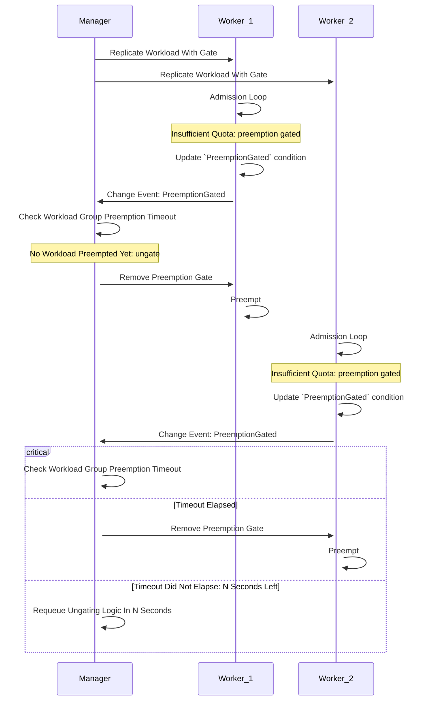

# KEP-8303: MultiKueue Orchestrated Preemption

<!-- toc -->
- [Summary](#summary)
- [Motivation](#motivation)
  - [Goals](#goals)
  - [Non-Goals](#non-goals)
- [Proposal](#proposal)
  - [User Stories](#user-stories)
    - [Story 1](#story-1)
  - [Risks and Mitigations](#risks-and-mitigations)
- [Design Details](#design-details)
  - [API Definition](#api-definition)
    - [Workload API](#workload-api)
    - [<code>SingleClusterPreemptionTimeout</code> Configuration](#singleclusterpreemptiontimeout-configuration)
  - [MultiKueue Controller](#multikueue-controller)
  - [Kueue Scheduler](#kueue-scheduler)
  - [Test Plan](#test-plan)
    - [Unit Tests](#unit-tests)
    - [Integration Tests](#integration-tests)
  - [Graduation Criteria](#graduation-criteria)
  - [Possible Follow-ups](#possible-follow-ups)
    - [Preferring non-preempting admissions](#preferring-non-preempting-admissions)
- [Implementation History](#implementation-history)
- [Drawbacks](#drawbacks)
- [Alternatives](#alternatives)
  - [Re-use the <code>kueue.x-k8s.io/cannot-preempt</code> annotation and its semantics](#re-use-the-kueuex-k8siocannot-preempt-annotation-and-its-semantics)
  - [Create a new alpha annotation <code>kueue.x-k8s.io/preemption-gated</code>](#create-a-new-alpha-annotation-kueuex-k8siopreemption-gated)
  - [Specify the preemption timeout per-<code>ClusterQueue</code> instead of globally](#specify-the-preemption-timeout-per-clusterqueue-instead-of-globally)
  - [Specify the preemption timeout in <code>MultiKueueConfig</code> instead of <code>Configuration</code>](#specify-the-preemption-timeout-in-multikueueconfig-instead-of-configuration)
  - [Use dynamically calculated default for the preemption timeout](#use-dynamically-calculated-default-for-the-preemption-timeout)
  - [Add a <code>LastTriggeredTime</code> field to <code>PreemptionGateState</code> instead of using a <code>Condition</code>](#add-a-lasttriggeredtime-field-to-preemptiongatestate-instead-of-using-a-condition)
  - [Extend the <code>QuotaReserved</code> <code>Condition</code>](#extend-the-quotareserved-condition)
  - [Use the Gate's Presence As Closed](#use-the-gates-presence-as-closed)
<!-- /toc -->

## Summary

This KEP describes the need for an admission orchestration mechanism in MultiKueue.
Since the admission process on worker clusters takes independently and without any global context,
it might result in unnecessary disruptions or suboptimal placements.

In particular, when a high-priority workload is dispatched to multiple worker clusters in a MultiKueue setup, it can trigger preemptions on all of them simultaneously.
Since in the end the workload will only run on a single cluster, the preemptions on the other clusters are unnecessary and lead to wasted resources and disruptions.

The goal of this document is to outline the interplay of such an orchestration apparatus and existing Kueue features by proposing
a way to handle the aforementioned concurrent preemption case and considering how it can be extended to other scenarios.
A solution to the most disruptive case is presented, while laying a foundation for further discussion about the more subtle scenarios.

Concretely, the KEP introduces a way for workloads to signal that they want to trigger a preemption and a way for the MultiKueue controller to use those signals
to orchestrate preemptions in the system in a non-disruptive way.

## Motivation

In a MultiKueue environment, worker clusters are isolated from each other and make admission decisions independently.
This can cause them to make decisions which make sense from a single cluster's perspective, but are suboptimal when
taking the whole system (other workers) into account.

For example, a high-priority workload can trigger simultaneous preemptions in multiple worker clusters.
For instance, a workload sent to three clusters using the `AllAtOnce` strategy might initiate preemptions on all three.
Since the workload can only be admitted to one cluster, the preemptions on the other two are unnecessary and lead to wasted resources by
halting running workloads and then having to re-admit them.

Those problems grow with the amount of deployed worker clusters and illustrate the benefit of an orchestration layer in MultiKueue.
The manager cluster could make more informed decisions about actions that might disrupt already admitted workloads.

Moreover, a general preemption gating/preemption signaling mechanism can be used to handle other scenarios in the Kueue ecosystem.

### Goals

- Avoid unnecessary workload disruptions in the context of MultiKueue, caused by concurrent preemptions in worker clusters.
- Propose a generalized mechanism that can be extended to other scenarios.

### Non-Goals

- Optimize other inefficiencies of the MultiKueue admission mechanism, other than the concurrent preemption problem.
- Optimize logic for choosing which worker cluster should be allowed to preempt, beyond a simple first-come-first-served approach (i.e. considering any "preemption cost").
- Propose an analogous mechanism of borrowing orchestration.

## Proposal

The proposed solution is to extend the Workload API with the concept of `PreemptionGate`s as the mechanism controlling a workload's ability to preempt and
introduce a new `PreemptionGated` `Condition` which will be used to signal that it's ready to preempt but was gated.
The manager cluster's MultiKueue controller that watches the replicated Workload objects will observe the new condition and make a decision whether to deactivate the gate in
the replica, allowing it to proceed.



The proposal is to preserve as much of the existing admission semantics as possible, for example respecting the selected [`FlavorFungibility`](https://kueue.sigs.k8s.io/docs/concepts/cluster_queue/#flavorfungibility) - the preemption gate will not impact the scheduler's flavor assignment process and preserve the semantics of flavor fungibility.

The controller responsible for dispatching workloads in MultiKueue will be responsible for adding the preemption gate to the workloads they manage.

If a preemption fails for some reason or the workload is not admitted after preemption, a **timeout mechanism** will ensure that the gate is eventually removed for other replica workloads so that
another worker gets a chance to preempt. If a worker was ungated, the `SingleClusterPreemptionTimeout` elapsed and the workload is still pending, another worker can be considered for ungating.
This prevents a single failing preemption from blocking all others.

### User Stories

#### Story 1

As a MultiKueue administrator, I want to maximize the resource usage of my system.
One team in my company regularly submits high priority jobs to the clusters, which causes system-wide
preemptions across many workers, halting the progress of jobs of other teams.

I want that team's jobs to still be promptly admitted, but without causing unnecessary and avoidable disruptions.

### Risks and Mitigations

1. The main risk of this proposal is the potential for deadlocks or starvation if the ungating logic is flawed.
For example, if the preemption orchestration controller fails to ungate a workload or the preemption fails, it could be blocked indefinitely.
This can be mitigated by implementing a timeout mechanism to re-queue the ungating decision.
1. The behavior of the proposed mechanism might be subtle in some scenarios and hard for the user to "predict".
It presents a trade-off between quicker admission time and more optimal resource usage, which should be understood by the user.
This can be mitigated by documenting the semantics of the feature and how it interplays with the rest of the Kueue system.

## Design Details

### API Definition

#### Workload API

The proposal is to add the `PreemptionGate` and `PreemptionGateState` structures to `WorkloadSpec` and `WorkloadStatus` respectively.
There are several advantages to extending both the `spec` and `status`:

1. It preserves the semantics of both fields:
    * `spec` - pre-condition directive from the controller that a workload should be gated.
    * `status` - the observed state of the gates.
1. It gives the "created blocked" guarantee that avoids race conditions.
    * The presence of the gate in the spec allows for the workload can be created atomically with the gate.
    * This avoids race conditions between when the status of the gate is created and the Kueue scheduling cycle.
    * **Important**: The case where the `status.PreemptionGateStates` is empty, but `spec.PreemptionGates` is present still
    has to be accounted for to make absolutely sure newly created workloads are gated. **Preemption gates without status are
    closed by default**.
1. It allows for atomic evictions.
    * A workload's eviction changes its `status`.
    * Since the gate's state is in `status` as well, eviction can be done atomically.

The API will be defined as follows:

```go
type PreemptionGate struct {
  // name identifies the preemption gate.
	// +kubebuilder:validation:MinLength=1
	// +kubebuilder:validation:MaxLength=63
  // +required
  Name string `json:"name"`
}

type WorkloadSpec struct {
  // ...
  // preemptionGates is a list of gates governing whether the workload
  // can trigger preemptions.
  // The gates are closed by default.
  // +optional
  PreemptionGates []PreemptionGate `json:"preemptionGates,omitempty"`
}

type GateState string

const (
  // GateStateClosed means that the gate is blocking the workload from preempting.
  GateStateClosed GateState = "Closed"

  // GateStateOpen means that the gate is not blocking the workload from preempting.
  GateStateOpen GateState = "Open"
)

type PreemptionGateState struct {
  // name identifies the preemption gate.
	// +kubebuilder:validation:MinLength=1
	// +kubebuilder:validation:MaxLength=63
  // +required
  Name string `json:"name"`

  // state of the preemption gate. One of
  // +kubebuilder:validation:Enum=Closed;Open
  // +required
  State GateState `json:"state"`

  // lastTransitionTime is the last time the gate transitioned from one status to another.
  // +required
  // +kubebuilder:validation:Type=string
  // +kubebuilder:validation:Format=date-time
  LastTransitionTime metav1.Time `json:"lastTransitionTime,omitempty,omitzero"`
}

type WorkloadStatus struct {
  // ...
  // preemptionGates is a list of states of gates governing whether the workload
  // can trigger preemptions.
  // +optional
  PreemptionGates []PreemptionGateState `json:"preemptionGates,omitempty"`
}
```

The `PreemptionGated` condition will be defined as follows:
```go
const (
  ...
  // WorkloadPreemptionBlocked means that the Workload attempted to reserve quota via a preemption, but was blocked.
  // The possible reasons for this condition are:
  // - "PreemptionGated": the workload could not preempt to acquire quota due to a preemption gate.
  WorkloadPreemptionBlocked = "PreemptionBlocked"
)

// Reasons for the WorkloadPreemptionBlocked condition.
const (
  // PreemptionGated indicates the Workload could free up quota via
  // preemption, but was prevented from doing so by a preemption gate.
  PreemptionGated string = "PreemptionGated"
)
```

The `kueue.x-k8s.io/multikueue` preemption gate will be automatically assigned to all replicated MultiKueue workloads.

For example:
```yaml
kind: Workload
// ...
spec:
  preemptionGates:
  - name: kueue.x-k8s.io/multikueue
// ...
```

The structure of the API is inspired both by the [`AdmissionCheckState` API](https://github.com/kubernetes-sigs/kueue/blob/a4692d942d656caee4bce019abc563da76ab3bb4/apis/kueue/v1beta2/workload_types.go#L741-L784) in `Workload` status
and the [`schedulingGate` API](https://kubernetes.io/docs/reference/generated/kubernetes-api/v1.26/#podschedulinggate-v1-core) in the `Pod` spec.


#### `SingleClusterPreemptionTimeout` Configuration

The `MultiKueue` field in the `Configuration` struct will be extended with a `SingleClusterPreemptionTimeout` that defines
the timeout of preemption, after which another worker replica can be ungated, measured since the previous ungating
of the workload.

```go
type MultiKueue struct {
  // The timeout after which another worker cluster replica can be ungated, measured since the previous time a replica was ungated.
  // Defaults to 5 minutes.
  // +optional
  SingleClusterPreemptionTimeout *metav1.Duration `json:"singleClusterPreemptionTimeout,omitempty"`
}
```

### MultiKueue Controller

When a workload is submitted to MultiKueue, its remote replicas will automatically be assigned the `kueue.x-k8s.io/multikueue` preemption gate
via its `spec`. This will prevent any of the replicas from triggering a preemption until allowed by the manager controller.
The `status` of the remote workloads will be updated with the `PreemptionGateState` by a workload controller running on the worker clusters.

A manager-level preemption orchestration controller will be responsible for ungating the replicated workloads.
This controller will watch for workloads to change their `PreemptionGated` condition and idempotently react to such changes:

1. Calculate `PreviouslyUngatedAt` as the maximum `LastTransitionTime` on `Open` gates `kueue.x-k8s.io/multikueue` across the replicated workloads (if no `Open` gates, then skip to step 4).
1. Calculate `Now - PreviouslyUngatedAt`, i.e. `timeSinceUngate`.
1. If `timeSinceUngate < SingleClusterPreemptionTimeout`:
    1. Schedule reconciliation after `SingleClusterPreemptionTimeout - timeSinceUngate` to prevent a hypothetical deadlock (lost reconciles) and return.
1. Find a workload with the **lowest `PreemptionGated` condition `LastTransitionTime`** (i.e. the one that signaled first) among workloads that have an closed `kueue.x-k8s.io/multikueue` gate.
1. Mark the `kueue.x-k8s.io/multikueue` gate of the found workload as `Open`.
1. Schedule a reconciliation in `SingleClusterPreemptionTimeout`.

When a workload is evicted, the gate will be re-activated and the `PreemptionGated` condition will be set back to false to kick-start the process again.

### Kueue Scheduler

The way the scheduler chooses the queue heads and the assignment mode it chooses for the heads
is not impacted by this design at all. The flavor assigner does not consider the gate at all,
the gate is only handled after all assignments have been made.

This means that the order of flavors defined in a `ClusterQueue`'s [`ResourceGroups`](https://kueue.sigs.k8s.io/docs/concepts/cluster_queue/#resource-groups)
can have an impact on whether the preemption gate is triggered or not, depending on the specified `FlavorFungibility` and quota availability.

For example, with the following configuration:
```yaml
apiVersion: kueue.x-k8s.io/v1beta2
kind: ClusterQueue
spec:
  resourceGroups:
  - coveredResources: [...]
    flavors:
    - name: "FlavorA"
      ...
    - name: "FlavorB"
      ...
```

We'll observe the following behaviour:

| **Flavor A** 	| **Flavor B** 	| **`whenCanPreempt: MayStopSearch`**    	| **`whenCanPreempt: TryNextFlavor`**    	|
|--------------	|--------------	|----------------------------------------	|----------------------------------------	|
| Can fit      	| Can fit      	| **Flavor**: A; **Gate**: Not triggered 	| **Flavor**: A; **Gate**: Not triggered 	|
| Can fit      	| Can't fit    	| **Flavor**: A; **Gate**: Not triggered 	| **Flavor**: A; **Gate**: Not triggered 	|
| Can fit      	| Can preempt  	| **Flavor**: A; **Gate**: Not triggered 	| **Flavor**: A; **Gate**: Not triggered 	|
| Can preempt  	| Can fit      	| **Flavor**: A; **Gate**: Triggered     	| **Flavor**: B; **Gate**: Not triggered 	|
| Can preempt  	| Can't fit    	| **Flavor**: A; **Gate**: Triggered     	| **Flavor**: A; **Gate**: Triggered     	|
| Can preempt  	| Can preempt  	| **Flavor**: A; **Gate**: Triggered     	| **Flavor**: A; **Gate**: Triggered     	|
| Can't fit    	| Can fit      	| **Flavor**: B; **Gate**: Not triggered 	| **Flavor**: B; **Gate**: Not triggered 	|
| Can't fit    	| Can't fit    	| **Flavor**: A; **Gate**: Not triggered 	| **Flavor**: A; **Gate**: Not triggered 	|
| Can't fit    	| Can preempt  	| **Flavor**: B; **Gate**: Triggered     	| **Flavor**: B; **Gate**: Triggered     	|

When a head of a queue is given the `Preempt` assignment mode and it has a closed preemption gate,
the scheduler will treat it as inadmissible and put that workload back into the queue according to the configured queueing strategy:

* `BestEffortFIFO` - the workload is marked as inadmissible and effectively cannot run until the gate is removed.
An update (for example the gate being lifted) will requeue the workload.
When it becomes the head of the ClusterQueue again, the workload will be part of the assignment process again, which
might or might not require preemption. In particular, if:
    * Gate wasn't lifted - it's marked as inadmissible if it still requires preemption. Might be admitted otherwise.
    * Gate was lifted - the preemption is perfomed if required. Might be admitted without preemption if possible.

  In practice, this means that in the `BestEffortFIFO` strategy, newer workloads or workloads of lower priority can "leapfrog" the gated one.

  When the gate is deactivated, the workload will rely on the defined preemption policy to choose its preemption targets. Most notably:
    * `LowerPriority` - equal priority workloads that have overtaken the ungated workload will continue running.
    This impacts the first-in-first-out semantics, as newer workloads will block the older one.
    * `LowerOrNewerEqualPriority` - equal priority workloads that have overtaken the ungated workload can be preempted.
* `StrictFIFO` - the workload is put back into the heap. It will block the admission of other workloads in its ClusterQueue.

### Test Plan

[x] I/we understand the owners of the involved components may require updates to
existing tests to make this code solid enough prior to committing the changes necessary
to implement this enhancement.

#### Unit Tests
- Unit tests will be added for the preemption gate logic in the workload controller.
- Unit tests for the preemption orchestration controller, covering the ungating and timeout logic.

#### Integration Tests
- Integration tests will be added to verify that preemption is blocked for gated workloads.
- Integration tests for the MultiKueue scenario, ensuring that only one worker cluster attempts preemption at a time.

### Graduation Criteria

The feature will be introduced behind a `MultiKueueOrchestratedPreemption` feature gate.

The `SingleClusterPreemptionTimeout` will be configurable in the Kueue configuration.

- **Alpha**:
  - Feature implemented behind the feature gate, disabled by default.
  - Unit and integration tests are implemented.
- **Beta**:
  - Feature gate is enabled by default.
  - The feature has been tested in a production-like environment.
  - User feedback was gathered and emerging use-cases are taken into consideration.
  - The Kueue APIs are finalized and potentially extended, based upon the alpha experience.
- **Stable**:
  - The feature is considered stable and the feature gate is removed.

### Possible Follow-ups

#### Preferring non-preempting admissions

More generally, even a single preemption in a single worker might be undesireable if the workload could be admitted without preemptions
in another cluster. The workload will likely be admitted before the preemption finishes, which unnecessarily disrupts the running jobs.

The orchestration mechanism could be extended to handle such cases, by waiting to see if an admission **without** preempting is possible
on any of the workers.

## Implementation History

- 2026-02-04: Initial draft of the KEP.

## Drawbacks

The main drawback of this proposal is the added complexity of the preemption orchestration controller. This controller needs to be robust and reliable to avoid deadlocks and starvation.

## Alternatives

### Re-use the `kueue.x-k8s.io/cannot-preempt` annotation and its semantics

KEP-8729 introduces the concept of workloads that cannot preempt. It introduces an alpha `kueue.x-k8s.io/cannot-preempt` annotation
which prevents the marked workloads from relying on preemption to get admitted. This means that the workload will only consider placements
that do not require preemption, even if flavor fungibility is configured with `whenCanPreempt: MayStopSearch`.

The same annotation could be used instead of the new `kueue.x-k8s.io/preemption-gated`. This has the benefit of fully re-using another
proposed mechanism without introducing any new concepts. It simplifies the initial orchestration implementation by focusing it solely
on the ungating mechanism.

**Reasons for discarding/deferring**

There is a subtle semantical difference between `cannot-preempt` and `preemption-gated`:
* `cannot-preempt` means that the workload should never consider placements that require preemption.
* `preemption-gated` means that the workload should still consider placements that require preemption,
but shouldn't execute them until allowed.

For example, if two flavors (A & B, specified in this order) are defined alongside flavor fungibility set to `whenCanPreempt: MayStopSearch`, we'd expect the following behavior:

|              	| Quota 	| `preemption-gated`                 	| `cannot-preempt`      	|
|--------------	|-------	|------------------------------------	|-----------------------	|
| **Flavor A** 	| Full  	| Assign & Signal Gate               	| Skip (Cannot Preempt) 	|
| **Flavor B** 	| Free  	| Not considered (Flavor A Assigned) 	| Assign & Admit        	|

Moreover, reusing the `cannot-preempt` annotation will make it impossible for the users to express MultiKueue workloads that can **never** preempt,
as the orchestrator controller cannot tell whether the `cannot-preempt` annotation was set by the user or itself.

### Create a new alpha annotation `kueue.x-k8s.io/preemption-gated`

Instead of defining a dedicated API in the alpha phase, an annotation could be used temporarily to gather feedback and inform the shape
of the final API. This is advantageous given the potential overlap between this KEP, KEP-8729 and KEP-8691, making the scope of preemption gating
less clear.

**Reasons for discarding/deferring**

1. The proposed API makes use of familiar K8s/Kueue constructs, which makes it easy to process and reason about by the users and contributors alike.
1. The proposed API is complex enough that fitting it into an annotation would be inconvenient.

### Specify the preemption timeout per-`ClusterQueue` instead of globally

Instead of making the preemption timeout part of the Configuration API, it could be made more granular by including it
in the ClusterQueue API.

**Reasons for discarding/deferring**

1. The preemption gating mechanism is heavily MultiKueue specific at the moment. For simplicity, the API changes will be
scoped to MultiKueue constructs rather than spilling over to more general Kueue concepts like ClusterQueues.

### Specify the preemption timeout in `MultiKueueConfig` instead of `Configuration`

Instead of making the preemption timeout part of the Configuration API, it could be made slightly more granular by
defining it in the `MultiKueueConfig` API. This way it can be set to different values if there are two `MultiKueueConfig`s in the cluster.

**Reasons for discarding/deferring**

1. The `Configuration` API already defines similar fields, for example `WorkerLostTimeout`, so it's the more intuitive place.

### Use dynamically calculated default for the preemption timeout

Instead of a static default value (arbitrarily set to 5 minutes in the proposal), it could be based upon another timeout
like a multiple of `terminationGracePeriodSeconds` which is given for the preempted workload's pods to gracefully terminate.

**Reasons for discarding/deferring**

1. Using a value like `terminationGracePeriodSeconds` would require a consistent configuration of that value between the worker and manager clusters,
or some way to read what the value is on the worker cluster (the worker clusters can have different grace periods).
1. Regardless of which value is used as the baseline for the automated default, the logic would unnecessarily complicate the configuration of the feature.

### Add a `LastTriggeredTime` field to `PreemptionGateState` instead of using a `Condition`

Instead of creating a new `Condition`/extending an existing one, the `PreemptionGateState` could have a `LastTriggeredTime` field.
This has the advantage of being gate-specific rather Workload-level, allowing to trace which gate was triggered (in cases where
one gate is open and another one is closed, only the closed one would update `LastTriggeredTime`).

**Reasons for discarding/deferring**

1. Conditions are the more common of surfacing statuses like this, improving the visibility and traceability of a workload's admission process.

### Extend the `QuotaReserved` `Condition`

Rather than creating a new `Condition`, `QuotaReserved` could be extended with a new reason signaling that preemption was gated.
This has the advantage of being able to re-use the existing mechanisms of resetting the quota reservation
(for example when re-queuing the workload) which overwrite the `PreemptionGated` condition reason instead of having to manage
it manually, eliminating the risk of inconsistent states (e.g. `QuotaReserved: true` and `QuotaReservationBlocked: true`).

**Reasons for discarding/deferring**

1. This approach is inflexible. If a similar reason for the `QuotaReserved` condition is needed in the future (for example
`BorrowingGated`), the conditions could overwrite each other which would lead to information loss and bugs.

### Use the Gate's Presence As Closed

To avoid the split-brain scenario with the gate being present both in the `spec` and `status`, an approach similar to a
`Pod`s `schedulingGates` could be used - the presence of a gate means that it is closed and it is deactivated by being removed
from the `spec`.

**Reasons for discarding/deferring**

1. In contrast to `schedulingGates` which are removed and not re-added, `preemptionGates` can be activated again (for example due
to workload eviction). Removing them would require some hard-coded logic which maintains a specific gate, leading to a less
explicit and less declarative API.
1. When a workload is evicted, its `status` is updated. If the preemption gates were in `spec` only, eviction wouldn't be atomic, since
it would have to change both `status` (to evict) and `spec` (to gate). Keeping the gate's state in the workload's `status` avoids
this issue.