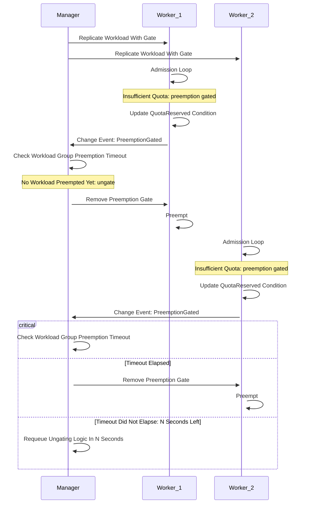

# KEP-8303: MultiKueue Synchronized Preemption

<!-- toc -->
- [Summary](#summary)
- [Motivation](#motivation)
  - [Goals](#goals)
  - [Non-Goals](#non-goals)
- [Proposal](#proposal)
  - [User Stories](#user-stories)
    - [Story 1](#story-1)
  - [Risks and Mitigations](#risks-and-mitigations)
- [Design Details](#design-details)
  - [API Definition](#api-definition)
    - [(alpha) Workload Annotations](#alpha-workload-annotations)
    - [(alpha) Extending the <code>QuotaReserved</code> Condition](#alpha-extending-the-quotareserved-condition)
    - [(alpha) <code>PreemptionGateTimeout</code> Configuration](#alpha-preemptiongatetimeout-configuration)
    - [(beta) Workload API](#beta-workload-api)
  - [MultiKueue Controller](#multikueue-controller)
  - [Test Plan](#test-plan)
    - [Unit Tests](#unit-tests)
    - [Integration tests](#integration-tests)
  - [Graduation Criteria](#graduation-criteria)
- [Implementation History](#implementation-history)
- [Drawbacks](#drawbacks)
- [Alternatives](#alternatives)
  - [Define a proper Workload API for alpha](#define-a-proper-workload-api-for-alpha)
<!-- /toc -->

## Summary

Currently, when a high-priority workload is dispatched to multiple worker clusters in a MultiKueue setup, it can trigger preemptions on all of them simultaneously.
However, since in the end the workload will only run on a single cluster, the preemptions on the other clusters are unnecessary and lead to wasted resources and disruptions.

This KEP proposes a mechanism to synchronize preemptions in these cases and considers how this feature can be extended to other scenarios.
It introduces a way for workloads to signal that they want to trigger a preemption and discusses the concept of "preemption gates" in the Workload API.

## Motivation

In a MultiKueue environment, a high-priority workload dispatched to multiple worker clusters can trigger simultaneous preemptions.
For instance, a workload sent to three clusters using the `AllAtOnce` strategy might initiate preemptions on all three.
Since the workload can only be admitted to one cluster, the preemptions on the other two are unnecessary and lead to wasted resources by
halting running workloads and then having to re-admit them. This problems grows with the amount of deployed worker clusters and should be taken into account by MultiKueue automatically.

Moreover, a general preemption gating/synchronization mechanism can be used to handle other scenarios in the Kueue ecosystem.

### Goals

- Increase resource usage in a MultiKueue environment by eliminating system-wide preemptions that disrupt running workloads.
- Propose a generalized mechanism that can be extended to other scenarios.

### Non-Goals

- Optimize logic for choosing which worker cluster should be allowed to preempt, beyond a simple first-come-first-served approach (i.e. considering any "preemption cost").
- Propose an analogous mechanism of borrowing synchronization.

## Proposal

The proposed solution is to use the alpha `kueue.x-k8s.io/cannot-preempt` annotation proposed in KEP-8729 as the "preemption gate" and introduce a
`PreemptionGated` reason to the `QuotaReserved` condition in the Workload's status, which will be used to signal that it's ready to preempt but was gated.
The manager cluster's MultiKueue controller that watches the replicated Workload objects will observe the condition and make a decision whether to remove the annotation from
the replica, allowing it to proceed.

The controllers responsible for dispatching workloads in a MultiKueue setup or creating virtual workloads for concurrent admission will be responsible for adding the
appropriate preemption gates to the workloads they manage.

If a preemption fails for some reason or the workload is not admitted after preemption, a **timeout mechanism** will ensure that the gate is eventually removed for other replica workloads so that
another worker gets a chance to preempt. If a worker was ungated, the `PreemptionGateTimeout` elapsed and the workload is still pending, another worker can be considered for ungating.
This prevents a single failing preemption from blocking all others.



### User Stories

#### Story 1

As a MultiKueue administrator, I want to maximize the resource usage of my system.
One team in my company regularly submits high priority jobs to the clusters, which causes system-wide
preemptions across many workers, halting the progress of jobs of other teams.

I want that team's jobs to still be promptly admitted, but without causing distruptions.

### Risks and Mitigations

1. The main risk of this proposal is the potential for deadlocks or starvation if the ungating logic is flawed.
For example, if the preemption synchronization controller fails to ungate a workload or the preemption fails, it could be blocked indefinitely.
This can be mitigated by implementing a timeout mechanism to re-queue the ungating decision.

2. The limitation of using the alpha `kueue.x-k8s.io/cannot-preempt` annotation is that it will make it impossible for the users to express MultiKueue
workloads that can **never** preempt.
This is mitigated by properly documenting the supported capabilities of the feature and graduating to a proper API in the beta phase.

## Design Details

### API Definition

#### (alpha) Workload Annotations

The `kueue.x-k8s.io/cannot-preempt` annotation will be automatically assigned to all replicated MultiKueue workloads.
The gating mechanism is consistent with the proposal in KEP-8729.

#### (alpha) Extending the `QuotaReserved` Condition

The `QuotaReserved` Condition will be extended to be able to signalize that the quota cannot be reserved due to a preemption gate.

```go

const (
  ...
	// WorkloadQuotaReserved means that the Workload has reserved quota a ClusterQueue.
  // The possible reasons for this condition are:
	// - "PreemptionGated": the workload could not preempt due to a preemption gate.
	WorkloadQuotaReserved = "QuotaReserved"
  ...
)

// Reasons for the WorkloadQuotaReserved condition.
const (
	// PreemptionGated indicates the Workload could free up quota via
	// preemption, but was prevented from doing so by a preemption gate.
	PreemptionGated string = "PreemptionGated"
)
```

By using the `QuotaReserved` condition rather than a new one, the existing mechanisms of resetting the quota reservation
(for example when re-queuing the workload) will overwrite the `PreemptionGated` condition reason instead of having to manage
it manually.

#### (alpha) `PreemptionGateTimeout` Configuration

The `MultiKueue` `Configuration` struct will be extended with a `PreemptionGateTimeout` that defines
the timeout of preemption, after which another worker replica can be ungated.

```go
type MultiKueue struct {
	// Defaults to 5 minutes.
	// +optional
	PreemptionGateTimeout *metav1.Duration `json:"preemptionGateTimeout,omitempty"`
}
```

Alternatively, instead of a static default value, it could be based upon another timeout like a multiple of `terminationGracePeriodSeconds`
which is given for the preempted workload's pods to gracefully terminate. Since, it would require a consistent configuration of that value
between the worker and manager clusters, the proposal is to default to a static value for simplicity.

#### (beta) Workload API

After gathering user feedback and mapping out all potential use-cases, the annotations can be abandoned in favor of a dedicated API.
For example:

```go
const (
    MultiKueuePreemptionGate = "kueue.x-k8s.io/multi-kueue"
    OtherPreemptionGate = "kueue.x-k8s.io/other"
    ...
)

type WorkloadPreemptionGate struct {
    // Name of the gate.
    Name string
}

type WorkloadStatus struct {
    // ...
    // PreemptionGates is a list of gates that must be removed before a workload can preempt.
    PreemptionGates []WorkloadPreemptionGate
}
```

The gating and signaling mechanisms would be changed to recognize the dedicated preemption gates, rather than the annotation.
The annotation could still be used as a job-level user opt-in mechanism, and create a "user-annotated" preemption gate under the hood.

### MultiKueue Controller

The logic of the controller governing preemption, running within the manager cluster, will be mostly API-agnostic.
The only part subject to change with the evolution of this proposal is how the workload will be ungated, e.g. which field will have to be
modified. Therefore, the following design can be expected to not change significantly over the course of development.

A manager-level preemption synchronization controller will be responsible for ungating the replicated workloads.
This controller will watch for workloads to change their `QuotaReserved` conditions and idempotently react to such changes:

1. Calculate `Now - PreviouslyUngatedAt`, i.e. `timeSinceUngate`.
1. If `timeSinceUngate < PreemptionTimeout`:
    1. Schedule reconciliation in `PreemptionTimeout - timeSinceUngate` seconds to prevent a hypothetical deadlock (lost reconciles) and return.
1. Find a workload that contains:
    * `QuotaReserved` reason set to `PreemptionGated`.
    * The lowest `QuotaReserved` `LastTransitionTime`.
    * The `kueue.x-k8s.io/cannot-preempt` annotation (to ignore already ungated workloads).
1. Ungate the workload and store `Now` in `PreviouslyUngatedAt`.
1. Schedule a reconciliation in `PreemptionTimeout`.

Until the need arises, the controller will maintain the `PreviouslyUngatedAt` time in the Kueue controller manager's memory.

### Test Plan

[x] I/we understand the owners of the involved components may require updates to
existing tests to make this code solid enough prior to committing the changes necessary
to implement this enhancement.

#### Unit Tests
- Unit tests will be added for the preemption gate logic in the workload controller.
- Unit tests for the preemption synchronization controller, covering the ungating and timeout logic.

#### Integration tests
- Integration tests will be added to verify that preemption is blocked for gated workloads.
- Integration tests for the MultiKueue scenario, ensuring that only one worker cluster attempts preemption at a time.
- Integration tests for the Concurrent Admission scenario, ensuring that only one resource flavor attempts preemption at a time.

### Graduation Criteria

The feature will be introduced behind a `SynchronizedPreemption` feature gate.

The `PreemptionTimeout` will be configurable in the Kueue configuration.

- **Alpha**:
  - Feature implemented behind the feature gate, disabled by default.
  - Preemption gating is based upon the annotations proposed in KEP-8729.
  - Unit and integration tests are implemented.
- **Beta**:
  - Feature gate is enabled by default.
  - The feature has been tested in a production-like environment.
  - User feedback was gathered and emerging use-cases are taken into consideration.
  - The Kueue APIs are extended with preemption gating structures in favor of Workload annotations.
- **Stable**:
  - The feature is considered stable and the feature gate is removed.

## Implementation History

- 2026-02-04: Initial draft of the KEP.

## Drawbacks

The main drawback of this proposal is the added complexity of the preemption synchronization controller. This controller needs to be robust and reliable to avoid deadlocks and starvation.

## Alternatives

### Define a proper Workload API for alpha

Instead of relying on the annotations, preemption gates or a similar mechanism could be expressed as a Workload API.

**Reasons for discarding/deferring**

1. Given the potential overlap between this KEP, KEP-8729 and KEP-8691, the shape of the API might not be obvious.
1. There are few drawbacks from using the simplest possible solution (annotations) without API lock-in.
1. The MultiKueue preemption management is largely API independent and is the first priority. Gathering user feedback
from this implementation will inform the correct API structure.