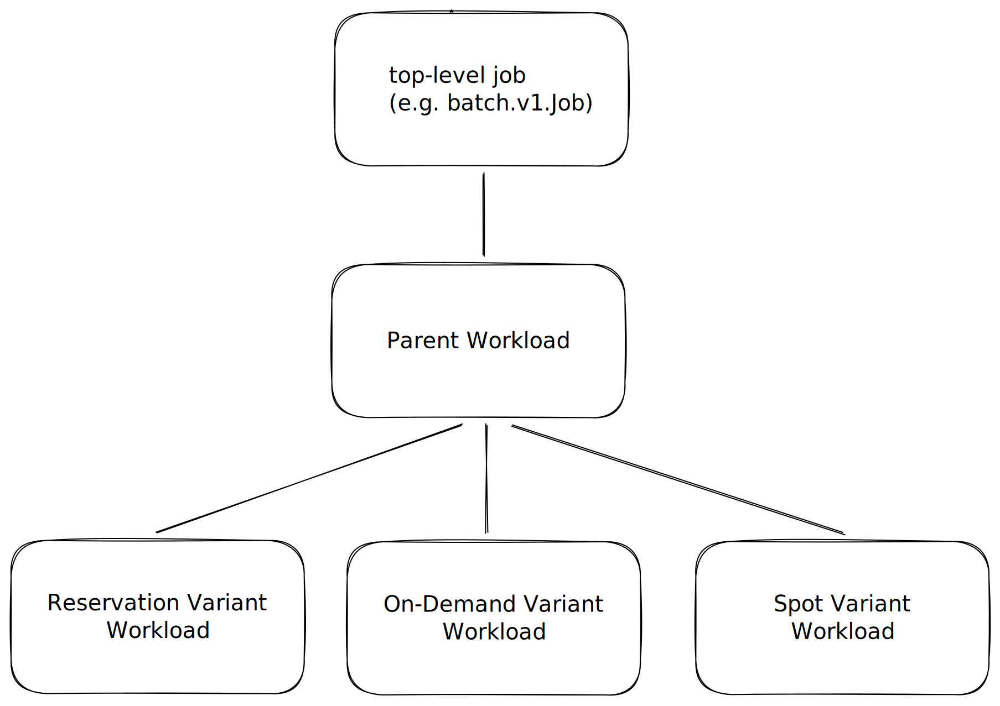

# KEP-8691: Concurrent Admission

<!--
This is the title of your KEP. Keep it short, simple, and descriptive. A good
title can help communicate what the KEP is and should be considered as part of
any review.
-->

<!--
A table of contents is helpful for quickly jumping to sections of a KEP and for
highlighting any additional information provided beyond the standard KEP
template.

Ensure the TOC is wrapped with
  <code>&lt;!-- toc --&rt;&lt;!-- /toc --&rt;</code>
tags, and then generate with `hack/update-toc.sh`.
-->

<!-- toc -->
- [Summary](#summary)
- [Motivation](#motivation)
  - [Goals](#goals)
  - [Non-Goals](#non-goals)
- [Proposal](#proposal)
  - [Architecture &amp; Cardinality](#architecture--cardinality)
  - [Scheduling &amp; Lifecycle](#scheduling--lifecycle)
  - [User Stories](#user-stories)
    - [Story 1: ResourceFlavor Upgrade](#story-1-resourceflavor-upgrade)
    - [Story 2: Upgrade only to Reservation](#story-2-upgrade-only-to-reservation)
    - [Story 3: Reservation + Homogenous Flavors](#story-3-reservation--homogenous-flavors)
    - [Story 4: Homogenous Flavors only](#story-4-homogenous-flavors-only)
    - [Story 5: Delaying Variant creation](#story-5-delaying-variant-creation)
    - [Story 6: Limit when migration can happen](#story-6-limit-when-migration-can-happen)
    - [Story 7: Workload with multiple PodSets](#story-7-workload-with-multiple-podsets)
- [Design Details](#design-details)
  - [ClusterQueue API](#clusterqueue-api)
  - [Workload API](#workload-api)
    - [Naming Convention](#naming-convention)
    - [Workload Spec](#workload-spec)
    - [Workload Status](#workload-status)
  - [Variant Controller](#variant-controller)
    - [Creation](#creation)
    - [Aggregation](#aggregation)
    - [Policy Enforcement](#policy-enforcement)
    - [Eviction](#eviction)
  - [Observability](#observability)
  - [Code Changes Complexity](#code-changes-complexity)
  - [Reserving Quota for the same Workload twice](#reserving-quota-for-the-same-workload-twice)
  - [Multiple Preemptions](#multiple-preemptions)
  - [Ordering Variants](#ordering-variants)
  - [Notes/Constraints/Caveats (Optional)](#notesconstraintscaveats-optional)
    - [StrictFIFO](#strictfifo)
  - [Risks and Mitigations](#risks-and-mitigations)
  - [FlavorFungibility Misinterpretation](#flavorfungibility-misinterpretation)
    - [Misconfiguration](#misconfiguration)
  - [Test Plan](#test-plan)
      - [Prerequisite testing updates](#prerequisite-testing-updates)
    - [Unit Tests](#unit-tests)
    - [Integration tests](#integration-tests)
  - [Graduation Criteria](#graduation-criteria)
    - [Alpha](#alpha)
    - [Beta](#beta)
    - [GA](#ga)
- [Implementation History](#implementation-history)
- [Drawbacks](#drawbacks)
  - [Increased API Object Count](#increased-api-object-count)
- [Alternatives](#alternatives)
  - [Modify AdmissionCheck API](#modify-admissioncheck-api)
  - [Migration within a Single Workload](#migration-within-a-single-workload)
  - [WorkloadTypes API](#workloadtypes-api)
<!-- /toc -->

## Summary

Currently, the Kueue admission process selects a single ResourceFlavor (RF) and pursues it until the workload is admitted. This KEP proposes Concurrent Admission, allowing a Workload to attempt multiple ResourceFlavors simultaneously.

Kueue will create clones of a Workload, referred to as Variants. Each Variant is scheduled independently on a specific subset of ResourceFlavors. This unblocks scenarios where a user needs
to maintain a path to "upgrade" a Workload from a less preferred flavor to a more preferred one as it becomes available, or to "race" multiple long-running AdmissionChecks (e.g., across different accelerator types)

<!--
This section is incredibly important for producing high-quality, user-focused
documentation such as release notes or a development roadmap. It should be
possible to collect this information before implementation begins, in order to
avoid requiring implementors to split their attention between writing release
notes and implementing the feature itself. KEP editors and SIG Docs
should help to ensure that the tone and content of the `Summary` section is
useful for a wide audience.

A good summary is probably at least a paragraph in length.

Both in this section and below, follow the guidelines of the [documentation
style guide]. In particular, wrap lines to a reasonable length, to make it
easier for reviewers to cite specific portions, and to minimize diff churn on
updates.

[documentation style guide]: https://github.com/kubernetes/community/blob/master/contributors/guide/style-guide.md
-->

## Motivation

The current single-flavor evaluation leads to several inefficiencies:
- Inability to migrate: Workloads cannot move to a more preferred RF (like a Reservation) once they are already running on a less preferred one.
- Sequential bottlenecks: Users cannot pursue multiple flavors (which often include long-running AdmissionChecks) in parallel to find placement as quickly as possible.

The feature is intended for environments where gains from the accuracy of scheduling decision (potential migration) outweighs
the throughput degradation. This is also intended for Jobs that can tolerate disruption, since migration involves
recreating Pods on more preferable Nodes.

<!--
This section is for explicitly listing the motivation, goals, and non-goals of
this KEP.  Describe why the change is important and the benefits to users. The
motivation section can optionally provide links to [experience reports] to
demonstrate the interest in a KEP within the wider Kubernetes community.

[experience reports]: https://github.com/golang/go/wiki/ExperienceReports
-->

### Goals
- Pursue capacity on multiple flavors (e.g. Spot and Reservation) simultaneously.

- Start two or more independent long-running AdmissionChecks until any succeeds.

- Support various policies on migration to more desired flavor

  - Do not migrate at all

  - Migrate only to "higher" RFs than the admitted one

  - Migrate only to a subset of RFs

  - Do not migrate after certain amount of time

- Delay fallback to "lower" RFs than the currently tried

- Make more accurate scheduling decisions at the cost of performance


<!--
List the specific goals of the KEP. What is it trying to achieve? How will we
know that this has succeeded?
-->

### Non-Goals

- Describe the exact behavior of ConcurrentAdmission with `StrictFIFO` queueing strategy.

<!--
What is out of scope for this KEP? Listing non-goals helps to focus discussion
and make progress.
-->

## Proposal

We propose a new opt-in feature called Concurrent Admission.

This proposal introduces two new logical categories of Workloads that coexist with existing "regular" Workloads
1) Parent Workload: Acts as an owner and status aggregator for its associated Variants. It is explicitly excluded from Kueue's core scheduling logic.
2) Variant Workload: A cloned view of the Parent Workload with specific scheduling constraints. Most notably, a Variant is restricted to a subset of ResourceFlavors.

### Architecture & Cardinality
The relationship between a Parent and its Variants follows a parent–child model with 1:N cardinality (where $N \ge 1$). While the number of Variants is typically determined by the variety of PodSets and ClusterQueue ResourceFlavors, each remains a distinct Kubernetes object persisted in etcd.



### Scheduling & Lifecycle
A Variant Workload functions near-identically to a "regular" Workload regarding quota accounting, preemption, and core scheduling features.

At any given point in time, only one Variant per Parent may be admitted by Kueue.

To support this, we will introduce a new controller and extend the ClusterQueue API with a new `.spec` field to manage Variant activation and deactivation.

Those new types of Workloads can freely coexist with "regular" Workloads in a cluster.

The relationship between a Parent and its Variants is parent–child, with 1:1+ cardinality.
Every Parent has at least one Variant, and potentially more depending on PodSets and ClusterQueue ResourceFlavors.
All of them are separate k8s objects stored in etcd.

A parent Workload is excluded from the scheduling logic in Kueue. It acts as a owner and status aggregator of Variants.

A Variant Workload is a cloned view of its Parent with some additional scheduling constraints,
in particular it can be scheduled on a limited number of ResourceFlavors.

Apart from that a Variants Workload acts almost identically as a "regular" Workload regarding scheduling, quota accounting and other core features.

At any given point in time, only one Variant can be admitted by Kueue.

To accommodate the above proposal we introduce a new controller, and extend the ClusterQueue API with a new `.spec` level field.
A Variant can get activated/deactivated based on the new API, more about its lifecycle below.


<!--
This is where we get down to the specifics of what the proposal actually is.
This should have enough detail that reviewers can understand exactly what
you're proposing, but should not include things like API designs or
implementation. What is the desired outcome and how do we measure success?.
The "Design Details" section below is for the real
nitty-gritty.
-->

### User Stories

#### Story 1: ResourceFlavor Upgrade
As an admin I have three resource flavors in my cluster:
1) Most preferable: Reservation
2) Less preferable: On-Demand
3) Least preferable: Spot

I want my workloads to start as soon as possible, on whatever flavor. However, if a more preferable flavor releases some quota, I want to migrate to that flavor.

To achieve that, I configure my ClusterQueue to use the UpgradeOnly mode.

```
apiVersion: kueue.x-k8s.io/v1beta2
kind: ClusterQueue
metadata:
  name: "cluster-queue"
spec:
  ...
  concurrentAdmission:
    migrationConstraints:
      mode: UpgradeOnly
```

#### Story 2: Upgrade only to Reservation
As an admin I have three resource flavors in my cluster:
1) Most preferable: Reservation
2) Less preferable: On-Demand
3) Least preferable: Spot

I want my workloads to start as soon as possible, on whatever flavor. However, I only want to incur the cost of migration if it means landing on the "Reservation" flavor.

To achieve that, I set the minFlavor to "reservation". This ensures that a workload on "Spot" will not migrate to "On-Demand," only to "Reservation."

```
apiVersion: kueue.x-k8s.io/v1beta2
kind: ClusterQueue
metadata:
  name: "cluster-queue"
spec:
  ...
  concurrentAdmission:
    migrationConstraints:
      mode: UpgradeOnly
      minFlavor: "reservation"
```

#### Story 3: Reservation + Homogenous Flavors
As an admin I have four resource flavors in my cluster:
1) Most preferable: Reservation
2a) Less preferable flavor with a long-running AdmissionCheck
2b) Homogenous, less preferable flavor with a long-running AdmissionCheck
2c) Homogenous, less preferable flavor with a long-running AdmissionCheck

I want my workloads to start as soon as possible. I want to migrate to "Reservation" if it becomes available, but I don't want to migrate between the homogeneous 2a/2b/2c flavors.

By setting the minFlavor to "reservation", Kueue will ignore available capacity in 2a if the workload is already running on 2b.

```
apiVersion: kueue.x-k8s.io/v1beta2
kind: ClusterQueue
metadata:
  name: "cluster-queue"
spec:
  ...
  concurrentAdmission:
    migrationConstraints:
      mode: UpgradeOnly
      minFlavor: reservation
```

#### Story 4: Homogenous Flavors only
As an admin, I have three homogeneous resource flavors (1a, 1b, 1c). I want my workloads to start as soon as possible on any flavor and stop pursuing other variants once the job is accommodated.

To achieve that, I use the `NoMigration` mode.

```
apiVersion: kueue.x-k8s.io/v1beta2
kind: ClusterQueue
metadata:
  name: "cluster-queue"
spec:
  ...
  concurrentAdmission:
    migrationConstraints:
      mode: NoMigration
```

#### Story 5: Delaying Variant creation
As an admin I have two resource flavors in my cluster:
1) Most preferable: Reservation
2) Less preferable: On-Demand

I want to attempt scheduling on "Reservation" exclusively for the first 2 hours before allowing the "On-Demand" variant to activate.

To achieve this, I use explicitVariants and set createDelaySeconds for the On-Demand variant.

```
apiVersion: kueue.x-k8s.io/v1beta2
kind: ClusterQueue
metadata:
  name: "cluster-queue"
spec:
  ...
  concurrentAdmission:
    migrationConstraints:
      mode: UpgradeOnly
    explicitVariants:
      - name: "reservation"
        allowedResourceFlavors: ["Reservation"]
      - name: "on-demand"
        allowedResourceFlavors: ["On-Demand"]
        createDelaySeconds: 7200
```

#### Story 6: Limit when migration can happen
As an admin I have two resource flavors in my CQ:
1) Most preferable: Reservation
2) Less preferable: On-Demand

I want to avoid migrating a long-running workload if it is nearing completion. I want to constrain the migration window to the first 24 hours (86,400 seconds) of the workload's lifecycle.

To achieve this, I set deleteDelaySeconds on the more preferred variant. After this time passes, the "Reservation" variant is deactivated, preventing any further upgrades.

```
apiVersion: kueue.x-k8s.io/v1beta2
kind: ClusterQueue
metadata:
  name: "cluster-queue"
spec:
  ...
  concurrentAdmission:
    migrationConstraints:
      mode: UpgradeOnly
    explicitVariants:
      - name: "reservation"
        allowedResourceFlavors: ["Reservation"]
        deleteDelaySeconds: 86400
      - name: "on-demand"
        allowedResourceFlavors: ["On-Demand"]
```

#### Story 7: Workload with multiple PodSets
As an admin I have two GPU resource flavors and one CPU resource flavor in my cluster.
GPU:
1) Most preferable: Reservation
2) Less preferable: On-Demand

CPU:
1) Default-CPU

I want to allow upgrades for the GPU portion while keeping the CPU flavor constant across variants.

```
apiVersion: kueue.x-k8s.io/v1beta2
kind: ClusterQueue
metadata:
  name: "cluster-queue"
spec:
  ...
  concurrentAdmission:
    migrationConstraints:
      mode: UpgradeOnly
    explicitVariants:
      - name: "reservation-flavor"
        allowedResourceFlavors: ["Reservation", "Default-CPU"]
      - name: "on-demand-flavor"
        allowedResourceFlavors: ["On-Demand", "Default-CPU"]
```

<!--
What are the risks of this proposal, and how do we mitigate? Think broadly.
For example, consider both security and how this will impact the larger
Kubernetes ecosystem.

How will security be reviewed, and by whom?

How will UX be reviewed, and by whom?

Consider including folks who also work outside the SIG or subproject.
-->

## Design Details

### ClusterQueue API
The ClusterQueue is extended to define the policy for concurrent attempts. This includes how to handle sibling Variants once one is admitted and how to define specific, customized Variants.

```
type ClusterQueueSpec struct {
    ...
    // +optional
    ConcurrentAdmission *ConcurrentAdmission
}

type ConcurrentAdmission struct {
    // MigrationConstraints defines the constraints of Variants' migration
    //
    // +required
    MigrationConstraints ConcurrentAdmissionMigrationConstraints


    // ExplicitVariants allows for fine-grained control over which variants are created.
    // If not specified, Kueue creates a variant for each RF mentioned in the CQ.
    //
    // +optional
    // +kubebuilder:validation:MaxItems=16
    ExplicitVariants []ConcurrentAdmissionExplicitVariant
}

type ConcurrentAdmissionMigrationMode string

const (
    // Do not allow any kind of migration
    NoMigration ConcurrentAdmissionMigrationMode = "NoMigration"

    // Allow upgrades
    UpgradeOnly ConcurrentAdmissionMigrationMode = "UpgradeOnly"
)

type ConcurrentAdmissionMigrationConstraints struct {
    // Mode defines the mode of Workload's migration.
    //
    // +required
    Mode ConcurrentAdmissionMigrationMode

    // MinFlavor defines the minimal flavor a Workload can migrate to.
    // The order is based on the order of flavors in ClusterQueue.
    // It can only be used if the Mode is `UpgradeOnly` and `ExplicitVariants` is not specified.
    // It the Mode is `UpgradeOnly` and MinFlavor is not specified, then there's
    // no constraints on what flavors a Workload can migrate to.
    //
    // +optional
    MinFlavor *ResourceFlavorReference

    // MinVariant defines the minimal Variant a Workload can migrate to.
    // The order is based on the order of variant in `ExplicitVariants`.
    // It can only be used if the Mode is `UpgradeOnly` and `ExplicitVariants` is specified.
    // It the Mode is `UpgradeOnly` and MinVariant is not specified, then there's
    // no constraints on what Variant a Workload can migrate to.
    //
    // +optional
    MinVariant *string
}

type ConcurrentAdmissionExplicitVariant struct {
    // Name of the variant, must be unique within the ClusterQueue.
    //
    // +required
    Name string

    // CreateDelaySeconds defines how long after Workload creation this Variant is activated.
    // Allows prioritizing a preferred RF before falling back to others.
    //
    // +optional
    CreateDelaySeconds *int32

    // DeleteDelaySeconds defines how long after admission of other Variants,
    // this Variant should be deactivated.
    // Allows disallowing migration after certain amount of time
    //
    // +optional
    DeleteDelaySeconds *int32

    // AllowedResourceFlavors limits which flavors can be assigned to PodSets for this variant.
    //
    // +required
    AllowedResourceFlavors []ResourceFlavorReference
}
```

### Workload API

A Variant Workload references its Parent in the `metadata.ownerReferences` field.
Besides that a Parent Workload has the `kueue.x-k8s.io/parent-variant` annotation to distinguish it from
"regular" Workloads, in a cluster.

This way of distinguishing Variants, Parents, and "regular" Workloads is introduced in the Alpha, and will be
revisited when graduating to Beta.

#### Naming Convention

To maintain a clear relationship between the parent and its virtual clones, the Variant Workloads will follow a strict naming convention.

**Default RF Variants**: When Variants are created automatically for each ResourceFlavor in the ClusterQueue, the name follows:

```
${original_workload_name}-variant-${resource_flavor_name}
```

**Explicit Variants**: When specific names are provided in the ExplicitVariants configuration:

```
${original_workload_name}-variant-${explicit_variant_name}
```

Note: Variant names are designed to be deterministic. If a name collision occurs (due to long Workload/RF names), standard Kueue suffix truncation logic will be applied while maintaining the -variant- identifier.

#### Workload Spec

We propose to extend Workload's Spec API to have the capability to narrow the set of ResourceFlavors that can be used
for scheduling a Workload.

```
type WorkloadSpec struct {
    ...
    // AdmissionConstraints describes the constraints Kueue scheduling algorithm takes into account
    // when reserving quota for a Workload.
    //
    // +optional
    AdmissionConstraints *AdmissionConstraints
}

type AdmissionConstraints struct {
  ...

	// If set, only RF from this list can be assigned to this Workload.
  //
  // +optional
  AllowedResourceFlavors []ResourceFlavorReference
}

```

#### Workload Status

To ensure the user can easily check which attempts are still active, the WorkloadStatus is extended to include a Variants list.
This provides a central view of all virtual workloads without needing to query for child objects manually.

For more detailed scheduling stats a user can check a particular Variant Workload.

```
type WorkloadVariantStatus struct {
    // name of the Variant (corresponds to the virtual workload name).
    Name string

    // resourceFlavors assigned to this Variant.
    ResourceFlavors []string

    // inherited information from Variant's `.spec.active.` field.
    Active bool

    // selected Conditions present in Variant, to inherit information about
    // its state e.g. whether it's pending or admitted.
    //
    // +optional
    // +listType=map
    // +listMapKey=type
    Conditions []metav1.Condition 
}

type WorkloadStatus struct {
    // ... existing fields ...

    // Variants tracks the state of all concurrent admission attempts.
    Variants []WorkloadVariantStatus
}
```

### Variant Controller

A dedicated Variant Controller will be introduced to manage the state and lifespan of Variant Workloads and the relationship with the Parent Workload.

#### Creation
The controller creates Variants based on the CQ's `ExplicitVariants` or ResourceFlavor list.
It happens in a standalone asynchronous reconciliation loop right after the Parent Workload has been created.

The controller doesn't evaluate ResourceFlavors on its own, in particular it doesn't check if a Variant
can be ever admitted with the ResourceFlavor assigned. It defers all scheduling decision to the scheduler.
It is the cluster admin's responsibilities to configure ResourceFlavors and ConcurrentAdmission API in a way to prevent creation of Variants that can never schedule.

The controller also reacts on changes both in CQ's `ExplicitVariants` and ResourceFlavor list creating and deleting Variants accordingly.

#### Aggregation
The controller syncs the status of Variants back into a Parent. A Parent aggregates information from Variants and acts as source of truth
for the top-level jobs. Once any of the Variants is admitted, the Parent is also marked as admitted. Then Parent unsuspends the top-level job.

Once any of the Variants is evicted it should suspend the job.

#### Policy Enforcement
The controller is responsible for executing `MigrationConstraints` upon an admission of a Variant. It should deactivate Variants with respect to a chosen policy.
It should also activate and deactivate Variants based on `CreateDelaySeconds` and `DeleteDelaySeconds` fields.

#### Eviction
A Variant can be evicted because of its sibling Variant during the "upgrade" process, in that case the evicted Variant
is simply deactivated.

In case of preemption by other Workloads (e.g. priority-based preemption), we reset all the Variants and treat them as if
Parent Workload has just been created - we reset the delay countdown, and activate all Variants again (beside those ones with `CreateDelaySeconds`)

### Observability

Users can track the progress of concurrent attempts via:

Status: The Parent Workload status will list status of all Variants.

Checking a particular Variant directly.

The existing metrics will be only used to track Parent Workloads, and skip Variants.
We'll revisit adding more metrics per Variants when graduating to Beta, based on users' feedback.

### Code Changes Complexity

The feature should require as few changes in the quota accounting, scheduling, other core Kueue features as possible.
It creates Workloads that should be treated as regular Workloads, but are controlled by the `VariantsController` that
can create/activate/deactivate Variants.

With making as little changes to scheduling logic as possible in mind, we still need to work on at least 3 things there:
1) Narrowing selection of ResourceFlavors for a given Workload. This however can be also used outside of the Concurrent Admissions feature, creating more flexibility for Kueue.
2) Evicting sibling Variants when admitting more preferable ones.

### Reserving Quota for the same Workload twice

Migrating to a more preferred flavor could lead to booking quota for the same Workload twice — once for the running instance and once for the "upgrade" attempt.
A more preferred Variant must evict the less preferable one immediately before admission to ensure resource utilization remains accurate, and fair sharing is not negatively impacted.

### Multiple Preemptions

When pursuing multiple flavors concurrently, Kueue might preempt Workloads to accommodate multiple Variants belonging to the same Parent Workload.
While we only issue preemptions coming from one Workload per CQ, what happen is:
1. A Variant preempted a Workload and got the quota reserved.
2. The same Variants is now running AdmissionChecks
3. A sibling Variants is picked up by the scheduler and is preempting some other Workloads

We want to disallow other Variants to preempt if one of the Variants has already preempted some Workloads.
We achieve it by storing in memory a map of Workloads that have issued a preemption during their current admission cycle.

### Ordering Variants

The `VariantsController` leverages the existing implementation of scheduling logic in Kueue, where Workloads are sorted
by priorities and creation timestamps and then picked-up by the scheduler one per scheduling cycle (per ClusterQueue).
This means when creating Variants the controller should ensure more favorable Variants are ahead of less favorable ones in the queue.
This could be achieved by adding another dimension to our heap sort mechanism that would only
be used for sorting sibling Variants. The value of this dimension would be filled by the Variant Controller based on the order of ResourceFlavors in ClusterQueue.
Thanks to that we also have a guarantee that sibling Variants are always adjacent in the heap, which
results in Kueue scheduler picking sibling Variants one after the another, without any other Workloads in between.

### Notes/Constraints/Caveats (Optional)

#### StrictFIFO

Handling `StrictFIFO` queueing strategy comes with challenges.

The most important one is once less favorable Variants is admitted,
scheduler cannot try admitting more favorable Variants (migration)
and let other Workloads schedule at the same time, without violating `StrictFIFO` semantics.
It can either try the more favorable Variant over and over which blocks the queue, or
let other Workloads schedule, which violates the `StrictFIFO`

The other one is to not block Variants siblings if the first one cannot be scheduled. There are at least couple of ways to solve it:

1) Grouped Popping - the scheduler could pick up all of the Variants belonging to the same parent from the heap and then process them within the same schedulingCycle. Each heap node would still consist of one Workload.
2) The heap node consists of all of the Variants belonging to the same parent Workload.
3) The scheduler picks up only one Variant per scheduling cycle. If there's a sibling in the heap head, it doesn't put back the processed after failed scheduling. Instead it lets the other Variant run.

For Alpha and Beta version of this feature we don't plan to support `StrictFIFO` queueing strategy. Based on users' feedback we will reconsider it for GA.

### Risks and Mitigations
### FlavorFungibility Misinterpretation

In the first iteration of the feature we don't plan to integrate with the `FlavorFungibility` on the
inter-Variants level. It means that the `OnSuccessPolicy` is binary - if a Variant has been admitted or not.
It doesn't take into account if preemption or borrowing was necessary to admit a Variant. The preference order of Variants
is purely based on ResourceFlavors used, and user doesn't have capabilities to express what to do if e.g. two Variants can be
admitted, but the more preferable one requires preemption. The more preferable one will always be chosen.

At the same time if a single Variant can be scheduled onto multiple flavors due to `ExplicitVariants`, it follows
the `FlavorFungibility` config.

This may lead to confusion, so we need to address this use-case directly in the documentation.

#### Misconfiguration

The overall complexity of this feature may lead to misconfigurations. To mitigate this risk
we should provide users with comprehensive documentation and examples.

<!--
This section should contain enough information that the specifics of your
change are understandable. This may include API specs (though not always
required) or even code snippets. If there's any ambiguity about HOW your
proposal will be implemented, this is the place to discuss them.
-->

### Test Plan

<!--
**Note:** *Not required until targeted at a release.*
The goal is to ensure that we don't accept enhancements with inadequate testing.

All code is expected to have adequate tests (eventually with coverage
expectations). Please adhere to the [Kubernetes testing guidelines][testing-guidelines]
when drafting this test plan.

[testing-guidelines]: https://git.k8s.io/community/contributors/devel/sig-testing/testing.md
-->

[X] I/we understand the owners of the involved components may require updates to
existing tests to make this code solid enough prior to committing the changes necessary
to implement this enhancement.

##### Prerequisite testing updates


<!--
Based on reviewers feedback describe what additional tests need to be added prior
implementing this enhancement to ensure the enhancements have also solid foundations.
-->

#### Unit Tests

<!--
In principle every added code should have complete unit test coverage, so providing
the exact set of tests will not bring additional value.
However, if complete unit test coverage is not possible, explain the reason of it
together with explanation why this is acceptable.
-->

<!--
Additionally, try to enumerate the core package you will be touching
to implement this enhancement and provide the current unit coverage for those
in the form of:
- <package>: <date> - <current test coverage>

This can inform certain test coverage improvements that we want to do before
extending the production code to implement this enhancement.
-->

- `<package>`: `<date>` - `<test coverage>`

#### Integration tests

<!--
Describe what tests will be added to ensure proper quality of the enhancement.

After the implementation PR is merged, add the names of the tests here.
-->

### Graduation Criteria

#### Alpha
In Alpha version the feature will be gated behind the `ConcurrentAdmission` feature gate.

Support for `MigrationConstraints.Mode=UpgradeOnly` and `MigrationConstraints.MinFlavor` .

Integration with `BestEffortFIFO` queueing strategy.

Introduction of `AdmissionConstraints` field.

#### Beta

Support for `MigrationConstraints.Mode=NoMigration` and `MigrationConstraints.MinVariant`.

Introduction of `ExplicitVariants` functionality.

Revisit extending `ExplicitVariants` API with some additional fields.

Minimizing number of Variants issuing preemptions to only one per Parent.

Revisit the idea of [introducing WorkloadType API](#workloadtypes-api)

Positive feedback from users.

Adding/updating Kueue metrics based on users' feedback.

Revisit the [`WorkloadStatus`](#workload-status) changes

#### GA

Reconsider support for `StrictFIFO` queueing strategy.

<!--

Clearly define what it means for the feature to be implemented and
considered stable.

If the feature you are introducing has high complexity, consider adding graduation
milestones with these graduation criteria:
- [Maturity levels (`alpha`, `beta`, `stable`)][maturity-levels]
- [Feature gate][feature gate] lifecycle
- [Deprecation policy][deprecation-policy]

[feature gate]: https://git.k8s.io/community/contributors/devel/sig-architecture/feature-gates.md
[maturity-levels]: https://git.k8s.io/community/contributors/devel/sig-architecture/api_changes.md#alpha-beta-and-stable-versions
[deprecation-policy]: https://kubernetes.io/docs/reference/using-api/deprecation-policy/
-->


## Implementation History

<!--
Major milestones in the lifecycle of a KEP should be tracked in this section.
Major milestones might include:
- the `Summary` and `Motivation` sections being merged, signaling SIG acceptance
- the `Proposal` section being merged, signaling agreement on a proposed design
- the date implementation started
- the first Kubernetes release where an initial version of the KEP was available
- the version of Kubernetes where the KEP graduated to general availability
- when the KEP was retired or superseded
-->

## Drawbacks

### Increased API Object Count

With this feature Kueue creates more API Object that put pressure on core k8s components such as e.g. API Server or etcd.

Additionally, since one Job corresponds to potentially multiple Workloads it increases the cost of scheduling a Job by Kueue.
In worst case scenario Kueue scheduler needs to do **V** (number of Variants per Job) number of scheduling cycles before it admits the last one.
However those loops are lighter than for a regular Workload, since because of the scheduling constraints they only consider a subset of ResourceFlavors.

This is a drawback only for environments with thousands of Jobs incoming, where the accuracy of scheduling is amortized by the inflow
on incoming Jobs, and hence throughput is more important. In environments with fewer and bigger Jobs, the gain from scheduling decisions and
upgrades outweighs the performance penalty.

<!--
Why should this KEP _not_ be implemented?
-->

## Alternatives

### Modify AdmissionCheck API
We considered changing the AdmissionCheck API to issue multiple checks simultaneously and wait until only one succeeds (OR logic) rather than requiring all to succeed (AND logic).

Rejected because: This approach fails to address the requirement for migrating from a less desired to a more desired flavor once the workload is already admitted.

### Migration within a Single Workload
We considered implementing the migration and parallel attempt logic directly within a single Workload object.

Rejected because: This introduces significant complexity to the core scheduling and usage accounting logic, which is already highly complex.
Such a change would make Kueue much harder to debug and maintain, whereas the Variants pattern keeps the scheduling logic clean and and reuses already existing core functionalities

### WorkloadTypes API

Instead of using `kueue.x-k8s.io/parent-variant` annotation and owner references we could implement a new API `WorkloadType`.
We might migrate to that approach but it was deferred in the first version, as it was unclear what's the semantic of this
field and how it should be used with the existing "types" such, as WorkloadSlice, PrebuiltWorkload, etc.

```
type WorkloadType string
const (
    Default              WorkloadType = "Default"
    ResourceFlavorVariant WorkloadType = "ResourceFlavorVariant"
    Parent               WorkloadType = "Parent"
    ... // possibly more like WorkloadSlice, PrebuiltWorkload
)
```
<!--
What other approaches did you consider, and why did you rule them out? These do
not need to be as detailed as the proposal, but should include enough
information to express the idea and why it was not acceptable.
-->
