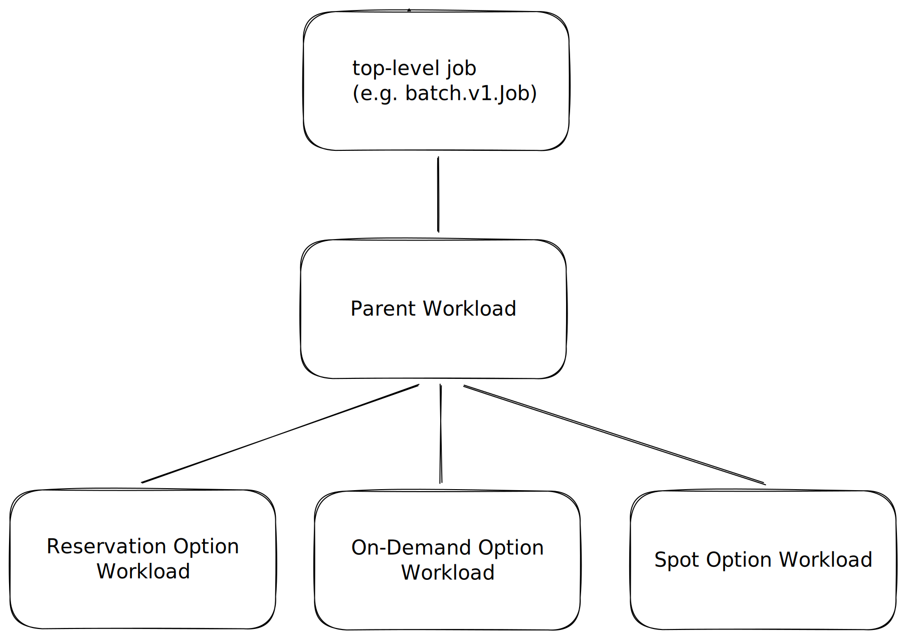

# KEP-8691: Concurrent Admission

<!--
This is the title of your KEP. Keep it short, simple, and descriptive. A good
title can help communicate what the KEP is and should be considered as part of
any review.
-->

<!--
A table of contents is helpful for quickly jumping to sections of a KEP and for
highlighting any additional information provided beyond the standard KEP
template.

Ensure the TOC is wrapped with
  <code>&lt;!-- toc --&rt;&lt;!-- /toc --&rt;</code>
tags, and then generate with `hack/update-toc.sh`.
-->

<!-- toc -->
- [Summary](#summary)
- [Motivation](#motivation)
  - [Goals](#goals)
  - [Non-Goals](#non-goals)
- [Proposal](#proposal)
  - [User Stories](#user-stories)
    - [Story 1: ResourceFlavor Upgrade](#story-1-resourceflavor-upgrade)
    - [Story 2: Upgrade only to Reservation](#story-2-upgrade-only-to-reservation)
    - [Story 3: Reservation + Homogenous Flavors](#story-3-reservation--homogenous-flavors)
    - [Story 4: Homogenous Flavors only](#story-4-homogenous-flavors-only)
    - [Story 5: Delaying Option creation](#story-5-delaying-option-creation)
    - [Story 6: Limit when migration can happen](#story-6-limit-when-migration-can-happen)
    - [Story 7: Workload with multiple PodSets](#story-7-workload-with-multiple-podsets)
- [Design Details](#design-details)
  - [ClusterQueue API](#clusterqueue-api)
    - [OnSuccess Policies](#onsuccess-policies)
  - [Workload API](#workload-api)
    - [Naming Convention](#naming-convention)
    - [Workload Spec](#workload-spec)
    - [Workload Status](#workload-status)
  - [Option Controller](#option-controller)
    - [Creation](#creation)
    - [Aggregation](#aggregation)
    - [Policy Enforcement](#policy-enforcement)
    - [Eviction](#eviction)
  - [Observability](#observability)
  - [Code Changes Complexity](#code-changes-complexity)
  - [Reserving Quota for the same Workload twice](#reserving-quota-for-the-same-workload-twice)
  - [Multiple Preemptions](#multiple-preemptions)
  - [Ordering Options](#ordering-options)
  - [FlavorFungibility](#flavorfungibility)
  - [Notes/Constraints/Caveats (Optional)](#notesconstraintscaveats-optional)
    - [StrictFIFO](#strictfifo)
  - [Risks and Mitigations](#risks-and-mitigations)
    - [Misconfiguration](#misconfiguration)
  - [Test Plan](#test-plan)
      - [Prerequisite testing updates](#prerequisite-testing-updates)
    - [Unit Tests](#unit-tests)
    - [Integration tests](#integration-tests)
  - [Graduation Criteria](#graduation-criteria)
    - [Alpha](#alpha)
    - [Beta](#beta)
    - [GA](#ga)
- [Implementation History](#implementation-history)
- [Drawbacks](#drawbacks)
  - [Increased API Object Count](#increased-api-object-count)
- [Alternatives](#alternatives)
  - [Modify AdmissionCheck API](#modify-admissioncheck-api)
  - [Migration within a Single Workload](#migration-within-a-single-workload)
<!-- /toc -->

## Summary

Currently, the Kueue admission process selects a single ResourceFlavor (RF) and pursues it until the workload is admitted. This KEP proposes Concurrent Admission, allowing a Workload to attempt multiple ResourceFlavors simultaneously.

Kueue will create clones of a Workload, referred to as Options. Each Option is scheduled independently on a specific subset of ResourceFlavors. This unblocks scenarios where a user needs
to maintain a path to "upgrade" a Workload from a less preferred flavor to a more preferred one as it becomes available, or to "race" multiple long-running AdmissionChecks (e.g., across different accelerator types)

<!--
This section is incredibly important for producing high-quality, user-focused
documentation such as release notes or a development roadmap. It should be
possible to collect this information before implementation begins, in order to
avoid requiring implementors to split their attention between writing release
notes and implementing the feature itself. KEP editors and SIG Docs
should help to ensure that the tone and content of the `Summary` section is
useful for a wide audience.

A good summary is probably at least a paragraph in length.

Both in this section and below, follow the guidelines of the [documentation
style guide]. In particular, wrap lines to a reasonable length, to make it
easier for reviewers to cite specific portions, and to minimize diff churn on
updates.

[documentation style guide]: https://github.com/kubernetes/community/blob/master/contributors/guide/style-guide.md
-->

## Motivation

The current single-flavor evaluation leads to several inefficiencies:
- Inability to migrate: Workloads cannot move to a more preferred RF (like a Reservation) once they are already running on a less preferred one.
- Sequential bottlenecks: Users cannot pursue multiple flavors (which often include long-running AdmissionChecks) in parallel to find placement as quickly as possible.

<!--
This section is for explicitly listing the motivation, goals, and non-goals of
this KEP.  Describe why the change is important and the benefits to users. The
motivation section can optionally provide links to [experience reports] to
demonstrate the interest in a KEP within the wider Kubernetes community.

[experience reports]: https://github.com/golang/go/wiki/ExperienceReports
-->

### Goals
- Pursue capacity on multiple flavors (e.g. Spot and Reservation) simultaneously.

- Start two or more independent long-running AdmissionChecks until any succeeds.

- Support various policies on migration to more desired flavor

  - Do not migrate at all

  - Migrate only to "higher" RFs than the admitted one

  - Migrate only to a subset of RFs

  - Do not migrate after certain amount of time

- Delay fallback to "lower" RFs than the currently tried


<!--
List the specific goals of the KEP. What is it trying to achieve? How will we
know that this has succeeded?
-->

### Non-Goals

- Describe the exact behavior of ConcurrentAdmission with `StrictFIFO` queueing strategy.

<!--
What is out of scope for this KEP? Listing non-goals helps to focus discussion
and make progress.
-->

## Proposal

We propose an opt-in feature (Concurrent Admission) that introduces a new controller and extends the ClusterQueue API.
When an admin sets `.spec.concurrentAdmission` (details below) in the ClusterQueue,
the new controller creates multiple Option Workloads for each single top-level job.
At any given point in time, only one Option can be admitted by Kueue.

Each Option is a clone of Parent Workload with additional scheduling constraints, in particular could only be assigned to a subset of ResourceFlavors
defined in the ClusterQueue. Besides that, Options are treated by the scheduling algorithm almost identically as regular Workloads.

A Parent Workload, doesn't participate in scheduling, its main role is to provide visibility and aggregate information from its Options, to then interact
with the top-level job, preventing from race conditions.



An Option can get activated/deactivated based on the configuration provided by an admin, more about its lifecycle below.


<!--
This is where we get down to the specifics of what the proposal actually is.
This should have enough detail that reviewers can understand exactly what
you're proposing, but should not include things like API designs or
implementation. What is the desired outcome and how do we measure success?.
The "Design Details" section below is for the real
nitty-gritty.
-->

### User Stories

#### Story 1: ResourceFlavor Upgrade
As an admin I have three resource flavors in my cluster:
1) Most preferable: Reservation
2) Less preferable: On-Demand
3) Least preferable: Spot

I want my workloads to start as soon as possible, on whatever flavor. However if more preferable flavor releases some quota, I want to migrate to that flavor.

e.g. Workload is running on Spot, but after 1h On-Demand quota is released so I want to use it instead.
e.g. Workload is running on On-Demand, but after 1h Reservation quota is released so I want to use it instead.

To achieve that, I configure my ClusterQueue to use the Concurrent Admission feature, with `RemoveLower` policy (details below).

#### Story 2: Upgrade only to Reservation
As an admin I have three resource flavors in my cluster:
1) Most preferable: Reservation
2) Less preferable: On-Demand
3) Least preferable: Spot

I want my workloads to start as soon as possible, on whatever flavor. However if more Reservation releases some quota, I want to migrate to it.

e.g. Workload is running on Spot, but after 1h On-Demand quota is released. I don't want to migrate to that flavor because the cost of migration surpasses
the possible gain of migration.

e.g. Workload is running on On-Demand, but after 1h Reservation quota is released so I want to use it instead.

To achieve that, I configure my ClusterQueue to use the Concurrent Admission feature, with `RemoveBelowTarget: Reservation` policy (details below).

#### Story 3: Reservation + Homogenous Flavors
As an admin I have four resource flavors in my cluster:
1) Most preferable: Reservation
2a) Less preferable flavor with a long-running AdmissionCheck
2b) Homogenous, less preferable flavor with a long-running AdmissionCheck
2c) Homogenous, less preferable flavor with a long-running AdmissionCheck

I want my workloads to start as soon as possible, on whatever flavor. However if more Reservation releases some quota, I want to migrate to it. I don't want to migrate between homogenous 2a/2b/2c flavors

e.g. Workload is running on the 2b flavor, but after 1h 2a flavor quota is released. I don't want to migrate to that flavor because they are homogenous

e.g. Workload is running on the 2b flavor, but after 1h Reservation quota is released so I want to use it instead.

To achieve that, I configure my ClusterQueue to use the Concurrent Admission feature, with `RemoveBelowTarget: Reservation` policy (details below).

#### Story 4: Homogenous Flavors only
As an admin, I have three homogeneous resource flavors (1a, 1b, 1c). I want my workloads to start as soon as possible on any flavor and stop pursuing other options once the job is accommodated.

To achieve that, I configure my ClusterQueue to use the Concurrent Admission feature, with `RemoveOther` policy (details below).

#### Story 5: Delaying Option creation
As an admin I have two resource flavors in my cluster:
1) Most preferable: Reservation
2) Less preferable: On-Demand

I want my workloads to attempt scheduling on 'Reservation' only for the first 2 hours. If they are not admitted, I want to try 'Reservation' and 'On-Demand' simultaneously.

To achieve that, I configure my ClusterQueue to use the Concurrent Admission with `ExplicitOptions` policy, where I set `CreateDelaySeconds=7200` for the On-Demand option (details below).

#### Story 6: Limit when migration can happen
As an admin I have two resource flavors in my CQ:
1) Most preferable: Reservation
2) Less preferable: On-Demand

I know at some point I'm going to run a long-running Workload with high migration cost. I want to avoid migration near its completion
and hence I want to constraint it to happen only within the first day.

To achieve that, I configure my ClusterQueue to use the Concurrent Admission with `ExplicitOptions` policy, where I set `DeleteDelaySeconds=86400` for the Reservation option (details below).

#### Story 7: Workload with multiple PodSets
As an admin I have two GPU resource flavors and one CPU resource flavor in my cluster.
GPU:
1) Most preferable: Reservation
2) Less preferable: On-Demand

CPU:
1) Default-CPU

My workload consists of 2 PodSets, one requesting GPUs and one requesting CPUs only.
I want my workloads to start as soon as possible, on whatever GPU flavor. However if the Reservation flavor releases some quota, I want to migrate to that flavor.

To achieve that, I configure my ClusterQueue to use the Concurrent Admission with `ExplicitOptions` policy.
I create a configuration for the Reservation Option with `AllowedResourceFlavors=["Reservation, Default-CPU"]`
and for the On-Demand Option with `AllowedResourceFlavors=["On-Demand", "Default-CPU"]`.

<!--
What are the risks of this proposal, and how do we mitigate? Think broadly.
For example, consider both security and how this will impact the larger
Kubernetes ecosystem.

How will security be reviewed, and by whom?

How will UX be reviewed, and by whom?

Consider including folks who also work outside the SIG or subproject.
-->

## Design Details

### ClusterQueue API
The ClusterQueue is extended to define the policy for concurrent attempts. This includes how to handle sibling Options once one is admitted and how to define specific, customized Options.

```
type ClusterQueueSpec struct {
    ...
    // +optional
    ConcurrentAdmission *ConcurrentAdmission
}

type OnSuccessPolicy string

const (
    // Stop all other attempts - no workload placement upgrade performed.
    RemoveOther OnSuccessPolicy = "RemoveOther"

    // Stop all attempts below the used RF - upgrade to higher RF possible.
    RemoveLower OnSuccessPolicy = "RemoveLower"

    // Stop all attempts below a defined target RF.
    RemoveBelowTarget OnSuccessPolicy = "RemoveBelowTarget"
)

type ConcurrentAdmission struct {
    // OnSuccess defines the policy applied when one of the options is admitted.
    //
    // +required
    OnSuccess OnSuccessPolicy

    // ExplicitOptions allows for fine-grained control over which options are created.
    // If not specified, Kueue creates an option for each RF mentioned in the CQ.
    //
    // +optional
    ExplicitOptions []ConcurrentAdmissionExplicitOption

    // RemoveBelowTargetConfig provides configuration for the RemoveBelowTarget policy.
    //
    // +optional
    RemoveBelowTargetConfig *ConcurrentAdmissionRemoveBelowTargetConfig
}

type OptionCreationCustomization struct {
    // Name of the option, must be unique within the ClusterQueue.
    //
    // +required
    Name string

    // CreateDelaySeconds defines how long after Workload creation this Option is activated.
    // Allows prioritizing a preferred RF before falling back to others.
    //
    // +optional
    CreateDelaySeconds *int32

    // DeleteDelaySeconds defines how long after admission of other Options,
    // this Option should be deactivated.
    // Allows disallowing migration after certain amount of time
    //
    // +optional
    DeleteDelaySeconds *int32

    // AllowedResourceFlavors limits which flavors can be assigned to PodSets for this option.
    //
    // +required
    AllowedResourceFlavors []ResourceFlavorReference
}

type RemoveBelowTargetConfig struct {
    // TargetResourceFlavor defines the boundary for the RemoveBelowTarget policy.
    //
    // +required
    TargetResourceFlavor ResourceFlavorReference
}
```

#### OnSuccess Policies

The `OnSuccess` field determines how Kueue manages sibling Options once a specific Option has been admitted.

| Policy                  | Behavior                                                                        | Use Case                                                                                                                                                                                            |
| :---------------------- | :------------------------------------------------------------------------------ | :-------------------------------------------------------------------------------------------------------------------------------------------------------------------------------------------------- |
| **`RemoveOther`**       | Stops all other attempts immediately once any Option is admitted.               | Ideal for homogeneous flavors where any placement is equally good and no "upgrade" migration is desired.                                                                                            |
| **`RemoveLower`**       | Stops attempts for flavors ranked lower than the admitted one.                  | Enables "upgrading" to a more preferred flavor if it becomes available after the workload has started on a lower-tier flavor.                                                                       |
| **`RemoveBelowTarget`** | Stops attempts for flavors ranked lower than a specific `TargetResourceFlavor`. | Supports selective upgrades; for example, migrating only if a "Reservation" flavor becomes available, but ignoring transitions between "Spot" and "On-Demand, or when some flavors are homogenous." |

### Workload API

An Option Workload references its Parent in the `metadata.ownerReferences` field.
Besides that a Parent Workload has the `kueue.x-k8s.io/parent-option` annotation to distinguish it from
"regular" Workloads, in a cluster.

This way of distinguishing Options, Parents, and "regular" Workloads is introduced in the Alpha, and will be
revisited when graduating to Beta.

#### Naming Convention

To maintain a clear relationship between the parent and its virtual clones, the Option Workloads will follow a strict naming convention.

**Default RF Options**: When Options are created automatically for each ResourceFlavor in the ClusterQueue, the name follows:

```
${original_workload_name}-option-${resource_flavor_name}
```

**Explicit Options**: When specific names are provided in the ExplicitOptions configuration:

```
${original_workload_name}-option-${explicit_option_name}
```

Note: Option names are designed to be deterministic. If a name collision occurs (due to long Workload/RF names), standard Kubernetes suffix truncation logic will be applied while maintaining the -option- identifier.

#### Workload Spec

We propose to extend Workload's Spec API to have the capability to narrow the set of ResourceFlavors that can be used
for scheduling a Workload.

```
type WorkloadSpec struct {
    ...
    // AdmissionConstraints describes the constraints Kueue scheduling algorithm takes into account
    // when reserving quota for a Workload.
    //
    // +optional
    AdmissionConstraints *AdmissionConstraints
}

type AdmissionConstraints struct {
  ...

	// If set, only RF from this list can be assigned to this Workload.
  //
  // +optional
  AllowedResourceFlavors []ResourceFlavorReference
}

```

#### Workload Status

To ensure the user can easily check which attempts are still active, the WorkloadStatus is extended to include an Options list.
This provides a central view of all virtual workloads without needing to query for child objects manually.

For more detailed scheduling stats a user can check a particular Option Workload.

```
type WorkloadOptionState string

const (
    // OptionsStatePending means the Option is still pending
    OptionStatePending = "Pending"

    // OptionStateAdmitted means the Option has been admitted
    OptionStateAdmitted = "Admitted"

    // OptionStateDeactivated means the Option has the field `.spec.active` set to `false`. It may happen due
    // to `CreatedDelaySeconds`/`DeleteDelaySeconds` or `OnSuccessPolicy` configuration.
    OptionStateDeactivated = "Deactivated"

    // OptionStateFinished means the Option has completed running.
    OptionStateFinished = "Finished"
)

type WorkloadOptionStatus struct {
    // name of the Option (corresponds to the virtual workload name).
    Name string

    // resourceFlavors assigned to this Option.
    ResourceFlavors []string

    // state of this Option
    State WorkloadOptionState

    // message provides details on why an Option is in its current state.
    Message string

    // lastTransitionTime is the last time the condition transitioned from one status to another.
    LastTransitionTime metav1.Time `json:"lastTransitionTime"`
}

type WorkloadStatus struct {
    // ... existing fields ...

    // Options tracks the state of all concurrent admission attempts.
    Options []WorkloadOptionStatus
}
```

### Option Controller

A dedicated Option Controller will be introduced to manage the state and lifespan of Option Workloads and the relationship with the Parent Workload.

#### Creation
The controller creates Options based on the CQ's `ExplicitOptions` or ResourceFlavor list.
It happens in a standalone asynchronous reconciliation loop right after the Parent Workload has been created.

The controller doesn't evaluate ResourceFlavors on its own, in particular it doesn't check if a Option
can be ever admitted with the ResourceFlavor assigned. It defers all scheduling decision to the scheduler.
It in the cluster admin's responsibilities to configure ResourceFlavors and ConcurrentAdmission API in a way to prevent creation of Options that can never schedule.

The controller also reacts on changes both in CQ's `ExplicitOptions` and ResourceFlavor list creating and deleting Options accordingly.

#### Aggregation
The controller syncs the status of Options back into a Parent. A Parent aggregates information from Options and acts as source of truth
for the top-level jobs. Once any of the Options is admitted, the Parent is also marked as admitted. Then Parent unsuspends the top-level job.

Once any of the Options is evicted it should suspend the job.

#### Policy Enforcement
The controller is responsible for executing `OnSuccessPolicy` upon an admission of a Option. It should deactivate Options with
respect to a chosen policy.
It should also deactivate and deactivate Options based on `CreateDelaySeconds` and `DeleteDelaySeconds` fields.

#### Eviction
An Option can be evicted because of its sibling Option during the "upgrade" process, in that case the evicted Option
is simply deactivated.

In case of preemption by other Workloads (e.g. priority-based preemption), we reset all the Options and treat them as if
Parent Workload has just been created - we reset the delay countdown, and activate all Options again (beside those ones with `CreateDelaySeconds`)

### Observability

Users can track the progress of concurrent attempts via:

Status: The Parent Workload status will list status of all Options.

Checking a particular Option directly.

The existing metrics will be only used to track Parent Workloads, and skip Options.
We'll revisit adding more metrics per Options when graduating to Beta, based on users' feedback.

### Code Changes Complexity

The feature should require as few changes in the quota accounting, scheduling, other core Kueue features as possible.
It creates Workloads that should be treated as regular Workloads, but are controlled by the `OptionsController` that
can create/activate/deactivate Options.

With making as little changes to scheduling logic as possible in mind, we still need to work on at least 3 things there:
1) Narrowing selection of ResourceFlavors for a given Workload. This however can be also used outside of the Concurrent Admissions feature, creating more flexibility for Kueue.
2) Evicting sibling Options when admitting more preferable ones.

### Reserving Quota for the same Workload twice

Migrating to a more preferred flavor could lead to booking quota for the same Workload twice — once for the running instance and once for the "upgrade" attempt.
A more preferred Option must evict the less preferable one immediately before admission to ensure resource utilization remains accurate, and fair sharing is not negatively impacted.

### Multiple Preemptions

When pursuing multiple flavors concurrently, Kueue might preempt Workloads to accommodate multiple Options belonging to the same Parent Workload.
While we only issue preemptions coming from one Workload per CQ, what happen is:
1. An Option preempted a Workload and got the quota reserved.
2. The same Options is now running AdmissionChecks
3. A sibling Options is picked up by the scheduler and is preempting some other Workloads

We want to disallow other Options to preempt if one of the Options has already preempted some Workloads.
We achieve it by storing in memory a map of Workloads that have issued a preemption during their current admission cycle.

### Ordering Options

The `OptionsController` leverages the existing implementation of scheduling logic in Kueue, where Workloads are sorted
by priorities and creation timestamps and then picked-up by the scheduler one per scheduling cycle (per ClusterQueue).
This means when creating Options the controller should ensure more favorable Options are ahead of less favorable ones in the queue.
This could be achieved by adding another dimension to our heap sort mechanism that would only
be used for sorting sibling Options. The value of this dimension would be filled by the Option Controller based on the order of ResourceFlavors in ClusterQueue.
Thanks to that we also have a guarantee that sibling Options are always adjacent in the heap, which
results in Kueue scheduler picking sibling Options one after the another, without any other Workloads in between.

### FlavorFungibility

In the first iteration of the feature we don't plan to integrate with the `FlavorFungibility` configuration on the
inter-Options level. It means that the `OnSuccessPolicy` is binary - whether an Options has been admitted or not.
It doesn't take into account if preemption or borrowing was necessary to admit an Option.
At the same time if an Option can be scheduled onto multiple flavors, it follows
the `FlavorFungibility` configuration.

### Notes/Constraints/Caveats (Optional)

#### StrictFIFO

Handling `StrictFIFO` queueing strategy comes with challenges.

The most important one is once less favorable Options is admitted,
scheduler cannot try admitting more favorable Options (migration)
and let other Workloads schedule at the same time, without violating `StrictFIFO` semantics.
It can either try the more favorable Option over and over which blocks the queue, or
let other Workloads schedule, which violates the `StrictFIFO`

The other one is to not block Options siblings if the first one cannot be scheduled. There are at least couple of ways to solve it:

1) Grouped Popping - the scheduler could pick up all of the Options belonging to the same parent from the heap and then process them within the same schedulingCycle. Each heap node would still consist of one Workload.
2) The heap node consists of all of the Options belonging to the same parent Workload.
3) The scheduler picks up only one Option per scheduling cycle. If there's a sibling in the heap head, it doesn't put back the processed after failed scheduling. Instead it lets the other Option run.

For Alpha and Beta version of this feature we don't plan to support `StrictFIFO` queueing strategy. Based on users' feedback we will reconsider it for GA.

### Risks and Mitigations

#### Misconfiguration

The complexity of the feature may lead to misconfigurations, to mitigate this risk
we should provide users with comprehensive documentation and examples

<!--
This section should contain enough information that the specifics of your
change are understandable. This may include API specs (though not always
required) or even code snippets. If there's any ambiguity about HOW your
proposal will be implemented, this is the place to discuss them.
-->

### Test Plan

<!--
**Note:** *Not required until targeted at a release.*
The goal is to ensure that we don't accept enhancements with inadequate testing.

All code is expected to have adequate tests (eventually with coverage
expectations). Please adhere to the [Kubernetes testing guidelines][testing-guidelines]
when drafting this test plan.

[testing-guidelines]: https://git.k8s.io/community/contributors/devel/sig-testing/testing.md
-->

[X] I/we understand the owners of the involved components may require updates to
existing tests to make this code solid enough prior to committing the changes necessary
to implement this enhancement.

##### Prerequisite testing updates


<!--
Based on reviewers feedback describe what additional tests need to be added prior
implementing this enhancement to ensure the enhancements have also solid foundations.
-->

#### Unit Tests

<!--
In principle every added code should have complete unit test coverage, so providing
the exact set of tests will not bring additional value.
However, if complete unit test coverage is not possible, explain the reason of it
together with explanation why this is acceptable.
-->

<!--
Additionally, try to enumerate the core package you will be touching
to implement this enhancement and provide the current unit coverage for those
in the form of:
- <package>: <date> - <current test coverage>

This can inform certain test coverage improvements that we want to do before
extending the production code to implement this enhancement.
-->

- `<package>`: `<date>` - `<test coverage>`

#### Integration tests

<!--
Describe what tests will be added to ensure proper quality of the enhancement.

After the implementation PR is merged, add the names of the tests here.
-->

### Graduation Criteria

#### Alpha

Initial support for `RemoveBelowTarget` policy.

Integration with `BestEffortFIFO` queueing strategy.

Introduction of `WorkloadOptionStatus` and `AdmissionConstraints` fields.

#### Beta

Support for `RemoveOther` and `RemoveLower` policies

Introduction of `ExplicitOptions` functionality.

Minimizing number of Options issuing preemptions to only one per Parent.

Revisit the idea of introducing WorkloadType API
```
type WorkloadType string
const (
    Default              WorkloadType = "Default"
    ResourceFlavorOption WorkloadType = "ResourceFlavorOption"
    Parent               WorkloadType = "Parent"
    ... // possibly more like WorkloadSlice, PrebuiltWorkload
)
```

Positive feedback from users.

Adding/updating Kueue metrics based on users' feedback

#### GA

Reconsider support for `StrictFIFO` queueing strategy.

<!--

Clearly define what it means for the feature to be implemented and
considered stable.

If the feature you are introducing has high complexity, consider adding graduation
milestones with these graduation criteria:
- [Maturity levels (`alpha`, `beta`, `stable`)][maturity-levels]
- [Feature gate][feature gate] lifecycle
- [Deprecation policy][deprecation-policy]

[feature gate]: https://git.k8s.io/community/contributors/devel/sig-architecture/feature-gates.md
[maturity-levels]: https://git.k8s.io/community/contributors/devel/sig-architecture/api_changes.md#alpha-beta-and-stable-versions
[deprecation-policy]: https://kubernetes.io/docs/reference/using-api/deprecation-policy/
-->


## Implementation History

<!--
Major milestones in the lifecycle of a KEP should be tracked in this section.
Major milestones might include:
- the `Summary` and `Motivation` sections being merged, signaling SIG acceptance
- the `Proposal` section being merged, signaling agreement on a proposed design
- the date implementation started
- the first Kubernetes release where an initial version of the KEP was available
- the version of Kubernetes where the KEP graduated to general availability
- when the KEP was retired or superseded
-->

## Drawbacks

### Increased API Object Count

With this feature Kueue creates more API Object that put pressure on core k8s components such as e.g. API Server or etcd.

<!--
Why should this KEP _not_ be implemented?
-->

## Alternatives

### Modify AdmissionCheck API
We considered changing the AdmissionCheck API to issue multiple checks simultaneously and wait until only one succeeds (OR logic) rather than requiring all to succeed (AND logic).

Rejected because: This approach fails to address the requirement for migrating from a less desired to a more desired flavor once the workload is already admitted.

### Migration within a Single Workload
We considered implementing the migration and parallel attempt logic directly within a single Workload object.

Rejected because: This introduces significant complexity to the core scheduling and usage accounting logic, which is already highly complex.
Such a change would make Kueue much harder to debug and maintain, whereas the Options pattern keeps the scheduling logic clean and and reuses already existing core functionalities

<!--
What other approaches did you consider, and why did you rule them out? These do
not need to be as detailed as the proposal, but should include enough
information to express the idea and why it was not acceptable.
-->
