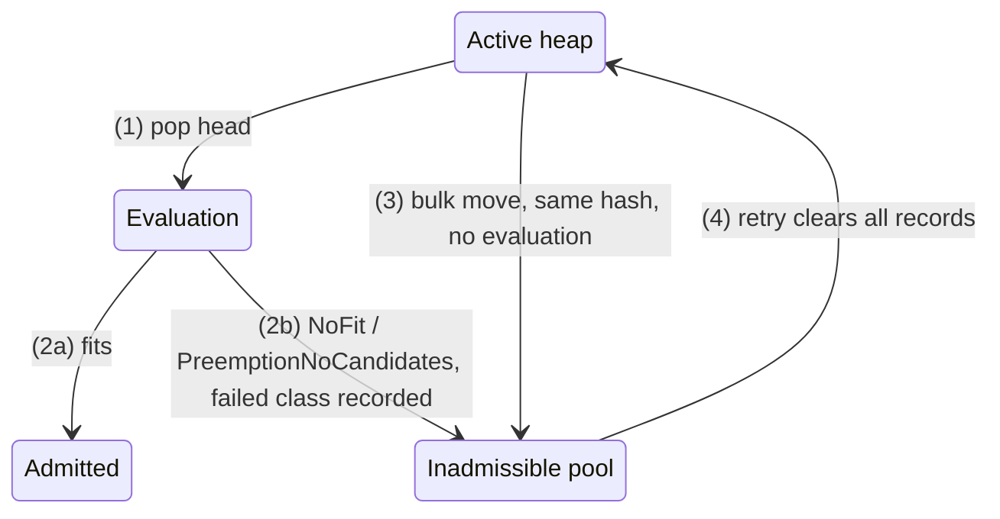

# KEP-9694: Scheduling Equivalence Hashing

<!-- toc -->
- [Summary](#summary)
- [Motivation](#motivation)
  - [Goals](#goals)
  - [Non-Goals](#non-goals)
- [Proposal](#proposal)
  - [Terminology](#terminology)
  - [User Stories](#user-stories)
    - [Deep mixed-resource queue](#deep-mixed-resource-queue)
  - [Overview](#overview)
  - [Notes, Constraints, and Caveats](#notes-constraints-and-caveats)
  - [Risks and Mitigations](#risks-and-mitigations)
    - [Incomplete scheduling shape](#incomplete-scheduling-shape)
      - [ElasticJobsViaWorkloadSlices](#elasticjobsviaworkloadslices)
      - [UsageBasedAdmissionFairSharing](#usagebasedadmissionfairsharing)
    - [Overly broad failure classification](#overly-broad-failure-classification)
    - [Stale failed-class records](#stale-failed-class-records)
    - [Identifier collision](#identifier-collision)
    - [Latency for very large Workloads](#latency-for-very-large-workloads)
    - [Reduced diagnostics for bypassed Workloads](#reduced-diagnostics-for-bypassed-workloads)
    - [Additional memory and queue work](#additional-memory-and-queue-work)
- [Design Details](#design-details)
  - [Equivalence Class Construction](#equivalence-class-construction)
  - [Recording and Bulk Movement](#recording-and-bulk-movement)
  - [Observability](#observability)
  - [Notable Changes by Version](#notable-changes-by-version)
  - [Test Plan](#test-plan)
    - [Unit Tests](#unit-tests)
    - [Integration Tests](#integration-tests)
    - [End-to-End Tests](#end-to-end-tests)
  - [Graduation Criteria](#graduation-criteria)
    - [Beta](#beta)
    - [Stable](#stable)
- [Implementation History](#implementation-history)
<!-- /toc -->

## Summary

A BestEffortFIFO ClusterQueue can contain 5,000 identical pending GPU Workloads
ahead of one small CPU Workload. Instead of re-evaluating all 5,000 each cycle,
the scheduler evaluates one representative, determines that it does not fit,
and sets the rest aside so it can reach the CPU Workload.

Scheduling Equivalence Hashing enables this optimization by hashing selected
scheduling-relevant Workload properties to form equivalence classes. After one
representative Workload is fully evaluated and cannot be admitted for an
allowlisted failure reason, the other Workloads in the same equivalence class
can be moved to the inadmissible pool without repeating the same expensive
evaluation.

The optimization allows the scheduler to reach Workloads deeper in the queue
when many earlier Workloads have identical requirements. It is most effective
at large queue depths when resource requirements and scheduling constraints
recur across many Workloads. Repeated Topology Aware Scheduling evaluations can
increase the savings because placement evaluation is more expensive.

## Motivation

A BestEffortFIFO ClusterQueue may contain many Workloads that request the same
resources and have the same placement constraints. If one of those Workloads
cannot fit, evaluating every equivalent Workload often produces the same result while
consuming scheduler cycles. Periodic or event-driven requeues can repeatedly
return the same large group to the active heap before the scheduler reaches a
different Workload that could use available capacity.

This behavior is particularly harmful in deep queues. A sequence of large GPU
Workloads can repeatedly fail while smaller CPU Workloads that would fit remain
farther down the queue. Repeated evaluations also require repeated scheduler
snapshot construction. For Topology Aware Scheduling, the snapshot and
placement work can be more expensive than the quota decision itself.

Pending Workloads commonly share a small number of distinct scheduling shapes.
A queue holding 10,000 Workloads may contain only a few dozen shapes. When one
fully evaluated Workload serves as the representative of its equivalence class,
the scheduler pays the evaluation cost once per shape instead of once per
Workload.

### Goals

- Avoid repeated full evaluations of Workloads that are equivalent for the
  relevant scheduling decision.
- Allow BestEffortFIFO queues to make progress past large groups of equivalent
  inadmissible Workloads.
- Preserve queue ordering, sticky preemption behavior, and the distinction
  between BestEffortFIFO and StrictFIFO.
- Account for effective resource requests and key placement constraints in the
  scheduling shape.
- Restrict grouped deferral to an explicit allowlist of failure reasons intended
  for class-wide handling.

### Non-Goals

- Introduce or change a user-facing API.
- Introduce a dedicated failure reason.
- Treat every form of inadmissibility as a reason to defer equivalent Workloads.
- Add per-Workload events as part of the current design.

## Proposal

### Terminology

- Equivalence class: A set of Workloads in the same ClusterQueue whose
  scheduling-relevant shapes produce the same deterministic identifier.
- Representative: A Workload that is evaluated normally and whose outcome may
  be used to defer equivalent Workloads.
- Failed-class record: Volatile, ClusterQueue-scoped state indicating that a
  representative of an equivalence class recently failed for an allowlisted
  reason. The record also carries a user-facing reason when one is available.
- Bulk move: The transition of matching Workloads from the active heap to the
  inadmissible pool after their representative fails.
- Bypassed Workload: A Workload placed in the inadmissible pool because its
  equivalence class has a failed-class record, without a full scheduling
  evaluation of that Workload.

### User Stories

#### Deep mixed-resource queue

As a cluster administrator, I want a BestEffortFIFO queue containing thousands
of identical unschedulable accelerator Workloads to avoid blocking smaller
Workloads that can use other available resources.

### Overview

1. Kueue groups pending Workloads that look identical to the scheduler based on
   selected inputs such as requests, constraints, and effective priority. Each
   group is an equivalence class with a deterministic identifier.
2. The scheduler fully evaluates one member of the class as its representative.
3. In BestEffortFIFO, if the representative receives NoFit or
   PreemptionNoCandidates, Kueue records the failed class and moves its remaining
   Workloads to the inadmissible pool without evaluating them.
4. When the inadmissible Workloads are retried, Kueue discards the failed-class
   record and returns the Workloads to active consideration. A newly evaluated
   representative can then establish the result for the current scheduling
   state.

### Notes, Constraints, and Caveats

Class-wide handling applies only when all of the following hold:

- The ClusterQueue uses BestEffortFIFO. StrictFIFO retains its normal
  head-of-line behavior because skipping its head based on another Workload's
  result could weaken strict ordering.
- The feature gate is enabled and the Workload has a known equivalence
  identifier. When the gate is disabled or identifier construction fails, the
  unknown class is evaluated individually and the optimization is a no-op.
- The Workload is not sticky through PendingPreemption or PendingMigration.
  Keeping these Workloads on the existing sticky path avoids bypassing a viable
  assignment, preemption plan, or migration plan.
- Matching Workloads belong to the same ClusterQueue. This prevents conclusions
  from being shared across different quota, flavor, cohort, and policy contexts.

### Risks and Mitigations

The safety invariant for this entire section is that equivalence handling never
grants quota or reuses an assignment. A defect can delay a Workload, reduce
diagnostics, or add overhead, but cannot admit a Workload incorrectly.

| Risk | Worst case | Mitigation | Status |
|---|---|---|---|
| [ElasticJobsViaWorkloadSlices shape gap](#elasticjobsviaworkloadslices) | A schedulable replacement is repeatedly deferred | Model replacement state or exclude replacements | **Open** |
| [UsageBasedAdmissionFairSharing timestamp gap](#usagebasedadmissionfairsharing) | A Workload that can preempt is repeatedly deferred | Include the timestamp or exclude the combination | **Open** |
| [Overly broad failure classification](#overly-broad-failure-classification) | Valid class members are deferred | Allowlist class-wide requeue reasons | Mitigated |
| [Stale failed-class records](#stale-failed-class-records) | A class remains deferred after conditions change | Clear failed records on retry or restart | Mitigated |
| [Identifier collision](#identifier-collision) | A colliding shape is repeatedly delayed or starved | Use a 64-bit SHA-256 prefix | Accepted |
| [Latency for very large Workloads](#latency-for-very-large-workloads) | Large Workloads wait for a batched retry | Periodic retry and feature-gate rollback | Accepted |
| [Reduced diagnostics for bypassed Workloads](#reduced-diagnostics-for-bypassed-workloads) | A bypassed Workload lacks a detailed diagnosis | Preserve the representative's reason | Mitigated |
| [Additional memory and queue work](#additional-memory-and-queue-work) | Pending state and heap scans add overhead | Bound records to classes between retries | Accepted |

Only the two scheduling-shape gaps are open. The subsections below provide the
trigger, user impact, mitigation, and residual risk for each row.

#### Incomplete scheduling shape

1. **Triggering scenario:** A scheduling input used by flavor assignment or
   placement is omitted from the scheduling shape, or an irrelevant input is
   included.
2. **User impact:** An omitted input can place Workloads with different outcomes
   in the same class, allowing a representative failure to defer a schedulable
   member. An irrelevant input has the less severe effect of splitting
   equivalent Workloads and reducing optimization opportunities.
3. **Mitigation:** Every new scheduling input must either be represented in the
   shape or cause the affected outcome to be excluded from class-wide handling.
4. **Residual risk:** The current shape includes Pod placement and effective
   requests, but does not model every input used by all scheduling paths. Two
   known cases remain.

##### ElasticJobsViaWorkloadSlices

1. **Triggering scenario:** A scale-up Workload replaces an admitted Workload
   Slice. The scheduler evaluates the additional quota relative to the replaced
   slice and requires the replacement to retain its ResourceFlavor assignments.
2. **User impact:** The shape includes the new Workload's effective requests,
   but not the replacement target or its state. Workloads with the same total
   request can therefore need different additional quota while sharing an
   identifier:

   | Workload | Total request | Replaced slice reserves | Additional quota needed | Fits? |
   |---|---|---|---|---|
   | W1 | 10 CPUs | 8 CPUs | 2 CPUs | yes |
   | W2 | 10 CPUs | 4 CPUs | 6 CPUs | no |

3. **Mitigation:** Before stable, either add the replacement target and relevant
   state to the scheduling shape or exclude replacement Workloads from
   class-wide handling.
4. **Residual risk:** Until then, a NoFit result from W2 can defer W1 without
   evaluating it even though W1 fits.

##### UsageBasedAdmissionFairSharing

1. **Triggering scenario:** UsageBasedAdmissionFairSharing is combined with
   LowerOrNewerEqualPriority. Queue selection orders Workloads by LocalQueue
   usage before timestamp, while the preemption policy permits an equal-priority
   victim only when it is newer than the pending Workload.
2. **User impact:** The scheduling shape includes effective priority but not the
   queue-order timestamp. A newer member of a class can be evaluated before an
   older member even though only the older member can preempt the victim:

   | Workload | Created | State | Role |
   |----------|---------|-------|------|
   | A | t0 | pending | can preempt V because V is newer than A |
   | V | t1 | admitted | preemption target |
   | B | t2 | pending, evaluated first because it belongs to a lower-usage LocalQueue | cannot preempt V because V is older than B |

3. **Mitigation:** Before stable, either include the queue-order timestamp in
   the scheduling shape or exclude this feature combination from class-wide
   handling.
4. **Residual risk:** Until then, B can record PreemptionNoCandidates and defer
   A despite A being able to preempt V.

#### Overly broad failure classification

1. **Triggering scenario:** A scheduling failure depends on namespace,
   admission-check state, transient preemption state, or one Workload's
   lifecycle rather than on the shared scheduling shape.
2. **User impact:** Applying that failure to the entire class can incorrectly
   defer otherwise valid Workloads.
3. **Mitigation:** Queue handling uses an explicit requeue reason. Only NoFit and
   PreemptionNoCandidates create failed-class records. NamespaceMismatch,
   PreemptionGated, Generic, FailedAfterNomination, and other reasons retain
   individual handling. This keeps gates used by ConcurrentAdmission and
   MultiKueueOrchestratedPreemption on their required per-Workload paths.
4. **Residual risk:** New scheduler outcomes must explicitly opt in to
   class-wide handling. Encoding gate state or a per-Workload identifier in the
   shape was considered during Beta graduation, but excluding unsafe outcomes
   by reason remains the chosen boundary.

#### Stale failed-class records

1. **Triggering scenario:** Quota, flavor, topology, node, admission-check, or
   Workload state changes after a failed-class record is created.
2. **User impact:** The previous class-wide failure conclusion can remain in
   effect after the scheduling conditions that produced it have changed.
3. **Mitigation:** Kueue discards failed-class records whenever the affected
   inadmissible pool is retried and also on process restart. Workload updates
   refresh cached information and recompute that Workload's class membership.
4. **Residual risk:** Correct recovery depends on relevant state changes
   triggering a retry of the affected pool. Stale cached Workload information
   can also affect scheduling when equivalence hashing is disabled and is not
   specific to this feature.

#### Identifier collision

1. **Triggering scenario:** Two distinct scheduling shapes produce the same
   64-bit identifier, which is the first 16 hexadecimal characters of a SHA-256
   digest.
2. **User impact:** One shape's representative failure can repeatedly delay or
   starve the other shape.
3. **Mitigation:** Assuming digest prefixes are uniformly distributed, the
   birthday-bound probability among `n` distinct shapes in one ClusterQueue is
   approximately `n(n-1)/(2 * 2^64)`. It is about 6.8e-11, or 1 in 15 billion,
   at 50,000 shapes and about 2.7e-8, or 1 in 37 million, at 1 million shapes.
4. **Residual risk:** These estimates cover accidental collisions, not a
   deliberate search. Retry invalidation clears the failed-class record but
   does not separate colliding shapes, so the same incorrect deferral can recur.

#### Latency for very large Workloads

1. **Triggering scenario:** Many equivalent Workloads each consume nearly all
   ClusterQueue capacity and are bulk-moved to the inadmissible pool.
2. **User impact:** Individual admission latency can increase while those
   Workloads wait for a batched retry, even when total queue throughput improves.
3. **Mitigation:** The periodic inadmissible retry bounds the delay. Operators
   can disable the feature gate to restore per-Workload evaluation when this
   tradeoff is unacceptable for their workload mix.
4. **Residual risk:** The balance between aggregate throughput and individual
   latency is workload-shape dependent. Performance runs shared during v0.18
   graduation illustrated the tradeoff:

**Baseline (15,000 Workloads)**

| Metric | Hash off | Hash on | Delta |
| --- | ---: | ---: | ---: |
| `wallMs` | 368,568 | 354,086 | -3.9% |
| `large` | 11,918 | 15,615 | +31% |
| `medium` | 83,107 | 67,461 | -19% |
| `small` | 233,131 | 217,133 | -6.9% |

**Large-scale (50,000 Workloads)**

| Metric | Hash off | Hash on | Delta |
| --- | ---: | ---: | ---: |
| `wallMs` | 1,148,840 | 1,137,344 | -1.0% |
| `large` | 75,245 | 78,353 | +4.1% |
| `medium` | 233,600 | 231,851 | -0.7% |
| `small` | 684,797 | 676,737 | -1.2% |

Source: Performance tables created by
[@sohankunkerkar](https://github.com/sohankunkerkar) and shared in the
[v0.18 graduation discussion][performance-results].

Enabling the feature reduced total wall-clock time by 3.9% in the
15,000-Workload run and by 1.0% in the 50,000-Workload run, while admission
latency for the largest Workloads increased by 31% and 4.1%, respectively.
Those Workloads consumed nearly all ClusterQueue capacity and waited for the
one-second batched retry. These results are workload-shape dependent rather
than performance guarantees.

[performance-results]: https://github.com/kubernetes-sigs/kueue/pull/11097#discussion_r3226876641

#### Reduced diagnostics for bypassed Workloads

1. **Triggering scenario:** A Workload is bypassed because another member of its
   equivalence class established a failed-class record.
2. **User impact:** The bypassed Workload does not run a scheduling attempt and
   cannot produce the same detailed resource or placement diagnosis as an
   individually evaluated Workload.
3. **Mitigation:** The failed-class record retains the representative's
   high-level reason. The controller applies it only when the bypassed Workload
   has no more specific active diagnosis, preserving existing detailed messages.
4. **Residual risk:** The propagated reason remains less specific than a full
   evaluation. The `kueue_pending_scheduling_hashes` metric reports aggregate
   class counts and cannot provide a per-Workload diagnosis.

#### Additional memory and queue work

1. **Triggering scenario:** Pending Workloads retain equivalence identifiers,
   failed classes retain records, and bulk movement scans the active heap for
   matching members.
2. **User impact:** The scheduler uses additional memory and queue work, while
   the queue manager must synchronize another form of shared state with
   membership, Workload updates, retry notifications, and observability.
3. **Mitigation:** Failed-class state is bounded by the number of distinct
   classes observed between retries and is discarded with the retry cycle. A
   queue scan replaces multiple substantially more expensive evaluations.
4. **Residual risk:** One identifier remains stored per pending Workload, and
   scan cost grows with the number of active-heap entries.

## Design Details

### Equivalence Class Construction

For a class-wide conclusion to be sound, the scheduling shape must include every
Workload property used by the relevant flavor-assignment and placement decision,
while excluding metadata that does not affect the decision. Including irrelevant
identity fields would split otherwise equivalent Workloads and reduce the
benefit without improving correctness. The known gaps in the current shape are
listed under Risks and Mitigations.

The scheduling shape includes the effective Workload priority and an ordered
description of every PodSet. Each PodSet description includes:

- effective `count`
- `name` only when `SchedulingEquivalenceHashingIgnorePodSetName` is disabled
- `minCount`
- effective `requests` after Kueue-side processing
- scheduling-relevant fields from `template.spec`, including
  `initContainers[].resources.requests`, `initContainers[].ports`,
  `containers[].resources.requests`, `containers[].ports`, `resources.requests`,
  `nodeSelector`, `affinity`, `tolerations`, `runtimeClassName`, `priority`,
  `topologySpreadConstraints`, `overhead`, and `resourceClaims`
- `Workload.spec.podSets[].topologyRequest`, read directly from the Workload
  spec rather than Job annotations or Workload status

The scheduling-relevant fields in `template.spec` come from the shared Pod spec
shape. The Pod group integration uses the same shape when calculating the
`kueue.x-k8s.io/role-hash` annotation. Integrations that implicitly enable the
Pod integration, such as StatefulSet and LeaderWorkerSet, also use it when
validating `PodTemplateSpec` identity.

PodSet name was included conservatively even though the flavor-assignment path
does not use it. That split otherwise equivalent Workloads into different
classes and reduced optimization opportunities without improving correctness,
which is most visible for clients that set a distinct
`kueue.x-k8s.io/role-hash` per Workload. The
`SchedulingEquivalenceHashingIgnorePodSetName` gate excludes the name from the
shape.

PodSet descriptions retain their order, so Workloads with different ordered
descriptions stay in different classes. PodSets that differ only by name
serialize identically once the name is excluded, so their order stops mattering.
The Pod group integration sorts PodSets by name, so a multi-PodSet group whose
descriptions differ can order them differently per Workload and stay split.

Effective resource requests are included separately from the original Pod
shape. They can differ after reclaimable Pod accounting, resource
transformations, Dynamic Resource Allocation preprocessing, defaulting, or
other Kueue-side calculations. The class must reflect the values actually used
for admission decisions.

When Concurrent Admission is enabled, allowed ResourceFlavor restrictions are
also included in the scheduling shape. Workloads restricted to different flavor
sets therefore receive different equivalence identifiers.

1. Kueue serializes the scheduling shape as JSON. The encoder sorts map keys,
   while PodSets and other slices retain their order.
2. Kueue computes SHA-256 over the JSON.
3. Kueue takes the first 16 hexadecimal characters, or 64 bits, as the
   identifier.
4. If serialization fails, the Workload falls back to the unknown class.
   Workloads in the unknown class are always evaluated individually and are
   never bulk-moved.

Kueue computes the identifier when it creates cached scheduling information for
a Workload and recomputes it whenever a relevant Workload update refreshes that
information.

Before a ClusterQueue retries its inadmissible Workloads, Kueue clears that
ClusterQueue's failed-class records.

### Recording and Bulk Movement

Equivalence hashing adds a ClusterQueue-scoped in-memory record containing the
failed class identifier and high-level reason. The record controls these queue
transitions:

The record is created when the representative is requeued, rather than waiting
for each equivalent Workload to be popped. Matching Workloads added or updated
while the record exists are placed in the inadmissible pool directly. Because
the scheduler normally nominates one head Workload per ClusterQueue in a cycle,
the record remains useful across cycles and avoids later heap pops and
scheduling snapshot construction for the rest of the class.

### Observability

The representative can receive the full diagnostic result of its scheduling
attempt. Bypassed Workloads do not run that attempt and initially had no way to
explain why they entered the inadmissible pool.

The controller applies the bypass reason only when the Workload has no more
specific active scheduler diagnosis. A previously evaluated Workload with a
detailed resource or placement message retains that message.

When SchedulingEquivalenceHashing is enabled, Kueue exposes the
`kueue_pending_scheduling_hashes` gauge. It reports the number of unique pending
equivalence identifiers for each `cluster_queue` and `status` (`active` or
`inadmissible`), with `replica_role` as an additional label. The series is not
reported when the feature gate is disabled.

Operators should use the pending equivalence-class count, rather than the
pending Workload count, when estimating whether the scheduler can reach the end
of a queue before the next inadmissible retry. One representative failure can
move an entire class without evaluating its remaining Workloads.

### Notable Changes by Version

| Version | Change | Kind |
|---|---|---|
| v0.15.6, v0.16.3 | Introduced: in BestEffortFIFO ClusterQueues, a NoFit result recorded the failed equivalence class and bulk-moved matching Workloads to the inadmissible pool | behavior |
| v0.15.7, v0.16.4, v0.17.0 | PreemptionNoCandidates began participating in class-wide handling; failed-class recording was driven by the broader non-immediate requeue signal | behavior |
| v0.17.0 | Priority input in the scheduling shape changed from raw Workload priority to effective priority | behavior |
| v0.18.0 | Failed-class recording changed to an explicit allowlist containing NoFit and PreemptionNoCandidates | behavior |
| v0.18.0 | Allowed Resource Flavor restrictions and effective resource requests added to the scheduling shape | behavior |
| v0.18.0 | Beta feature gate became enabled by default | gate |
| v0.19.0 | Failed-class records began retaining the representative's high-level reason for bypassed Workloads | observability |
| v0.19.0 | Equivalence identifier corrected to include Pod-level resource requests when the field is set | bugfix |
| v0.20.0 | Added the `kueue_pending_scheduling_hashes` gauge, reporting unique active and inadmissible classes per ClusterQueue | observability |
| v0.20.0 | PodSet name excluded from the scheduling shape, behind the Beta `SchedulingEquivalenceHashingIgnorePodSetName` gate, enabled by default | gate |

### Test Plan

[x] The owners of the involved components understand that existing tests may
need updates as scheduling inputs and feature interactions evolve.

This retrospective KEP adds no product code. Existing tests cover the core hash,
queue transitions, failure-reason allowlist, retry invalidation, deep-queue
progress, and bypass observability. The known input combinations described in
Risks and Mitigations are not fully automated today. Future changes must
preserve and extend the following coverage.

The PreemptionNoCandidates integration scenario validates the scheduling end
state. Unit coverage of the requeue reasons validates whether the equivalence
optimization is triggered.

#### Unit Tests

Unit coverage must exercise these scenarios:

- Workloads that should share a scheduling outcome form one class, while a
  scheduling-relevant difference keeps them separate.
- An eligible representative failure defers equivalent Workloads only in
  BestEffortFIFO, while other failures and StrictFIFO retain normal
  per-Workload behavior.
- Workload updates and retry-triggering cluster changes refresh class
  membership and invalidate prior failed-class conclusions.
- Known unmodeled inputs are covered when resolved, whether the resolution adds
  them to the shape or excludes their outcomes from class-wide handling.
- A bypass reason can be propagated without replacing a more specific existing
  diagnosis.

#### Integration Tests

Integration coverage must exercise a deep BestEffortFIFO queue in which a large
group of equivalent, unschedulable Workloads precedes a schedulable Workload.
It must also verify that relevant cluster-state changes retry the deferred group
and that namespace, preemption, and observability boundaries retain their
existing behavior. Before stable, it must exercise the resolved behavior for
Workload-slice replacement and LowerOrNewerEqualPriority under usage-based
admission fair sharing.

#### End-to-End Tests

Dedicated end-to-end coverage is not required because the feature has no API or
external component boundary. Unit and integration tests exercise the internal
class construction, queue transitions, retry events, and selected feature
interactions directly.

### Graduation Criteria

#### Beta

Beta requires:

- explicit restriction to NoFit and PreemptionNoCandidates
- safe fallback for unknown identifiers
- BestEffortFIFO-only bulk movement
- retry-time invalidation of all failed-class records
- effective request and flavor-restriction coverage in the class
- unit and integration coverage for the main success and exclusion paths
- a supported feature-gate rollback.

#### Stable

Graduation to stable requires:

- reevaluation of class-wide outcomes for ElasticJobsViaWorkloadSlices and a
  decision to either include the replacement target and relevant state in the
  scheduling shape or exclude affected Workloads from class-wide handling
- reevaluation of PreemptionNoCandidates class-wide handling when
  UsageBasedAdmissionFairSharing is combined with LowerOrNewerEqualPriority,
  and a decision to either include the queue-order timestamp in the scheduling
  shape or exclude this combination from class-wide handling
- validated retry triggers for quota, cohort, flavor, topology, admission
  checks, and relevant Pod-capacity changes
- an explicit decision on whether the current digest size is sufficient for
  expected scale
- sufficient observability to distinguish individual evaluation from an
  equivalence bypass.

## Implementation History

- 2026-03-06: Initial implementation was merged for development toward v0.17.0.
  - [#9698: Initial implementation](https://github.com/kubernetes-sigs/kueue/pull/9698)
- 2026-03-09: The initial behavior was backported to the v0.15 and v0.16 patch
  releases.
  - [#9769: v0.16 backport](https://github.com/kubernetes-sigs/kueue/pull/9769)
  - [#9771: v0.15 backport](https://github.com/kubernetes-sigs/kueue/pull/9771)
- 2026-03-17 through 2026-03-19: Scheduler integration and queue handling were
  hardened.
  - [#9120: Effective priority](https://github.com/kubernetes-sigs/kueue/pull/9120)
  - [#10001: Queue integration fix](https://github.com/kubernetes-sigs/kueue/pull/10001)
- 2026-05-04 through 2026-05-22: Beta hardening, graduation, and follow-up
  coverage were completed.
  - [#10910: Concurrent Admission](https://github.com/kubernetes-sigs/kueue/pull/10910)
  - [#11097: Beta graduation](https://github.com/kubernetes-sigs/kueue/pull/11097)
  - [#11399: Effective requests](https://github.com/kubernetes-sigs/kueue/pull/11399)
- 2026-07-02 through 2026-07-08: Correctness, diagnostics, and internal
  improvement.
  - [#12334: Pod-level resources](https://github.com/kubernetes-sigs/kueue/pull/12334)
  - [#12821: Bypass observability](https://github.com/kubernetes-sigs/kueue/pull/12821)
  - [#12871: Strongly typed identifiers](https://github.com/kubernetes-sigs/kueue/pull/12871)
- 2026-08-07: Metrics and the KEP were added.
  - [#12520: Pending scheduling hashes metric](https://github.com/kubernetes-sigs/kueue/pull/12520)
  - [#13973: KEP](https://github.com/kubernetes-sigs/kueue/pull/13973)
- 2026-08-24: PodSet name was excluded from the scheduling shape behind a new
  feature gate, so Workloads that differ only by PodSet name share a class.
  - [#14780: Scenario tests for the prior behaviour](https://github.com/kubernetes-sigs/kueue/pull/14780)
  - [#14784: SchedulingEquivalenceHashingIgnorePodSetName](https://github.com/kubernetes-sigs/kueue/pull/14784)
