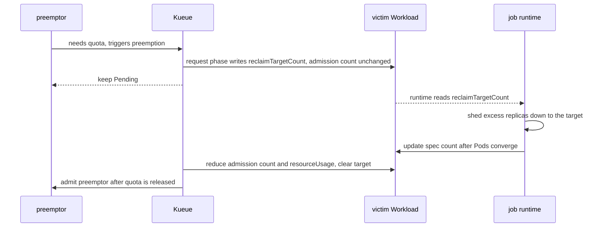

# KEP-975: Partial Preemption of Elastic Workloads

<!-- toc -->
- [Summary](#summary)
- [Motivation](#motivation)
  - [Goals](#goals)
  - [Non-Goals](#non-goals)
- [Proposal](#proposal)
  - [User Stories](#user-stories)
    - [Story 1: Spark on Kubernetes elastic executors](#story-1-spark-on-kubernetes-elastic-executors)
    - [Story 2: Ray with split baseline/opportunistic worker groups](#story-2-ray-with-split-baselineopportunistic-worker-groups)
  - [Notes/Constraints/Caveats](#notesconstraintscaveats)
  - [Risks and Mitigations](#risks-and-mitigations)
- [Design Details](#design-details)
  - [Two-phase model: request != release](#two-phase-model-request--release)
  - [Workload API](#workload-api)
  - [Opt-in annotation](#opt-in-annotation)
  - [Reusing minCount](#reusing-mincount)
  - [Scheduler / Preemption](#scheduler--preemption)
    - [Eligibility](#eligibility)
    - [Candidate ordering](#candidate-ordering)
    - [Target selection](#target-selection)
    - [Issuing preemptions](#issuing-preemptions)
    - [No-fit behavior](#no-fit-behavior)
  - [Webhook](#webhook)
  - [Job runtime contract](#job-runtime-contract)
  - [Test Plan](#test-plan)
    - [Unit tests](#unit-tests)
    - [Integration tests](#integration-tests)
    - [e2e tests](#e2e-tests)
  - [Graduation Criteria](#graduation-criteria)
- [Implementation History](#implementation-history)
- [Drawbacks](#drawbacks)
- [Alternatives](#alternatives)
  - [Kueue mutates the job's replica count directly](#kueue-mutates-the-jobs-replica-count-directly)
<!-- /toc -->

## Summary

Today Kueue preempts a Workload as a whole: the victim is evicted, `stopJob` suspends it, and all
of its Pods are torn down. For elastic workloads that can run at a reduced size (for example a Spark
application whose executor count can shrink), whole eviction is unnecessarily disruptive.

**Partial Preemption** lets Kueue reclaim quota from an elastic, opted-in Workload by asking it to
scale one PodSet down to a selected target count at or above `minCount`, instead of evicting it.
The scheduler selects the largest target count that lets the preemptor fit, so it reclaims only the
replicas needed whenever possible. The victim keeps running at a smaller size and is never
suspended. The feature is alpha and gated by the `PartialPreemption` feature gate; when the gate is
off, behavior is identical to today.

## Motivation

Elastic batch/data workloads (Spark, Ray, and similar) can often continue making progress
with fewer replicas. When a higher-priority Workload needs quota, Kueue's only tool is to evict a
victim entirely. For a long-running elastic job this means killing the driver and every worker,
losing in-flight progress, and paying a full restart — even though releasing a few replicas would
have been enough.

Kueue cannot shrink a running job on its own: only the job's controller/driver owns its Pods.
Partial preemption therefore needs a way for Kueue to **signal** a desired reduced size and for the
job runtime to **act** on it, while the quota accounting stays correct throughout.

### Goals

- Provide an opt-in mechanism where preemption of an elastic Workload reclaims quota by scaling one
  of its PodSets down towards `minCount`, rather than evicting the whole Workload.
- Guarantee no quota over-subscription at any point during the scale-down.
- Keep the mechanism framework-agnostic in Kueue: Kueue only expresses intent; any controller/driver
  that honors the signal can benefit.
- Be fully gated so that, with the gate disabled, there is zero behavioral change.

### Non-Goals

- Kueue does not itself terminate Pods or mutate the parent job's spec; the job runtime is
  responsible for shedding replicas (see [Alternatives](#alternatives) for why).
- Kueue does not guarantee the job respects the requested reduced size; a cooperating runtime is
  assumed (opt-in).
- Autoscaling / scaling back up after preemption is out of scope; this KEP only covers scale-down
  for quota reclamation.

## Proposal

Introduce a per-PodSet target, `status.admission.podSetAssignments[].reclaimTargetCount`, that Kueue
writes on an admitted elastic Workload to request that the PodSet scale down to that count. The job
runtime observes `reclaimTargetCount`, sheds the excess replicas, and updates the Workload spec
count after the scale-down converges. The Workload controller then reduces the admission count and
resource usage and clears `reclaimTargetCount`, releasing quota for the preemptor.

The preemption decision path (both the classical and the Fair Sharing algorithms) is extended so
that an eligible elastic victim is simulated at the selected reduced count in the scheduling
snapshot instead of being removed, and such victims are preferred over whole eviction of
equal-priority peers.

### User Stories

#### Story 1: Spark on Kubernetes elastic executors

A Spark application runs with 20 executors (`minExecutors=2`) in a low-priority ClusterQueue that is
borrowing quota. A high-priority job arrives and needs quota equivalent to 10 executors. Instead of
suspending the whole Spark application or reducing it all the way to 2 executors, Kueue writes
`reclaimTargetCount=10` on the executor PodSet. The Spark driver gracefully decommissions executors
down to 10 and updates the Workload spec count. The Workload controller then updates admission
accounting, releases the quota, and the high-priority job is admitted. The Spark application keeps
running the entire time.

#### Story 2: Ray with split baseline/opportunistic worker groups

A RayCluster runs with two worker groups in a low-priority ClusterQueue with nominal quota and a
borrowing limit. One worker group is baseline capacity, sized to run only using the queue's nominal
quota, while the other is a `0..N` scalable group for opportunistic extra capacity. A high-priority
job arrives and needs part of the borrowed quota. Instead of suspending the entire RayCluster,
killing the head and all workers, Kueue writes `reclaimTargetCount=0` on the opportunistic worker
group's PodSet. The Ray driver scales in that worker group and updates the Workload spec count. The
Workload controller then releases the quota, and the high-priority job is admitted. The RayCluster,
including its head and baseline worker group, continues running the entire time.

### Notes/Constraints/Caveats

- The victim must opt in (annotation), have exactly one PodSet with `minCount` set, and currently be
  using more than `minCount`. Otherwise it is treated as a normal (whole-eviction) preemption target.
- `reclaimTargetCount` is owned by Kueue and is not a user-set field. An in-flight target is kept
  unchanged until the runtime converges and the Workload controller clears it.
- Partial preemption interoperates with elastic-job scale-down. Admission `count` and
  `resourceUsage` only decrease after the runtime updates the Workload spec and the Workload
  controller completes the accounting update.

### Risks and Mitigations

- **Over-subscription window.** Naively releasing quota when the request is written would let the
  preemptor and the not-yet-shrunk victim overlap. Mitigated by the [two-phase
  model](#two-phase-model-request--release): the request is decoupled from the release; admission
  accounting only drops after the runtime and Workload controller converge.
- **Uncooperative runtime.** A runtime that ignores `reclaimTargetCount` never releases quota, so
  the preemptor stays `Pending`. This is opt-in; only workloads whose runtime honors the field
  should set the annotation. A future enhancement could fall back to whole eviction after a timeout.
- **Feature isolation.** All behavior is behind the `PartialPreemption` gate; when off, the 
  preemption path is the existing one.

## Design Details

### Two-phase model: request != release

The signal and the quota release are intentionally decoupled to avoid any over-subscription window:

- **request:** Kueue writes the selected `reclaimTargetCount` on the victim's admission. It does
  **not** change the accounted `count` or `resourceUsage` and does **not** release quota.
- **release:** The runtime reads `reclaimTargetCount`, sheds replicas, and updates the Workload spec
  count after the Pods converge. The Workload controller then updates the admission count and
  resource usage and clears the target, thereby releasing quota.



### Workload API

Add an optional, Kueue-owned field to `PodSetAssignment`:

```go
type PodSetAssignment struct {
    // ...

    // reclaimTargetCount, when set and lower than count, requests the elastic job to scale this
    // PodSet down to reclaimTargetCount so partial preemption can reclaim its quota. Kueue owns
    // this field; the job runtime reads it and sheds pods down to reclaimTargetCount. Kueue clears
    // this field once the PodSet's desired spec count has converged to reclaimTargetCount or below.
    // This is an alpha field and requires enabling the PartialPreemption feature gate.
    //
    // +optional
    // +kubebuilder:validation:Minimum=0
    ReclaimTargetCount *int32 `json:"reclaimTargetCount,omitempty"`
}
```

### Opt-in annotation

A Workload opts in via an annotation, e.g. `kueue.x-k8s.io/partial-preemption: "true"`. The job's
integration layer sets it on the Job; the jobframework reconciler propagates it onto the Workload so
that the scheduler only ever needs to look at the Workload.

### Reusing minCount

Partial preemption reuses the existing `PodSet.MinCount` (see
[KEP-420](/keps/420-partial-admission)) as the scale-down floor. The current partial-preemption
algorithm requires exactly one PodSet with `minCount`; if there are zero or multiple such PodSets,
the Workload falls back to normal whole-eviction handling.

### Scheduler / Preemption

#### Eligibility

A candidate is eligible for partial preemption when: the `PartialPreemption` gate is enabled, the
Workload carries the opt-in annotation with value `"true"`, exactly one PodSet has `minCount` set,
and its effective used count is above `minCount`. The used count comes from
`workload.Info.TotalRequests`; an existing lower `reclaimTargetCount` is used as the effective count
for simulation.

#### Candidate ordering

Within the existing preemption candidate ordering, in-flight partial targets are considered early.
After priority, an eligible partial-preemptible candidate is preferred over a whole-eviction-only
candidate, and among partial-preemptible peers the candidate with higher effective used count is
preferred. Priority still dominates, and with the gate off these criteria are no-ops.

#### Target selection

For an eligible candidate, the scheduler searches between the current effective used count and the
allowed floor and selects the largest target count that makes the preemptor fit. If the candidate
alone is insufficient, it is reduced to the current floor and later candidates can contribute.
Reductions can accumulate across multiple victims and repeated candidate rounds.

The optional max-reclaimed-count annotation limits each reduction step, not the final accumulated
reduction. An existing in-flight target is simulated and preserved until it clears. If partial
reductions are still insufficient, a candidate that has reached `minCount` can later be handled as
a normal whole-eviction candidate.

#### Issuing preemptions

For a partial target, Kueue does **not** evict or `stopJob`. It patches the victim's admission
status to set `reclaimTargetCount` and emits a `PartiallyPreempted` event. Quota is not released
here (that is the release phase of the two-phase model).

#### No-fit behavior

Partial targets are issued only when the resulting target set makes the preemptor fit. If the
preemptor still does not fit, tentative partial and whole-eviction targets are discarded, no
preemption is issued, and the preemptor remains `Pending` for a later scheduling cycle.

### Webhook

`reclaimTargetCount` lives under `status.admission`, which is otherwise immutable after admission.
When the `PartialPreemption` gate is enabled, the Workload validating webhook allows
`reclaimTargetCount` to change on an already-admitted Workload. When a target has completed, it also
allows the Workload controller to clear the target and reduce admission `count` and `resourceUsage`
to the converged spec count.

### Job runtime contract

Kueue only expresses intent; a cooperating runtime does the work. The contract for an integration:

1. Set the opt-in annotation on the Job when the workload can tolerate partial preemption.
2. Populate `minCount` for the elastic PodSet (the scale-down floor).
3. Watch the Workload's `reclaimTargetCount` and cap the PodSet's desired size at
   `min(desired, admittedCount, reclaimTargetCount)`.
4. After the actual Pods converge to the target or below, lower the Workload spec count. The
   Workload controller then updates admission accounting and clears the target.

### Test Plan

[X] I/we understand the owners of the involved components may require updates to existing tests to
make this code solid enough prior to committing the changes necessary to implement this enhancement.

#### Unit tests

This change should be covered by unit tests.

#### Integration tests


### Graduation Criteria

## Implementation History

- 2026-08-18: KEP created; downstream proof-of-concept implemented and validated end-to-end with
  Spark on Kubernetes (feature gate `PartialPreemption`, `reclaimTargetCount` field, preemption
  path, webhook, and jobframework annotation propagation).

## Drawbacks

- Adds a new admission-status field and a new decision branch to both preemption algorithms,
  increasing the surface area of the preemption code.
- Requires cooperation from the job runtime; the benefit is zero for frameworks that do not honor
  `reclaimTargetCount`.

## Alternatives

### Kueue mutates the job's replica count directly

Kueue's jobframework could patch the job's `spec` replica count (e.g. `spec.count`) directly. This
needs no third-party code changes, but it violates the ownership convention — Kueue should not mutate
a job's spec — and is fragile across frameworks. We reject it as the default; it could be offered as
an explicit fallback for frameworks that cannot be modified.
