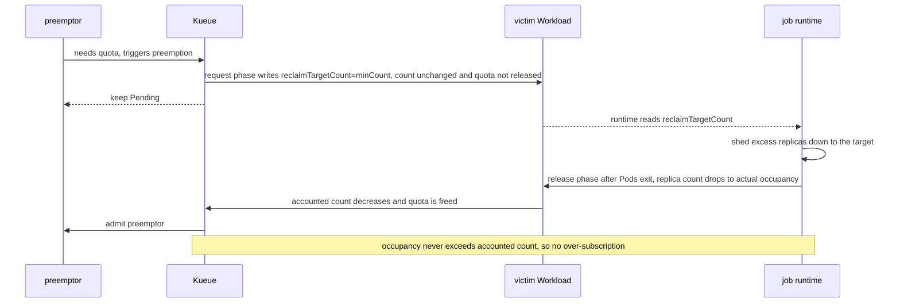

# KEP-975: Partial Preemption of Elastic Workloads

<!-- toc -->
- [Summary](#summary)
- [Motivation](#motivation)
  - [Goals](#goals)
  - [Non-Goals](#non-goals)
- [Proposal](#proposal)
  - [User Stories](#user-stories)
    - [Story 1: Spark on Kubernetes elastic executors](#story-1-spark-on-kubernetes-elastic-executors)
  - [Notes/Constraints/Caveats](#notesconstraintscaveats)
  - [Risks and Mitigations](#risks-and-mitigations)
- [Design Details](#design-details)
  - [Two-phase model: request != release](#two-phase-model-request--release)
  - [Workload API](#workload-api)
  - [Opt-in annotation](#opt-in-annotation)
  - [Reusing minCount](#reusing-mincount)
  - [Scheduler / Preemption](#scheduler--preemption)
    - [Eligibility](#eligibility)
    - [Candidate ordering](#candidate-ordering)
    - [Target selection](#target-selection)
    - [Issuing preemptions](#issuing-preemptions)
    - [No-fit progress across scheduling cycles](#no-fit-progress-across-scheduling-cycles)
  - [Webhook](#webhook)
  - [Job runtime contract](#job-runtime-contract)
  - [Test Plan](#test-plan)
    - [Unit tests](#unit-tests)
    - [Integration tests](#integration-tests)
    - [e2e tests](#e2e-tests)
  - [Graduation Criteria](#graduation-criteria)
- [Implementation History](#implementation-history)
- [Drawbacks](#drawbacks)
- [Alternatives](#alternatives)
  - [Kueue mutates the job's replica count directly](#kueue-mutates-the-jobs-replica-count-directly)
  - [Incremental reclamation instead of scaling to minCount](#incremental-reclamation-instead-of-scaling-to-mincount)
<!-- /toc -->

## Summary

Today Kueue preempts a Workload as a whole: the victim is evicted, `stopJob` suspends it, and all
of its Pods are torn down. For elastic workloads that can run at a reduced size (for example a Spark
application whose executor count can shrink), whole eviction is unnecessarily disruptive.

**Partial Preemption** lets Kueue reclaim quota from an elastic, opted-in Workload by asking it to
scale one PodSet **down to its `minCount`** — freeing just enough quota for the preemptor — instead
of evicting it. The victim keeps running at a smaller size and is never suspended. The feature is
alpha and gated by the `PartialPreemption` feature gate; when the gate is off, behavior is identical
to today.

## Motivation

Elastic batch/data workloads (Spark, Ray, and similar) can often continue making progress
with fewer replicas. When a higher-priority Workload needs quota, Kueue's only tool is to evict a
victim entirely. For a long-running elastic job this means killing the driver and every worker,
losing in-flight progress, and paying a full restart — even though releasing a few replicas would
have been enough.

Kueue cannot shrink a running job on its own: only the job's controller/driver owns its Pods.
Partial preemption therefore needs a way for Kueue to **signal** a desired reduced size and for the
job runtime to **act** on it, while the quota accounting stays correct throughout.

### Goals

- Provide an opt-in mechanism where preemption of an elastic Workload reclaims quota by scaling one
  of its PodSets down to `minCount`, rather than evicting the whole Workload.
- Guarantee no quota over-subscription at any point during the scale-down.
- Keep the mechanism framework-agnostic in Kueue: Kueue only expresses intent; any controller/driver
  that honors the signal can benefit.
- Be fully gated so that, with the gate disabled, there is zero behavioral change.

### Non-Goals

- Kueue does not itself terminate Pods or mutate the parent job's spec; the job runtime is
  responsible for shedding replicas (see [Alternatives](#alternatives) for why).
- Kueue does not guarantee the job respects the requested reduced size; a cooperating runtime is
  assumed (opt-in).
- Autoscaling / scaling back up after preemption is out of scope; this KEP only covers scale-down
  for quota reclamation.

## Proposal

Introduce a per-PodSet target, `status.admission.podSetAssignments[].reclaimTargetCount`, that Kueue
writes on an admitted elastic Workload to request that the PodSet scale down to that count
(= `minCount`). The job runtime observes `reclaimTargetCount`, sheds the excess replicas, and as
those Pods actually terminate the accounted `count` decreases and quota is released — at which point
the preemptor is admitted.

The preemption decision path (both the classical and the Fair Sharing algorithms) is extended so
that an eligible elastic victim is simulated as *reduced to `minCount`* in the scheduling snapshot
instead of *removed*, and such victims are preferred over whole eviction of equal-priority peers.

### User Stories

#### Story 1: Spark on Kubernetes elastic executors

A Spark application runs with 20 executors (`minExecutors=2`) in a low-priority ClusterQueue that is
borrowing quota. A high-priority job arrives and needs part of that quota. Instead of suspending the
whole Spark application (killing the driver and all executors and losing progress), Kueue writes
`reclaimTargetCount=2` on the executor PodSet. The Spark driver gracefully decommissions executors
down to 2, quota is released as those executor Pods exit, and the high-priority job is admitted. The
Spark application keeps running the entire time.

### Notes/Constraints/Caveats

- The victim must opt in (annotation) and have a PodSet with `minCount` set, and must currently be
  using more than `minCount`. Otherwise it is treated as a normal (whole-eviction) preemption target.
- `reclaimTargetCount` is owned and re-derived by Kueue on every scheduling decision; it is not a
  user-set field and never holds a stale value across re-admission.
- Partial preemption interoperates with elastic-job scale-down (the accounted `count` only decreases
  as Pods actually terminate), which is what keeps accounting correct — see below.
- **Reclaim granularity (open question).** This proposal scales the reclaimable PodSet all the way
  down to `minCount` in a single request, even when reclaiming fewer replicas would already free
  enough quota for the preemptor. A progressive/incremental variant — reclaiming only as many
  replicas as needed, with `minCount` as the floor — could reduce disruption but complicates the
  accumulate-and-fit search and the convergence argument. This is left as an open question for the
  alpha review.

### Risks and Mitigations

- **Over-subscription window.** Naively releasing quota when the request is written would let the
  preemptor and the not-yet-shrunk victim overlap. Mitigated by the [two-phase
  model](#two-phase-model-request--release): the request is decoupled from the release; accounted
  `count` only drops as Pods exit.
- **Uncooperative runtime.** A runtime that ignores `reclaimTargetCount` never releases quota, so
  the preemptor stays `Pending`. This is opt-in; only workloads whose runtime honors the field
  should set the annotation. A future enhancement could fall back to whole eviction after a timeout.
- **Feature isolation.** All behavior is behind the `PartialPreemption` gate; when off, the 
  preemption path is the existing one.

## Design Details

### Two-phase model: request != release

The signal and the quota release are intentionally decoupled to avoid any over-subscription window:

- **request:** Kueue writes `reclaimTargetCount` (= `minCount`) on the victim's admission. It does
  **not** change the accounted `count` and does **not** release quota at this moment.
- **release:** The runtime reads `reclaimTargetCount`, releases the pod, and then resets specCount,
  thereby release quota.



### Workload API

Add an optional, Kueue-owned field to `PodSetAssignment`:

```go
type PodSetAssignment struct {
    // ...

    // reclaimTargetCount, when set and lower than count, requests the elastic job to scale this
    // PodSet down to reclaimTargetCount so partial preemption can reclaim its quota. Kueue owns
    // this field; the job runtime reads it and sheds pods down to reclaimTargetCount. It is
    // re-derived on every scheduling decision (equal to count when no partial preemption is
    // requested), so it never holds a stale value.
    // This is an alpha field and requires enabling the PartialPreemption feature gate.
    //
    // +optional
    // +kubebuilder:validation:Minimum=0
    ReclaimTargetCount *int32 `json:"reclaimTargetCount,omitempty"`
}
```

### Opt-in annotation

A Workload opts in via an annotation, e.g. `kueue.x-k8s.io/partial-preemption: "true"`. The job's
integration layer sets it on the Job; the jobframework reconciler propagates it onto the Workload so
that the scheduler only ever needs to look at the Workload.

### Reusing minCount

Partial preemption reuses the existing `PodSet.MinCount` (see
[KEP-420](/keps/420-partial-admission)) as the scale-down floor. `minCount` is preserved when either
`PartialAdmission` or `PartialPreemption` is enabled. As with partial admission, at most one PodSet
per Workload may set `minCount`, so partial preemption reclaims a single PodSet per Workload.

### Scheduler / Preemption

#### Eligibility

A candidate is eligible for partial preemption when: the `PartialPreemption` gate is enabled, the
Workload carries the opt-in annotation, its reclaimable PodSet has `minCount` set, and its currently
used count is above `minCount`. "Used" is `min(admittedCount, specCount - reclaimablePods)`,The
amount reclaimable is `used - minCount`, and the requested `reclaimTargetCount` is `minCount`.

#### Candidate ordering

Within the existing preemption candidate ordering, a criterion is inserted **after priority** and
before the "more recently admitted first": among equal-priority candidates, a partial-preemptible 
one is preferred (partial preemption is cheaper than a full eviction). Placing it after priority
ensures priority still dominates. With the gate off this criterion is a no-op.

#### Target selection

Both preemption algorithms funnel "remove a candidate" through a single primitive. For an eligible
candidate, the scheduler simulates the *reduced* Workload (scaled to `minCount`) in the snapshot
instead of removing it; otherwise it removes the whole Workload as today. Reductions accumulate
across candidates before the fit check. A partial-preemptible candidate is only ever whole-evicted
in a later cycle, once it has already been scaled to `minCount` and is no longer
partial-preemptible.

#### Issuing preemptions

For a partial target, Kueue does **not** evict or `stopJob`. It patches the victim's admission
status to set `reclaimTargetCount` and emits a `PartiallyPreempted` event. Quota is not released
here (that is the release phase of the two-phase model).

#### No-fit progress across scheduling cycles

When an algorithm cannot fully fit the preemptor in a cycle but has accumulated partial targets, it
issues the partial subset anyway. The elastic victims then delete Pods, quota is released
incrementally as Pods exit, and the preemptor stays `Pending` and converges across cycles: once a
victim reaches `minCount` it is no longer partial-preemptible and becomes a normal whole-eviction
candidate in a subsequent cycle. When a cycle yields no partial targets at all, behavior is the
existing all-or-nothing preemption.

Issuing the partial subset on no-fit (rather than skipping the cycle, as the current all-or-nothing
path does) is required: a partial target only reclaims `admittedCount - reclaimTargetCount` and is
cheap (no `stopJob`), so if Kueue skipped issuing it the elastic victims would never start shedding
and the preemptor would stall indefinitely.

The classical algorithm may evaluate up to two borrowing passes (`borrowing=true` then `false`).
When neither pass fully fits, Kueue issues the partial subset from the **first non-empty** pass and
uses the second pass's subset only if the first is empty. The two passes have different candidate
sets and fit criteria and are never merged, so taking the first non-empty subset preserves the
intended preemption ordering; falling back to the second pass avoids starving the preemptor when the
only reclaimable candidate is visible solely in the `borrowing=false` pass.

### Webhook

`reclaimTargetCount` lives under `status.admission`, which is otherwise immutable after admission.
When the `PartialPreemption` gate is enabled, the Workload validating webhook allows
`reclaimTargetCount` to change on an already-admitted Workload (ClusterQueue and flavors stay
immutable), so Kueue can write/clear the scale-down request.

### Job runtime contract

Kueue only expresses intent; a cooperating runtime does the work. The contract for an integration:

1. Set the opt-in annotation on the Job when the workload can tolerate partial preemption.
2. Populate `minCount` for the elastic PodSet (the scale-down floor).
3. Watch the Workload's `reclaimTargetCount` and cap the PodSet's desired size at
   `min(desired, admittedCount, reclaimTargetCount)`.
4. Lower the job's replica count to actual occupancy as Pods exit, so Kueue's accounted `count`
   follows and quota is released.

### Test Plan

[X] I/we understand the owners of the involved components may require updates to existing tests to
make this code solid enough prior to committing the changes necessary to implement this enhancement.

#### Unit tests

This change should be covered by unit tests.

#### Integration tests


### Graduation Criteria

## Implementation History

- 2026-08-18: KEP created; downstream proof-of-concept implemented and validated end-to-end with
  Spark on Kubernetes (feature gate `PartialPreemption`, `reclaimTargetCount` field, preemption
  path, webhook, and jobframework annotation propagation).

## Drawbacks

- Adds a new admission-status field and a new decision branch to both preemption algorithms,
  increasing the surface area of the preemption code.
- Requires cooperation from the job runtime; the benefit is zero for frameworks that do not honor
  `reclaimTargetCount`.

## Alternatives

### Kueue mutates the job's replica count directly

Kueue's jobframework could patch the job's `spec` replica count (e.g. `spec.count`) directly. This
needs no third-party code changes, but it violates the ownership convention — Kueue should not mutate
a job's spec — and is fragile across frameworks. We reject it as the default; it could be offered as
an explicit fallback for frameworks that cannot be modified.

### Incremental reclamation instead of scaling to minCount

Rather than always requesting `reclaimTargetCount = minCount`, Kueue could request only the number
of replicas actually needed to admit the preemptor (with `minCount` as a floor), i.e. an incremental
scale-down. This would minimize disruption to the victim, but it makes the target-selection search
(which accumulates reductions across candidates and re-checks fit) and the cross-cycle convergence
harder to reason about, and it interacts with the "partial-preemptible preferred" ordering. The
initial proposal scales to `minCount` for simplicity and predictability; incremental reclamation is
recorded as an open question.
