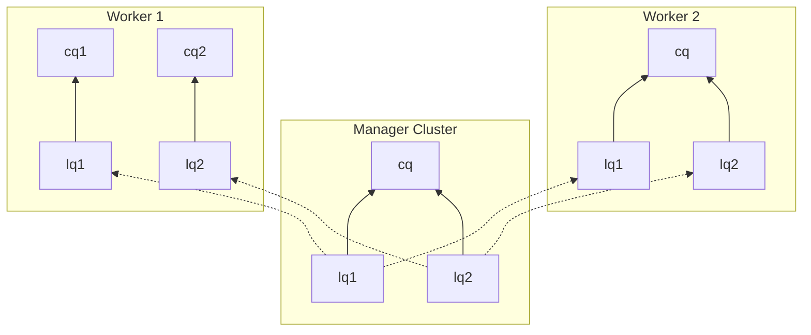

# KEP-9988: MultiKueue Manager Quota Automation

<!-- toc -->
- [Summary](#summary)
- [Motivation](#motivation)
  - [The role of manager quotas](#the-role-of-manager-quotas)
  - [Manager vs. workers separation](#manager-vs-workers-separation)
  - [Goals](#goals)
  - [Non-Goals](#non-goals)
- [Proposal](#proposal)
  - [Example](#example)
  - [User stories](#user-stories)
    - [Story 1](#story-1)
    - [Story 2](#story-2)
    - [Story 3](#story-3)
    - [Story 4](#story-4)
  - [Notes/Constraints/Caveats](#notesconstraintscaveats)
    - [Factors influencing desired manager quota](#factors-influencing-desired-manager-quota)
      - [Potential reasons for increasing manager quota](#potential-reasons-for-increasing-manager-quota)
      - [Potential reasons for decreasing manager quota](#potential-reasons-for-decreasing-manager-quota)
    - [Defining related worker ClusterQueues](#defining-related-worker-clusterqueues)
    - [Treatment of ResourceFlavors](#treatment-of-resourceflavors)
  - [Risks and Mitigations](#risks-and-mitigations)
- [Design details](#design-details)
  - [API surface](#api-surface)
    - [Alpha1 version](#alpha1-version)
    - [Planned changes in Alpha2 version](#planned-changes-in-alpha2-version)
  - [MultiKueue ClusterQueue Reconciler](#multikueue-clusterqueue-reconciler)
  - [MultiKueue Cluster Reconciler](#multikueue-cluster-reconciler)
  - [A note on client usage](#a-note-on-client-usage)
  - [Test Plan](#test-plan)
    - [Unit Tests](#unit-tests)
    - [Integration Tests](#integration-tests)
    - [E2e Tests](#e2e-tests)
  - [Future work ideas](#future-work-ideas)
    - [Move the aggregated quota out of ClusterQueueSpec](#move-the-aggregated-quota-out-of-clusterqueuespec)
    - [Use cached remote clients for low-volume resource kinds](#use-cached-remote-clients-for-low-volume-resource-kinds)
    - [Add a way to adjust the manager-side quota](#add-a-way-to-adjust-the-manager-side-quota)
    - [Change the treatment of ResourceFlavors](#change-the-treatment-of-resourceflavors)
    - [Account for temporarily unavailable workers](#account-for-temporarily-unavailable-workers)
    - [Support MultiKueue cluster role sharing](#support-multikueue-cluster-role-sharing)
  - [Graduation Criteria](#graduation-criteria)
- [Drawbacks](#drawbacks)
- [Alternatives](#alternatives)
  - [Support quota automation for multiple manager-side ResourceFlavors](#support-quota-automation-for-multiple-manager-side-resourceflavors)
  - [Support quota automation for no manager-side ResourceFlavors (auto-create one)](#support-quota-automation-for-no-manager-side-resourceflavors-auto-create-one)
  - [Different handling of many-to-many relationships between manager-side and worker-side ClusterQueues](#different-handling-of-many-to-many-relationships-between-manager-side-and-worker-side-clusterqueues)
  - [Make the <code>MultiKueueManagerQuotaAutomation</code> Condition message more informative](#make-the-multikueuemanagerquotaautomation-condition-message-more-informative)
  - [Take Cohorts into account](#take-cohorts-into-account)
  - [Set the default for <code>QuotaManagement</code> based on the feature gate state](#set-the-default-for-quotamanagement-based-on-the-feature-gate-state)
<!-- /toc -->

## Summary

This KEP outlines the design for automatic management of ClusterQueue quotas on the manager cluster in a MultiKueue setup, based on aggregation of quotas of worker ClusterQueues.

## Motivation

MultiKueue involves **two layers** of Kueue quota management. A MultiKueue workload must first reserve quota on the **manager** cluster in order to be dispatched to (one or more) workers; then it must reserve quota on a **worker** in order to execute there.

### The role of manager quotas

While _worker quotas_ are the _ultimate definition_ of the actual resource availability, the role of _manager quotas_ is subtler, yet still important.

Specifically, manager quotas **may** serve:

* As a **gate-keeping** mechanism, which allows distributing the _scheduling load_ between the manager and the workers. \
  (This may be irrelevant for small MultiKueue setups - but is essential for scalability of the largest ones).

* As a **representation** of resource availability and usage, viewable by the user without connecting to the worker clusters.

Manager quotas are **effectively optional**: when considered not useful, the Batch Admin can effectively disable them by specifying very large values ("infinite quota"). This may work well for smaller setups (and some users actually do this) - but is not recommended generally.

### Manager vs. workers separation

Currently, quota management is **fully separated** between the manager and workers, up to the point that both sides are **unaware** of each other's quotas.

While this approach offers simplicity and network savings, it also leads to problems:

1. For the manager quotas to serve their purposes discussed [above](#the-role-of-manager-quotas), they often must be **maintained in sync** with the worker quotas. \
   (The exact meaning of "in sync" may vary by use case; see [User Story 1](#story-1)). \
   Currently, MultiKueue does not help in this maintenance, making it entirely **user's responsibility**. \
   This is inconvenient and error-prone.

2. For a user to get the overview of actual resource availability and usage across the worker fleet, it is necessary to connect to all worker clusters and aggregate the information on their own.

3. For the MultiKueue controller on the manager cluster, having no awareness of workers' quotas (and their usage) **prevents more effective dispatching** choices. \
   Even though we generally don't want the manager to take over _the whole_ orchestrating work from the workers (as we intend to share it between both sides), some improvements are likely possible. For example, if a workload fits within the quota of worker A but not of worker B, there is no point in dispatching it to B before A. (At least, unless B could admit it through borrowing).

   While designing specific improvements to dispatching is **out of scope** of this KEP, all these improvements require as the **first step** that the manager *knows* workers' quotas, which this KEP proposes. \
   (Then, the second step would be to let the manager *persist* this information. That part is not proposed in this KEP, as it's not needed for its goals; however, it will be proposed in the KEP for issue [#10105](https://github.com/kubernetes-sigs/kueue/issues/10105)).

### Goals

* Make the manager cluster aware of worker quotas.
* Enable automated maintenance of manager quotas to keep them in sync with worker capacity.

### Non-Goals

* Fine-tune manager quota automation for optimal scheduling throughput.
* Expose a central view of resource availability and usage across all workers (tracked in [#10105](https://github.com/kubernetes-sigs/kueue/issues/10105)).
* Improve MultiKueue dispatching.

## Proposal

We will add an **optional** feature of **auto-aggregating quotas** from the workers to the manager.

**When enabled** for a manager ClusterQueue `Q`, this feature will set its quota for a resource `R` according to the following recipe:

1. Determine the set of [related worker ClusterQueues](#defining-related-worker-clusterqueues), i.e. those which can serve the dispatched remotes of the workloads submitted to `Q`.

1. Compute the **sum** of quotas for `R` in **all** _related_ worker ClusterQueues, across **all** ResourceFlavors.

Enabling this feature will be controlled by an API field (not just by a feature gate), as we want to permanently retain a way to opt out (see [User Story 3](#story-3)).

Enabling this feature will **require** that the manager ClusterQueue `Q` has **exactly one ResourceFlavor**. (See [Treatment of ResourceFlavors](#treatment-of-resourceflavors) for rationale).

### Example

Suppose we have a MultiKueue setup with a manager cluster and two worker clusters (`worker1` and `worker2`), using the following configuration for LocalQueues (LQ) and ClusterQueues (CQ):



On `worker1`, both related ClusterQueues are configured with CPU and memory (in `default-flavor`):

*   `cq1`:
    ```yaml
    resourceGroups:
    - coveredResources: ["cpu", "memory"]
      flavors:
      - name: "default-flavor"
        resources:
        - name: "cpu"
          nominalQuota: 6
        - name: "memory"
          nominalQuota: 24Gi
    ```
*   `cq2`:
    ```yaml
    resourceGroups:
    - coveredResources: ["cpu", "memory"]
      flavors:
      - name: "default-flavor"
        resources:
        - name: "cpu"
          nominalQuota: 7
        - name: "memory"
          nominalQuota: 28Gi
    ```

On `worker2`, the related ClusterQueue `cq` handles both `lq1` and `lq2`, and is configured with CPU, memory, and GPU resources:

*   `cq`:
    ```yaml
    resourceGroups:
    - coveredResources: ["cpu", "memory"]
      flavors:
      - name: "default-flavor"
        resources:
        - name: "cpu"
          nominalQuota: 8
        - name: "memory"
          nominalQuota: 32Gi
    - coveredResources: ["nvidia.com/gpu"]
      flavors:
      - name: "gpu-a4"
        resources:
        - name: "nvidia.com/gpu"
          nominalQuota: 5
      - name: "gpu-h100"
        resources:
        - name: "nvidia.com/gpu"
          nominalQuota: 7
    ```

When quota aggregation is enabled on the manager-side ClusterQueue `cq`, the aggregated limits combine all resources from the related worker ClusterQueues (`cq1` and `cq2` on `worker1`, and `cq` on `worker2`), summing their limits across all worker-side flavors:

```yaml
resourceGroups:
- coveredResources: ["cpu", "memory", "nvidia.com/gpu"]
  flavors:
  - name: "default-flavor"
    resources:
    - name: "cpu"
      nominalQuota: 21  // 6 + 7 + 8
    - name: "memory"
      nominalQuota: 84Gi  // 24 + 28 + 32
    - name: "nvidia.com/gpu"
      nominalQuota: 12  // 5 + 7
```

This will work only if:

* `cq` on the manager is configured with a single flavor, and
* The `coveredResources` for this flavor contains all involved resources (CPU, memory and GPU).

### User stories

#### Story 1
As a Batch Admin, I want to maintain manager quotas automatically synced to the sum of total worker quotas to achieve optimal gate-keeping without manual effort.

#### Story 2

As a Batch Admin, I want to keep MultiKueue manager quotas "infinite". 

In my use case, the potential gains from meaningful ("finite") manager quotas are outweighed by the effort of maintaining them in "appropriate sync", or by the cost of missed opportunities to schedule (in case we haven't sufficiently [increased the manager quota](#potential-reasons-for-increasing-manager-quota)).

#### Story 3

As a Batch Admin, I want to keep MultiKueue manager quotas meaningful ("finite") but **not managed** by the feature proposed in this KEP.

This could be because:

* I need multiple manager ResourceFlavors (due to e.g. using a special dispatcher or a heterogenous topology across the workers; see [Treatment of ResourceFlavors](#treatment-of-resourceflavors) for details).

* I want to control the manager quotas manually (e.g. to make them more stable, or less confusing).

#### Story 4

As a Batch Admin using MultiKueue, I want to see the total worker capacity for a manager-side ClusterQueue, without a need to connect to the worker clusters.

### Notes/Constraints/Caveats

#### Factors influencing desired manager quota

While the "baseline approach" (keep manager quota **equal** to total worker quota) is the most intuitive one, there are several reasons for which the user may wish to adjust this.

##### Potential reasons for increasing manager quota

1. **Divergence of quota reservation** between manager and workers - caused e.g. by how MultiKueue design deals with quota fragmentation among the workers.

   For example, suppose there are 2 workers of capacity 10 CPU, and workloads `wl1`, `wl2`, `wl3`, `wl4` of sizes 7, 7, 6, 3 CPU respectively are submitted to the manager (in that order).

   Then, if manager quota is 10+10, `wl3` will block quota on the manager and get stuck on both workers, preventing `wl4` from reserving quota on the manager.

   OTOH, if manager quota is 23 or more, `wl4` will reserve quota on the manager, and get promptly scheduled on one of the workers, with no unnecessary delays.

2. **Divergence of admission** between manager and workers - caused e.g. by issue [#8585](https://github.com/kubernetes-sigs/kueue/issues/8585) or issue [#9338](https://github.com/kubernetes-sigs/kueue/issues/9338).

   In both these issues, it is possible to have a workload which is _admitted_ on the manager but _not admitted_ on _any_ of the workers (and to have such state for a prolonged time). Whenever that happens, a "perfect sync" between manager and workers quotas could lead to under-utilizing worker resources.

   Even when both those issues become closed, the fixes will be placed behind feature gates, making them still observable in the upcoming release.

3. **Borrowing on a worker**. This may raise the effective capacity of a worker CQ beyond its nominal quota. If the manager quota does not account for that, we risk under-utilization.

4. Other reasons _may_ also exist. For example - assuming hypothetically that a user wants to apply different preemption policies on different worker ClusterQueues (e.g. `Never` on one vs. `LowerPriority` on another) - "over-booking quota" on the manager would be the only way to have both policies honored without extra delays.

##### Potential reasons for decreasing manager quota

1. **Stray workloads on a worker**. When a LocalQueue `lq` points to a ClusterQueue `cq`, both on the manager and a worker, there are numerous ways to have a workload admitted to `cq` on a worker but not on the manager:

   * the workload could be submitted directly to `lq` on the worker, "by-passing" MultiKueue;
   * the workload could be submitted to another LocalQueue `lq2` on the worker, where `lq2` also points to `cq` on the worker but is unrelated to MultiKueue;
   * the workload could be submitted to another LocalQueue `lq2` on the worker, while `lq2` exists on the manager but points to another `cq2` with MultiKueue enabled.

   Some users consider such scenarios valid, and expressed a desire to keep a part of the worker capacity reserved for such "stray workloads". In such cases, the manager quota should be accordingly _decreased_.

2. **Per-team quotas on the manager** (strictly speaking, a special case of "stray workloads").

   A Batch Admin may want to maintain a set of per-team manager ClusterQueues in order to specify separate quotas for them (possibly, but not necessarily, including Cohorts and borrowing), while simplifying the worker-side setup to single ClusterQueues representing actual resource availability.

   In this scenario, each manager ClusterQueue should have quota _significantly below_ the total worker quota; we'd rather consider _the sum_ of all manager quotas to be "on par" with total worker quotas (up to all the divergences considered above).

   Nevertheless, some automatic synchronization may be still useful, if equipped with per-team multipliers. For example: "Let the nominal quota for teams A / B / C be respectively defined as 50% / 30% / 20% of the total available worker quota".

#### Defining related worker ClusterQueues

MultiKueue dispatching connects **LocalQueues** by **their names**: for a workload submitted to a LocalQueue `lq1` on the manager, its remotes will be submitted to LocalQueues named `lq1` on the workers. The **ClusterQueue names** on either side are **irrelevant** for this connection.

Therefore, for a given manager ClusterQueue `Q`, the set of **related worker ClusterQueues** is the set `R` defined by the following recipe:

1. Let `N` = the set of names of all manager LocalQueues pointing to `Q`.

2. Let `L` = the set of LocalQueues on all workers whose name belongs to `N`.

3. Let `R` = the set of all ClusterQueues on all workers to which at least one LocalQueue from `L` points.

(For simplicity, we've ignored resource borrowing between ClusterQueues, on either manager or worker side).

#### Treatment of ResourceFlavors

MultiKueue enforces **no relationships** between ResourceFlavors on the manager and worker sides. The flavors on both sides may have different names; they may even be differently grouped into ResourceGroups.

Even if the flavor names on both sides agree, having multiple flavors on the manager side may likely lead to **manager/worker flavor skew**, where a workload could be admitted on flavor A on the manager but on flavor B on a worker (as the manager's flavor assignment has typically no effect on the remotes). As long as such skews can happen, aggregating quotas per flavor would be meaningless.

As a result, multiple flavors on the manager side _should not be needed for most users_. Yet, they still may be needed in some special cases, for example:

* Using a flavor-aware custom MultiKueue dispatcher.
* Using TAS on the workers, with incompatible names of topology levels on different workers.

Our proposal for now is to leave these cases unsupported. (Some other ideas are discussed below, see [here](#change-the-treatment-of-resourceflavors), [here](#support-quota-automation-for-multiple-manager-side-resourceflavors) and [here](#support-quota-automation-for-no-manager-side-resourceflavors-auto-create-one)).

### Risks and Mitigations

The main risks of this proposal are the following:

1. User confusion - the users may be surprised by ClusterQueue quotas being adjusted automatically, without their initiative.

2. Introducing management of ClusterQueue quotas which some users may consider undesired (see [User Story 3](#story-3)).

3. Slowing down MultiKueue by adding more reconcilers and computations.

4. By updating ClusterQueueSpec (cf. [Drawback 1](#drawbacks)), we risk an infinite loop of reconciles in case when the reconcile logic fails to be idempotent.

For these, we propose the following mitigations:

* Risk 1 is mitigated by a dedicated ClusterQueue condition, explaining the automation process.

* Risks 1 and 2 are mitigated by introducing a feature gate and the opt-in/opt-out API. \
  This also mitigates Risk 3, as long as we pay attention to skip computations which are not necessary per the ClusterQueue configuration.

* Risk 3 is considered low. If needed, it can be substantially mitigated by caching the relevant information.

* Risk 4 exists only in the Alpha1 phase, where the main mitigation is hiding the feature behind a feature gate. For Alpha2, we plan redesigning the feature to eliminate this risk; see [here](#move-the-aggregated-quota-out-of-clusterqueuespec).

## Design details

### API surface

#### Alpha1 version

The configuration for this feature will be added to the existing `MultiKueueConfig` struct. (For context, `MultiKueueConfig` objects are referenced from `AdmissionCheckSpec` as [`Parameters`](https://github.com/kubernetes-sigs/kueue/blob/24209c461b72fd6519581aca2234fb8f05dd1ce7/apis/kueue/v1beta2/admissioncheck_types.go#L60); this will allow controlling the feature independently for each ClusterQueue in the manager cluster).

```go
type MultiKueueConfigSpec struct {
   // ...

   // quotaManagement specifies the management of ClusterQueue quotas 
   // in the manager cluster. 
   // Supported modes:
   // - `Manual`: Quota automation is manual.
   // - `Automated`: Quota automation is enabled (provided that the MultiKueueManagerQuotaAutomation feature gate is enabled).
   // If unspecified, defaults to `Manual`.
   QuotaManagement *MultiKueueConfigQuotaManagementMode
}

type MultiKueueConfigQuotaManagementMode string

const (
   QuotaManagementManual MultiKueueConfigQuotaManagementMode = "Manual"
   QuotaManagementAutomated  MultiKueueConfigQuotaManagementMode = "Automated"
)
```

The status of the feature will be communicated by a new Condition added to ClusterQueueStatus. The Condition will be present in all ClusterQueues enrolled in MultiKueue.

When quota automation is requested and supported, the condition will look like this:

```yaml
type: MultiKueueManagerQuotaAutomation
status: True
reason: QuotaAutomated
message: ClusterQueue quota is automatically managed based on MultiKueue workers.
lastTransitionTime: 2026-01-01T00:00:00Z
```

where `lastTransitionTime` only tracks changes affecting the Condition `status` and `message` (i.e. feature enablement, potential errors) but **not** subsequent quota updates. (See [this section](#make-the-multikueuemanagerquotaautomation-condition-message-more-informative) in Alternatives).

When quota automation is not requested, the condition will look like this:

```yaml
type: MultiKueueManagerQuotaAutomation
status: False
reason: NotRequested
message: MultiKueue manager quota automation has not been requested.
lastTransitionTime: 2026-01-01T00:00:00Z
```

Enabling quota automation will be subject to a **constraint** that:

* The manager ClusterQueue has exactly one ResourceFlavor.
* Also, the `coveredResources` of the ResourceGroup containing that flavor must contain all resources which appear in the quotas of any related worker ClusterQueue.

This constraint will **not** be enforced via validation (e.g. a webhook) but by Kueue controllers code (similarly to [analogous existing AdmissionCheck-related constraints](https://github.com/kubernetes-sigs/kueue/blob/6163e91e5a62befbdd421097fe0ec38b37d406e0/pkg/cache/scheduler/clusterqueue.go#L284-L307), evaluated in the core ClusterQueue controller). A violation of this new constraint will **not** make the ClusterQueue Inactive (as is the case for the existing analogous constraints). In this case of a violation, the queue itself will be still operational, just not supportable by the quota automation feature. This will be communicated as an error of that feature, by its status Condition, for example:

```yaml
type: MultiKueueManagerQuotaAutomation
status: False
reason: UnsupportedConfiguration
message: MultiKueue manager quota automation does not support ClusterQueues with multiple ResourceFlavors.
lastTransitionTime: 2026-01-01T00:00:00Z
```

#### Planned changes in Alpha2 version

Starting from Alpha2 version, we plan to introduce a **new field** in ClusterQueueStatus (provisionally named `effectiveResourceGroups`), which would act as the **new source of truth** about a ClusterQueue capacity (taking over that role from `.spec.resourceGroups`). This is discussed in more detail in [this future work idea](#move-the-aggregated-quota-out-of-clusterqueuespec).

While this move is mostly independent from the [API for Alpha1](#alpha1-version), it may lead to some slight changes in that API:

* We may decide to move the `.quotaAutomation` field from MultiKueueConfig to ClusterQueueSpec.
* We may make the `MultiKueueManagerQuotaAutomation` Condition more informative, or at least let its `lastTransitionTime` track the time of the most recent quota adjustment.

### MultiKueue ClusterQueue Reconciler

We will introduce a new reconciler for manager-side ClusterQueue objects. Reconciling a manager ClusterQueue `Q` will proceed as follows:

1. **Verify enablement:** Fetch `Q`, its associated MultiKueue AdmissionCheck, and MultiKueueConfig. Verify that quota automation is requested and supported (e.g., `Q` must have exactly one ResourceFlavor).

2. **Update the Condition:** If needed, update the `MultiKueueManagerQuotaAutomation` status Condition.

3. **Aggregate quotas:** Find all [related worker ClusterQueues](#defining-related-worker-clusterqueues). Sum their quotas and update `Q`'s quotas accordingly.

The reconciler will be triggered by:
* **Manager events:** Creation, deletion, or relevant updates to ClusterQueues, LocalQueues, AdmissionChecks, MultiKueueConfigs and MultiKueueClusters.
* **Remote events:** Propagated from the [MultiKueue Cluster Reconciler](#multikueue-cluster-reconciler) when remote LocalQueues or ClusterQueues change.

### MultiKueue Cluster Reconciler

In `multikueuecluster.go`, we will add watches on remote clusters for **LocalQueue** and **ClusterQueue** events. When any of those change, we will find all [related manager ClusterQueues](#defining-related-worker-clusterqueues), and trigger the [MultiKueue ClusterQueue Reconciler](#multikueue-clusterqueue-reconciler) for each of them.

### A note on client usage

In the above reconcilers, we generally intend to happily tolerate K8s client calls, without introducing any custom caching.

This is because:

1. Local clients are already cached.
2. Remote calls will be made only for "memory-light" resource kinds (LocalQueues and ClusterQueues), which typically do not exist in large numbers.
3. The reconcilers involved are not expected to run frequently.

Item 3 may not hold if worker clusters use any tooling (external to Kueue) for automated management of their queue quotas. If this is ever observed, we may need to optimize, e.g. by [caching our remote calls](#use-cached-remote-clients-for-low-volume-resource-kinds).

### Test Plan

[x] I/we understand the owners of the involved components may require updates to
existing tests to make this code solid enough prior to committing the changes necessary
to implement this enhancement.

#### Unit Tests

* Test the reconcile logic with all exit paths.
* Test all additional triggering paths from local watchers.

#### Integration Tests

* Test triggering the MultiKueue ClusterQueue reconciler by changes in remote LocalQueues and ClusterQueues.

#### E2e Tests

* Test the scenario of a ClusterQueue having quota automation disabled -> then enabled (and reacting to some change) -> then disabled.
* Verify that manager quota auto-adjustments promptly trigger the expected re-assignments of Workloads.

### Future work ideas

#### Move the aggregated quota out of ClusterQueueSpec

While the goal of this feature is to automatically control manager-side quotas, which are specified in ClusterQueueSpec per the current Kueue behavior, it may be considered a design smell, as explained in [Drawback 1](#drawbacks).

For the Alpha2 phase, we intend to eliminate this drawback by redesigning the general Kueue contracts of handling ClusterQueue quotas. The general idea is as follows:

1. Introduce a new field in ClusterQueueStatus, named e.g. `effectiveResourceGroups`. \
   This field will be the **source of truth** about the quotas, replacing `.spec.resourceGroups` throughout the existing logic.
2. When quota automation is **disabled**, the Kueue core ClusterQueue controller will just copy `.spec.resourceGroups` to `.status.effectiveResourceGroups`.
   * Later on, this syncing may become non-trivial, e.g. to implement [KEP-8826](https://github.com/kubernetes-sigs/kueue/pull/8864).
3. When quota automation is **enabled**, the Kueue core ClusterQueue controller will hand over managing `.status.effectiveResourceGroups` to the MultiKueue ClusterQueue controller, which will aggregate quotas as outlined in this KEP.
4. To avoid confusion, we'll **require** that CQs with quota automation enabled must have the `.spec.resourceGroups` field cleared (by the user).
   * *Why* do this? Otherwise, we'd need to ignore `.spec.resourceGroups`, breaking the current Kueue contracts.
   * *How* do this? There are 2 feasible strategies:
     * Move `QuotaManagement` to ClusterQueueSpec and introduce a strict (kubebuilder) validation rule
     * Keep `QuotaManagement` in MultiKueueConfig and make a ClusterQueue `Inactive` when the constraint is violated.

We **postpone** this to Alpha2 in order to earn more time for carefully planning the API changes, and considering risks related to cross-version compatibility.

Yet, we plan to deliver an Alpha1 version even before that happens - because the core functionality (managing quotas and workloads in MultiKueue) is going to be unaffected.

#### Use cached remote clients for low-volume resource kinds

Currently, the MultiKueue controllers use cached K8s clients for local (manager-side) resources but uncached clients for remote resources. Just enabling cache for remote clients does feel risky, as it could use much memory for Workloads and supported job kinds (which can exist in large numbers).

However, the remote API calls introduced in this KEP involve only "memory-light" resource kinds (LocalQueues and ClusterQueues), for which caching would pose no risk, while avoiding duplication in some cases. \
(In case of a [many-to-many relation](#defining-related-worker-clusterqueues) between manager-side and worker-side ClusterQueues, a change of worker-side `Q'` would trigger reconciles of multiple manager-side ClusterQueues, each of which would make the same remote API `.List()` calls, almost simultaneously).

Then, it seems a promising optimization to cache remote clients _only for selected resource kinds_. \
This could be implemented by equipping the internal [`remoteClient` structure](https://github.com/kubernetes-sigs/kueue/blob/76676f599fc87883156c81516ea91b9b65cc70fd/pkg/controller/admissionchecks/multikueue/multikueuecluster.go#L91-L109) with **two** API clients, the old uncached one (to be used for Workloads etc.), and a new cached one (to be used for LocalQueues etc.). To ensure proper choices among them, both could be wrapped with tiny facades throwing on calls for resource kinds outside an allowlist.

We postpone this as doing it right may still involve some complexity. For example, it's not clear how to avoid duplicating API watches (see item 3 in the description of [#10629](http://github.com/kubernetes-sigs/kueue/issues/10629)).

#### Add a way to adjust the manager-side quota

As explained in [Factors influencing desired manager quota](#factors-influencing-desired-manager-quota), some users may want to keep their manager-side quota higher or lower than the sum of worker quotas. A configurable **quota multiplier** seems robust enough to address most use cases.

Our initial idea was to let it affect the manager-side `nominalQuota`; however, that was considered confusing by most reviewers. 

Another option is to re-use the concept of "effective quota", or "accessible quota" in terms of [KEP-8826](https://github.com/kubernetes-sigs/kueue/pull/8864); that is, leave `nominalQuota` unchanged but apply the mulitplier on the level of "accessible quota" which would be the one actually enforced. This would allow to keep `nominalQuota` serving [User Story 4](#story-4) while letting the multiplier affect the actual dispatching behavior.

This may combine well with the idea of [moving aggregated quotas out of ClusterQueueSpec](#move-the-aggregated-quota-out-of-clusterqueuespec).

#### Change the treatment of ResourceFlavors

While the proposed treatment of flavors (require a single flavor on the manager; aggregate all worker quotas into it) is the simplest one which avoids the [issue of manager/worker flavor skew](#treatment-of-resourceflavors), it may be too simplistic for some use cases involving _mutually exclusive_ flavors on the workers (e.g. CPU-only vs. GPU-only, or TAS flavors based on mutually incompatible topologies). In those cases, the flavor skew can't occur; on the other hand, a single manager-side flavor combining all the worker flavors could be misleading, or even impossible to define.

To handle such cases well, without introducing confusion in the other cases, we'd need roughly to:

- capture the "mutually exclusive" relationship among ResourceFlavors with a strict definition;
- replace the constraint guarding quota automation with a more complex one, in the spirit of "there is exactly one manager-side flavor _per equivalence class of non-mutually-exclusive flavors_".

Then, on top of that, we could consider auto-creating missing manager flavors, per such "equivalence classes".

This seems promising but needs more discussion and research of use cases to hammer out the details.

This may combine well with the idea of [moving aggregated quotas out of ClusterQueueSpec](#move-the-aggregated-quota-out-of-clusterqueuespec): for example, we could do the following:

* Let `.status.effectiveResourceGroups` contain quotas aggregated **separately** per each worker-side flavor. \
  (Possibly breaking some flavor-related constraints that currently exist for `.spec.resourceGroups` - but we could relax those constraints on the `.status` side).
* Internally (for the purpose of manager-side flavor assignment), treat `.status.effectiveResourceGroups` **as if** it was aggregated into a single flavor.
  (Thus eliminating the risk of manager/worker flavor skew, and removing the need for the flavor-related constraints).

#### Account for temporarily unavailable workers

When a worker cluster becomes unreachable (e.g. due to network issues), its admitted workloads are still considered admitted on the manager side, until `workerLostTimeout` expires. On the other hand, our proposed approach for determining total worker-side quotas (relying on fetching `nominalQuota` from all workers) will not include quotas of any disconnected worker clusters. 

This discrepancy may lead to temporary under-utilization of the fleet resources. For example, if there are 3 workers, each with 10 CPU capacity, and we're running a single workload, consuming 7 CPU, on `worker1` which gets disconnected, then the manager ClusterQueue will have its `nominalQuota` set to 20, with 7 of that already used, leaving just 13 CPU for new workloads on `worker2` and `worker3` which are both empty.

To cover for that, we could increase the manager-side quota by the sum of requests of all workloads which are admitted on the manager but their assigned worker clusters have remote clients which are currently `.connecting`. (Notably, all this info is available on the manager side, without querying the workers).

We postpone this because it adds some complexity, and the impact feels minor.

#### Support MultiKueue cluster role sharing

Issue [#5704](https://github.com/kubernetes-sigs/kueue/issues/5704) aims at allowing a MultiKueue manager to act as one of its own workers. While the detailed plan for that is not yet ready, it's likely to interfere with this KEP in some way, depending on the future of the [definition of the manager/worker ClusterQueue relation](#defining-related-worker-clusterqueues):

* If that definition is changed (as proposed e.g. [here](https://github.com/kubernetes-sigs/kueue/issues/5704#issuecomment-4401615443)), the quota automation feature will need to be adjusted accordingly.

* If that definition remains unchanged, then a manager-side ClusterQueue `Q` will potentially become a *worker ClusterQueue related to itself*, thus making our "quota aggregation" ill-defined.

### Graduation Criteria

* **Alpha1:**
  * The feature implemented behind the `MultiKueueManagerQuotaAutomation` feature gate, disabled by default.
  * Execution of the newly introduced API calls (local & remote) is guarded by feature gates.
  * Tests are implemented.

* **Alpha2:**
  * The API has been updated to avoid auto-updating ClusterQueueSpec. (See [Drawback 1](#drawbacks) and [this improvement idea](#move-the-aggregated-quota-out-of-clusterqueuespec)).

* **Beta:**
  * The feature gate is enabled by default.
  * User documentation is published on the website.
  * The feature is mentioned in the release notes, in particular mentioning how to opt out.
  * The feature has been successfully used in a production environment.
  * [Future work ideas](#future-work-ideas) have been reconsidered, based on any newly gathered feedback.
  * No warning signs on performance were seen (in particular, no news of any external automation of worker ClusterQueue quotas) - or, if any were, they have been addressed.

* **Stable:**
  * The feature (offered functionality, API surface and implementation) has stabilized, without raising concerns.
  * The feature gate is locked to `true` (and then cleaned up in a later release).

## Drawbacks

Besides introducing some risks (see [Risks and Mitigations](#risks-and-mitigations)), the proposed solution feels suboptimal mostly in the following ways:

1. We allow Kueue to modify `spec` of objects it's supposed to reconcile (specifically, ClusterQueues).
   This may be perceived as a design smell because:

   * It blurs the line between configuration (managed by users) and state (managed by controllers).
   * It brings a risk of an infinite reconciling loop (see [Risk 4](#risks-and-mitigations)).

   While we propose accepting this drawback for Alpha1, our plan for Alpha2 is to eliminate this drawback by [this follow-up idea](#move-the-aggregated-quota-out-of-clusterqueuespec).

2. We have fully ignored the topic of Cohorts, shared quota and quota borrowing. This is deliberate, and intended to retain any reasonable simplicity of the feature, at least in the Alpha stage. (See [Take Cohorts into account](#take-cohorts-into-account) in the Alternatives section).

## Alternatives

### Support quota automation for multiple manager-side ResourceFlavors

The proposed constraint that quota automation requires a single ResourceFlavor on the manager side may feel inconvenient, or counter-intuitive.

**Reasons for discarding**

* Aggregating quotas per ResourceFlavor is generally risky due to the possibility of manager/worker flavor skews, as explained [here](#treatment-of-resourceflavors).

* Even if we introduced an enforced alignment of flavor assignments between the manager and workers (to address the above risk), this would open a new set of difficult questions:

  * Who decides on the flavor assignment: manager or worker(s)? 
  * What if the flavors setup is changed on one of the workers? Should we re-arrange manager flavors accordingly?
  * What if the flavors setup is conflicting across the workers, so that no compatible manager-side arrangement exists? \
    (For example, worker1 has `flavorA` covering `cpu` and `flavorB` covering `memory` while worker2 has only `flavorA` covering both. A "naive aggregation" on the manager would produce `flavorA` covering both and `flavorB` covering just `memory`, which is invalid inside `.Spec.ResourceGroups` of a ClusterQueue).

* This direction can make sense in some special cases (as discussed in [this follow-up idea](#change-the-treatment-of-resourceflavors)); yet, this is postponed as it requires more deep thought.

### Support quota automation for no manager-side ResourceFlavors (auto-create one)

In the case when a user creates a MultiKueue setup with quota automation enabled right away, as we'll intend to auto-maintain quotas in a single ResourceFlavor, it may seem "nicest" for the user to let them skip that flavor altogether in their ClusterQueueSpec. (A bit surprisingly, the current validation rules allow `.Spec.ResourceGroups` to be empty).

Then, we could auto-create a single ResourceFlavor, with quotas determined by automation - thus saving user's time for typing a few more lines of YAML configs.

**Reasons for discarding/deferring**

This would become problematic in combination with TAS. Supporting TAS workloads requires the manager-side ResourceFlavor to be compatible with the worker-side TAS levels. Therefore, automatic setup of manager-side ResourceFlavor would need to either leave TAS use cases unsupported (which feels poor) or fetch topology setups from the workers (leading to questions how to deal with any inconsistencies between them). This feels overly complex, at least for the start.

### Different handling of many-to-many relationships between manager-side and worker-side ClusterQueues

The "MultiKueue relationship" between manager-side and worker-side ClusterQueues may be in general [many-to-many](#defining-related-worker-clusterqueues), and our proposal of handling it (for a manager-side ClusterQueue `Q`, rely on the _sum_ of quotas of _all_ related worker ClusterQueues) may lead to _distorting the totals_ between the manager and the workers, which may be perceived as misleading.

We've considered 2 ways to work around that:

1. Restrict quota automation support to cases when LocalQueue -> ClusterQueue bindings are compatible between the manager and all workers, so that the considered relationship becomes one-to-one. \
   (In all the other cases, we could refuse to automate, and communicate it via the `MultiKueueManagerQuotaAutomation` Condition).

2. For each worker-side ClusterQueue `Q'` [related](#defining-related-worker-clusterqueues) to multiple manager-side ClusterQueues, split the quota `Q'` into parts "attributed" to each of them. \
   (Likely in a way honoring the Admission Fair Sharing weights on the worker clusters).

**Reasons for discarding/deferring**

* Option 1 leaves reasonable use cases without support, e.g. the per-team manager ClusterQueue setup described [here](#potential-reasons-for-decreasing-manager-quota).

* Option 2 may be more accurate in describing the _admitting potential_ of manager ClusterQueues in case of _omnipresent scarcity_ of resources. \
  However, it fails to describe the _upper bound_ of what can be admitted to a specific manager ClusterQueue, which feels incorrect, and potentially leading to scheduling delays.


### Make the `MultiKueueManagerQuotaAutomation` Condition message more informative

The Condition message could include specific numbers to help the user understand quota calculation, e.g.

```yaml
message: ClusterQueue quota is automatically managed based on MultiKueue workers. Applying total worker capacity (cpu: 10, memory: 25Gi) with a 3x buffer multiplier.
lastTransitionTime: 2026-01-01T00:00:00Z
```

Correspondingly, `lastTransitionTime` would track the last moment when such a richer message changed, effectively indicating when the last automatic adjustment of the ClusterQueue quota happened.

**Reasons for discarding/deferring**

In **Alpha1**, we are hit by the restriction that the ClusterQueue quotas (part of `.Spec`) and Conditions (part of `.Status`) cannot be updated simultaneously. Thus, every auto-adjustment of quotas would introduce a short-lived divergence between the Condition and the actual quotas, also at the level of specific numbers. This would bring a risk of user confusion, of at least two kinds:

* A "sufficiently atomic" snapshot of cluster content might reveal a ClusterQueue's `.Status` inconsistent with its `.Spec` (for example, nominal quota being 50 CPU while the Condition claiming it's "20 CPU with a 3x multiplier").

* The Condition's `lastTransitionTime` would become somewhat misleading in one way or another. \
  (That is, it will necessarily diverge either from the actual quota change time or from the Condition update time, as these two times will differ. Each choice may be perceived as confusing).

Starting from **Alpha2**, the above issues will no longer apply, as quota automation will no longer update ClusterQueueSpec. This will unblock equipping the status Condition with more info.

**A takeaway for the Alpha1 approach**

While our proposed Alpha1 design does not _fully eliminate_ the above inconsistencies (when enabling quota automation for a pre-existing ClusterQueue, we'll still need to update the quota and the Condition _separately_, in some order), it decreases its frequency, and makes it less confusing. \
In particular, if we choose to update the Condition before the quota, the intermediate state can be still interpreted as the Condition saying "quota management has been [just] enabled [but hasn't yet managed to act]", which may be considered legitimate.

### Take Cohorts into account

When a ClusterQueue belongs to a Cohort, it may reserve quota above its nominal capacity, by using _shared Cohort quota_ (Cohort's `.nominalQuota`) or by _borrowing_.

If this happens on the worker side, it clearly influences the actual capacity of a ClusterQueue, and thus could be _somehow_ taken into account in the calculation of "total quota".

**Reasons for discarding/deferring**

There are many difficulties in defining the desired behavior. Example questions:

* What if the whole picture of "LocalQueue -> ClusterQueue -> Cohort -> ancestor Cohort" bindings is fully compatible between the manager and all workers? \
  Should we then aggregate `nominalQuota` from worker-side Cohorts to the corresponding manager-side Cohorts?

  * If so, how do we handle setups which are "incompatible", or "partially compatible"? \
    Do we want to support quota automation for _some resources_ in a case of _partial compatibility_?

  * Even assuming "full compatibility" in the above sense, the result could be considered confusing, due to possible per-workload inconsistencies (e.g. a ClusterQueue could borrow from one sibling on the manager but from another one on a worker, or it could use shared Cohort quota on the worker but not on the manager). \
    Do we accept this?

* What if Cohorts exist only on the workers, or are "badly incompatible" between the workers? \
  Are we fine with increasing `nominalQuota` of manager-side ClusterQueues to reflect the shared Cohort quota on the workers?

  * If so, how should we "attribute" the additional quota among different ClusterQueues? \
    For example:

    * Suppose there's a manager and 2 workers, which all have `lq1`, `lq2`, `lq3`, pointing to ClusterQueues `cq1`, `cq2`, `cq3` respectively. \
      Also suppose both workers have a Cohort `coh1`, to which all those ClusterQueues belong. \
      `coh1` declares a shared `nominalQuota` of 30 CPU. \
      Shall this count as:

      - extra 30 CPU for each of the manager-side ClusterQueues (to reflect the actual upper bound of what can run on them)?
      - extra 10 CPU for each of them (so that "manager's total matches all workers' total")?
      - extra CPU values summing up to 30 CPUs but proportional to the fair sharing weights?

      (While the later options may feel more appealing, keep in mind that the goal of "matching totals" is generally cumbersome to achieve even without supporting Cohorts; see [here](#different-handling-of-many-to-many-relationships-between-manager-side-and-worker-side-clusterqueues)).

    * Now suppose `lq3` and `cq3` don't exist on the manager; should this influence how the quotas for `cq1` and `cq2` are determined?

    * How should we handle [many-to-many relationships](#defining-related-worker-clusterqueues) between manager-side and worker-side ClusterQueues? \
      (Warning: this is [not obvious even when disregarding Cohorts](#different-handling-of-many-to-many-relationships-between-manager-side-and-worker-side-clusterqueues), and adding Cohorts to the picture adds to the complexity of this question).

    * How should we handle incompatible Cohort trees across workers? \
      (This might have a simpler answer: just do the "attribution", whichever way we define it, separately on each worker, and add up the results. Still, it deserves some consideration if the result is acceptable. One alternative would be to refuse to handle such cases).

* Should `borrowingLimit` and `lendingLimit` be aggregated from worker-side ClusterQueues to the [related](#defining-related-worker-clusterqueues) manager-side ClusterQueues?

  * If yes, what should we do if that relationship is many-to-many?

* How should we manage quota automation enablement for Cohorts if it may diverge for the underlying ClusterQueues?

### Set the default for `QuotaManagement` based on the feature gate state

Intuitively, doing so is appealing. MultiKueue documentation already recommends maintaining ClusterQueue quotas in sync with the workers' total, so by defaulting `QuotaManagement` to `Automated` we'd just make the users follow that recommendation by default (still leaving a way to opt out).

**Reasons for discarding/deferring**

Once `Automated` becomes the default, we'll break backward compatibility.

Specifically, when a user creates a ClusterQueue with non-trivial nominal quotas (in `Spec`), and leaves `QuotaManagement` unset, quota automation would lead (depending on the status of the [effective quotas follow-up idea](#move-the-aggregated-quota-out-of-clusterqueuespec)) to either of:

- overwriting nominal quotas with new values,
- silently ignoring nominal quota values,
- making the ClusterQueue `Inactive`,
- rejecting such a config via a validation webhook

where each choice would break the existing v1beta2 contract. Therefore, defaulting to `Automated` can only happen in v1beta3.

While making such a change may be still desired, this is not tightly bound to the lifecycle of the feature gate, and hence out of scope of this KEP.
